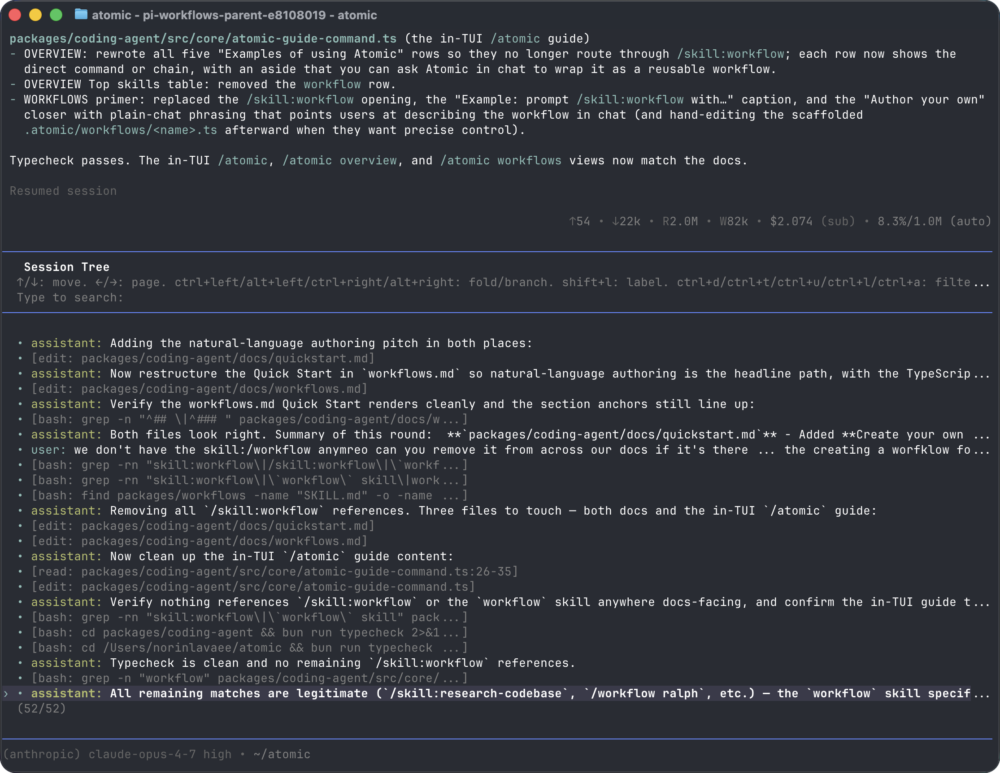

> Atomic fork note: this package is vendored from pi's `packages/coding-agent` and rebranded via `package.json` as `@bastani/atomic`, CLI binary `atomic`, `piConfig.name = "atomic"`, and `piConfig.configDir = ".atomic"`.

<p align="center">
  <a href="https://pi.dev">
    
  </a>
</p>
<p align="center">
  <a href="https://discord.com/invite/3cU7Bz4UPx"></a>
  <a href="https://www.npmjs.com/package/@bastani/atomic"></a>
</p>
> New issues and PRs from new contributors are auto-closed by default. Maintainers review auto-closed issues daily. See [CONTRIBUTING.md](../../CONTRIBUTING.md).

---

Atomic is a minimal terminal coding harness. Adapt Atomic to your workflows, not the other way around, without having to fork and modify Atomic internals. Extend it with TypeScript [Extensions](#extensions), [Skills](#skills), [Prompt Templates](#prompt-templates), and [Themes](#themes). Put your extensions, skills, prompt templates, and themes in [Atomic Packages](#atomic-packages) and share them with others via npm or git.

Atomic ships with powerful defaults plus first-party bundled extensions for workflows, subagents, MCP, web access, and intercom. You can still adapt or replace any workflow by writing extensions, skills, prompt templates, themes, or Atomic packages that match how you work.

Atomic runs in four modes: interactive, print or JSON, RPC for process integration, and an SDK for embedding in your own apps. See [openclaw/openclaw](https://github.com/openclaw/openclaw) for a real-world SDK integration.

## Share your OSS coding agent sessions

If you use Atomic for open source work, consider sharing coding-agent sessions using an Atomic-owned workflow or your team's dataset process.

Public OSS session data can help improve models, prompts, tools, and evaluations using real development workflows. Upstream Pi session-sharing resources may still be useful for historical context, but they are not the primary Atomic publication path.

## Table of Contents

- [Quick Start](#quick-start)
- [Providers & Models](#providers--models)
- [Interactive Mode](#interactive-mode)
  - [Editor](#editor)
  - [Commands](#commands)
  - [Keyboard Shortcuts](#keyboard-shortcuts)
  - [Message Queue](#message-queue)
- [Sessions](#sessions)
  - [Branching](#branching)
  - [Compaction](#compaction)
- [Settings](#settings)
- [Context Files](#context-files)
- [Customization](#customization)
  - [Prompt Templates](#prompt-templates)
  - [Skills](#skills)
  - [Extensions](#extensions)
  - [Themes](#themes)
  - [Atomic Packages](#atomic-packages)
- [Programmatic Usage](#programmatic-usage)
- [Philosophy](#philosophy)
- [CLI Reference](#cli-reference)

---

## Quick Start

```bash
bun install -g @bastani/atomic
```

Or with npm:

```bash
npm install -g @bastani/atomic
```

Authenticate with an API key:

```bash
export ANTHROPIC_API_KEY=sk-ant-...
atomic
```

Or use your existing subscription:

```bash
atomic
/login  # Then select provider
```

Then just talk to Atomic. By default, Atomic gives the model six coding tools: `read`, `write`, `edit`, `bash`, `find`, and `search`. The model uses these to fulfill your requests. `read`, `search`, `write`, and successful `edit` calls emit session-scoped hashline anchors (`[path#TAG]` plus `LINE:text`) so the model can make stale-safe line edits; see [docs/tools.md](docs/tools.md). Add capabilities via [skills](#skills), [prompt templates](#prompt-templates), [extensions](#extensions), or [Atomic packages](#atomic-packages).

**Platform notes:** [Windows](docs/windows.md) | [Termux (Android)](docs/termux.md) | [tmux](docs/tmux.md) | [Terminal setup](docs/terminal-setup.md) | [Shell aliases](docs/shell-aliases.md)

---

## Providers & Models

For each built-in provider, Atomic maintains a list of tool-capable models, updated with every release. Authenticate via subscription (`/login`) or API key, then select any model from that provider via `/model` (or CTRL+L).

**Subscriptions:**
- Anthropic Claude Pro/Max
- OpenAI ChatGPT Plus/Pro (Codex)
- GitHub Copilot

**API keys:**
- Anthropic
- OpenAI
- Azure OpenAI
- DeepSeek
- Google Gemini
- Google Vertex
- Amazon Bedrock
- Mistral
- Groq
- Cerebras
- Cloudflare AI Gateway
- Cloudflare Workers AI
- xAI
- OpenRouter
- Vercel AI Gateway
- ZAI
- OpenCode Zen
- OpenCode Go
- Hugging Face
- Fireworks
- Together AI
- Kimi For Coding
- MiniMax
- Xiaomi MiMo
- Xiaomi MiMo Token Plan (China)
- Xiaomi MiMo Token Plan (Amsterdam)
- Xiaomi MiMo Token Plan (Singapore)

See [docs/providers.md](docs/providers.md) for detailed setup instructions.

**Custom providers & models:** Add providers via `~/.atomic/agent/models.json` (legacy `~/.pi/agent/models.json` also works) if they speak a supported API (OpenAI, Anthropic, Google). For custom APIs or OAuth, use extensions. See [docs/models.md](docs/models.md) and [docs/custom-provider.md](docs/custom-provider.md).

---

## Interactive Mode

<p align="center"></p>

The interface from top to bottom:

- **Startup header** - Shows shortcuts (`/hotkeys` for all), loaded AGENTS.md files, prompt templates, skills, and extensions
- **Messages** - Your messages, assistant responses, tool calls and results, notifications, errors, and extension UI
- **Editor** - Where you type; border color indicates thinking level
- **Footer** - Working directory, session name, total token/cache usage, cost, context usage, current model

The editor can be temporarily replaced by other UI, like built-in `/settings` or custom UI from extensions (e.g., a Q&A tool that lets the user answer model questions in a structured format). [Extensions](#extensions) can also replace the editor, add widgets above/below it, a status line, custom footer, or overlays.

### Editor

| Feature | How |
|---------|-----|
| File reference | Type `@` to fuzzy-search project files |
| Path completion | Tab to complete paths |
| Multi-line | SHIFT+Enter (or CTRL+Enter on Windows Terminal) |
| Images | CTRL+V to paste (ALT+V on Windows), or drag onto terminal |
| Bash commands | `!command` runs and sends output to LLM, `!!command` runs without sending |

Standard editing keybindings for delete word, undo, etc. See [docs/keybindings.md](docs/keybindings.md).

### Commands

Type `/` in the editor to trigger commands. [Extensions](#extensions) can register custom commands, [skills](#skills) are available as `/skill:name`, and [prompt templates](#prompt-templates) expand via `/templatename`.

| Command | Description |
|---------|-------------|
| `/login`, `/logout` | OAuth authentication |
| `/model` | Switch models |
| `/scoped-models` | Enable/disable models for CTRL+P cycling |
| `/settings` | Thinking level, theme, message delivery, transport |
| `/resume` | Pick from previous sessions |
| `/new` | Start a new session |
| `/name <name>` | Set session display name |
| `/session` | Show session info (file, ID, messages, tokens, cost) |
| `/tree` | Jump to any point in the session and continue from there |
| `/fork` | Create a new session from a previous user message |
| `/clone` | Duplicate the current active branch into a new session |
| `/compact` | Delete safe older transcript objects verbatim |
| `/copy` | Copy last assistant message to clipboard |
| `/export [file]` | Export session to HTML file |
| `/share` | Upload as private GitHub gist with shareable HTML link |
| `/reload` | Reload keybindings, extensions, skills, prompts, and context files (themes hot-reload automatically) |
| `/hotkeys` | Show all keyboard shortcuts |
| `/changelog` | Display version history |
| `/exit` | Exit Atomic |
| `/quit` | Quit Atomic |

### Keyboard Shortcuts

See `/hotkeys` for the full list. Customize via `~/.atomic/agent/keybindings.json` (legacy `~/.pi/agent/keybindings.json` also works). See [docs/keybindings.md](docs/keybindings.md).

**Commonly used:**

| Key | Action |
|-----|--------|
| CTRL+C | Clear editor |
| CTRL+C twice | Quit |
| Escape | Cancel/abort |
| Escape twice | Open `/tree` |
| CTRL+L | Open model selector |
| CTRL+P / SHIFT+CTRL+P | Cycle scoped models forward/backward |
| SHIFT+Tab | Cycle thinking level |
| CTRL+O | Collapse/expand tool output |
| CTRL+T | Collapse/expand thinking blocks |

### Message Queue

Submit messages while the agent is working:

- **Enter** queues a *steering* message, delivered after the current assistant turn finishes executing its tool calls
- **ALT+Enter** queues a *follow-up* message, delivered only after the agent finishes all work
- **Escape** aborts and restores queued messages to editor
- **ALT+Up** retrieves queued messages back to editor

On Windows Terminal, `ALT+Enter` is fullscreen by default. Remap it in [docs/terminal-setup.md](docs/terminal-setup.md) so Atomic can receive the follow-up shortcut.

Configure delivery in [settings](docs/settings.md): `steeringMode` and `followUpMode` can be `"one-at-a-time"` (default, waits for response) or `"all"` (delivers all queued at once). `transport` selects provider transport preference (`"sse"`, `"websocket"`, or `"auto"`) for providers that support multiple transports.

---

## Sessions

Sessions are stored as JSONL files with a tree structure. Each entry has an `id` and `parentId`, enabling in-place branching without creating new files. See [docs/session-format.md](docs/session-format.md) for file format.

### Management

Sessions auto-save to `~/.atomic/agent/sessions/` organized by working directory (legacy `~/.pi/agent/sessions/` sessions remain readable for compatibility).

```bash
atomic -c                  # Continue most recent session
atomic -r                  # Browse and select from past sessions
atomic --no-session        # Ephemeral mode (don't save)
atomic --session <path|id> # Use specific session file or partial ID
atomic --session-id <id>   # Use/create an exact project-local session ID
atomic --name "Refactor"   # Set the session display name
atomic --fork <path|id>    # Fork specific session file or ID into a new session
```

Use `/session` in interactive mode to see the current session ID before reusing it with `--session <id>`, `--session-id <id>`, or `--fork <id>`.

### Branching

**`/tree`** - Navigate the session tree in-place. Select any previous point, continue from there, and switch between branches. All history preserved in a single file.

<p align="center"></p>

- Search by typing, fold/unfold and jump between branches with CTRL+←/CTRL+→ or ALT+←/ALT+→, page with ←/→
- Filter modes (CTRL+O): default → no-tools → user-only → labeled-only → all
- Press SHIFT+L to label entries as bookmarks and SHIFT+T to toggle label timestamps

**`/fork`** - Create a new session file from a previous user message on the active branch. Opens a selector, copies the active path up to that point, and places the selected prompt in the editor for modification.

**`/clone`** - Duplicate the current active branch into a new session file at the current position. The new session keeps the full active-path history and opens with an empty editor.

**`--fork <path|id>`** - Fork an existing session file or partial session UUID directly from the CLI. This copies the full source session into a new session file in the current project.

### Compaction

Long sessions can exhaust context windows. Compaction now uses deletion-only context compaction by default: the selected model proposes safe deletion targets, Atomic validates them locally, and retained transcript content stays verbatim.

**Manual:** `/compact` has no prompt arguments.

**Automatic:** Enabled by default. Triggers on context overflow (recovers and retries) or when approaching the limit (proactive). Configure via `/settings` or `settings.json`. Automatic compaction uses the same verbatim deletion path.

The full history still remains in the JSONL file; use `/tree` to revisit. See [docs/compaction.md](docs/compaction.md) for internals.

---

## Settings

Use `/settings` to modify common options, or edit JSON files directly:

| Location | Scope |
|----------|-------|
| `~/.atomic/agent/settings.json` | Global (all projects; legacy `~/.pi/agent/settings.json` also works) |
| `.atomic/settings.json` | Project (overrides global; legacy `.pi/settings.json` also works after trust) |

See [docs/settings.md](docs/settings.md) for all options.

### Telemetry and update checks

Atomic has two separate startup features:

- **Update check:** checks whether a newer Atomic version exists. Disable it with `ATOMIC_SKIP_VERSION_CHECK=1` (`PI_SKIP_VERSION_CHECK=1` remains a legacy alias). Disabling update checks only turns off this check.
- **Install/update telemetry:** after first install or a changelog-detected update, sends an anonymous version ping. Opt out by setting `enableInstallTelemetry` to `false` in `settings.json`, or by setting `ATOMIC_TELEMETRY=0` (`PI_TELEMETRY=0` remains a legacy alias). This does not disable update checks; Atomic may still check for the latest version unless update checks are disabled or offline mode is enabled.

Use `--offline` or `ATOMIC_OFFLINE=1` (`PI_OFFLINE=1` remains a legacy alias) to disable all startup network operations described here, including update checks, package update checks, and install/update telemetry.

---

## Context Files

Atomic loads `AGENTS.md` (or `CLAUDE.md`) at startup from:
- `~/.atomic/agent/AGENTS.md` (global; legacy `~/.pi/agent/AGENTS.md` also works)
- Parent directories (walking up from cwd)
- Current directory

Use for project instructions, conventions, common commands. All matching files are concatenated.

Disable context file loading with `--no-context-files` (or `-nc`).

### System Prompt

Replace the default system prompt with `.atomic/SYSTEM.md` (project; legacy `.pi/SYSTEM.md` also works) or `~/.atomic/agent/SYSTEM.md` (global; legacy `~/.pi/agent/SYSTEM.md` also works). Append without replacing via `APPEND_SYSTEM.md`.

---

## Customization

### Prompt Templates

Reusable prompts as Markdown files. Type `/name` to expand.

```markdown
<!-- ~/.atomic/agent/prompts/review.md -->
Review this code for bugs, security issues, and performance problems.
Focus on: {{focus}}
```

Place in `~/.atomic/agent/prompts/`, `.atomic/prompts/` (legacy `~/.pi/agent/prompts/` and `.pi/prompts/` also work), or an [Atomic package](#atomic-packages) to share with others. See [docs/prompt-templates.md](docs/prompt-templates.md).

### Skills

On-demand capability packages following the [Agent Skills standard](https://agentskills.io). Invoke via `/skill:name` or let the agent load them automatically.

```markdown
<!-- ~/.atomic/agent/skills/my-skill/SKILL.md -->
# My Skill
Use this skill when the user asks about X.

## Steps
1. Do this
2. Then that
```

Place in `~/.atomic/agent/skills/`, `~/.agents/skills/`, `.atomic/skills/` (legacy `~/.pi/agent/skills/` and `.pi/skills/` also work), or `.agents/skills/` (from `cwd` up through parent directories) or an [Atomic package](#atomic-packages) to share with others. See [docs/skills.md](docs/skills.md).

### Extensions

TypeScript modules that extend Atomic with custom tools, commands, keyboard shortcuts, event handlers, and UI components.

```typescript
export default function (pi: ExtensionAPI) {
  pi.registerTool({ name: "deploy", ... });
  pi.registerCommand("stats", { ... });
  pi.on("tool_call", async (event, ctx) => { ... });
}
```

The default export can also be `async`. Atomic waits for async extension factories before startup continues, which is useful for one-time initialization such as fetching remote model lists before calling `pi.registerProvider()`.

**What's possible:**
- Custom tools (or replace built-in tools entirely)
- Sub-agents and plan mode
- Custom compaction and summarization
- Permission gates and path protection
- Custom editors and UI components
- Status lines, headers, footers
- Git checkpointing and auto-commit
- SSH and sandbox execution
- MCP server integration
- Make Atomic look like Claude Code
- Games while waiting (yes, Doom runs)
- ...anything you can dream up

Place in `~/.atomic/agent/extensions/`, `.atomic/extensions/` (legacy `~/.pi/agent/extensions/` and `.pi/extensions/` also work), or an [Atomic package](#atomic-packages) to share with others. See [docs/extensions.md](docs/extensions.md) and [examples/extensions/](examples/extensions/).

### Themes

Built-in: `dark`, `light`, `catppuccin-frappe`, `catppuccin-latte`, `catppuccin-macchiato`, and `catppuccin-mocha`. Custom themes hot-reload: modify the active theme file and Atomic immediately applies changes.

Place in `~/.atomic/agent/themes/`, `.atomic/themes/` (legacy `~/.pi/agent/themes/` and `.pi/themes/` also work), or an [Atomic package](#atomic-packages) to share with others. See [docs/themes.md](docs/themes.md).

### Atomic Packages

Bundle and share extensions, skills, prompts, and themes via npm or git. Find packages on [npmjs.com](https://www.npmjs.com/search?q=keywords%3Aatomic-package) or [Discord](https://discord.com/channels/1456806362351669492/1457744485428629628).

> **Security:** Atomic packages run with full system access. Extensions execute arbitrary code, and skills can instruct the model to perform any action including running executables. Review source code before installing third-party packages.

```bash
atomic install npm:@foo/atomic-tools
atomic install npm:@foo/atomic-tools@1.2.3      # pinned version
atomic install git:github.com/user/repo
atomic install git:github.com/user/repo@v1  # tag or commit
atomic install git:git@github.com:user/repo
atomic install git:git@github.com:user/repo@v1  # tag or commit
atomic install https://github.com/user/repo
atomic install https://github.com/user/repo@v1      # tag or commit
atomic install ssh://git@github.com/user/repo
atomic install ssh://git@github.com/user/repo@v1    # tag or commit
atomic remove npm:@foo/atomic-tools
atomic uninstall npm:@foo/atomic-tools          # alias for remove
atomic list
atomic update                               # update Atomic only
atomic update --all                         # update Atomic and packages
atomic update --extensions                  # update packages only
atomic update --self                        # update Atomic only
atomic update --self --force                # reinstall Atomic even if current
atomic update npm:@foo/atomic-tools         # update one package
atomic config                               # enable/disable extensions, skills, prompts, themes
```

Packages install to `~/.atomic/agent/git/` (git) or global npm. Use `-l` for project-local installs (`.atomic/git/`, `.atomic/npm/`; legacy `.pi/git/` and `.pi/npm/` are compatibility fallbacks). Git `@ref` values are pinned tags or commits; pinned packages are skipped by `atomic update --extensions` and `atomic update --all`, so use `atomic install git:host/user/repo@new-ref` to move an existing package to a new ref. Git packages install dependencies with `npm install --omit=dev` by default, so runtime deps must be listed under `dependencies`; when `npmCommand` is configured, git packages use plain `install` for compatibility with wrappers. If you use a Node version manager and want package installs to reuse a stable npm context, set `npmCommand` in `settings.json`, for example `["mise", "exec", "node@20", "--", "npm"]`.

Create a package by adding an app-name manifest key to `package.json` (`atomic` for this package). The legacy `pi` key is still accepted as a backwards-compatible shim:

```json
{
  "name": "my-atomic-package",
  "keywords": ["atomic-package"],
  "atomic": {
    "extensions": ["./extensions"],
    "skills": ["./skills"],
    "prompts": ["./prompts"],
    "themes": ["./themes"],
    "workflows": ["./workflows"]
  }
}
```

Without a manifest, Atomic auto-discovers from conventional directories (`extensions/`, `skills/`, `prompts/`, `themes/`, `workflows/`). Workflow packages may also use a singular `workflow/` directory.

See [docs/packages.md](docs/packages.md).

---

## Programmatic Usage

### SDK

```typescript
import { AuthStorage, createAgentSession, ModelRegistry, SessionManager } from "@bastani/atomic";

const authStorage = AuthStorage.create();
const modelRegistry = ModelRegistry.create(authStorage);
const { session } = await createAgentSession({
  sessionManager: SessionManager.inMemory(),
  authStorage,
  modelRegistry,
});

await session.prompt("What files are in the current directory?");
```

For advanced multi-session runtime replacement, use `createAgentSessionRuntime()` and `AgentSessionRuntime`.

See [docs/sdk.md](docs/sdk.md) and [examples/sdk/](examples/sdk/).

### RPC Mode

For non-Node.js integrations, use RPC mode over stdin/stdout:

```bash
atomic --mode rpc
```

RPC mode uses strict LF-delimited JSONL framing. Clients must split records on `\n` only. Do not use generic line readers like Node `readline`, which also split on Unicode separators inside JSON payloads.

See [docs/rpc.md](docs/rpc.md) for the protocol.

---

## Philosophy

Atomic is aggressively extensible so it does not have to dictate your workflow. The distribution bundles first-party extensions for workflows, subagents, MCP, web access, and intercom, while still letting you build or install alternative [extensions](#extensions), [skills](#skills), and [Atomic packages](#atomic-packages). This keeps Atomic adaptable without forcing every workflow into the core CLI.

**Bundled subagents and workflows.** Atomic includes the first-party subagents and workflows packages. Use them as shipped, customize them, or replace them with your own extensions if your workflow needs a different orchestration model.

**Bundled MCP, web access, and intercom.** Atomic ships first-party integrations for MCP tools, web/repository/document/video extraction, and cross-session coordination. These are packaged extensions rather than hard-coded agent behavior, so they remain configurable and replaceable.

**Security stays explicit.** Run in a container, use project trust controls, or build confirmation flows with [extensions](#extensions) inline with your environment and security requirements.

**Composable planning and task tracking.** Use the bundled workflow/subagent/todo capabilities, write plans to files, or install a package that matches your team's process.

**No hidden background bash.** Use tmux or explicit extensions for background work. Full observability, direct interaction.

Upstream Pi's minimal-core rationale is documented in the [original blog post](https://mariozechner.at/posts/2025-11-30-pi-coding-agent/); Atomic preserves the extensibility model while also bundling first-party capabilities for common workflows.

---

## CLI Reference

```bash
atomic [options] [@files...] [messages...]
```

### Package Commands

```bash
atomic install <source> [-l]         # Install package, -l for project-local
atomic remove <source> [-l]          # Remove package
atomic uninstall <source> [-l]       # Alias for remove
atomic update [source|self|atomic]   # Update Atomic only, or one package source
atomic update --all                  # Update Atomic and packages
atomic update --extensions           # Update packages only
atomic update --self                 # Update Atomic only
atomic update --self --force         # Reinstall Atomic even if current
atomic update --extension <src>      # Update one package
atomic list                          # List installed packages
atomic config                        # Enable/disable package resources
```

### Modes

| Flag | Description |
|------|-------------|
| (default) | Interactive mode |
| `-p`, `--print` | Print response and exit |
| `--mode json` | Output all events as JSON lines (see [docs/json.md](docs/json.md)) |
| `--mode rpc` | RPC mode for process integration (see [docs/rpc.md](docs/rpc.md)) |
| `--export <in> [out]` | Export session to HTML |

In print mode, Atomic also reads piped stdin and merges it into the initial prompt:

```bash
cat README.md | atomic -p "Summarize this text"
```

### Model Options

| Option | Description |
|--------|-------------|
| `--provider <name>` | Provider (anthropic, openai, google, etc.) |
| `--model <pattern>` | Model pattern or ID (supports `provider/id` and optional `:<thinking>`) |
| `--api-key <key>` | API key (overrides env vars) |
| `--thinking <level>` | `off`, `minimal`, `low`, `medium`, `high`, `xhigh`, `max` (subject to model capabilities) |
| `--models <patterns>` | Comma-separated patterns for CTRL+P cycling |
| `--list-models [search]` | List available models |

### Session Options

| Option | Description |
|--------|-------------|
| `-c`, `--continue` | Continue most recent session |
| `-r`, `--resume` | Browse and select session |
| `--session <path\|id>` | Use specific session file or partial UUID |
| `--session-id <id>` | Use an exact project session ID; warn and create it when missing |
| `--fork <path\|id>` | Fork specific session file or partial UUID into a new session |
| `--session-dir <dir>` | Custom session storage directory |
| `--name <name>`, `-n <name>` | Set the session display name |
| `--no-session` | Ephemeral mode (don't save) |

### Tool Options

| Option | Description |
|--------|-------------|
| `--tools <list>`, `-t <list>` | Allowlist specific tool names across built-in, extension, and custom tools |
| `--exclude-tools <list>`, `-xt <list>` | Denylist specific built-in, extension, and custom tools |
| `--no-builtin-tools`, `-nbt` | Disable built-in tools by default but keep extension/custom tools enabled |
| `--no-tools`, `-nt` | Disable all tools by default |

Default built-in tools: `read`, `bash`, `edit`, `write`, `find`, `search`, `ask_user_question`, `todo`. `find.paths` accepts directories, files, or glob paths such as `*.ts` and honors `timeout`; `search` accepts `pattern`, `paths`, `i`, `gitignore`, and `skip` for regex content-search pagination. `read`/`search`/`write`/`edit` share session-scoped hashline snapshot tags for stale-safe line edits; copied hashline output is stripped by `write` only when it matches a known current-session snapshot. Archive selectors are Bun-native, and internal-resource selectors use the session router when available. Use `--exclude-tools` to disable one or more tools while leaving the rest available.

### Project Trust Options

| Option | Description |
|--------|-------------|
| `--approve`, `-a` | Trust project-local files/resources for this run |
| `--no-approve`, `-na` | Ignore project-local files/resources for this run |

Project trust gates `.atomic`/legacy `.pi` project resources, project package settings, project-local context files, and `.agents/skills` discovered from the project tree. Saved trust decisions can be managed with `/trust`; see [docs/security.md](docs/security.md).

### Resource Options

| Option | Description |
|--------|-------------|
| `-e`, `--extension <source>` | Load extension from path, npm, or git (repeatable) |
| `--no-extensions` | Disable extension discovery |
| `--skill <path>` | Load skill (repeatable) |
| `--no-skills` | Disable skill discovery |
| `--prompt-template <path>` | Load prompt template (repeatable) |
| `--no-prompt-templates` | Disable prompt template discovery |
| `--theme <path>` | Load theme (repeatable) |
| `--no-themes` | Disable theme discovery |
| `--no-context-files`, `-nc` | Disable AGENTS.md and CLAUDE.md context file discovery |

Combine `--no-*` with explicit flags to load exactly what you need, ignoring settings.json (e.g., `--no-extensions -e ./my-ext.ts`).

### Other Options

| Option | Description |
|--------|-------------|
| `--system-prompt <text>` | Replace default prompt (context files and skills still appended) |
| `--append-system-prompt <text>` | Append to system prompt |
| `--verbose` | Force verbose startup |
| `-h`, `--help` | Show help |
| `-v`, `--version` | Show version |

### File Arguments

Prefix files with `@` to include in the message:

```bash
atomic @prompt.md "Answer this"
atomic -p @screenshot.png "What's in this image?"
atomic @code.ts @test.ts "Review these files"
```

### Examples

```bash
# Interactive with initial prompt
atomic "List all .ts files in src/"

# Non-interactive
atomic -p "Summarize this codebase"

# Non-interactive with piped stdin
cat README.md | atomic -p "Summarize this text"

# Different model
atomic --provider openai --model gpt-4o "Help me refactor"

# Model with provider prefix (no --provider needed)
atomic --model openai/gpt-4o "Help me refactor"

# Model with thinking level shorthand
atomic --model sonnet:high "Solve this complex problem"

# Limit model cycling
atomic --models "claude-*,gpt-4o"

# Read-only mode
atomic --tools read,grep,find,ls -p "Review the code"

# High thinking level
atomic --thinking high "Solve this complex problem"
```

### Environment Variables

| Variable | Description |
|----------|-------------|
| `ATOMIC_CODING_AGENT_DIR` | Override config directory (default: `~/.atomic/agent`; `PI_CODING_AGENT_DIR` is a legacy alias) |
| `ATOMIC_CODING_AGENT_SESSION_DIR` | Override session storage directory (overridden by `--session-dir`; `PI_CODING_AGENT_SESSION_DIR` is a legacy alias) |
| `ATOMIC_PACKAGE_DIR` | Override package directory (useful for Nix/Guix where store paths tokenize poorly; `PI_PACKAGE_DIR` is a legacy alias) |
| `ATOMIC_OFFLINE` | Disable startup network operations, including update checks, package update checks, and install/update telemetry (`PI_OFFLINE` is a legacy alias) |
| `ATOMIC_SKIP_VERSION_CHECK` | Skip the Atomic version update check at startup. `PI_SKIP_VERSION_CHECK` is a legacy alias. |
| `ATOMIC_TELEMETRY` | Override install/update telemetry. Use `1`/`true`/`yes` to enable or `0`/`false`/`no` to disable. This does not disable update checks (`PI_TELEMETRY` is a legacy alias). |
| `PI_CACHE_RETENTION` | Provider/upstream-specific prompt-cache retention knob; set to `long` where supported. This is not an `ATOMIC_*` alias and has no Atomic-prefixed equivalent. |
| `VISUAL`, `EDITOR` | External editor for CTRL+G |

---

## Contributing & Development

See [CONTRIBUTING.md](../../CONTRIBUTING.md) for guidelines and [docs/development.md](docs/development.md) for setup, forking, and debugging.

---

## License

MIT

## See Also

- [@earendil-works/pi-ai](https://www.npmjs.com/package/@earendil-works/pi-ai): Core LLM toolkit
- [@earendil-works/pi-agent-core](https://www.npmjs.com/package/@earendil-works/pi-agent-core): Agent framework
- [@earendil-works/pi-tui](https://www.npmjs.com/package/@earendil-works/pi-tui): Terminal UI components
