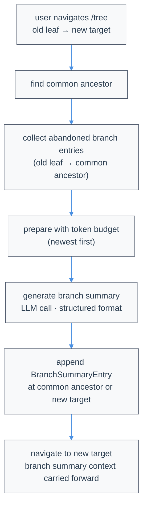

# Compaction & Branch Summarization

LLMs have limited context windows. When conversations grow too long, Atomic's compaction behavior uses **Verbatim Compaction**: it deletes safe older transcript objects while preserving every retained object exactly as it was recorded. This page covers default auto/manual compaction, how it compares to the retired legacy summary compaction, and branch summarization.

Atomic's compaction design and terminology are informed by Morph's Context Compaction work: [Morph's Context Compaction](https://www.morphllm.com/context-compaction). Atomic follows the same core idea that coding agents often benefit more from deleting low-signal context than from rewriting high-signal details like file paths, line numbers, commands, and error strings into a lossy summary.

**Source files** ([atomic](https://github.com/bastani-inc/atomic)):

- [`packages/coding-agent/src/core/compaction/context-compaction.ts`](https://github.com/bastani-inc/atomic/blob/main/packages/coding-agent/src/core/compaction/context-compaction.ts) - Public barrel for Verbatim Compaction types, helpers, tools, and runner exports
- [`packages/coding-agent/src/core/compaction/context-compaction-runner.ts`](https://github.com/bastani-inc/atomic/blob/main/packages/coding-agent/src/core/compaction/context-compaction-runner.ts) - Planner loop, strict target gate, auto-compaction fallback ladder, and planner nudge cap
- [`packages/coding-agent/src/core/compaction/context-compaction-critical.ts`](https://github.com/bastani-inc/atomic/blob/main/packages/coding-agent/src/core/compaction/context-compaction-critical.ts) - Internal overflow-only critical-pass protected-entry eligibility and prompt guidance
- [`packages/coding-agent/src/core/compaction/context-compaction-eviction.ts`](https://github.com/bastani-inc/atomic/blob/main/packages/coding-agent/src/core/compaction/context-compaction-eviction.ts) - Internal overflow-only deterministic LRU eviction fallback
- [`packages/coding-agent/src/core/compaction/branch-summarization.ts`](https://github.com/bastani-inc/atomic/blob/main/packages/coding-agent/src/core/compaction/branch-summarization.ts) - Branch summarization
- [`packages/coding-agent/src/core/compaction/utils.ts`](https://github.com/bastani-inc/atomic/blob/main/packages/coding-agent/src/core/compaction/utils.ts) - Shared utilities (file tracking, serialization)
- [`packages/coding-agent/src/core/session-manager.ts`](https://github.com/bastani-inc/atomic/blob/main/packages/coding-agent/src/core/session-manager.ts) - Entry types (`ContextCompactionEntry`, `BranchSummaryEntry`) and active-context rebuild logic
- [`packages/coding-agent/src/core/provider-context-usage.ts`](https://github.com/bastani-inc/atomic/blob/main/packages/coding-agent/src/core/provider-context-usage.ts) - Provider-bound usage scrub that keeps post-compaction token budgeting based on the compacted prompt
- [`packages/coding-agent/src/core/extensions/session-events.ts`](https://github.com/bastani-inc/atomic/blob/main/packages/coding-agent/src/core/extensions/session-events.ts) - Compaction extension event payloads

For TypeScript definitions in your project, inspect `node_modules/@bastani/atomic/dist/`.

## Overview

Atomic has one context compaction behavior and one separate branch-summarization mechanism:

| Mechanism | Trigger | Purpose |
|-----------|---------|---------|
| Verbatim Compaction (context compaction) | Context exceeds threshold, context overflow, or `/compact` | Delete safe old transcript entries/content blocks while retaining surviving content verbatim |
| Branch summarization | `/tree` navigation | Preserve useful context when switching branches |

Summary compaction — the earlier behavior that generated replacement prose — has been removed as an active runtime path. Historical JSONL lines with `type:"compaction"` remain readable on disk but are not injected into active LLM context. See [Legacy Summary Compaction (Retired)](#legacy-summary-compaction-retired) for a comparison and historical reference.

`/compact` has no user-facing arguments. It uses the effective `compaction` settings (`compression_ratio`, `preserve_recent`, and optional `query`), a fixed internal prompt, transcript-bound inspection/deletion tools, local validation, and a `context_compaction` session entry. Manual compaction (`/compact` and the `contextCompact` RPC path) still uses the strict planner target only. Auto-compaction uses the same deletion-only commit path, but threshold and overflow triggers can accept validated below-target reductions or, on overflow only, escalate through internal recovery tiers when the strict target is not achievable.

## Verbatim vs. Summary Compaction

Atomic uses Verbatim Compaction as its sole compaction strategy. The following comparison explains why, and documents what legacy summary compaction used to do.

| Property | Verbatim Compaction | Summary Compaction (retired) |
|----------|---------------------|------------------------------|
| Mechanism | Deletes entries/content blocks | Rewrites earlier context into new prose |
| Surviving content | Exact original transcript content | Generated summary text |
| File paths / commands / errors | Kept exact or deleted | Can be paraphrased or omitted |
| Line numbers and stack traces | Kept exact or deleted | Can be distorted in summary |
| Auditability | Deleted targets are listed and inspectable | Omission/paraphrase is hard to audit |
| Recoverability | Pre-compaction backup snapshot; deleted targets listed in entry | Generated summary cannot be losslessly reversed |
| Failure mode | Needed context may be deleted (mitigated by validation and backups) | Needed context may be silently distorted |
| Atomic end state | **Canonical behavior** | **Removed runtime behavior** |

Coding agents depend on exact file paths (`src/foo.ts:42`), exact commands (`npm run build`), exact error strings, and exact line numbers. A generated summary that says "an error occurred in the auth module" instead of recording the actual stack trace loses irreplaceable information. Deletion is honest: what remains is unchanged, and what was deleted is listed in an inspectable `context_compaction` entry.

Deletion can still lose needed context. Atomic mitigates this with:
- **Local validation**: Disallowed deletion targets return explicit non-terminating tool errors; grep/regex deletion ignores rejected matches and continues with accepted matches.
- **Pre-compaction backups**: A `.compact.bak` snapshot is written before each compaction for persisted sessions.
- **Auditable targets**: The `context_compaction` entry records every deleted entry/content-block ID.

## Default Context Compaction (Verbatim Compaction)

### What "Verbatim" Means

Verbatim Compaction never asks a model to rewrite the conversation for the main active context. Instead, the model may only choose deletion targets by stable transcript ID:

- **Whole entries** such as an old assistant message or obsolete tool result.
- **Individual content blocks** inside a multi-block message, such as one stale tool call block while keeping other blocks.

Replay-sensitive assistant messages that contain `thinking` or `redacted_thinking` blocks are all-or-nothing: Atomic may delete an old thinking-bearing assistant entry when dependency validation allows it, but it will not delete individual sibling blocks from a retained thinking-bearing assistant message. This keeps Anthropic/GitHub Copilot extended-thinking replay byte-for-byte compatible with provider requirements.

Tool-call/tool-result pairs are also treated as replay dependencies. Validation repairs fresh deletion plans so deleting one side deletes or preserves the paired side consistently, and active-context rebuild applies the same invariant to persisted `context_compaction` entries from older sessions. As a final provider-safety guard, orphaned `toolResult` messages are dropped before LLM serialization if their matching assistant `toolCall` is no longer the immediately preceding tool-use group.

Atomic records those targets in an append-only `context_compaction` entry. When the active branch is rebuilt, Atomic filters the targeted objects out and reuses every retained entry/content block unchanged. There is no generated summary, no paraphrasing, and no replacement message inserted.

The raw session JSONL remains append-only. Deleted objects stay available in the stored session file and backup snapshot; they are only omitted from future active LLM context on that branch.

Provider-bound context is cloned one more time before each LLM request. Retained assistant messages from before the latest `context_compaction` keep their historical usage in the durable session JSONL, but Atomic zeroes that usage in the request-only clone so provider token-budget estimators do not treat the compacted context as if it still contained the old, larger prompt. The first assistant response after compaction then supplies fresh usage for subsequent turns.

### Compaction Parameters

Atomic uses three effective parameters for each context-compaction run. They are available to extension hooks as `event.parameters`, copied into `event.preparation.parameters`, and returned on `event.result.parameters` after a successful compaction.

| Parameter | Type | Default | Meaning |
|-----------|------|---------|---------|
| `compression_ratio` | `float` | `0.5` | Fraction of compactable context to keep. `0.3` is aggressive (keep 30%, delete 70%); `0.7` is light (keep 70%, delete 30%). |
| `preserve_recent` | `int` | `2` | Number of most recent context-eligible messages kept uncompressed / undeletable. |
| `query` | `string` | auto-detected | Focus query for relevance-based pruning. If provided in settings or `ctx.compact()`, Atomic uses that value; otherwise it derives the query from the latest context-eligible user message. |

Settings use the same snake_case names under `compaction`, for example:

```json
{
  "compaction": {
    "compression_ratio": 0.5,
    "preserve_recent": 2,
    "query": "preserve details relevant to the current refactor"
  }
}
```

### When It Triggers

Auto-compaction threshold checks trigger when:

```text
contextTokens > effectiveInputBudget - reserveTokens
```

By default, `reserveTokens` is 16384 tokens. Configure it in `~/.atomic/agent/settings.json` or `<project-dir>/.atomic/settings.json`; legacy `.pi` paths are also supported. This leaves room for the LLM's response. Providers that advertise a larger total context window than their hard prompt cap use the model's effective input budget for threshold and overflow recovery decisions.

You can also trigger compaction manually with `/compact`. Custom summary instructions are not accepted because Verbatim Compaction is deletion-only and retained transcript content stays verbatim. Manual compaction keeps the strict `compression_ratio` completion requirement and does not run the auto-compaction overflow ladder.

If auto-compaction runs while a turn still has queued work (for example a failed tool-call result or a follow-up queued during compaction), Atomic resumes through the same continuation lifecycle as a normal queued turn: provider retry handling runs, additional queued messages drain, and any post-compaction resume failure is surfaced instead of being swallowed silently.

### Image Context and Compaction

Image content blocks (screenshots, pasted images, image-bearing tool results) are expensive: providers fold image tokens into their reported prompt/input usage, so image-heavy conversations reach the compaction threshold sooner. Atomic accounts for this in two complementary ways:

- **Token accounting includes images.** When provider usage is available (after a normal assistant response), the actual image token cost is already captured in the reported input/prompt tokens. For heuristic estimates of trailing messages without usage (for example, on an error fallback), each image content block contributes a single shared conservative estimate of `1200` tokens. This same estimate is used by the transcript planner, so the threshold check and the planner agree on how costly images are.
- **Irrelevant images can be deleted.** The deletion planner can remove stale, superseded, or unrelated image content blocks from older entries using `context_delete` with `kind: "content_block"` or `context_grep_delete` matching the `[image]` placeholder. This includes old user-pasted image attachments when the user text block remains in place, plus old image-only user entries when another task-bearing entry remains. `context_grep_delete` canonicalizes multi-image-only user matches into one safe entry deletion so a batch of `[image]` matches does not fail because every individual block would be removed. When images dominate the context, the `context_compaction_budget` tool reports the remaining image token share (`imageTokenPercent`) and the planner is instructed to prefer deleting stale image blocks before removing useful recent text. The budget tool recomputes image statistics from the current deletion-target set on every call, so after deleting image blocks the reported `remainingImageTokens`/`imageBlockCount`/`imageTokenPercent` immediately reflect the reduced live working set rather than the original pre-deletion totals. `imageTokenPercent` is computed against the **remaining** (post-deletion) context total, not the original pre-deletion total, so deleting non-image text correctly raises the reported image share while deleting image blocks correctly lowers it.

Task-relevant images are preserved automatically:

- **User text and task context remain protected.** Stale, non-recent user `image` content blocks may be deleted only when non-image user content remains in the same entry. Old image-only user entries may be deleted only when another task-bearing entry remains, so compaction can remove irrelevant pasted screenshots without erasing the last statement of the task.
- **Recent entries** (the last `preserve_recent`, default `2`) are protected, keeping current user-pasted images and the most recent image-bearing results the agent is still acting on.
- **Custom/branch-summary messages** are protected as task-bearing context.

Because Verbatim Compaction is deletion-only, compaction never generates summaries, paraphrases, or replacement content. Deleted image blocks are simply omitted from the rebuilt active context; surviving content stays byte-for-byte identical. No image payload data is ever reintroduced, and image payloads never appear in the compaction prompt (images are surfaced as the `[image]` placeholder with their token estimate).

### How It Works

The diagram below is intentionally a block diagram, not a flowchart DSL. Read it left to right first, then use the lower diagrams to inspect the tool loop, validation airlock, dependency repair, and persistence path.

#### Context compaction at a glance

```text
┌──────────────────────────────────────────────────────────────────────────────────────────────┐
│ GOAL                                                                                         │
│ Delete low-signal transcript objects while leaving every surviving object byte-for-byte       │
│ equivalent in active model context. No summaries. No paraphrases. No replacement messages.   │
└──────────────────────────────────────────────────────────────────────────────────────────────┘

┌──────────────┐    ┌──────────────────────┐    ┌──────────────────────┐    ┌──────────────────┐
│  1 Trigger   │───▶│  2 Prepare transcript │───▶│  3 Planner workspace  │───▶│  4 Tool loop      │
└──────────────┘    └──────────────────────┘    └──────────────────────┘    └──────────────────┘
       │                       │                           │                           │
       │                       │                           │                           ▼
       │                       │                           │              ┌──────────────────────────┐
       │                       │                           │              │ 5 Validation airlock      │
       │                       │                           │              └──────────────────────────┘
       │                       │                           │                           │
       │                       │                           │             ┌─────────────┴─────────────┐
       │                       │                           │             ▼                           ▼
       │                       │                           │   ┌──────────────────┐      ┌─────────────────────┐
       │                       │                           │   │ ✗ Correction     │      │ ✓ Validated state    │
       │                       │                           │   │ tool result      │      │ replaces tool store  │
       │                       │                           │   └──────────────────┘      └─────────────────────┘
       │                       │                           │             │                           │
       │                       │                           │             └──────────────┬────────────┘
       │                       │                           │                            ▼
       │                       │                           │              ┌──────────────────────────┐
       │                       │                           └─────────────▶│ 6 Planner stops or adds   │
       │                       │                                          │ more deletion targets     │
       │                       │                                          └──────────────────────────┘
       │                       │                                                       │
       │                       │                                                       ▼
       │                       │                                          ┌──────────────────────────┐
       └───────────────────────┴─────────────────────────────────────────▶│ 7 Persist compaction     │
                                                                          └──────────────────────────┘
                                                                                       │
                                                                                       ▼
                                                                          ┌──────────────────────────┐
                                                                          │ 8 Rebuild active context │
                                                                          └──────────────────────────┘
```

| Block | Main code path | Input | Output |
|-------|----------------|-------|--------|
| 1 Trigger | `/compact`, threshold check, overflow retry, `ctx.compact()` | Current session branch | Compaction request with reason and parameters |
| 2 Prepare transcript | `prepareContextCompaction` | Branch `SessionEntry[]` plus prior `context_compaction` filters | `ContextCompactionPreparation` |
| 3 Planner workspace | `runContextDeletionAssistant` | `CompactableTranscript` | Temp JSONL transcript file plus bounded manifest prompt, inheriting the session's current model thinking level |
| 4 Tool loop | `createContextDeletionTool` tools | Planner tool calls | In-run deletion store updates or correction errors |
| 5 Validation airlock | `validateContextDeletionRequest` | Candidate cumulative deletion request | Reconciled `deletedTargets` or thrown error |
| 6 Target/fallback decision | `contextCompact` runner ladder | Final or salvaged validated deletion state | Strict-target success, feasible auto-compaction acceptance, overflow-only critical pass, deterministic eviction, or terminal error |
| 7 Persist compaction | session manager append path | `ContextCompactionResult` | New append-only `context_compaction` entry |
| 8 Rebuild active context | `buildSessionContext` | Branch plus all logical deletion filters | Model messages with deleted objects omitted verbatim |

#### Block 1: trigger sources

```text
┌───────────────────────────────────────────────┐
│ Trigger source                                │
├───────────────────────────────────────────────┤
│ /compact                                      │
│   fixed deletion-only prompt                  │
│                                               │
│ Auto threshold / provider overflow            │
│   if contextTokens > contextWindow - reserve  │
│                                               │
│ Extension ctx.compact()                       │
│   optional compression parameters             │
└───────────────────────────────────────────────┘
```

All triggers produce the same `ContextDeletionTarget[]` shape and append the same `context_compaction` entry type.

#### Block 2: transcript preparation

```text
append-only SessionEntry branch
        │
        │  Example branch path:
        │
        │    entry-0  system/header context
        │    entry-1  user task
        │    entry-2  assistant with toolCall(call-a)
        │    entry-3  toolResult(call-a)
        │    entry-4  assistant note
        │    entry-5  context_compaction     ← old logical deletion filters
        │    entry-6  user clarification
        │    entry-7  recent assistant
        │
        ▼
┌──────────────────────────────────────────────────────────────────────────────────────────────┐
│ A. Accumulate prior deletion filters                                                         │
│                                                                                                │
│    Prior context_compaction entries are interpreted as filters:                                │
│      deletedEntries       = Set<entryId>                                                       │
│      deletedContentBlocks = Map<entryId, Set<blockIndex>>                                      │
│                                                                                                │
│    Disk is append-only. Old entries remain in JSONL. They are only hidden from active context. │
└──────────────────────────────────────────────────────────────────────────────────────────────┘
        │
        ▼
┌──────────────────────────────────────────────────────────────────────────────────────────────┐
│ B. Build filtered path                                                                         │
│                                                                                                │
│    entry deletion      → remove that SessionEntry from the compactable path                    │
│    content_block       → keep the SessionEntry, but omit selected content blocks               │
│    context_compaction  → do not include as a model message                                     │
│    excludeFromContext  → omit from compactable transcript                                      │
└──────────────────────────────────────────────────────────────────────────────────────────────┘
        │
        ▼
┌──────────────────────────────────────────────────────────────────────────────────────────────┐
│ C. Mark entries that validation will not delete                                                 │
│                                                                                                │
│    protected = true when any of these are true:                                                │
│      • entry is inside the configured preserve_recent context window                           │
│      • role is user                                                                            │
│      • role is custom                                                                          │
│      • role is branchSummary, or entryType is branch_summary                                   │
│      • assistant stopReason is error                                                           │
│      • toolResult isError is true                                                              │
│      • bashExecution has non-zero exitCode                                                     │
└──────────────────────────────────────────────────────────────────────────────────────────────┘
        │
        ▼
┌──────────────────────────────────────────────────────────────────────────────────────────────┐
│ D. Emit CompactableTranscript                                                                  │
│                                                                                                │
│    transcript.entries[] contains one CompactableTranscriptEntry per compactable message:        │
│                                                                                                │
│      entryId          stable id used in deletion targets                                        │
│      entryType        message | custom_message | branch_summary | ...                          │
│      role             user | assistant | toolResult | bashExecution | custom | branchSummary    │
│      text             searchable/readable text                                                  │
│      tokenEstimate    stats and manifest prioritization                                         │
│      protected        validation guard bit                                                       │
│      contentBlocks    per-block delete targets with original blockIndex                         │
│      message          original AgentMessage for invariant checks                                │
│      toolCallIds      ids from assistant toolCall content blocks                                │
│      toolResultFor    call id answered by a toolResult entry                                    │
│                                                                                                │
│    transcript.protectedEntryIds records the ids protected by the active validation pass.       │
└──────────────────────────────────────────────────────────────────────────────────────────────┘
```

#### Block 3: planner workspace

```text
CompactableTranscript
        │
        ├─ writeContextCompactionTranscriptFile(transcript)
        │
        │    Temporary file layout:
        │
        │      /tmp/atomic-context-transcript-*/transcript.jsonl
        │
        │      line 1: { entryId, role, protected, tokenEstimate, text, contentBlocks, ... }
        │      line 2: { entryId, role, protected, tokenEstimate, text, contentBlocks, ... }
        │      ...
        │
        │    The full transcript text lives here, not in the prompt.
        │
        └─ buildContextCompactionPrompt(transcript, transcriptFilePath)

Prompt body
┌──────────────────────────────────────────────────────────────────────────────────────────────┐
│ Planner guardrails                                                                            │
│   • context_delete is id-only: kind, entryId, and optional blockIndex.                         │
│   • context_grep_delete may use a concise content pattern, never full block bodies.            │
│   • No-summary/no-paraphrase wording prevents legacy replacement-context behavior.             │
│   • Atomic ignores final prose as a deletion plan; validated tool state is the result.         │
├──────────────────────────────────────────────────────────────────────────────────────────────┤
│ Strategy                                                                                      │
│   • Aggressively compact/remove blocks.                                                       │
│   • Start with context_compaction_budget to inspect window fullness and reduction target.      │
│   • Spend a few turns exploring with search/read tools to gain high confidence of candidate   │
│     blocks to remove.                                                                         │
│   • Prefer high-confidence exploit actions after that: delete obvious low-value entries via    │
│     context_grep_delete or context_delete.                                                     │
│   • Check context_compaction_budget after deletion batches.                                   │
│   • Treat compression_ratio as strict for the standard planner pass: default 0.5 means keep   │
│     50% / delete 50%.                                                                         │
│   • If the strict target is not met, continue deleting low-value entries/content blocks until │
│     the planner reaches the target, reaches the auto-compaction budget fallback, or stops.    │
│   • Converge quickly; do not keep reading once safe deletion targets are clear.                │
├──────────────────────────────────────────────────────────────────────────────────────────────┤
│ Transcript file path                                                                          │
│   The planner can search/read slices through tools instead of loading the whole JSONL file.     │
├──────────────────────────────────────────────────────────────────────────────────────────────┤
│ Manifest                                                                                      │
│   • max 80 entries                                                                            │
│   • entries selected by largest tokenEstimate                                                  │
│   • sorted back into transcript order                                                          │
│   • previews truncated to 240 chars                                                           │
└──────────────────────────────────────────────────────────────────────────────────────────────┘
```

#### Block 4: transcript-bound tool loop

```text
                                      ┌────────────────────────────────────┐
                                      │ ContextDeletionMemoryStore          │
                                      ├────────────────────────────────────┤
                                      │ deletionTargets: []                 │
                                      │ callCount: 0                        │
                                      │ lastError: undefined                │
                                      │ immutable entry rows                │
                                      │ immutable content-block rows        │
                                      └────────────────────────────────────┘
                                                      ▲
                                                      │ serialized transaction
                                                      │
┌──────────────────────────────┐      ┌──────────────┴──────────────┐      ┌──────────────────────────────┐
│ Inspection tools             │      │ Mutation tools               │      │ Planner continuation          │
├──────────────────────────────┤      ├─────────────────────────────┤      ├──────────────────────────────┤
│ context_search_transcript    │      │ context_delete               │      │ Every tool result has          │
│   search entry/block text    │      │   exact targets              │      │ terminate: false.              │
│   no mutation                │      │                              │      │                              │
│ context_read_entry           │      │ context_grep_delete          │      │ The planner can respond with   │
│   read bounded text slice    │      │   guarded bulk targets       │      │ more tool calls, or stop.      │
│   no mutation                │      │                              │      │                              │
│ context_compaction_budget    │      │ Both route through           │      │ Final assistant prose is       │
│   window fullness + target   │      │ validateContextDeletionRequest│      │ ignored for deletion targets.  │
└──────────────────────────────┘      └─────────────────────────────┘      └──────────────────────────────┘
```

Mutation tool transaction shape:

```text
┌─────────────────────────────────────────────────────────────────────┐
│ context_delete / context_grep_delete                                │
└─────────────────────────────────────────────────────────────────────┘
        │
        ├─ snapshot current store
        ├─ increment callCount
        ├─ build candidate ContextDeletionTarget[]
        │    context_delete payload is id-only: { kind, entryId, blockIndex? }
        │    context_grep_delete payload uses a concise pattern selector
        ├─ validate incoming targets
        ├─ merge with existing store.deletionTargets
        ├─ validate merged cumulative plan
        │
        ├─ ✓ success
        │     ├─ replace store.deletionTargets with reconciled targets
        │     ├─ clear lastError
        │     └─ return { content: success text, details: stats, terminate: false }
        │
        └─ ✗ failure
              ├─ restore snapshot
              ├─ set lastError to exact validation message
              └─ return { content: correction text, details.error, terminate: false }
```

#### Block 5: validation airlock

```text
Candidate cumulative deletion request
        │
        ▼
┌─────────────────────────────────────────────────────────────────────┐
│ Gate 0: request shape                                                │
│   object with deletions[], id-only keys, valid kind, known entryId     │
└─────────────────────────────────────────────────────────────────────┘
        │
        ▼
┌─────────────────────────────────────────────────────────────────────┐
│ Gate 1: recent-context guard                                         │
│   effective recent window entries are rejected with correction text   │
│   (critical/deterministic overflow uses max(preserve_recent, 5))      │
└─────────────────────────────────────────────────────────────────────┘
        │
        ▼
┌─────────────────────────────────────────────────────────────────────┐
│ Gate 2: latest thinking-content guard                                │
│   the latest retained assistant with thinking/redacted_thinking       │
│   cannot be entry-deleted or partially content-block-deleted          │
└─────────────────────────────────────────────────────────────────────┘
        │
        ▼
┌─────────────────────────────────────────────────────────────────────┐
│ Gate 3: protected target guard                                       │
│   disallowed entries/blocks are rejected with correction text         │
└─────────────────────────────────────────────────────────────────────┘
        │
        ▼
┌─────────────────────────────────────────────────────────────────────┐
│ Gate 4: content-block details                                        │
│   valid integer blockIndex, block exists, not the only block          │
└─────────────────────────────────────────────────────────────────────┘
        │
        ▼
┌─────────────────────────────────────────────────────────────────────┐
│ Gate 5: duplicate targets                                            │
│   duplicate entry/block targets are rejected                          │
└─────────────────────────────────────────────────────────────────────┘
        │
        ▼
┌─────────────────────────────────────────────────────────────────────┐
┌─────────────────────────────────────────────────────────────────────┐
│ Gate 6: tool-call/tool-result reconciliation                         │
│   repairs paired call/result deletion dependencies when safe          │
│   throws explicit recent-context errors when repair crosses the       │
│   effective recent boundary (max(preserve_recent, 5) in overflow      │
│   critical/deterministic tiers)                                       │
└─────────────────────────────────────────────────────────────────────┘
        │
        ▼
┌─────────────────────────────────────────────────────────────────────┐
│ Gate 7: post-reconcile guards                                        │
│   no recent targets, no content-block deletion from the latest        │
│   retained assistant when it has thinking/redacted_thinking           │
└─────────────────────────────────────────────────────────────────────┘
        │
        ▼
┌─────────────────────────────────────────────────────────────────────┐
│ Gate 8: structural integrity                                         │
│   no entry/content-block overlap, no all-block deletion by blocks,    │
│   no orphaned tool result, no dangling tool call                      │
└─────────────────────────────────────────────────────────────────────┘
        │
        ▼
┌─────────────────────────────────────────────────────────────────────┐
│ Gate 10: context survival                                            │
│   at least one entry remains, and at least one task-bearing entry     │
│   remains (user, custom, branchSummary, or branch_summary)            │
└─────────────────────────────────────────────────────────────────────┘
        │
        ▼
┌─────────────────────────────────────────────────────────────────────┐
│ Gate 11: stats                                                       │
│   compute objectsBefore, objectsDeleted, tokensBefore, tokensAfter,   │
│   percentReduction                                                   │
└─────────────────────────────────────────────────────────────────────┘
        │
        ▼
ValidatedContextDeletionResult
```

#### Block 6: dependency repair as a block diagram

```text
Normal model-visible pairing

┌─────────────────────────────────────────┐        toolCallId        ┌────────────────────────────┐
│ assistant entry                          │────────────────────────▶│ toolResult entry            │
│ content block: { type: toolCall, id }    │                         │ toolResultFor = id          │
└─────────────────────────────────────────┘                         └────────────────────────────┘

If the assistant tool-call block is deleted:

┌─────────────────────────────────────────┐                         ┌────────────────────────────┐
│ assistant tool-call block deleted        │──────── requires ──────▶│ paired result deleted       │
└─────────────────────────────────────────┘                         └────────────────────────────┘
                │                                                                  │
                └─ if paired result is not deletable                               │
                   validation removes/rejects the unsafe call deletion             │

If the tool result is deleted:

┌─────────────────────────────────────────┐                         ┌────────────────────────────┐
│ paired call deleted                      │◀────── requires ───────│ toolResult entry deleted    │
└─────────────────────────────────────────┘                         └────────────────────────────┘
                │                                                                  │
                └─ if paired call is not deletable                                 │
                   validation removes/rejects the unsafe result deletion           │

Standard recent boundary case:

┌──────────────────────────────┐       repair would delete       ┌──────────────────────────────┐
│ old side of pair requested   │────────────────────────────────▶│ preserve_recent side of pair │
└──────────────────────────────┘                                  └──────────────────────────────┘
                                      │
                                      ▼
                           explicit correction error
                           "Cannot delete recent context entry ..."
```

#### Block 7: persistence and rebuild

```text
ValidatedContextDeletionResult
        │
        ├─ deletedTargets
        │    [{ kind: "entry", entryId }, { kind: "content_block", entryId, blockIndex }]
        │
        ├─ protectedEntryIds
        │    snapshot of ids protected by the validation pass that produced the result
        │    (critical overflow excludes entries deliberately relaxed for eviction)
        └─ stats
             object and token reduction estimate
        │
        ▼
┌─────────────────────────────────────────────────────────────────────┐
│ Persist                                                             │
│   1. write .compact.bak for persisted sessions when available        │
│   2. append one context_compaction SessionEntry                      │
│   3. emit session_compact event                                      │
└─────────────────────────────────────────────────────────────────────┘
        │
        ▼
┌─────────────────────────────────────────────────────────────────────┐
│ Future buildSessionContext                                           │
│   1. walk branch path                                                │
│   2. accumulate all context_compaction filters                       │
│   3. omit deleted entries                                            │
│   4. clone messages with deleted content blocks removed              │
│   5. preserve surviving message objects and content blocks verbatim  │
│   6. skip unsafe historical filters against latest thinking arrays   │
│   7. retain paired tool results for restored tool-call blocks        │
└─────────────────────────────────────────────────────────────────────┘
```

#### Failure paths

| Failure path | State mutation | What the planner or caller sees |
|--------------|----------------|----------------------------------|
| `context_delete` validation error | Store rolls back to previous deletion targets | Non-terminating correction tool result with exact error |
| `context_grep_delete` regex/pattern error | Store rolls back to previous deletion targets | Non-terminating correction tool result with exact error |
| `context_grep_delete` protected/recent match | Matching protected target is ignored and not counted as a deletion | Non-protected matches still apply when validation succeeds |
| Manual planner stops below the strict `compression_ratio` target | Nothing persisted | Manual compaction fails with achieved reduction, deletion count, and tokens-after details |
| Threshold auto-compaction stops below the strict target but deletes at least one target and projected `tokensAfter` is at or below `effectiveInputBudget - reserveTokens` | Validated deletion targets are persisted | Tier 2 accepts the feasible result so threshold compaction does not immediately re-trigger |
| Threshold auto-compaction stops below the strict target and still exceeds the trigger boundary | Nothing persisted | Auto-compaction fails; threshold compaction never escalates to protected-entry eviction |
| Threshold auto-compaction finds no preparable compactable transcript | Nothing persisted | Silent no-op is preserved because threshold compaction is only opportunistic |
| Overflow auto-compaction finds no preparable compactable transcript | Nothing persisted | Terminal overflow-recovery error states that nothing more was safely deletable instead of silently no-oping |
| Overflow auto-compaction has validated deletions whose projected `tokensAfter` is at or below the model's effective input budget | Validated deletion targets are persisted | Tier 1 target-met results, Tier 2 feasible results, and provider-overflow salvage are committed only when they fit the effective input budget; target-met-but-over-budget results escalate instead of being persisted |
| Overflow planner misses the strict target or meets the strict target while still exceeding the effective input budget | No persistence until a later tier succeeds | Tier 3 reruns the planner with internal `<critical-overflow-mode>` guidance, overflow-only protected-entry eligibility, and an effective recent guard of `max(preserve_recent, 5)` across all entries |
| Critical overflow pass cannot produce a fitting validated result, or planner auth is unavailable during overflow | No model-generated plan is persisted | Tier 4 runs deterministic code-level LRU eviction with no model call or auth requirement while enforcing the same `max(preserve_recent, 5)` recent floor across all entries |
| Deterministic overflow eviction cannot fit the effective input budget, has no safe candidate left, or reaches its 50-pass cap | Nothing persisted from the failed attempt | Terminal overflow-recovery error includes achieved stats (`tokensAfter`, percent reduction, deletion-target count), the budget, and that nothing more was safely deletable |
| Planner run reaches its 50 real provider-turn cap | No additional provider calls are made for that planner run | The runner evaluates the validated deletions recorded so far against the current tier's acceptance rule, then either escalates or fails terminally with achieved stats |
| Planner nudge loop reaches its 50 follow-up cap | No extra follow-ups are queued for that planner run | The runner evaluates the best validated state against the current tier's acceptance rule, then either escalates or fails terminally with achieved stats |
| Provider non-overflow error | Nothing persisted unless an overflow-only later tier succeeds | Error propagates for manual/threshold; overflow recovery can continue to lower tiers unless the request was aborted |
| Extension-provided deletion request invalid | Nothing persisted | Extension/caller sees validation failure; extension-provided requests bypass the internal fallback ladder |


1. **Collect active branch context.** Atomic walks the current session branch and applies any earlier `context_compaction` logical deletions.
2. **Build a compactable transcript.** Each compactable entry includes a stable `entryId`, role, token estimate, full text, content-block indexes, tool-call IDs, and tool-result links.
3. **Mark validation guards.** Atomic marks user instructions, custom messages, branch/summary messages, the configured `preserve_recent` context-eligible entries, unresolved assistant/tool errors, and failed bash executions as protected in the standard transcript. If a standard planner targets one, the deletion tool returns an explicit correction error.
4. **Write a temporary transcript file.** The compaction assistant receives a compact manifest plus the path to a JSONL transcript file. It should inspect with tools instead of loading the whole transcript into prompt context.
5. **Run the standard deletion planner.** The user's currently selected model runs Atomic's fixed Verbatim Compaction prompt using the session's current model thinking level. It can search/read transcript slices and then call deletion tools. The prompt substitutes the effective compaction parameters: `compression_ratio` (fraction to keep, default `0.5`), `preserve_recent` (default `2`), and `query` (explicit or auto-detected). The target reduction is `1 - compression_ratio` and is treated as a strict completion requirement for the standard planner pass.
6. **Validate fail-closed.** Atomic validates every cumulative deletion plan locally. Unknown IDs, protected targets, duplicate/overlapping targets, empty-context plans, missing task-bearing context, and tool-call/tool-result orphaning are rejected.
7. **Apply the auto-compaction fallback ladder when needed.** Manual compaction stops at the strict standard planner result. Threshold auto-compaction can accept a below-target result only when it has at least one validated deletion and projected `tokensAfter` is at or below `effectiveInputBudget - reserveTokens`; it never escalates to protected-entry eviction. Overflow auto-compaction commits any planner result (strict-target or below-target feasible) only when projected `tokensAfter` fits the effective input budget, then can rerun the planner in an internal critical overflow pass, and finally can use deterministic code-level LRU eviction until the effective input budget fits or no safe deletion remains. The overflow-only critical planner and deterministic eviction tiers enforce an effective recent guard of `max(preserve_recent, 5)` over all entries.
8. **Save and rebuild.** Atomic writes a backup snapshot for persisted sessions, appends a `context_compaction` entry with validated targets and stats, then rebuilds the active LLM context from the filtered branch.

### Transcript-Bound Tools

The compaction assistant can only compact by using these internal tools. Exact deletion is intentionally id-only: the planner identifies entries or content blocks, then calls `context_delete` with `kind`, `entryId`, and optional `blockIndex`. Content-based deletion goes through `context_grep_delete`, where the planner sends a concise literal or regex pattern and Atomic resolves the matching ids locally. Neither mutation path accepts full block text, replacement bodies, summaries, or rationale fields as deletion payload content.

| Tool | Purpose |
|------|---------|
| `context_search_transcript` | Search entry or content-block text and return small snippets. |
| `context_read_entry` | Read a bounded slice of one entry or content block. |
| `context_compaction_budget` | Report context-window fullness, selected-deletion progress, `compression_ratio`, and remaining work to reach the strict reduction target. |
| `context_delete` | Record exact entry/content-block deletion targets. |
| `context_grep_delete` | Bulk-delete matching entries or content blocks with guardrails. |

The planner is prompted to call `context_compaction_budget` before deleting and after deletion batches. The tool reports the current transcript token estimate as a percentage of the selected model's context window, the configured `compression_ratio`, the projected percentage after selected deletions, current reduction percentage, how many more estimated tokens must be removed to reach the strict target, and the image token share (`remainingImageTokens`, `imageBlockCount`, `imageTokenPercent`) so the planner can prioritize deleting stale image context when images dominate. With the default `compression_ratio: 0.5`, the strict standard planner target is a 50% token reduction. Auto-compaction can still commit a validated below-target result when the projected `tokensAfter` clears the relevant budget: threshold compaction uses the trigger boundary (`effectiveInputBudget - reserveTokens`), while overflow recovery uses the model's effective input budget. On the overflow path, strict-target results are also gated by that effective input budget before they can be committed.

`context_grep_delete` supports literal or regex matching, skips already-deleted or disallowed context, enforces a per-call `maxMatches` safety cap, can require `expectedMatchCount` when the planner wants an exact-match safety check, and routes every accepted match through the same validation pipeline as exact deletions. Disallowed matches are ignored before `matches`, `expectedMatchCount`, deletion stats, and selected targets are calculated, so a broad regex can still remove safe blocks without counting rejected candidates as removed. This includes the universal latest-retained assistant guard: if the latest retained assistant message contains `thinking` or `redacted_thinking`, neither `context_delete` nor `context_grep_delete` may remove any content block from that assistant message, even a visible text sibling block. `maxMatches` limits only one tool call; there is no cumulative deletion cap across repeated `context_delete` or `context_grep_delete` calls. Exact deletion attempts that target disallowed entries/blocks return an explicit non-terminating tool error with correction guidance. Exact deletion payloads that include unsupported fields such as transcript `text`, block `content`, summaries, or replacement data are rejected as non-id-only requests.

Tool calls are cumulative during one planner run. The assistant can apply several small deletion batches, inspect the updated state, and stop only after the validated stats meet the strict reduction target or an auto-compaction budget fallback can safely accept the current result. Atomic uses the validated tool state as the compaction result; ordinary assistant text is ignored for deletion targets. Each planner run is bounded to 50 real provider turns (including tool-call turns), and the planner nudge loop is additionally bounded to 50 follow-up nudges per planner run, so a planner that keeps making tiny changes or repeated tool calls cannot spin indefinitely.

### Validation Rules

Validation preserves tool-call/tool-result consistency. If deleting a tool call would leave a tool result behind, Atomic either deletes the paired result too or rejects the plan when that would violate a validation guard. If deleting a tool result would leave a visible dangling tool call, Atomic either deletes the paired call too or rejects the plan.

Atomic also refuses plans that would delete all context or leave no task-bearing context. These checks are local; the model cannot bypass them. Provider context-overflow recovery uses the same validation rules as manual and threshold compaction. During the overflow-only critical planner pass and deterministic eviction fallback, Atomic internally enforces an effective recent guard of `max(preserve_recent, 5)` across all entries, restoring the pre-#1399 last-5 floor even for otherwise-unprotected assistant/tool entries. Within that floor, deletion is rejected through the same recent-target validation used elsewhere. Outside that floor, Atomic relaxes deletion eligibility only for stale protected task-bearing entries (`user`, `custom`, branch summary) that are not carrying assistant/tool/bash errors; every resulting plan still passes fail-closed validation, including latest thinking-bearing assistant immutability, task-bearing floor, and tool-call/result pairing.

### ContextCompactionEntry Structure

Defined in [`session-manager.ts`](https://github.com/bastani-inc/atomic/blob/main/packages/coding-agent/src/core/session-manager.ts):

```typescript
type ContextDeletionTarget =
  | { kind: "entry"; entryId: string }
  | { kind: "content_block"; entryId: string; blockIndex: number };

interface ContextCompactionStats {
  objectsBefore: number;
  objectsAfter: number;
  objectsDeleted: number;
  tokensBefore: number;
  tokensAfter: number;
  percentReduction: number;
}

interface ContextCompactionEntry {
  type: "context_compaction";
  id: string;
  parentId: string | null;
  timestamp: string;
  promptVersion: 1;
  deletedTargets: ContextDeletionTarget[];
  protectedEntryIds: string[];
  stats: ContextCompactionStats;
  backupPath?: string;
}
```

`deletedTargets` is the only active-context mutation. The entry records what to omit; it does not contain replacement prose.

### Verbatim Compaction Diagram

Unlike legacy summary compaction, Verbatim Compaction does not add a generated summary or rewrite retained messages. It appends a `context_compaction` entry that records exactly which older transcript objects should be hidden from future active context rebuilds.

```text
Before verbatim compaction:

  entry:  0     1     2      3      4     5      6      7
        ┌─────┬─────┬─────┬──────┬─────┬──────┬──────┬─────┐
        │ hdr │ usr │ ass │ tool │ usr │ ass  │ tool │ ass │
        └─────┴─────┴─────┴──────┴─────┴──────┴──────┴─────┘
                    │      │            │      │
                    └──────┴────────────┴──────┘
                    planner may mark low-signal old objects

Validated deletion plan:

  delete entry 2        (older assistant text)
  delete entry 3        (superseded tool output)
  keep   entries 0,1,4,5,6,7 unchanged

After compaction (new entry appended; JSONL remains append-only):

  entry:  0     1     2      3      4     5      6      7      8
        ┌─────┬─────┬─────┬──────┬─────┬──────┬──────┬─────┬─────┐
        │ hdr │ usr │ ass │ tool │ usr │ ass  │ tool │ ass │ ctx │
        └─────┴─────┴─────┴──────┴─────┴──────┴──────┴─────┴─────┘
                    ╳      ╳                                      ↑
             logical deletions                       context_compaction entry

What the LLM sees after rebuild:

  ┌────────┬─────┬─────┬──────┬──────┬─────┐
  │ system │ usr │ usr │ ass  │ tool │ ass │
  └────────┴─────┴─────┴──────┴──────┴─────┘
            entry 1 entry 4 entry 5 entry 6 entry 7

No generated summary is inserted. Every surviving entry/content block is reused
verbatim; deleted objects are simply omitted from the active LLM context.
```

## Extension Hooks for Compaction

Extensions can observe, cancel, or contribute exact deletion targets to the compaction pipeline. They cannot provide generated summaries.

### session_before_compact

Fired before the internal deletion planner runs. Extensions can cancel compaction or provide their own validated deletion request.

```typescript
pi.on("session_before_compact", async (event, ctx) => {
  const { preparation, parameters, branchEntries, reason, signal } = event;

  // parameters.compression_ratio - fraction of compactable context to keep
  // parameters.preserve_recent - recent context-eligible messages kept uncompressed
  // parameters.query - focus query used by the planner
  // preparation.parameters - same effective parameters on the frozen preparation snapshot
  // preparation.transcript.entries - entries eligible for deletion
  // preparation.transcript.protectedEntryIds - entry ids validation will reject if directly deleted
  // preparation.transcript.tokensBefore - context token estimate before compaction
  // branchEntries - all entries on current branch
  // reason - "manual" | "threshold" | "overflow"

  // Cancel compaction:
  return { cancel: true };

  // Or provide a deletion request (Atomic validates it locally before persisting):
  return {
    deletionRequest: {
      deletions: [
        { kind: "entry", entryId: "abc123" },
        { kind: "content_block", entryId: "def456", blockIndex: 2 },
      ],
    },
  };
});
```

If `{ cancel: true }` is returned, compaction aborts with a cancellation error. If `{ deletionRequest }` is returned, Atomic validates it through the same local airlock as model-proposed deletions — unknown IDs, protected targets, orphaning, and empty-context plans are rejected — and skips the internal planner. If nothing is returned, the internal planner runs normally.

Extension-provided deletion requests validate against the original standard transcript and bypass the internal fallback ladder, including its overflow budget-fit gate. The overflow guarantee that committed results fit the effective input budget applies to Atomic's internal ladder results; extension-supplied deletion requests remain a public hook escape hatch that commits after local fail-closed validation. Atomic does not expose a public compaction mode API; protected-entry relaxation is reserved for Atomic's own overflow recovery tiers.

### session_compact

Fired after compaction succeeds and the `context_compaction` entry is persisted.

```typescript
pi.on("session_compact", async (event, ctx) => {
  // event.parameters - effective compression_ratio, preserve_recent, and query
  // event.result - ContextCompactionResult, including result.parameters
  // event.contextCompactionEntry - the saved ContextCompactionEntry
  // event.reason - "manual" | "threshold" | "overflow"
  // event.fromExtension - true if extension provided the deletionRequest

  const { result } = event;
  ctx.ui.notify(
    `Compaction: deleted ${result.stats.objectsDeleted} objects, ` +
    `${result.stats.percentReduction}% token reduction`,
    "info",
  );
});
```

### ctx.compact()

Trigger Verbatim Compaction without awaiting completion. See [Extensions](/extensions) for full `ctx.compact()` documentation.

```typescript
ctx.compact({
  compression_ratio: 0.3,
  preserve_recent: 2,
  query: "keep context relevant to the active bug fix",
  onComplete: (result) => {
    ctx.ui.notify(`Compacted: deleted ${result.stats.objectsDeleted} objects`, "info");
  },
  onError: (error) => {
    ctx.ui.notify(`Compaction failed: ${error.message}`, "error");
  },
});
```

`ctx.compact()` accepts the same compaction parameters as hooks/settings (`compression_ratio`, `preserve_recent`, and `query`) but does not accept arbitrary custom summary instructions. Verbatim Compaction uses a fixed internal prompt; no custom summary text can be injected.

See [examples/extensions/trigger-compact.ts](https://github.com/bastani-inc/atomic/blob/main/packages/coding-agent/examples/extensions/trigger-compact.ts) for a full example.

## Branch Summarization

### When It Triggers

When you use `/tree` to navigate to a different branch, Atomic offers to summarize the work you're leaving. This injects context from the left branch into the new branch.

Branch summarization is a separate mechanism from context compaction. It generates a summary of the abandoned branch path and injects it into the new branch position. This is appropriate here because the alternative (losing branch context entirely on navigation) is worse than a lossy summary.

### How It Works

1. **Find common ancestor**: Deepest node shared by old and new positions
2. **Collect entries**: Walk from old leaf back to common ancestor
3. **Prepare with budget**: Include messages up to token budget (newest first)
4. **Generate summary**: Call LLM with structured format
5. **Append entry**: Save `BranchSummaryEntry` at navigation point



```text
Tree before navigation:

         ┌─ B ─ C ─ D (old leaf, being abandoned)
    A ───┤
         └─ E ─ F (target)

Common ancestor: A
Entries to summarize: B, C, D

After navigation with summary:

         ┌─ B ─ C ─ D ─ [summary of B,C,D]
    A ───┤
         └─ E ─ F (new leaf)
```

### Cumulative File Tracking

Branch summarization tracks files cumulatively. When generating a summary, Atomic extracts file operations from:

- Tool calls in the messages being summarized
- Previous branch summary `details` (if any)

This means file tracking accumulates across nested branch summaries, preserving the full history of read and modified files.

### BranchSummaryEntry Structure

Defined in [`session-manager.ts`](https://github.com/bastani-inc/atomic/blob/main/packages/coding-agent/src/core/session-manager.ts):

```typescript
interface BranchSummaryEntry<T = unknown> {
  type: "branch_summary";
  id: string;
  parentId: string | null;
  timestamp: string;  // ISO timestamp
  summary: string;
  fromId: string;      // Entry we navigated from
  fromHook?: boolean;  // true if provided by extension (legacy field name)
  details?: T;         // implementation-specific data
}

// Default branch summarization uses this for details (from branch-summarization.ts):
interface BranchSummaryDetails {
  readFiles: string[];
  modifiedFiles: string[];
}
```

Extensions can store custom data in `details`.

See [`collectEntriesForBranchSummary()`](https://github.com/bastani-inc/atomic/blob/main/packages/coding-agent/src/core/compaction/branch-summarization.ts), [`prepareBranchEntries()`](https://github.com/bastani-inc/atomic/blob/main/packages/coding-agent/src/core/compaction/branch-summarization.ts), and [`generateBranchSummary()`](https://github.com/bastani-inc/atomic/blob/main/packages/coding-agent/src/core/compaction/branch-summarization.ts) for the implementation.

## Branch Summary Format

Branch summarization uses a structured format:

```markdown
## Goal
[What the user is trying to accomplish]

## Constraints & Preferences
- [Requirements mentioned by user]

## Progress
### Done
- [x] [Completed tasks]

### In Progress
- [ ] [Current work]

### Blocked
- [Issues, if any]

## Key Decisions
- **[Decision]**: [Rationale]

## Next Steps
1. [What should happen next]

## Critical Context
- [Data needed to continue]

<read-files>
path/to/file1.ts
path/to/file2.ts
</read-files>

<modified-files>
path/to/changed.ts
</modified-files>
```

### Message Serialization for Branch Summaries

Before branch summarization, messages are serialized to text via [`serializeConversation()`](https://github.com/bastani-inc/atomic/blob/main/packages/coding-agent/src/core/compaction/utils.ts):

```text
[User]: What they said
[Assistant thinking]: Internal reasoning
[Assistant]: Response text
[Assistant tool calls]: read(path="foo.ts"); edit(path="bar.ts", ...)
[Tool result]: Output from tool
```

This prevents the model from treating it as a conversation to continue.

Tool results are truncated to 2000 characters during serialization. Content beyond that limit is replaced with a marker indicating how many characters were truncated.

## Extension Hooks for Branch Summarization

### session_before_tree

Fired before `/tree` navigation. Always fires regardless of whether user chose to summarize. Can cancel navigation or provide custom summary.

```typescript
pi.on("session_before_tree", async (event, ctx) => {
  const { preparation, signal } = event;

  // preparation.targetId - where we're navigating to
  // preparation.oldLeafId - current position (being abandoned)
  // preparation.commonAncestorId - shared ancestor
  // preparation.entriesToSummarize - entries that would be summarized
  // preparation.userWantsSummary - whether user chose to summarize

  // Cancel navigation entirely:
  return { cancel: true };

  // Provide custom summary (only used if userWantsSummary is true):
  if (preparation.userWantsSummary) {
    return {
      summary: {
        summary: "Your summary...",
        details: { /* custom data */ },
      }
    };
  }
});
```

See `SessionBeforeTreeEvent` and `TreePreparation` in the types file.

## Settings

Configure compaction in `~/.atomic/agent/settings.json` or `<project-dir>/.atomic/settings.json` (legacy `.pi` paths are also supported):

```json
{
  "compaction": {
    "enabled": true,
    "reserveTokens": 16384
  }
}
```

| Setting | Default | Description |
|---------|---------|-------------|
| `enabled` | `true` | Enable automatic Verbatim Compaction. |
| `reserveTokens` | `16384` | Tokens to reserve for the next LLM response; threshold auto-compaction starts when context usage exceeds the model's effective input budget minus this reserve. |

Disable auto-compaction with `"enabled": false`. You can still compact manually with `/compact`.

## Legacy Summary Compaction (Retired)

Summary compaction — an earlier behavior that generated replacement prose for older context — has been removed as an active runtime path in Atomic. This section documents it for historical reference only.

### What it did

The summary compaction pipeline:
1. Selected a cut point (user message boundary) called `firstKeptEntryId`.
2. Passed all messages before that cut point to an LLM to generate a replacement summary.
3. Appended a `CompactionEntry` with `type:"compaction"` to the session JSONL.
4. When rebuilding active context, injected a `compactionSummary` message at the boundary.

```text
(Historical — no longer the active behavior)

Before summary compaction:

  entry:  0     1     2     3      4     5     6      7      8     9
        ┌─────┬─────┬─────┬─────┬──────┬─────┬─────┬──────┬──────┬─────┐
        │ hdr │ usr │ ass │ tool │ usr │ ass │ tool │ tool │ ass │ tool│
        └─────┴─────┴─────┴──────┴─────┴─────┴──────┴──────┴─────┴─────┘
                └────────┬───────┘ └──────────────┬──────────────┘
               messagesToSummarize            kept messages
                                   ↑
                          firstKeptEntryId (entry 4)

After compaction (new entry appended):

  entry:  0     1     2     3      4     5     6      7      8     9     10
        ┌─────┬─────┬─────┬─────┬──────┬─────┬─────┬──────┬──────┬─────┬─────┐
        │ hdr │ usr │ ass │ tool │ usr │ ass │ tool │ tool │ ass │ tool│ cmp │
        └─────┴─────┴─────┴──────┴─────┴─────┴──────┴──────┴─────┴─────┴─────┘
               └──────────┬──────┘ └──────────────────────┬───────────────────┘
                 not sent to LLM                    sent to LLM
                                                         ↑
                                              starts from firstKeptEntryId

What the LLM saw:

  ┌────────┬─────────┬─────┬─────┬──────┬──────┬─────┬──────┐
  │ system │ summary │ usr │ ass │ tool │ tool │ ass │ tool │
  └────────┴─────────┴─────┴─────┴──────┴──────┴─────┴──────┘
       ↑         ↑      └─────────────────┬────────────────┘
    prompt   from cmp          messages from firstKeptEntryId
```

### Why it was removed

The core problem: a generated summary can paraphrase or omit exact file paths (`src/auth/middleware.ts:87`), commands (`npm run build -- --watch`), error strings, and line numbers. For coding agents, this loss of precision frequently causes confusion and regressions. Verbatim Compaction is honest: what remains is unchanged, and what was deleted is recorded.

See [Verbatim vs. Summary Compaction](#verbatim-vs-summary-compaction) for the full comparison.

### Historical entry types

`type:"compaction"` JSONL lines may exist in sessions created before the removal. They remain readable on disk and visible in session exports, but Atomic does not inject them as active LLM context. If you encounter sessions with these entries, they are safe to leave in place.

`type:"compaction"` entry structure (historical):
```typescript
interface CompactionEntry {
  type: "compaction";
  id: string;
  parentId: string | null;
  timestamp: string;
  summary: string;           // generated replacement prose
  firstKeptEntryId: string;  // cut point boundary
  tokensBefore: number;
  fromHook?: boolean;
  details?: unknown;
}
```

This entry type is no longer produced by Atomic. Extension hooks that returned `{ compaction: { summary, firstKeptEntryId, tokensBefore } }` no longer have effect; update extensions to use the new `{ cancel: true }` or `{ deletionRequest }` hook returns instead.
