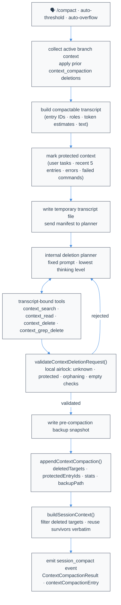
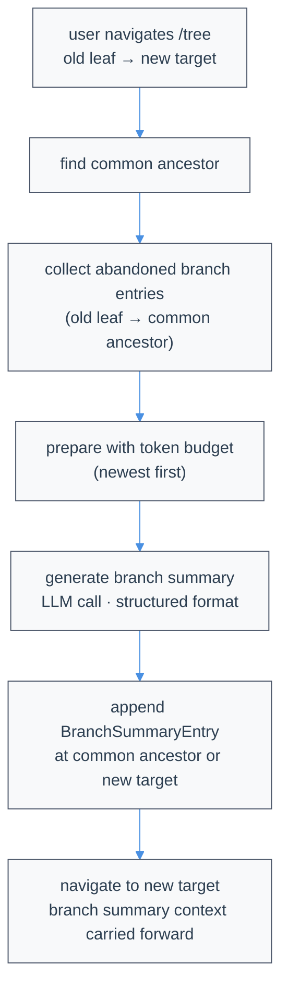

# Compaction & Branch Summarization

LLMs have limited context windows. When conversations grow too long, Atomic's compaction behavior uses **Verbatim Compaction**: it deletes safe older transcript objects while preserving every retained object exactly as it was recorded. This page covers default auto/manual compaction, how it compares to the retired legacy summary compaction, and branch summarization.

Atomic's compaction design and terminology are informed by Morph's Context Compaction work: [Morph's Context Compaction](https://www.morphllm.com/context-compaction). Atomic follows the same core idea that coding agents often benefit more from deleting low-signal context than from rewriting high-signal details like file paths, line numbers, commands, and error strings into a lossy summary.

**Source files** ([atomic](https://github.com/bastani-inc/atomic)):

- [`packages/coding-agent/src/core/compaction/context-compaction.ts`](https://github.com/bastani-inc/atomic/blob/main/packages/coding-agent/src/core/compaction/context-compaction.ts) - Verbatim Compaction planner, transcript tools, validation, and prompt
- [`packages/coding-agent/src/core/compaction/branch-summarization.ts`](https://github.com/bastani-inc/atomic/blob/main/packages/coding-agent/src/core/compaction/branch-summarization.ts) - Branch summarization
- [`packages/coding-agent/src/core/compaction/utils.ts`](https://github.com/bastani-inc/atomic/blob/main/packages/coding-agent/src/core/compaction/utils.ts) - Shared utilities (file tracking, serialization)
- [`packages/coding-agent/src/core/session-manager.ts`](https://github.com/bastani-inc/atomic/blob/main/packages/coding-agent/src/core/session-manager.ts) - Entry types (`ContextCompactionEntry`, `BranchSummaryEntry`) and active-context rebuild logic
- [`packages/coding-agent/src/core/extensions/types.ts`](https://github.com/bastani-inc/atomic/blob/main/packages/coding-agent/src/core/extensions/types.ts) - Extension event types

For TypeScript definitions in your project, inspect `node_modules/@bastani/atomic/dist/`.

## Overview

Atomic has one context compaction behavior and one separate branch-summarization mechanism:

| Mechanism | Trigger | Purpose |
|-----------|---------|---------|
| Verbatim Compaction (context compaction) | Context exceeds threshold, context overflow, or `/compact` | Delete safe old transcript entries/content blocks while retaining surviving content verbatim |
| Branch summarization | `/tree` navigation | Preserve useful context when switching branches |

Summary compaction — the earlier behavior that generated replacement prose — has been removed as an active runtime path. Historical JSONL lines with `type:"compaction"` remain readable on disk but are not injected into active LLM context. See [Legacy Summary Compaction (Retired)](#legacy-summary-compaction-retired) for a comparison and historical reference.

`/compact` has no user-facing arguments. It uses a fixed internal prompt, transcript-bound inspection/deletion tools, local validation, and a `context_compaction` session entry. Auto-compaction uses the same deletion-only path.

## Verbatim vs. Summary Compaction

Atomic uses Verbatim Compaction as its sole compaction strategy. The following comparison explains why, and documents what legacy summary compaction used to do.

| Property | Verbatim Compaction | Summary Compaction (retired) |
|----------|---------------------|------------------------------|
| Mechanism | Deletes entries/content blocks | Rewrites earlier context into new prose |
| Surviving content | Exact original transcript content | Generated summary text |
| File paths / commands / errors | Kept exact or deleted | Can be paraphrased or omitted |
| Line numbers and stack traces | Kept exact or deleted | Can be distorted in summary |
| Auditability | Deleted targets are listed and inspectable | Omission/paraphrase is hard to audit |
| Recoverability | Pre-compaction backup snapshot; deleted targets listed in entry | Generated summary cannot be losslessly reversed |
| Failure mode | Needed context may be deleted (mitigated by validation and backups) | Needed context may be silently distorted |
| Atomic end state | **Canonical behavior** | **Removed runtime behavior** |

Coding agents depend on exact file paths (`src/foo.ts:42`), exact commands (`npm run build`), exact error strings, and exact line numbers. A generated summary that says "an error occurred in the auth module" instead of recording the actual stack trace loses irreplaceable information. Deletion is honest: what remains is unchanged, and what was deleted is listed in an inspectable `context_compaction` entry.

Deletion can still lose needed context. Atomic mitigates this with:
- **Local validation**: Protected entries (user tasks, recent context, unresolved errors, failed commands) cannot be deleted in standard mode.
- **Pre-compaction backups**: A `.compact.bak` snapshot is written before each compaction for persisted sessions.
- **Auditable targets**: The `context_compaction` entry records every deleted entry/content-block ID.

## Default Context Compaction (Verbatim Compaction)

### What "Verbatim" Means

Verbatim Compaction never asks a model to rewrite the conversation for the main active context. Instead, the model may only choose deletion targets by stable transcript ID:

- **Whole entries** such as an old assistant message or obsolete tool result.
- **Individual content blocks** inside a multi-block message, such as one stale tool call block while keeping other blocks.

Atomic records those targets in an append-only `context_compaction` entry. When the active branch is rebuilt, Atomic filters the targeted objects out and reuses every retained entry/content block unchanged. There is no generated summary, no paraphrasing, and no replacement message inserted.

The raw session JSONL remains append-only. Deleted objects stay available in the stored session file and backup snapshot; they are only omitted from future active LLM context on that branch.

### When It Triggers

Auto-compaction triggers when:

```text
contextTokens > contextWindow - reserveTokens
```

By default, `reserveTokens` is 16384 tokens. Configure it in `~/.atomic/agent/settings.json` or `<project-dir>/.atomic/settings.json`; legacy `.pi` paths are also supported. This leaves room for the LLM's response.

You can also trigger compaction manually with `/compact`. Custom summary instructions are not accepted because Verbatim Compaction is deletion-only and retained transcript content stays verbatim.

### How It Works



1. **Collect active branch context.** Atomic walks the current session branch and applies any earlier `context_compaction` logical deletions.
2. **Build a compactable transcript.** Each compactable entry includes a stable `entryId`, role, token estimate, full text, content-block indexes, tool-call IDs, and tool-result links.
3. **Mark protected context.** Standard compaction protects user instructions, custom messages, branch/summary messages, the last five context-eligible entries, unresolved assistant/tool errors, and failed bash executions.
4. **Write a temporary transcript file.** The compaction assistant receives a compact manifest plus the path to a JSONL transcript file. It should inspect with tools instead of loading the whole transcript into prompt context.
5. **Run the deletion planner.** The selected model runs with Atomic's fixed Verbatim Compaction prompt and the lowest supported thinking level for that model. It can search/read transcript slices and then call deletion tools.
6. **Validate fail-closed.** Atomic validates every cumulative deletion plan locally. Unknown IDs, protected targets, duplicate/overlapping targets, empty-context plans, missing task-bearing context, and tool-call/tool-result orphaning are rejected.
7. **Save and rebuild.** Atomic writes a backup snapshot for persisted sessions, appends a `context_compaction` entry with validated targets and stats, then rebuilds the active LLM context from the filtered branch.

### Transcript-Bound Tools

The compaction assistant can only compact by using these internal tools:

| Tool | Purpose |
|------|---------|
| `context_search_transcript` | Search entry or content-block text and return small snippets. |
| `context_read_entry` | Read a bounded slice of one entry or content block. |
| `context_delete` | Record exact entry/content-block deletion targets. |
| `context_grep_delete` | Bulk-delete matching entries or content blocks with guardrails. |

`context_grep_delete` supports literal or regex matching, skips protected/already-deleted context, has match-count caps, can require `expectedMatchCount`, and routes matches through the same validation pipeline as exact deletions.

Tool calls are cumulative during one compaction run. The assistant can apply several small deletion batches, inspect the updated state, and stop when enough safe context has been removed. Atomic uses the validated tool state as the compaction result; deletion JSON written in ordinary assistant text is not used for the final action.

### Protection and Validation Rules

In standard mode, Atomic protects:

- User messages and user-provided task context.
- Custom messages, branch summaries, and branch-summary context.
- The last five context-eligible entries on the active branch.
- Assistant messages whose stop reason is an error.
- Tool results marked as errors.
- Failed bash executions.

Validation also preserves tool-call/tool-result consistency. If deleting a tool call would leave a tool result behind, Atomic either deletes the paired result too or rejects the plan when that would violate protection. If deleting a tool result would leave a visible dangling tool call, Atomic either deletes the paired call too or rejects the plan.

Atomic also refuses plans that would delete all context or leave no task-bearing context. These checks are local; the model cannot bypass them.

### Standard vs. Critical Overflow Mode

Manual `/compact` and threshold auto-compaction run in **standard** mode: protected entries and protected content blocks cannot be deleted.

When a provider returns a context-overflow error, Atomic runs one **critical overflow** recovery pass before retrying. Critical overflow mode first tries stale unprotected context. If that is not enough, it may delete older protected user/custom/summary context, but it still preserves the last five context-eligible entries, unresolved errors, failed commands, and enough task-bearing context for continuation. Old non-latest assistant reasoning can be evicted during this emergency pass, including old `thinking` or `redacted_thinking` blocks when validation allows it. The latest retained assistant message is stricter: when it contains `thinking` or `redacted_thinking`, Atomic preserves that assistant content array verbatim by rejecting partial content-block deletions and skipping unsafe persisted content-block filters instead of editing, reordering, or reindexing sibling blocks. When a historical persisted filter against that latest retained assistant message is skipped, session rebuild also retains paired tool-result entries for restored tool-call blocks so active context does not contain dangling tool calls; later valid compactions can still delete unrelated blocks from those restored multi-block tool results. Atomic retries once after a successful overflow compaction.

### ContextCompactionEntry Structure

Defined in [`session-manager.ts`](https://github.com/bastani-inc/atomic/blob/main/packages/coding-agent/src/core/session-manager.ts):

```typescript
type ContextDeletionTarget =
  | { kind: "entry"; entryId: string }
  | { kind: "content_block"; entryId: string; blockIndex: number };

interface ContextCompactionStats {
  objectsBefore: number;
  objectsAfter: number;
  objectsDeleted: number;
  tokensBefore: number;
  tokensAfter: number;
  percentReduction: number;
}

interface ContextCompactionEntry {
  type: "context_compaction";
  id: string;
  parentId: string | null;
  timestamp: string;
  promptVersion: 1;
  deletedTargets: ContextDeletionTarget[];
  protectedEntryIds: string[];
  stats: ContextCompactionStats;
  backupPath?: string;
}
```

`deletedTargets` is the only active-context mutation. The entry records what to omit; it does not contain replacement prose.

### Verbatim Compaction Diagram

Unlike legacy summary compaction, Verbatim Compaction does not add a generated summary or rewrite retained messages. It appends a `context_compaction` entry that records exactly which older transcript objects should be hidden from future active context rebuilds.

```text
Before verbatim compaction:

  entry:  0     1     2      3      4     5      6      7
        ┌─────┬─────┬─────┬──────┬─────┬──────┬──────┬─────┐
        │ hdr │ usr │ ass │ tool │ usr │ ass  │ tool │ ass │
        └─────┴─────┴─────┴──────┴─────┴──────┴──────┴─────┘
                    │      │            │      │
                    └──────┴────────────┴──────┘
                    planner may mark low-signal old objects

Validated deletion plan:

  delete entry 2        (older assistant text)
  delete entry 3        (superseded tool output)
  keep   entries 0,1,4,5,6,7 unchanged

After compaction (new entry appended; JSONL remains append-only):

  entry:  0     1     2      3      4     5      6      7      8
        ┌─────┬─────┬─────┬──────┬─────┬──────┬──────┬─────┬─────┐
        │ hdr │ usr │ ass │ tool │ usr │ ass  │ tool │ ass │ ctx │
        └─────┴─────┴─────┴──────┴─────┴──────┴──────┴─────┴─────┘
                    ╳      ╳                                      ↑
             logical deletions                       context_compaction entry

What the LLM sees after rebuild:

  ┌────────┬─────┬─────┬──────┬──────┬─────┐
  │ system │ usr │ usr │ ass  │ tool │ ass │
  └────────┴─────┴─────┴──────┴──────┴─────┘
            entry 1 entry 4 entry 5 entry 6 entry 7

No generated summary is inserted. Every surviving entry/content block is reused
verbatim; deleted objects are simply omitted from the active LLM context.
```

## Extension Hooks for Compaction

Extensions can observe, cancel, or contribute exact deletion targets to the compaction pipeline. They cannot provide generated summaries.

### session_before_compact

Fired before the internal deletion planner runs. Extensions can cancel compaction or provide their own validated deletion request.

```typescript
pi.on("session_before_compact", async (event, ctx) => {
  const { preparation, branchEntries, reason, mode, signal } = event;

  // preparation.transcript.entries - entries eligible for deletion
  // preparation.transcript.protectedEntryIds - entries that cannot be deleted in standard mode
  // preparation.transcript.tokensBefore - context token estimate before compaction
  // branchEntries - all entries on current branch
  // reason - "manual" | "threshold" | "overflow"
  // mode - "standard" | "critical_overflow"

  // Cancel compaction:
  return { cancel: true };

  // Or provide a deletion request (Atomic validates it locally before persisting):
  return {
    deletionRequest: {
      deletions: [
        { kind: "entry", entryId: "abc123" },
        { kind: "content_block", entryId: "def456", blockIndex: 2 },
      ],
    },
  };
});
```

If `{ cancel: true }` is returned, compaction aborts with a cancellation error. If `{ deletionRequest }` is returned, Atomic validates it through the same local airlock as model-proposed deletions — unknown IDs, protected targets, orphaning, and empty-context plans are rejected — and skips the internal planner. If nothing is returned, the internal planner runs normally.

### session_compact

Fired after compaction succeeds and the `context_compaction` entry is persisted.

```typescript
pi.on("session_compact", async (event, ctx) => {
  // event.result - ContextCompactionResult
  // event.contextCompactionEntry - the saved ContextCompactionEntry
  // event.reason - "manual" | "threshold" | "overflow"
  // event.fromExtension - true if extension provided the deletionRequest

  const { result } = event;
  ctx.ui.notify(
    `Compaction: deleted ${result.stats.objectsDeleted} objects, ` +
    `${result.stats.percentReduction}% token reduction`,
    "info",
  );
});
```

### ctx.compact()

Trigger Verbatim Compaction without awaiting completion. See [Extensions](/extensions) for full `ctx.compact()` documentation.

```typescript
ctx.compact({
  onComplete: (result) => {
    ctx.ui.notify(`Compacted: deleted ${result.stats.objectsDeleted} objects`, "info");
  },
  onError: (error) => {
    ctx.ui.notify(`Compaction failed: ${error.message}`, "error");
  },
});
```

`ctx.compact()` does not accept custom instructions. Verbatim Compaction uses a fixed internal prompt; no custom summary text can be injected.

See [examples/extensions/trigger-compact.ts](https://github.com/bastani-inc/atomic/blob/main/packages/coding-agent/examples/extensions/trigger-compact.ts) for a full example.

## Branch Summarization

### When It Triggers

When you use `/tree` to navigate to a different branch, Atomic offers to summarize the work you're leaving. This injects context from the left branch into the new branch.

Branch summarization is a separate mechanism from context compaction. It generates a summary of the abandoned branch path and injects it into the new branch position. This is appropriate here because the alternative (losing branch context entirely on navigation) is worse than a lossy summary.

### How It Works

1. **Find common ancestor**: Deepest node shared by old and new positions
2. **Collect entries**: Walk from old leaf back to common ancestor
3. **Prepare with budget**: Include messages up to token budget (newest first)
4. **Generate summary**: Call LLM with structured format
5. **Append entry**: Save `BranchSummaryEntry` at navigation point



```text
Tree before navigation:

         ┌─ B ─ C ─ D (old leaf, being abandoned)
    A ───┤
         └─ E ─ F (target)

Common ancestor: A
Entries to summarize: B, C, D

After navigation with summary:

         ┌─ B ─ C ─ D ─ [summary of B,C,D]
    A ───┤
         └─ E ─ F (new leaf)
```

### Cumulative File Tracking

Branch summarization tracks files cumulatively. When generating a summary, Atomic extracts file operations from:

- Tool calls in the messages being summarized
- Previous branch summary `details` (if any)

This means file tracking accumulates across nested branch summaries, preserving the full history of read and modified files.

### BranchSummaryEntry Structure

Defined in [`session-manager.ts`](https://github.com/bastani-inc/atomic/blob/main/packages/coding-agent/src/core/session-manager.ts):

```typescript
interface BranchSummaryEntry<T = unknown> {
  type: "branch_summary";
  id: string;
  parentId: string | null;
  timestamp: string;  // ISO timestamp
  summary: string;
  fromId: string;      // Entry we navigated from
  fromHook?: boolean;  // true if provided by extension (legacy field name)
  details?: T;         // implementation-specific data
}

// Default branch summarization uses this for details (from branch-summarization.ts):
interface BranchSummaryDetails {
  readFiles: string[];
  modifiedFiles: string[];
}
```

Extensions can store custom data in `details`.

See [`collectEntriesForBranchSummary()`](https://github.com/bastani-inc/atomic/blob/main/packages/coding-agent/src/core/compaction/branch-summarization.ts), [`prepareBranchEntries()`](https://github.com/bastani-inc/atomic/blob/main/packages/coding-agent/src/core/compaction/branch-summarization.ts), and [`generateBranchSummary()`](https://github.com/bastani-inc/atomic/blob/main/packages/coding-agent/src/core/compaction/branch-summarization.ts) for the implementation.

## Branch Summary Format

Branch summarization uses a structured format:

```markdown
## Goal
[What the user is trying to accomplish]

## Constraints & Preferences
- [Requirements mentioned by user]

## Progress
### Done
- [x] [Completed tasks]

### In Progress
- [ ] [Current work]

### Blocked
- [Issues, if any]

## Key Decisions
- **[Decision]**: [Rationale]

## Next Steps
1. [What should happen next]

## Critical Context
- [Data needed to continue]

<read-files>
path/to/file1.ts
path/to/file2.ts
</read-files>

<modified-files>
path/to/changed.ts
</modified-files>
```

### Message Serialization for Branch Summaries

Before branch summarization, messages are serialized to text via [`serializeConversation()`](https://github.com/bastani-inc/atomic/blob/main/packages/coding-agent/src/core/compaction/utils.ts):

```text
[User]: What they said
[Assistant thinking]: Internal reasoning
[Assistant]: Response text
[Assistant tool calls]: read(path="foo.ts"); edit(path="bar.ts", ...)
[Tool result]: Output from tool
```

This prevents the model from treating it as a conversation to continue.

Tool results are truncated to 2000 characters during serialization. Content beyond that limit is replaced with a marker indicating how many characters were truncated.

## Extension Hooks for Branch Summarization

### session_before_tree

Fired before `/tree` navigation. Always fires regardless of whether user chose to summarize. Can cancel navigation or provide custom summary.

```typescript
pi.on("session_before_tree", async (event, ctx) => {
  const { preparation, signal } = event;

  // preparation.targetId - where we're navigating to
  // preparation.oldLeafId - current position (being abandoned)
  // preparation.commonAncestorId - shared ancestor
  // preparation.entriesToSummarize - entries that would be summarized
  // preparation.userWantsSummary - whether user chose to summarize

  // Cancel navigation entirely:
  return { cancel: true };

  // Provide custom summary (only used if userWantsSummary is true):
  if (preparation.userWantsSummary) {
    return {
      summary: {
        summary: "Your summary...",
        details: { /* custom data */ },
      }
    };
  }
});
```

See `SessionBeforeTreeEvent` and `TreePreparation` in the types file.

## Settings

Configure compaction in `~/.atomic/agent/settings.json` or `<project-dir>/.atomic/settings.json` (legacy `.pi` paths are also supported):

```json
{
  "compaction": {
    "enabled": true,
    "reserveTokens": 16384
  }
}
```

| Setting | Default | Description |
|---------|---------|-------------|
| `enabled` | `true` | Enable automatic Verbatim Compaction. |
| `reserveTokens` | `16384` | Tokens to reserve for the next LLM response; auto-compaction starts when context usage exceeds `contextWindow - reserveTokens`. |

Disable auto-compaction with `"enabled": false`. You can still compact manually with `/compact`.

## Legacy Summary Compaction (Retired)

Summary compaction — an earlier behavior that generated replacement prose for older context — has been removed as an active runtime path in Atomic. This section documents it for historical reference only.

### What it did

The summary compaction pipeline:
1. Selected a cut point (user message boundary) called `firstKeptEntryId`.
2. Passed all messages before that cut point to an LLM to generate a replacement summary.
3. Appended a `CompactionEntry` with `type:"compaction"` to the session JSONL.
4. When rebuilding active context, injected a `compactionSummary` message at the boundary.

```text
(Historical — no longer the active behavior)

Before summary compaction:

  entry:  0     1     2     3      4     5     6      7      8     9
        ┌─────┬─────┬─────┬─────┬──────┬─────┬─────┬──────┬──────┬─────┐
        │ hdr │ usr │ ass │ tool │ usr │ ass │ tool │ tool │ ass │ tool│
        └─────┴─────┴─────┴──────┴─────┴─────┴──────┴──────┴─────┴─────┘
                └────────┬───────┘ └──────────────┬──────────────┘
               messagesToSummarize            kept messages
                                   ↑
                          firstKeptEntryId (entry 4)

After compaction (new entry appended):

  entry:  0     1     2     3      4     5     6      7      8     9     10
        ┌─────┬─────┬─────┬─────┬──────┬─────┬─────┬──────┬──────┬─────┬─────┐
        │ hdr │ usr │ ass │ tool │ usr │ ass │ tool │ tool │ ass │ tool│ cmp │
        └─────┴─────┴─────┴──────┴─────┴─────┴──────┴──────┴─────┴─────┴─────┘
               └──────────┬──────┘ └──────────────────────┬───────────────────┘
                 not sent to LLM                    sent to LLM
                                                         ↑
                                              starts from firstKeptEntryId

What the LLM saw:

  ┌────────┬─────────┬─────┬─────┬──────┬──────┬─────┬──────┐
  │ system │ summary │ usr │ ass │ tool │ tool │ ass │ tool │
  └────────┴─────────┴─────┴─────┴──────┴──────┴─────┴──────┘
       ↑         ↑      └─────────────────┬────────────────┘
    prompt   from cmp          messages from firstKeptEntryId
```

### Why it was removed

The core problem: a generated summary can paraphrase or omit exact file paths (`src/auth/middleware.ts:87`), commands (`npm run build -- --watch`), error strings, and line numbers. For coding agents, this loss of precision frequently causes confusion and regressions. Verbatim Compaction is honest: what remains is unchanged, and what was deleted is recorded.

See [Verbatim vs. Summary Compaction](#verbatim-vs-summary-compaction) for the full comparison.

### Historical entry types

`type:"compaction"` JSONL lines may exist in sessions created before the removal. They remain readable on disk and visible in session exports, but Atomic does not inject them as active LLM context. If you encounter sessions with these entries, they are safe to leave in place.

`type:"compaction"` entry structure (historical):
```typescript
interface CompactionEntry {
  type: "compaction";
  id: string;
  parentId: string | null;
  timestamp: string;
  summary: string;           // generated replacement prose
  firstKeptEntryId: string;  // cut point boundary
  tokensBefore: number;
  fromHook?: boolean;
  details?: unknown;
}
```

This entry type is no longer produced by Atomic. Extension hooks that returned `{ compaction: { summary, firstKeptEntryId, tokensBefore } }` no longer have effect; update extensions to use the new `{ cancel: true }` or `{ deletionRequest }` hook returns instead.
