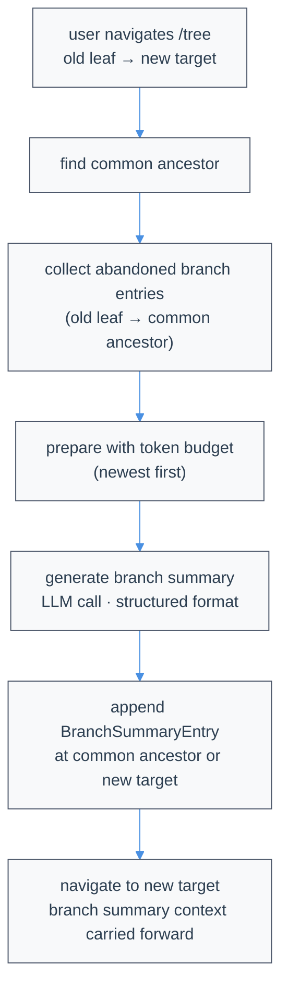

# Compaction & Branch Summarization

LLMs have finite context windows. Atomic reduces context with **verbatim full-collapse compaction**. Current boundaries serialize the full context into one canonical region and mechanically retain selected source text; protected recent messages live inside that serialized region. Branch summarization is a separate, intentionally lossy feature used only when navigating away from a branch.

Compaction uses the active session model; no external compaction service is involved. An isolated planner returns retained canonical text, while the supported warm-cache path returns `KEEP` line identifiers. Atomic reconstructs the durable result from the canonical source, so surviving lines are never rewritten.

## Overview

| Mechanism | Trigger | Current model output | Durable result |
|---|---|---|---|
| Verbatim full-collapse compaction | `/compact`, RPC `compact`, or automatic threshold/overflow recovery | Canonical retained text, or `KEEP` identifiers for supported warm-cache reuse | A `CompactionEntry` whose `summary` is mechanically reconstructed canonical transcript text |
| Branch summarization | Optional `/tree` navigation | Generated summary prose | A `BranchSummaryEntry` |

There is one context-compaction door: `compact`.

## Verbatim Line Compaction

### What "verbatim" means

Atomic serializes the entire context-visible conversation into canonical role-tagged lines:

```text
[User]: Fix the failing parser test
[Assistant thinking]: I will inspect the parser.
[Assistant tool calls]: read(path="src/parser.ts")
[Tool result]: export function parse(...) {
...
[Assistant]: The off-by-one error is fixed.
```

The current isolated full-collapse planner returns an ordered byte-identical subsequence of that canonical source. When exact final provider-payload reuse is supported, it instead returns a `KEEP` record containing canonical line identifiers. In both paths Atomic validates the decision and reconstructs the durable text itself; the model never rewrites, reorders, or normalizes retained text.

The older deletion-range protocol (`start,end` records over `N→content`) applies only to legacy boundaries and their compatibility/recovery behavior. It is not the current full-collapse planner contract.

### Markers and repeated compaction

Each deleted span is replaced on its own line with exactly:

```text
(filtered N lines)
```

The spelling is always plural, including `(filtered 1 lines)`. When a later compaction swallows an earlier marker, Atomic adds the earlier marker's count to the new marker. Adjacent old markers are folded too, so counts remain cumulative across repeated compactions.

### Protected structure

Legacy (pre-full-collapse) boundaries kept a recent logical-turn tail outside the classifier request, preserving its structured images and tool messages. New full-collapse boundaries do not use that legacy tail: `preserve_recent` protects the final N context-visible messages as their canonical serialized physical lines inside the single region. Images therefore become `[image]`, and oversized tool-result text is capped at 16,000 characters with an explicit remainder marker only in the temporary canonical projection; raw durable entries remain unchanged.

Role-header lines such as `[User]:` and `[Assistant]:` remain ordinary selectable lines unless they fall inside those protected serialized messages. Tool-call/result pairing is not independently protected.

### Full-context collapse (v2)

New compaction boundaries use the additive **full-collapse** format (`details.format: "full-collapse"`, `promptVersion: 4`). Instead of a compacted string plus a replayed structured tail, the entire current context — the prior compacted string, if any, plus every context-visible message since it — is serialized into one region and collapsed into a single verbatim string. The isolated request returns retained transcript lines; a supported cache-reuse request returns only canonical line identifiers. In both cases the host accepts the decision only when mechanical reconstruction is an ordered, byte-identical subsequence of the serialized source that retains every protected line and deletes at least one useful line. Rewrites, reordering, duplicated lines, or a dropped protected line are rejected, and the persisted string is always host-reconstructed with canonical `(filtered N lines)` markers.

There is no structural protection for user turns, assistant roles, tool calls, or call/result pairing beyond the final `preserve_recent` messages; every other serialized line is ordinary deletable content, and there is no user-turn `selectCut` widening. Because the whole context collapses into text, repeated compaction within one user turn keeps working: each run folds the previous string plus everything appended after it into a new boundary. Legacy boundaries (without `details.format`) keep their previous string-plus-kept-tail behavior unchanged.

## Parameters

The effective parameters appear in extension events and successful results:

| Parameter | Default | Meaning |
|---|---:|---|
| `compression_ratio` | `0.5` | Fraction of compactable **lines to keep**, not a token ratio |
| `preserve_recent` | `2` | Number of trailing context-visible messages retained byte-identically inside the compacted string; no user-turn widening for new full-collapse writes |
| `query` | Last visible user message | Relevance focus for deciding which older lines to retain |

For v2 full-collapse, `preserve_recent` designates exactly the last N context-visible messages, which are protected as byte-identical lines inside the single compacted string; the region is never widened to a user-turn start. When it is `0`, no lines are protected. If `query` is absent, Atomic derives it from the last visible user message.

Configure defaults in `~/.atomic/agent/settings.json` or `.atomic/settings.json`:

```json
{
  "compaction": {
    "enabled": true,
    "reserveTokens": 16384,
    "compression_ratio": 0.5,
    "preserve_recent": 2,
    "query": "optional focus"
  }
}
```

`reserveTokens` controls the automatic threshold that decides when compaction runs; it is not converted into a classifier line ratio. Manual calls can pass parameter overrides through the SDK.

## When compaction runs

- **Manual:** `/compact`, `ctx.compact()`, `session.compact()`, or RPC `{ "type": "compact" }`.
- **Threshold:** automatic compaction starts only when estimated context usage is strictly greater than the effective input budget minus `reserveTokens`; equality does not trigger it.
- **Overflow:** an actual provider context overflow compacts and then retries the interrupted turn.

The in-flight/final logical turn is included in the prepared full-collapse region. An overflow-triggering assistant error remains archived in JSONL but is excluded from the request-local compaction projection and retry context. When other final-turn content was not present in the preceding provider request, Atomic carries it once as the uncached compaction delta. Cancellation and abort behavior remains consistent with normal session operations. Immediately before backup and boundary persistence, Atomic verifies that the prepared leaf is still current. Manual and automatic compaction catch a first `StaleCompactionPlanError`, prepare again from the fresh ordered branch, and retry once; another concurrent change fails loudly. A stale attempt writes neither a backup nor a boundary.

## One-pass planning and failure behavior

Atomic asks the active session model, at the active reasoning level and through the normal session stream/provider wrapper, to select a retained byte-identical subsequence in one global pass. Manual, threshold, and overflow compaction all calculate the line target directly from the prepared `compression_ratio`. Explicit protected lines form a hard keep floor.

For v2 full-collapse, Atomic first tries cache reuse only when it can mechanically prove a one-to-one mapping between simple host user/assistant messages and the captured final provider-native role/text items. The exact supported region has one non-empty text block per message, alternating roles, no tool calls/results, images, omitted blocks, adapter merges, custom prototypes, aliases, or transform mismatch. The provider-native prefix appears once; the fresh suffix contains deterministic canonical line identifiers plus numbered post-prefix context, never the full old transcript, and the provider must answer with an actual `KEEP` record that the host reconstructs byte-identically. The originating stateful hook is not replayed. Every unprovable shape uses an isolated compaction-only view instead. Oversized tool output is capped in that temporary view, while the raw tool result remains unchanged in JSONL, backups, branching, and resumed sessions.

Requested planner output is bounded by the configured reserve, the model maximum, remaining total context, and the provider/API minimum (16 for OpenAI Responses). A provider hard input cap is checked independently. The final provider-shaped payload is conservatively bounded at the last `onPayload` boundary; cached tokens count fully toward occupancy. Input-cap or remaining-context headroom failure may transparently retry without a cached prefix because isolation can reduce occupancy. A reserve-derived cap or `model.maxTokens` below the provider output minimum is instead a configuration/output-budget underflow: it is not provider input overflow and is never retried in isolated mode. Input exhaustion and `stopReason: "length"` output exhaustion have distinct diagnostics; neither writes a boundary.

A syntactically valid usable result is accepted once after host subsequence/protected-line validation. Atomic never adds or restores model-selected deletions to force a target. During overflow recovery, the existing one-shot compact-and-retry continuation may therefore surface unresolved overflow naturally.

### Compaction-call prompt caching

The full-collapse compaction request can reuse the exact preceding active request captured immediately before provider dispatch:

```
[ tools + system + preceding request messages ]   ← exact cached prefix, once
        ⟨explicit breakpoint or provider-native automatic cache boundary⟩
[ directive + only post-prefix/new context ]      ← fresh delta, once
```

Reuse is bound to the captured model, provider, API, base endpoint, cache routing, and transport. The cached portion of the compaction payload is cloned from the immutable captured final provider payload; only the provider-shaped compaction suffix is appended, and the old stateful payload hook is never rerun. Unsupported or unprovable shapes use the isolated request and omit cache telemetry.

On a warm request, an auto-derived `query` is already canonical transcript content in the cached prefix or numbered delta, so Atomic does not copy it into a second `Relevance focus` field. A non-empty explicit query supplied by settings or the caller has explicit provenance and remains in the suffix exactly once. This warm-path decision uses provenance only; Atomic does not compare or deduplicate arbitrary user text. Isolated requests keep their single-request relevance focus.

Prompt caching reduces repeated prefill work; it does **not** remove cached tokens from the context window. Atomic therefore falls back whenever the exact prefix would leave insufficient room for the directive and desired output reserve. The fallback sends the compactable representation once, without the active history prefix. This is request-local: durable messages, optional fields, duplicate values, tool IDs/results, and raw oversized payloads are not rewritten.

Cache behavior is API-specific. Later compaction clones captured historical provider bytes unchanged and appends only the new suffix:

- **Anthropic Messages** — `cache_control: {"type":"ephemeral"}` is placed on the normal request's final conversation block, respecting the four-breakpoint limit.
- **Public OpenAI GPT-5.6+ Responses/Chat APIs** — `prompt_cache_breakpoint: {"mode":"explicit"}` is placed on the normal request's final cacheable content block; the stable `prompt_cache_key` is preserved.
- **Codex Responses, Azure Responses, and older OpenAI Responses models** — unsupported explicit breakpoint fields are never added. Mechanically proven warm requests use provider-native automatic caching and preserve the existing `prompt_cache_key`.
- **Custom, non-Responses, or otherwise unprovable payloads** — compaction uses the isolated request without changing historical bytes.

Cache reuse is provider-dependent. Atomic records normalized cache-read/cache-write telemetry on the compaction result and `details.cache` (`cacheReadTokens`, `cacheWriteTokens`, `cacheHit`, `provider`, `model`), and never reports a hit unless the provider response usage reports nonzero cache-read tokens. Isolated fallback requests omit cache telemetry. Applying compaction invalidates the old cache; the first normal post-compaction turn writes a fresh one. The optimization targets prefill latency, not a reduction in occupied context tokens.

### Output-limit handling

Full-collapse output ending with `stopReason: "length"` is handled separately from input-context rejection. Atomic may validate complete newline-terminated output while preserving the exact original response — including its unterminated partial fragment — as diagnostic `rawResponseText`. A valid recovered result must still pass ordered-subsequence, useful-deletion, and protected-line checks. Otherwise Atomic raises an output-limit `RangePlanError` and writes an `output_limit` diagnostic. Input budget exhaustion uses `input_overflow`; provider errors remain provider errors.

The legacy deletion-range planner retains its deterministic recovery of complete newline-terminated `start,end` records from a length-truncated response. The final fragment is never guessed because EOF may have cut a multi-digit integer. Successful legacy partial recovery remains an ordinary compaction and may write its private recovery diagnostic.

### Planner failure diagnostics

For a persisted session, a failed planner call writes a JSON sidecar beside the session JSONL and includes its path in the `RangePlanError`, for example:

```text
Compaction range planning returned malformed output (diagnostic: /path/session-compaction-diagnostic-….json)
```

The private sidecar uses `0600` permissions where supported and records the full planner response text, stop reason, provider error, usage, request `maxTokens`, timestamp, failure category, and non-secret model metadata. It does not record API keys, request headers, the planner prompt, or the numbered transcript request. The raw response itself may contain sensitive text if the model echoed input, so treat the sidecar with the same care as its adjacent session file.

Diagnostic categories distinguish malformed output, valid output with no usable ranges, input-budget overflow, output-limit exhaustion, provider errors, and stream failures. In-memory sessions do not create sidecars. If diagnostic writing fails, Atomic preserves the original error and classification.

Interactive main chat and attached workflow stage chat treat `compaction_end` as the authority for cancellation and failure UI. A failed or cancelled `/compact` stops its spinner, shows the event-provided status or diagnostic path without a duplicate stack trace, writes no boundary, and leaves the session usable for another `/compact` attempt or a normal follow-up turn.

Context thresholds and persisted token-reduction statistics use API-aware normalized usage. OpenAI Responses, Codex Responses, and OpenAI Completions sum uncached input plus cache-read/cache-write partitions. Anthropic Messages alone applies the mirrored-cache guard needed by compatible endpoints that duplicate the same prompt tokens across `input` and cache fields.

## Persistence and resume

A successful run appends the existing pi-style `type:"compaction"` entry shape:

```json
{
  "type": "compaction",
  "id": "c1",
  "parentId": "m9",
  "timestamp": "2026-07-13T10:00:00.000Z",
  "summary": "[User]: fix the failing test\n(filtered 42 lines)\n[Assistant]: Fixed.",
  "firstKeptEntryId": "m9",
  "tokensBefore": 51234,
  "details": {
    "strategy": "verbatim-lines",
    "promptVersion": 4,
    "format": "full-collapse",
    "rung": "planned",
    "parameters": {"compression_ratio": 0.5, "preserve_recent": 2, "query": "fix the failing test"},
    "stats": {"linesBefore": 812, "linesDeleted": 417, "linesKept": 395, "rangeCount": 63, "tokensBefore": 51234, "tokensAfter": 24980, "percentReduction": 51.2}
  }
}
```

A `compaction` entry is active only when `details.strategy === "verbatim-lines"`. On rebuild, Atomic emits a visible custom-role boundary message containing the durable `summary`. For v2 full-collapse entries (`details.format === "full-collapse"`) the boundary is followed only by the entries appended strictly after it — no pre-boundary tail is replayed, and `firstKeptEntryId` is a self-anchor (the boundary's parent leaf) that reconstruction ignores. Legacy entries (no `details.format`) still replay the original messages beginning at `firstKeptEntryId`. The boundary is converted to a user-role provider message and shown in the TUI as a collapsible compaction card.

Resume does not rerun planning or re-derive deletions: the exact compacted string is already in JSONL. Legacy `context_compaction` logical-deletion records and old `compaction` summary records without the discriminator are inert archival data. Their historical omissions are not reapplied when an old session resumes.

## Extension hooks

### `session_before_compact`

Extensions may cancel or provide a complete replacement for the prepared region:

```typescript
pi.on("session_before_compact", async (event) => {
  const { reason, parameters, preparation, branchEntries, signal } = event;
  if (signal.aborted) return { cancel: true };

  // Optional offline override. It must contain non-whitespace text.
  if (reason === "manual" && branchEntries.length > 100) {
    return { compactedText: preparation.region.lines.slice(0, 40).join("\n") };
  }
});
```

`preparation` is a deep-frozen clone. An override changes only the compacted region text; Atomic retains the prepared boundary and persists the supplied text verbatim. Empty/whitespace text is rejected. The override path does not require provider credentials.

### `session_compact`

After persistence, Atomic emits an observe-only event:

```typescript
pi.on("session_compact", async (event) => {
  console.log(event.result.rung, event.result.stats);
  console.log(event.compactionEntry.details.strategy); // "verbatim-lines"
  console.log(event.fromExtension);
});
```

Observer errors are isolated and cannot roll back the already-persisted boundary.

## Branch Summarization

### When It Triggers

When you use `/tree` to navigate to a different branch, Atomic offers to summarize the work you're leaving. This injects context from the left branch into the new branch.

Branch summarization is a separate mechanism from context compaction. It generates a summary of the abandoned branch path and injects it into the new branch position. This is appropriate here because the alternative (losing branch context entirely on navigation) is worse than a lossy summary.

### How It Works

1. **Find common ancestor**: Deepest node shared by old and new positions
2. **Collect entries**: Walk from old leaf back to common ancestor
3. **Prepare with budget**: Include messages up to token budget (newest first)
4. **Generate summary**: Call LLM with structured format
5. **Append entry**: Save `BranchSummaryEntry` at navigation point



```text
Tree before navigation:

         ┌─ B ─ C ─ D (old leaf, being abandoned)
    A ───┤
         └─ E ─ F (target)

Common ancestor: A
Entries to summarize: B, C, D

After navigation with summary:

         ┌─ B ─ C ─ D ─ [summary of B,C,D]
    A ───┤
         └─ E ─ F (new leaf)
```

### Cumulative File Tracking

Branch summarization tracks files cumulatively. When generating a summary, Atomic extracts file operations from:

- Tool calls in the messages being summarized
- Previous branch summary `details` (if any)

This means file tracking accumulates across nested branch summaries, preserving the full history of read and modified files.

### BranchSummaryEntry Structure

Defined in [`session-manager.ts`](https://github.com/bastani-inc/atomic/blob/main/packages/coding-agent/src/core/session-manager.ts):

```typescript
interface BranchSummaryEntry<T = unknown> {
  type: "branch_summary";
  id: string;
  parentId: string | null;
  timestamp: string;  // ISO timestamp
  summary: string;
  fromId: string;      // Entry we navigated from
  fromHook?: boolean;  // true if provided by extension (legacy field name)
  details?: T;         // implementation-specific data
}

// Default branch summarization uses this for details (from branch-summarization.ts):
interface BranchSummaryDetails {
  readFiles: string[];
  modifiedFiles: string[];
}
```

Extensions can store custom data in `details`.

See [`collectEntriesForBranchSummary()`](https://github.com/bastani-inc/atomic/blob/main/packages/coding-agent/src/core/compaction/branch-summarization.ts), [`prepareBranchEntries()`](https://github.com/bastani-inc/atomic/blob/main/packages/coding-agent/src/core/compaction/branch-summarization.ts), and [`generateBranchSummary()`](https://github.com/bastani-inc/atomic/blob/main/packages/coding-agent/src/core/compaction/branch-summarization.ts) for the implementation.

## Branch Summary Format

Branch summarization uses a structured format:

```markdown
## Goal
[What the user is trying to accomplish]

## Constraints & Preferences
- [Requirements mentioned by user]

## Progress
### Done
- [x] [Completed tasks]

### In Progress
- [ ] [Current work]

### Blocked
- [Issues, if any]

## Key Decisions
- **[Decision]**: [Rationale]

## Next Steps
1. [What should happen next]

## Critical Context
- [Data needed to continue]

<read-files>
path/to/file1.ts
path/to/file2.ts
</read-files>

<modified-files>
path/to/changed.ts
</modified-files>
```

### Message Serialization for Branch Summaries

Before branch summarization, messages are serialized to text via [`serializeConversation()`](https://github.com/bastani-inc/atomic/blob/main/packages/coding-agent/src/core/compaction/utils.ts):

```text
[User]: What they said
[Assistant thinking]: Internal reasoning
[Assistant]: Response text
[Assistant tool calls]: read(path="foo.ts"); edit(path="bar.ts", ...)
[Tool result]: Output from tool
```

This prevents the model from treating it as a conversation to continue.

Tool results are truncated to 2000 characters during serialization. Content beyond that limit is replaced with a marker indicating how many characters were truncated.

## Extension Hooks for Branch Summarization

### session_before_tree

Fired before `/tree` navigation. Always fires regardless of whether user chose to summarize. Can cancel navigation or provide custom summary.

```typescript
pi.on("session_before_tree", async (event, ctx) => {
  const { preparation, signal } = event;

  // preparation.targetId - where we're navigating to
  // preparation.oldLeafId - current position (being abandoned)
  // preparation.commonAncestorId - shared ancestor
  // preparation.entriesToSummarize - entries that would be summarized
  // preparation.userWantsSummary - whether user chose to summarize

  // Cancel navigation entirely:
  return { cancel: true };

  // Provide custom summary (only used if userWantsSummary is true):
  if (preparation.userWantsSummary) {
    return {
      summary: {
        summary: "Your summary...",
        details: { /* custom data */ },
      }
    };
  }
});
```

See `SessionBeforeTreeEvent` and `TreePreparation` in the types file.

## Settings

Configure compaction in `~/.atomic/agent/settings.json` or `<project-dir>/.atomic/settings.json` (legacy `.pi` paths are also supported):

```json
{
  "compaction": {
    "enabled": true,
    "reserveTokens": 16384
  }
}
```

| Setting | Default | Description |
|---------|---------|-------------|
| `enabled` | `true` | Enable automatic Verbatim Compaction. |
| `reserveTokens` | `16384` | Tokens to reserve for the next LLM response; threshold auto-compaction starts when context usage exceeds the model's effective input budget minus this reserve. |

Disable auto-compaction with `"enabled": false`. You can still compact manually with `/compact`.

## Historical formats

Two old formats remain parseable but inactive:

- `type:"context_compaction"` records store logical entry/content-block deletion targets from older versions. Those records are inert, so content they once hid can re-enter context when an old session resumes.
- `type:"compaction"` without `details.strategy: "verbatim-lines"` stored generated summary prose. Those records also remain inert.

Both are distinguished from active boundaries by the discriminated `details` on the shared `CompactionEntry` shape; the session format version is the same for all of them.
