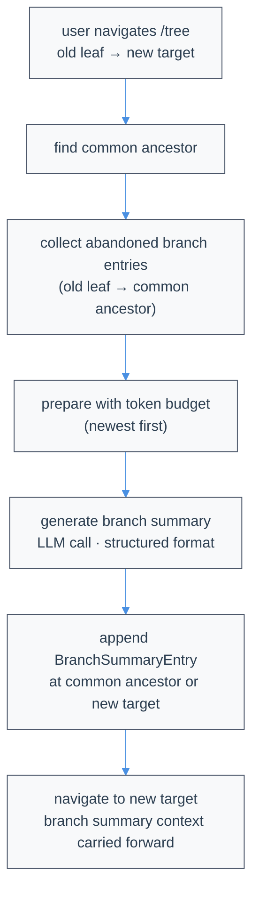

# Compaction & Branch Summarization

LLMs have finite context windows. Atomic reduces older context with **verbatim line compaction** while preserving recent logical turns as ordinary messages. Branch summarization is a separate, intentionally lossy feature used only when navigating away from a branch.

Compaction runs entirely locally with the active session model; no external compaction service is involved. The model only selects which lines to delete — Atomic reconstructs the retained text mechanically, so surviving lines are never rewritten.

## Overview

| Mechanism | Trigger | Model output | Durable result |
|---|---|---|---|
| Verbatim compaction | `/compact`, RPC `compact`, or automatic threshold/overflow recovery | Bare `start,end` deletion records (one per line) | A `CompactionEntry` whose `summary` is mechanically reconstructed transcript text |
| Branch summarization | Optional `/tree` navigation | Generated summary prose | A `BranchSummaryEntry` |

There is one context-compaction door: `compact`.

## Verbatim Line Compaction

### What "verbatim" means

Atomic serializes the compactable part of the conversation into role-tagged lines:

```text
[User]: Fix the failing parser test
[Assistant thinking]: I will inspect the parser.
[Assistant tool calls]: read(path="src/parser.ts")
[Tool result]: export function parse(...) {
...
[Assistant]: The off-by-one error is fixed.
```

The planner sees the same text numbered as `N→content` and returns only one-based, inclusive line ranges as bare records:

```text
2,5
```

Each line is `start,end` — unsigned decimal integers, one comma, no brackets or prose. Atomic safety-normalizes endpoints by swapping reversed pairs, clamping to the transcript, sorting, merging overlap/adjacency, and splitting around explicit protected spans. It then reconstructs from the original input lines. The model never writes, summarizes, reorders, or normalizes retained text. Every retained non-marker line is byte-identical to an input line and remains in input order.

### Markers and repeated compaction

Each deleted span is replaced on its own line with exactly:

```text
(filtered N lines)
```

The spelling is always plural, including `(filtered 1 lines)`. When a later compaction swallows an earlier marker, Atomic adds the earlier marker's count to the new marker. Adjacent old markers are folded too, so counts remain cumulative across repeated compactions.

### Protected structure

Role-header lines such as `[User]:` and `[Assistant]:` are ordinary ranked lines and may be deleted. Explicit protected spans, including blank lines, are never deleted. The recent logical-turn tail is protected client-side by remaining outside the classifier request entirely.

Images in the compactable region become the literal line `[image]`; images in the protected recent tail remain normal image content. Tool-result text remains capped at 16,000 characters before becoming durable compaction text, with an explicit truncation marker for the remainder.

## Parameters

The effective parameters appear in extension events and successful results:

| Parameter | Default | Meaning |
|---|---:|---|
| `compression_ratio` | `0.5` | Fraction of compactable **lines to keep**, not a token ratio |
| `preserve_recent` | `2` | Number of recent context-visible messages protected client-side; the cut widens backward to a user-turn start |
| `query` | Last visible user message | Relevance focus for deciding which older lines to retain |

`preserve_recent` never leaves an assistant message or tool result at the start of the kept tail. Even when it is `0`, Atomic keeps the final logical turn. If `query` is absent, Atomic derives it from the last visible user message.

Configure defaults in `~/.atomic/agent/settings.json` or `.atomic/settings.json`:

```json
{
  "compaction": {
    "enabled": true,
    "reserveTokens": 16384,
    "compression_ratio": 0.5,
    "preserve_recent": 2,
    "query": "optional focus"
  }
}
```

`reserveTokens` controls the automatic threshold that decides when compaction runs; it is not converted into a classifier line ratio. Manual calls can pass parameter overrides through the SDK.

## When compaction runs

- **Manual:** `/compact`, `ctx.compact()`, `session.compact()`, or RPC `{ "type": "compact" }`.
- **Threshold:** automatic compaction starts when estimated context usage reaches the effective input budget minus `reserveTokens`.
- **Overflow:** an actual provider context overflow compacts and then retries the interrupted turn.

The in-flight/final logical turn is outside the compactable region. Pressing Escape while compaction is active cancels it like other session operations. In isolated interactive mode, cancellation and host UI response frames use an independent RPC control lane, so they can reach the engine while the ordinary `compact` request is still pending instead of waiting behind it. Atomic writes a backup snapshot immediately before appending a compaction boundary.

## One-pass planning and failure behavior

Atomic asks the active session model, at the active reasoning level and through the normal session stream/provider wrapper, to rank every eligible line in one global pass and apply one threshold. The entire compactable region is sent in exactly one classifier request; it is never split into chunks. Manual, threshold, and overflow compaction all calculate the line target directly from the prepared `compression_ratio`. Explicit protected lines form a hard keep floor.

The request uses the same provider path and failure handling as pi's summary compaction. Provider/API errors, overflow, abort, malformed output, or empty/unusable safe ranges fail after that one request. These failures write no compaction entry and schedule no continuation. There is no semantic retry, critical rung, deterministic fallback, or deterministic target correction.

A syntactically valid usable result is accepted once after safety-only normalization, even when it deletes fewer lines or tokens than requested. Atomic never adds or restores model-selected deletions to force a target. During overflow recovery, the existing one-shot compact-and-retry continuation may therefore surface unresolved overflow naturally.

### Length-truncated response recovery

When the planner model's output is truncated by `max_tokens` (indicated by `stopReason: "length"`), Atomic silently recovers complete newline-terminated deletion records from the truncated response. A deterministic line parser validates each completed line (those followed by a newline) against the strict `start,end` grammar. The final fragment after the last newline is always discarded — even if it looks syntactically complete — because EOF may have cut a multi-digit integer (e.g. `300,30` could have intended `300,305`). If any completed line has invalid syntax or zero usable records survive validation, recovery fails and the normal `RangePlanError` path applies.

Example of truncated output:

```text
120,180
6,40
300,
```

Recovery yields `120,180` and `6,40`; discards `300,` without guessing. The planner prompt instructs the model to emit ranges in descending deletion confidence (lowest continuation value first) so the most important deletions appear earliest and survive truncation.

Successful partial recovery is an ordinary successful compaction: no warning, banner, toast, or special status copy appears. The UI shows the normal spinner then `✻ Context compacted`.

For operational observability, a private recovery diagnostic sidecar is written beside persisted sessions with `0600` permissions. It records the full raw response, stop reason, usage, request `maxTokens`, model metadata, recovered range count, and recovery category. The sidecar path is never surfaced in the success UI, error messages, or user-visible status. In-memory sessions and sidecar write failures do not affect the successful recovery.

### Planner failure diagnostics

For a persisted session, a failed planner call writes a JSON sidecar beside the session JSONL and includes its path in the `RangePlanError`, for example:

```text
Compaction range planning returned malformed output (diagnostic: /path/session-compaction-diagnostic-….json)
```

The private sidecar uses `0600` permissions where supported and records the full planner response text, stop reason, provider error, usage, request `maxTokens`, timestamp, failure category, and non-secret model metadata. It does not record API keys, request headers, the planner prompt, or the numbered transcript request. The raw response itself may contain sensitive text if the model echoed input, so treat the sidecar with the same care as its adjacent session file.

Diagnostic categories distinguish malformed output, valid output with no usable ranges, provider errors, and stream failures. In-memory sessions do not create sidecars. If the diagnostic write fails, Atomic preserves the original error and classification rather than replacing the planner failure.

Interactive main chat and attached workflow stage chat treat `compaction_end` as the authority for cancellation and failure UI. A failed or cancelled `/compact` stops its spinner, shows the event-provided status or diagnostic path without a duplicate stack trace, writes no boundary, and leaves the session usable for another `/compact` attempt or a normal follow-up turn.

Context thresholds and persisted token-reduction statistics use API-aware normalized usage. OpenAI Responses, Codex Responses, and OpenAI Completions sum uncached input plus cache-read/cache-write partitions. Anthropic Messages alone applies the mirrored-cache guard needed by compatible endpoints that duplicate the same prompt tokens across `input` and cache fields.

## Persistence and resume

A successful run appends the existing pi-style `type:"compaction"` entry shape:

```json
{
  "type": "compaction",
  "id": "c1",
  "parentId": "m9",
  "timestamp": "2026-07-13T10:00:00.000Z",
  "summary": "[User]: fix the failing test\n(filtered 42 lines)\n[Assistant]: Fixed.",
  "firstKeptEntryId": "m7",
  "tokensBefore": 51234,
  "details": {
    "strategy": "verbatim-lines",
    "promptVersion": 3,
    "rung": "planned",
    "parameters": {"compression_ratio": 0.5, "preserve_recent": 2, "query": "fix the failing test"},
    "stats": {"linesBefore": 812, "linesDeleted": 417, "linesKept": 395, "rangeCount": 63, "tokensBefore": 51234, "tokensAfter": 24980, "percentReduction": 51.2}
  }
}
```

A `compaction` entry is active only when `details.strategy === "verbatim-lines"`. On rebuild, Atomic emits a visible custom-role boundary message containing the durable `summary`, followed by the original messages beginning at `firstKeptEntryId`. The boundary is converted to a user-role provider message and shown in the TUI as a collapsible compaction card.

Resume does not rerun planning or re-derive deletions: the exact compacted string is already in JSONL. Legacy `context_compaction` logical-deletion records and old `compaction` summary records without the discriminator are inert archival data. Their historical omissions are not reapplied when an old session resumes.

## Extension hooks

### `session_before_compact`

Extensions may cancel or provide a complete replacement for the prepared region:

```typescript
pi.on("session_before_compact", async (event) => {
  const { reason, parameters, preparation, branchEntries, signal } = event;
  if (signal.aborted) return { cancel: true };

  // Optional offline override. It must contain non-whitespace text.
  if (reason === "manual" && branchEntries.length > 100) {
    return { compactedText: preparation.region.lines.slice(0, 40).join("\n") };
  }
});
```

`preparation` is a deep-frozen clone. An override changes only the compacted region text; Atomic retains the prepared boundary and persists the supplied text verbatim. Empty/whitespace text is rejected. The override path does not require provider credentials.

### `session_compact`

After persistence, Atomic emits an observe-only event:

```typescript
pi.on("session_compact", async (event) => {
  console.log(event.result.rung, event.result.stats);
  console.log(event.compactionEntry.details.strategy); // "verbatim-lines"
  console.log(event.fromExtension);
});
```

Observer errors are isolated and cannot roll back the already-persisted boundary.

## Branch Summarization

### When It Triggers

When you use `/tree` to navigate to a different branch, Atomic offers to summarize the work you're leaving. This injects context from the left branch into the new branch.

Branch summarization is a separate mechanism from context compaction. It generates a summary of the abandoned branch path and injects it into the new branch position. This is appropriate here because the alternative (losing branch context entirely on navigation) is worse than a lossy summary.

### How It Works

1. **Find common ancestor**: Deepest node shared by old and new positions
2. **Collect entries**: Walk from old leaf back to common ancestor
3. **Prepare with budget**: Include messages up to token budget (newest first)
4. **Generate summary**: Call LLM with structured format
5. **Append entry**: Save `BranchSummaryEntry` at navigation point



```text
Tree before navigation:

         ┌─ B ─ C ─ D (old leaf, being abandoned)
    A ───┤
         └─ E ─ F (target)

Common ancestor: A
Entries to summarize: B, C, D

After navigation with summary:

         ┌─ B ─ C ─ D ─ [summary of B,C,D]
    A ───┤
         └─ E ─ F (new leaf)
```

### Cumulative File Tracking

Branch summarization tracks files cumulatively. When generating a summary, Atomic extracts file operations from:

- Tool calls in the messages being summarized
- Previous branch summary `details` (if any)

This means file tracking accumulates across nested branch summaries, preserving the full history of read and modified files.

### BranchSummaryEntry Structure

Defined in [`session-manager.ts`](https://github.com/bastani-inc/atomic/blob/main/packages/coding-agent/src/core/session-manager.ts):

```typescript
interface BranchSummaryEntry<T = unknown> {
  type: "branch_summary";
  id: string;
  parentId: string | null;
  timestamp: string;  // ISO timestamp
  summary: string;
  fromId: string;      // Entry we navigated from
  fromHook?: boolean;  // true if provided by extension (legacy field name)
  details?: T;         // implementation-specific data
}

// Default branch summarization uses this for details (from branch-summarization.ts):
interface BranchSummaryDetails {
  readFiles: string[];
  modifiedFiles: string[];
}
```

Extensions can store custom data in `details`.

See [`collectEntriesForBranchSummary()`](https://github.com/bastani-inc/atomic/blob/main/packages/coding-agent/src/core/compaction/branch-summarization.ts), [`prepareBranchEntries()`](https://github.com/bastani-inc/atomic/blob/main/packages/coding-agent/src/core/compaction/branch-summarization.ts), and [`generateBranchSummary()`](https://github.com/bastani-inc/atomic/blob/main/packages/coding-agent/src/core/compaction/branch-summarization.ts) for the implementation.

## Branch Summary Format

Branch summarization uses a structured format:

```markdown
## Goal
[What the user is trying to accomplish]

## Constraints & Preferences
- [Requirements mentioned by user]

## Progress
### Done
- [x] [Completed tasks]

### In Progress
- [ ] [Current work]

### Blocked
- [Issues, if any]

## Key Decisions
- **[Decision]**: [Rationale]

## Next Steps
1. [What should happen next]

## Critical Context
- [Data needed to continue]

<read-files>
path/to/file1.ts
path/to/file2.ts
</read-files>

<modified-files>
path/to/changed.ts
</modified-files>
```

### Message Serialization for Branch Summaries

Before branch summarization, messages are serialized to text via [`serializeConversation()`](https://github.com/bastani-inc/atomic/blob/main/packages/coding-agent/src/core/compaction/utils.ts):

```text
[User]: What they said
[Assistant thinking]: Internal reasoning
[Assistant]: Response text
[Assistant tool calls]: read(path="foo.ts"); edit(path="bar.ts", ...)
[Tool result]: Output from tool
```

This prevents the model from treating it as a conversation to continue.

Tool results are truncated to 2000 characters during serialization. Content beyond that limit is replaced with a marker indicating how many characters were truncated.

## Extension Hooks for Branch Summarization

### session_before_tree

Fired before `/tree` navigation. Always fires regardless of whether user chose to summarize. Can cancel navigation or provide custom summary.

```typescript
pi.on("session_before_tree", async (event, ctx) => {
  const { preparation, signal } = event;

  // preparation.targetId - where we're navigating to
  // preparation.oldLeafId - current position (being abandoned)
  // preparation.commonAncestorId - shared ancestor
  // preparation.entriesToSummarize - entries that would be summarized
  // preparation.userWantsSummary - whether user chose to summarize

  // Cancel navigation entirely:
  return { cancel: true };

  // Provide custom summary (only used if userWantsSummary is true):
  if (preparation.userWantsSummary) {
    return {
      summary: {
        summary: "Your summary...",
        details: { /* custom data */ },
      }
    };
  }
});
```

See `SessionBeforeTreeEvent` and `TreePreparation` in the types file.

## Settings

Configure compaction in `~/.atomic/agent/settings.json` or `<project-dir>/.atomic/settings.json` (legacy `.pi` paths are also supported):

```json
{
  "compaction": {
    "enabled": true,
    "reserveTokens": 16384
  }
}
```

| Setting | Default | Description |
|---------|---------|-------------|
| `enabled` | `true` | Enable automatic Verbatim Compaction. |
| `reserveTokens` | `16384` | Tokens to reserve for the next LLM response; threshold auto-compaction starts when context usage exceeds the model's effective input budget minus this reserve. |

Disable auto-compaction with `"enabled": false`. You can still compact manually with `/compact`.

## Historical formats

Two old formats remain parseable but inactive:

- `type:"context_compaction"` records store logical entry/content-block deletion targets from older versions. Those records are inert, so content they once hid can re-enter context when an old session resumes.
- `type:"compaction"` without `details.strategy: "verbatim-lines"` stored generated summary prose. Those records also remain inert.

Both are distinguished from active boundaries by the discriminated `details` on the shared `CompactionEntry` shape; the session format version is the same for all of them.
