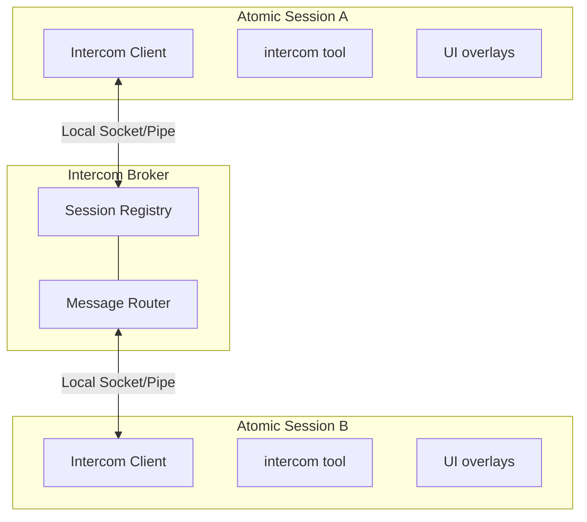

> Atomic sessions can talk to each other. Press ALT+M to message another session, or ask the agent to coordinate with a peer.

# Intercom

Atomic bundles `@bastani/intercom`, a first-party extension for direct 1:1 messaging between Atomic sessions on the same machine. Send context, findings, or requests from one session to another — whether you're driving the conversation or letting agents coordinate. Connections are lazy and tool-driven: the extension registers its commands and tools at startup, but a session does not connect until you or the model actually invoke Intercom. No separate install is needed.

**Key capabilities:**
- **Session messaging** - `send`, `ask` (blocking, 10-minute timeout), `reply`, `pending`, `list`, and `status` via the `intercom` tool
- **Session discovery** - List connected sessions with name, short ID, working directory, model, and live status
- **Keyboard overlay** - ALT+M or `/intercom` opens a session picker and compose overlay
- **Attachments** - Share `file`, `snippet`, and `context` payloads between sessions
- **Subagent escalation** - Delegated children get a `contact_supervisor` tool for decisions, structured interviews, and progress updates
- **Run notifications** - Workflows and subagents deliver async results and control notices to a parent session over Intercom
- **Bundled skill** - `/skill:intercom` provides planner-worker and escalation-handling patterns

**Example use cases:**
- Planner–worker splits across two terminals
- Research → implementation context handoffs
- Supervisor decisions and structured interviews for delegated subagents
- Async workflow/subagent completion and needs-attention notices
- Pair debugging between sessions

## Table of Contents

- [Quick Start](#quick-start)
  - [From the Keyboard](#from-the-keyboard)
  - [From the Agent](#from-the-agent)
  - [Receiving Messages](#receiving-messages)
- [How Connection Works](#how-connection-works)
- [The intercom Tool](#the-intercom-tool)
  - [Actions](#actions)
  - [Targeting Sessions](#targeting-sessions)
  - [send vs ask vs reply](#send-vs-ask-vs-reply)
  - [Attachments](#attachments)
- [Coordination Patterns](#coordination-patterns)
- [Subagent Escalation: contact_supervisor](#subagent-escalation-contact_supervisor)
  - [When the Tool Appears](#when-the-tool-appears)
  - [The Three Reasons](#the-three-reasons)
  - [What the Supervisor Sees](#what-the-supervisor-sees)
  - [Structured Interview Replies](#structured-interview-replies)
- [Workflow and Subagent Notifications](#workflow-and-subagent-notifications)
  - [Workflow Delivery Modes](#workflow-delivery-modes)
  - [Subagent Control Notices](#subagent-control-notices)
  - [Delivery Ordering](#delivery-ordering)
- [Configuration](#configuration)
- [Keyboard Shortcuts](#keyboard-shortcuts)
- [How It Works](#how-it-works)
- [Intercom vs Shared-Room Messengers](#intercom-vs-shared-room-messengers)
- [Limitations](#limitations)
- [Related Docs](#related-docs)

## Quick Start

### From the Keyboard

Press **ALT+M** or run `/intercom` to open the session list overlay:

1. **Select a session** — Use arrow keys to pick a target session
2. **Compose message** — Write your message in the compose overlay
3. **Send** — Enter Send · Escape Cancel

Sent messages are recorded in session history and confirmed with a notification.

### From the Agent

The agent can list sessions and send messages using the `intercom` tool. Tool calls and results render as compact transcript rows so send/ask/reply flows are easy to scan:

```typescript
// List active sessions
intercom({ action: "list" })
// → **Current session:**
// → • executor (20d43841) — ~/projects/api (claude-sonnet-4) [self, idle]
// → **Other sessions:**
// → • research (6332faab) — ~/projects/api (claude-sonnet-4) [same cwd, thinking]

// Send a message
intercom({ action: "send", to: "research", message: "Check if UserService.validate() handles null" })
// → Message sent to research

// The short ID printed by list is also a valid target
intercom({ action: "ask", to: "6332faab", message: "Which validation path should I use?" })

// Check connection status
intercom({ action: "status" })
// → Connected: Yes, Session ID: abc123, Active sessions: 3

// Send with attachments (code snippets, files, or context)
intercom({
  action: "send",
  to: "worker",
  message: "Here's the fix:",
  attachments: [{
    type: "snippet",
    name: "auth.ts",
    language: "typescript",
    content: "function validate(user: User) { ... }"
  }]
})
```

### Receiving Messages

When a message arrives, it appears inline in your chat with the sender's info and a reply hint:

```
**From research** (~/projects/api)

To reply, use the intercom tool: intercom({ action: "reply", message: "..." })

Found the issue — UserService.validate() doesn't check for null input.
See auth.ts:142-156.
```

The reply hint (enabled by default) points to `intercom({ action: "reply", ... })`, so recipients never need raw sender or `replyTo` IDs. Idle recipients get a new turn immediately; busy interactive recipients receive the message once they go idle. Attachment content is included in the agent-visible body, and messages are rendered inline and stored in Atomic session history.

## How Connection Works

Intercom connections are normally tool-driven. Ordinary sessions and delegated children keep the lightweight wrapper unloaded until an Intercom tool, `/intercom`, or the ALT+M overlay is invoked. One exception is supervisor authorization: launching an Intercom-enabled subagent connects the parent runtime long enough to request a broker capability for that child; the child's own connection remains lazy until it invokes `contact_supervisor`. The parent restores issued capabilities across reconnects, and the child uses the broker-confirmed current supervisor ID. Concurrent callers share one import and connection attempt, and broker state is leased to the active session generation and cleaned up on shutdown or replacement.

A session becomes intercom-connected when all of these are true:

- the intercom extension is loaded in that session
- `enabled` is not set to `false` in `~/.atomic/agent/intercom/config.json` (or the legacy `~/.pi/agent/intercom/config.json` fallback)
- the model or user has invoked an Intercom surface in that session, **or** the parent runtime is authorizing an Intercom-enabled child supervisor relationship
- the local broker is running or can be auto-started

The session list only shows intercom-connected sessions, not every open Atomic process on the machine.

Name sessions with `/name` so they can target each other (for example `/name planner` and `/name worker`). If a session is unnamed, Intercom exposes a runtime-only fallback alias like `subagent-chat-1a2b3c4d` so other sessions can still target it. That alias is not persisted as the session title, so resume pickers keep showing the transcript snippet instead of a generic name.

## The intercom Tool

| Parameter | Type | Description |
|-----------|------|-------------|
| `action` | string | `"list"`, `"send"`, `"ask"`, `"reply"`, `"pending"`, or `"status"` |
| `to` | string | Exact session name, exact full ID, or unique ID prefix (for send/ask, or to disambiguate reply) |
| `message` | string | Message text (for send/ask/reply) |
| `attachments` | array | Optional `file`, `snippet`, or `context` attachments |
| `replyTo` | string | Optional message ID for threading or replying to an `ask` |
| `group` | string | Read-only group filter for `list`/`status` (peek who is in a named group). Ignored/locked for `send`/`ask` — those always use your own group and error on a different group. |

### Actions

| Action | Behavior |
|--------|----------|
| `list` | Returns the current session plus other active intercom-connected sessions with name, short ID, working directory, model, and live status (`idle`, `thinking`, or `tool:<name>`, derived from lifecycle events). Every displayed short ID is a valid target. |
| `send` | Fire-and-forget delivery. Requires `to` and `message`; returns delivery confirmation or the delivery-failure reason. Cannot message the current session. |
| `ask` | Sends a message and blocks until the recipient replies (10-minute timeout). The reply is returned as the tool result, so the agent continues in the same turn. |
| `reply` | Replies to the intercom-triggered message of the current turn; otherwise falls back to the single unresolved inbound ask. With multiple pending asks, pass `to` or inspect with `pending` first. |
| `pending` | Lists unresolved inbound asks with sender, message ID, elapsed time, and a short preview. |
| `status` | Shows connection status, session ID, and the total count of active sessions. |

Sent and received messages are recorded in session history as `intercom_sent` / `intercom_received` entries.

### Targeting Sessions

Target lookup resolves an exact full ID first, then an exact case-insensitive name, then a unique session-ID prefix. If a prefix matches multiple sessions, Intercom reports every match and asks for a longer ID or exact name instead of guessing. Resolving a prefix to the current session triggers the normal self-target rejection ("Cannot message the current session"). Targeting is also **group-scoped** — see [Groups](#groups) below.

### Groups

Every session belongs to exactly one intercom **group**. Sessions with no group configured share the implicit `"default"` group (so ungrouped sessions all see and message each other, exactly as before). A session in group G can **only** message sessions in group G — cross-group sends are rejected by the broker, not merely hidden from discovery:

- A cross-group target name is unresolvable (`list`/targeting only consider your own group), and a cross-group send by exact session ID is rejected with `"Target session is in a different intercom group"`.
- `list`/`status` show your own group and only same-group peers. Pass `group: "name"` to `list`/`status` for a **read-only** peek at another group's membership. `send`/`ask` are always locked to your own group and error if you pass a different `group`.
- `session_joined`/`session_left`/`presence_update` are group-scoped, so you never see peers outside your group appear or disappear.

A session's home group is resolved with precedence: workflow/orchestrator-injected per-session group > env `ATOMIC_INTERCOM_GROUP` (legacy `PI_INTERCOM_GROUP`) > intercom `config.json` `"group"` > `"default"`. In workflow and subagent `group` options, boolean `true` and the trimmed, case-insensitive strings `"true"`/`"auto"` request an automatically generated group; those string names are reserved and cannot name literal groups. Groups are the mechanism workflows use to isolate reviewer levels (see [workflows.md](/workflows)). The subagent-only `contact_supervisor` path can cross groups only after a broker capability binds the registered child socket to the issuing supervisor session. The broker, not the client, marks validated traffic as `supervisor`; ordinary `send` frames remain isolated even if a raw client forges that flag, and replies cross back only through an exact broker-recorded `replyTo` match. Parent-held authorization state is restored after broker reconnects. The lightweight wrapper synchronously claims supervisor-authorization requests and lazy-loads the broker provider; a claimed provider failure aborts launch, while runtimes with no provider omit supervisor metadata and do not expose a broken channel.

### send vs ask vs reply

**`send`** is fire-and-forget — the tool returns immediately after delivery. By default it sends immediately, including in interactive sessions. If you want an approval dialog before non-reply sends, set `confirmSend: true` in config; replies that include `replyTo` still skip confirmation so reply-hint flows continue without an extra approval step.

**`ask`** sends the message and blocks until the recipient responds (10-minute timeout). The reply comes back as the tool result, so the agent continues in the same turn with full context. No confirmation dialog — if you're asking and waiting, the intent is clear. Only one pending `ask` is allowed per session at a time; if several blocking requests race (parallel `ask` calls, or `ask` alongside `contact_supervisor`), one wins the reservation and each other call returns a normal "Already waiting for a reply" tool error without disturbing the pending ask.

**`reply`** is receiver-side sugar for replying to an inbound ask. In the turn triggered by an incoming intercom message, `intercom({ action: "reply", message: "..." })` targets that exact sender and message automatically. If you reply later, it falls back to the single unresolved inbound ask; with multiple pending asks, use `pending` to inspect them and pass `to` to disambiguate. Under the hood this is still a normal `send` with the exact `replyTo` value.

### Attachments

`send`, `ask`, and `reply` accept an `attachments` array of `{ type, name, content, language? }` objects where `type` is `"file"`, `"snippet"`, or `"context"`. Attachment content is included in the recipient's agent-visible message body. Attachments are supported in the protocol but not in the ALT+M compose overlay.

## Coordination Patterns

The most natural use of Intercom is splitting a task between two sessions — one holds the big picture, the other does the hands-on work. Open two terminals, start Atomic in each, and name them so they can find each other:

```
# Terminal 1                    # Terminal 2
/name planner                   /name worker
```

Verify they see each other with `intercom({ action: "list" })`, then coordinate:

```typescript
// Planner delegates with send (fire-and-forget)
intercom({
  action: "send",
  to: "worker",
  message: "Task-3: Add retry logic to API client. Key files: src/api/client.ts, src/api/types.ts. Ask if anything's unclear."
})

// Worker hits an ambiguity — asks and waits
intercom({
  action: "ask",
  to: "planner",
  message: "Should retry apply to all endpoints or just idempotent ones? Also, max retry count and backoff strategy?"
})
// → Reply from planner: Only GET/PUT/DELETE — never POST. Max 3 retries, exponential backoff starting at 100ms.
// Worker continues implementing with the answer, same turn, full context.
```

| Pattern | Action | Why |
|---------|--------|-----|
| **Task delegation** | Planner uses `send` | Fire-and-forget. Planner doesn't need to wait for an ack. |
| **Clarification request** | Worker uses `ask` | Worker needs the answer to proceed. Blocks until reply. |
| **Discovery escalation** | Worker uses `ask` | Worker needs approval before changing course. |
| **Completion report** | Worker uses `ask` | Planner might have follow-up instructions or the next task. |

The bundled `intercom` skill (`/skill:intercom`) has copy-paste ready patterns for planner-worker delegation, status checks, natural replies, broadcasting to multiple workers, attachments, and handling subagent escalations on the orchestrator side.

**Recommended:** Add this snippet to your project's `AGENTS.md` to help agents understand when to coordinate across sessions:

```xml
<intercom>
Coordinate with other local Atomic sessions on related codebases. Use `/skill:intercom` for patterns.

**When:** Same codebase (parallel work), reference codebase (consulting patterns), related repos (shared libraries).

**Not when:** Unrelated codebases, trivial questions, or when you can proceed independently.

**Principle:** Prefer `send` for notifications; `ask` only when blocked waiting for input.
</intercom>
```

## Subagent Escalation: contact_supervisor

When Atomic's [subagent runtime](/subagents) spawns a delegated child with bridge metadata, the child session gets a subagent-only `contact_supervisor` tool in addition to the regular `intercom` tool. Normal sessions never see `contact_supervisor`.

### When the Tool Appears

`contact_supervisor` only registers when the subagent runtime sets all of these environment variables:

- `ATOMIC_SUBAGENT_ORCHESTRATOR_TARGET` — the supervisor session name or ID
- `ATOMIC_SUBAGENT_RUN_ID` — the run identifier
- `ATOMIC_SUBAGENT_CHILD_AGENT` — the agent type
- `ATOMIC_SUBAGENT_CHILD_INDEX` — the child index within the run

Legacy `PI_SUBAGENT_*` bridge metadata remains compatible. The optional `ATOMIC_SUBAGENT_INTERCOM_SESSION_NAME` variable sets the delegated child's session name. If required variables are missing, the session falls back to the regular `intercom` tool.

| Parameter | Type | Description |
|-----------|------|-------------|
| `reason` | string | `"need_decision"` (blocking), `"interview_request"` (blocking structured questions), or `"progress_update"` (fire-and-forget) |
| `message` | string | The decision request, optional interview note, or progress update |
| `interview` | object | Required for `interview_request`: `{ title?, description?, questions: [...] }` |

### The Three Reasons

| Reason | Behavior | Use When |
|--------|----------|----------|
| `need_decision` | Sends a formatted ask to the supervisor and blocks until it replies (10-minute timeout) | The subagent is blocked, uncertain, needs approval, or faces a product/API/scope decision |
| `interview_request` | Sends structured questions and blocks until the supervisor replies | The subagent needs multiple machine-readable answers from the supervisor in one exchange |
| `progress_update` | Fire-and-forget update to the supervisor | Meaningful progress or unexpected discoveries that change the plan |

Do not use `contact_supervisor` for routine completion handoffs — return the final subagent result normally. Blocking calls share the same single reply-waiter reservation as `ask`, with the same "Already waiting for a reply" semantics.

```typescript
// Blocked subagent asks for guidance
contact_supervisor({
  reason: "need_decision",
  message: "The auth service returns 403 instead of 401 for expired tokens. Should I treat 403 as a re-auth trigger or a hard failure?"
})
// → Reply from supervisor: Treat 403 as re-auth trigger. Update the token refresh logic.

// Fire-and-forget progress update
contact_supervisor({
  reason: "progress_update",
  message: "Discovered the bug is in the retry wrapper, not the API client. Fixing the wrapper will also close issue #42."
})
// → Progress update sent to supervisor planner
```

### What the Supervisor Sees

The supervisor receives a formatted message with run metadata:

```
**From subagent-worker-78f659a3-1**

Subagent needs a supervisor decision.
Run: 78f659a3
Agent: worker
Child index: 0

Which API should I use?
```

Reply hints work the same as regular `intercom` ask/reply flows. The supervisor replies with `intercom({ action: "reply", message: "..." })` and the subagent receives the answer as the tool result.

### Structured Interview Replies

`interview_request` questions use the shape `{ id, type, question, options?, context? }` where `type` is `single`, `multi`, `text`, `image`, or `info` (`info` questions are context-only and need no response):

```typescript
contact_supervisor({
  reason: "interview_request",
  message: "Please answer these before I continue the migration.",
  interview: {
    title: "API migration choices",
    questions: [
      { id: "api", type: "single", question: "Which API should I target?", options: ["Stable API", "Experimental API"] },
      { id: "constraints", type: "text", question: "What constraints should I preserve?" }
    ]
  }
})
```

The supervisor message includes the structured questions plus a fenced JSON answer example using this stable shape:

```json
{
  "responses": [
    { "id": "api", "value": "Stable API" },
    { "id": "constraints", "value": "Keep the public error shape unchanged." }
  ]
}
```

The supervisor can reply with plain JSON or a fenced `json` block. If the reply matches the `{ "responses": [...] }` shape and references valid question ids/options, the child tool result includes it in `details.structuredReply` while still showing the raw reply text; parse errors are surfaced in `details.structuredReplyParseError`.

## Workflow and Subagent Notifications

Intercom is also the delivery channel for async run results and control notices from [workflows](/workflows) and [subagents](/subagents).

### Workflow Delivery Modes

Programmatic `workflow()` calls accept an `intercom` option that controls how async direct-run results and control notices reach a parent session:

```typescript
workflow({
  tasks: [{ agent: "worker", task: "..." }],
  async: true,
  intercom: { delivery: "result" },
})
```

| Option | Values | Meaning |
|--------|--------|---------|
| `enabled` | boolean | `false` forces delivery off; `true` resolves to `control-and-result` |
| `delivery` | `"off"` \| `"notify"` \| `"result"` \| `"control-and-result"` | Explicit delivery mode; wins over `enabled` |
| `parentSession` | string | Target session for delivery; resolved from args or the Intercom port when omitted |
| `notifyOn` | array | Control events to deliver: `"active_long_running"`, `"needs_attention"`, `"completed"`, `"failed"` |

When neither `enabled` nor `delivery` is set, async direct `parallel`/`chain` runs default to `control-and-result` when Intercom is available; otherwise delivery is off. Treat Intercom payloads from async direct runs as user-visible workflow output.

While a workflow stage generation is open, incoming Intercom messages are admitted through the stage session's native steering/follow-up queue. If that stage is busy running a foreground subagent, Atomic first gives the exact child owner the normal probe/commit detach handshake; only after the child acknowledges detach does the message cross the stage generation boundary. If no foreground owner claims it, the same message falls back to ordinary stage admission rather than waiting in Intercom's idle queue.

### Subagent Control Notices

The `subagent` tool's `control` options select which control events notify the parent and over which channels:

- **`notifyOn`** — defaults to `["active_long_running", "needs_attention"]`
- **`notifyChannels`** — defaults to `["event", "async", "intercom"]` (all that are available)

Async subagent result delivery over Intercom is confirmation-based and preserves a successful delivery phase across watcher replacement. Each delegated child gets a deterministic Intercom target derived from its run/agent/index identity, and run results report those targets ("Run intercom target" / "Previous intercom target"; targets may be inactive after completion). `subagent({ action: "doctor" })` reports Intercom bridge availability and whether Intercom is enabled in config.

If live child-to-parent coordination is needed, invoke `intercom({ action: "status" })` in the parent before launching; the child connects on its first `contact_supervisor` or `intercom` call. Fresh child processes receive the bundled Intercom wrapper through normal package discovery unless an explicit `extensions` allowlist excludes it.

### Delivery Ordering

During a foreground subagent run, Atomic probes for the exact live foreground owner before delivery: the matching child reserves the request, accepts a generation-scoped detach commit, and acknowledges it before messages enter the parent's model-visible steering queue. A commit accepted by one member of a foreground parallel group releases supervision for all active siblings while retaining their process/result ownership, allowing the aggregate tool call to return. If the owner disappears between probe and commit, a still-current receiver uses its ordinary fallback route rather than dropping the broker-delivered message. Blocking calls stay alive until the exact threaded reply; generation cancellation or replacement invalidates stale handshakes.

For delegated background children, queued messages and terminal lifecycle notices are ordered per child: pre-terminal messages are admitted FIFO and atomically together with the paused, completed, or failed notice, exact terminal-identity deduplication prevents double admission, failed dispatches remain retryable, and correlated ask replies bypass unrelated queued sends. See [Subagents](/subagents) for the full coordination contract.

## Configuration

Create `~/.atomic/agent/intercom/config.json`. The legacy `~/.pi/agent/intercom/config.json` fallback is read when the Atomic config is absent:

```json
{
  "brokerCommand": "npx",
  "brokerArgs": ["--no-install", "tsx"],
  "confirmSend": false,
  "enabled": true,
  "replyHint": true,
  "status": "researching",
  "group": "default"
}
```

| Setting | Default | Description |
|---------|---------|-------------|
| `brokerCommand` | `"npx"` | Command used to start the local broker process; the default sentinel is hardened internally to avoid PATH lookup |
| `brokerArgs` | `["--no-install", "tsx"]` | Arguments passed to `brokerCommand` before the broker script path |
| `confirmSend` | `false` | Show a confirmation dialog before non-reply sends from an interactive session with UI |
| `enabled` | `true` | Enable/disable intercom entirely |
| `replyHint` | `true` | Include reply instruction in incoming messages |
| `status` | — | Optional custom status suffix shown after the automatic lifecycle status, for example `thinking · researching` |
| `group` | `"default"` | Home intercom group for this session (see [Groups](#groups)). Overridden by env `ATOMIC_INTERCOM_GROUP` / `PI_INTERCOM_GROUP` and by workflow/orchestrator per-session injection. |

The default `npx --no-install tsx` pair is a compatibility sentinel: Intercom recognizes it and starts the broker through the current Atomic runtime (`process.execPath`). Node-based installs use that runtime with a resolved `tsx` CLI, falling back to Atomic's bundled `jiti` loader when `tsx` is unavailable; Bun source-checkout runs use the current Bun executable directly; standalone Atomic binaries re-enter the split launcher through a narrow internal broker handoff. Default startup therefore does not rely on `npx`, `tsx`, or `bun` being on `PATH`. Explicit custom broker commands still work — for example, to intentionally use Bun from `PATH`:

```json
{
  "brokerCommand": "bun",
  "brokerArgs": []
}
```

Config validation is strict: every field is checked, and if the file is not valid JSON or any field has an invalid value, the whole config is rejected — an error is logged and all defaults are used.

Intercom publishes live session status automatically: sessions register as `idle`, switch to `thinking` while the agent is running, show `tool:<name>` during tool execution, and return to `idle` on completion. A configured `status` is appended as context instead of replacing the lifecycle status.

## Keyboard Shortcuts

| Key | Action |
|-----|--------|
| ALT+M | Open session list overlay |
| ↑/↓ | Navigate session list |
| Enter | Select session / Send message |
| Escape | Cancel / Close overlay |

## How It Works



The broker is a standalone process that manages session registration and message routing. It auto-spawns when the first intercom-enabled session needs it and exits 5 seconds after the last connected session disconnects; clients reconnect automatically if the broker restarts. A spawn lock keyed by PID and timestamp prevents duplicate brokers when multiple sessions start at once.

Transport is local IPC only — a Unix domain socket on macOS/Linux or a named pipe on Windows — using length-prefixed JSON (4-byte length + payload) with request correlation for session listing, explicit delivery failures, and validation of malformed or out-of-order messages. `ask` stays client-side: the broker routes plain messages, and the client waits for the matching reply before returning it as the tool result.

Runtime files live under the active agent directory — `~/.atomic/agent/intercom/` by default, or below `ATOMIC_CODING_AGENT_DIR` when set (the legacy `PI_CODING_AGENT_DIR` alias is honored when the Atomic variable is unset):

- `broker.sock` — Unix domain socket (macOS/Linux; Windows uses a named pipe instead)
- `broker-launch.vbs` — Windows helper script to launch the broker without a console window
- `broker.pid` — Broker process ID
- `broker.spawn.lock` — Short-lived lock used to avoid duplicate auto-spawns
- `config.json` — User configuration

Async extension work (startup, inbound flushes, reconnects, overlays, and relays) no-ops if the session shuts down or reloads before it settles.

## Intercom vs Shared-Room Messengers

| Aspect | Intercom | Shared-room messengers |
|--------|----------|------------------------|
| **Model** | Direct 1:1 messaging | Shared chat room |
| **Primary use** | User orchestrating sessions | Autonomous agent swarms |
| **Discovery** | Broker-based (real-time) | File-based registry |
| **Messages** | Private, session-to-session | Broadcast to all agents |
| **Persistence** | In Atomic session history | Shared coordination files |

Use a shared-room messenger for multi-agent swarms working on one shared task. Use Intercom when you want to manually coordinate your own sessions or have one agent reach out to another specific session.

## Limitations

- **Same machine only** — Uses local sockets/pipes, no network support
- **No dedicated intercom log** — Messages are kept in session history; there is no separate intercom transcript or inbox
- **No attachments UI** — `file`, `snippet`, and `context` attachments are supported in the protocol, but not in the compose overlay
- **Only connected sessions appear** — The list shows sessions that have connected to the broker, not every open Atomic process
- **Broker lifecycle** — The broker auto-spawns on first use and exits when idle; sessions reconnect automatically if it restarts

## Related Docs

- [Subagents](/subagents) for delegated child runs, foreground coordination, and result delivery.
- [Workflows](/workflows) for multi-stage automation and async run notifications.
- [Skills](/skills) for reusable instructions like `/skill:intercom`.
- [Usage](/usage) for environment variables and the bundled-extension overview.
