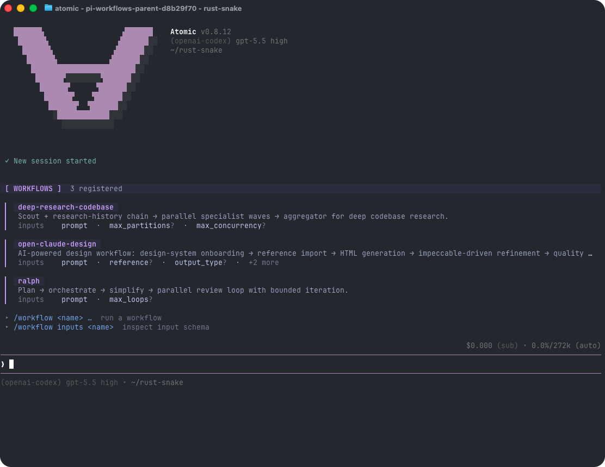

# Quickstart

This page gets you from install to a useful first Atomic session. Atomic is the loop engine for all engineering work: it runs reliable coding-agent loops with stages, tools, artifacts, verification, subagents, review gates, checkpoints, and human approvals.

## Prerequisites

- **Node.js 24 LTS or newer** — Atomic requires the latest Node LTS runtime. Check with `node --version`.
- **A package manager** — use npm (included with Node), pnpm, Yarn, or Bun. Use Bun 1.3.14+ for Bun installs or workflow-authoring examples.
- **Model-provider access** — Use `/login` after startup. Supports provider subscriptions and APIs.

## Install

Install the published package globally with npm, pnpm, or Bun:

With npm:

```bash
npm install -g @bastani/atomic
```

With pnpm:

```bash
pnpm add -g @bastani/atomic
```

With Bun:

```bash
bun add -g @bastani/atomic
```

Atomic does not require package install scripts. If you want to disable dependency lifecycle scripts during the Atomic install, you can add `--ignore-scripts` to the install command.

Then start Atomic in the project directory you want it to work on:

```bash
cd /path/to/project
atomic
```

## Uninstall

Remove the global package with the same package manager you used to install it:

```bash
npm uninstall -g @bastani/atomic
pnpm remove -g @bastani/atomic
bun remove -g @bastani/atomic
```

This removes the CLI package only. User configuration, auth, sessions, and packages remain under `~/.atomic/agent/` unless you delete that directory yourself.

## Authenticate

Atomic can use subscription providers through `/login`, or API-key providers through environment variables or the auth file.

### Option 1: subscription login

Start Atomic and run:

```text
/login
```

Then select a provider. Built-in subscription logins include Claude Pro/Max, ChatGPT Plus/Pro (Codex), and GitHub Copilot.

### Option 2: API key

Set an API key before launching Atomic:

```bash
export ANTHROPIC_API_KEY=sk-ant-...
atomic
```

You can also run `/login` and select an API-key provider to store the key in `~/.atomic/agent/auth.json`.

See [Providers](/providers) for all supported providers, environment variables, and cloud-provider setup.

## First session

On a fresh install with no prior Atomic startup state, Atomic shows a one-time first-run explanation after any What's New notes and directly above the input box describing Atomic as a verifiable coding agent runtime for building and running agent workflows you can feel confident in. Returning users with prior startup state are marked onboarded automatically and continue directly into the normal chat UI; stored credentials by themselves do not skip the first-run explanation. The composer is the normal Atomic input from the start: type a message, run `/login` first if no provider is connected, open `/atomic`, or launch a workflow command without a special onboarding transition.

Once Atomic starts, default to a workflow for non-trivial work and for requests with inherent structure plus a verifiable objective. Implementation, build, debugging, bug fixes, migrations, features, scoped multi-file edits, validation/review work, and loop-shaped requests are workflow candidates; reserve direct chat for tiny deterministic low-risk answers or edits where tracking clearly adds more overhead than value.

Workflow-first is not builtin-only or monolithic. Atomic can discover named builtin, project, user, and package workflows; run direct `task`, `tasks`, and `chain` shapes; author a rich custom TypeScript `workflow({...})` inline; and compositionally import reusable workflow definitions—including builtins from `@bastani/workflows/builtin`—into parent workflows with `ctx.workflow(...)`. Nested children can nest again within `maxDepth`, so custom graphs can combine proven research, implementation, design, verification, and approval workflows instead of copying them. They can also classify and branch, dynamically fan out and synthesize artifacts, run adversarial repair cycles, tournament-rank candidates, and loop until checks pass with explicit bounds.

Atomic turns repeatable engineering loops into executable stages with inspectable evidence instead of relying on a markdown checklist the model may or may not follow.

For an interactive tour any time, run `/atomic` inside the TUI; `/atomic overview`, `/atomic workflows`, and `/atomic example` walk through the same flow in more depth.

### Try the built-in workflows

Atomic ships with four workflows you can run immediately. Use `/workflow list` to see them and `/workflow inputs <name>` to inspect their inputs in your environment.

| Workflow | When to use | Example |
|---|---|---|
| `deep-research-codebase` | Broad, cross-cutting research before you decide what to change. Scout → research-history → parallel specialist waves → aggregator. | `/workflow deep-research-codebase prompt="How do payment retries work end to end?"` |
| `goal` | Clearly delegated autonomous work that materially benefits from a durable goal ledger, bounded worker turns, named validation, and reviewer gates. It stops as `complete`, `blocked`, or `needs_human`, with optional final-stage PR creation through `create_pr=true` after approval. | `/workflow goal objective="Update the CLI docs for --json, include one example, run the docs build, and finish when the build passes"` |
| `ralph` | Clearly delegated autonomous work that materially benefits from a durable research-first pipeline, delegated implementation, and iterative review. Ralph can start from a spec file, GitHub issue, or crisp ticket description and optionally lets only the final stage attempt PR creation with `create_pr=true`. | `/workflow ralph prompt="Implement specs/2026-03-rate-limit.md and validate burst traffic returns 429"` |
| `open-claude-design` | UI and design-system work with separate forked generate and feedback chains; renders a live `preview.html` you can iterate against. | `/workflow open-claude-design prompt="Refresh the settings page hierarchy as a page"` |

<p align="center"></p>

Inputs are bare `key=value` tokens. Values are JSON-parsed when possible, so `count=5`, `flag=true`, and `objective="multi word value"` preserve useful types. Some workflows expose reusable worktree inputs; for example, add `git_worktree_dir=../atomic-ralph-wt` to `ralph` to run its stages in a created/reused Git worktree while preserving your current repo-relative cwd. Goal and Ralph skip PR creation by default; prompt text alone does not opt in. Add `create_pr=true` only when you want the final `pull-request` stage to inspect provider credentials and attempt provider-appropriate PR/MR/review creation after the workflow's review gate approves, such as GitHub `gh`, Azure Repos `az repos pr create`, or Sapling/Phabricator tooling; the PR-creation instructions live in that final stage. If you call `/workflow <name>` without required inputs, the TUI opens an inline picker; pass `--no-picker` to skip it.

You can also launch workflows with **natural language** — just describe the task in chat and ask Atomic to run the matching workflow:

```text
Run a deep codebase research workflow on how the rate limiter behaves under burst traffic.
```

```text
Use the goal workflow to update the CLI docs for --json, include one example, run the docs build, and finish when the build passes.
```

Atomic picks the workflow, fills in inputs from the request, and confirms before launch.

For a clearly delegated broad autonomous implementation job that benefits from a research/review loop, `ralph` is one available builtin. Give it a spec file, GitHub issue, or crisp ticket description; it refines the prompt, researches as needed, delegates implementation, reviews, records a QA proof video for UI/full-stack changes when practical, and iterates. Add `create_pr=true` only when you want the final PR handoff after the review gate approves.

For an autonomous one-off job that materially benefits from a durable goal ledger, bounded worker turns, and reviewer gates, use `goal` with a concrete task description that names the work surface, desired outcome, and validation. An ordinary small-to-medium change does not require it merely because it has tests, validation, or multiple files, but loop or stop-condition wording is a key workflow signal when the user delegates execution. Goal captures receipts, stops as `complete`, `blocked`, or `needs_human`, and can optionally run only the final PR handoff with `create_pr=true` after approval.

### Monitor and steer a run

Named workflow runs execute in the background. After launch you get a run id; use it to inspect, attach, pause, or resume.

```text
/workflow status <run-id>         # inspect one run's progress
/workflow status                  # list this session's active and terminal runs
/workflow connect <run-id>        # watch, attach to stages, or steer (F2 also opens latest)
/workflow attach <run-id> <stage> # chat with one stage
/workflow interrupt <run-id>      # pause resumably
/workflow resume <run-id> "go"    # send a steer message and resume
/workflow kill <run-id>           # abort and retain for inspection
```

Human-in-the-loop prompts (`ctx.ui.input`, `confirm`, `select`, `editor`) surface in the graph viewer, not as chat modals — connect to the run to answer them.

Atomic also posts main-chat lifecycle notices when a run completes, fails, or awaits input. If you answer a workflow prompt in the graph or attached stage chat, the main chat receives a display-only answer summary for audit; it does not wake the model, enter LLM context, or answer later prompts. See [Workflows](/workflows) for the full reference and authoring guide.

### Top skills to invoke directly

Skills are reusable expert instructions. Trigger one with `/skill:<name>` followed by a request:

| Skill | When to use | Example |
|---|---|---|
| `research-codebase` | Scoped research that writes a grounded artifact for one subsystem or question. | `/skill:research-codebase how the rate limiter works in src/middleware/` |
| `create-spec` | Turn research into an implementation-ready plan. | `/skill:create-spec from research/docs/2026-03-rate-limit.md` |
| `prompt-engineer` | Tighten a vague prompt before a long run. | `/skill:prompt-engineer Draft a sharper repo-research prompt for payment retries end to end.` |
| `tdd` | Test-first feature or bug work. | `/skill:tdd` |
| `impeccable` | Critique or refine web/native frontend and product UI; includes detector hooks. | `/skill:impeccable` |
| `playwright-cli` | Drive a real browser for end-to-end UI checks, screenshots, and reviewable proof videos. | `/skill:playwright-cli` |
| `liteparse` | Pull text, tables, or values out of PDF, DOCX, PPTX, XLSX, and image files locally. | `/skill:liteparse` |

Use `/skill:research-codebase` for a focused area and `/workflow deep-research-codebase` when a clearly delegated repo-wide research job benefits from durable stages and artifacts. Keep conversation-led planning and implementation inline, or use bounded subagents while the parent remains in control. When an autonomous implementation job needs durable execution, use `/workflow goal` for a goal ledger, bounded worker turns, and reviewer-gated completion, or `/workflow ralph` for a research-first pipeline with delegated implementation and iterative review. Task size alone does not select either workflow. Add `create_pr=true` only when you want the workflow's final pull-request stage after approval.

### Create your own workflow in natural language

Named workflows may be builtin, project, user, or package supplied. You do not have to hand-write TypeScript to add a new workflow. Describe what you want in plain chat and Atomic will design and write it for you using the [Workflows](/workflows) reference as the source of truth:

```text
Create a reusable Atomic workflow called review-changes. It takes one
required text input `target` (a diff, PR, or review focus). Run two reviewers
in parallel with fresh context — one for correctness and missing tests, one
for edge cases and maintainability — then a synthesis stage that
consolidates findings into blockers vs. suggestions and returns
{ consolidated_review, decision }.
```

Atomic will:

- ask clarifying questions if stage purpose, inputs, models, or handoffs are ambiguous,
- write a `.atomic/workflows/<name>.ts` definition that uses `workflow({ ... })` and imports `Type` from `typebox`,
- and run `/workflow reload` so the generated workflow is rediscovered and can be launched with `/workflow <name>`.

The same plain-chat approach works for editing or hardening an existing workflow — ask Atomic to add a stage, switch a model, save artifacts, or wire in a human approval gate. For the full authoring reference, see [Workflows](/workflows). The authoring guide also covers [workflow composition](/workflows#workflow-composition), including calling user-defined workflows or builtin workflows such as `deep-research-codebase`, `goal`, and `ralph` from `@bastani/workflows/builtin`.

### Default tools and prompts

If you'd rather start with a plain prompt, just type a request and press Enter:

```text
Summarize this repository and tell me how to run its checks.
```

By default, Atomic gives the model these tools:

- `read` - read files
- `bash` - run shell commands
- `edit` - patch files
- `write` - create or overwrite files
- `find` - discover files by glob pattern
- `search` - search file contents
- `ask_user_question` - ask structured questions in the TUI
- `todo` - manage file-based todos

Normal coding sessions include file discovery and content search through `find` and `search` in addition to `read`, `bash`, `edit`, and `write`. Atomic runs in your current working directory and can modify files there. Use git or another checkpointing workflow if you want easy rollback.

## Give Atomic project instructions

Atomic loads context files at startup. Add an `AGENTS.md` file to tell it how to work in a project:

```markdown
# Project Instructions

- Run `bun run typecheck` after code changes.
- Do not run production migrations locally.
- Keep responses concise.
```

Atomic loads:

- `~/.atomic/agent/AGENTS.md` for global instructions
- `AGENTS.md` or `CLAUDE.md` from parent directories and the current directory

Restart Atomic, or run `/reload`, after changing context files.

## Common things to try

### Reference files

Type `@` in any interactive editor to fuzzy-search files; or pass files on the command line:

```bash
atomic @README.md "Summarize this"
atomic @src/app.ts @src/app.test.ts "Review these together"
```

Images can be pasted with CTRL+V (ALT+V on Windows) or dragged into supported terminals.

### Run shell commands

In interactive mode:

```text
!bun run lint
```

The command output is sent to the model. Use `!!command` to run a command without adding its output to the model context.

### Switch models

Use `/model` or CTRL+L to choose a model. Use SHIFT+Tab to cycle thinking level. Use CTRL+P / SHIFT+CTRL+P to cycle through scoped models.

### Continue later

Sessions are saved automatically:

```bash
atomic -c                  # Continue most recent session
atomic -r                  # Browse previous sessions
atomic --name "my task"    # Set session display name at startup
atomic --session <path|id> # Open a specific session
```

Inside Atomic, use `/resume`, `/new`, `/tree`, `/fork`, and `/clone` to manage sessions.

### Non-interactive mode

For one-shot prompts:

```bash
atomic -p "Summarize this codebase"
cat README.md | atomic -p "Summarize this text"
atomic -p @screenshot.png "What's in this image?"
```

Use `--mode json` for JSON event output or `--mode rpc` for process integration.

## Next steps

- [Using Atomic](/usage) - interactive mode, slash commands, sessions, context files, and CLI reference.
- [Workflows](/workflows) - run, inspect, and author multi-stage automation (including the built-in workflows).
- [Skills](/skills) - reusable expert instructions invoked with `/skill:<name>`.
- [Providers](/providers) - authentication and model setup.
- [Settings](/settings) - global and project configuration.
- [Keybindings](/keybindings) - shortcuts and customization.
- [Atomic Packages](/packages) - install shared extensions, skills, prompts, and themes.

Platform notes: [Windows](/windows), [Termux](/termux), [tmux](/tmux), [Terminal setup](/terminal-setup), [Shell aliases](/shell-aliases).
