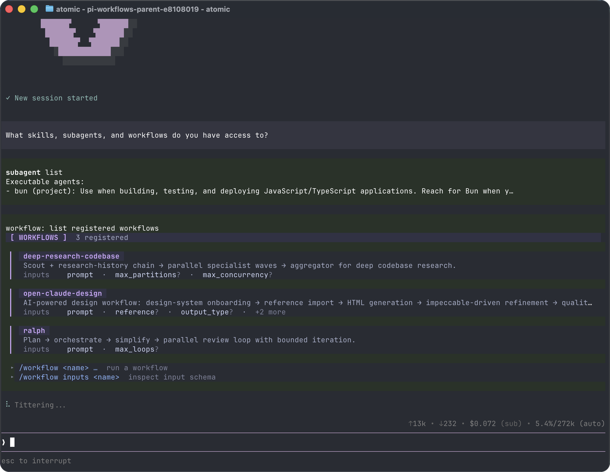

# Using Atomic

This page collects day-to-day usage details that do not fit on the quickstart page.

## Interactive Mode

<p align="center"></p>

The interface has four main areas:

- **Startup header** - shortcuts, loaded context files, prompt templates, skills, and extensions
- **Messages** - user messages, assistant responses, tool calls, tool results, notifications, errors, and extension UI
- **Editor** - where you type; border color indicates the current thinking level
- **Footer** - working directory, session name, token/cache usage, cost, context usage, and current model

The editor can be replaced temporarily by built-in UI such as `/settings` or by custom extension UI.

### Editor Features

| Feature | How |
|---------|-----|
| File reference | Type `@` to fuzzy-search project files |
| Path completion | Press Tab to complete paths |
| Multi-line input | SHIFT+Enter, or CTRL+Enter on Windows Terminal |
| Images | Paste with CTRL+V, ALT+V on Windows, or drag into the terminal |
| Shell command | `!command` runs and sends output to the model |
| Hidden shell command | `!!command` runs without sending output to the model |
| External editor | CTRL+G opens `$VISUAL` or `$EDITOR` |

See [Keybindings](/keybindings) for all shortcuts and customization.

## Slash Commands

Type `/` in the editor to open command completion. Extensions can register custom commands, skills are available as `/skill:name`, and prompt templates expand via `/templatename`.

| Command | Description |
|---------|-------------|
| `/login`, `/logout` | Manage OAuth or API-key credentials |
| `/model` | Switch models |
| `/scoped-models` | Enable/disable models for CTRL+P cycling |
| `/fast` | Toggle Codex fast mode for chat and workflow stages when `openai/*` or `openai-codex/*` models are available |
| `/workflow` | List/run workflows; manage runs (connect/inspect/pause/interrupt/quit/resume); reload workflow resources |
| `/settings` | Thinking level, theme, message delivery, transport |
| `/resume` | Pick from previous sessions |
| `/new` | Start a new session |
| `/name <name>` | Set session display name |
| `/session` | Show session file, ID, messages, tokens, and cost |
| `/tree` | Jump to any point in the session and continue from there |
| `/fork` | Create a new session from a previous user message |
| `/clone` | Duplicate the current active branch into a new session |
| `/compact` | Run Verbatim Compaction with transcript-bound deletion tools |
| `/copy` | Copy last assistant message to clipboard |
| `/export [file]` | Export session to HTML |
| `/share` | Upload as private GitHub gist with shareable HTML link |
| `/reload` | Reload keybindings, extensions, skills, prompts, and context files |
| `/hotkeys` | Show all keyboard shortcuts |
| `/changelog` | Display version history |
| `/exit` | Exit Atomic |
| `/quit` | Quit Atomic |

## Message Queue

You can submit messages while the agent is still working:

- **Enter** queues a steering message, delivered after the current assistant turn finishes executing its tool calls.
- **ALT+Enter** queues a follow-up message, delivered after the agent finishes all work.
- **Escape** or **Ctrl+C** aborts the running agent and restores queued messages to the editor. When idle, Ctrl+C clears the editor (press twice to exit).
- **ALT+Up** retrieves queued messages back to the editor.

On Windows Terminal, ALT+Enter is fullscreen by default. Remap it as described in [Terminal setup](/terminal-setup) if you want Atomic to receive the shortcut.

Configure delivery in [Settings](/settings) with `steeringMode` and `followUpMode`.

## Sessions

Sessions are saved automatically to `~/.atomic/agent/sessions/`, organized by working directory.

```bash
atomic -c                  # Continue most recent session
atomic -r                  # Browse and select a session
atomic --no-session        # Ephemeral mode; do not save
atomic --session <path|id> # Use a specific session file or partial session ID
atomic --session-id <id>   # Use/create an exact project-local session ID
atomic --name "Refactor"   # Set the session display name
atomic --fork <path|id>    # Fork a session into a new session file
```

When `--session-id` does not match an exact session in the current project, Atomic warns that no session was found and then creates the requested new session. Reusing an existing exact ID opens it without that warning.

Useful session commands:

- `/session` shows the current session file and ID.
- `/tree` navigates the in-file session tree and can summarize abandoned branches.
- `/fork` creates a new session from an earlier user message.
- `/clone` duplicates the current active branch into a new session file.
- `/compact` uses verbatim line compaction: the model selects one-based numbered ranges to delete, Atomic validates them, and retained text is reconstructed mechanically with `(filtered N lines)` markers. Exactly the configured number of newest context-visible messages remains ordinary; the default is two and zero preserves none.

See [Sessions](/sessions) and [Compaction](/compaction) for details.

## Context Files

Atomic loads `AGENTS.md` or `CLAUDE.md` at startup from:

- `~/.atomic/agent/AGENTS.md` for global instructions
- parent directories, walking up from the current working directory
- the current directory

Use context files for project conventions, commands, safety rules, and preferences. Disable loading with `--no-context-files` or `-nc`.

### System Prompt Files

Replace the default system prompt with:

- `.atomic/SYSTEM.md` for a project
- `~/.atomic/agent/SYSTEM.md` globally

Append to the default prompt without replacing it with `APPEND_SYSTEM.md` in either location.

## Exporting and Sharing Sessions

Use `/export [file]` to write a session to HTML.

Use `/share` to upload a private GitHub gist with a shareable HTML link.

Treat exported and shared sessions as sensitive: transcripts can contain source code, file paths, credentials, and other private data from your session. Review a session before sharing it, and only upload transcripts you are comfortable making accessible to anyone with the link.

## CLI Reference

```bash
atomic [options] [@files...] [messages...]
```

Use `--` to end option parsing when positional prompt text begins with `-`, `--`, or `@`. Every argument after the terminator is treated as literal message text rather than an option or file argument:

```bash
atomic --print -- "- leading-dash prompt"
```

### Package Commands

```bash
atomic install <source> [-l]       # Install package, -l for project-local
atomic remove <source> [-l]        # Remove package
atomic uninstall <source> [-l]     # Alias for remove
atomic update [source|self|atomic] # Update Atomic only, or one package source
atomic update --all                # Update Atomic and packages; reconcile pinned git refs
atomic update --extensions         # Update packages only; reconcile pinned git refs
atomic update --models             # Force-refresh authenticated provider model catalogs
atomic update --self               # Update Atomic only
atomic update --extension <src>    # Update one package
atomic list                        # List installed packages
atomic config                      # Enable/disable package resources
```

These commands manage Atomic packages and `atomic update` can update the Atomic CLI installation. To uninstall Atomic itself, see [Quickstart](/quickstart#uninstall). `atomic config` and project package commands accept `--approve`/`--no-approve` to trust or ignore project-local settings for one command. `atomic update` never prompts for project trust.

See [Atomic Packages](/packages) for package sources and security notes.

### Modes

| Flag | Description |
|------|-------------|
| default | Interactive mode |
| `-p`, `--print` | Print response and exit |
| `--mode json` | Output all events as JSON lines; see [JSON mode](/json) |
| `--mode rpc` | RPC mode over stdin/stdout; see [RPC mode](/rpc) |
| `--export <in> [out]` | Export a session to HTML |

In print mode, Atomic also reads piped stdin and merges it into the initial prompt:

```bash
cat README.md | atomic -p "Summarize this text"
```

When a print-mode turn correctly finishes by calling an opt-in terminating structured-output tool created with `createStructuredOutputTool` (for example from an extension, SDK caller, or workflow item with a schema), Atomic ends after that tool result without an extra follow-up assistant turn. Print-mode stdout contains the terminating structured JSON payload, so `atomic -p` remains script-friendly while the same value is also available through the SDK `capture` sink, tool `details`, a configured file sink, workflow `result.structured`, or subagent `result.structuredOutput`. This also works for custom factory names such as `final_decision`. Non-terminating or unrelated tool results are not printed as the final response.

### Model Options

| Option | Description |
|--------|-------------|
| `--provider <name>` | Provider, such as `anthropic`, `openai`, or `google` |
| `--model <pattern>` | Model pattern or ID; supports `provider/id` and optional `:<thinking>` |
| `--api-key <key>` | API key, overriding environment variables |
| `--thinking <level>` | `off`, `minimal`, `low`, `medium`, `high`, `xhigh`, `max`; model capability mapping still governs availability |
| `--models <patterns>` | Comma-separated patterns for CTRL+P cycling |
| `--list-models [search]` | List available models |

### Session Options

| Option | Description |
|--------|-------------|
| `-c`, `--continue` | Continue the most recent session |
| `-r`, `--resume` | Browse and select a session |
| `--session <path\|id>` | Use a specific session file or partial UUID |
| `--session-id <id>` | Use an exact project session ID; warn and create it when missing |
| `--fork <path\|id>` | Fork a session file or partial UUID into a new session |
| `--session-dir <dir>` | Custom session storage directory |
| `--name <name>`, `-n <name>` | Set the session display name |
| `--no-session` | Ephemeral mode; do not save |

### Tool Options

| Option | Description |
|--------|-------------|
| `--tools <list>`, `-t <list>` | Allowlist specific built-in, extension, and custom tools |
| `--exclude-tools <list>`, `-xt <list>` | Denylist specific built-in, extension, and custom tools |
| `--no-builtin-tools`, `-nbt` | Disable built-in tools but keep extension/custom tools enabled |
| `--no-tools`, `-nt` | Disable all tools |

Default built-in tools: `read`, `bash`, `edit`, `write`, `find`, `search`, `ask_user_question`, `todo`. `find.paths` accepts directories, files, or glob paths such as `*.ts` and honors `timeout`; `search` accepts `pattern`, optional `paths`, `i`, `gitignore`, and `skip` for regex content-search pagination. Use `--exclude-tools` to disable one or more tools while leaving the rest available, for example `atomic --exclude-tools ask_user_question`.

### Project Trust Options

| Option | Description |
|--------|-------------|
| `--approve`, `-a` | Trust project-local files/resources for this run |
| `--no-approve`, `-na` | Ignore project-local files/resources for this run |

Project trust gates `.atomic`/legacy `.pi` project resources, project package settings, project-local context files, and `.agents/skills` discovered from the project tree. Saved trust decisions can be managed with `/trust`; see [Security](/security).

### Resource Options

| Option | Description |
|--------|-------------|
| `-e`, `--extension <source>` | Load an extension from path, npm, or git; repeatable |
| `--no-extensions` | Disable extension discovery |
| `--skill <path>` | Load a skill; repeatable |
| `--no-skills` | Disable skill discovery |
| `--prompt-template <path>` | Load a prompt template; repeatable |
| `--no-prompt-templates` | Disable prompt template discovery |
| `--theme <path>` | Load a theme; repeatable |
| `--no-themes` | Disable theme discovery |
| `--no-context-files`, `-nc` | Disable `AGENTS.md` and `CLAUDE.md` discovery |

Combine `--no-*` with explicit flags to load exactly what you need, ignoring settings. Example:

```bash
atomic --no-extensions -e ./my-extension.ts
```

### Other Options

| Option | Description |
|--------|-------------|
| `--system-prompt <text>` | Replace default prompt; context files and skills are still appended |
| `--append-system-prompt <text>` | Append to system prompt |
| `--verbose` | Force verbose startup |
| `-h`, `--help` | Show help |
| `-v`, `--version` | Show version |

### File Arguments

Prefix files with `@` to include them in the message:

```bash
atomic @prompt.md "Answer this"
atomic -p @screenshot.png "What's in this image?"
atomic @code.ts @test.ts "Review these files"
```

### Examples

```bash
# Interactive with initial prompt
atomic "List all .ts files in src/"

# Non-interactive
atomic -p "Summarize this codebase"

# Non-interactive with piped stdin
cat README.md | atomic -p "Summarize this text"

# Different model
atomic --provider openai --model gpt-4o "Help me refactor"

# Model with provider prefix
atomic --model openai/gpt-4o "Help me refactor"

# Model with thinking level shorthand
atomic --model sonnet:high "Solve this complex problem"

# Limit model cycling
atomic --models "claude-*,gpt-4o"

# Read-only mode
atomic --tools read,search,find,ls -p "Review the code"
```

### Environment Variables

| Variable | Description |
|----------|-------------|
| `ATOMIC_CODING_AGENT_DIR` | Override config directory; default is `~/.atomic/agent`. Bundled intercom runtime/config files live under its `intercom/` subdirectory |
| `ATOMIC_CODING_AGENT_SESSION_DIR` | Override session storage directory; overridden by `--session-dir` |
| `ATOMIC_PACKAGE_DIR` | Override package directory, useful for Nix/Guix store paths |
| `ATOMIC_OFFLINE` | Disable startup network operations, including update checks, package update checks, and install/update telemetry |
| `ATOMIC_SKIP_VERSION_CHECK` | Skip the Atomic version update check at startup. This prevents the latest-version request |
| `ATOMIC_TELEMETRY` | Override install/update telemetry: `1`/`true`/`yes` or `0`/`false`/`no`. This does not disable update checks |
| `PI_CACHE_RETENTION` | Provider/upstream-specific prompt-cache retention knob; set to `long` where supported |
| `VISUAL`, `EDITOR` | External editor for CTRL+G |

`PI_*` aliases are also supported for app-specific `ATOMIC_*` variables for legacy compatibility. For example, [Intercom](/intercom) honors `PI_CODING_AGENT_DIR` when `ATOMIC_CODING_AGENT_DIR` is unset and still reads legacy `~/.pi/agent/intercom/config.json` when the Atomic config is absent. `PI_CACHE_RETENTION` is not one of those aliases and has no `ATOMIC_*` equivalent. Use `PI_CACHE_RETENTION=long` when configuring prompt-cache retention for providers/upstreams that support long-lived caches. Intercom's default broker starter works across Node-based installs, Bun source checkouts, and standalone Atomic binaries without requiring `npx`, `tsx`, or `bun` to be present on `PATH`; custom broker commands remain explicit opt-in overrides.

## Design Principles

Atomic keeps the core CLI small, while this distribution bundles first-party package extensions for workflows, subagents, MCP, web access, and [intercom](/intercom). Other workflows can still be installed as extensions or packages, or handled externally with tools such as containers and tmux.

For the full rationale, read the [blog post](https://mariozechner.at/posts/2025-11-30-pi-coding-agent/).
