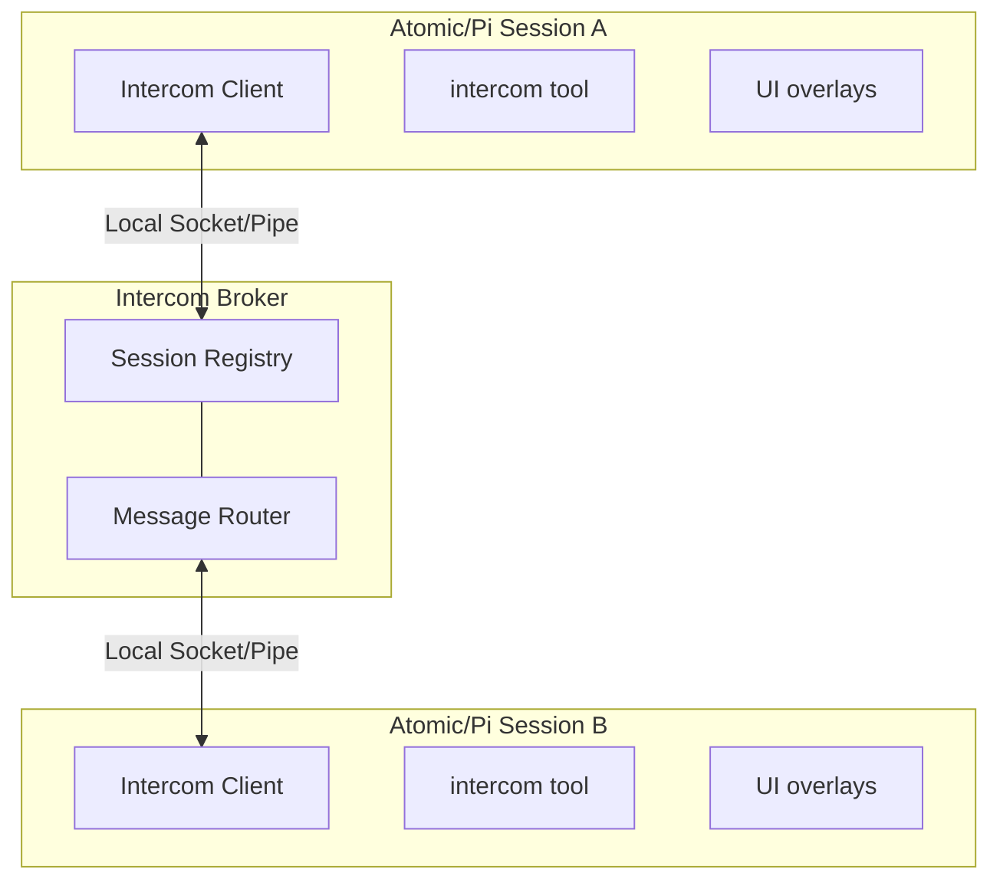

<p>
  
</p>

# Pi / Atomic Intercom

Direct 1:1 messaging between Atomic or pi sessions on the same machine. Send context, findings, or requests from one session to another — whether you're driving the conversation or letting agents coordinate.

```text
User flow: ALT+M or run /intercom to pick a session and send a message
```

## Why

Sometimes you're running multiple Atomic/pi sessions — one researching, one executing, one reviewing. Intercom lets you:

- **User-driven orchestration** — Send context or findings from your research session to your execution session
- **Agent collaboration** — An agent can reach out to another session when it needs help or wants to share results
- **Session awareness** — See what other Atomic/pi sessions are running and their current status

Unlike pi-messenger (a shared chat room for multi-agent swarms), intercom is for targeted 1:1 communication where you pick the recipient.

Intercom also integrates with delegated subagents: child agents get a child-only `contact_supervisor` tool when subagent bridge metadata is present. Atomic-prefixed bridge environment variables are supported, and legacy `PI_*` bridge metadata remains compatible. Atomic's subagent bridge also obtains a broker capability that binds the child session to the exact supervisor; client-authored channel flags are never trusted as cross-group authority. Use `reason: "need_decision"` for blocking clarification, `reason: "interview_request"` for multiple structured supervisor answers, and `reason: "progress_update"` for meaningful plan-changing updates. Normal sessions only see the regular `intercom` tool.

## In One Minute

Intercom connections are normally tool-driven. A bridged child still keeps its own broker connection lazy until it invokes `contact_supervisor`, but Atomic connects the parent Intercom runtime while launching the child to issue a child-bound supervisor capability. The parent retains and restores that capability across broker reconnects, and the broker confirms the supervisor's current session ID when the child registers. Concurrent first-use callers share one import and connection attempt, and broker state is leased to the active session generation and cleaned up on shutdown or replacement.

## Install

Atomic bundles `@bastani/intercom` as a first-party extension; no separate install is needed for normal Atomic sessions. For legacy pi installations of the upstream package:

```bash
pi install npm:pi-intercom
```

Then restart Atomic or Pi. The extension registers the bundled `intercom` skill and lightweight tools at startup, but it does not connect the session until the model or user invokes Intercom.

**Recommended:** Add this snippet to your project's `AGENTS.md` to help agents understand when to coordinate across sessions:

```xml
<intercom>
Coordinate with other local Atomic/pi sessions on related codebases. Use `/skill:intercom` for patterns.

**When:** Same codebase (parallel work), reference codebase (consulting patterns), related repos (shared libraries).

**Not when:** Unrelated codebases, trivial questions, or when you can proceed independently.

**Principle:** Prefer `send` for notifications; `ask` only when blocked waiting for input.
</intercom>
```

A session becomes intercom-connected when all of these are true:
- the intercom extension is installed/bundled and loaded in that session
- `enabled` is not set to `false` in `~/.atomic/agent/intercom/config.json` (Atomic) or the legacy `~/.pi/agent/intercom/config.json` fallback
- the model or user has invoked an Intercom tool, `/intercom`, or the `ALT+M` overlay in that session
- the local broker is running or can be auto-started

The session list only shows intercom-connected sessions, not every open Pi process on the machine.

If a session is unnamed, intercom exposes a runtime-only fallback alias like `subagent-chat-1a2b3c4d` so other sessions can still target it. That alias is not persisted as the session title, so resume pickers can keep showing the transcript snippet instead of a generic `session-...` name.

## Quick Start

### From the Keyboard

**ALT+M** Open or type `/intercom` to open the session list overlay:

1. **Select a session** — Use arrow keys to pick a target session
2. **Compose message** — Write your message in the compose overlay
3. **Send** — Enter Send · Escape Cancel

### From the Agent

The agent can list sessions and send messages using the `intercom` tool. Tool calls and results render as compact transcript rows so send/ask/reply flows are easy to scan. For common patterns like planner-worker delegation, the bundled `pi-intercom` skill provides copy-paste ready examples:

```typescript
// List active sessions
intercom({ action: "list" })
// → **Current session:**
// → • executor (20d43841) — ~/projects/api (claude-sonnet-4) [self, idle]
// → **Other sessions:**
// → • research (6332faab) — ~/projects/api (claude-sonnet-4) [same cwd, thinking]

// Send a message
intercom({ action: "send", to: "research", message: "Check if UserService.validate() handles null" })
// → Message sent to research

// The short ID printed by list is also a valid target
intercom({ action: "ask", to: "6332faab", message: "Which validation path should I use?" })

// Check connection status
intercom({ action: "status" })
// → Connected: Yes, Session ID: abc123, Active sessions: 3

// Send with attachments (code snippets, files, or context)
intercom({
  action: "send",
  to: "worker",
  message: "Here's the fix:",
  attachments: [{
    type: "snippet",
    name: "auth.ts",
    language: "typescript",
    content: "function validate(user: User) { ... }"
  }]
})
```

### Receiving Messages

When a message arrives, it appears inline in your chat with the sender's info and a reply hint:

```
**From research** (~/projects/api)

To reply, use the intercom tool: intercom({ action: "reply", message: "..." })

Found the issue — UserService.validate() doesn't check for null input.
See auth.ts:142-156.
```

The reply hint (enabled by default) points to `intercom({ action: "reply", ... })`, so recipients do not need raw sender or `replyTo` IDs. Idle recipients get a new turn immediately; busy interactive recipients receive the message once they go idle. Attachment content is included in the agent-visible body, and messages are rendered inline and stored in Pi session history.

When a blocking `intercom.ask` targets a workflow stage that has already completed, Atomic uses the stage's retained conversation as a post-mortem chat. It automatically schedules a new turn in that exact conversation, preserving the original ask text and sender/thread correlation, so the target can answer with ordinary `intercom.reply` and the waiting sibling continues without a manual workflow follow-up. The completed stage and workflow DAG remain terminal. The workflow router has single-owner completion semantics: once it claims the ask, later late-message listeners preserve its completion promise regardless of bundled extension registration order. Parent and unrelated sessions cannot satisfy the child-to-child waiter. Deleted, unavailable, non-resumable, or failed-to-reopen targets return a bounded actionable ask error.

For delegated background children, queued messages and terminal lifecycle notices are ordered per child. Intercom claims the terminal child’s pre-terminal ordinary entries in FIFO order and atomically admits that prelude together with the paused, completed, or failed notice. A process-local companion bridge covers lazily loaded extensions whose event buses are distinct, while exact terminal-identity deduplication prevents double admission even when the successful terminal dispatch has no queued prelude. Failed dispatches remain retryable, and pause/resume/completion identities remain distinct. Other children’s entries remain independently queued, messages are not discarded, terminal admission does not wait for a separate model turn, and correlated ask replies still bypass unrelated queued sends.

## Workflow: Planner-Worker Coordination

The most natural use of pi-intercom is splitting a task between two sessions — one holds the big picture, the other does the hands-on work. When the worker hits an ambiguity ("should I optimize for readability or performance here?"), they ask without losing context.

### Setup

Open two terminals and start pi in each. Name them so they can find each other:

```
# Terminal 1                    # Terminal 2
/name planner                   /name worker
```

Verify they see each other from either session:

```typescript
intercom({ action: "list" })
// → • worker — ~/projects/api (claude-sonnet-4) [idle]
```

### The Conversation

Here's how a typical exchange looks. The planner delegates with `send` (fire-and-forget). The worker uses `ask` for anything that needs a response — questions, discoveries, completion reports. `ask` sends the message and blocks until the planner replies, so the worker gets the answer as a tool result and continues in the same turn.

**Planner sends a task:**
```typescript
intercom({
  action: "send",
  to: "worker",
  message: "Task-3: Add retry logic to API client. Key files: src/api/client.ts, src/api/types.ts. Ask if anything's unclear."
})
```

**Worker hits an ambiguity — asks and waits:**
```typescript
intercom({
  action: "ask",
  to: "planner",
  message: "Should retry apply to all endpoints or just idempotent ones? Also, max retry count and backoff strategy?"
})
// → Reply from planner: Only GET/PUT/DELETE — never POST. Max 3 retries, exponential backoff starting at 100ms.
// Worker continues implementing with the answer, same turn, full context.
```

**Worker finds something unexpected — escalates and waits:**
```typescript
intercom({
  action: "ask",
  to: "planner",
  message: "Found: fetchWithTimeout swallows network errors. Fixing this changes the error shape. OK to proceed?"
})
// → Reply from planner: Yes, surface the error types. The current behavior is a bug.
```

**Worker reports completion:**
```typescript
intercom({
  action: "ask",
  to: "planner",
  message: "Task-3 done. Added RetryPolicy type, applied to GET/PUT/DELETE, surfaced NetworkError, 4 tests passing."
})
// → Reply from planner: Looks good. Move on to task-4.
```

### Communication Patterns

| Pattern | Action | Why |
|---------|--------|-----|
| **Task Delegation** | Planner uses `send` | Fire-and-forget. Planner doesn't need to wait for an ack. |
| **Clarification Request** | Worker uses `ask` | Worker needs the answer to proceed. Blocks until reply. |
| **Discovery Escalation** | Worker uses `ask` | Worker needs approval before changing course. |
| **Completion Report** | Worker uses `ask` | Planner might have follow-up instructions or the next task. |

### Reply Hints

When `replyHint` is enabled (the default), incoming messages include the exact `intercom()` call to respond:

```
**From planner** (~/projects/api)

To reply, use the intercom tool: intercom({ action: "reply", message: "..." })

Only GET/PUT/DELETE — never POST. Max 3 retries with exponential backoff starting at 100ms.
```

This matters because the agent receiving the message doesn't need to reconstruct raw `to` and `replyTo` IDs — the hint is right there. Combined with idle-gated `triggerTurn` delivery, it enables real back-and-forth conversation without interrupting work in progress. If the reply happens later instead of in the triggered turn, `intercom({ action: "reply" })` falls back to the single unresolved inbound ask, and `intercom({ action: "pending" })` shows who is still waiting.

### `send` vs `ask`

`send` is fire-and-forget — the tool returns immediately after delivery. By default, it sends immediately even in interactive sessions. If you want an approval dialog before non-reply sends, set `confirmSend: true` in config. Replies that include `replyTo` still skip confirmation so reply-hint flows can continue without an extra approval step.

`ask` sends the message and blocks until the recipient responds (10-minute timeout). The reply comes back as the tool result, so the agent continues in the same turn with full context. No confirmation dialog — if you're asking and waiting, the intent is clear. A completed workflow-stage target with a retained conversation is automatically reopened for one post-mortem turn; unavailable or non-resumable completed targets fail actionably without consuming the full reply timeout.

`reply` is receiver-side sugar for replying to an inbound ask. In the turn triggered by an incoming intercom ask, `intercom({ action: "reply", message: "..." })` targets that exact sender and message automatically. If you reply later, it falls back to the single unresolved inbound ask. If multiple asks are pending, use `intercom({ action: "pending" })` to inspect them and then call `reply` with `to` to disambiguate.

The planner typically uses `send`. If you prefer manual approval for outgoing non-reply messages, turn on `confirmSend: true`. The worker uses `ask` for everything (no confirmation needed, gets answers inline), so it can operate autonomously either way.

## Workflow: Subagent-to-Supervisor Escalation

This workflow requires [`pi-subagents`](https://github.com/nicobailon/pi-subagents) to be installed and to supply child bridge metadata. When `pi-subagents` spawns a delegated child with that metadata, the child session gets a subagent-only `contact_supervisor` tool in addition to the regular `intercom` tool. Normal sessions never see `contact_supervisor`.

### When the Tool Appears

`contact_supervisor` only registers when `pi-subagents` sets all of these environment variables:

- `PI_SUBAGENT_ORCHESTRATOR_TARGET` — the supervisor session name or ID
- `PI_SUBAGENT_RUN_ID` — the run identifier
- `PI_SUBAGENT_CHILD_AGENT` — the agent type
- `PI_SUBAGENT_CHILD_INDEX` — the child index within the run

Atomic's bundled subagent bridge additionally supplies internal `ATOMIC_SUBAGENT_SUPERVISOR_CAPABILITY` and `ATOMIC_SUBAGENT_SUPERVISOR_SESSION_ID` values issued by the broker. They are not user-configurable authentication flags: the broker accepts the capability only for the child scope and supervisor session that requested it, and the parent restores the same secret if the broker reconnects. Legacy `PI_*` aliases remain readable where applicable.

If any are missing, the session falls back to the regular `intercom` tool.

### Three Reasons

| Reason | Behavior | Use When |
|--------|----------|----------|
| `need_decision` | Sends an ask and blocks until the supervisor replies (10-minute timeout) | The subagent is blocked, uncertain, needs approval, or faces a product/API/scope decision |
| `interview_request` | Sends structured questions and blocks until the supervisor replies | The subagent needs multiple machine-readable answers from the supervisor in one exchange |
| `progress_update` | Fire-and-forget update to the supervisor | Meaningful progress or unexpected discoveries that change the plan |

Do not use `contact_supervisor` for routine completion handoffs. Return the final subagent result normally through `pi-subagents`.

Cross-group delivery uses a dedicated broker protocol. Ordinary raw `send` frames always remain group-isolated and are rejected if they include a forged `channel: "supervisor"` marker. A child can cross groups only after its broker-issued capability has bound its registered socket to the exact supervisor. The broker adds the `supervisor` channel marker to validated inbound traffic so parent relays can distinguish it. Replies cross back only when `replyTo` matches a recorded supervisor message in the exact reverse direction; fabricated thread IDs do not bypass isolation.

During a foreground subagent run, Atomic probes for an exact live foreground owner before delivery. The matching child reserves the request, accepts a generation-scoped detach commit, and acknowledges the commit before asks, sends, decisions, interviews, and progress updates enter the parent's model-visible steering queue. A busy workflow stage uses the same handshake before admitting the message through its AgentSession generation boundary, preventing the stage's active subagent tool from blocking the child request that would release it; unclaimed traffic and a still-current receiver whose owner disappears before commit fall back to ordinary admission. One accepted commit releases foreground supervision for every active member of a parallel group while retaining each child process and eventual result. Blocking calls remain alive until the parent sends the exact threaded reply; fire-and-forget calls create no reply waiter. Background and unmatched traffic for ordinary sessions keeps queued-until-idle behavior, and generation cancellation/replacement invalidates stale handshakes.

### Example: Blocked Subagent Asks for Guidance

```typescript
contact_supervisor({
  reason: "need_decision",
  message: "The auth service returns 403 instead of 401 for expired tokens. Should I treat 403 as a re-auth trigger or a hard failure?"
})
// → Reply from supervisor: Treat 403 as re-auth trigger. Update the token refresh logic.
```

### Example: Structured Supervisor Interview

```typescript
contact_supervisor({
  reason: "interview_request",
  message: "Please answer these before I continue the migration.",
  interview: {
    title: "API migration choices",
    questions: [
      { id: "api", type: "single", question: "Which API should I target?", options: ["Stable API", "Experimental API"] },
      { id: "constraints", type: "text", question: "What constraints should I preserve?" }
    ]
  }
})
// → Reply from supervisor: { "responses": [{ "id": "api", "value": "Stable API" }, ...] }
```

### Example: Progress Update

```typescript
contact_supervisor({
  reason: "progress_update",
  message: "Discovered the bug is in the retry wrapper, not the API client. Fixing the wrapper will also close issue #42."
})
// → Progress update sent to supervisor planner
```

### What the Supervisor Sees

The supervisor receives a formatted message with run metadata:

```
**From subagent-worker-78f659a3-1**

Subagent needs a supervisor decision.
Run: 78f659a3
Agent: worker
Child index: 0

Which API should I use?
```

Reply hints work the same as regular `intercom` ask/reply flows. The supervisor can reply with `intercom({ action: "reply", message: "..." })` and the subagent receives the answer as the tool result.

For `interview_request`, the supervisor message includes the structured questions plus a fenced JSON answer example using this stable shape:

```json
{
  "responses": [
    { "id": "api", "value": "Stable API" },
    { "id": "constraints", "value": "Keep the public error shape unchanged." }
  ]
}
```

The supervisor can reply with plain JSON or a fenced `json` block. If the reply matches the `{ "responses": [...] }` shape and references valid question ids/options, the child tool result includes it in `details.structuredReply` while still showing the raw reply text.

## Tool Reference

### intercom

| Parameter | Type | Description |
|-----------|------|-------------|
| `action` | string | `"list"`, `"send"`, `"ask"`, `"reply"`, `"pending"`, or `"status"` |
| `to` | string | Exact session name, exact full ID, or unique ID prefix (for send/ask, or to disambiguate reply) |
| `message` | string | Message text (for send/ask/reply) |
| `attachments` | array | Optional `file`, `snippet`, or `context` attachments |
| `replyTo` | string | Optional message ID for threading or replying to an `ask` |

### contact_supervisor

Only registered in sessions where `pi-subagents` supplied the required child bridge metadata. Contacts the supervisor session that delegated the current task.

| Parameter | Type | Description |
|-----------|------|-------------|
| `reason` | string | `"need_decision"` (blocking), `"interview_request"` (blocking structured questions), or `"progress_update"` (fire-and-forget) |
| `message` | string | The decision request, optional interview note, or progress update |
| `interview` | object | Required for `interview_request`: `{ title?, description?, questions: [...] }` |

**`need_decision`** — Sends a formatted ask to the supervisor and blocks until it replies (10-minute timeout). The reply comes back as the tool result. Includes run metadata in the message so the supervisor knows which subagent is asking.

**`interview_request`** — Sends a formatted, agent-readable interview to the supervisor and blocks until it replies. Questions use a local pi-interview-like shape: `{ id, type, question, options?, context? }` where `type` is `single`, `multi`, `text`, `image`, or `info`. `info` questions are context-only and do not need responses. The supervisor reply should be JSON with `{ "responses": [{ "id": "...", "value": ... }] }`. Parsed JSON replies are returned in `details.structuredReply`.

**`progress_update`** — Sends a non-blocking update to the supervisor. Returns immediately after delivery. Use only for meaningful progress or unexpected discoveries that change the plan.

### intercom actions

**`list`** — Returns the current session plus other active intercom-connected sessions with name, short ID, working directory, model, and live status. Every displayed short ID can be passed directly to `send`, `ask`, or targeted `reply`. Status is derived automatically from Pi lifecycle events: `idle`, `thinking`, or `tool:<name>`.

Target lookup preserves exact full IDs and exact case-insensitive names, then accepts a unique session-ID prefix. If a prefix matches multiple sessions, Intercom reports every match and asks for a longer ID or exact name instead of guessing. Resolving a prefix to the current session still triggers the normal self-target rejection.

**`send`** — Sends a message to the specified session. By default it sends immediately, including in interactive sessions. Set `confirmSend: true` in config if you want a confirmation dialog for non-reply sends. Replies that include `replyTo` skip confirmation. Returns delivery confirmation.

**`ask`** — Sends a message and waits for the recipient to reply (10-minute timeout). The reply is returned as the tool result. No confirmation dialog. Only one pending `ask` is allowed per session at a time; if several blocking requests race (parallel `ask` calls, or `ask` alongside `contact_supervisor`), one wins the reservation and each other call returns a normal "Already waiting for a reply" tool error without disturbing the pending ask. Use this when the agent needs the answer to continue working.

**`reply`** — Replies to the current intercom-triggered message if there is one. Otherwise it falls back to the single unresolved inbound ask. If multiple asks are pending, pass an exact name, exact full ID, or unique ID prefix in `to`, or inspect them with `pending` first. Under the hood this is still a normal `send` with the exact `replyTo` value.

**`pending`** — Lists unresolved inbound asks with sender, message ID, elapsed time, and a short preview. Useful when replying after the original triggered turn.

**`status`** — Shows connection status, session ID, and total count of active sessions (including the current session).

## Keyboard Shortcuts

| Key | Action |
|-----|--------|
| ALT+M | Open session list overlay |
| ↑/↓ | Navigate session list |
| Enter | Select session / Send message |
| Escape | Cancel / Close overlay |

## Config

Create `~/.atomic/agent/intercom/config.json` for Atomic. Legacy pi-compatible installs and fallbacks continue to read `~/.pi/agent/intercom/config.json` when the Atomic config is absent:

```json
{
  "brokerCommand": "npx",
  "brokerArgs": ["--no-install", "tsx"],
  "confirmSend": false,
  "enabled": true,
  "replyHint": true,
  "status": "researching"
}
```

The default `npx --no-install tsx` pair is a compatibility sentinel: intercom recognizes it and starts the broker through the current Atomic/Pi runtime (`process.execPath`). Node-based installs use that runtime with a resolved `tsx` CLI, falling back to Atomic's bundled `jiti` loader when `tsx` is unavailable; Bun source-checkout runs use the current Bun executable directly; standalone Atomic Bun binaries re-enter the split launcher through a narrow internal broker handoff. Default startup therefore does not rely on `npx`, `tsx`, or `bun` being on `PATH`.

| Setting | Default | Description |
|---------|---------|-------------|
| `brokerCommand` | `"npx"` | Command used to start the local broker process; the default sentinel is hardened internally to avoid PATH lookup |
| `brokerArgs` | `["--no-install", "tsx"]` | Arguments passed to `brokerCommand` before the broker script path |
| `confirmSend` | false | Show a confirmation dialog before non-reply sends from an interactive session with UI |
| `enabled` | true | Enable/disable intercom entirely |
| `replyHint` | true | Include reply instruction in incoming messages |
| `status` | — | Optional custom status suffix shown after the automatic lifecycle status, for example `thinking · researching` |

Existing pi-compatible configs that set a custom broker command still work. For example, if you intentionally want to use Bun from `PATH`, configure it explicitly:

```json
{
  "brokerCommand": "bun",
  "brokerArgs": []
}
```

Intercom publishes live session status automatically. Sessions register as `idle`, switch to `thinking` while the agent is running, show `tool:<name>` during tool execution, and return to `idle` on agent completion. If `status` is set in config, it is appended as context instead of replacing the lifecycle status.

## How It Works



The broker is a standalone TypeScript process that manages session registration and message routing. It auto-spawns when the first intercom-enabled session needs it and exits after 5 seconds when the last connected session disconnects. Clients now reconnect automatically if the broker disappears and later comes back.

Messages use length-prefixed JSON over a local socket/pipe transport (4-byte length + JSON payload) to handle fragmentation properly. The protocol includes request correlation for session listing, explicit delivery failures, and validation for malformed or out-of-order messages.

Async extension work (startup, inbound flushes, reconnects, overlays, and relays) no-ops if the session shuts down or reloads before it settles.

Runtime files live under the active agent directory. Atomic defaults to `~/.atomic/agent/intercom/`; setting `ATOMIC_CODING_AGENT_DIR` moves the broker socket, PID, spawn lock, Windows launcher, and config below that directory. The legacy `PI_CODING_AGENT_DIR` alias remains supported when the Atomic variable is unset. Legacy pi-compatible defaults use `~/.pi/agent/intercom/`.

- `broker.sock` — Unix domain socket for communication (macOS/Linux only; Windows uses a named pipe instead)
- `broker-launch.vbs` — Windows helper script used to launch the broker without a console window
- `broker.pid` — Broker process ID
- `broker.spawn.lock` — Short-lived lock used to avoid duplicate auto-spawns
- `config.json` — User configuration

## Design Decisions

**Local IPC instead of TCP.** Same-machine only by design. `pi-intercom` uses Unix sockets on macOS/Linux and a named pipe on Windows, which keeps setup simple and avoids port management.

**Auto-spawn with file lock.** The broker starts on first connection and exits after 5 seconds idle. There is no daemon to manage. A spawn lock file, keyed by PID and timestamp, prevents duplicate brokers when multiple sessions start at once.

**`ask` stays client-side.** The broker still routes plain messages; it does not have a special request/response mode for `ask`. The client waits for a matching reply before it triggers a new turn, then returns that reply as the tool result. Reply hints make that flow practical by showing the recipient the exact `send` call to use. Separately, `list` / `sessions` now carry a `requestId` so a delayed session-list reply cannot be mistaken for a newer one.

## pi-intercom vs pi-messenger

| Aspect | pi-intercom | pi-messenger |
|--------|-------------|--------------|
| **Model** | Direct 1:1 messaging | Shared chat room |
| **Primary use** | User orchestrating sessions | Autonomous agent coordination |
| **Discovery** | Broker-based (real-time) | File-based registry |
| **Messages** | Private, session-to-session | Broadcast to all agents |
| **Persistence** | In Pi session history | Shared coordination files |

Use pi-messenger for multi-agent swarms working on a shared task. Use pi-intercom when you want to manually coordinate your own sessions or have one agent reach out to another specific session.

## File Structure

```
~/.pi/agent/extensions/pi-intercom/
├── package.json
├── index.ts              # Extension entry point
├── types.ts              # SessionInfo, Message, protocol types
├── config.ts             # Config loading
├── broker/
│   ├── broker.ts         # Broker process
│   ├── client.ts         # IntercomClient class
│   ├── framing.ts        # Length-prefixed JSON protocol
│   ├── paths.ts          # Platform-specific socket/pipe paths
│   ├── spawn.ts          # Auto-spawn logic with lock file
│   ├── spawn.test.ts     # Broker spawn tests
│   └── paths.test.ts     # Path resolution tests
├── ui/
│   ├── session-list.ts   # Session selection overlay
│   ├── compose.ts        # Message composition overlay
│   └── inline-message.ts # Received message display
└── skills/
    └── pi-intercom/
        └── SKILL.md      # Bundled skill for common patterns
```

## Limitations

- **Same machine only** — Uses local sockets/pipes, no network support
- **No dedicated intercom log** — Messages are kept in Pi session history, but there is no separate intercom transcript or inbox
- **No attachments UI** — `file`, `snippet`, and `context` attachments are supported in the protocol, but not in the compose overlay
- **Only connected sessions appear** — The list shows Pi sessions that have loaded `pi-intercom` and successfully registered with the broker, not every open Pi process on the machine
- **Broker lifecycle** — The broker auto-spawns on first use and exits when idle; sessions reconnect automatically if the broker restarts
