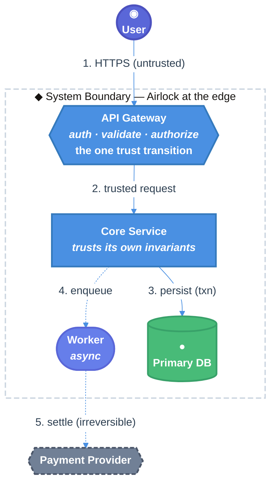

You are tasked with creating a spec for implementing a new feature or system change in the codebase by leveraging existing research in the **$ARGUMENTS** path. If no research path is specified, use the entire `research/` directory. IMPORTANT: Research documents are located in the `research/` directory — do NOT look in the `specs/` directory for research. Follow the template below to produce a comprehensive specification as output in the `specs/` folder using the findings from RELEVANT research documents found in `research/`. The spec file MUST be named using the format `YYYY-MM-DD-topic.md` (e.g., `specs/2026-03-26-my-feature.md`), where the date is the current date and the topic is a kebab-case summary. Tip: It's good practice to use the `codebase-research-locator` and `codebase-research-analyzer` agents to help you find and analyze the research documents in the `research/` directory. It is also HIGHLY recommended to cite relevant research throughout the spec for additional context.

## Ask Clarifying Questions Before You Start

- If the user's request is vague or lacks necessary details, ask clarifying questions to gather more information before starting the spec creation process. This will help ensure that the spec is comprehensive and aligned with the user's needs.

### Determine the compatibility posture

- Before decomposing the spec creation request, identify whether this project must preserve backward compatibility for real downstream users.
- If the user explicitly allows breaking changes, public API changes, cleanup, or says there are no real users/downstream dependencies, allow breaking changes.
- If the user mentions production users, published APIs, downstream consumers, migration safety, or compatibility requirements, disallow breaking changes.
- If the posture is not inferable from the request, ask the user once before continuing, using the available structured question tool when possible.
- Carry this posture into the spec creation plan, the final spec frontmatter, and a `## Backwards Compatibility` section in the final spec.
- When allowing breaking changes, document existing legacy behavior, compatibility shims, optional flags, and public APIs as current state, not as constraints future specs must preserve unless the user explicitly asks for preservation.
- When not allowing breaking changes, document public APIs, compatibility-sensitive surfaces, downstream callers, migration constraints, and behavior that future work must preserve.

## Design philosophy: a spec is a theory of its doors

The entrypoints of a program, read together, are the program's **theory of its own purpose**. Everything inside the boundary is mechanism — the *how*. Only at the boundary does the code speak in terms of meaning — the *what* and the *why*. So the single most important thing this spec defines is not the mechanism inside the system, but the **set of doors** the system keeps: the functions, routes, and RPC methods through which untrusted input arrives and irreversible effects happen.

Two acts hide inside that claim, and a good spec performs both. One is *finding* the doors — discovering where the domain is already jointed, using the research in `research/` to learn what actually matters in the world the software serves. The other is *crafting* them — naming and shaping each door so it tells the truth about what lies behind it. Treat entrypoint design as the spine of the spec: a reviewer should be able to read the door set alone and reconstruct what the system is *for* before reading a single implementation detail.

Apply the five principles below to every entrypoint the spec introduces or changes, and run the rubric on each.

### The five principles

1. **Name a joint, not a tool.** A domain has seams — places reality is already divided into meaningful units (*authenticate a user, settle a payment, revoke access, publish a draft*). These exist before your code does. Name each door after such a joint, never after the mechanism behind it (`run the query`, `call the service`, `update the row`). A door named for a tool lets a reader learn *how it works* without ever learning *what it is for* — an ontological mismatch no clean mechanism repairs. Listen to the domain (and to the research), not to the code.

2. **Compress honestly, or not at all.** A door's value is roughly the ratio of mechanism hidden to surface exposed — *but only when the name promises exactly what the body delivers.* No less (so it hides no danger or incompleteness), no more (so it implies no guarantee it does not keep). A `save()` that sometimes silently doesn't, a `delete()` that soft-deletes, a `validate()` that mutates, a `getUser()` that creates one — each is a lie at the boundary, and lies at the boundary compound across every caller who reasons from the name. Encode cost and risk in the vocabulary (cheap-borrow vs allocate vs consume; `read` vs `read_exact`; panic-risk in the name).

3. **Intent lives in what the door refuses.** A boundary communicates as much by what it forbids as by what it allows. The *shape* of the door set — what it makes easy, what it makes impossible — is a direct statement of what the designers held sacred. Prefer making the illegal **unrepresentable** (in types and structure) over merely *checked* at runtime: a door that checks a rule trusts the caller; a door that makes the rule structurally necessary need trust no one. Use newtypes (`AccountId`, `OrderId`) over primitives, sum types over independent booleans, and capability-carrying types (an `AdminSession`, an `AuthorizedCharge`) that can only be produced by the door that earns them.

4. **Write for the stranger across time.** You craft the door not for the machine but for a competent stranger who arrives years from now, never meets you, and must understand the system's purpose before they dare change it. The governing test: **could they reconstruct the purpose of the system from the entrypoints alone, without reading a single body?** If they would have to read implementations to learn what the system *means*, intent has leaked out of the doors into the mechanism.

5. **Keep the dangerous doors few and honest.** The maturity of a system is visible in how few doors guard its irreversible effects — and how truthfully those doors are named. Every place money moves, access is granted, data is destroyed, a key is minted, a message is broadcast: funnel each effect through **one honestly-named chokepoint**, so the promise that guards it has exactly one home. Scatter danger across many small unnamed paths (every handler that can `chargeCard`, broad DB grants reaching `DROP TABLE`, ad-hoc `os.system(...)`, default-public storage) and no one — not even the authors — can say where the weight is carried.

### The rubric you run on every entrypoint in the spec

For each non-trivial entrypoint the spec introduces or changes, walk these in order. Stop at the first one you cannot answer cleanly — that is a finding, and it belongs in the spec (often in §5 as a constraint, or in §9 as an open question). Run it **forward** to audit a door you've drafted, and **backward** — asking what door each obligation deserves — to find the doors the system is still missing.

1. **Joint, not tool.** Is the name a unit of domain intent a non-engineer would recognize — not a description of the mechanism? If you can only name it in implementation terms, it's a step, not a door.
2. **The sentence holds.** Can you state its guarantee in one declarative sentence with no *and*? If not, it's fused (split it) or undefined (the most dangerous case — stop and find out what it actually promises).
3. **The name is honest.** Does it promise exactly what the body will deliver — hiding no danger, implying no guarantee it won't keep? List the ways the name could be read as a lie.
4. **Obligations are discharged.** Read the pre / invariant / post / *never* off the sentence. Does each obligation map to a real step in the design, and each step to an obligation?
5. **Every exit keeps the promise.** Walk the error return, the retry, the timeout, the partial write, the concurrent caller, the second entry. The guarantee must survive all of them, not just the happy path.
6. **The refusals are real.** What does this door make impossible? Are the illegal states unrepresentable, or merely checked and trusted?
7. **The trust transition is explicit and singular.** If untrusted becomes trusted or authority increases, does it happen here — and only here?
8. **Irreversible effects pass one chokepoint.** Is this the single dominating door for the effect it guards? If the effect can be reached another way, that other way is the bug.
9. **The airlock is at the boundary.** Validation, authorization, conversion, and the error boundary live at the door, leaving the inside free to trust its own invariants. Defensive code deep within means the boundary is misplaced.
10. **A stranger could reconstruct intent.** Could someone read this door alone — name and signature, not the body — and know what it is for and what it owes?

### The joint is the same at every boundary

`settle_payment` in process, `POST /v1/payment_intents/{id}/capture` over REST, and `Billing.SettlePayment` over gRPC are **one door, three transports, one name**. When the function, the route, and the RPC method disagree about what the joints are, at least one of them is naming a tool — flag it. On the wire, the HTTP verb is honesty the protocol gives you for free (`GET` is *safe*, `PUT`/`DELETE` are *idempotent*, `POST` is neither — which is exactly why money doors carry an `Idempotency-Key`), and the status code is the door's honest exit (`201` created, `204` done, `202` accepted; `409`/`412` are real refusals). The cardinal lie is `200 OK` wrapping `{"error": ...}`. Authentication is one gate at the edge so every handler behind it may trust it speaks to a known caller.

<EXTREMELY_IMPORTANT>

- Please use your ask_user_question tool to provide a rich interface to ask the user for their input on a question.
- Please DO NOT implement anything in this stage, just create the comprehensive spec as described below.
- When writing the spec, DO NOT include information about concrete dates/timelines (e.g. # minutes, hours, days, weeks, etc.) and favor explicit phases (e.g. Phase 1, Phase 2, etc.).
- The spec MUST treat its entrypoint set as a first-class artifact. Section 5 is built around the **doors** (typed signatures, named failures, refusals expressed in types) and must pass the rubric above. Do not let intent leak into mechanism: a reviewer should reconstruct the system's purpose from §4.4 and §5.1 alone.
- If the spec is for a workflow with reviewer gates plus final actions (for example PR/MR/review creation, release tagging, deployment, or publication), explicitly separate implementation/review acceptance from those post-approval final actions. The workflow design should tell reviewers/reducers to approve and stop the implementation loop when implementation and validation criteria are proven and only an explicitly authorized final action remains; carry that remainder as a next action/final-action field instead of another implementation iteration.
- If the spec is for a workflow or workflow prompt refactor, require local, action-oriented stage/reviewer/reducer prompts. A model stage sees its prompt, artifacts, tools, and reads — not the workflow graph's name or surrounding implementation details unless explicitly provided — so the spec should prefer instructions like "review the current code delta" or "create/update the review request" over labels such as "the create-PR workflow stage", "this Goal run", or "the Ralph reviewer" unless that name is user-visible context or materially changes behavior.
- Once the spec is generated ask questions one at a time OR in logical groups:
  - Refer to section "## 9. Open Questions / Unresolved Issues", go through each question one by one, and use **contrastive clarification** (presenting 2-3 specific options with concrete tradeoffs) rather than open-ended questions. This means presenting interpretations like "(A) Option X — tradeoff Y" and "(B) Option Z — tradeoff W" instead of asking "what do you think about X?". Update the spec with the user's answers as you walk through the questions.
  - Interview the user relentlessly about every aspect of this plan/spec until you reach a shared understanding with them. Walk down each branch of the design tree, resolving dependencies between decisions one-by-one. For each question, provide your recommended answer (i.e., **contrastive clarification**). Pay special attention to the **doors**: every disagreement about what a joint is, what a door promises, what it refuses, or where a dangerous effect is funneled is a question worth resolving with the user.
  - If a question can be answered by exploring the codebase, explore the codebase instead and confirm with the user that this is their inferred intent.
- Finally, once the spec is generated and after open questions are answered, provide an executive summary of the spec to the user including the path to the generated spec document in the `specs/` directory.
    - In the summary, list the door set by name alone (the stranger-across-time view) and call out which doors guard irreversible effects.
    - Encourage the user to review the spec for best results and provide feedback or ask any follow-up questions they may have.

</EXTREMELY_IMPORTANT>

# [Project Name] Technical Design Document / RFC

| Document Metadata      | Details                                                                        |
| ---------------------- | ------------------------------------------------------------------------------ |
| Author(s)              | !`git config user.name`                                                        |
| Status                 | Draft (WIP) / In Review (RFC) / Approved / Implemented / Deprecated / Rejected |
| Team / Owner           |                                                                                |
| Created / Last Updated |                                                                                |

## 1. Executive Summary

_Instruction: A "TL;DR" of the document. Assume the reader is a VP or an engineer from another team who has 2 minutes. Summarize the Context (Problem), the Solution (Proposal), and the Impact (Value). Name the one or two **doors** at the heart of the change. Keep it under 200 words._

> **Example:** This RFC proposes replacing our current nightly batch billing system with an event-driven architecture. Currently, billing delays cause a 5% increase in customer support tickets. The proposed solution introduces two money doors — `authorize_charge` (reversible hold) and `settle_payment` (irreversible capture) — as the single chokepoint for outbound money, reducing billing latency from 24 hours to <5 minutes while making double-charges structurally impossible.

## 2. Context and Motivation

_Instruction: Why are we doing this? Why now? Link to the Product Requirement Document (PRD) and cite the relevant `research/` documents._

### 2.1 Current State

_Instruction: Describe the existing architecture. Use a "Context Diagram" if possible. Be honest about the flaws — including which existing doors **leak** (named for tools, dishonest compression, scattered danger)._

- **Architecture:** Currently, Service A communicates with Service B via a shared SQL database.
- **Limitations:** This creates a tight coupling; when Service A locks the table, Service B times out.
- **Leaking doors (today):** e.g. `chargeCard(token, cents)` is reachable from checkout, the retry job, *and* the admin panel — no one owns "charge exactly once." `processPayment(...) -> bool` collapses a declined card, a network failure, and a duplicate submission into the same `false`.

### 2.2 The Problem

_Instruction: What is the specific pain point?_

- **User Impact:** Customers cannot download receipts during the nightly batch window.
- **Business Impact:** We are losing $X/month in churn due to billing errors.
- **Technical Debt:** Danger is scattered; the boundary is misplaced, with defensive code deep inside the core instead of at the door.

## 3. Goals and Non-Goals

_Instruction: This is the contract / Definition of Success. Be precise._

### 3.1 Functional Goals

- [ ] Users must be able to export data in CSV format.
- [ ] System must support multi-tenant data isolation.

### 3.2 Non-Goals (Out of Scope)

_Instruction: Explicitly state what you are NOT doing. Remember: **intent lives in what the door refuses** — the doors you deliberately do not build are as much a statement of purpose as the ones you do. This prevents scope creep._

- [ ] We will NOT support PDF export in this version (CSV only).
- [ ] We will NOT migrate data older than 3 years.
- [ ] We will NOT expose a second path to move money; `settle_payment` remains the only chokepoint.

## 4. Proposed Solution (High-Level Design)

_Instruction: The "Big Picture." Diagrams are mandatory here._

### 4.1 System Architecture Diagram

_Instruction: Insert a C4 System Context or Container diagram. Show the "Black Boxes" and mark where the **airlock** sits (the single edge where untrusted network becomes a trusted request)._



### 4.2 Architectural Pattern

_Instruction: Name the pattern (e.g., "Event Sourcing", "BFF — Backend for Frontend", "Publisher-Subscriber")._

- We are adopting a Publisher-Subscriber pattern where the Order Service publishes `OrderCreated` events, and the Billing Service consumes them asynchronously.

### 4.3 Key Components

| Component         | Responsibility              | Technology Stack  | Justification                                |
| ----------------- | --------------------------- | ----------------- | -------------------------------------------- |
| Ingestion Service | Validates incoming webhooks | Go, Gin Framework | High concurrency performance needed.         |
| Event Bus         | Decouples services          | Kafka             | Durable log, replay capability.              |
| Projections DB    | Read-optimized views        | MongoDB           | Flexible schema for diverse receipt formats. |

### 4.4 The Door Set at a Glance (Stranger-Across-Time View)

_Instruction: List the entrypoint **names alone** — no signatures, no bodies. A competent stranger should reconstruct the system's purpose from this list. If they cannot, intent has leaked into the mechanism; return to §5 and rename until they can. Mark every door that guards an irreversible effect with ⚠._

> **Example:** `register_account`, `authenticate`, `authorize_charge`, `settle_payment` ⚠, `grant_access` ⚠, `revoke_access`, `publish_draft`. Reading these alone tells you who the system lets in, that money moves in exactly two steps and only those two, who may hand out access, and what it means for work to go live.

## 5. Detailed Design

_Instruction: The "Meat" of the document. Sufficient detail for an engineer to start coding. Lead with the **doors** — they are the load-bearing part of the spec — then describe the mechanism behind them._

### 5.1 The Doors (Entrypoint Contracts)

_Instruction: For each non-trivial entrypoint, give a typed signature (typed pseudocode is fine — read the types, not the syntax), the one-sentence guarantee (no "and"), the named failure set, and the refusals it enforces in the type system. Then record the rubric result. Make illegal states **unrepresentable**, not merely checked. Cite the `research/` doc that establishes each joint._

```
// — Money. Two doors, and there is no third way to move a cent. —

authorize_charge(
  account: AccountId,            // newtype: cannot be confused with any other id
  amount: Money,                 // currency-typed: USD and JPY will not add
  idempotency_key: IdempotencyKey,
): Result<AuthorizedCharge, ChargeError>
// Guarantee: places a reversible hold and returns proof an authorization exists.
// ChargeError = InsufficientFunds | CardDeclined | NetworkError | DuplicateKey

settle_payment(
  authorized: AuthorizedCharge,  // ← can ONLY be produced by authorize_charge
  idempotency_key: IdempotencyKey,
): Result<Settlement, SettlementError>
// Guarantee: captures the held funds. IRREVERSIBLE. The single chokepoint for outbound money.
// You cannot settle a charge you did not authorize — not because a check forbids it,
// but because there is no way to CONSTRUCT an AuthorizedCharge except by calling
// authorize_charge. The illegal state is unrepresentable. The idempotency key makes
// the retry, the double-click, and the at-least-once queue converge on ONE settlement.
```

**Per-door audit (run the rubric):**

| Door               | (1) Joint       | (2) One sentence, no "and"   | (3) Honest name                 | (5) Every exit                                   | (6) Refusals real                         | (7) Trust transition | (8) One chokepoint             |
| ------------------ | --------------- | ---------------------------- | ------------------------------- | ------------------------------------------------ | ----------------------------------------- | -------------------- | ------------------------------ |
| `authorize_charge` | ✅ business verb | ✅ "places a reversible hold" | ✅                               | retry → `DuplicateKey`; timeout → `NetworkError` | currency mismatch unrepresentable         | n/a                  | reversible, not the chokepoint |
| `settle_payment` ⚠ | ✅ business verb | ✅ "captures held funds"      | ✅ irreversibility in doc + type | replay converges via key                         | cannot settle un-authorized charge (type) | n/a                  | ✅ the sole outbound-money door |

### 5.2 API Interfaces — The Same Doors on the Wire

_Instruction: A web service's real boundary is its transport surface. The URL names the joint, the HTTP verb declares its safety class, the status code is the door's honest exit. Never `200 OK` wrapping an error. The wire door MUST carry the same name as its in-process twin (§5.1)._

```
# Identity — the one trust transition, at the edge
POST   /v1/sessions                       201 Created      # = authenticate; 401 on bad credentials
DELETE /v1/sessions/current               204 No Content   # = log out

# Money — two doors, one chokepoint, idempotent under retry
POST   /v1/payment_intents                201   Idempotency-Key: <key>   # = authorize_charge (reversible)
POST   /v1/payment_intents/{id}/capture   200   Idempotency-Key: <key>   # = settle_payment (IRREVERSIBLE)
#   409 Conflict if the key is replayed with a different body
#   422 Unprocessable if the intent was never authorized

# Access — authority demanded by the route, destructive door made idempotent
POST   /v1/accounts/{id}/grants           201   (admin scope required)            # = grant_access
DELETE /v1/grants/{id}                     204   (204 even if already revoked)     # = revoke_access

# Publishing — the domain's own verb, refusing to clobber a concurrent edit
POST   /v1/drafts/{id}/publish            200   If-Match: <etag>                   # = publish_draft
#   412 Precondition Failed if the draft moved under you — the wire's --force-with-lease
```

_If using gRPC, define the same joints in the `.proto`; the typed request message is the airlock by construction. Use honest status codes (`INVALID_ARGUMENT`, `PERMISSION_DENIED`, `NOT_FOUND`, `ALREADY_EXISTS`, `FAILED_PRECONDITION`, retryable `ABORTED`/`UNAVAILABLE`) — never a lone `OK` carrying an error field._

### 5.3 Data Model / Schema

_Instruction: Provide ERDs or JSON schemas. Discuss normalization vs. denormalization. Prefer schemas that make illegal states unrepresentable (sum-type status columns over independent boolean flags)._

**Table:** `invoices` (PostgreSQL)

| Column    | Type | Constraints                          | Description                    |
| --------- | ---- | ------------------------------------ | ------------------------------ |
| `id`      | UUID | PK                                   |                                |
| `user_id` | UUID | FK -> Users                          | Partition Key                  |
| `status`  | ENUM | 'DRAFT','LOCKED','PROCESSING','PAID' | A sum type, not three booleans |

### 5.4 Algorithms and State Management

_Instruction: Describe complex logic, state machines, or consistency models. Tie each state transition to the door that performs it._

- **State Machine:** An invoice moves `DRAFT` → `LOCKED` → `PROCESSING` → `PAID`; the `PROCESSING → PAID` transition happens only through `settle_payment`.
- **Concurrency:** Optimistic locking on the `version` column; on the wire this surfaces as `If-Match`/`412`.

## 6. Alternatives Considered

_Instruction: Prove you thought about trade-offs — including alternative **door sets** (e.g., one god endpoint vs. distinct joints). Why is your boundary better than the others?_

| Option                                      | Pros                                        | Cons                                                   | Reason for Rejection                                                           |
| ------------------------------------------- | ------------------------------------------- | ------------------------------------------------------ | ------------------------------------------------------------------------------ |
| Option A: Single `POST /execute {action}`   | One route, flexible                         | God door; intent hidden in payload; danger un-funneled | Fails "joint, not tool" and "few dangerous doors."                             |
| Option B: One-step `chargeCard()`           | Fewest calls                                | No reversible hold; retries double-charge              | Cannot make double-charge unrepresentable.                                     |
| Option C: `authorize` + `settle` (Selected) | Reversible hold; one chokepoint; idempotent | Two calls instead of one                               | **Selected:** the two real joints, with the irreversible effect funneled once. |

## 7. Cross-Cutting Concerns

### 7.1 Security and Privacy

_Instruction: This is where "keep the dangerous doors few and honest" and "the airlock at the boundary" become concrete._

- **The trust transition is singular:** untrusted callers become trusted only at `POST /v1/sessions` / the gateway. No other door promotes an anonymous caller. (Rubric #7.)
- **Authority carried by type:** destructive/privileged doors demand a capability (`AdminSession`) that only `authenticate` can mint — the permission check cannot be forgotten at a call site because there is no call site where it is absent. (Rubric #6.)
- **Irreversible effects pass one chokepoint:** money via `settle_payment`, deletion via the single guarded door; the catastrophic version must be asked for explicitly. (Rubric #8.)
- **Data Protection:** PII (names, emails) encrypted at rest (AES-256); `Password` is a newtype that cannot be logged, printed, or compared by accident.
- **Threat Model:** Primary threat is a compromised API key; remediation is rapid rotation and rate limiting.

## 8. Test Plan

_Instruction: Test the doors at their promises and their refusals — not just the happy path. Every exit in rubric #5 deserves a test. The interactive verification is what lets a human or another agent confirm the feature is correct without reading the bodies — the stranger-across-time test, made executable._

- **Unit Tests:** each door's named failure variants; the *refusals* (e.g., a type/construction test proving `settle_payment` cannot accept anything but an `AuthorizedCharge`).
- **End-to-End Tests:** full domain flows named by joint (register → authenticate → authorize → settle), driven through the real wire doors of §5.2.
- **Integration Tests:** idempotency under replay (same key → one settlement); concurrent-edit `412`; trust transition (no door promotes an anonymous caller except `authenticate`).
- **Fuzz / Property Tests:** throw malformed and adversarial input at the doors (the airlock); the boundary must reject everything the types forbid and never crash the core. Assert invariants over random inputs (e.g., `settle_payment` converges on one settlement under any interleaving of retries; no input sequence reaches a money move except through the chokepoint).
- **Interactive Verification:** a runnable checklist or script a human OR another agent can execute to confirm the feature was implemented correctly — each step names a door, supplies an input, and states the expected honest exit (status code / named error / resulting state), so correctness is observable from the boundary alone. Include the exact commands or requests to run and the pass/fail condition for each.

## 9. Open Questions / Unresolved Issues

_Instruction: List known unknowns. These must be resolved before the doc is marked "Approved." Include any door whose rubric could not be answered cleanly — especially undefined guarantees (rubric #2, the most dangerous case) and any irreversible effect not yet funneled to a single chokepoint (rubric #8). Resolve these with the user via contrastive clarification._

- [ ] Is `publish_draft` the only door that moves a draft to live, or can the admin panel also publish? (If the latter, the effect is not yet funneled — rubric #8.)
- [ ] What exactly does `authorize_charge` promise on a partial provider outage — is the guarantee defined? (rubric #2.)
- [ ] Will the Legal team approve the 3rd-party library for PDF generation?
- [ ] Does the current VPC peering allow connection to the legacy mainframe?