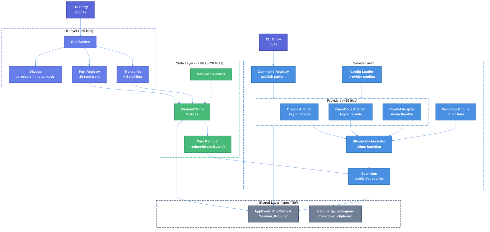

# Atomic V2 Rebuild Technical Design Document

| Document Metadata      | Details     |
| ---------------------- | ----------- |
| Author(s)              | lavaman131  |
| Status                 | Draft (WIP) |
| Team / Owner           | Atomic CLI  |
| Created / Last Updated | 2026-03-15  |

## 1. Executive Summary

This RFC proposes a ground-up rebuild of the Atomic TUI application to address three systemic architectural failures: (1) a dual-pipeline streaming system that creates race conditions and silent event drops across three coding agent SDKs, (2) an un-unified workflow SDK where the only built-in workflow (Ralph) bypasses the engine entirely, and (3) organic complexity growth resulting in 82K lines of TypeScript with 9 circular dependency pairs, ~55 React hooks in state management alone, and a 34-property god interface (`CommandContext`). The rebuild consolidates the dual event system (25 `AgentEvent` + 28 `BusEvent` types) into a single `StreamEvent` type, replaces 35+ adapter files with ~15 using async generator-based translation, reduces the state layer from 18K to ~2K lines via a single Zustand store with pure reducers, replaces the 8.7K-line graph engine with plain async functions (~1K lines), and replaces the 34-property `CommandContext` god interface and separate `WorkflowContext` with a single unified `AppContext` (4 fields: `session`, `publish`, `subscribe`, `abortSignal`) shared across workflows, commands, and UI. Total target: **~60% codebase reduction** while fixing all documented streaming instabilities.

## 2. Context and Motivation

### 2.1 Current State

The Atomic TUI is a 576-file, ~82K-line TypeScript/Bun terminal application built on OpenTUI that wraps three coding agent SDKs (Claude Agent SDK, OpenCode SDK, Copilot SDK) behind a unified chat interface with autonomous workflow support.

**Current architecture**:

```
┌──────────────────────────────────────────────────────────┐
│  CLI Entry:  cli.ts → commands/cli/{chat,init,update}    │
│  TUI Entry:  app.tsx                                     │
└───────────────────────────┬──────────────────────────────┘
                            ▼
┌──────────────────────────────────────────────────────────┐
│  UI Layer (screens/, components/, theme/, hooks/)         │
│  ~8,695 lines │ 38+ component files │ 4-level nesting    │
└───────────────────────────┬──────────────────────────────┘
                            ▼
┌──────────────────────────────────────────────────────────┐
│  State Layer (state/chat/ [8 sub-modules], state/parts/, │
│              state/streaming/, state/runtime/)            │
│  ~18,475 lines │ ~55 hooks │ 9 circular dep pairs        │
└───────────────────────────┬──────────────────────────────┘
                            ▼
┌──────────────────────────────────────────────────────────┐
│  Service Layer (services/agents/, services/events/,       │
│     services/workflows/, services/config/,                │
│     services/agent-discovery/, services/models/,          │
│     services/telemetry/, services/system/)                │
│  ~46,573 lines │ 35+ adapter files │ dual event system    │
└───────────────────────────┬──────────────────────────────┘
                            ▼
┌──────────────────────────────────────────────────────────┐
│  Shared Layer (types/, lib/)                              │
│  ~1,362 lines │ domain logic leaked into lib/             │
└──────────────────────────────────────────────────────────┘
```

_Source: [Atomic V2 Rebuild Spec Index](../research/docs/v1/2026-03-15-atomic-v2-rebuild-spec-index.md)_

**Quantitative profile**:

| Directory                                          | Lines      | % of Total |
| -------------------------------------------------- | ---------- | ---------- |
| `services/`                                        | 46,573     | 57%        |
| `state/`                                           | 18,475     | 23%        |
| `components/`                                      | 7,218      | 9%         |
| `commands/`                                        | 4,925      | 6%         |
| Other (lib, types, theme, hooks, screens, scripts) | 4,560      | 5%         |
| **TOTAL**                                          | **81,751** | **100%**   |

### 2.2 The Problem

Nine systemic issues make incremental fixes insufficient:

1. **Dual-pipeline streaming fragility**: SDK events traverse two translation steps (`AgentEvent` → adapter → `BusEvent`), with 28 adapter files across 3 providers using different internal abstractions. 12 event types are emitted but never consumed. Subagent premature completion has been investigated across 5+ research documents without resolution.
   _Ref: [Streaming Pipeline Spec](../research/docs/v1/2026-03-15-spec-01-streaming-pipeline.md)_

2. **Dual-channel race conditions**: Agent lifecycle events flow through direct `useBusSubscription` hooks while tool content flows through `StreamPipelineConsumer`, creating races where tool events arrive before their `AgentPart` exists (silent drops).
   _Ref: [From-Scratch Rebuild Spec](../research/docs/v1/2026-03-15-atomic-from-scratch-rebuild-spec.md)_

3. **Un-unified workflow SDK**: `CodingAgentClient` has 5 optional methods, `Session` has 5 optional methods, `CommandContext` has 34 properties coupling 7+ concerns. The `WorkflowSDK` class exists but is never used in production; Ralph bypasses it entirely.
   _Ref: [Workflow Engine Spec](../research/docs/v1/2026-03-15-spec-04-workflow-engine.md)_

4. **State layer complexity**: 18,475 lines with 8 boundary-enforced sub-modules, a 3,127-line `shared/` dumping ground, a 4,381-line `stream/` module, and a 6-line `session/` module (lifecycle scattered elsewhere).
   _Ref: [State Management Spec](../research/docs/v1/2026-03-15-spec-03-state-management.md)_

5. **Over-engineered graph engine**: 8,725 lines with 7 node types, subgraphs, checkpointing, Zod schemas per node, 4-action error recovery — all serving a single consumer (Ralph).
   _Ref: [Workflow Engine Spec](../research/docs/v1/2026-03-15-spec-04-workflow-engine.md)_

6. **9 circular dependency pairs**: Including `commands ↔ services`, `components ↔ state`, `screens ↔ state`. `services/agents/types.ts` is imported 109 times (54 external).
   _Ref: [Foundation Layer Spec](../research/docs/v1/2026-03-15-spec-00-foundation-layer.md)_

7. **Dead code**: 6 dead modules, 6 unrendered UI components, 12 unconsumed event types.

8. **Config triplication**: Agent definitions (10 agents, 12 skills) mirrored identically across `.claude/`, `.opencode/`, `.github/` (33 files each, 99 total).

9. **`CommandContext` god interface + fragmented contexts**: 34 properties/methods coupling 7+ concerns, plus a separate `WorkflowContext` creating two context patterns. Replace both with a single unified `AppContext` (4 fields) using `publish`/`subscribe` for all event communication.
   _Ref: [Command System Spec](../research/docs/v1/2026-03-15-spec-07-command-system.md)_

## 3. Goals and Non-Goals

### 3.1 Functional Goals

- [ ] Unify the dual event system into a single `StreamEvent` discriminated union (~20 types)
- [ ] Eliminate streaming race conditions by enforcing single-pass event flow (SDK → adapter → bus → subscribers)
- [ ] Remove optional methods from provider interfaces — branch on `providerType` where needed
- [ ] Reduce state layer from ~18,475 lines to ~2,000 lines via single Zustand store + pure reducer
- [ ] Replace the 8,725-line graph engine with plain async functions (~1,000 lines)
- [ ] Replace `CommandContext` (34 properties) and separate `WorkflowContext` with a single unified `AppContext` (4 fields) with `publish`/`subscribe` event communication
- [ ] Achieve rendering parity between main chat and workflow sub-agent content
- [ ] Use 16ms-aligned batching in the stream orchestrator for smooth rendering
- [ ] Eliminate all 9 circular dependency pairs
- [ ] Remove all dead code (6 modules, 6 components, 12 event types)

### 3.2 Non-Goals (Out of Scope)

- [ ] We will NOT change the external user-facing CLI interface (`atomic chat`, `atomic init`, etc.)
- [ ] We will NOT change the OpenTUI rendering framework
- [ ] We will NOT add new SDK integrations beyond Claude, OpenCode, and Copilot
- [ ] We will NOT migrate to a different state management library (Zustand is retained)
- [ ] We will NOT redesign the visual theme or color system (Catppuccin retained)
- [ ] We will NOT implement SDK V2 APIs (V1 preferred per project docs)

## 4. Proposed Solution (High-Level Design)

### 4.1 System Architecture Diagram



### 4.2 Architectural Patterns

| Pattern            | V1 (Current)                                              | V2 (Proposed)                           | Rationale                                            |
| ------------------ | --------------------------------------------------------- | --------------------------------------- | ---------------------------------------------------- |
| Event System       | Dual (`AgentEvent` → `BusEvent`)                          | Single `StreamEvent`                    | Eliminate translation layer and coverage gaps        |
| Adapter Output     | Imperative `bus.emit()`                                   | `AsyncIterable<StreamEvent>`            | Testable, composable, backpressure-compatible        |
| Provider Interface | Optional methods (`?`)                                    | No optionals — branch on `providerType` | Static capabilities, no runtime detection needed     |
| State Management   | 8 sub-modules + boundary enforcement                      | Single store + pure reducer             | Radical simplification, trivially testable           |
| Graph Engine       | 7 node types, checkpointing, subgraphs                    | Plain async functions                   | No engine needed — workflows are just code           |
| Execution Context  | 34-property `CommandContext` + separate `WorkflowContext` | Unified `AppContext` (4 fields)         | One context for everything — workflows, commands, UI |
| Side Effects       | 12 boolean flags on `CommandResult`                       | `ctx.publish()` inline events           | Everything is events — no deferred action arrays     |
| Component Props    | 55-property `ChatShellProps`                              | Direct store subscriptions              | Eliminate controller indirection                     |

### 4.3 Key Components

| Component          | Responsibility               | V1 Size       | V2 Target    | Reduction |
| ------------------ | ---------------------------- | ------------- | ------------ | --------- |
| Streaming Pipeline | Event translation + delivery | ~7,100 lines  | ~500 lines   | 93%       |
| Provider Adapters  | SDK → `StreamEvent`          | ~35 files     | ~15 files    | 57%       |
| State Layer        | Application state            | ~18,475 lines | ~2,000 lines | 89%       |
| Executables        | Commands + workflows + Ralph | ~13,650 lines | ~1,500 lines | 89%       |
| Config Service     | Agent config management      | ~3,722 lines  | ~300 lines   | 92%       |
| Telemetry          | Event tracking               | ~2,018 lines  | ~150 lines   | 93%       |

## 5. Detailed Design

### 5.1 Foundation Layer (Spec 00)

_Full research: [Foundation Layer Spec](../research/docs/v1/2026-03-15-spec-00-foundation-layer.md)_

#### 5.1.1 Unified StreamEvent Type

The dual event system (25 `AgentEvent` types + 28 `BusEvent` Zod schemas) collapses into a single `StreamEvent` discriminated union of ~20 Zod-validated types:

```typescript
// types/events.ts
interface StreamEventBase {
    type: StreamEventType;
    sessionId: string;
    runId: number;
    timestamp: number;
}

type StreamEventType =
    | "text.delta"
    | "text.complete"
    | "thinking.delta"
    | "thinking.complete"
    | "tool.start"
    | "tool.complete"
    | "agent.start"
    | "agent.update"
    | "agent.complete"
    | "session.start"
    | "session.idle"
    | "session.error"
    | "session.retry"
    | "turn.start"
    | "turn.end"
    | "permission.requested"
    | "permission.responded"
    | "human_input.required"
    | "human_input.responded"
    | "usage"
    | "session.title_changed"
    | "session.compaction";
```

Key normalizations:

- **Tool IDs**: `toolUseId`, `toolUseID`, `toolCallId` → single `toolId`
- **No callbacks in events**: `respond` functions are handled by a separate `InteractionLayer`
- **No open index signatures**: Every field is explicitly typed via Zod schemas
- **`turn.end` includes `finishReason`**: `"tool-calls" | "stop" | "max-tokens" | "max-turns" | "error" | "unknown"` — directly addresses documented subagent premature completion

#### 5.1.2 Provider Interface

```typescript
// types/provider.ts
interface Session {
    readonly id: string;
    stream(message: string, options: StreamOptions): AsyncIterable<StreamEvent>;
    abort(): Promise<void>;
    destroy(): Promise<void>;
}

interface CodingAgentProvider {
    readonly providerType: "claude" | "opencode" | "copilot";
    createSession(config: SessionConfig): Promise<Session>;
    start(): Promise<void>;
    stop(): Promise<void>;
    getModelInfo(hint?: string): Promise<ModelInfo>;
}
```

No capability detection system. The provider type is known and static — branch on `provider.providerType` where provider-specific behavior is needed.

#### 5.1.3 Unified AppContext

The V1 `CommandContext` (34 properties) and the separate `WorkflowContext` are replaced with a single `AppContext` shared across **all** execution surfaces — workflows, commands, and UI components. One context type, one composition root, seamless transitions between chat, commands, and workflows.

```typescript
interface AppContext {
    // Session — the full reactive app state
    session: AppStore; // Zustand store: messages, context, UI, agents

    // Pub/Sub — unified event communication
    publish(event: AppEvent): void; // Send any event (UI widget, SDK message, action)
    subscribe<T extends AppEventType>(
        type: T,
        handler: AppEventHandler<T>,
    ): Unsubscribe;

    // Lifecycle
    abortSignal: AbortSignal; // Cancellation (per-session scope)
}
```

**4 fields** — not 34. Not fragmented across two context types. No agent configs or spawn methods polluting the interface — those are service-layer concerns.

**`session`** represents the **entire application state** — think the full session context. It gets updated when the user clears (`/clear`) or compacts (`/compact`). It contains session ID, provider type, messages, context usage, compaction state, UI state, agent state — everything. Backed by the Zustand store, so UI components get reactive subscriptions and services get snapshots via `session.getState()`.

**`publish`/`subscribe`** is the unified communication channel. Everything is events:

```typescript
// Send a UI event to render a widget
ctx.publish({ type: "render-widget", widget: "task-list", data: tasks });

// Send a message to the active coding agent SDK session
ctx.publish({
    type: "message.send",
    prompt: "Analyze this code",
    agent: "planner",
});

// Trigger a state action (what was dispatch)
ctx.publish({ type: "clear-messages" });

// Stream events from adapters (what was emit)
ctx.publish({
    type: "text.delta",
    content: "Hello",
    sessionId,
    runId,
    timestamp,
});

// Listen for any event
ctx.subscribe("text.delta", (event) => {
    /* render text */
});
ctx.subscribe("agent.complete", (event) => {
    /* handle completion */
});
```

**No agent spawning on AppContext.** The TUI talks to **one** active coding agent SDK at a time. There is no feature that activates another SDK backend — the user closes the TUI and opens a different coding agent to switch. Agent interaction goes through the active session via `publish({ type: "message.send" })`, and the stream orchestrator handles routing to the SDK. Workflow helpers for awaiting responses are utility functions in the workflow service layer, not on the context.

**No discovered agent configs on AppContext.** Agent discovery (`DiscoveryResult`) is a service-layer concern consumed by the config loader and startup sequence. It doesn't belong on the shared context that flows to every component.

**`abortSignal`** is scoped per session. Workflows and long-running commands can create child signals via `AbortSignal.any()` when they need independent cancellation.

The startup sequence (`services/startup.ts`) constructs the `AppContext` once, and it flows to every consumer:

- **Executables** (commands + workflows): `executable.execute(args, ctx)` — uses `ctx.publish()` for events, `ctx.subscribe()` for responses, `ctx.session` for state
- **UI Components**: access `AppContext` via React context provider (`useAppContext()`) — uses `ctx.session` for reactive subscriptions, `ctx.publish()` for dispatching events

#### 5.1.4 Unified Executable Types

Commands and workflows are the same thing — an executable with a name that takes args and a context. No separate `CommandDefinition`/`WorkflowDefinition` or `CommandResult`/`WorkflowResult`. Two types cover everything:

```typescript
interface ExecutableDefinition {
    name: string;
    description: string;
    execute(args: string, ctx: AppContext): Promise<ExecutionResult>;
}

interface ExecutionResult {
    success: boolean;
    message?: string;
    error?: string;
}
```

`/clear` is an executable. `/ralph` is an executable. A custom workflow loaded from `.atomic/workflows/` is an executable. They all have the same signature: `(args, ctx) → result`. The difference is behavioral — a command like `/clear` publishes one event and returns, while `/ralph` runs a loop publishing many events over minutes. The interface doesn't care.

#### 5.1.5 Proposed Shared Layer File Organization

```
types/
├── events.ts             # AppEvent (unified discriminated union), StreamEvent subtypes (inferred from Zod)
├── provider.ts           # Session, CodingAgentProvider, capabilities
├── chat.ts               # ChatMessage, Part (moved FROM state/chat/shared/types/)
├── context.ts            # AppContext — the single unified context (4 fields)
├── executable.ts         # ExecutableDefinition, ExecutionResult — the unified executable types
├── mcp.ts                # McpServerConfig, McpSnapshot (moved FROM lib/ui/)
├── models.ts             # ModelInfo, ModelDisplayInfo
├── parallel-agents.ts    # ParallelAgent, AgentStatus
└── ui.ts                 # FooterState, VerboseProps

schemas/
├── events.ts             # StreamEvent Zod schemas (runtime validation)
└── tasks.ts              # WorkflowTask Zod schemas

lib/
├── deep-merge.ts
├── path-guard.ts
├── markdown.ts
└── clipboard.ts
```

> **Design Decision (Q1):** Zod schemas live in `schemas/`, not `types/`. Types are inferred via `z.infer<>` and re-exported from `types/`. This preserves the "no runtime values in `types/`" architectural invariant.

### 5.2 Streaming Pipeline (Spec 01)

_Full research: [Streaming Pipeline Spec](../research/docs/v1/2026-03-15-spec-01-streaming-pipeline.md)_

#### 5.2.1 Single-Pass Event Flow

Replace the dual-translation pipeline with a single-pass flow:

```
V1: SDK → AgentEvent → Adapter → BusEvent → BatchDispatcher → Consumer → State
V2: SDK → ProviderAdapter → StreamOrchestrator → EventBus → Subscribers
```

Provider adapters return `AsyncIterable<StreamEvent>` instead of imperatively pushing to the bus:

```typescript
interface ProviderAdapter {
    stream(
        session: Session,
        message: string,
        options: StreamOptions,
    ): AsyncIterable<StreamEvent>;
    dispose(): void;
}

interface StreamOptions {
    runId: number;
    messageId: string;
    abortSignal?: AbortSignal;
    agent?: string;
}
```

#### 5.2.2 Stream Orchestrator

A single orchestrator wires adapter to bus to state:

```typescript
interface StreamOrchestrator {
    startRun(
        session: Session,
        adapter: ProviderAdapter,
        message: string,
        options: RunOptions,
    ): StreamRunHandle;
}

interface StreamRunHandle {
    readonly runId: number;
    readonly done: Promise<StreamRunResult>;
    abort(): void;
}
```

The orchestrator is responsible for:

1. Iterating the adapter's async iterable
2. Batching events in 16ms-aligned frames before emission
3. Emitting validated batches to the bus
4. Handling errors — emitting `session.error`, returning `StreamRunResult`
5. Abort propagation via `AbortSignal`

#### 5.2.3 EventBus Backs Publish/Subscribe

The `EventBus` is the implementation behind `AppContext.publish()` / `AppContext.subscribe()`. It handles the unified `AppEvent` type — stream events, command actions, message sends, UI events — all flow through the same bus.

```typescript
interface EventBus {
    publish(event: AppEvent): void;
    publishBatch(events: AppEvent[]): void;
    subscribe<T extends AppEventType>(
        type: T,
        handler: AppEventHandler<T>,
    ): Unsubscribe;
    subscribeAll(handler: (event: AppEvent) => void): Unsubscribe;
    dispose(): void;
}
```

Key changes from V1:

- Plain object, **not** a React context provider — framework-agnostic
- Unified `AppEvent` type replaces both `BusEvent` and `CommandAction`
- `publish`/`subscribe` naming matches `AppContext` API
- `publishBatch()` for burst-producing adapters
- No `EnrichedBusEvent` with decorator fields — enrichment at subscriber level

#### 5.2.4 Interaction Layer Separation

Callbacks are removed from event data. A separate `InteractionLayer` handles permissions and human input:

```typescript
interface InteractionLayer {
    requestPermission(request: PermissionRequest): Promise<string>;
    requestInput(request: InputRequest): Promise<string>;
}
```

Events become fully serializable. The coupling between event production and UI interaction is broken.

### 5.3 Provider SDK Unification (Spec 02)

_Full research: [Provider SDK Unification Spec](../research/docs/v1/2026-03-15-spec-02-provider-sdk-unification.md)_

#### 5.3.1 Unified Adapter Contract

Each adapter is a single async generator function:

```typescript
// Example: Claude adapter
function createClaudeAdapter(client: ClaudeAgentSDKClient): ProviderAdapter {
    return {
        async *stream(session, message, options) {
            yield makeEvent("session.start", options, {});
            const sdkStream = session.stream(message, {
                agent: options.agent,
                abortSignal: options.abortSignal,
            });
            const toolState = new Map<
                string,
                { name: string; startTime: number }
            >();
            for await (const chunk of sdkStream) {
                yield* translateChunk(chunk, options, toolState);
            }
            yield makeEvent("session.idle", options, {
                reason: "stream-complete",
            });
        },
        dispose() {
            /* cleanup */
        },
    };
}
```

A single SDK chunk may produce 0 to N `StreamEvent` objects via `yield*`. Tool ID normalization (`toolUseId`/`toolUseID`/`toolCallId` → `toolId`) is a local `Map` + counter inside each adapter — no separate abstraction.

#### 5.3.2 Copilot EventEmitter Bridge

Bridges Copilot's push-based EventEmitter to pull-based `AsyncIterable`:

```typescript
function createEventChannel<T>(): {
    put(event: T): void;
    close(): void;
    error(err: Error): void;
    [Symbol.asyncIterator](): AsyncIterator<T>;
};
```

#### 5.3.4 Target Directory Structure

```
services/providers/
├── types.ts                    # CodingAgentProvider interface
├── claude/
│   ├── client.ts              # ClaudeProvider
│   ├── adapter.ts             # async *stream() → StreamEvent
│   ├── hooks.ts               # Claude SDK hook registration
│   └── binary-resolver.ts     # Find claude binary
├── opencode/
│   ├── client.ts              # OpenCodeProvider
│   ├── adapter.ts             # async *stream() → StreamEvent
│   └── session-sync.ts        # Child session handling
├── copilot/
│   ├── client.ts              # CopilotProvider
│   ├── adapter.ts             # async *stream() → StreamEvent
│   └── buffer.ts              # EventEmitter bridge
└── factory.ts                 # createProvider(agentType)
```

**~15 files** (down from ~35).

### 5.4 State Management (Spec 03)

_Full research: [State Management Spec](../research/docs/v1/2026-03-15-spec-03-state-management.md)_

#### 5.4.1 Single Zustand Store — 5 Slices

Replace all 8 chat sub-modules with one store:

```typescript
interface AppState {
    session: SessionState; // sessionId, isActive, contextUsage, title, isCompacting, model, provider
    messages: MessagesState; // messageIds[], messages Map, parts Map
    stream: StreamState; // currentRun, queue, isStreaming
    foregroundAgents: Map<string, AgentState>; // visible agent sessions (main chat, sub-agents)
    backgroundAgents: Map<string, AgentState>; // non-visible agent sessions (workflow workers)
    ui: UIState; // verboseMode, scrollLocked, modelDisplay, pendingPermission, pendingHumanInput
    actions: AppActions; // mutations
}

interface AgentState {
    name: string; // e.g., "planner", "worker", "reviewer"
    status: "idle" | "streaming" | "completed" | "error";
    taskId?: string; // Workflow task this agent is executing
    startedAt: number;
    error?: string;
}
```

#### 5.4.2 Pure Event Reducer

A single function maps every `StreamEvent` to a state mutation:

```typescript
function reduceStreamEvent(
    state: AppState,
    event: StreamEvent,
): Partial<AppState> | ((s: AppState) => Partial<AppState>);
```

Handles 17 event types. Each handler is pure: `(state, eventData) → stateUpdate`. Every event-to-state mapping is visible in one place. Trivially testable.

#### 5.4.3 Derived State via Selectors

Common computed values as pure selector functions:

```typescript
const selectIsStreaming = (s: AppState) => s.stream.currentRun !== null;
const selectMessageCount = (s: AppState) => s.messages.messageIds.length;
const selectActiveAgents = (s: AppState) => /* filter foregroundAgents + backgroundAgents by status */;
const selectFooterState = (s: AppState) => /* compose streaming, verbose, queue, model */;
```

#### 5.4.4 Module Relocations

| Current Module           | Current Size | New Location                     | Rationale                  |
| ------------------------ | ------------ | -------------------------------- | -------------------------- |
| `state/chat/keyboard/`   | 1,740 lines  | `components/keyboard-handler.ts` | UI concern                 |
| `state/chat/composer/`   | 1,169 lines  | Component-local state            | Input-local state          |
| `state/chat/command/`    | 805 lines    | `services/commands/executor.ts`  | Transient service          |
| `state/chat/controller/` | 2,178 lines  | **Eliminated**                   | Direct store subscriptions |
| `state/chat/shared/`     | 3,127 lines  | **Absorbed** into store          | Boundary overhead gone     |

#### 5.4.5 Target Structure

```
state/
├── store.ts          # Zustand store definition
├── reducer.ts        # StreamEvent → state mutation
├── selectors.ts      # Derived state selectors
├── parts.ts          # Part accumulation (used by reducer)
├── agents.ts         # AgentState type, foreground/background agent logic (used by reducer)
├── wiring.ts         # Store ↔ EventBus connection
└── types.ts          # State type definitions
```

**~7 files, ~2,000 lines** (down from 18,475 lines, 89% reduction).

### 5.5 Workflow Engine (Spec 04)

_Full research: [Workflow Engine Spec](../research/docs/v1/2026-03-15-spec-04-workflow-engine.md)_

#### 5.5.1 Workflows Are Just Async Functions

No graph engine, no node types, no executor loop. A workflow is just an `ExecutableDefinition` (see §5.1.4) — same type as commands. The difference is behavioral, not structural: workflows are long-running executables that publish many events over time.

Workflows receive the same `AppContext` as commands and UI components (see §5.1.3). They interact with the active coding agent SDK session entirely through `ctx.publish()` / `ctx.subscribe()`:

- **Send a message to the SDK**: `ctx.publish({ type: "message.send", prompt, agent: "planner" })`
- **Listen for responses**: `ctx.subscribe("agent.complete", handler)`
- **Update task UI**: `ctx.publish({ type: "update-tasks", tasks })`
- **Read state**: `ctx.session.getState()`

The stream orchestrator subscribes to `"message.send"` events and routes them to the active provider session. The provider session streams back `StreamEvent`s through the bus. The workflow subscribes to completions and collects results.

**Workflow helpers** (`services/workflows/helpers.ts`) wrap the pub/sub pattern into convenient async functions:

```typescript
// Send a message and await the agent's complete response
async function sendMessage(
    ctx: AppContext,
    prompt: string,
    opts?: { agent?: string },
): Promise<AgentResult>;

// Send messages in parallel and await all responses
async function sendParallel(
    ctx: AppContext,
    tasks: { prompt: string; agent?: string }[],
): Promise<AgentResult[]>;
```

These are service-layer utilities, **not** on `AppContext`. They internally use `ctx.publish()` + `ctx.subscribe()`.

Workflow-specific state (task lists, progress tracking) is managed via local variables within the `run()` function — no separate `WorkflowState` object.

**Discovery config locations per provider** (from CLAUDE.md):

| Provider    | Config Root  | Agents                  | Skills                        | Other                                                           |
| ----------- | ------------ | ----------------------- | ----------------------------- | --------------------------------------------------------------- |
| Claude Code | `.claude/`   | `.claude/agents/*.md`   | `.claude/skills/*/SKILL.md`   | `CLAUDE.md`                                                     |
| OpenCode    | `.opencode/` | `.opencode/agents/*.md` | `.opencode/skills/*/SKILL.md` | `.opencode/opencode.json`                                       |
| Copilot CLI | `.github/`   | `.github/agents/*.md`   | `.github/skills/*/SKILL.md`   | —                                                               |
| Shared      | `.atomic/`   | —                       | —                             | `.atomic/settings.json`, `.atomic/workflows/`, `.atomic/tools/` |
| MCP         | —            | —                       | —                             | `.mcp.json`, `.vscode/mcp.json`                                 |

**Global config paths** (also discovered):

| Provider    | Linux/MacOS                                 | Windows                |
| ----------- | ------------------------------------------- | ---------------------- |
| Claude Code | `~/.claude`                                 | `%HOMEPATH%\.claude`   |
| OpenCode    | `$XDG_CONFIG_HOME/.opencode`, `~/.opencode` | `%HOMEPATH%\.opencode` |
| Copilot CLI | `$XDG_CONFIG_HOME/.copilot`, `~/.copilot`   | `%HOMEPATH%\.copilot`  |

**Current agent inventory** (mirrored across all 3 providers):

- `planner`, `worker`, `reviewer` — Ralph workflow agents
- `debugger` — Debugging specialist
- `codebase-analyzer`, `codebase-locator`, `codebase-pattern-finder` — Code exploration
- `codebase-online-researcher` — Web research
- `codebase-research-analyzer`, `codebase-research-locator` — Research document analysis

**Current skill inventory** (~12 skills mirrored across providers):

- `create-spec`, `research-codebase`, `testing-anti-patterns`, `init`, `explain-code`
- `impeccable`, `prompt-engineer`, `browser`
- `gh-commit`, `gh-create-pr`, `sl-commit`, `sl-submit-diff`

#### 5.5.2 Ralph as an Async Function

```typescript
const ralph: ExecutableDefinition = {
    name: "ralph",
    description: "Autonomous task planner and executor",
    async execute(args, ctx) {
        // 1. Plan — send to the active SDK session via publish, await via helper
        const plan = await sendMessage(ctx, PLANNER_PROMPT, {
            agent: "planner",
        });
        const tasks = parseTasks(plan.output);
        ctx.publish({
            type: "update-tasks",
            tasks: tasks.map((t) => ({ id: t.id, status: "pending" })),
        });

        // 2. Execute loop — workers use the "worker" agent from configs
        while (getReadyTasks(tasks).length > 0) {
            if (ctx.abortSignal.aborted)
                return { success: false, error: "aborted" };

            const ready = getReadyTasks(tasks);
            ctx.publish({
                type: "update-tasks",
                tasks: ready.map((t) => ({ id: t.id, status: "in_progress" })),
            });

            const results = await sendParallel(
                ctx,
                ready.map((t) => ({
                    prompt: buildWorkerPrompt(t),
                    taskId: t.id,
                    agent: "worker",
                })),
            );

            for (const result of results) {
                const status = result.success ? "completed" : "error";
                updateTask(tasks, result.taskId, status);
            }
            ctx.publish({ type: "update-tasks", tasks });

            // 3. Review — use the "reviewer" agent from configs
            const review = await sendMessage(ctx, buildReviewPrompt(results), {
                agent: "reviewer",
            });
            if (review.hasFindings) {
                const fixTasks = parseFixTasks(review.output);
                tasks.push(...fixTasks);
                ctx.publish({ type: "update-tasks", tasks });
            }
        }

        return { success: true };
    },
};
```

Key improvements over V1:

- **Unified `AppContext`** — same `ctx` as commands and UI. A workflow uses `ctx.publish()` / `ctx.subscribe()` for everything — no separate workflow context.
- **All communication via publish/subscribe** — `sendMessage()` and `sendParallel()` are helpers that wrap `ctx.publish({ type: "message.send" })` + `ctx.subscribe("agent.complete")`. Task updates are published as events.
- **Sub-agents from provider configs** — `{ agent: "planner" }`, `{ agent: "worker" }`, `{ agent: "reviewer" }` resolve to agent `.md` files defined in the active provider's config directory. Same definitions the interactive chat uses.
- **All ready tasks spawned in parallel** via `sendParallel()` — not just `ready[0]`
- **Tasks explicitly set to `in_progress`** before sending (fixing the documented "blink gap")
- **Control flow is plain TypeScript** — `while`, `if`, `for` — no graph traversal, no `goto`, no edge resolution

#### 5.5.3 Custom Workflows

```typescript
// .atomic/workflows/my-workflow.ts
import { sendMessage } from "@/services/workflows/helpers";

export default {
    name: "my-workflow",
    description: "...",
    async execute(args, ctx) {
        // Same ctx as commands and UI — seamless transitions
        // Send to active SDK session, await response via helper
        const result = await sendMessage(ctx, "Analyze this codebase", {
            agent: "researcher",
        });

        // Read app state directly — same session as everywhere
        const model = ctx.session.getState().session.model;

        // Publish UI events — same publish as commands
        ctx.publish({ type: "show-dialog", dialog: "model" });

        // Send without a named agent (uses default session)
        const summary = await sendMessage(ctx, "Summarize the findings");
    },
};
```

#### 5.5.4 What Is Removed

| Removed Concept                             | Rationale                                                     |
| ------------------------------------------- | ------------------------------------------------------------- |
| `WorkflowGraph` / `WorkflowNode` interfaces | Workflows are plain async functions                           |
| `executeWorkflow()` loop executor           | No executor needed — just `await workflow.execute(args, ctx)` |
| `GraphBuilder` fluent API                   | Plain code                                                    |
| `EdgeDefinition` / declarative edges        | Plain `if`/`while`                                            |
| `NodeResult` with `goto`                    | Plain control flow                                            |
| `Checkpointer<TState>` interface            | Not needed until persistence is required                      |
| `ErrorAction` union (retry/skip/abort/goto) | Plain `try`/`catch`                                           |
| `Signal` system                             | `ctx.publish()`                                               |
| 7 discriminated node types                  | No node types                                                 |
| `subgraph` and `parallel` node types        | `sendParallel()` helper                                       |
| Runtime parity observability                | Not needed                                                    |
| Feature flags for task events               | Not needed                                                    |
| Zod schemas on nodes                        | No nodes                                                      |

#### 5.5.5 Target Structure

Workflows are merged into the unified `services/executables/` directory (see §5.8.4). No separate `services/workflows/` — commands and workflows share the same registry, runner, and type system.

### 5.6 UI Rendering (Spec 05)

_Full research: [UI Rendering Spec](../research/docs/v1/2026-03-15-spec-05-ui-rendering.md)_

#### 5.6.1 Atomic ASCII Logo

The gradient ASCII block logo (`AtomicHeader`) is preserved in both the TUI chat screen and the CLI `init` command. The logo uses Catppuccin gradient color stops (9 colors, dark/light variants) applied per-character across the block text:

```
█▀▀█ ▀▀█▀▀ █▀▀█ █▀▄▀█ ▀█▀ █▀▀
█▄▄█   █   █  █ █ ▀ █  █  █
▀  ▀   ▀   ▀▀▀▀ ▀   ▀ ▀▀▀ ▀▀▀
```

Port the `ATOMIC_BLOCK_LOGO`, `buildAtomicGradient()`, and per-character gradient interpolation from V1's `components/chat-header.tsx`.

#### 5.6.2 Flattened Component Structure

~25 files in flat directories (down from 38+ nested):

```
components/
├── chat/          # Core chat UI (6 files)
│   ├── chat-screen.tsx
│   ├── header.tsx         # Gradient ASCII logo
│   ├── transcript.tsx
│   ├── message.tsx
│   ├── input-bar.tsx
│   └── footer.tsx
├── parts/         # Part renderers (11 files)
│   ├── registry.ts
│   ├── text.tsx
│   ├── tool.tsx
│   ├── agent.tsx
│   ├── thinking.tsx
│   ├── task-list.tsx
│   ├── compaction.tsx
│   ├── workflow-step.tsx
│   ├── skill-load.tsx
│   ├── mcp-snapshot.tsx
│   └── task-result.tsx
├── tools/         # Tool-specific renderers (5 files)
│   ├── registry.ts
│   ├── bash.tsx
│   ├── file-op.tsx    # Read + Write + Edit + Apply-Patch
│   ├── search.tsx     # Grep + Glob
│   └── default.tsx
├── dialogs/       # Inline dialogs (4 files)
│   ├── permission-dialog.tsx   # Tool permission approve/deny
│   ├── ask-question-dialog.tsx # Human input from agent
│   ├── model-picker.tsx        # Model selection
│   └── mcp-dialog.tsx          # MCP server management
├── indicators/    # Status indicators (3 files)
└── theme/         # Theming (2 files)
```

#### 5.6.3 Unified Part Registry

Merge the current dual registry (parts + tools) into one:

```typescript
type PartType =
  | "text" | "tool" | "agent" | "thinking"
  | "task-list" | "compaction" | "workflow-step"
  | "skill-load" | "mcp-snapshot" | "task-result";  // Retained from V1

const PART_REGISTRY: Record<PartType, PartRenderer> = { ... };
```

Tool sub-resolution is encapsulated inside `ToolPart`.

#### 5.6.4 Unified AppContext in UI

Components access the unified `AppContext` via a React context provider — the same context that workflows and commands use. No controller layer, no prop-drilling.

```typescript
// App root wraps children in AppContext provider
function App({ ctx }: { ctx: AppContext }) {
  return (
    <AppContextProvider value={ctx}>
      <ChatScreen />
    </AppContextProvider>
  );
}

// Components use the unified context — session for state, publish for events
function Message({ messageId }: { messageId: string }) {
  const ctx = useAppContext();
  const message = ctx.session(s => s.messages.messages.get(messageId));
  const parts = ctx.session(s => s.messages.parts.get(messageId));
  const verbose = ctx.session(s => s.ui.verboseMode);
}

// Input bar publishes via the same context
function InputBar() {
  const ctx = useAppContext();
  const handleSubmit = (text: string) => {
    if (text.startsWith("/")) {
      executeCommand(text, ctx);  // Same ctx flows into commands
    } else {
      // Send message to active SDK session via publish
      ctx.publish({ type: "message.send", prompt: text });
    }
  };
}

// Subscribe to events for rendering
function StreamIndicator() {
  const ctx = useAppContext();
  useEffect(() => {
    return ctx.subscribe("text.delta", (event) => { /* show typing indicator */ });
  }, []);
}
```

Transitions between chat, commands, and workflows are seamless — everything operates on the same `AppContext` instance with the same `publish`/`subscribe` API.

#### 5.6.5 Ask-Question UI (Permissions + Human Input)

When the coding agent SDK needs user input — tool permission approval, human-in-the-loop questions, or confirmation prompts — the `InteractionLayer` (§5.2.4) publishes `permission.requested` or `human_input.required` events. The UI subscribes and renders inline dialogs.

**Permission Dialog**: Appears when the agent wants to run a tool (e.g., execute a bash command, write a file). Shows the tool name, arguments, and approve/deny/always-allow options:

```typescript
// State: UIState tracks pending interactions
interface UIState {
    verboseMode: boolean;
    scrollLocked: boolean;
    modelDisplay: ModelDisplayInfo;
    pendingPermission: PermissionRequest | null; // Active permission dialog
    pendingHumanInput: InputRequest | null; // Active human input dialog
}

// InteractionLayer wires events to UI state
function createInteractionLayer(ctx: AppContext): InteractionLayer {
    return {
        requestPermission(request) {
            // Set pending state — UI renders the dialog
            ctx.session.getState().actions.setPendingPermission(request);
            // Return a promise that resolves when user responds
            return new Promise((resolve) => {
                const unsub = ctx.subscribe("permission.responded", (event) => {
                    unsub();
                    ctx.session.getState().actions.setPendingPermission(null);
                    resolve(event.response);
                });
            });
        },
        requestInput(request) {
            ctx.session.getState().actions.setPendingHumanInput(request);
            return new Promise((resolve) => {
                const unsub = ctx.subscribe(
                    "human_input.responded",
                    (event) => {
                        unsub();
                        ctx.session
                            .getState()
                            .actions.setPendingHumanInput(null);
                        resolve(event.response);
                    },
                );
            });
        },
    };
}
```

**Human Input Dialog**: Appears when the agent asks the user a question (e.g., "Which file should I modify?"). Shows the question text and a text input field. The user types a response and submits — the response is published back:

```typescript
// UI component
function AskQuestionDialog() {
  const ctx = useAppContext();
  const request = ctx.session(s => s.ui.pendingHumanInput);
  if (!request) return null;

  return (
    <box border="single" label=" Agent Question ">
      <text>{request.question}</text>
      <textinput onSubmit={(response) => {
        ctx.publish({ type: "human_input.responded", response, requestId: request.id });
      }} />
    </box>
  );
}
```

Both dialogs block the agent's stream until the user responds — the SDK is awaiting the `InteractionLayer` promise. The input bar remains usable for the response.

#### 5.6.6 Background Agent Footer

The footer is a single-line status bar below the chatbox. It adapts based on streaming state and background agent count. See [`docs/ui-design-patterns.md`](../docs/ui-design-patterns.md) for the authoritative visual spec.

**When background agents are running (no streaming)**:

```
[CHATBOX]
[N] local agents · ctrl+f to kill all background tasks
```

**When streaming AND background agents are running**:

```
[CHATBOX]
Esc to interrupt · [N] local agents · ctrl+f to kill all background tasks
```

**When streaming with no background agents**:

```
[CHATBOX]
Esc to interrupt
```

Agent status updates flow through the standard event pipeline — `agent.start`, `agent.update`, `agent.complete` events update the agent maps in the reducer, and the footer re-renders via Zustand selector subscription.

```typescript
const selectFooterState = (s: AppState) => ({
  isStreaming: s.stream.currentRun !== null,
  backgroundCount: s.backgroundAgents.size,
});

function Footer() {
  const ctx = useAppContext();
  const { isStreaming, backgroundCount } = ctx.session(selectFooterState);

  const parts: string[] = [];
  if (isStreaming) parts.push("Esc to interrupt");
  if (backgroundCount > 0) parts.push(`[${backgroundCount}] local agents · ctrl+f to kill all background tasks`);
  return <text>{parts.join(" · ")}</text>;
}
```

#### 5.6.7 No Virtual Scrolling Needed

The V1 `MAX_VISIBLE_MESSAGES = 50` limit with temp file overflow is unnecessary. Compaction (`/compact`) and clear (`/clear`) handle message volume before it becomes a rendering problem. The transcript renders all messages in a `<scrollbox stickyScroll>` with no artificial windowing.

#### 5.6.8 Tool Renderer Consolidation

13 tool renderers → 5:

| V2 File       | Covers                                       |
| ------------- | -------------------------------------------- |
| `file-op.tsx` | Read, Write, Edit, Apply-Patch               |
| `search.tsx`  | Grep, Glob                                   |
| `bash.tsx`    | Shell commands                               |
| `mcp.tsx`     | MCP tools (folded into default or dedicated) |
| `default.tsx` | Fallback for unknown tools                   |

#### 5.6.9 Sub-Agent Tree UI

Each sub-agent renders as its own independent block prefixed with `●`. Parallel sub-agents are **not** nested under a parent grouping node — they are listed sequentially. The tree design follows the patterns defined in [`docs/ui-design-patterns.md`](../docs/ui-design-patterns.md). There are two rendering modes — **foreground** (inline in the chat) and **background** (launched to run independently).

**Foreground sub-agents** — each sub-agent is a separate block with tool calls shown as a flat tree:

```
● codebase-locator
├─ Glob **/* in .github
├─ Glob **/* in src
└─ Read src/services/events/bus.ts

● codebase-analyzer
├─ Grep "EventBus" in src
├─ Read src/state/store.ts
└─ Read src/state/reducer.ts
```

**Truncated tool call view**: Each sub-agent shows only the **last 3 tool calls**. If more than 3 tool calls have been made, a `+N earlier tool calls` indicator appears above the visible tools:

```
● codebase-locator
├─ +1 earlier tool call
├─ Glob **/* in .github
├─ Glob **/* in src
└─ Glob **/* in tests

● codebase-analyzer
├─ +2 earlier tool calls
├─ Glob **/Cargo.toml in opencode
├─ Glob **/go.mod in opencode
└─ Glob **/pyproject.toml in opencode
```

**Background sub-agents** — render at the spawn point, then collapse. Progress moves to the footer (§5.6.6):

```
● codebase-locator
└─ Running in background…

● codebase-analyzer
└─ Running in background…
```

Once background agents complete, their results appear inline:

```
● Agent "Locate OpenCode SDK integration" completed
```

**Component implementation** — the `AgentPart` renderer (`components/parts/agent.tsx`) handles both modes:

```typescript
interface AgentPartProps {
    agentId: string;
    name: string;
    status: AgentState["status"];
    toolCalls: ToolCallEntry[]; // Full list from state
    isBackground: boolean;
}

// Derive visible tool calls: last 3 + truncation indicator
function getVisibleToolCalls(toolCalls: ToolCallEntry[]) {
    const MAX_VISIBLE = 3;
    if (toolCalls.length <= MAX_VISIBLE) {
        return { truncated: 0, visible: toolCalls };
    }
    return {
        truncated: toolCalls.length - MAX_VISIBLE,
        visible: toolCalls.slice(-MAX_VISIBLE),
    };
}
```

**State flow**: `agent.start` → creates entry in `foregroundAgents` or `backgroundAgents` map → `tool.start`/`tool.complete` events append to the agent's `toolCalls` array → `agent.complete` sets status to `"completed"`. The `AgentPart` subscribes to the agent's state via selector and re-renders on tool call changes.

> **Implementation note**: All UI components in §5.6 — including sub-agent trees, dialogs, footer, and part renderers — should follow the `impeccable` skill guidelines for visual design decisions (typography, color, spacing, motion). Reference that skill when implementing any frontend element to ensure production-grade, distinctive rendering that avoids generic aesthetics.

#### 5.6.10 UI Design Reference

All frontend rendering decisions — component styling, color palette, typography, motion/animation, spatial composition — must follow the **`impeccable` skill** (see `.agents/skills/impeccable/`). This skill enforces:

- **Distinctive aesthetics**: No generic AI-slop defaults (Inter, Roboto, purple gradients). Commit to a bold, cohesive visual direction.
- **Catppuccin-aligned palette**: The existing gradient system (§5.6.1) uses Catppuccin color stops; extend this to status indicators, tree connectors, and dialog chrome.
- **Motion with purpose**: Use animation for high-impact moments (stream start, agent spawn, task completion) rather than scattered micro-interactions.
- **TUI-appropriate density**: Terminal UIs demand efficient use of space. Tree connectors (`├─`, `└─`, `│`, `╰`) and status icons (`●`, `✓`) are preferred over padding-heavy layouts.

When implementing any component from §5.6, invoke the `impeccable` skill for design-quality guidance before writing rendering code.

### 5.7 Services (Spec 06)

_Full research: [Services Spec](../research/docs/v1/2026-03-15-spec-06-services.md)_

#### 5.7.1 Streamlined Config Reading

**No new config format is introduced.** Atomic continues reading provider configs directly (`.claude/`, `.opencode/`, `.github/`). The config service is simplified by streamlining the reading logic:

```typescript
interface ConfigLoader {
    load(): Promise<ResolvedConfig>; // Reads all detected provider configs + settings
    loadProviderConfig(provider: AgentType): ProviderConfig; // Per-provider isolated reading
}
```

Atomic-specific preferences (default provider, permission mode, telemetry opt-out) continue to live in the existing settings file (`.atomic/settings.json`). The config service target is ~300 lines (down from 3,722) by eliminating redundant merge logic and format management.

#### 5.7.2 Consolidated Discovery

Merge duplicate discovery code into a single `services/discovery/` module that reads all three provider config directories:

```typescript
interface DiscoveredProvider {
    type: AgentType;
    binaryPath: string;
    version?: string;
    configRoot: string; // e.g., ".claude/", ".opencode/", ".github/"
}

interface DiscoveredSubAgent {
    name: string; // e.g., "planner", "debugger", "codebase-analyzer"
    provider: AgentType;
    definitionPath: string; // e.g., ".claude/agents/planner.md"
}

interface DiscoveredSkill {
    name: string; // e.g., "create-spec", "browser"
    provider: AgentType;
    skillPath: string; // e.g., ".claude/skills/create-spec/SKILL.md"
}

interface DiscoveryResult {
    providers: DiscoveredProvider[];
    agents: DiscoveredSubAgent[]; // From .claude/agents/, .opencode/agents/, .github/agents/
    skills: DiscoveredSkill[]; // From .claude/skills/, .opencode/skills/, .github/skills/
    mcpServers: McpServerConfig[]; // From .mcp.json, .vscode/mcp.json, .opencode/opencode.json
}

function discover(cwd: string): Promise<DiscoveryResult>;
```

Discovery scans both local (project directory) and global (`~/.claude`, `~/.opencode`, `~/.copilot`) config paths. Project-local configs override global. The `DiscoveryResult` is used by the startup sequence to configure the active provider and by the workflow runner to resolve agent names (e.g., `{ agent: "planner" }`) to agent `.md` definitions.

#### 5.7.3 Lightweight Telemetry

Drop OpenTelemetry SDK. Replace with simple in-process event queue:

```typescript
interface Telemetry {
    trackEvent(name: string, properties?: Record<string, string>): void;
    trackError(error: Error, properties?: Record<string, string>): void;
    flush(): Promise<void>; // fire-and-forget, errors swallowed
}
```

Auto-flush at 50 events. Telemetry errors never crash the app.

#### 5.7.4 Deterministic Startup Sequence

7-step startup in `services/startup.ts`:

1. **Load config** → `createConfigLoader(cwd).load()` (reads provider configs + settings)
2. **Discover agents** → `discover(cwd)` → `DiscoveryResult`
3. **Create provider** → `createProvider(config.provider)` then `provider.start()`
4. **Create event bus** → `createEventBus()`
5. **Create store + wire** → `createAppStore()` then `wireStoreToBus(store, bus)`
6. **Initialize telemetry** → `createTelemetry({ enabled: !config.telemetryDisabled })`
7. **Register workflows** → Register Ralph + load custom workflows from `.atomic/workflows`

Returns `AppContext` — the **single composition root**:

```typescript
const ctx: AppContext = {
    session: store,
    publish: (event) => bus.publish(event),
    subscribe: (type, handler) => bus.subscribe(type, handler),
    abortSignal: abortController.signal,
};
```

Flows into executables (`executable.execute(args, ctx)`) and UI (`<AppContextProvider value={ctx}>`).

### 5.8 Command System (Spec 07)

_Full research: [Command System Spec](../research/docs/v1/2026-03-15-spec-07-command-system.md)_

#### 5.8.1 Commands Are Executables

Commands are `ExecutableDefinition`s (see §5.1.4) — the same type as workflows. The only difference is behavioral: commands are quick, workflows are long-running. Same `execute(args, ctx)` signature, same `ExecutionResult` return type.

Side effects are published inline via `ctx.publish()` — no deferred `actions[]` array. The V1 pattern of 12 boolean side-effect flags and the intermediate `CommandAction[]` pattern are both eliminated. Commands publish events directly, same as workflows and UI.

#### 5.8.2 Commands Use Publish for Side Effects

All command side effects flow through the unified `publish`/`subscribe`:

```typescript
// /clear — publish the clear event
const clear: ExecutableDefinition = {
    name: "clear",
    description: "Clear chat messages",
    execute: async (_args, ctx) => {
        ctx.publish({ type: "clear-messages" });
        return { success: true };
    },
};

// /model — reads state via ctx.session, publishes dialog event
const model: ExecutableDefinition = {
    name: "model",
    description: "Show or change model",
    execute: async (args, ctx) => {
        if (!args) {
            const current = ctx.session.getState().session.model;
            return { success: true, message: `Current model: ${current}` };
        }
        ctx.publish({ type: "show-dialog", dialog: "model" });
        return { success: true };
    },
};

// /compact — publishes compaction event
const compact: ExecutableDefinition = {
    name: "compact",
    description: "Compact context window",
    execute: async (_args, ctx) => {
        ctx.publish({ type: "compact-context" });
        return { success: true, message: "Compacting context..." };
    },
};
```

Note: Ralph (§5.5.2) is also an `ExecutableDefinition` — it's registered in the same registry as `/clear` and `/model`. Running `/ralph do X` just calls `ralph.execute("do X", ctx)`.

#### 5.8.3 Unified Executor

The executor looks up any executable by name — commands and workflows live in the same registry:

```typescript
async function run(name: string, args: string, ctx: AppContext): Promise<void> {
    const executable = registry.get(name);
    const result = await executable.execute(args, ctx);
    if (result.message) showMessage(result.message);
}
```

No per-invocation context construction, no separate command vs workflow executor — one registry, one `run()` function, one `AppContext`.

#### 5.8.4 Unified Target Structure

```
commands/cli/
├── chat.ts, init.ts, config.ts, update.ts

services/executables/
├── registry.ts       # ExecutableRegistry — Map<string, ExecutableDefinition> (commands + workflows)
├── runner.ts         # run(name, args, ctx) — look up and execute
├── builtins.ts       # /help, /clear, /exit, /model, /theme, /verbose, /compact
├── agent-commands.ts # Dynamically generated per discovered agent
├── skill-loader.ts   # Load skills as executables
├── loader.ts         # Load custom workflows from .atomic/workflows/
├── helpers.ts        # sendMessage(), sendParallel() — pub/sub wrappers for long-running executables
└── ralph/
    ├── executable.ts  # Ralph ExecutableDefinition
    ├── prompts.ts     # LLM prompts
    └── types.ts       # Ralph-specific state
```

**~12 files, ~1,500 lines** (down from 4,925 + 8,725 = 13,650 lines for commands + workflows combined, 89% reduction).

## 6. Alternatives Considered

| Option                                   | Pros                                  | Cons                                                                                                           | Reason for Rejection                                                                               |
| ---------------------------------------- | ------------------------------------- | -------------------------------------------------------------------------------------------------------------- | -------------------------------------------------------------------------------------------------- |
| **Incremental fixes**                    | Lower risk, no big-bang rewrite       | Cannot fix 9 circular dependency pairs, dual event system, or state gravitational center without restructuring | 120+ research docs and 88 specs over 3 months show incremental fixes are not resolving root causes |
| **XState for state management**          | Formal state machines, visualizable   | New dependency, learning curve, framework lock-in                                                              | Zustand is already in use and well-understood; pure reducers achieve the same testability          |
| **RxJS for streaming**                   | Rich operators, built-in backpressure | Heavy dependency, operator complexity, debugging difficulty                                                    | `AsyncIterable` is language-native, simpler, and Bun-compatible without additional dependencies    |
| **Event Sourcing for workflows**         | Full replay, audit trail              | Over-engineering for single workflow (Ralph)                                                                   | Right-sizing principle — add complexity only when needed                                           |
| **Separate event channel for workflows** | Simplicity of independent channels    | Loses rendering parity between main chat and workflow content                                                  | Unifying through the same `StreamEvent` pipeline ensures consistent UI behavior                    |

## 7. Cross-Cutting Concerns

### 7.1 Security and Privacy

- **Telemetry**: Consent-gated, anonymous (monthly UUID rotation). No PII collected.
- **Tool execution**: Permission system is preserved via `InteractionLayer` — all tool executions require user approval based on `permissionMode`.
- **Config**: Provider configs (`.claude/`, `.opencode/`, `.github/`) are read directly. Credentials are managed by the provider CLIs themselves.

### 7.2 Observability Strategy

- **Telemetry**: 10 event types tracked via lightweight `Telemetry` interface (fire-and-forget `fetch` to configurable endpoint)
- **Streaming metrics**: `StreamRunResult` includes `eventCount` and `durationMs` for every stream run
- **Workflow metrics**: `ctx.publish()` events enable timing per workflow phase

### 7.3 Testing Strategy

The V2 architecture is designed for testability. All tests must follow the `testing-anti-patterns` skill (invoke before writing any tests).

**Core testing principles:**

1. **Test real behavior, not mock behavior.** Never assert on mock existence or mock return values. If you're testing that a mock works, delete the test.
2. **No test-only methods in production code.** Cleanup, reset, and introspection helpers belong in test utilities, not on production classes.
3. **Mock minimally and at the right level.** Mock the slow/external operation (SDK network call, file I/O), not the high-level method the test depends on. Understand dependencies before mocking.
4. **Complete mocks.** When mocking data structures (e.g., SDK responses, `StreamEvent` objects), mirror the real shape completely — not just the fields the immediate test uses.
5. **TDD cycle.** Write failing test → implement to pass → refactor → then claim complete.

**Per-layer testing approach:**

| Layer            | What to test                                                                         | What to mock                                                                     | What NOT to mock                    |
| ---------------- | ------------------------------------------------------------------------------------ | -------------------------------------------------------------------------------- | ----------------------------------- |
| **Reducer**      | Pure `(state, event) → newState` — no mocks needed                                   | Nothing                                                                          | —                                   |
| **Selectors**    | Pure `(state) → derived` — no mocks needed                                           | Nothing                                                                          | —                                   |
| **Adapters**     | Collect `StreamEvent[]` from async generator given SDK input                         | SDK session (the network boundary)                                               | The adapter's own translation logic |
| **Orchestrator** | Events flow from adapter → bus → subscribers                                         | The adapter (provide a fake async iterable)                                      | EventBus, store wiring              |
| **Executables**  | `execute(args, ctx)` returns correct `ExecutionResult` and publishes expected events | Provide a test `AppContext` with in-memory store and collected `publish()` calls | The executable's own logic          |
| **Components**   | Real rendering behavior via OpenTUI test renderer                                    | Nothing — render real components                                                 | Child components (don't mock them)  |

**Anti-patterns to gate against (enforced via `testing-anti-patterns` skill):**

| Anti-Pattern                            | Gate Question                                                                 |
| --------------------------------------- | ----------------------------------------------------------------------------- |
| Asserting on mock elements              | "Am I testing real behavior or mock existence?"                               |
| Test-only methods on production classes | "Is this method only used by tests?"                                          |
| Mocking without understanding           | "What side effects does the real method have? Does this test depend on them?" |
| Incomplete mocks                        | "Does this mock mirror the real API shape completely?"                        |
| Tests as afterthought                   | "Did I write the failing test first?"                                         |

### 7.4 Boundary Enforcement

One existing lint script retained:

- `check-dependency-direction.ts` — enforce layer rules

The V1 `check-submodule-boundaries.ts` is no longer needed since the 8 sub-modules are collapsed into a single store. Event type coverage is enforced at compile time via exhaustive `switch` with `never` default — no custom lint script needed.

## 8. Migration, Rollout, and Testing

### 8.1 Clean-Slate Approach

**Delete all source code and tests first.** The V1 codebase has 9 circular dependency pairs, 82K lines of organic complexity, and patterns that will mislead any incremental rewrite. Attempting to refactor in-place means the implementing agent trips over stale context, dead code, and contradictory patterns.

**What to keep:**

- `.claude/` — Claude Code config: `agents/*.md` (10 agents), `skills/*/SKILL.md` (12 skills), `settings.json`
- `.opencode/` — OpenCode config: `agents/*.md` (10 agents), `skills/*/SKILL.md` (12 skills), `opencode.json`
- `.github/` — Copilot config: `agents/*.md` (10 agents), `skills/*/SKILL.md` (12 skills), `workflows/`, `dependabot.yml`
- `.mcp.json` — MCP server configuration
- `.atomic/` — User settings (`settings.json`), custom workflows, custom tools
- `package.json`, `tsconfig.json`, `bun.lock` — Project config
- `CLAUDE.md` — Project instructions
- `docs/` — Documentation
- `research/` — Research documents (reference during rebuild)
- `specs/` — Specifications including this document (reference during rebuild)
- `scripts/` — Build/lint scripts (retain `check-dependency-direction.ts`)

**What to delete:**

- `src/` — All application source code (services, state, components, commands, lib, types, hooks, screens, theme)
- `tests/` or `**/*.test.ts` / `**/*.suite.ts` / `**/*.test-support.ts` — All test files

Tests are deleted because they encode V1's interfaces, patterns, and assumptions. Writing V2 tests fresh against the new interfaces is faster and more reliable than trying to adapt 200+ test files that reference eliminated abstractions like `CommandContext`, `BusEvent`, `StreamPartEvent`, the 8 chat sub-modules, etc.

### 8.2 Build Order

Build from the bottom of the dependency graph up. Each phase produces working, testable code before the next begins.

- [ ] **Phase 1 — Shared Layer**: `types/` (AppEvent, AppContext, ExecutableDefinition, ExecutionResult, Provider, Chat), `schemas/` (Zod validation), `lib/` (deep-merge, path-guard, markdown, clipboard)

- [ ] **Phase 2 — Streaming Pipeline + Providers**: `services/providers/` (3 adapters as async generators), `EventBus` (backs `publish`/`subscribe`), `StreamOrchestrator` with 16ms batching, `InteractionLayer`. Write integration tests per provider (invoke `testing-anti-patterns` skill first — mock only SDK session, not adapter logic).

- [ ] **Phase 3 — State Layer**: Single Zustand store, pure reducer, selectors, bus wiring. Write unit tests for reducer and selectors (pure functions — zero mocks needed).

- [ ] **Phase 4 — Executables (Commands + Workflows)**: Unified `ExecutableDefinition` registry, runner, builtins (`/clear`, `/model`, `/compact`, etc.), Ralph executable, `sendMessage`/`sendParallel` helpers, custom workflow loader, skill loader. Write unit tests (invoke `testing-anti-patterns` skill first — provide test `AppContext`, collect `publish()` calls).

- [ ] **Phase 5 — Services**: Config reading (no new format), consolidated discovery, lightweight telemetry, model operations, deterministic startup sequence.

- [ ] **Phase 6 — UI Layer**: Flat component structure, unified part registry, tool renderers, direct store subscriptions, keyboard handling, input composition.

- [ ] **Phase 7 — Integration + E2E**: Full pipeline integration tests, E2E tests per `docs/e2e-testing.md`.

### 8.3 Test Plan

Tests are written fresh alongside each phase — not ported from V1. **Always invoke the `testing-anti-patterns` skill before creating or modifying any tests.**

- **Unit Tests**: Pure reducer, selectors, adapters (async generator collection), executables (commands and workflows). Reducers and selectors require zero mocks. Adapters mock only the SDK network boundary. Executables receive a test-constructed `AppContext` with in-memory store and collected `publish()` calls for assertions.
- **Integration Tests**: Full streaming pipeline per provider (mock SDK session → adapter → bus → store), executable execution (mock agent send → pub/sub → state). Mock at the external boundary, test everything in between with real code.
- **E2E Tests**: Follow guidelines in `docs/e2e-testing.md`. Full TUI boot → send message → verify rendering. No mocks — real components, real store, real bus.

## 9. Resolved Design Decisions

All open questions have been resolved through stakeholder review:

- [x] **Q1: Zod schemas placement** — **Separate `schemas/` directory.** Create a new `schemas/` directory at the shared layer for Zod schemas. `types/` keeps only inferred TypeScript types (`z.infer<typeof StreamEventSchema>`). This preserves the "no runtime values in `types/`" invariant cleanly.

- [x] **Q2: Batched publishing** — **Preserve batching in orchestrator.** The orchestrator collects events from the adapter and publishes them in 16ms-aligned batches via `publishBatch()`. This maintains the smooth ~60fps rendering cadence from V1. Backpressure operates on batch boundaries.

- [x] **Q3: System and terminal services** — **Audit and absorb into relevant modules.** Review the contents of `services/system/` and `services/terminal/` — absorb genuinely needed utilities into their closest consumers (e.g., terminal utils into UI layer, system utils into `lib/`). Drop anything unused.

- [x] **Q4: Parallel execution** — **No concurrency limit, streaming submission.** No artificial cap on parallel agent spawns. Design the submission so that events are passed through as they become ready rather than blocking on the entire batch. This avoids unnecessary bottlenecks while keeping the implementation simple.

- [x] **Q5: Config format** — **No new config format.** Atomic will NOT introduce `.atomic/config.json`. Instead, continue reading provider configs directly (`.claude/`, `.opencode/`, `.github/`). Simplify the config service by streamlining the reading logic rather than adding a new format. Users don't need to learn anything new.

- [x] **Q6: Part types** — **Keep all 3.** `SkillLoadPart`, `McpSnapshotPart`, and `TaskResultPart` are retained in the V2 `PartType` union (10 total, same as V1). This preserves feature parity for rendering skill loading state, MCP server snapshots, and task results.
