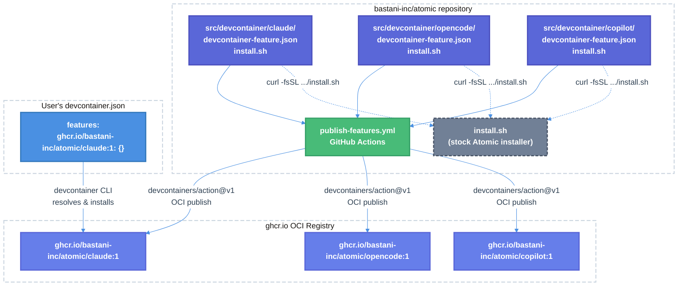

# Devcontainer Features & GHCR Publishing — Technical Design Document

| Document Metadata      | Details     |
| ---------------------- | ----------- |
| Author(s)              | lavaman131  |
| Status                 | Draft (WIP) |
| Team / Owner           | Atomic CLI  |
| Created / Last Updated | 2026-03-28  |

## 1. Executive Summary

This RFC proposes creating three reusable **devcontainer features** (`claude`, `opencode`, `copilot`) published as OCI artifacts to `ghcr.io/bastani-inc/atomic/<feature-id>`, enabling any developer to add Atomic CLI with their preferred coding agent to an existing devcontainer with a single line in `devcontainer.json`. Currently, the project uses a monolithic `.devcontainer/Dockerfile` that installs all three agents together — unsuitable for external consumption. The proposed features leverage the existing stock `install.sh` to install the Atomic CLI and all shared dependencies, then layer only the specific agent CLI on top. A new GitHub Actions workflow (`publish-features.yml`) using `devcontainers/action@v1` automates publishing with semver tagging. This adds a new distribution channel alongside the existing binary releases and npm package, specifically targeting the devcontainer ecosystem (VS Code Dev Containers, GitHub Codespaces, DevPod).

> **Research references:**
>
> - [research/docs/2026-03-28-devcontainer-features-publishing-research.md](../research/docs/2026-03-28-devcontainer-features-publishing-research.md) — Deep dive on devcontainer feature spec, OCI artifact format, testing, and publishing patterns
> - [research/docs/2026-03-28-ghcr-multi-variant-docker-build.md](../research/docs/2026-03-28-ghcr-multi-variant-docker-build.md) — Multi-variant Atomic feature design, current state analysis, and CI workflow proposal

## 2. Context and Motivation

### 2.1 Current State

The project distributes Atomic CLI through three channels:

| Channel         | Mechanism                                                               | Target                                          |
| --------------- | ----------------------------------------------------------------------- | ----------------------------------------------- |
| Binary releases | GitHub Releases (`publish.yml`) — 5 platform binaries + config archives | Direct install via `install.sh` / `install.ps1` |
| npm package     | `@bastani/atomic-workflows` on npm                                      | SDK consumers                                   |
| Dev container   | Monolithic `.devcontainer/Dockerfile` in-repo                           | Contributors to this repo only                  |

The existing `.devcontainer/Dockerfile` (45 lines) installs **all three** agent CLIs (Claude, OpenCode, Copilot) along with shared tooling (bun, uv, cocoindex-code, browser, tmux, SSH agent forwarding) into a single image based on `mcr.microsoft.com/devcontainers/base:ubuntu`. This is:

- **Not composable** — Users cannot add Atomic to their existing Rust, Python, or Go devcontainers without duplicating the Dockerfile logic
- **Not publishable** — The Dockerfile is tightly coupled to this repo's development workflow
- **Not selective** — All three agents are installed even if the user only needs one

The existing `install.sh` script's `sync_global_agent_configs()` function (lines 249–327) already handles idempotent installation of shared dependencies and per-agent config deployment, making it suitable as the foundation for feature install scripts.

> **Research reference:** [research/docs/2026-03-28-ghcr-multi-variant-docker-build.md §1 "Current State"](../research/docs/2026-03-28-ghcr-multi-variant-docker-build.md)

### 2.2 The Problem

- **User impact:** Developers who want Atomic in their project's devcontainer must manually replicate Dockerfile logic or copy-paste installation commands. There is no "one-line" integration path.
- **Ecosystem gap:** Devcontainer features are the standard mechanism for composable tool installation in VS Code Dev Containers, GitHub Codespaces, and DevPod. Atomic has no presence in this ecosystem.
- **Distribution asymmetry:** Binary and npm channels exist for standalone and SDK use cases, but the container-native channel — increasingly the primary development environment — is missing.

## 3. Goals and Non-Goals

### 3.1 Functional Goals

- [ ] Publish three devcontainer features to GHCR: `ghcr.io/bastani-inc/atomic/claude`, `ghcr.io/bastani-inc/atomic/opencode`, `ghcr.io/bastani-inc/atomic/copilot`
- [ ] Each feature installs the Atomic CLI, all shared dependencies, and only its specific agent CLI
- [ ] Features are versioned in sync with `package.json` (currently `0.4.44`) and published with semver tags (`:X`, `:X.Y`, `:X.Y.Z`, `:latest`)
- [ ] A new GitHub Actions workflow (`publish-features.yml`) automates publishing on changes to feature source files
- [ ] Features work with standard devcontainer base images (Ubuntu, Debian, language-specific Microsoft images)
- [ ] Users can add Atomic to any existing devcontainer with a single `features` entry

### 3.2 Non-Goals (Out of Scope)

- [ ] We will NOT create standalone Docker images for Atomic (features augment existing containers)
- [ ] We will NOT refactor the existing `.devcontainer/Dockerfile` to consume these features (potential follow-up)
- [ ] We will NOT support Alpine or RHEL base images in Phase 1 (Debian/Ubuntu only, matching `install.sh` assumptions)
- [ ] We will NOT register features in the public `containers.dev/features` index (can be done later)
- [ ] We will NOT create a separate `atomic-base` feature — the stock `install.sh` handles all shared dependencies
- [ ] We will NOT add user-configurable options (e.g., version selection) in Phase 1 — features install the version matching the release

## 4. Proposed Solution (High-Level Design)

### 4.1 System Architecture Diagram



### 4.2 Architectural Pattern

**Composable Feature Pattern:** Each feature is a self-contained OCI artifact containing a `devcontainer-feature.json` manifest and an `install.sh` entrypoint. Features delegate shared installation to the stock `install.sh` (which already handles idempotent dependency installation), then install only their specific agent CLI. This follows the same pattern used by `devcontainers/features` (the official feature collection).

> **Research reference:** [research/docs/2026-03-28-devcontainer-features-publishing-research.md §1 "Directory Structure"](../research/docs/2026-03-28-devcontainer-features-publishing-research.md) and [§4 "Publishing to ghcr.io as OCI Artifacts"](../research/docs/2026-03-28-devcontainer-features-publishing-research.md)

### 4.3 Key Components

| Component                    | Responsibility                        | Technology                                    | Justification                                                      |
| ---------------------------- | ------------------------------------- | --------------------------------------------- | ------------------------------------------------------------------ |
| `src/devcontainer/claude/`   | Feature: Atomic + Claude Code         | `devcontainer-feature.json` + `install.sh`    | Agent-specific OCI artifact                                        |
| `src/devcontainer/opencode/` | Feature: Atomic + OpenCode            | `devcontainer-feature.json` + `install.sh`    | Agent-specific OCI artifact                                        |
| `src/devcontainer/copilot/`  | Feature: Atomic + Copilot CLI         | `devcontainer-feature.json` + `install.sh`    | Agent-specific OCI artifact                                        |
| `publish-features.yml`       | CI: Publish features to GHCR          | GitHub Actions + `devcontainers/action@v1`    | Official tooling for feature publishing                            |
| `test-features.yml`          | CI: Test features against base images | GitHub Actions + `devcontainer features test` | Validates install scripts pre-publish                              |
| `validate-features.yml`      | CI: Validate feature JSON schemas     | GitHub Actions + `devcontainers/action@v1`    | Catches schema errors in PRs                                       |
| `install.sh` (existing)      | Shared dependency installer           | Bash                                          | Already handles bun, uv, cocoindex-code, playwright, agent configs |

## 5. Detailed Design

### 5.1 Repository Structure

Features live inside the existing mono-repo under `src/devcontainer/`:

```
src/devcontainer/
├── claude/
│   ├── devcontainer-feature.json
│   └── install.sh
├── opencode/
│   ├── devcontainer-feature.json
│   └── install.sh
└── copilot/
    ├── devcontainer-feature.json
    └── install.sh
```

Test infrastructure follows the devcontainer feature convention:

```
test/devcontainer/
├── claude/
│   ├── test.sh
│   ├── scenarios.json
│   └── with_options.sh
├── opencode/
│   ├── test.sh
│   ├── scenarios.json
│   └── with_options.sh
├── copilot/
│   ├── test.sh
│   ├── scenarios.json
│   └── with_options.sh
└── _global/
    ├── scenarios.json
    └── all_agents.sh
```

> **Research reference:** [research/docs/2026-03-28-devcontainer-features-publishing-research.md §1 "Directory Structure"](../research/docs/2026-03-28-devcontainer-features-publishing-research.md) — Standard feature collection layout

### 5.2 Feature Definitions

#### 5.2.1 `claude` Feature

**`src/devcontainer/claude/devcontainer-feature.json`:**

```json
{
    "id": "claude",
    "version": "0.4.44",
    "name": "Atomic + Claude Code",
    "description": "Installs Atomic CLI with Claude Code agent, skills, and shared tooling (bun, cocoindex-code, playwright)",
    "documentationURL": "https://github.com/bastani-inc/atomic",
    "containerEnv": {
        "COCOINDEX_CODE_DB_PATH_MAPPING": "/workspaces=/tmp/cocoindex-db"
    },
    "installsAfter": ["ghcr.io/devcontainers/features/common-utils"]
}
```

**`src/devcontainer/claude/install.sh`:**

```bash
#!/usr/bin/env bash
set -e

if [ "$(id -u)" -ne 0 ]; then
    echo 'Script must be run as root.' >&2
    exit 1
fi

# ─── Install Atomic CLI + all shared deps/configs via stock installer ────────
curl -fsSL https://raw.githubusercontent.com/bastani-inc/atomic/main/install.sh | bash

# ─── Install Claude Code CLI ────────────────────────────────────────────────
curl -fsSL https://claude.ai/install.sh | bash

echo "Atomic + Claude Code installed successfully."
```

#### 5.2.2 `opencode` Feature

**`src/devcontainer/opencode/devcontainer-feature.json`:**

```json
{
    "id": "opencode",
    "version": "0.4.44",
    "name": "Atomic + OpenCode",
    "description": "Installs Atomic CLI with OpenCode agent, skills, and shared tooling (bun, cocoindex-code, playwright)",
    "documentationURL": "https://github.com/bastani-inc/atomic",
    "containerEnv": {
        "COCOINDEX_CODE_DB_PATH_MAPPING": "/workspaces=/tmp/cocoindex-db"
    },
    "installsAfter": ["ghcr.io/devcontainers/features/common-utils"]
}
```

**`src/devcontainer/opencode/install.sh`:**

```bash
#!/usr/bin/env bash
set -e

if [ "$(id -u)" -ne 0 ]; then
    echo 'Script must be run as root.' >&2
    exit 1
fi

# ─── Install Atomic CLI + all shared deps/configs via stock installer ────────
curl -fsSL https://raw.githubusercontent.com/bastani-inc/atomic/main/install.sh | bash

# ─── Install OpenCode CLI ───────────────────────────────────────────────────
curl -fsSL https://opencode.ai/install | bash

echo "Atomic + OpenCode installed successfully."
```

#### 5.2.3 `copilot` Feature

**`src/devcontainer/copilot/devcontainer-feature.json`:**

```json
{
    "id": "copilot",
    "version": "0.4.44",
    "name": "Atomic + Copilot CLI",
    "description": "Installs Atomic CLI with GitHub Copilot agent, skills, and shared tooling (bun, cocoindex-code, playwright)",
    "documentationURL": "https://github.com/bastani-inc/atomic",
    "containerEnv": {
        "COCOINDEX_CODE_DB_PATH_MAPPING": "/workspaces=/tmp/cocoindex-db"
    },
    "installsAfter": [
        "ghcr.io/devcontainers/features/common-utils",
        "ghcr.io/devcontainers/features/github-cli"
    ]
}
```

**`src/devcontainer/copilot/install.sh`:**

```bash
#!/usr/bin/env bash
set -e

if [ "$(id -u)" -ne 0 ]; then
    echo 'Script must be run as root.' >&2
    exit 1
fi

# ─── Install Atomic CLI + all shared deps/configs via stock installer ────────
curl -fsSL https://raw.githubusercontent.com/bastani-inc/atomic/main/install.sh | bash

# ─── Install Copilot CLI ────────────────────────────────────────────────────
curl -fsSL https://gh.io/copilot-install | bash

echo "Atomic + Copilot CLI installed successfully."
```

> **Research reference:** [research/docs/2026-03-28-ghcr-multi-variant-docker-build.md §4 "Proposed Feature Design"](../research/docs/2026-03-28-ghcr-multi-variant-docker-build.md) — Simplified approach using stock `install.sh`

### 5.3 Version Synchronization

The `version` field in each `devcontainer-feature.json` must match the root `package.json` version (currently `0.4.44`). The publish workflow synchronizes versions before publishing:

```bash
VERSION=$(jq -r .version package.json)
for feature in src/devcontainer/*/devcontainer-feature.json; do
    jq --arg v "$VERSION" '.version = $v' "$feature" > tmp.json && mv tmp.json "$feature"
done
```

This ensures features are tagged with the same semver as the Atomic CLI release. The `devcontainers/action@v1` then generates OCI tags:

- `0.4.44` (exact)
- `0.4` (minor)
- `0` (major)
- `latest`

> **Research reference:** [research/docs/2026-03-28-devcontainer-features-publishing-research.md §5 "Semantic Versioning"](../research/docs/2026-03-28-devcontainer-features-publishing-research.md)

### 5.4 CI Workflows

#### 5.4.1 Publish Workflow

**`.github/workflows/publish-features.yml`:**

```yaml
name: Publish Devcontainer Features

on:
    workflow_dispatch:
    push:
        branches: [main]
        paths:
            - "src/devcontainer/**"

jobs:
    publish:
        if: github.ref == 'refs/heads/main'
        runs-on: ubuntu-latest
        permissions:
            contents: write
            packages: write
        steps:
            - uses: actions/checkout@v6

            - name: Sync feature versions from package.json
              run: |
                  VERSION=$(jq -r .version package.json)
                  for feature in src/devcontainer/*/devcontainer-feature.json; do
                    jq --arg v "$VERSION" '.version = $v' "$feature" > tmp.json && mv tmp.json "$feature"
                  done

            - name: Publish Features
              uses: devcontainers/action@v1
              with:
                  publish-features: "true"
                  base-path-to-features: "./src/devcontainer"
              env:
                  GITHUB_TOKEN: ${{ secrets.GITHUB_TOKEN }}
```

**Required permissions:** `packages: write` (push OCI artifacts to GHCR), `contents: write` (create git tags).

> **Research reference:** [research/docs/2026-03-28-ghcr-multi-variant-docker-build.md §6 "CI Workflow"](../research/docs/2026-03-28-ghcr-multi-variant-docker-build.md)

#### 5.4.2 Test Workflow

**`.github/workflows/test-features.yml`:**

```yaml
name: Test Devcontainer Features

on:
    pull_request:
        paths:
            - "src/devcontainer/**"
            - "test/devcontainer/**"
    workflow_dispatch:

jobs:
    test-autogenerated:
        runs-on: ubuntu-latest
        continue-on-error: true
        strategy:
            matrix:
                features: [claude, opencode, copilot]
                baseImage:
                    - mcr.microsoft.com/devcontainers/base:ubuntu
                    - ubuntu:latest
        steps:
            - uses: actions/checkout@v6
            - name: Install devcontainer CLI
              run: npm install -g @devcontainers/cli
            - name: "Test '${{ matrix.features }}' on '${{ matrix.baseImage }}'"
              run: devcontainer features test --skip-scenarios -f ${{ matrix.features }} -i ${{ matrix.baseImage }} --base-path-to-features ./src/devcontainer .

    test-scenarios:
        runs-on: ubuntu-latest
        continue-on-error: true
        strategy:
            matrix:
                features: [claude, opencode, copilot]
        steps:
            - uses: actions/checkout@v6
            - name: Install devcontainer CLI
              run: npm install -g @devcontainers/cli
            - name: "Test '${{ matrix.features }}' scenarios"
              run: devcontainer features test -f ${{ matrix.features }} --skip-autogenerated --skip-duplicated --base-path-to-features ./src/devcontainer .
```

#### 5.4.3 Validation Workflow

**`.github/workflows/validate-features.yml`:**

```yaml
name: Validate Devcontainer Features

on:
    pull_request:
        paths:
            - "src/devcontainer/**"
    workflow_dispatch:

jobs:
    validate:
        runs-on: ubuntu-latest
        steps:
            - uses: actions/checkout@v6
            - name: Validate devcontainer-feature.json schemas
              uses: devcontainers/action@v1
              with:
                  validate-only: "true"
                  base-path-to-features: "./src/devcontainer"
```

> **Research reference:** [research/docs/2026-03-28-devcontainer-features-publishing-research.md §6 "GitHub Actions Workflow for Publishing"](../research/docs/2026-03-28-devcontainer-features-publishing-research.md)

### 5.5 Test Definitions

#### Test Script Pattern

Each feature gets a `test.sh` that validates the install succeeded:

**`test/devcontainer/claude/test.sh`:**

```bash
#!/bin/bash
set -e

source dev-container-features-test-lib

check "atomic CLI is installed" bash -c "which atomic"
check "bun is installed" bash -c "which bun"
check "claude CLI is installed" bash -c "which claude"
check "cocoindex-code is installed" bash -c "which ccc"
check "browser is installed" bash -c "which browser"
check "claude agents dir exists" bash -c "test -d ~/.claude/agents"
check "claude skills dir exists" bash -c "test -d ~/.claude/skills"

reportResults
```

Analogous scripts for `opencode` and `copilot` check their respective CLIs and config directories (`~/.opencode/`, `~/.copilot/`).

> **Research reference:** [research/docs/2026-03-28-devcontainer-features-publishing-research.md §8 "Testing Features"](../research/docs/2026-03-28-devcontainer-features-publishing-research.md)

### 5.6 User Experience

Users add a **single feature** to their existing `devcontainer.json` to get Atomic + their preferred agent:

**Example: Atomic + Claude in a Rust project**

```jsonc
{
    "image": "mcr.microsoft.com/devcontainers/rust:latest",
    "features": {
        "ghcr.io/bastani-inc/atomic/claude:1": {},
    },
    "remoteEnv": {
        "ANTHROPIC_API_KEY": "${localEnv:ANTHROPIC_API_KEY}",
    },
}
```

**Example: Atomic + Copilot in a Python project**

```jsonc
{
    "image": "mcr.microsoft.com/devcontainers/python:3.12",
    "features": {
        "ghcr.io/devcontainers/features/github-cli:1": {},
        "ghcr.io/bastani-inc/atomic/copilot:1": {},
    },
    "remoteEnv": {
        "GH_TOKEN": "${localEnv:GH_TOKEN}",
    },
}
```

**Example: Atomic + OpenCode in a Go project**

```jsonc
{
    "image": "mcr.microsoft.com/devcontainers/go:1.22",
    "features": {
        "ghcr.io/bastani-inc/atomic/opencode:1": {},
    },
}
```

> **Research reference:** [research/docs/2026-03-28-ghcr-multi-variant-docker-build.md §5 "User Experience"](../research/docs/2026-03-28-ghcr-multi-variant-docker-build.md)

### 5.7 Per-Agent Differences

Each feature installs the same shared dependencies (via stock `install.sh`) but differs in the agent CLI:

| Feature    | Agent CLI Install Command                          | Auth Env Var                           | Config Directory | `installsAfter`              |
| ---------- | -------------------------------------------------- | -------------------------------------- | ---------------- | ---------------------------- |
| `claude`   | `curl -fsSL https://claude.ai/install.sh \| bash`  | `ANTHROPIC_API_KEY`                    | `~/.claude/`     | `common-utils`               |
| `opencode` | `curl -fsSL https://opencode.ai/install \| bash`   | `ANTHROPIC_API_KEY` / `OPENAI_API_KEY` | `~/.opencode/`   | `common-utils`               |
| `copilot`  | `curl -fsSL https://gh.io/copilot-install \| bash` | `GH_TOKEN` / `COPILOT_GITHUB_TOKEN`    | `~/.copilot/`    | `common-utils`, `github-cli` |

All three agents share 10 agent definitions and 15 skill definitions (identical markdown content, different directory locations). After global install, 4 SCM-scoped skills (`gh-commit`, `gh-create-pr`, `sl-commit`, `sl-submit-diff`) are removed from global directories.

> **Research reference:** [research/docs/2026-03-28-ghcr-multi-variant-docker-build.md §2 "How the Three Agent Variants Differ"](../research/docs/2026-03-28-ghcr-multi-variant-docker-build.md)

### 5.8 Published OCI Packages

After publishing version `0.4.44`, the following packages will exist on GHCR:

```
ghcr.io/bastani-inc/atomic/claude:0.4.44
ghcr.io/bastani-inc/atomic/claude:0.4
ghcr.io/bastani-inc/atomic/claude:0
ghcr.io/bastani-inc/atomic/claude:latest

ghcr.io/bastani-inc/atomic/opencode:0.4.44
ghcr.io/bastani-inc/atomic/opencode:0.4
ghcr.io/bastani-inc/atomic/opencode:0
ghcr.io/bastani-inc/atomic/opencode:latest

ghcr.io/bastani-inc/atomic/copilot:0.4.44
ghcr.io/bastani-inc/atomic/copilot:0.4
ghcr.io/bastani-inc/atomic/copilot:0
ghcr.io/bastani-inc/atomic/copilot:latest

ghcr.io/bastani-inc/atomic:latest   # collection metadata
```

Each package is an OCI artifact (not a Docker image) with `application/vnd.devcontainers.layer.v1+tar` media type.

> **Research reference:** [research/docs/2026-03-28-devcontainer-features-publishing-research.md §4 "Publishing to ghcr.io as OCI Artifacts"](../research/docs/2026-03-28-devcontainer-features-publishing-research.md)

## 6. Alternatives Considered

| Option                                                                                             | Pros                                                                                                      | Cons                                                                                                                  | Reason for Rejection                                                                                                                                           |
| -------------------------------------------------------------------------------------------------- | --------------------------------------------------------------------------------------------------------- | --------------------------------------------------------------------------------------------------------------------- | -------------------------------------------------------------------------------------------------------------------------------------------------------------- |
| **A: Standalone Docker images** (`ghcr.io/bastani-inc/atomic:claude`)                              | Simple `docker pull`; pre-baked everything                                                                | Not composable — users must abandon their existing devcontainer; large image size (~1.5 GB per variant)               | Devcontainer features are the standard for composable tooling. Docker images were previously rejected in `specs/2026-01-21-binary-distribution-installers.md`. |
| **B: Single feature with variant option** (`ghcr.io/bastani-inc/atomic:1` + `"variant": "claude"`) | One package instead of three; fewer GHCR visibility settings                                              | Requires downloading all three agent CLIs or complex conditional logic in `install.sh`; URI is less self-documenting  | Three separate features are simpler to implement, test, and reason about. Each `install.sh` is ~10 lines.                                                      |
| **C: Base + agent features** (`atomic-base` + `atomic-claude`)                                     | Clean separation of shared deps from agent-specific installs; avoids duplicate installs                   | Requires two features in `devcontainer.json`; user experience is worse; `installsAfter` ordering adds complexity      | The stock `install.sh` is idempotent and handles everything. Adding a base feature adds complexity for no user benefit.                                        |
| **D: Separate repository** (`bastani-inc/atomic-features`)                                         | Cleaner separation of concerns; standard community pattern                                                | Config files live in the main repo — syncing them requires cross-repo automation; more repos to maintain              | Mono-repo is simpler to start. Can extract later if needed.                                                                                                    |
| **E: Three features in mono-repo (Selected)**                                                      | Simple `install.sh` per feature (~10 lines); single repo; stock installer handles shared deps; clean URIs | All three agent configs installed even if only one is needed (harmless); duplicate installs if user adds two features | **Selected:** Simplest implementation with best user experience. Stock `install.sh` idempotency mitigates concerns.                                            |

> **Research reference:** [research/docs/2026-03-28-ghcr-multi-variant-docker-build.md §8 "Mono-Repo vs Separate Repo"](../research/docs/2026-03-28-ghcr-multi-variant-docker-build.md)

## 7. Cross-Cutting Concerns

### 7.1 Security and Privacy

- **Authentication:** Publishing uses `GITHUB_TOKEN` (auto-provisioned by GitHub Actions). No additional secrets required.
- **Supply chain:** Feature install scripts fetch the stock `install.sh` from the `main` branch of `bastani-inc/atomic` via HTTPS. Users consume features via GHCR OCI references with digest pinning available (`ghcr.io/bastani-inc/atomic/claude@sha256:...`).
- **Agent CLI installers:** Each agent CLI is installed via its official curl-pipe-bash installer (`claude.ai`, `opencode.ai`, `gh.io`). These are the same installers recommended in each agent's documentation.
- **GHCR visibility:** Packages are **private by default** on GHCR. After first publish, each package must be manually set to public via GitHub Packages settings. This is a one-time manual step per feature.

### 7.2 Observability

- **Publish logs:** GitHub Actions workflow logs capture `devcontainers/action` output including which versions were published and which were skipped (already-existing).
- **Test results:** CI test workflow logs capture per-feature, per-base-image test results with `continue-on-error` for visibility without blocking.
- **Version tracking:** OCI manifests include `dev.containers.metadata` annotations with the full `devcontainer-feature.json`, enabling version introspection via registry APIs.

### 7.3 Compatibility

- **Base images:** Tested against `mcr.microsoft.com/devcontainers/base:ubuntu` and `ubuntu:latest`. The stock `install.sh` targets Debian/Ubuntu package managers (`apt-get`).
- **Feature composition:** Features include `installsAfter` hints for ordering. The `copilot` feature lists `github-cli` as a soft dependency since Copilot CLI requires `gh` to be present.
- **Idempotency:** If a user adds two Atomic features (e.g., `claude` + `copilot`), the stock `install.sh` runs twice. Its idempotent tool installers (`install_bun_if_missing`, `install_uv_if_missing`, etc.) prevent duplicate installations. The second run adds minimal build time.

## 8. Migration, Rollout, and Testing

### 8.1 Deployment Strategy

- [ ] **Phase 1: Feature creation and local testing** — Create `src/devcontainer/` directory structure with all three features. Test locally using `devcontainer features test` CLI.
- [ ] **Phase 2: CI workflows** — Add `validate-features.yml` (PR validation), `test-features.yml` (PR testing), and `publish-features.yml` (main branch publishing). Merge to `main` with `workflow_dispatch` trigger for controlled first publish.
- [ ] **Phase 3: GHCR visibility** — After first publish, manually set each feature package to **public** in GitHub Packages settings (`https://github.com/users/flora131/packages/container/atomic%2Fclaude/settings`, etc.).
- [ ] **Phase 4: Documentation** — Update README and documentation with devcontainer feature usage examples. Add feature references to `DEV_SETUP.md`.

### 8.2 Test Plan

- **Schema validation:** `devcontainers/action@v1` with `validate-only: true` validates each `devcontainer-feature.json` against the official schema on every PR.
- **Automated install tests:** `devcontainer features test` runs each feature against `ubuntu:latest` and `mcr.microsoft.com/devcontainers/base:ubuntu`, verifying CLI binaries are installed and config directories exist.
- **Scenario tests:** Named scenarios in `scenarios.json` test specific configurations (e.g., Copilot with GitHub CLI pre-installed).
- **Manual smoke test:** Before first publish, manually build a devcontainer using a local feature path (`"./src/devcontainer/claude"`) to validate the full user experience end-to-end.

## 9. Resolved Design Decisions

- [x] **Q1: Publish trigger mechanism** — **Both triggers (path filter + manual dispatch).** Features auto-publish on push to `main` when `src/devcontainer/**` changes, with `workflow_dispatch` as a manual fallback. This matches the existing `publish.yml` pattern. The `devcontainers/action` won't republish existing versions, making accidental triggers harmless.

- [x] **Q2: GHCR visibility** — **Manual one-time step with prominent documentation.** After first publish, a maintainer sets each of the 3 feature packages to public via GitHub Packages settings UI. This is documented in Phase 3 of the rollout plan. The `GITHUB_TOKEN` API permissions for package visibility changes are unreliable, making automation impractical.

- [x] **Q3: Dogfooding** — **Follow-up PR.** Ship features first, validate with external usage, then refactor `.devcontainer/Dockerfile` to consume published features in a subsequent PR. This avoids coupling the two efforts and the chicken-and-egg problem during initial publish.

- [x] **Q4: Embedding model pre-baking** — **Defer to first use.** The ~200 MB model downloads on first `ccc search` invocation (~30-60s delay). This keeps features lightweight and avoids failures on base images without Python. Only affects semantic code search, a secondary feature. A `prebakeModel` option can be added later if users request it.
