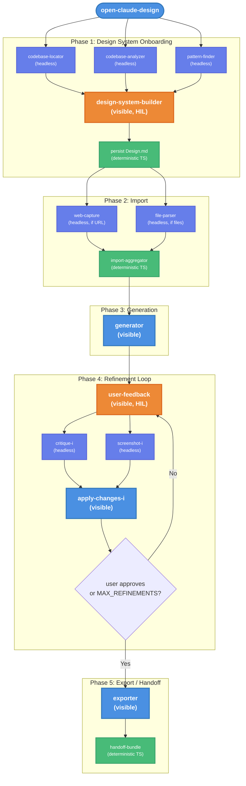

# Open Claude Design — Technical Design Document / RFC

| Document Metadata      | Details     |
| ---------------------- | ----------- |
| Author(s)              | flora131    |
| Status                 | Draft (WIP) |
| Team / Owner           | Atomic CLI  |
| Created / Last Updated | 2026-04-17  |

## 1. Executive Summary

This RFC proposes a new built-in workflow called `open-claude-design` — an open-source replica of Anthropic's [Claude Design](https://www.anthropic.com/news/claude-design-anthropic-labs) product, implemented using the Atomic workflow SDK. The workflow orchestrates the existing design skill ecosystem (`impeccable`, `critique`, `shape`, `polish`, `audit`, `extract`, etc.) into a deterministic 5-phase pipeline: **Design System Onboarding → Import → Generation → Refinement Loop → Export/Handoff**. Every phase requiring user decisions uses the `AskUserQuestion` tool for human-in-the-loop (HIL) interaction. The workflow produces a `Design.md` design system file, production-grade frontend code, and a Claude Code handoff bundle — closing the loop from design exploration to production implementation.

~70% of the required capabilities already exist in the codebase (skills, agent types, SDK primitives). The primary new work is prompt engineering, helper functions for design system persistence, and the workflow orchestration file itself.

---

## 2. Context and Motivation

### 2.1 Current State

The Atomic CLI already ships two built-in workflows:

- **`deep-research-codebase`** — scout → per-partition specialist fan-out → aggregator ([research ref](../research/docs/2026-04-17-open-claude-design.md#part-2))
- **`ralph`** — bounded iterative plan → orchestrate → review → debug loop ([research ref](../research/docs/2026-04-17-open-claude-design.md#part-2))

The design skill ecosystem (`.agents/skills/`) includes 17+ design-related skills (`impeccable`, `critique`, `shape`, `polish`, `audit`, `layout`, `colorize`, `typeset`, `animate`, `delight`, `adapt`, `clarify`, `harden`, `distill`, `bolder`, `quieter`, `normalize`), plus browser automation (`browser`), document parsing (`liteparse`), and export capabilities (`pdf`, `pptx`, `docx`). These skills are currently invoked individually via slash commands — there is no workflow that orchestrates them into a cohesive design pipeline.

**Architecture:** The workflow SDK (`defineWorkflow().for<"claude">().run().compile()`) with `ctx.stage()` sub-agent orchestration, `Promise.all()` parallelism, and `extractAssistantText()` for headless stage results provides the full runtime needed.

### 2.2 The Problem

- **Fragmented design workflow:** Users must manually invoke `/impeccable teach`, then `/shape`, then `/impeccable craft`, then `/critique`, then `/polish` — each in separate conversations with no shared context pipeline.
- **No design system persistence:** The `.impeccable.md` file captures brand context but lacks structured design tokens (colors, fonts, spacing, components) extracted from the codebase.
- **No handoff path:** Designs generated via impeccable have no structured export or Claude Code handoff bundle — users manually copy files.
- **Competitive gap:** Anthropic launched Claude Design (2026-04-17) with a 6-phase pipeline. An open-source CLI equivalent would differentiate Atomic CLI.

---

## 3. Goals and Non-Goals

### 3.1 Functional Goals

- [ ] **G1:** Implement a `open-claude-design` built-in workflow at `src/sdk/workflows/builtin/open-claude-design/claude/index.ts`
- [ ] **G2:** Phase 1 (Design System Onboarding) — extract design tokens from codebase, create/update `Design.md`, use `AskUserQuestion` for HIL approval of each design element
- [ ] **G3:** Phase 2 (Import) — accept text prompts, file references, URLs (via playwright web capture), and codebase references as input
- [ ] **G4:** Phase 3 (Generation) — generate first version using `impeccable` skill with design system context injection
- [ ] **G5:** Phase 4 (Refinement Loop) — bounded iterative loop (like Ralph) using `critique` + `polish` + `AskUserQuestion` for user feedback, with headless screenshot validation via playwright
- [ ] **G6:** Phase 5 (Export/Handoff) — export as standalone HTML and package a Claude Code handoff bundle (design + intent + tokens + specs)
- [ ] **G7:** Incorporate AI slop anti-pattern detection from `impeccable` and `critique` skills as automated quality gates in the refinement loop
- [ ] **G8:** All user-facing decisions use `AskUserQuestion` tool (not regular NL conversation) for HIL interaction
- [ ] **G9:** Create prompt builders in `helpers/prompts.ts` following the deep-research-codebase and Ralph patterns
- [ ] **G10:** Create a `Design.md` file (structured design system document) as the persistent output of the onboarding phase

### 3.2 Non-Goals (Out of Scope)

- [ ] Multi-user collaboration (Phase 5 of Claude Design) — web UI feature, not replicable in CLI/TUI
- [ ] Claude-generated adjustment sliders — web UI feature; adaptation: Claude proposes variations, user picks via `AskUserQuestion`
- [ ] Drawing/annotation on canvas — web UI feature; verbal descriptions of changes suffice
- [ ] Canva export integration — requires Canva API; deferred to future work
- [ ] Copilot and OpenCode providers — start with Claude-only (like deep-research-codebase); scaffold stubs for future
- [ ] Frontier design (voice/video/3D/shaders) — partially achievable but deferred; standard HTML/CSS/JS prototypes are the priority
- [ ] MCP connector integrations (Figma, Slack, Notion, Linear) — deferred to future work

---

## 4. Proposed Solution (High-Level Design)

### 4.1 System Architecture Diagram



### 4.2 Architectural Pattern

The workflow follows a **phased pipeline with bounded refinement loop**, combining patterns from both existing built-in workflows:

- **deep-research-codebase pattern:** Parallel headless sub-agent fan-out for codebase analysis (Phase 1 + Phase 2), deterministic TypeScript synthesis (no LLM call for file concatenation)
- **Ralph pattern:** Bounded iterative loop with parallel validation passes and exit condition (Phase 4)
- **HIL pattern:** `AskUserQuestion` tool usage for user decisions (from `hil-favorite-color` example workflow)

### 4.3 Model Strategy

The workflow uses a **tiered model strategy** to balance output quality against cost and latency. Stages that require creative judgment or are user-facing inherit the orchestrator's model (presumably Opus). Headless stages that perform structured analysis, tool orchestration, or follow rigid rubrics use Sonnet.

**Constants:**

```typescript
/** Headless stages: structured analysis, tool orchestration, rubric-following. Sonnet. */
const HEADLESS_OPTS = {
    permissionMode: "bypassPermissions",
    allowDangerouslySkipPermissions: true,
    model: "sonnet",
} as const;

/** Visible/creative stages: inherit orchestrator model (Opus). No model override. */
const VISIBLE_OPTS = {
    permissionMode: "bypassPermissions",
    allowDangerouslySkipPermissions: true,
} as const;
```

**Per-stage model assignments:**

| Stage                             | Model          | Rationale                                                                                |
| --------------------------------- | -------------- | ---------------------------------------------------------------------------------------- |
| `ds-locator` (Phase 1)            | Sonnet         | File discovery — structured search, no creativity                                        |
| `ds-analyzer` (Phase 1)           | Sonnet         | Extract values from code — pattern matching                                              |
| `ds-patterns` (Phase 1)           | Sonnet         | Find component patterns — code search                                                    |
| `design-system-builder` (Phase 1) | Opus (inherit) | User-facing, synthesizes 3 headless outputs into coherent HIL flow                       |
| `web-capture` (Phase 2)           | Sonnet         | Navigate URL, screenshot, extract DOM — tool orchestration                               |
| `file-parser` (Phase 2)           | Sonnet         | Parse document — mechanical extraction                                                   |
| `generator` (Phase 3)             | Opus (inherit) | Core creative output — design quality is the whole point                                 |
| `user-feedback-{i}` (Phase 4)     | Sonnet         | Present state + ask one AskUserQuestion — thin interaction layer                         |
| `critique-{i}` (Phase 4)          | Sonnet         | Follows structured rubric (P0-P3 severity) — methodology-driven                          |
| `screenshot-{i}` (Phase 4)        | Sonnet         | Launch playwright, take screenshot, describe findings — tool use + basic visual analysis |
| `apply-changes-{i}` (Phase 4)     | Opus (inherit) | Creative modification based on nuanced feedback + critique synthesis                     |
| `exporter` (Phase 5)              | Sonnet         | Copy files, generate markdown — mostly mechanical                                        |

This yields ~60-70% cost reduction on the 9 headless stages while keeping Opus for the 3 stages where design quality and creative synthesis matter most (`design-system-builder`, `generator`, `apply-changes-{i}`).

### 4.4 Key Components

| Component             | Responsibility                                | Implementation                                                            | Justification                                    |
| --------------------- | --------------------------------------------- | ------------------------------------------------------------------------- | ------------------------------------------------ |
| Design System Builder | Extract tokens from codebase, build Design.md | Headless locator/analyzer stages → visible HIL stage                      | Mirrors impeccable `teach` + `extract` modes     |
| Import Handler        | Parse text/files/URLs into structured context | Headless stages (playwright for URLs, liteparse for docs)                 | Reuses existing skills as sub-agent capabilities |
| Generator             | Produce first design version                  | Visible stage with impeccable + shape skill context                       | Core creative output — user watches in real-time |
| Refinement Controller | Iterate on design with user feedback          | Bounded loop: HIL feedback → headless critique/screenshot → visible apply | Adapts Ralph's review-debug loop pattern         |
| Quality Gate          | AI slop detection + design critique           | Headless critique stage running `npx impeccable --json` + LLM critique    | Automated anti-pattern enforcement               |
| Export Engine         | HTML export + handoff bundle                  | Visible stage + deterministic TS helper                                   | Thin wrapper around existing export skills       |

---

## 5. Detailed Design

### 5.1 Directory Structure

```
src/sdk/workflows/builtin/open-claude-design/
├── claude/index.ts              ← Main workflow definition
├── copilot/index.ts             ← Stub (future provider)
├── opencode/index.ts            ← Stub (future provider)
└── helpers/
    ├── prompts.ts               ← All prompt builders (buildDesignSystemPrompt, etc.)
    ├── design-system.ts         ← Design.md persistence, token extraction, loading
    ├── import.ts                ← Input type detection, URL/file/codebase handling
    ├── validation.ts            ← Critique parsing, screenshot comparison, quality gates
    ├── export.ts                ← HTML export, handoff bundle packaging
    └── constants.ts             ← MAX_REFINEMENTS, HEADLESS_OPTS, VISIBLE_OPTS, file paths, anti-pattern lists
```

### 5.2 Workflow Inputs

```typescript
defineWorkflow({
    name: "open-claude-design",
    description:
        "AI-powered design workflow: design system onboarding → import → generate → refine → export/handoff",
    inputs: [
        {
            name: "prompt",
            type: "text",
            required: true,
            description:
                "What to design (e.g., 'a dashboard for monitoring API latency')",
        },
        {
            name: "reference",
            type: "text",
            required: false,
            description:
                "URL, file path, or codebase path to import as design reference",
        },
        {
            name: "output-type",
            type: "enum",
            required: false,
            values: ["prototype", "wireframe", "page", "component"],
            default: "prototype",
            description: "Type of design output to generate",
        },
        {
            name: "design-system",
            type: "text",
            required: false,
            description:
                "Path to existing Design.md (skips onboarding if provided)",
        },
    ],
});
```

**Output Type Definitions:**

All four output types produce the same file set (`index.html`, `styles.css`, `script.js`). They differ in scope and fidelity:

| Output Type               | What Gets Generated                                                                                                                                                                                                                         | How the User Uses It                                                                                                                                                                  |
| ------------------------- | ------------------------------------------------------------------------------------------------------------------------------------------------------------------------------------------------------------------------------------------- | ------------------------------------------------------------------------------------------------------------------------------------------------------------------------------------- |
| **`prototype`** (default) | A fully interactive HTML/CSS/JS application — multiple views/screens, working navigation, real interactions (clicks, hovers, form submissions), state changes. Full visual fidelity with design system tokens applied.                      | Open `index.html` in a browser to click through the experience. Hand off via the bundle to implement as a real app. The "demo you can show stakeholders" artifact.                    |
| **`wireframe`**           | A low-fidelity structural layout — boxes, placeholder text, visual hierarchy without polish. Grayscale, minimal styling, focused on information architecture. The workflow runs `/shape` first to produce a design brief before generating. | Early-stage exploration — validates layout and flow before investing in visual design. Useful input to a follow-up prototype pass or `/impeccable` run.                               |
| **`page`**                | A single, fully designed page — one screen at full fidelity (colors, typography, spacing from Design.md). No multi-screen navigation or complex state.                                                                                      | When you need one specific view (a landing page, a settings screen, a dashboard) rather than a full multi-screen prototype. Narrower scope = faster iteration in the refinement loop. |
| **`component`**           | A single reusable UI element — a button set, a card, a data table, a modal, a nav bar. Rendered in the HTML page as a component showcase with multiple variants and interactive states.                                                     | Building up a design system piece by piece, or designing a specific widget in isolation before integrating it. The handoff bundle's `component-specs.md` is especially relevant here. |

### 5.3 Phase 1: Design System Onboarding

**Purpose:** Read the codebase, extract design tokens, and build a `Design.md` file with HIL approval at each decision point.

**Topology:**

```
  codebase-locator (headless)  ∥  codebase-analyzer (headless)  ∥  pattern-finder (headless)
                              │
                              ▼
                    design-system-builder (visible, HIL)
                              │
                              ▼
                    persist Design.md (deterministic TS)
```

**Implementation:**

```typescript
// Skip if user provided --design-system path
const designSystemPath = ctx.inputs["design-system"];
let designSystem: DesignSystemData;

if (designSystemPath) {
    designSystem = await loadDesignSystem(designSystemPath);
} else {
    // Layer 1: Parallel headless codebase analysis
    const [locator, analyzer, patterns] = await Promise.all([
        ctx.stage(
            {
                name: "ds-locator",
                headless: true,
                description: "Locate design files and tokens",
            },
            {},
            {},
            async (s) => {
                const result = await s.session.query(
                    buildDesignLocatorPrompt({ root }),
                    { agent: "codebase-locator", ...HEADLESS_OPTS },
                );
                s.save(s.sessionId);
                return extractAssistantText(result, 0);
            },
        ),
        ctx.stage(
            {
                name: "ds-analyzer",
                headless: true,
                description: "Analyze design tokens and patterns",
            },
            {},
            {},
            async (s) => {
                const result = await s.session.query(
                    buildDesignAnalyzerPrompt({ root }),
                    { agent: "codebase-analyzer", ...HEADLESS_OPTS },
                );
                s.save(s.sessionId);
                return extractAssistantText(result, 0);
            },
        ),
        ctx.stage(
            {
                name: "ds-patterns",
                headless: true,
                description: "Find existing design patterns",
            },
            {},
            {},
            async (s) => {
                const result = await s.session.query(
                    buildDesignPatternPrompt({ root }),
                    { agent: "codebase-pattern-finder", ...HEADLESS_OPTS },
                );
                s.save(s.sessionId);
                return extractAssistantText(result, 0);
            },
        ),
    ]);

    // Layer 2: Visible stage with HIL — presents findings, asks user to approve/modify
    const dsBuilder = await ctx.stage(
        {
            name: "design-system-builder",
            description: "Build design system with user approval (HIL)",
        },
        {},
        {},
        async (s) => {
            await s.session.query(
                buildDesignSystemBuilderPrompt({
                    root,
                    locatorOutput: locator.result,
                    analyzerOutput: analyzer.result,
                    patternsOutput: patterns.result,
                    existingImpeccable: await readImpeccableMd(root),
                }),
            );
            s.save(s.sessionId);
        },
    );

    // Deterministic: persist to Design.md
    designSystem = await persistDesignSystem(root, dsBuilder);
}
```

**Key prompt behavior for `buildDesignSystemBuilderPrompt`:**

The prompt instructs the agent to:

1. Present extracted colors, typography, spacing, and components to the user
2. Use `AskUserQuestion` tool to confirm each design element category:
    - "Here are the colors I found in your codebase: [...]. Which should be part of your design system?" (with options)
    - "I found these typography patterns: [...]. Which font stack should be primary?" (with options)
    - "These spacing values appear most frequently: [...]. Should I use a 4pt or 8pt base scale?" (with options)
3. Synthesize approved elements into a structured Design.md format
4. Use `AskUserQuestion` one final time: "Here is your complete design system. Approve or request changes?"

**Design.md structure:**

```markdown
# Design System — [Project Name]

## Colors

### Primary

- `--color-primary`: #4a90e2
- `--color-primary-hover`: #357abd

### Neutral

- `--color-bg`: #1e1e2e
- `--color-surface`: #313244

### Semantic

- `--color-success`: #a6e3a1
- `--color-error`: #f38ba8

## Typography

### Font Stack

- Primary: "Geist", system-ui, sans-serif
- Monospace: "Geist Mono", ui-monospace, monospace

### Scale

- `--text-xs`: 0.75rem
- `--text-sm`: 0.875rem
- `--text-base`: 1rem
- `--text-lg`: 1.125rem
- `--text-xl`: 1.25rem

## Spacing

### Base Unit: 4px

- `--space-1`: 4px
- `--space-2`: 8px
- `--space-3`: 12px
- `--space-4`: 16px

## Components

### Identified Patterns

- Button (primary, secondary, ghost variants)
- Card (standard, elevated)
- Input (text, select, checkbox)

## Anti-Patterns (from impeccable)

- NO side-stripe borders (border-left/right > 1px)
- NO gradient text (background-clip: text)
- NO AI color palette (cyan-on-dark, purple-to-blue gradients)
- NO reflex fonts (Inter, DM Sans, Fraunces, Poppins, etc.)

## Brand Context (from .impeccable.md)

[Embedded from existing .impeccable.md if available]
```

### 5.4 Phase 2: Import

**Purpose:** Aggregate all input sources into a structured context object for the generator.

**Topology:**

```
  web-capture (headless, conditional)  ∥  file-parser (headless, conditional)
                              │
                              ▼
                    aggregate inputs (deterministic TS)
```

**Implementation:**

```typescript
const prompt = ctx.inputs.prompt ?? "";
const reference = ctx.inputs.reference ?? "";

const importResults = await Promise.all([
    // Web capture (only if reference is a URL)
    isUrl(reference)
        ? ctx.stage(
              {
                  name: "web-capture",
                  headless: true,
                  description: "Capture web reference via playwright",
              },
              {},
              {},
              async (s) => {
                  const result = await s.session.query(
                      buildWebCapturePrompt({
                          url: reference,
                          screenshotDir: scratchDir,
                      }),
                      { agent: "codebase-online-researcher", ...HEADLESS_OPTS },
                  );
                  s.save(s.sessionId);
                  return extractAssistantText(result, 0);
              },
          )
        : null,

    // File parser (only if reference is a file path)
    isFilePath(reference)
        ? ctx.stage(
              {
                  name: "file-parser",
                  headless: true,
                  description: "Parse reference document",
              },
              {},
              {},
              async (s) => {
                  const result = await s.session.query(
                      buildFileParserPrompt({ filePath: reference }),
                      { agent: "codebase-analyzer", ...HEADLESS_OPTS },
                  );
                  s.save(s.sessionId);
                  return extractAssistantText(result, 0);
              },
          )
        : null,
]);

// Deterministic aggregation
const importContext = aggregateImportResults({
    prompt,
    reference,
    webCapture: importResults[0]?.result ?? null,
    fileParse: importResults[1]?.result ?? null,
});
```

### 5.5 Phase 3: Generation

**Purpose:** Generate the first design version using the design system and import context.

**Topology:** Single visible stage — user watches generation in real-time.

**Implementation:**

```typescript
const outputType = ctx.inputs["output-type"] ?? "prototype";

const generator = await ctx.stage(
    { name: "generator", description: "Generate first design version" },
    {},
    {},
    async (s) => {
        await s.session.query(
            buildGeneratorPrompt({
                prompt,
                outputType,
                designSystem,
                importContext,
                root,
                outputDir: designDir,
            }),
        );
        s.save(s.sessionId);
    },
);
```

**Key prompt behavior for `buildGeneratorPrompt`:**

The prompt instructs the agent to:

1. Load the `/impeccable` skill context (reads Design.md + `.impeccable.md`)
2. If output type is `wireframe`, run `/shape` first to produce a design brief
3. Generate HTML/CSS/JS files in the `designDir` output directory
4. Apply the design system tokens from Design.md
5. Follow all impeccable DON'T guidelines and absolute bans
6. Use `AskUserQuestion` to confirm the output type if ambiguous: "I'll generate a [prototype/wireframe/page/component]. Does this match your intent?"
7. Write generated files to `{designDir}/index.html`, `{designDir}/styles.css`, `{designDir}/script.js`

### 5.6 Phase 4: Refinement Loop

**Purpose:** Iterative improvement of the generated design through user feedback, automated critique, and visual validation.

**Topology (per iteration):**

```
  user-feedback-{i} (visible, HIL)
         │
         ├─→ critique-{i} (headless)
         └─→ screenshot-{i} (headless)
         │
         ▼
  apply-changes-{i} (visible)
         │
         ▼
  (loop until user approves or MAX_REFINEMENTS)
```

**Implementation (adapted from Ralph's review-debug loop):**

```typescript
const MAX_REFINEMENTS = 5;

for (let iteration = 1; iteration <= MAX_REFINEMENTS; iteration++) {
    // Step 1: Collect user feedback via HIL (Sonnet — thin interaction layer)
    const feedback = await ctx.stage(
        {
            name: `user-feedback-${iteration}`,
            description: `Collect refinement feedback (iteration ${iteration})`,
        },
        {},
        {},
        async (s) => {
            const result = await s.session.query(
                buildRefineFeedbackPrompt({
                    prompt,
                    designDir,
                    iteration,
                    maxIterations: MAX_REFINEMENTS,
                }),
                { ...HEADLESS_OPTS },
            );
            s.save(s.sessionId);
            return extractAssistantText(result, 0);
        },
    );

    // Check if user signaled "done" via AskUserQuestion response
    if (isRefinementComplete(feedback.result)) break;

    // Step 2: Parallel validation — critique + screenshot
    const [critiqueResult, screenshotResult] = await Promise.all([
        ctx.stage(
            {
                name: `critique-${iteration}`,
                headless: true,
                description: `Design critique (iteration ${iteration})`,
            },
            {},
            {},
            async (s) => {
                const result = await s.session.query(
                    buildCritiquePrompt({
                        designDir,
                        designSystem,
                        userFeedback: feedback.result,
                    }),
                    { agent: "reviewer", ...HEADLESS_OPTS },
                );
                s.save(s.sessionId);
                return extractAssistantText(result, 0);
            },
        ),
        ctx.stage(
            {
                name: `screenshot-${iteration}`,
                headless: true,
                description: `Visual validation (iteration ${iteration})`,
            },
            {},
            {},
            async (s) => {
                const result = await s.session.query(
                    buildScreenshotValidationPrompt({ designDir, scratchDir }),
                    { agent: "codebase-analyzer", ...HEADLESS_OPTS },
                );
                s.save(s.sessionId);
                return extractAssistantText(result, 0);
            },
        ),
    ]);

    // Step 3: Apply changes based on feedback + critique
    await ctx.stage(
        {
            name: `apply-changes-${iteration}`,
            description: `Apply refinements (iteration ${iteration})`,
        },
        {},
        {},
        async (s) => {
            await s.session.query(
                buildApplyChangesPrompt({
                    prompt,
                    designDir,
                    designSystem,
                    userFeedback: feedback.result,
                    critiqueOutput: critiqueResult.result,
                    screenshotOutput: screenshotResult.result,
                    iteration,
                }),
            );
            s.save(s.sessionId);
        },
    );
}
```

**Key prompt behaviors:**

- `buildRefineFeedbackPrompt`: Instructs the agent to present the current design state, then use `AskUserQuestion` with options like: "How would you like to proceed?" → ["Approve and export", "Request specific changes", "Run full critique", "Start over"]
- `buildCritiquePrompt`: Instructs the agent to invoke the `/critique` skill workflow — Assessment A (LLM design review + AI slop detection) and Assessment B (`npx impeccable --json` scanner), producing structured findings with P0-P3 severity
- `buildScreenshotValidationPrompt`: Uses `browser` to render the generated HTML, starts `npx impeccable live` to inject the anti-pattern overlay, then takes a screenshot with overlay annotations visible. The screenshot is fed to the multimodal model (Opus/Sonnet) for visual analysis — combining deterministic scanner findings with model-based visual judgment
- `buildApplyChangesPrompt`: Merges user feedback + critique findings into a prioritized change list, invokes `/impeccable` to apply fixes while respecting anti-pattern bans

### 5.7 Phase 5: Export and Handoff

**Purpose:** Export the final design and package a Claude Code handoff bundle.

**Topology:**

```
  exporter (visible) → handoff bundle (deterministic TS)
```

**Implementation:**

```typescript
const finalDesignDir = path.join(root, "research/designs", slug);

const exporter = await ctx.stage(
    {
        name: "exporter",
        description: "Export design and create handoff bundle",
    },
    {},
    {},
    async (s) => {
        await s.session.query(
            buildExportPrompt({
                prompt,
                designDir,
                finalDesignDir,
                designSystem,
                outputType,
            }),
            { ...HEADLESS_OPTS },
        );
        s.save(s.sessionId);
    },
);

// Deterministic: package handoff bundle
await writeHandoffBundle(finalDesignDir, {
    designSystem,
    prompt,
    outputType,
});
```

**Handoff bundle structure (deterministic TS, no LLM):**

```
{finalDesignDir}/
├── design/                    ← Generated HTML/CSS/JS (copied from designDir)
│   ├── index.html
│   ├── styles.css
│   └── script.js
├── Design.md                  ← Design system tokens (copied from project root)
├── design-intent.md           ← Extracted from generator + refine transcripts
├── component-specs.md         ← Component specifications
├── handoff-prompt.md          ← Ready-to-use prompt for Claude Code:
│                                 "Implement this design using the following specs..."
└── README.md                  ← How to use the handoff bundle
```

### 5.8 Prompt Builder Summary

| Function                            | Phase | Purpose                                           | Reference Pattern                          |
| ----------------------------------- | ----- | ------------------------------------------------- | ------------------------------------------ |
| `buildDesignLocatorPrompt()`        | 1     | Find CSS/Tailwind/design files in codebase        | deep-research `buildLocatorPrompt()`       |
| `buildDesignAnalyzerPrompt()`       | 1     | Extract colors, fonts, spacing from located files | deep-research `buildAnalyzerPrompt()`      |
| `buildDesignPatternPrompt()`        | 1     | Find existing component patterns                  | deep-research `buildPatternFinderPrompt()` |
| `buildDesignSystemBuilderPrompt()`  | 1     | Present findings + HIL approval → Design.md       | Custom (uses AskUserQuestion)              |
| `buildWebCapturePrompt()`           | 2     | Navigate URL, screenshot, extract DOM/CSS         | Uses browser skill                         |
| `buildFileParserPrompt()`           | 2     | Parse DOCX/PPTX/XLSX/image references             | Uses liteparse skill                       |
| `buildGeneratorPrompt()`            | 3     | Generate first version with design system context | Custom (invokes impeccable + shape)        |
| `buildRefineFeedbackPrompt()`       | 4     | Present design + collect user feedback via HIL    | Custom (uses AskUserQuestion)              |
| `buildCritiquePrompt()`             | 4     | Automated design critique with structured output  | Ralph `buildReviewPrompt()`                |
| `buildScreenshotValidationPrompt()` | 4     | Visual validation via playwright screenshot       | Custom (uses browser)                      |
| `buildApplyChangesPrompt()`         | 4     | Apply feedback + critique findings to design      | Ralph `buildDebuggerReportPrompt()`        |
| `buildExportPrompt()`               | 5     | Export + handoff bundle preparation               | Custom                                     |

### 5.9 AskUserQuestion Integration

All HIL interactions use the `AskUserQuestion` tool, not regular NL conversation. The prompts explicitly instruct the agent:

```
You MUST use the AskUserQuestion tool (not regular conversation) to ask the user
for decisions. Do not proceed without the user's explicit response via this tool.
```

**HIL decision points in the workflow:**

| Phase   | Decision                   | AskUserQuestion Usage                                                                 |
| ------- | -------------------------- | ------------------------------------------------------------------------------------- |
| Phase 1 | Approve color palette      | Options: ["Approve these colors", "Modify colors", "Start from scratch"]              |
| Phase 1 | Approve typography         | Options: ["Use [Font X]", "Use [Font Y]", "Suggest alternatives"]                     |
| Phase 1 | Approve spacing scale      | Options: ["4pt base", "8pt base"]                                                     |
| Phase 1 | Approve full design system | Options: ["Approve Design.md", "Request changes"]                                     |
| Phase 3 | Confirm output type        | Options: ["Prototype", "Wireframe", "Page", "Component"]                              |
| Phase 4 | Refinement direction       | Options: ["Approve and export", "Request changes", "Run full critique", "Start over"] |
| Phase 5 | Export format              | Options: ["HTML only", "HTML + handoff bundle", "Full export (HTML + PDF + handoff)"] |

### 5.10 AI Slop Anti-Pattern Integration

The `impeccable` skill's anti-pattern system is integrated at two levels:

**Level 1 — Prompt-level prevention (Phases 3 & 4):**
All generation and refinement prompts embed the impeccable DON'T guidelines and absolute bans directly:

- BAN 1: No side-stripe borders (`border-left/right` > 1px)
- BAN 2: No gradient text (`background-clip: text`)
- The 22-font reflex rejection list
- The full AI color palette ban (cyan-on-dark, purple-to-blue gradients, neon on dark)

**Level 2 — Automated detection (Phase 4 critique):**
The headless critique stage runs `npx impeccable --json {designDir}` (the deterministic scanner) which flags 25 specific anti-patterns with exit code 2 if findings exist. Results are structured as P0-P3 severity and fed into the `apply-changes` stage.

**Level 3 — Quality gate (Phase 4 loop exit):**
The refinement loop cannot exit with P0 or P1 anti-pattern findings. If the user signals "Approve and export" but the critique found P0/P1 issues, the workflow presents the findings via `AskUserQuestion`: "The design has [N] critical issues. Fix them before exporting, or export anyway?"

---

## 6. Alternatives Considered

| Option                                                      | Pros                                                                                                      | Cons                                                                              | Reason for Rejection                                                                                                         |
| ----------------------------------------------------------- | --------------------------------------------------------------------------------------------------------- | --------------------------------------------------------------------------------- | ---------------------------------------------------------------------------------------------------------------------------- |
| **A: Single-stage conversational workflow**                 | Simple implementation; one long agent session                                                             | Context window fills up; no parallelism; no deterministic checkpoints             | Doesn't scale — generation + critique + refinement in one session exceeds context limits                                     |
| **B: Pure orchestrator dispatch (like Ralph)**              | Proven pattern; orchestrator manages all routing                                                          | Orchestrator context grows with each skill invocation; no deterministic synthesis | Open Claude Design has more phases than Ralph — orchestrator would become the bottleneck                                     |
| **C: Phased pipeline with headless specialists (Selected)** | Bounded context per stage; parallel headless sub-agents; deterministic synthesis; proven in deep-research | More complex topology than A or B                                                 | **Selected:** Clean isolation between phases, parallel codebase analysis, and bounded refinement loop justify the complexity |
| **D: Skill-only approach (no workflow)**                    | Zero new code; user chains skills manually                                                                | No shared context; manual sequencing; no design system persistence                | This is the current state — fragmented and error-prone                                                                       |

---

## 7. Cross-Cutting Concerns

### 7.1 Security and Privacy

- **No data upload:** Like Claude Design, the workflow reads the codebase locally. Design system tokens are stored in the project directory, not uploaded to external services.
- **File system scope:** All generated files are written within the project directory (`research/designs/`, `Design.md`). No writes outside the project root.
- **Permission model:** Headless sub-agents use `HEADLESS_OPTS` (bypass permissions + Sonnet model). Visible/creative stages use `VISIBLE_OPTS` (bypass permissions, inherit orchestrator model). Standard pattern for headless stages in existing workflows.

### 7.2 Observability Strategy

- **Graph visualization:** Visible stages (`design-system-builder`, `generator`, `apply-changes-{i}`, `exporter`) appear in the workflow graph. Headless stages are transparent.
- **HIL pulse:** When `AskUserQuestion` is pending, the graph node pulses blue ("awaiting_input") via the existing HIL detection in `src/sdk/providers/claude.ts`.
- **Scratch files:** Each phase writes intermediate outputs to `{scratchDir}/` for debugging (design system JSON, import context, critique results).

### 7.3 Token Efficiency and Cost

- **Tiered model strategy:** 9 headless stages run on Sonnet (~5x cheaper than Opus); only 3 creative/user-facing stages use Opus. See §4.3 for full breakdown.
- **Bounded context per stage:** Each headless sub-agent runs in an isolated conversation — the locator's file index doesn't pollute the analyzer's context.
- **Deterministic synthesis:** Design.md, import aggregation, and handoff bundle are written by TypeScript helpers, not LLM calls.
- **Refinement cap:** `MAX_REFINEMENTS = 5` bounds token cost for the iterative loop.

---

## 8. Migration, Rollout, and Testing

### 8.1 Deployment Strategy

- [ ] **Phase 1:** Implement helpers (`design-system.ts`, `prompts.ts`, `import.ts`, `validation.ts`, `export.ts`) with unit tests
- [ ] **Phase 2:** Implement `claude/index.ts` workflow definition with integration test (single pass: onboard → generate → export, no refinement)
- [ ] **Phase 3:** Add refinement loop with critique/screenshot validation, test with 2-3 iteration cycles
- [ ] **Phase 4:** Add full HIL integration with `AskUserQuestion` at all decision points
- [ ] **Phase 5:** Add copilot/opencode stubs, documentation, and register as built-in workflow

### 8.2 Test Plan

- **Unit Tests:** Each helper function (design system parsing, import aggregation, critique parsing, handoff bundle writing) tested in isolation with `bun test`
- **Integration Tests:** Full workflow execution against a test fixture codebase (e.g., a small React app with Tailwind) — validate that Design.md is created, HTML is generated, handoff bundle is packaged
- **Anti-Pattern Tests:** Feed known AI slop patterns through the critique stage and verify they are flagged as P0/P1
- **HIL Tests:** Verify `AskUserQuestion` is invoked (not skipped) at each decision point

---

## 9. Open Questions / Unresolved Issues

- [x] **Q1:** Design system persistence format — **Markdown**. Human-readable, matches `.impeccable.md` pattern, works naturally as LLM prompt context. No JSON sidecar needed.
- [x] **Q2:** Refinement exit condition — **Explicit user signal only**. Loop exits only when user selects "Approve and export" via AskUserQuestion. Critique P0/P1 findings are informational warnings, not blockers. User always has final say.
- [x] **Q3:** Screenshot validation approach — **Playwright + `npx impeccable live` overlay + model screenshot analysis**. Playwright renders the generated HTML, `npx impeccable live` injects the anti-pattern overlay, then the screenshot (with overlay annotations) is fed to the multimodal model (Opus/Sonnet) for visual analysis. This combines deterministic scanner results with the model's visual judgment in a single pass.
- [x] **Q4:** Handoff bundle format — **Full bundle with ready-to-use prompt**. Includes design files, Design.md tokens, component specs, design-intent.md, AND a `handoff-prompt.md` that Claude Code can execute directly. Matches Claude Design's official handoff approach.
- [x] **Q5:** Custom agent definitions — **Reuse existing agents** (worker, reviewer, codebase-locator, etc.) with skill-injected prompts that instruct the agent to invoke `/impeccable`, `/critique`, etc. No new `.claude/agents/` files needed.
- [x] **Q6:** Design.md vs .impeccable.md — **Separate files**. Design.md = structured design tokens (colors, fonts, spacing, components) for the workflow pipeline. `.impeccable.md` = brand context (users, personality, aesthetic, principles) for the skill ecosystem. Different audiences, different purposes.
- [x] **Q7:** Where to write generated design files — **`research/designs/` directory**. Consistent with the existing `research/docs/` pattern used by deep-research-codebase. Output goes to `research/designs/{slug}/` alongside existing research artifacts.

---

## 10. References

- [Claude Design Official Announcement](https://www.anthropic.com/news/claude-design-anthropic-labs) — Product reference
- [Research: Open Claude Design](../research/docs/2026-04-17-open-claude-design.md) — Phase-by-phase SDK mapping
- [Research: Claude Design Product Analysis](../research/docs/2026-04-17-claude-design-product-analysis.md) — Detailed product analysis
- [deep-research-codebase workflow](../src/sdk/workflows/builtin/deep-research-codebase/claude/index.ts) — Parallel sub-agent pattern reference
- [Ralph workflow](../src/sdk/workflows/builtin/ralph/claude/index.ts) — Iterative loop pattern reference
- [HIL favorite-color workflow](../.atomic/workflows/hil-favorite-color/claude/index.ts) — AskUserQuestion pattern reference
- [Impeccable skill](../.agents/skills/impeccable/SKILL.md) — Core design skill with anti-pattern system
- [Critique skill](../.agents/skills/critique/SKILL.md) — Design critique methodology
- [Workflow-creator skill](../.agents/skills/workflow-creator/SKILL.md) — Workflow authoring patterns and failure modes
