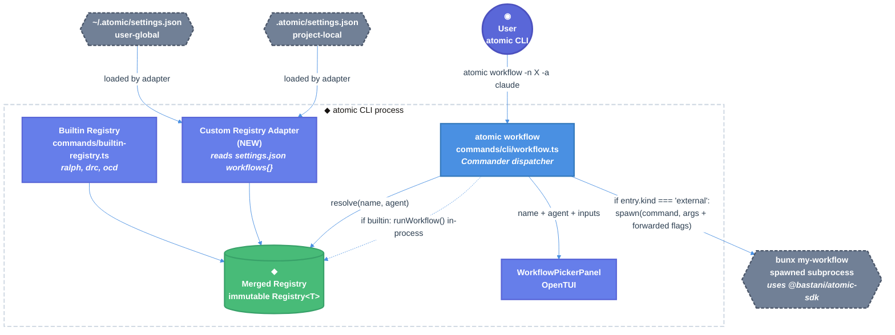

# Custom Workflows via `workflows` Key in atomic Settings — Technical Design Document

| Document Metadata      | Details      |
| ---------------------- | ------------ |
| Author(s)              | Norin Lavaee |
| Status                 | Draft (WIP)  |
| Team / Owner           | atomic CLI   |
| Created / Last Updated | 2026-05-07   |

## 1. Executive Summary

This RFC proposes extending atomic's `settings.json` schema (both `~/.atomic/settings.json` and `.atomic/settings.json`) with a top-level `workflows` key in the familiar MCP shape: `{ "command": string, "args": string[], "agents": string[] }`. At atomic startup, the CLI spawns each registered command with a hidden `_emit-workflow-meta` argv; the atomic-sdk's existing argv interceptor (already powering `_orchestrator-entry` and `_cc-debounce`) picks this up at module load and prints every compiled `WorkflowDefinition` reachable from the third-party binary as JSON. Atomic parses the metadata, registers the workflows into the same in-memory `Registry` that holds builtins, and surfaces them in `atomic workflow list`, the picker UI, and `atomic workflow inputs`. Dispatch is also subprocess-based: atomic spawns the same `<command> <args>` with a hidden `_atomic-run` argv carrying the chosen workflow, agent, detach flag, and inputs; the SDK interceptor on the other side calls `runWorkflow()` to drive the tmux orchestrator. **The third-party developer writes nothing beyond `defineWorkflow().run().compile()` and `import "@bastani/atomic-sdk"` — the SDK auto-derives both metadata emission and run dispatch.** The atomic-sdk's standalone "build your own binary" path remains unchanged.

## 2. Context and Motivation

### 2.1 Current State

- **Workflow Registration:** The atomic CLI ships a fixed registry built in [`packages/atomic/src/commands/builtin-registry.ts`](../packages/atomic/src/commands/builtin-registry.ts). Each workflow is statically imported at compile time (`ralph`, `deep-research-codebase`, `open-claude-design`) and chained into `createRegistry().register(...)`.
- **Workflow Authoring:** External authors use `defineWorkflow().for(agent).run(callback).compile()` from [`packages/atomic-sdk/src/define-workflow.ts`](../packages/atomic-sdk/src/define-workflow.ts) and either (a) publish a binary that calls `runWorkflow()` directly (per [`2026-05-06-sdk-self-contained-runworkflow.md`](2026-05-06-sdk-self-contained-runworkflow.md)) or (b) drop a workflow file into the codebase and add it to `builtin-registry.ts`.
- **Settings:** Atomic's `.atomic/settings.json` schema, defined at [`assets/settings.schema.json`](../assets/settings.schema.json) and loaded by [`packages/atomic-sdk/src/services/config/atomic-config.ts`](../packages/atomic-sdk/src/services/config/atomic-config.ts), currently surfaces only `version`, `scm`, and `providers.<agent>.{chatFlags,envVars}`.
- **Dispatch:** The `atomic workflow` Commander tree at [`packages/atomic/src/commands/cli/workflow.ts`](../packages/atomic/src/commands/cli/workflow.ts) builds its `--<input>` flags from `buildInputUnion(listWorkflows(registry))`, resolves a definition via `registry.resolve(name, agent)`, then calls the SDK's `runWorkflow()` (in-process tmux orchestrator).
- **MCP Precedent:** [`.mcp.json`](../.mcp.json) already establishes the `{ "command": "bunx", "args": [...] }` pattern for declaratively registering external executables in the atomic ecosystem.

### 2.2 The Problem

- **Friction for third-party workflow authors:** A user who wants to share a custom workflow today must either (a) PR it into atomic's builtins, or (b) ship and publish a self-contained binary. Both paths are heavyweight relative to the size of the deliverable.
- **No declarative integration surface:** There is no mechanism for a user to say "treat `bunx @me/my-cool-workflow` as if it were a builtin in my atomic CLI." The workflow registry is fully closed at compile time.
- **Distribution-vs-integration mismatch:** Per [`2026-05-03-atomic-package-split.md`](2026-05-03-atomic-package-split.md) and [`2026-05-06-sdk-self-contained-runworkflow.md`](2026-05-06-sdk-self-contained-runworkflow.md), the SDK is positioned as the "build your own binary" path — but the long tail of users (internal teams, individual contributors) want a faster on-ramp.

## 3. Goals and Non-Goals

### 3.1 Functional Goals

- [ ] Extend the atomic settings JSON Schema with a `workflows` object whose values declare an executable (`command`, optional `args`).
- [ ] Surface registered custom workflows in `atomic workflow list`, the interactive `WorkflowPickerPanel`, and `atomic workflow inputs` outputs.
- [ ] Dispatch `atomic workflow -n <custom> -a <agent>` to the registered executable, forwarding agent, detach, and any `--<input>` flags.
- [ ] Honor the existing precedence: project-local `.atomic/settings.json` overrides global `~/.atomic/settings.json`.
- [ ] Validate the schema (clear error message when `command` is missing or `args` is not an array of strings).
- [ ] Refuse to silently shadow a builtin workflow name; produce a clear error or warning.

### 3.2 Non-Goals (Out of Scope)

- [ ] We will NOT replace or deprecate the `runWorkflow()` "build your own binary" path. The SDK API stays unchanged.
- [ ] We will NOT introduce a plugin loading mechanism (dynamic `import()` of arbitrary files into the atomic process). Custom workflows always run as a subprocess.
- [ ] We will NOT scan disk directories (e.g., `.atomic/workflows/*.ts`) — that is the alternative explored in [`2026-02-02-atomic-builtin-workflows-commands.md`](2026-02-02-atomic-builtin-workflows-commands.md) and is out of scope here.
- [ ] We will NOT auto-install missing packages. `bunx` already handles transient install behavior; managing the user's package tree is the user's responsibility.
- [ ] We will NOT support per-agent command overrides in v1 (e.g., `command_for_claude` vs `command_for_copilot`). One command per workflow name; the command is responsible for handling whichever agent atomic forwards.
- [ ] We will NOT introduce a custom telemetry surface for external workflows.

## 4. Proposed Solution (High-Level Design)

### 4.1 System Architecture Diagram



### 4.2 Architectural Pattern

- **MCP-style declaration + SDK auto-dispatch.** Settings.json declares each workflow as a runnable command (`{ command, args, agents }`). The atomic-sdk's existing `lib/auto-dispatch.ts` interceptor — which already handles `_orchestrator-entry` and `_cc-debounce` — gains two siblings: `_emit-workflow-meta` (prints registered WorkflowDefinitions as JSON, exits) and `_atomic-run` (calls `runWorkflow()` with the supplied name/agent/inputs, exits). Because every SDK consumer's import chain triggers the interceptor, third-party binaries get both behaviors **for free** with no boilerplate.
- **Loader.** A new `loadCustomWorkflowsFromSettings()` in atomic CLI walks settings, spawns `<command> <args> _emit-workflow-meta` once per entry, parses the JSON, and converts each definition into a registry entry tagged with its source command. The result is chained into `createBuiltinRegistry()` with `.upsert()` semantics so local > global > builtin precedence is honored.
- **Strategy at dispatch boundary.** The dispatcher branches on the registry entry's tag: builtins call in-process `runWorkflow()` as today; custom entries spawn `<command> <args> _atomic-run --name X --agent Y [--detach] [--input v]...` and inherit stdio. Either way, the SDK's tmux orchestrator and self-exec auto-default for `pathToAtomicExecutable` carry the rest.

### 4.3 Key Components

| Component                             | Responsibility                                                                                      | Location                                                                           | Justification                                                             |
| ------------------------------------- | --------------------------------------------------------------------------------------------------- | ---------------------------------------------------------------------------------- | ------------------------------------------------------------------------- |
| `settings.schema.json` extension      | Declares `workflows` key shape (`command`, `args`, `agents`); editor intellisense.                  | `assets/settings.schema.json`                                                      | Single canonical schema source.                                           |
| `AtomicConfig.workflows`              | Typed in-memory representation of the loaded entries.                                               | `packages/atomic-sdk/src/services/config/atomic-config.ts`                         | Reuses the existing settings loader and merge precedence.                 |
| SDK `_emit-workflow-meta` interceptor | Prints all compiled WorkflowDefinitions reachable from the calling binary as JSON, then exits.      | `packages/atomic-sdk/src/lib/auto-dispatch.ts` (extended)                          | Reuses the proven argv-side-effect pattern; zero third-party boilerplate. |
| SDK `_atomic-run` interceptor         | Calls `runWorkflow()` against the chosen WorkflowDefinition with parsed inputs, then exits.         | `packages/atomic-sdk/src/lib/auto-dispatch.ts` (extended)                          | Same.                                                                     |
| `loadCustomWorkflowsFromSettings()`   | Spawns each entry's command with `_emit-workflow-meta`, parses, validates, returns registry inputs. | `packages/atomic/src/commands/custom-workflows.ts` (NEW)                           | Keeps settings → registry conversion isolated and testable.               |
| Registry `.upsert()`                  | Replace `(agent, name)` entry instead of throwing; required for `local > global > builtin`.         | `packages/atomic-sdk/src/registry.ts` (extended)                                   | Minimal addition; `.register()` keeps its strict semantics.               |
| Custom-entry tag + dispatcher branch  | Mark custom entries with their source command; route dispatch to subprocess via `_atomic-run`.      | `packages/atomic-sdk/src/types.ts`, `packages/atomic/src/commands/cli/workflow.ts` | Single discriminator; tiny dispatcher branch.                             |

## 5. Detailed Design

### 5.1 Settings Schema Extension

**File:** `assets/settings.schema.json`

Add a `workflows` property at the top level using the MCP-style shape:

```jsonc
{
  "$schema": "http://json-schema.org/draft-07/schema#",
  "title": "Atomic Settings",
  "type": "object",
  "properties": {
    /* … existing version / scm / providers … */
    "workflows": {
      "type": "object",
      "description": "Custom user workflows. Each entry declares an executable command; atomic invokes it once at startup with `_emit-workflow-meta` to discover the compiled WorkflowDefinitions, then invokes it with `_atomic-run` to dispatch. Both behaviors are auto-handled by @bastani/atomic-sdk's argv interceptor — no third-party boilerplate.",
      "additionalProperties": { "$ref": "#/$defs/customWorkflow" },
    },
  },
  "$defs": {
    "customWorkflow": {
      "type": "object",
      "required": ["command", "agents"],
      "properties": {
        "command": {
          "type": "string",
          "description": "Executable to spawn (e.g., 'bunx', 'node', '/abs/path/to/binary').",
        },
        "args": {
          "type": "array",
          "items": { "type": "string" },
          "default": [],
          "description": "Static arguments passed before atomic's hidden `_emit-workflow-meta` / `_atomic-run` argv.",
        },
        "agents": {
          "type": "array",
          "minItems": 1,
          "uniqueItems": true,
          "items": {
            "type": "string",
            "enum": ["claude", "opencode", "copilot"],
          },
          "description": "Required. Agents this workflow supports. Atomic registers one entry per agent listed; the third-party command's WorkflowDefinitions must cover them.",
        },
      },
      "additionalProperties": false,
    },
  },
}
```

**Example user settings.json:**

```jsonc
{
  "$schema": "https://raw.githubusercontent.com/flora131/atomic/main/assets/settings.schema.json",
  "version": 1,
  "scm": "github",
  "workflows": {
    "deep-spec": {
      "command": "bunx",
      "args": ["@me/atomic-deep-spec"],
      "agents": ["claude", "copilot"],
    },
    "release-notes": {
      "command": "node",
      "args": ["/abs/path/release-notes.mjs"],
      "agents": ["claude"],
    },
  },
}
```

The map key (`deep-spec`, `release-notes`) is a settings-level alias used in logs and error messages. The **authoritative** workflow name, description, and input schema all come from the third-party binary's compiled `WorkflowDefinition` — exactly the same source-of-truth used by builtins.

### 5.2 Configuration Loader Changes

**File:** `packages/atomic-sdk/src/services/config/atomic-config.ts`

Add to `AtomicConfig`:

```ts
export interface CustomWorkflowEntry {
  command: string;
  args?: string[];
  agents: AgentKey[]; // required, non-empty subset of AgentKey
}

export interface AtomicConfig {
  version?: number;
  scm?: ScmProvider;
  providers?: Partial<Record<AgentKey, ProviderOverrides>>;
  workflows?: Record<string, CustomWorkflowEntry>;
}
```

Add a `pickWorkflows()` parser (mirrors the conservative `pickProviders` pattern: silently drop malformed entries, keep valid ones; reject entries with empty/missing `command` or `agents`). Update `mergeConfigs()` so local `workflows` entries override global ones by alias key (same-key local entry replaces same-key global entry; non-overlapping keys are unioned).

### 5.3 Registry Changes

Two small additions to `packages/atomic-sdk/src/registry.ts`:

1. **`.upsert(def)`** — replace an existing `(agent, name)` entry instead of throwing. Required by the `local > global > builtin` precedence rule. The existing `.register()` keeps its strict duplicate-rejection semantics so accidental double-registers in builtin registration still fail loud.
2. **External entry tag** — extend `RegistrableWorkflow` to a discriminated union:

```ts
type RegistrableWorkflow =
  | (WorkflowDefinition & { kind?: "builtin" })
  | ExternalWorkflow;

interface ExternalWorkflow {
  kind: "external";
  name: string;
  agent: AgentType;
  description?: string;
  inputs: WorkflowInput[];
  source: { command: string; args: string[] }; // ← from settings.json
}
```

Custom workflows enter the registry as `ExternalWorkflow` entries — they hold the same metadata as a `WorkflowDefinition` (used by `listWorkflows`, picker, `inputs`) **plus** the `source` command needed by the dispatcher.

### 5.4 SDK Auto-Dispatch Extensions

**File:** `packages/atomic-sdk/src/lib/auto-dispatch.ts`

The interceptor today checks `process.argv` at module load and dispatches `_orchestrator-entry` and `_cc-debounce` (so `runWorkflow()` consumers' import chains fire those code paths). We extend it with two new hidden, **token-gated** subcommands.

#### Token gating — preventing accidental invocation

Both new subcommands are intended **only** for atomic-internal use; they must not be discoverable or accidentally invokable by the user. We layer three guards:

1. **`_` prefix** — already a convention for SDK-internal subcommands (`_orchestrator-entry`, `_cc-debounce`); not surfaced in Commander help, not advertised in docs.
2. **Per-spawn nonce in env + argv** — atomic generates a fresh 16-byte random token at startup and:
   - exports it as `ATOMIC_DISPATCH_TOKEN=<hex>` in the child's env, AND
   - passes it as `--dispatch-token=<hex>` in the child's argv.
     The SDK auto-dispatch handler refuses to act unless **both** the env token and argv token are present, equal, and at least 32 hex chars. Any mismatch → fall through to the third-party command's normal main() (which will treat the unknown argv however it normally does — typically a help dump or error).
3. **`ATOMIC_HOST=1` env marker** — additional cross-check; absent this marker, the SDK assumes it's not running under atomic and ignores the dispatch argv entirely.

A user typing `bunx my-workflow _emit-workflow-meta` directly will hit none of the env vars and the SDK will silently no-op (the command falls through to its own main()).

#### `_emit-workflow-meta`

When invoked as `<command> <args> _emit-workflow-meta --dispatch-token=<token>` with matching env, the SDK:

1. Drains the in-process registry that `defineWorkflow().compile()` calls populate (every compile call registers itself in a module-private array).
2. Serializes each `WorkflowDefinition` to JSON: `{ name, description, agent, inputs, source, minSDKVersion }`.
3. Writes a single line `ATOMIC_WORKFLOW_META: <json-array>` to stdout, then `process.exit(0)`.

#### `_atomic-run`

When invoked as `<command> <args> _atomic-run --dispatch-token=<token> --name X --agent Y [--detach] [--input v]...`, the SDK:

1. Looks up `X / Y` in the in-process registry.
2. Calls `runWorkflow({ workflow, inputs, detach })`.
3. Exits with the result code.

Both interceptors are pure SDK additions; third-party code that just does `defineWorkflow(...).compile()` and `import "@bastani/atomic-sdk"` inherits both behaviors with zero boilerplate, and the token gating guarantees they cannot fire outside an atomic-orchestrated spawn.

### 5.5 Custom-Workflow Loader

**File (new):** `packages/atomic/src/commands/custom-workflows.ts`

```ts
import type {
  AtomicConfig,
  CustomWorkflowEntry,
} from "@bastani/atomic-sdk/services/config/atomic-config";
import type { ExternalWorkflow, AgentType } from "@bastani/atomic-sdk";

interface LoadedWorkflow {
  alias: string;
  origin: "local" | "global";
  workflow: ExternalWorkflow;
}

export async function loadCustomWorkflows(
  workflows: Record<string, CustomWorkflowEntry> | undefined,
  origin: "local" | "global",
): Promise<LoadedWorkflow[]> {
  if (!workflows) return [];
  const out: LoadedWorkflow[] = [];
  for (const [alias, entry] of Object.entries(workflows)) {
    const meta = await emitMeta(entry); // spawn + parse `_emit-workflow-meta`
    if (!meta) {
      warn(`[atomic/workflows] "${alias}": failed to emit metadata; skipping.`);
      continue;
    }
    for (const declaredAgent of entry.agents) {
      const def = meta.find((m) => m.agent === declaredAgent);
      if (!def) {
        warn(
          `[atomic/workflows] "${alias}/${declaredAgent}": no matching workflow exposed by command; skipping.`,
        );
        continue;
      }
      out.push({
        alias,
        origin,
        workflow: {
          kind: "external",
          name: def.name,
          agent: declaredAgent,
          description: def.description,
          inputs: def.inputs,
          source: { command: entry.command, args: entry.args ?? [] },
        },
      });
    }
  }
  return out;
}

async function emitMeta(entry: CustomWorkflowEntry): Promise<MetaArray | null> {
  const token = randomBytes(16).toString("hex");
  const child = Bun.spawn(
    [
      entry.command,
      ...(entry.args ?? []),
      "_emit-workflow-meta",
      `--dispatch-token=${token}`,
    ],
    {
      stdio: ["ignore", "pipe", "pipe"],
      env: { ...process.env, ATOMIC_HOST: "1", ATOMIC_DISPATCH_TOKEN: token },
    },
  );
  const stdout = await new Response(child.stdout).text();
  if ((await child.exited) !== 0) return null;
  const line = stdout
    .split("\n")
    .find((l) => l.startsWith("ATOMIC_WORKFLOW_META: "));
  if (!line) return null;
  try {
    return JSON.parse(line.slice("ATOMIC_WORKFLOW_META: ".length));
  } catch {
    return null;
  }
}
```

The atomic CLI startup path becomes:

```ts
const builtin = createBuiltinRegistry();
const { local, global } = await readAtomicConfigSplit(process.cwd());

const globalLoaded = await loadCustomWorkflows(global?.workflows, "global");
const localLoaded = await loadCustomWorkflows(local?.workflows, "local");

// Precedence: local > global > builtin. Use `.upsert()` so duplicates replace.
let merged = builtin;
for (const { workflow } of [...globalLoaded, ...localLoaded])
  merged = merged.upsert(workflow);
```

`buildWorkflowCommand(merged)` consumes the merged registry. `buildInputUnion(listWorkflows(merged))` automatically computes the union of `--<input>` flags across builtins + custom because `ExternalWorkflow` carries an `inputs` array in the same shape `WorkflowDefinition` exposes.

### 5.6 Dispatcher Branch

**File:** `packages/atomic/src/commands/cli/workflow.ts`

`dispatch()` becomes:

```ts
async function dispatch(
  workflow: RegistrableWorkflow,
  cliInputs: Record<string, string>,
  detach: boolean,
): Promise<void> {
  if (workflow.kind === "external")
    return dispatchExternal(workflow, cliInputs, detach);
  return runWorkflow({ workflow, inputs: cliInputs, detach });
}

async function dispatchExternal(
  w: ExternalWorkflow,
  cliInputs: Record<string, string>,
  detach: boolean,
): Promise<void> {
  const token = randomBytes(16).toString("hex");
  const argv = [
    ...w.source.args,
    "_atomic-run",
    `--dispatch-token=${token}`,
    "--name",
    w.name,
    "--agent",
    w.agent,
    ...(detach ? ["--detach"] : []),
    ...Object.entries(cliInputs).flatMap(([k, v]) => [`--${k}`, v]),
  ];
  const child = Bun.spawn([w.source.command, ...argv], {
    cwd: process.cwd(),
    stdio: ["inherit", "inherit", "inherit"],
    env: { ...process.env, ATOMIC_HOST: "1", ATOMIC_DISPATCH_TOKEN: token },
  });
  const code = await child.exited;
  if (code !== 0) process.exit(code);
}
```

The third-party binary on the receiving end of `_atomic-run` calls `runWorkflow()` itself, which auto-defaults `pathToAtomicExecutable` to its own `process.execPath` and self-execs the `_orchestrator-entry` sub-command — exactly the same mechanism builtins use today.

### 5.7 Picker / List / Inputs Behavior

All three surfaces work without code changes — they iterate the merged registry and call the existing metadata accessors. Each accessor (`getName / getDescription / getAgent / getInputSchema`) gains a tiny branch for `kind: "external"` entries that returns the field already stored on `ExternalWorkflow`. Custom workflows appear with the metadata the third-party developer declared inside `defineWorkflow({ name, description, inputs })`, faithfully passed through `_emit-workflow-meta`.

#### 5.7.1 Broken Workflows in the Picker

A workflow that failed to load (per §5.8) is **not removed** from the picker — hiding it leaves users without a feedback loop for fixing settings.json. Instead it surfaces as a **non-dispatchable, visually-distinct row** with its failure reason exposed on cursor focus.

**Wire diagram (Catppuccin Mocha tokens):**

```
╭─ atomic workflow · PICK ──────────────────────────────────────╮
│   CLAUDE                                                      │
│  ▸ ralph                              Long-horizon agent loop │   healthy · selected (accent)
│    deep-research-codebase             Codebase research spec  │   healthy · default
│  ✗ deep-spec                          failed to load          │   broken · default
│    open-claude-design                 Design doc author       │
│                                                               │
│   COPILOT                                                     │
│    ralph                              Long-horizon agent loop │
│  ✗ release-notes                      failed to load          │
├───────────────────────────────────────────────────────────────┤
│ deep-spec                                                     │   ← preview pane
│ ✗ Failed to load                                              │
│                                                               │
│ "bunx" exited 1 during _emit-workflow-meta                    │
│                                                               │
│ source · ~/.atomic/settings.json                              │
│ fix    · check @me/atomic-deep-spec is installed and uses     │
│          @bastani/atomic-sdk                                  │
╰───────────────────────────────────────────────────────────────╯
  ↑↓ navigate · ↵ run · / filter · esc cancel
```

**Three picker-row states (extends `picker-row-default` / `picker-row-selected` from `DESIGN.md`):**

| State                 | Background      | Leading glyph      | Alias / name             | Trailing caption          | Bold? | Notes                                                                                                                                                                                            |
| --------------------- | --------------- | ------------------ | ------------------------ | ------------------------- | ----- | ------------------------------------------------------------------------------------------------------------------------------------------------------------------------------------------------ |
| Healthy, default      | `mantle`        | (two-space indent) | `subtext0`               | description in `subtext0` | no    | Unchanged from existing picker.                                                                                                                                                                  |
| Healthy, cursor-on    | `accent` (Blue) | `▸ ` in `surface0` | `surface0`               | description in `surface0` | yes   | Unchanged. The "you are here AND ready to act" vocabulary.                                                                                                                                       |
| **Broken, default**   | `mantle`        | `✗ ` in `red`      | `dim` (Overlay1)         | `failed to load` in `red` | no    | Glyph + caption use the `error` semantic color. Status-Is-Truth: red genuinely means broken.                                                                                                     |
| **Broken, cursor-on** | `surface1`      | `✗ ` in `red`      | `text` (lifted from dim) | `failed to load` in `red` | no    | Uses Surface1 — the slot DESIGN.md explicitly reserves for "hover/selection states on neutral surfaces" — instead of accent Blue. The bold-and-Blue vocabulary stays sacred for actionable rows. |

**A new `picker-row-broken` token** is added to `DESIGN.md`'s components map:

```yaml
picker-row-broken:
  backgroundColor: "{colors.mantle}"
  textColor: "{colors.overlay1}" # dim alias
  glyphColor: "{colors.red}"
  captionColor: "{colors.red}"
  padding: "0 2ch 0 1ch"

picker-row-broken-focused:
  backgroundColor: "{colors.surface1}" # the previously-reserved disabled-hover stratum
  textColor: "{colors.text}" # alias lifted to text, NOT bold
  glyphColor: "{colors.red}"
  captionColor: "{colors.red}"
  padding: "0 2ch 0 1ch"
```

**Interaction rules:**

- `↑` / `↓` move the cursor through **all** rows including broken ones — the user can land on a broken row to read its details. (Skipping broken rows hides information; surfacing it with a muted treatment is more honest.)
- Pressing `↵` (Enter) on a broken row is a **no-op for dispatch**. The statusline briefly displays `cannot run: <alias> failed to load — see preview` in `red` for ~2s, then restores the default hint row. No tmux session is created.
- The right preview pane (which today renders the workflow description and input schema) instead renders the **error preview**:
  - Title: alias in `text` bold (panel `title` prop, same as healthy preview).
  - Status line: `✗ Failed to load` in `red` bold.
  - Reason: the cached startup error message (from §5.8) in `text`.
  - Source: `source · <path-to-settings.json>` in `subtext0`.
  - Remediation: `fix · <hint>` in `subtext0`.
- The filter (`/`) treats broken rows like any other — they match by alias/agent the same way healthy rows do.
- Mode pill stays `PICK` (never changes color based on the selection); the row carries the state, not the chrome.

**No-go list (kept for parity with the existing absolute bans):**

- No side-stripe `border-left` accent on broken rows — the `✗ ` glyph and red caption carry the meaning.
- No emoji (`⚠️`, `❌`); only the existing Unicode set (`✗ ▸   ↵ ↑↓`).
- No spinner or pulse on broken rows — pulse means "this is live, watch it." Broken is a steady state.
- No modal popup on Enter — that's a "modal as first thought" smell. Statusline hint + preview pane carry the message.
- No bold on broken rows in either default or focused state — bold is reserved for actionable selection.

#### 5.7.2 `atomic workflow list` Behavior

Broken entries appear in the listing with the same `✗` prefix and `failed to load — <reason>` suffix in `red`. A trailing `<N> custom workflow(s) skipped — fix at <path>` summary line in `subtext0` reminds the user where to look.

#### 5.7.3 CLI Invocation Hard-Block

`atomic workflow -n <broken-name> -a <agent>` exits non-zero **immediately**, before any subprocess is spawned, with stderr:

```
[atomic/workflows] cannot run "<name>" for agent "<agent>": this workflow failed to load.
  reason · <cached startup reason>
  source · <path-to-settings.json>
  fix    · <hint>
```

The exit code is `2` (mirrors Commander's "usage error" exit) so scripts and CI can distinguish a user/config error from a runtime workflow failure.

### 5.8 Validation Rules and Fail-Fast Diagnostics

Custom-workflow misconfiguration is the most common failure mode users will hit. Atomic must fail **loudly, immediately, and with actionable remediation** for every class of error — never silently swallow.

#### Schema-level errors (caught at config-load time, before any spawn)

| Failure                                  | Severity | Behavior                                                                                                               |
| ---------------------------------------- | -------- | ---------------------------------------------------------------------------------------------------------------------- |
| `command` missing or empty               | Error    | Skip entry; print one line: `[atomic/workflows] "<alias>": missing required "command"; see <schema-url>`.              |
| `agents` missing / empty / unknown agent | Error    | Skip entry; print: `[atomic/workflows] "<alias>": "agents" must be a non-empty subset of [claude, opencode, copilot]`. |
| `args` not an array of strings           | Error    | Skip entry; print: `[atomic/workflows] "<alias>": "args" must be array of strings (got <type>)`.                       |
| Unknown property                         | Error    | Skip entry; print: `[atomic/workflows] "<alias>": unknown property "<prop>" — see <schema-url>`.                       |

#### Runtime errors (caught when spawning `_emit-workflow-meta` at startup)

| Failure                                                                       | Severity | Behavior                                                                                                                                                                       |
| ----------------------------------------------------------------------------- | -------- | ------------------------------------------------------------------------------------------------------------------------------------------------------------------------------ |
| `command` not on PATH / file not found                                        | Error    | Skip; print: `[atomic/workflows] "<alias>": command "<cmd>" not found on PATH; install it or use an absolute path`.                                                            |
| Spawn fails (permission denied, etc.)                                         | Error    | Skip; print the underlying syscall error verbatim with the alias prefix.                                                                                                       |
| Non-zero exit code                                                            | Error    | Skip; print: `[atomic/workflows] "<alias>": "<cmd> <args> _emit-workflow-meta" exited <code>; stderr: <captured>`.                                                             |
| Timeout (default 5s, configurable via `ATOMIC_WORKFLOWS_META_TIMEOUT_MS` env) | Error    | Kill child; print: `[atomic/workflows] "<alias>": metadata emission timed out after <N>ms — is the third-party CLI using @bastani/atomic-sdk?`.                                |
| No `ATOMIC_WORKFLOW_META: ` line in stdout                                    | Error    | Skip; print: `[atomic/workflows] "<alias>": expected ATOMIC_WORKFLOW_META line — third-party CLI may be missing 'import "@bastani/atomic-sdk"'`.                               |
| Malformed JSON after the prefix                                               | Error    | Skip; print the parse error with the offending substring (truncated to 200 chars).                                                                                             |
| Declared agent has no matching emitted definition                             | Error    | Skip _that agent_ (other agents in the same entry can still register); print: `[atomic/workflows] "<alias>/<agent>": command did not register a workflow for agent "<agent>"`. |

#### Dispatch-time errors (caught when the user runs `atomic workflow -n <name> -a <agent>` or selects a row in the picker)

| Failure                                  | Severity               | Behavior                                                                                                                                                                                                                                     |
| ---------------------------------------- | ---------------------- | -------------------------------------------------------------------------------------------------------------------------------------------------------------------------------------------------------------------------------------------- |
| Workflow was skipped at startup (CLI)    | **Hard fail (exit 2)** | atomic refuses to spawn the subprocess. Prints the structured stderr block in §5.7.3 (`reason / source / fix`). Exit code 2 distinguishes config errors from runtime workflow failures.                                                      |
| Workflow was skipped at startup (picker) | **Soft refuse**        | The cursor can land on the broken row; the right preview pane shows the error. Pressing `↵` is a no-op — the statusline flashes `cannot run: <alias> failed to load — see preview` in `red` for ~2s. No tmux session is created. See §5.7.1. |
| `_atomic-run` exits non-zero             | **Hard fail**          | atomic exits with the child's exit code; child's stderr was already inherited so the user sees the underlying failure.                                                                                                                       |
| Child process killed by signal           | **Hard fail**          | atomic exits 128+signal; print: `[atomic/workflows] "<name>": child terminated by signal <SIGNAME>`.                                                                                                                                         |

#### Aggregate startup behavior

- Atomic **does not abort startup** if some custom workflows fail — the user can still use builtins and well-formed customs. Aborting on a typo would be hostile.
- Atomic **summarizes** at the end of startup: `[atomic/workflows] loaded N custom workflows (M skipped — see warnings above)`. The summary is suppressed when N=0 and M=0.
- All warnings go to stderr; they appear at the top of every `atomic` invocation until the user fixes settings — by design — so misconfiguration cannot rot silently.
- `atomic workflow list` shows skipped entries in a separate "skipped" section with their reason, so users can audit without scanning startup logs.

#### Precedence

- **Workflow precedence** (highest first): project-local `.atomic/settings.json` > global `~/.atomic/settings.json` > builtin. A custom workflow whose `(name, agent)` matches a builtin **overrides the builtin** without warning, and a same-key local entry overrides the same-key global entry. Atomic's startup log surfaces every override decision so the user can audit (`[atomic/workflows] override: deep-research-codebase/claude (local) > builtin`).
- The compiled definitions' `name` field is authoritative. Reserved names are already enforced by `compile()`; we do not re-validate.

### 5.8 Data Model

| Layer                  | Storage                                             | Lifetime         |
| ---------------------- | --------------------------------------------------- | ---------------- |
| Persistent declaration | `.atomic/settings.json` / `~/.atomic/settings.json` | User-managed.    |
| In-memory registry     | `Registry<RegistrableWorkflow>`                     | Per CLI process. |
| Dispatch context       | Subprocess argv + env                               | Per invocation.  |

No new on-disk artifacts are introduced.

### 5.9 Algorithms / State Management

The atomic CLI flow:

1. Parse CLI args.
2. Load split config (global vs local).
3. For each `(origin, workflows)` pair, `loadCustomWorkflows()` spawns `<command> <args> _emit-workflow-meta` per entry, parses, returns `ExternalWorkflow[]`.
4. Chain into `createBuiltinRegistry()` via `.upsert()` so `local > global > builtin`.
5. `buildWorkflowCommand(merged).parseAsync(process.argv)`.
6. On action: `dispatch()` branches on `kind` (`builtin` → in-process `runWorkflow()`; `external` → spawn `<command> <args> _atomic-run …`).

**Startup metadata cost:** one short-lived spawn per workflow entry. With a typical settings file (<10 entries) this is bounded and parallelizable (the loader fans out with `Promise.all`). Bad entries fail fast (5s timeout) and atomic continues without them.

**No caching in v1.** Metadata is re-emitted on every `atomic` invocation. If startup latency proves a problem we can cache by `(command, args[], mtime)` keyed on the binary's mtime — out of scope for v1.

## 6. Alternatives Considered

| Option                                                                        | Pros                                                                                                                              | Cons                                                                                                                                      | Reason for Rejection                                                                                                                                   |
| ----------------------------------------------------------------------------- | --------------------------------------------------------------------------------------------------------------------------------- | ----------------------------------------------------------------------------------------------------------------------------------------- | ------------------------------------------------------------------------------------------------------------------------------------------------------ |
| **A. Disk-based discovery** (scan `.atomic/workflows/*.ts`)                   | No schema; natural file-per-workflow.                                                                                             | Implicit; no opt-in surface; ambiguous precedence with global directory.                                                                  | Settings-json-driven registration is explicit and reuses the existing settings precedence.                                                             |
| **B. In-process import (`module` xor `path`)**                                | Single `runWorkflow()` codepath; no IPC.                                                                                          | Atomic process must dynamically import user TS; module-resolution rules diverge for global vs local; doesn't fit `bunx <pkg>` ergonomics. | The MCP shape is more familiar and works for opaque binaries (`/abs/path/to/binary`); SDK auto-dispatch makes IPC virtually free anyway.               |
| **C. Inline declaration of metadata in settings.json**                        | No SDK protocol; offline.                                                                                                         | Metadata drifts from compiled `WorkflowDefinition`; duplicates source of truth.                                                           | The third-party binary's compiled definitions are the canonical source; we should not duplicate.                                                       |
| **D. Selected: MCP shape + SDK auto-dispatch (`_emit-meta` / `_atomic-run`)** | Familiar MCP shape; subprocess isolation; **zero third-party boilerplate** — the SDK auto-handles meta emission and run dispatch. | Two short-lived spawns at startup per entry; spawn cost.                                                                                  | **Selected:** ergonomic schema, single canonical metadata source, no plugin loading inside atomic process, no third-party effort beyond using the SDK. |

## 7. Cross-Cutting Concerns

### 7.1 Security and Privacy

- **Arbitrary subprocess execution by design.** A `workflows` entry causes atomic to spawn a user-declared command. This is the same trust model as `.mcp.json` (which already spawns user-declared binaries). Settings.json is treated as trusted input — the user owns it. Document this explicitly in the schema description.
- **Process isolation.** Custom workflows run in a dedicated child process with inherited stdio. They cannot directly mutate atomic's in-process state.
- **No credential surface added.** Atomic does not synthesize secrets for the child process; it inherits the user's environment plus an `ATOMIC_HOST=1` marker so the child can detect it's running under atomic.
- **No bundled-PATH spoofing.** `Bun.spawn` resolves bare `command` names through the user's PATH at exec time — atomic never injects a synthetic PATH for the child.
- **Failure isolation.** A misbehaving entry is skipped per §5.8; it cannot prevent atomic from starting or affect other workflows.

### 7.2 Observability Strategy

- **Startup log:** atomic logs `[atomic/workflows] loaded <N> custom workflow(s) from settings (<aliases>)` and one warning per skipped entry.
- **Telemetry:** Optional; see §9 Q5.

### 7.3 Scalability and Capacity Planning

- N/A. Custom workflows are user-declared; the typical user has <10 entries. Registry list iterates O(N) over a small N.

## 8. Migration, Rollout, and Testing

### 8.1 Deployment Strategy

- **Phase 1 — Schema + loader:** Land schema additions, `AtomicConfig.workflows`, `pickWorkflows()`, unit tests. No behavior change to running CLI.
- **Phase 2 — Registry union type + adapter:** Land `ExternalWorkflow` discriminator + `expandCustomWorkflows()`; teach `listWorkflows`/picker to render externals.
- **Phase 3 — Dispatcher branch:** Land `dispatchExternal()` and the merged-registry wiring in `cli.ts`. Behind no flag — settings.json with no `workflows` key remains a no-op.
- **Phase 4 — Docs + examples:** Update README and `docs/` with a "Custom Workflows" section; ship a tiny `examples/custom-workflow-bunx/` showing the end-to-end pattern.

### 8.2 Data Migration Plan

- None. Existing settings.json files lacking a `workflows` key continue to work unchanged.

### 8.3 Test Plan

- **Unit Tests:**
  - `pickWorkflows()` accepts well-formed entries, drops malformed ones with the exact diagnostic message specified in §5.8.
  - Schema validation: `command` required, `args` array-of-strings, `agents` enum subset, unknown property rejected.
  - `mergeConfigs()` for the new `workflows` field: local-overrides-global keyed on alias; non-overlapping aliases unioned.
  - `Registry.upsert()` replaces matching `(agent, name)` while `Registry.register()` keeps its strict semantics.
  - SDK auto-dispatch: `_emit-workflow-meta` and `_atomic-run` are no-ops without a matching `ATOMIC_DISPATCH_TOKEN` env / argv pair; correct token triggers them.
- **Integration Tests:**
  - End-to-end registry merge: settings.json → `loadCustomWorkflows` (mocked spawn) → `createBuiltinRegistry().upsert(...)` → `listWorkflows()` returns the expected union and ordering.
  - `dispatchExternal()` spawns the configured command with the expected argv including a fresh dispatch token.
  - Picker UI renders external entries; selecting one with declared inputs prompts for them and forwards them in the spawn argv.
  - Fail-fast paths: simulate (a) command not on PATH, (b) timeout, (c) non-zero exit, (d) malformed JSON, (e) missing agent in metadata. Each produces the exact stderr line in §5.8 and atomic continues to start.
- **End-to-End Tests:**
  - Fixture: a tiny "echo" workflow under `packages/atomic/test/fixtures/external-echo/` that uses `@bastani/atomic-sdk` and `defineWorkflow().compile()`. `atomic workflow list` shows it; `atomic workflow -n echo -a claude --topic foo` dispatches it; assert on captured stdout/exit code.
  - Token isolation: invoking the fixture's binary directly with `_emit-workflow-meta` without env tokens must fall through to the user's main (no JSON emitted on stdout).
  - Config-merge fixture: global registers `echo`, local overrides `echo`; verify local definition wins.
  - Builtin override fixture: settings declares `ralph` pointing at the test fixture; verify the fixture replaces the builtin and the override-log line is emitted.
  - **Broken-workflow CLI:** settings registers a workflow whose `command` resolves to a non-existent binary; assert `atomic workflow -n <name> -a <agent>` exits with code 2 and stderr matches the §5.7.3 block.
  - **Broken-workflow picker:** load a broken entry; assert (a) the row renders with `picker-row-broken` tokens and `✗` prefix, (b) ↑/↓ lands the cursor on it, (c) the preview pane renders the cached error reason, (d) pressing Enter flashes the statusline message in `red` and does NOT create a tmux session, (e) Enter on a sibling healthy row dispatches normally.
  - **Snapshot:** capture an OpenTUI test snapshot of the picker with one healthy + one broken row + one healthy-selected row to lock the three visual states.

## 9. Open Questions / Unresolved Issues

- [x] **Q1 (Dispatch model):** **Resolved: subprocess via `_atomic-run`; metadata via `_emit-workflow-meta`. SDK auto-handles both.**
- [x] **Q2 (Metadata source):** **Resolved: SDK auto-derives metadata from the in-process `defineWorkflow().compile()` registry; no third-party effort.**
- [x] **Q3 (Multi-agent packages):** **Resolved: required `agents` array. SDK emits all reachable definitions; atomic registers one per declared agent.**
- [x] **Q4 (Builtin precedence):** **Resolved: `.atomic/settings.json` > `~/.atomic/settings.json` > builtin. Custom workflows override builtins by `(name, agent)`.**
- [x] **Q5 (Telemetry):** **Resolved: no telemetry in v1; revisit later.**
- [x] **Q6 (Init scaffolding):** **Resolved: do not scaffold a `workflows` block in `atomic init`.**
- [x] **Q7 (Schema shape):** **Resolved: MCP-style `{ command, args, agents }`.**
- [x] **Q8 (Internal subcommand isolation):** **Resolved: token-gated. Per-spawn nonce in `ATOMIC_DISPATCH_TOKEN` env + `--dispatch-token=<hex>` argv; SDK refuses to dispatch unless both match. Plus `_` prefix and `ATOMIC_HOST=1` cross-check.**
- [x] **Q9 (Fail-fast diagnostics):** **Resolved: see §5.8 — every misconfiguration produces an actionable, single-line stderr message; bad entries are skipped at startup; invocation of a skipped entry is a hard fail with the cached startup error replayed.**
- [x] **Q10 (Broken-workflow UX):** **Resolved: see §5.7.1. Picker surfaces broken entries with `picker-row-broken` tokens (red `✗` glyph, dim alias, `surface1` cursor-on bg), Enter is a no-op with a statusline hint, preview pane shows the cached error + remediation. CLI hard-blocks invocation with exit code 2 and a structured `reason/source/fix` stderr block.**
