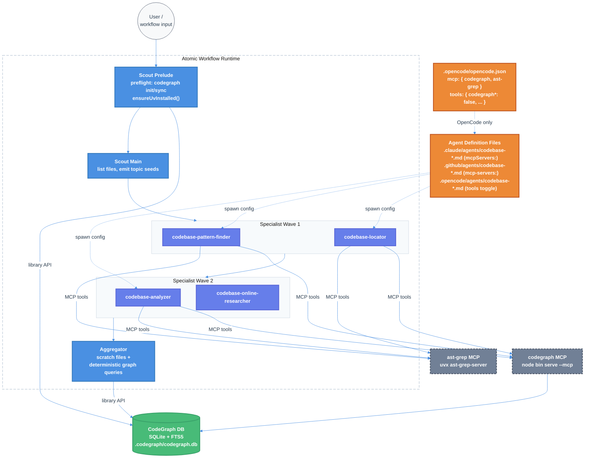

# Codebase-* Agents → CodeGraph + ast-grep-mcp Migration (Claude / Copilot / OpenCode)

| Document Metadata      | Details      |
| ---------------------- | ------------ |
| Author(s)              | Norin Lavaee |
| Status                 | Draft (WIP)  |
| Team / Owner           | Atomic CLI   |
| Created / Last Updated | 2026-05-08   |

## 1. Executive Summary

The 6 `codebase-*` agents shipped in `.claude/agents/`, `.github/agents/`, and `.opencode/agents/` are spawned by the `deep-research-codebase` workflow (and other Atomic workflows like `create-spec`, `research-codebase`). Today they discover and analyze code via grep/glob/Read and Bash-invoked `ast-grep`, burning tokens on filesystem walks and re-parsing files on every query.

We propose making each of these 6 agents depend on **two MCP servers**:

1. **[`@colbymchenry/codegraph`](https://github.com/colbymchenry/codegraph)** — pre-indexed SQLite knowledge graph; 8 tools (`codegraph_search`, `codegraph_explore`, `codegraph_callers`, etc.). Public benchmarks show **~92% fewer tool calls and ~71% faster exploration** for equivalent agent queries.
2. **[`ast-grep/ast-grep-mcp`](https://github.com/ast-grep/ast-grep-mcp)** — Python/FastMCP wrapper over the `ast-grep` CLI; 4 structured tools (`find_code`, `find_code_by_rule`, `dump_syntax_tree`, `test_match_code_rule`). Replaces the Bash-invoked ast-grep skill.

**Key simplification (v2 of this spec):** instead of programmatically wiring MCP servers via the Claude Agent SDK at workflow runtime, we **edit the 18 agent definition files directly** (6 agents × 3 SDK variants). MCP config and updated prompt content live in the agent files; the workflow's TypeScript orchestration code is barely touched. This means:

- **Claude:** add `mcpServers:` to each agent's YAML frontmatter (per `docs/claude-code/cli/subagents.md:231,311` — inline definitions per subagent are scoped, never leak into the parent conversation).
- **Copilot:** add `mcp-servers:` to each agent's YAML frontmatter (per `docs/copilot-cli/subagents.md:26,87`).
- **OpenCode:** OpenCode does not support per-agent MCP in frontmatter, so we register both servers in the project-level `opencode.json` `mcp` block, disable them globally via `tools: {"codegraph*": false, "ast-grep*": false}`, and re-enable per agent via the agent's own `tools:` map (the user-confirmed pattern).

The workflow code only needs: (a) a small preflight to ensure `.codegraph/` is built before agents spawn, and (b) `ensureUvInstalled()` so `uvx` resolves at agent spawn time.

## 2. Context and Motivation

### 2.1 Current State

**Agent locations:**
```
.claude/agents/   ← Claude Code agents (YAML frontmatter: name, description, tools, model)
.github/agents/   ← Copilot CLI agents (YAML frontmatter: name, description, tools[], model)
.opencode/agents/ ← OpenCode agents (YAML frontmatter: name, description, permission)
```

**The 6 `codebase-*` agents (one of each per SDK = 18 files):**

| Agent                        | Used by workflow               | Role                                                               |
| ---------------------------- | ------------------------------ | ------------------------------------------------------------------ |
| `codebase-locator`           | deep-research-codebase         | Find files/directories relevant to a feature; "Super Grep/Glob/LS" |
| `codebase-pattern-finder`    | deep-research-codebase         | Find usage examples and existing patterns                          |
| `codebase-analyzer`          | deep-research-codebase         | Analyze implementation details of specific components              |
| `codebase-online-researcher` | deep-research-codebase         | External research; not codegraph-relevant but lives in same family |
| `codebase-research-locator`  | create-spec, research-codebase | Locate research documents in `research/`                           |
| `codebase-research-analyzer` | create-spec, research-codebase | Extract insights from local research docs                          |

**Workflow under primary scrutiny:** `packages/atomic-sdk/src/workflows/builtin/deep-research-codebase/`

```
deep-research-codebase/
├── claude/index.ts       # Claude SDK orchestration (3 phases)
├── copilot/index.ts      # Copilot variant
├── opencode/index.ts     # OpenCode variant
└── helpers/
    ├── prompts.ts        # AST_GREP_ENV_NOTICE injection
    ├── scout.ts          # File discovery + partition bin-packing
    ├── scratch.ts        # Deterministic synthesis from specialist outputs
    ├── batching.ts       # MAX_TASKS_PER_BATCH = 10
    └── heuristic.ts      # LOC → explorer count
```

**Today the workflow:**
1. `codebase-scout` walks files via `git ls-files` + ripgrep, computes partitions, emits 2–4 ast-grep query seeds per partition.
2. Specialist waves (locator, pattern-finder, analyzer, online-researcher) are dispatched via the Task tool; each is prompted with `AST_GREP_ENV_NOTICE` and told to invoke `ast-grep --lang ... -p '...'` via Bash.
3. `aggregator` synthesizes per-partition scratch files into the final research doc.

### 2.2 The Problem

- **Token cost:** specialists spend most of their budget on filesystem discovery before producing analysis.
- **Latency:** Phase 2 batches block on the slowest specialist; grep-heavy specialists stretch the wave.
- **Quality ceiling:** cross-file relationships (callers, impact radius, framework routes) are inferred by the LLM from raw text rather than computed.
- **Agent reuse:** these agents are also used by other workflows; today every workflow that spawns a `codebase-*` agent inherits the same grep/Bash-ast-grep limitations.

CodeGraph's published benchmarks show 84–96% fewer tool calls and 43–82% faster exploration for equivalent questions when an Explore agent uses `codegraph_explore` instead of grep/glob/read. ast-grep-mcp adds structured AST search where CodeGraph misses. Editing the agent files (instead of the workflow code) means **every workflow that spawns these agents gets the upgrade for free.**

## 3. Goals and Non-Goals

### 3.1 Functional Goals

- [ ] **All 6 `codebase-*` agents in all 3 SDK variants (18 files)** are updated with:
  - MCP server access to `codegraph` and `ast-grep` (per-SDK mechanism — see §5.1).
  - Updated prompt content embedding the **CodeGraph guidance block** (user-supplied, in `<!-- CODEGRAPH_START --> ... <!-- CODEGRAPH_END -->` markers for future automated updates) and the **ast-grep Rule Development Process block**, refined per agent role via the prompt-engineer skill.
- [ ] **Claude:** each agent's frontmatter declares `mcpServers:` inline (per `docs/claude-code/cli/subagents.md:231,311`). Inline definitions spawn per-subagent and don't leak tools into the parent conversation.
- [ ] **Copilot:** each agent's frontmatter declares `mcp-servers:` inline (per `docs/copilot-cli/subagents.md:26,87`). The `tools:` array enumerates the specific MCP tools allowed.
- [ ] **OpenCode:** the project-level `.opencode/opencode.json` registers both MCP servers in `mcp:`, disables them globally via `tools: {"codegraph*": false, "ast-grep*": false}`, and each codebase-* agent's `tools:` map re-enables them via `{"codegraph*": true, "ast-grep*": true}`. This pattern (user-confirmed) gives effective per-agent MCP isolation despite OpenCode lacking native frontmatter MCP support.
- [ ] `@colbymchenry/codegraph` is added as a runtime dependency of `@bastani/atomic-sdk` in `packages/atomic-sdk/package.json`. Used by both the codegraph MCP server spawn (resolves bin via Node module resolution) and the workflow's deterministic synthesis path.
- [ ] `uv` is auto-installed by Atomic on first workflow run if missing — no consent prompt — via a new `ensureUvInstalled()` helper in `lib/spawn.ts` modeled on the existing `ensureTmuxInstalled()` (line 434). Uses Astral's official installers per https://docs.astral.sh/uv/getting-started/installation/.
- [ ] The deep-research-codebase workflow runs a small preflight at the start of its scout stage: `CodeGraph.init`/`open` + `cg.indexAll`/`cg.sync` (library API, no CLI), and `ensureUvInstalled()`. Surfaces `CodeGraph: indexed N files, M nodes (healthy)` or an unhealthy-fallback warning before dispatching agents.
- [ ] All MCP server invocations are **non-interactive**: codegraph TS code uses the library API; codegraph MCP spawns with explicit `serve --mcp` args (the bin's installer fires only on zero-arg invocation per `src/bin/codegraph.ts:56–63`); ast-grep-mcp uses argparse with stdio transport by default per `main.py:51–87`.

### 3.2 Non-Goals (Out of Scope)

- [ ] **Programmatic MCP wiring at the workflow level** — the original spec proposed declaring `mcpServers` in the Claude Agent SDK options. We rejected that in favor of agent-file-level config (see §6 row C′).
- [ ] **Removing the global ast-grep skill** from Atomic's runtime guidance — the skill remains useful for other workflows / main session use cases. We are only changing how `codebase-*` agents instruct ast-grep usage.
- [ ] **Removing the `ast-grep` CLI itself** — `@ast-grep/cli` continues to ship as a global tool (ast-grep-mcp depends on it).
- [ ] **Changing the deep-research-codebase three-phase architecture** (scout → specialist waves → aggregator).
- [ ] **Building Atomic-specific UI** for CodeGraph status / progress beyond what the existing workflow status surface provides.
- [ ] **Indexing files outside the repository root** or supporting multi-repo graphs.
- [ ] **Modifying CodeGraph or ast-grep-mcp themselves** — upstream changes go to those repos.
- [ ] **Replacing the LLM-driven aggregator** with a pure-graph synthesis (the aggregator continues to use specialist scratch files, possibly augmented with deterministic library-API output for callers/impact).
- [ ] **Migrating the global ast-grep skill** referenced by other workflows / main Claude Code sessions — out of scope for this RFC (Q12).

## 4. Proposed Solution (High-Level Design)

### 4.1 System Architecture Diagram



### 4.2 Architectural Pattern

**Per-Agent MCP via Definition Files.** Instead of wiring MCP servers programmatically at the workflow level, we declare them in the agent definition files themselves. Each codebase-* agent owns its MCP dependencies as configuration — versioned, reviewable, and applicable to every workflow that spawns the agent. The workflow orchestrator's only responsibility is to ensure the underlying infrastructure (`.codegraph/` index built, `uv` on PATH) is ready before agents spawn.

### 4.3 Key Components

| Component                                                             | Responsibility                                                                                | Technology Stack                          | Justification                                                                                        |
| --------------------------------------------------------------------- | --------------------------------------------------------------------------------------------- | ----------------------------------------- | ---------------------------------------------------------------------------------------------------- |
| **6 × `.claude/agents/codebase-*.md` (modified)**                     | Add `mcpServers:` frontmatter; embed CodeGraph + ast-grep guidance in prompt body             | Claude agent file format                  | Native per-subagent MCP support; inline definitions don't leak tools into parent session             |
| **6 × `.github/agents/codebase-*.md` (modified)**                     | Add `mcp-servers:` frontmatter; enumerate allowed tools; embed prompt guidance                | Copilot CLI agent file format             | Native per-subagent MCP support via kebab-case `mcp-servers`                                         |
| **6 × `.opencode/agents/codebase-*.md` (modified)**                   | Add per-agent `tools:` toggle to re-enable globally-disabled MCP tools; embed prompt guidance | OpenCode agent file format                | OpenCode lacks frontmatter MCP; uses global registration + per-agent toggle (user-confirmed pattern) |
| **`.opencode/opencode.json` (modified)**                              | Register codegraph + ast-grep MCP servers globally; disable them globally via `tools` block   | OpenCode config                           | Required because OpenCode MCP must be project-level                                                  |
| `helpers/preflight.ts` (**new**)                                      | Detect/init/sync CodeGraph; call `ensureUvInstalled`; return health summary                   | TS, `@colbymchenry/codegraph` library API | Library API avoids spawning a CLI for hot-path checks                                                |
| `helpers/scout.ts` (modified)                                         | Use `cg.listFiles` when codegraph healthy; fall back to git-ls-files + rg                     | TS, CodeGraph library                     | Faster than git-ls-files + rg; outputs already filtered to indexed sources                           |
| `helpers/scratch.ts` (modified)                                       | Deterministic callers/impact sections from library API                                        | TS, CodeGraph library                     | Removes LLM round-trip for facts the graph already knows                                             |
| `helpers/heuristic.ts` (modified)                                     | Accept `codegraphHealthy` flag; reduce explorer count when graph is available                 | TS                                        | Each specialist needs fewer batches when codegraph_explore is in play                                |
| `claude/index.ts`, `copilot/index.ts`, `opencode/index.ts` (modified) | Wire preflight prelude into scout stage; pass health info to scout/heuristic                  | Atomic SDK                                | Minimal touch — the workflow no longer programmatically declares MCP servers                         |
| `packages/atomic-sdk/package.json` (modified)                         | Add `@colbymchenry/codegraph` as a runtime dependency                                         | npm                                       | Pins a version; both the deterministic-synthesis library API and the MCP bin resolution depend on it |
| `packages/atomic-sdk/src/lib/spawn.ts` (modified, ~line 434)          | Add `ensureUvInstalled()` mirroring `ensureTmuxInstalled()`                                   | Atomic SDK                                | Required to spawn ast-grep-mcp via `uvx`; `uv` is not an npm package                                 |

## 5. Detailed Design

### 5.1 Agent File Examples (per SDK)

Below are concrete frontmatter shapes for `codebase-locator` in each SDK. The other 5 agents follow the same pattern with role-specific prompt bodies refined via the prompt-engineer skill.

#### Claude — `.claude/agents/codebase-locator.md`

```yaml
---
name: codebase-locator
description: Locates files, directories, and components relevant to a feature or task. Basically a "Super Grep/Glob/LS tool."
tools: Grep, Glob, Read, Bash, LSP
model: haiku
mcpServers:
  codegraph:
    type: stdio
    command: codegraph
    args: ["serve", "--mcp"]
  ast-grep:
    type: stdio
    command: uvx
    args: ["--from", "git+https://github.com/ast-grep/ast-grep-mcp", "ast-grep-server"]
---

You are a specialist at finding WHERE code lives in a codebase.
...
<!-- CODEGRAPH_START -->
[user-supplied CodeGraph block, refined by prompt-engineer for the locator role]
<!-- CODEGRAPH_END -->

## ast-grep Rule Development Process
[user-supplied ast-grep block, refined by prompt-engineer for the locator role]
```

**Note on Claude bin resolution:** Claude's agent frontmatter doesn't have access to Node's `require.resolve` for the codegraph bin path. Two options:
1. **Rely on PATH** (`command: codegraph`) — requires the user has `codegraph` installed globally. Atomic ensures this via the `lib/spawn.ts` global tool upgrade list (add `@colbymchenry/codegraph` to `upgradeGlobalToolPackages()` at line 419 alongside `@playwright/cli` and `@ast-grep/cli`).
2. **Resolve at agent-load time** — write the agent files with a placeholder, have Atomic substitute the resolved path on session start. More fragile.

Recommend (1): add `@colbymchenry/codegraph` to the global upgrade list (one-line change). This means revisiting Q9: codegraph is now both a library dep of the SDK *and* a global tool. The SDK dep is for the deterministic-synthesis library API (`scratch.ts`); the global install provides the `codegraph` binary on PATH for the MCP server spawn.

#### Copilot — `.github/agents/codebase-locator.md`

```yaml
---
name: codebase-locator
description: Locates files, directories, and components relevant to a feature or task. Basically a "Super Grep/Glob/LS tool."
tools:
  - search
  - read
  - execute
  - lsp
  - codegraph/*
  - ast-grep/*
model: gpt-5.4-mini
mcp-servers:
  codegraph:
    type: stdio
    command: codegraph
    args: ["serve", "--mcp"]
  ast-grep:
    type: stdio
    command: uvx
    args: ["--from", "git+https://github.com/ast-grep/ast-grep-mcp", "ast-grep-server"]
---

[same body as Claude variant]
```

The `tools:` array uses Copilot's `<server-name>/*` syntax to enable all tools from each MCP server (per `docs/copilot-cli/subagents.md:48–49`).

#### OpenCode — `.opencode/opencode.json` + per-agent toggle

`.opencode/opencode.json` (project-level config):

```json
{
  "$schema": "https://opencode.ai/config.json",
  "mcp": {
    "codegraph": {
      "type": "local",
      "command": ["codegraph", "serve", "--mcp"],
      "enabled": true
    },
    "ast-grep": {
      "type": "local",
      "command": ["uvx", "--from", "git+https://github.com/ast-grep/ast-grep-mcp", "ast-grep-server"],
      "enabled": true
    }
  },
  "tools": {
    "codegraph*": false,
    "ast-grep*": false
  },
  "agent": {
    "codebase-locator": {
      "tools": {
        "codegraph*": true,
        "ast-grep*": true
      }
    },
    "codebase-pattern-finder": { "tools": { "codegraph*": true, "ast-grep*": true } },
    "codebase-analyzer":       { "tools": { "codegraph*": true, "ast-grep*": true } },
    "codebase-online-researcher":  { "tools": { "codegraph*": true, "ast-grep*": true } },
    "codebase-research-locator":   { "tools": { "codegraph*": true, "ast-grep*": true } },
    "codebase-research-analyzer":  { "tools": { "codegraph*": true, "ast-grep*": true } }
  }
}
```

`.opencode/agents/codebase-locator.md` keeps its existing `permission:` map and gets the same prompt body updates as the other SDK variants (CodeGraph block + ast-grep Rule Development Process block).

### 5.2 Inline Prompt Content (user-supplied source material)

Two blocks of source content go into the prompt body of each codebase-* agent. The prompt-engineer skill adapts each block to the agent's specific role (e.g., the locator needs the lightweight tool guidance, while the analyzer needs the codegraph_explore-emphasis guidance).

#### CodeGraph block (verbatim user-supplied source)

```markdown
<!-- CODEGRAPH_START -->
## CodeGraph

CodeGraph builds a semantic knowledge graph of codebases for faster, smarter code exploration.

### If `.codegraph/` exists in the project

**NEVER call `codegraph_explore` or `codegraph_context` directly in the main session.** These tools return large amounts of source code that fills up main session context. Instead, ALWAYS spawn an Explore agent for any exploration question (e.g., "how does X work?", "explain the Y system", "where is Z implemented?").

**When spawning Explore agents**, include this instruction in the prompt:

> This project has CodeGraph initialized (.codegraph/ exists). Use `codegraph_explore` as your PRIMARY tool — it returns full source code sections from all relevant files in one call.
>
> **Rules:**
> 1. Follow the explore call budget in the `codegraph_explore` tool description — it scales automatically based on project size.
> 2. Do NOT re-read files that codegraph_explore already returned source code for. The source sections are complete and authoritative.
> 3. Only fall back to grep/glob/read for files listed under "Additional relevant files" if you need more detail, or if codegraph returned no results.

**The main session may only use these lightweight tools directly** (for targeted lookups before making edits, not for exploration):

| Tool                                      | Use For                              |
| ----------------------------------------- | ------------------------------------ |
| `codegraph_search`                        | Find symbols by name                 |
| `codegraph_callers` / `codegraph_callees` | Trace call flow                      |
| `codegraph_impact`                        | Check what's affected before editing |
| `codegraph_node`                          | Get a single symbol's details        |

### If `.codegraph/` does NOT exist

At the start of a session, ask the user if they'd like to initialize CodeGraph:

"I notice this project doesn't have CodeGraph initialized. Would you like me to run `codegraph init -i` to build a code knowledge graph?"
<!-- CODEGRAPH_END -->
```

The HTML comment markers enable future automated updates (e.g., a maintenance script can re-sync this block across all 18 agent files when the upstream guidance changes).

#### ast-grep Rule Development Process block (verbatim user-supplied source)

```markdown
## Rule Development Process
1. Break down the user's query into smaller parts.
2. Identify sub rules that can be used to match the code.
3. Combine the sub rules into a single rule using relational rules or composite rules.
4. If rule does not match example code, revise the rule by removing some sub rules and debugging unmatching parts.
5. Use ast-grep mcp tool to dump AST or dump pattern query.
6. Use ast-grep mcp tool to test the rule against the example code snippet.
```

#### Per-agent prompt-engineer adaptation

The two blocks above are the **source material**, not the final prose. The prompt-engineer skill adapts them per agent:

- **codebase-locator:** emphasis on `codegraph_search` for finding files/symbols by name, `codegraph_files` for directory enumeration; ast-grep guidance focuses on `find_code` for simple patterns (e.g., "where are all class declarations").
- **codebase-pattern-finder:** emphasis on `codegraph_search` + `codegraph_callers/callees` for usage discovery; ast-grep guidance focuses on `find_code_by_rule` (relational matches like "decorated functions", "async with await").
- **codebase-analyzer:** emphasis on `codegraph_explore` (deep context in one call), `codegraph_node` (source for specific symbols), `codegraph_impact` (blast radius before recommendations); ast-grep guidance focuses on `dump_syntax_tree` and `test_match_code_rule` for AST debugging.
- **codebase-online-researcher:** minimal codegraph reference (the agent is primarily external research); ast-grep guidance omitted.
- **codebase-research-locator:** parallels `codebase-locator` but for research docs; codegraph is less central but still useful for cross-referencing research mentions to code symbols.
- **codebase-research-analyzer:** parallels `codebase-analyzer`; deep-context emphasis applies the same way.

### 5.3 Workflow Preflight (helpers/preflight.ts — new)

```typescript
import CodeGraph from '@colbymchenry/codegraph';
import { ensureUvInstalled } from '../../../lib/spawn';

export type PreflightResult = {
  codegraphHealthy: boolean;
  uvAvailable: boolean;
  initialized: boolean;
  indexed: boolean;
  synced: boolean;
  supportedLanguageRatio: number;
  nodeCount: number;
  fileCount: number;
  reasons: string[]; // human-readable warnings to surface in scout prelude
};

export async function preflight(projectRoot: string): Promise<PreflightResult> {
  const reasons: string[] = [];
  let uvAvailable = true;

  try {
    await ensureUvInstalled({ quiet: true });
  } catch (e) {
    uvAvailable = false;
    reasons.push(`uv unavailable: ${(e as Error).message}; ast-grep MCP tools will be disabled`);
  }

  // Language-mix gate
  const ratio = await calculateSupportedLanguageRatio(projectRoot);
  if (ratio < 0.20 /* CODEGRAPH_MIN_SUPPORTED_RATIO */) {
    reasons.push(`Codegraph skipped: only ${(ratio * 100).toFixed(0)}% of source files map to a supported language`);
    return { codegraphHealthy: false, uvAvailable, initialized: false, indexed: false, synced: false,
             supportedLanguageRatio: ratio, nodeCount: 0, fileCount: 0, reasons };
  }

  try {
    const initialized = CodeGraph.isInitialized(projectRoot);
    const cg = initialized ? await CodeGraph.open(projectRoot) : await CodeGraph.init(projectRoot);
    let indexed = false;
    let synced = false;
    if (!initialized) {
      await cg.indexAll();
      indexed = true;
    } else {
      await cg.sync();
      synced = true;
    }
    const stats = await cg.status();
    cg.close();
    return { codegraphHealthy: true, uvAvailable, initialized, indexed, synced,
             supportedLanguageRatio: ratio, nodeCount: stats.nodeCount, fileCount: stats.fileCount, reasons };
  } catch (e) {
    reasons.push(`Codegraph unhealthy: ${(e as Error).message}`);
    return { codegraphHealthy: false, uvAvailable, initialized: false, indexed: false, synced: false,
             supportedLanguageRatio: ratio, nodeCount: 0, fileCount: 0, reasons };
  }
}
```

**Called from** the scout stage prelude in each of `claude/index.ts`, `copilot/index.ts`, `opencode/index.ts`. The result is passed to `helpers/scout.ts` (file walk decision) and `helpers/heuristic.ts` (explorer count factor). Reasons are emitted as visible status lines in the scout stage's UI surface.

### 5.4 `ensureUvInstalled()` (lib/spawn.ts — new)

```typescript
export async function ensureUvInstalled(options: EnsureOptions = {}): Promise<void> {
  if (Bun.which("uv") || Bun.which("uvx")) return;

  const inherit = !(options.quiet ?? false);

  if (process.platform === "win32") {
    await runCommand([
      "powershell",
      "-ExecutionPolicy", "ByPass",
      "-c", "irm https://astral.sh/uv/install.ps1 | iex",
    ], { inherit });
  } else {
    await runCommand(["sh", "-c",
      "curl -LsSf https://astral.sh/uv/install.sh | sh",
    ], { inherit });
  }

  // Astral installers default to ~/.local/bin/uv (or %USERPROFILE%\.local\bin on Windows).
  prependLocalBinToPath();

  if (!Bun.which("uv") && !Bun.which("uvx")) {
    throw new Error("uv install completed but binary not found on PATH");
  }
}
```

Mirrors `ensureTmuxInstalled()` at `lib/spawn.ts:434`. Both Astral installers are non-interactive by default (no prompts, no consent dialog) per https://docs.astral.sh/uv/getting-started/installation/.

### 5.5 Heuristic Adjustment (helpers/heuristic.ts)

When `preflight.codegraphHealthy === true`, scale `explorerCount` by `0.7` (rounded up, min 1). Persist as `CODEGRAPH_EXPLORER_FACTOR = 0.7` so future tuning is a one-line change.

### 5.6 Scratch Synthesis Upgrade (helpers/scratch.ts)

For "Callers" and "Impact" sections of the final research doc, bypass the LLM: call `cg.getCallers(symbolId)` and `cg.getImpactRadius(symbolId, depth)` from TypeScript and emit deterministic markdown. Falls back to the LLM-driven synthesis when codegraph is unhealthy.

## 6. Alternatives Considered

| Option                                                              | Pros                                                                                                                  | Cons                                                                                                                      | Reason for Rejection                                                   |
| ------------------------------------------------------------------- | --------------------------------------------------------------------------------------------------------------------- | ------------------------------------------------------------------------------------------------------------------------- | ---------------------------------------------------------------------- |
| **A: Keep ast-grep skill, no MCP servers**                          | Zero migration risk                                                                                                   | Forfeits the ~92% tool-call reduction CodeGraph offers; agents still grep+Bash                                            | Misses the entire point                                                |
| **B: CodeGraph library-only, no MCP**                               | Smallest blast radius                                                                                                 | Loses agent-side context wins (codegraph_explore, codegraph_callers)                                                      | Misses the primary value prop                                          |
| **C: Programmatic SDK wiring (original v1 of this spec)**           | Self-contained in workflow code                                                                                       | Requires wiring per SDK variant; MCP servers don't propagate to other workflows that use these agents; bigger code change | **Rejected** in favor of agent-file-level config (this proposal)       |
| **C′: Agent-file-level MCP config (this proposal)**                 | Three SDK variants in one pass; other workflows benefit automatically; agent definitions are versioned and reviewable | OpenCode requires the opencode.json + tool-toggle workaround                                                              | **Selected**                                                           |
| **D: Single `codegraph_explore` call replacing the whole workflow** | Cheapest possible run                                                                                                 | Loses parallelism, partitioning, and cross-specialist coverage                                                            | Out of scope; could be a separate "shallow research" workflow          |
| **F: Keep Bash `ast-grep` as the fallback (skill-based)**           | No `uv` prereq                                                                                                        | Free-form Bash invocations, no AST-debugging tools                                                                        | Once we're already wiring two MCP servers, ast-grep-mcp is incremental |
| **G: Hybrid — ast-grep-mcp when `uv` is detected, skill otherwise** | No hard prereq                                                                                                        | Doubles conditional surface                                                                                               | Auto-installing uv is straightforward; not worth the conditional cost  |

## 7. Cross-Cutting Concerns

### 7.1 Security and Privacy

- **Data exposure:** CodeGraph is 100% local — nothing leaves the machine. ast-grep-mcp is also fully local; `uvx` clones the ast-grep-mcp repo from GitHub once, then runs it from cache.
- **MCP server lifecycle:** servers run only for the duration of an agent's spawn (stdio transport). No long-running daemon.
- **Non-interactive guarantee:** every codegraph invocation Atomic makes either uses the library API (no CLI process) or passes explicit subcommand args. The `codegraph` bin's interactive installer fires only when invoked with zero args (`src/bin/codegraph.ts:56–63`); we never do that. There is no `~/.claude.json` / `~/.claude/CLAUDE.md` mutation path. ast-grep-mcp uses argparse with stdio default per `main.py:51–87`.
- **Permissions:** the deep-research-codebase workflow runs with `permissionMode: 'bypassPermissions'`, so no `allowedTools` auto-allow list is needed for the new MCP tools.
- **Scope of MCP exposure:**
  - Claude/Copilot inline definitions are scoped to the agent that declares them; main session is unaffected.
  - OpenCode's project-level `opencode.json` registers globally, but the `tools: {"codegraph*": false}` block disables them outside the codebase-* agents — net effect equivalent to per-agent isolation.
- **Git hooks:** CodeGraph's optional post-commit hook is **not** installed by Atomic — that's the user's choice.

### 7.2 Observability Strategy

- **Scout stage prelude** emits visible status lines: `CodeGraph: indexed N files, M nodes (healthy)`, `uv: installed`, or unhealthy-fallback warnings.
- **Per-specialist** outputs in scratch files include a tool-mix annotation so we can later analyze how often specialists fell back to filesystem tools.
- **No telemetry event** in this spec (see §9 Q6); manual benchmarking on a fixed reference-repo set drives heuristic tuning.

### 7.3 Scalability and Capacity Planning

- **First-run codegraph indexing:** seconds to a few tens of seconds for typical projects; ~4 minutes for a 25k-file monorepo (per published benchmarks).
- **First-run uv install:** seconds (small static binary).
- **First-run uvx ast-grep-mcp fetch:** seconds (clones from GitHub, caches).
- **Subsequent runs:** all preflight steps are sub-second (cache hits).
- **Memory:** no significant runtime delta.
- **Bottleneck shift:** with ast-grep-via-Bash, the bottleneck was the slowest specialist's grep loop. With CodeGraph + ast-grep-mcp, the bottleneck shifts to the LLM's reading/aggregation time — a healthier place.

## 8. Migration, Rollout, and Testing

### 8.1 Deployment Strategy

- [ ] **Phase 1 — Foundations:** Add `@colbymchenry/codegraph` as a runtime dependency in `packages/atomic-sdk/package.json`. Add `@colbymchenry/codegraph` to the `lib/spawn.ts` `upgradeGlobalToolPackages()` list (so the `codegraph` binary lands on PATH alongside `@ast-grep/cli`, Playwright, and LlamaIndex). Build `helpers/preflight.ts` and `ensureUvInstalled()`. Unit tests against fixtures. No agent-file changes yet.

- [ ] **Phase 2 — Workflow preflight:** Wire `preflight()` into the scout stage prelude in `claude/index.ts`, `copilot/index.ts`, `opencode/index.ts`. Surface the status lines / warnings in the scout UI. Update `helpers/scout.ts` to use `cg.listFiles` when healthy. No prompt changes yet — agents still use the legacy `AST_GREP_ENV_NOTICE`.

- [ ] **Phase 3 — Claude agent files:** Use the prompt-engineer skill to refine the CodeGraph + ast-grep blocks per agent role. Edit all 6 `.claude/agents/codebase-*.md` files: add `mcpServers:` frontmatter and embed the refined prompt sections. Validate by running `deep-research-codebase` end-to-end on a fixture repo and inspecting agent transcripts for `mcp__codegraph__*` tool calls.

- [ ] **Phase 4 — Copilot agent files:** Same as Phase 3 but for `.github/agents/codebase-*.md`. Use `mcp-servers:` (kebab-case) and update `tools:` to include `codegraph/*` and `ast-grep/*`.

- [ ] **Phase 5 — OpenCode opencode.json + agent files:** Edit `.opencode/opencode.json` to register both MCP servers globally, disable globally via the `tools` block, and re-enable per agent. Update each `.opencode/agents/codebase-*.md` with the prompt content (no MCP-specific frontmatter changes since OpenCode handles it via `opencode.json`).

- [ ] **Phase 6 — Workflow internals (optional polish):** Update `helpers/scratch.ts` to call the codegraph library API for callers/impact sections. Land the `CODEGRAPH_EXPLORER_FACTOR = 0.7` heuristic. Remove `AST_GREP_ENV_NOTICE` injection from `helpers/prompts.ts` (the agents now own that guidance).

### 8.2 Data Migration Plan

No persistent data migration. CodeGraph's `.codegraph/` directory is created on first preflight; project-local, gitignored by default. Deletable to force a re-index.

### 8.3 Test Plan

**Unit Tests (bun test):**
- `helpers/preflight.test.ts` — fixture project: missing `.codegraph/`, partial, healthy. Verify each transition. Verify uv install fallback path.
- `helpers/scout.test.ts` — assert file walk source flips between codegraph and legacy based on health.
- `helpers/heuristic.test.ts` — golden-file tests for explorer counts at small/medium/large LOC with both modes.
- `helpers/scratch.test.ts` — fake CodeGraph API; assert deterministic callers/impact sections appear in synthesized markdown.

**Integration Tests:**
- End-to-end `claude/index.ts` against a small fixture repo. Verify:
  - `.codegraph/codegraph.db` exists after the run.
  - Agent transcripts show `mcp__codegraph__*` calls.
  - Final research doc contains a "Callers" / "Impact" section sourced from deterministic synthesis.
- Negative path: corrupt `.codegraph/codegraph.db` between phases; assert workflow surfaces the warning and continues with ast-grep-mcp fallback.
- OpenCode-specific: spawn a non-codebase agent (e.g., `worker`); assert it does NOT have access to codegraph or ast-grep MCP tools (the global `tools` deny block holds).

**Manual / Benchmark:**
- Run the workflow against 2–3 reference repos (TS, Python, polyglot). Capture tool-call count and wall-time before/after. Aim to reproduce CodeGraph's published improvement directionally.

## 9. Open Questions / Unresolved Issues

- [x] **Q1: How does Atomic propagate MCP server config to spawned subagents?** **Resolved (v2):** **per-agent definition files**, not programmatic SDK wiring. Claude uses `mcpServers:` (camelCase) frontmatter; Copilot uses `mcp-servers:` (kebab-case) frontmatter; OpenCode uses project-level `opencode.json` + per-agent `tools` toggle. This pattern propagates to every workflow that spawns the agents — superior to the original programmatic approach.

- [x] **Q2: Should preflight run on every workflow invocation, or only on first invocation per project?** **Resolved:** always probe + sync. Every workflow run calls `cg.status()`; if the index is stale, `cg.sync()` runs. `cg.indexAll()` only on first init. Sub-second on warm runs.

- [x] **Q3: Heuristic reduction factor.** **Resolved:** ship with `0.7` (`CODEGRAPH_EXPLORER_FACTOR`). Phase 6 tuning is a one-line change.

- [x] **Q4: Mid-run codegraph health failure handling.** **Resolved:** orchestrator-level. Health is determined once at preflight; the run is either codegraph-mode or fallback. With agent-file-level MCP config (v2), the conditional logic moves to the agent's own prompt body — the user's CODEGRAPH block already handles "If `.codegraph/` exists ... If `.codegraph/` does NOT exist".

- [x] **Q5: `--no-codegraph` opt-out flag.** **Resolved:** no flag. Trust auto-fallback.

- [x] **Q6: Telemetry event for `deep_research.codegraph_used`.** **Resolved:** skip for the initial ship. Manual benchmarking drives heuristic tuning.

- [x] **Q7: Preflight UI surfacing.** **Resolved:** embed inside the scout stage prelude.

- [x] **Q8: Unsupported-language projects.** **Resolved:** detect + skip via `CODEGRAPH_MIN_SUPPORTED_RATIO = 0.20`.

- [x] **Q9: Non-interactive installation (codegraph).** **Resolved (v2):** `@colbymchenry/codegraph` is **both** an SDK runtime dependency (for the library API) **and** in the `lib/spawn.ts` global tool upgrade list (so the `codegraph` binary is on PATH for the agent-spawned MCP server). The bin is non-interactive when given any subcommand; we always pass `serve --mcp`. The library API has no installer side effects.

- [x] **Q10: ast-grep-mcp adoption.** **Resolved:** declared inline in Claude/Copilot agent frontmatter, registered in OpenCode's `opencode.json`. Spawn via `uvx --from git+https://github.com/ast-grep/ast-grep-mcp ast-grep-server`.

- [x] **Q11: `uv` install strategy.** **Resolved:** auto-install via `ensureUvInstalled()` in `lib/spawn.ts`, mirroring `ensureTmuxInstalled()`. Astral's official installers, non-interactive by default.

- [x] **Q12: Replace the global ast-grep skill outside this work?** **Resolved (scope):** out of scope for this RFC. Other workflows / main session use cases continue to use the global ast-grep skill. Could be revisited if telemetry shows the skill is dead code.

- [x] **Q13: Per-agent MCP config in OpenCode.** **Resolved:** OpenCode lacks frontmatter MCP, but the user's confirmed pattern (global `mcp` registration + global `tools` deny + per-agent `tools` re-enable in `opencode.json`) gives effective per-agent isolation. See §5.1 OpenCode example.

- [x] **Q14: Scope of agent-file edits.** **Resolved:** all 6 `codebase-*` agents per SDK (18 files total). The `codebase-research-*` siblings are used by `create-spec` and `research-codebase` workflows, which benefit from the upgrade for free.

- [ ] **Q15: How does the maintenance workflow for keeping the CodeGraph block in sync work?** The user's CODEGRAPH block is bracketed by HTML comment markers (`<!-- CODEGRAPH_START --> ... <!-- CODEGRAPH_END -->`) so a future script can re-sync the block across the 18 agent files when upstream guidance changes. Open: who owns the canonical source of the block? Options: (a) a checked-in snippet file in the repo (`docs/agent-snippets/codegraph.md`); (b) a constant in TypeScript shipped with `@bastani/atomic-sdk`; (c) fetch from CodeGraph's own README at maintenance time. Recommend (a) — checked in, reviewable, no network dependency.

---

## Appendix A: References

**External:**
- CodeGraph repo: https://github.com/colbymchenry/codegraph
- CodeGraph npm: `@colbymchenry/codegraph`
- CodeGraph published benchmarks: see repo `README.md` "Benchmark Results" section.
- ast-grep-mcp repo: https://github.com/ast-grep/ast-grep-mcp
- ast-grep-mcp distribution: GitHub-only (no PyPI); run via `uvx --from git+https://github.com/ast-grep/ast-grep-mcp ast-grep-server`. Tools: `find_code`, `find_code_by_rule`, `dump_syntax_tree`, `test_match_code_rule`. Source: `main.py` (FastMCP, stdio default).
- `uv` installer documentation: https://docs.astral.sh/uv/getting-started/installation/

**Internal:**
- `packages/atomic-sdk/src/workflows/builtin/deep-research-codebase/` — workflow source.
- `packages/atomic-sdk/src/lib/spawn.ts:419` (`upgradeGlobalToolPackages`), `:434` (`ensureTmuxInstalled` model for `ensureUvInstalled`).
- `docs/claude-code/cli/subagents.md:231,311,332` — Claude `mcpServers:` in agent frontmatter; inline definitions scoped to subagent.
- `docs/copilot-cli/subagents.md:26,87` — Copilot `mcp-servers:` in agent frontmatter.
- `docs/claude-code/agent-sdk/sdk-references/typescript.md` — Claude Agent SDK reference (no longer the integration point in v2; kept for context).
- `specs/2026-02-09-mcp-support-and-discovery.md`, `specs/2026-02-14-mcp-project-level-config-discovery-fix.md` — MCP support background.
- `specs/2026-01-21-anonymous-telemetry-implementation.md` — telemetry pipeline (for Q6).
- `specs/2026-02-05-pluggable-workflows-sdk.md` — workflow SDK structure context.
- `CLAUDE.md` — Atomic project conventions (bun, no node/npm).
- `.claude/CLAUDE.md` — existing CodeGraph guidance for the human's main session (canonical source for the CodeGraph block in agent prompts).
