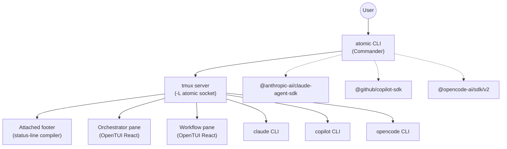
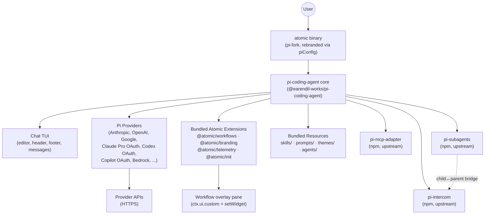

> **Scope note**: this is Spec 2 of 2. **Spec 1 is `specs/2026-05-11-pi-workflows-extension.md`** and covers the publishable `pi-workflows` npm package — its internal design, slash commands, executor, persistence, sibling integrations, builtin workflows. **All of that is out of scope here.** This Spec 2 covers Atomic-specific concerns: the pi-coding-agent fork, bundled content (skills, prompts, themes, sub-agents, MCP server configs), Atomic-side glue extensions, CLI surface, install/update/first-run, CI/CD. The two specs are developed in succession: Spec 1 first (testable against any installed pi binary), Spec 2 second (consumes Spec 1's npm artifact).


| Document Metadata      | Details                                                                                                                                                                                                                                                                                 |
| ---------------------- | --------------------------------------------------------------------------------------------------------------------------------------------------------------------------------------------------------------------------------------------------------------------------------------- |
| Author(s)              | Norin Lavaee                                                                                                                                                                                                                                                                            |
| Status                 | Draft (WIP)                                                                                                                                                                                                                                                                             |
| Team / Owner           | Atomic                                                                                                                                                                                                                                                                                  |
| Created / Last Updated | 2026-05-11                                                                                                                                                                                                                                                                              |
| Research Inputs        | `research/docs/2026-05-11-pi-coding-agent-reference.md`, `research/docs/2026-05-11-pi-mcp-adapter-and-subagents.md`, `research/docs/2026-05-11-atomic-codebase-inventory.md`, `research/docs/2026-05-11-map-the-entire-atomic-cli-codebase.md` (deep-research-codebase workflow output) |
| Related Specs          | `specs/2026-03-18-atomic-v2-rebuild.md`, `specs/2026-02-05-pluggable-workflows-sdk.md`, `specs/2026-05-08-workflow-pane-offload-and-resume.md`, `specs/2026-02-11-workflow-sdk-implementation.md`                                                                                       |

---

## 1. Executive Summary

This document specifies the **full rewrite of Atomic** as a fork of [`@earendil-works/pi-coding-agent`](https://www.npmjs.com/package/@earendil-works/pi-coding-agent). After the rewrite, `atomic` is a single-process chat TUI invoked by the `atomic` command — structurally identical to `pi` but rebranded — extended by a curated set of **bundled extensions, skills, prompt templates, themes, and agent definitions** owned by this repo.

### Conceptual framing

**Atomic's headline contribution is a new pi extension: `pi-workflows`.** Structurally and architecturally, `pi-workflows` is the **direct sibling of `pi-subagents`** (and `pi-mcp-adapter`, `pi-intercom`). All four follow the same pattern: a self-contained pi extension that adds a major capability (sub-agents, MCP, intercom, workflows) to vanilla pi, distributed as an npm package, installed via pi's package manager.

```
pi-subagents     adds: delegated child agents       → registers `subagent` tool
pi-mcp-adapter   adds: MCP server proxy              → registers `mcp` tool
pi-intercom      adds: parent↔child coordination     → registers `intercom`/`contact_supervisor`
pi-workflows     adds: multi-stage workflow runs     → registers `workflow` tool
```

**We publish `pi-workflows` to npm under our account.** Any pi user — not just Atomic users — can `pi install npm:pi-workflows` and get the same workflow capability. Atomic just ships with `pi-workflows` declared in its default `packages: [...]` so users get it without thinking. The `defineWorkflow(...)` authoring API and the runtime extension live in the same npm package, mirroring how `pi-subagents` exports both the extension default and its types.

This framing matters: there is nothing Atomic-proprietary about workflows. The Atomic repo's contribution is (a) the rebrand fork of pi-coding-agent and (b) the `pi-workflows` extension (plus bundled skills/prompts/themes/agents/MCP-server-configs). Both are pi-native artifacts the broader pi community could adopt.

### Packaging model at a glance

| Artifact                          | Lives where                          | Distributed how                                                |
| --------------------------------- | ------------------------------------ | -------------------------------------------------------------- |
| `pi-workflows` extension          | `packages/pi-workflows/` in our repo | **Published to npm** as `pi-workflows`. Anyone can install.    |
| `pi-mcp-adapter` (the framework)  | `nicobailon/pi-mcp-adapter` upstream | Consumed from npm; declared in Atomic's default `packages:`.   |
| `pi-subagents` (the framework)    | `nicobailon/pi-subagents` upstream   | Consumed from npm; declared in Atomic's default `packages:`.   |
| `pi-intercom` (the framework)     | `nicobailon/pi-intercom` upstream    | Consumed from npm; declared in Atomic's default `packages:`.   |
| **Skills** (curated SKILL.md set) | `packages/atomic/skills/`            | **Bundled into the atomic binary.** Loaded via `pi.skills` manifest. Not separately publishable. |
| **MCP server configs** (curated)  | `packages/atomic/mcp-servers/` (seeded into `~/.atomic/agent/mcp.json` on first run) | **Bundled into the atomic binary.** Default servers pi-mcp-adapter then loads. |
| **Sub-agent definitions**         | `packages/atomic/agents/`            | **Bundled into the atomic binary.** Discovered by pi-subagents. |
| **Prompt templates**              | `packages/atomic/prompts/`           | **Bundled into the atomic binary.** Loaded via `pi.prompts`.    |
| **Themes**                        | `packages/atomic/themes/`            | **Bundled into the atomic binary.** Loaded via `pi.themes`.     |
| Atomic-side glue extensions       | `packages/atomic/extensions/`        | **Bundled into the atomic binary.** Loaded via `pi.extensions`. |

The rule: **the runtime mechanisms (workflow runtime, MCP adapter, subagent dispatcher, intercom)** travel as npm packages so any pi user can adopt them; **the curated content** (skills, MCP server lists, agent definitions, prompts, themes) ships inside Atomic itself. A user installing plain `pi` plus `pi-workflows`/`pi-mcp-adapter`/etc. gets the runtime but none of Atomic's curation — that's the differentiation.

### Clean-slate posture — empty repo at Phase 1

**This is a clean-slate rewrite from an empty repo.** Spec 1 (`pi-workflows-extension.md`) §2.4 mandates a single git wipe commit before Phase A of Spec 1: everything under the repo root is deleted except `docs/`, `specs/`, `research/`, `README.md`, `LICENSE`, `CHANGELOG.md`, `AGENTS.md`/`CLAUDE.md`, `.gitignore`, `.editorconfig`. **That same wipe applies to Spec 2.** When Phase 1 of this spec begins, the working tree contains:

- The kept documentation set above.
- `packages/pi-workflows/` (produced by Spec 1).
- A minimal root `package.json` + `bunfig.toml` + `tsconfig.json` (produced by Spec 1, scoped to pi-workflows; this spec extends them).

Nothing else. No `packages/atomic/`, no `packages/atomic-sdk/`, no `.github/workflows/`, no `install.*` scripts, no `tests/`, no `scripts/`, no `rest-api/`, no `assets/`, no `.devcontainer/`, no `bun.lock`, no `.atomic/`/`.claude/`/`.opencode/`/`.github/agents/`/`.agents/`. The v0.x version is preserved at the `v0.x-archive` tag in git history and **read only via `git show <ref>:path`** when a cross-reference is needed for design intent — it is never present as files in the working tree of the new branch.

This means **every file path mentioned in this spec under `packages/atomic/...`** refers to a file that does not yet exist; it's a target for creation, not a target for edit. Where the spec previously had "Survives, edited" language for v0.x file paths, those paths are now creation targets for v1 — the v0.x file of the same name in `git show v0.x-archive:...` is design reference only.

Concretely:
- No backwards compatibility with v0.x at any level (filesystem layout, CLI surface, SDK import paths, on-disk state, workflow status format, settings schema).
- No `atomic init --migrate` script. Users on v0.x install fresh; we do not promise to bring over any v0.x state.
- No "survives," "edited," "moves" language in the design — every file in the new tree is greenfield.
- Cross-references to v0.x paths are git-history pointers, not file pointers. Anyone reading the spec should expect `git show v0.x-archive:packages/atomic-sdk/src/...` as the way to access them.

The four current external dependencies that justify roughly 65–70% of Atomic's source code today — **tmux**, **Claude Code/Claude Agent SDK**, **GitHub Copilot CLI/SDK**, and **OpenCode CLI/SDK** — are removed in their entirety. In their place, Atomic uses pi's first-class provider support (Anthropic API + Claude Pro OAuth, OpenAI API + Codex OAuth, GitHub Copilot OAuth, plus the dozens of other providers pi ships with) for all model access, and uses pi's TUI overlay/widget primitives instead of tmux panes for orchestration UI.

The workflow system is rebuilt as a **native pi extension** (`@atomic/workflows`). The current "workflow orchestrator pane" — a separate tmux pane with its own selector UI — becomes a **dynamically spawned overlay pane inside the chat TUI**, summoned by a native workflow tool that the model can call directly. The current `atomic workflow <name>` CLI command remains as a thin wrapper that sends a programmatic workflow request into a running (or auto-started) Atomic session.

MCP support, sub-agent support, and parent↔child coordination are consumed directly from npm as the upstream `pi-mcp-adapter`, `pi-subagents`, and `pi-intercom` packages (all authored by `nicobailon`), declared in pi's `packages: [...]` settings and lazy-installed by pi's package manager on first launch. **No vendored forks** of these packages live in the Atomic monorepo. If specific upstream blockers force action (e.g., pi-mcp-adapter issue #91), the escape hatches are: (a) npm `overrides` to redirect a transitive dep, (b) upstream contribution + temporary patch via `patch-package`, (c) only as a last resort, a fork.

**The only package this repo directly forks is `@earendil-works/pi-coding-agent`** (renamed to `packages/atomic/` and rebranded via `piConfig`). Every other dependency — `pi-ai`, `pi-agent-core`, `pi-tui`, `pi-mcp-adapter`, `pi-subagents`, `pi-intercom` — is an ordinary npm dependency, vendored only if a specific blocker forces it.

**Hard rule: the only reason we fork pi-coding-agent is to apply the rebrand.** The fork's delta from upstream is the `package.json` (rename the package, swap the `bin` mapping, set `piConfig`, declare the `pi.*` manifest pointing at our bundled resources, update top-level deps). **No TypeScript or other source files inside the forked package are modified.** Every Atomic-specific behavior is delivered through pi's documented surfaces: bundled extensions, skills, prompt templates, themes, agent defs, and `settings.json`. If we hit a gap where pi's extension API doesn't reach, we **contribute the missing API upstream** rather than patching the fork.

The net effect is a smaller, faster, single-process Atomic with a much simpler mental model: one process, one TUI, one auth surface, many bundled extensions.

---

## 2. Context and Motivation

### 2.1 Current State

Today Atomic is a multi-process tmux harness over three external coding agent CLIs. The architecture is:



**Key load-bearing concepts in the current architecture** (per `research/docs/2026-05-11-atomic-codebase-inventory.md` §"Load-Bearing Concepts"):

1. `WorkflowDefinition` / `defineWorkflow` builder (`packages/atomic-sdk/src/define-workflow.ts`).
2. `ctx.stage()` DAG execution with `GraphFrontierTracker` topology inference (`packages/atomic-sdk/src/runtime/graph-inference.ts`).
3. Workflow registry keyed by `${agent}/${name}` (`packages/atomic-sdk/src/registry.ts`).
4. Per-agent EventBus stream model (Claude `fs.watch` + Stop hook; Copilot SDK async iterator; OpenCode synchronous response body).
5. `AskUserQuestion` HIL DSL node implemented via Claude PreToolUse/PostToolUse hooks + `~/.atomic/claude-ask/<session_id>` marker file.
6. `OffloadManager` for workflow-pane offload/resume (tmux window kill + `metadata.json` persistence + `--resume` rehydration).
7. Tmux socket isolation (`-L atomic`).
8. Launcher script pattern (`.sh`/`.ps1` temp files for safe arg quoting).
9. Embedded asset tarballs (`.claude.tar`, `.opencode.tar`, `.github.tar`, `skills.tar`).
10. Auto-dispatch side-effect (`packages/atomic-sdk/src/lib/auto-dispatch.ts` intercepts `_orchestrator-entry` and `_cc-debounce`). **Gone after rewrite — no hidden subcommands.**
11. `hostLocalWorkflows()` / `ExternalWorkflow` dispatch protocol. **Gone after rewrite — workflows are loaded by direct SDK module import; no CLI envelope, no dispatch token.**
12. `PanelStore` Zustand-lite pub/sub. **After rewrite — degenerates to a plain in-extension mutable object** (no cross-process IPC; the chat TUI and the workflow extension share one process).
13. `~/.atomic/sessions/<runId>/status.json` snapshot file (IPC channel from orchestrator pane to CLI). **After rewrite — gone as source of truth.** Workflow state lives in the session JSONL via `pi.appendEntry` (§5.4.6). The CLI's `atomic workflow status` reads session JSONLs via `SessionManager.listAll()`. A small derived `status.json` may be opt-in for low-latency CI polling.
14. Settings JSON merge with user precedence (`syncJsonFile`). **Gone after rewrite — pi merges its own settings, and the multi-vendor write targets (`.claude/`, `.opencode/`, `.github/`) are all deleted.**
15. `CustomWorkflowEntry` bootstrap (spawns external commands with `_emit-workflow-meta`). **Gone — custom workflows are imported directly via the SDK.**
16. Ctrl+C debounce via tmux.conf hook.
17. Attached footer status-line via JSX → tmux format string compiler.
18. `GraphFrontierTracker` topology inference.

### 2.2 Problems with the Current State

| Concern                        | Description                                                                                                                                                                                                                                                                                                           |
| ------------------------------ | --------------------------------------------------------------------------------------------------------------------------------------------------------------------------------------------------------------------------------------------------------------------------------------------------------------------- |
| **Distribution surface**       | Atomic must ship for 8 platforms × tmux/psmux × 3 agent CLIs × multiple package managers. The `install.sh` alone bootstraps tmux from GitHub releases. The compiled binary embeds `.claude.tar`/`.opencode.tar`/`.github.tar`/`skills.tar` tarballs.                                                                  |
| **Process explosion**          | A single Atomic workflow run typically spawns: 1 tmux server, 1 orchestrator pane, 1+ workflow agent panes, 1 attached footer, plus the agent CLI(s) inside each pane. Each pane has its own session JSONL, hooks dir, and state.                                                                                     |
| **Vendor coupling**            | Three independent message-delivery and idle-detection mechanisms (Claude fs.watch + Stop hook; Copilot SDK iterator; OpenCode synchronous body). Adding a fourth provider is non-trivial. Removing any agent breaks ~30 files.                                                                                        |
| **HIL fragility**              | `AskUserQuestion` only works in Claude because it requires Claude's PreToolUse/PostToolUse hook. Stop-hook chaining for follow-up prompts is delicate (`~/.atomic/claude-stop/<session_id>` markers, JSON-block decisions). Per memory: "Claude follow-up prompts go through the Stop hook."                          |
| **Tmux gravity**               | Tmux is the IPC bus, the multiplexer, the keystroke router, AND the destination terminal. ~45–50% of source files exist to wrangle it (per inventory deletion blast radius). `cc-debounce`, `attached-footer`, `runtime-assets`, port-discovery race fix, dirty-pane fixes — all tmux-specific.                       |
| **Config sync sprawl**         | Atomic syncs `.claude/`, `.opencode/`, `.github/` config dirs on every chat preflight via `syncJsonFile()` with deep-merge user-precedence rules. Skills are duplicated to `~/.agents/skills` and `~/.claude/skills`. MCP server enable/disable is toggled across three independent agent JSON files (`scm-sync.ts`). |
| **Workflow UI dualism**        | The workflow orchestrator pane is a fully separate OpenTUI app with its own `CliRenderer`, picker UI, keyboard nav, and graph layout. It exists OUTSIDE the chat TUI. Users must context-switch via `prefix+arrows` or `atomic workflow session connect`.                                                             |
| **CI/devcontainer complexity** | Three devcontainer features, three GitHub workflows for Claude/Copilot CI integration, three publish-features pipelines.                                                                                                                                                                                              |

### 2.3 Why pi-coding-agent

Pi (`@earendil-works/pi-coding-agent`) is a minimal, opinionated single-process coding TUI explicitly designed to be **forked and extended** for "your" coding agent (`docs/development.md` documents `piConfig` in `package.json` as the rebrand seam). It ships built-in:

- A chat TUI with editor, header, footer, message rendering, syntax highlighting, markdown, image, and overlay support (`docs/tui.md`).
- 7 default tools (`read`, `bash`, `edit`, `write`, `grep`, `find`, `ls`).
- JSONL session tree with branching, `/tree`, `/fork`, `/clone`, auto-compaction.
- The Agent Skills standard (`/skill:name`, SKILL.md, skill discovery roots).
- Markdown prompt templates with `$1..$@` interpolation.
- Theme system with hot reload (51 color tokens).
- 20+ providers built-in (Anthropic API, OpenAI API, Google, Azure, Bedrock, Vertex, plus all three OAuth flows we currently use: Claude Pro/Max, ChatGPT Plus/Pro/Codex, GitHub Copilot).
- A complete extension API: `pi.registerTool`, `pi.registerCommand`, `pi.registerShortcut`, `pi.registerFlag`, `pi.registerProvider`, `pi.registerMessageRenderer`, full lifecycle event bus (`session_start`, `tool_call`, `before_agent_start`, etc.), `ctx.ui.custom` for overlays, `ctx.ui.setWidget` for above/below-editor widgets, `ctx.ui.setFooter`/`setHeader`, `pi.sendUserMessage`, `pi.sendMessage`, `ctx.newSession`, `ctx.fork`, full session/runtime/auth/model SDK.
- RPC mode (JSONL over stdin/stdout) and JSON event mode for external integration.

Critically, pi explicitly does **not** ship MCP, sub-agents, plan mode, to-dos, permission popups, or background bash. Each is built as an extension. Our rewrite leans on this: anything Atomic-specific lives as a bundled extension; everything chat-TUI-shaped is pi.

The DOOM-overlay reference extension proves overlays support 35 FPS dynamic UI. The `examples/extensions/subagent/` reference proves spawning streaming JSONL subprocesses into a custom-rendered tool works. The `examples/extensions/plan-mode/` reference proves long-running, persistent-state, restore-on-resume modes work. Combined, these primitives give us everything the "workflow orchestrator pane inside the chat TUI" needs.

---

## 3. Goals and Non-Goals

### 3.1 Functional Goals

- [ ] **Atomic ships as a single rebranded fork of pi-coding-agent**, with `atomic` CLI binary, `~/.atomic/agent/` config root, `ATOMIC_CODING_AGENT_DIR` env var, and the Atomic banner/theme.
- [ ] **All bundled resources (skills, prompts, themes, agent definitions, extensions) live in the Atomic monorepo** and are loaded via pi's package manifest mechanism (`pi` key in `package.json` plus convention dirs).
- [ ] **A native `workflow` tool**, registered by the **`pi-workflows` extension** (published as an npm package; sibling of `pi-subagents`/`pi-mcp-adapter`/`pi-intercom`), is callable by the model OR by the user via `/workflow <name>` slash command. Calling it spawns a workflow orchestrator overlay inside the chat TUI (no separate pane, no separate selector UI, no tmux). Atomic ships `pi-workflows` declared in default `packages: [...]`; any plain-pi user can also `pi install npm:pi-workflows` to get the same capability.
- [ ] **The CLI command `atomic workflow [-n name] [-a agent]` keeps working** as a backward-compatible thin wrapper. With a TTY and no running Atomic session it auto-starts one; with a running Atomic session it sends a programmatic workflow request via RPC. The `--agent` flag is preserved but resolves to a pi provider+model selection (no longer claude/copilot/opencode toggle).
- [ ] **All current builtin workflows survive** in pi-extension shape: `deep-research-codebase`, `open-claude-design`, `ralph`. Each becomes a single workflow definition (no per-agent variants) that uses pi's model+provider settings.
- [ ] **Custom workflows in `.atomic/workflows/` and `settings.json` workflows map** are loaded by **direct SDK module import** — no hidden CLI subcommands, no metadata-emission protocol, no dispatch token. Each custom workflow file `export default`s a `WorkflowDefinition` produced by `defineWorkflow(...).compile()`.
- [ ] **MCP support ships via the upstream `pi-mcp-adapter` npm package**, declared in pi's `packages: [...]` settings and auto-installed by pi on first run. All current `.claude/.mcp.json` MCP server entries are migratable via the adapter's existing `/mcp setup` importer.
- [ ] **Sub-agent support ships via the upstream `pi-subagents` npm package**, same install mechanism. Current `.claude/agents/` directory contents are migratable to pi-subagents' markdown+frontmatter format.
- [ ] **Parent↔child coordination ships via the upstream `pi-intercom` npm package** (pi-subagents' [optional companion](https://github.com/nicobailon/pi-subagents/tree/main#optional-pi-intercom-companion)). Without it, sub-agents are fire-and-forget; with it, child agents get a private channel back to the parent (`contact_supervisor` tool) for blocking decisions, clarifications, and meaningful progress updates — critical for long-running background work. Declared in `packages: [...]`, auto-installed on first run.
- [ ] **MCP, sub-agent, and intercom extensions cooperate** within Atomic via `pi.events` from a small Atomic-side glue extension (`extensions/integrations/`). Specifically: shared MCP server pool, parent permission inheritance into children, and intercom message routing. No patching of upstream packages.
- [ ] **Self-install / self-update / completions / telemetry continue to function** using the existing GitHub Releases pipeline.
- [ ] **`atomic init` continues to seed AGENTS.md and project conventions**, but writes to `.atomic/` rather than `.claude/`, `.opencode/`, `.github/`.
- [ ] **Workflow status / read / refresh / inputs / session commands** keep working — but session subcommands lose their tmux-specific capabilities (`session connect` is no longer meaningful in a single-process TUI; see Open Question 9.7).

### 3.2 Non-Goals (Out of Scope)

- [ ] **No backwards compatibility with v0.x at any level.** The current `packages/atomic/` and `packages/atomic-sdk/` are deleted wholesale before Phase 1 begins. No code is migrated, no import paths are preserved, no on-disk state is read by the new binary, no migration script exists. Users on v0.x install fresh.
- [ ] **No `atomic init --migrate`** script. The previous draft of this spec included one; it's removed. The previous-impl files cited throughout this spec are git-history references for design intent, not migration sources.
- [ ] **No backward compatibility with existing on-disk workflow run dirs from `~/.atomic/sessions/<runId>/`.** Pi's session JSONL under `~/.atomic/agent/sessions/` is the new state location; the previous directory layout is abandoned without a reader.
- [ ] **No migration of in-progress tmux workflow sessions.** A user upgrading from v0.x with running workflow sessions loses them on upgrade.
- [ ] **No multi-pane terminal UX.** All Atomic UI is delivered through pi's chat TUI — overlays, widgets, header, footer. Users who want tmux can run Atomic inside tmux; we no longer manage tmux for them.
- [ ] **No support for the Claude Code, GitHub Copilot CLI, or OpenCode CLI as model backends.** Their subscription OAuth flows continue to work via pi's built-in OAuth providers (Claude Pro/Max, ChatGPT/Codex, Copilot), but the Atomic process no longer spawns those CLIs.
- [ ] **No reimplementation of `cc-debounce`**, the attached footer status-line compiler, or any other tmux-specific infrastructure.
- [ ] **No support for `atomic chat` as a separate command.** The default `atomic` invocation IS the chat TUI (mirroring pi's CLI). `atomic chat` may remain as an alias (see Open Question 9.6).
- [ ] **No support for the legacy `~/.claude/`, `~/.opencode/`, `~/.github/` config sync.** Atomic init writes only `~/.atomic/` and `.atomic/`. Users who want their existing skills available add them via `settings.json` `skills: [...]` paths (pi supports cross-vendor skill roots officially).
- [ ] **No new devcontainer features.** The three current per-agent features are deleted.

---

## 4. Proposed Solution (High-Level Design)

### 4.1 Target System Architecture



Everything runs in **one process**. No tmux. No spawned agent CLIs. Sub-agent spawning (via the upstream `pi-subagents` package) launches child `atomic` processes for context isolation, exactly as pi-subagents does today.

### 4.2 Architectural Pattern

**Single-package pi fork + `pi-workflows` as a first-party pi extension + npm deps for everything else**, per pi's officially documented fork recipe (`docs/development.md:24-35` in pi's repo). The Atomic monorepo forks **only** `@earendil-works/pi-coding-agent` into `packages/atomic/`; all third-party pi extensions (`pi-mcp-adapter`, `pi-subagents`, `pi-intercom`) are consumed from npm; **`pi-workflows` lives in `packages/pi-workflows/` and is published to npm alongside its consumers** (Atomic plus anyone in the pi ecosystem). The monorepo also adds `skills/`, `prompts/`, `themes/`, and `agents/` directories that the forked pi-coding-agent auto-discovers via its `pi.*` manifest.

The workflow orchestrator becomes a **single extension** (`pi-workflows/`) that exposes:
1. A `workflow` tool (the model can invoke `workflow({name, inputs})`).
2. A `/workflow [name] [args]` slash command (humans).
3. A workflow-results overlay (`ctx.ui.custom`).
4. A persistent above-editor widget for ongoing runs (`ctx.ui.setWidget`).
5. Session-persistent run state via `pi.appendEntry` (custom entry type).

### 4.3 Key Components

| Component                             | Responsibility                                                                                                                                                                                    | Technology / Origin                                           | Justification                                                                                               |
| ------------------------------------- | ------------------------------------------------------------------------------------------------------------------------------------------------------------------------------------------------- | ------------------------------------------------------------- | ----------------------------------------------------------------------------------------------------------- |
| `packages/atomic` (root)              | The forked `@earendil-works/pi-coding-agent` CLI package, rebranded via `piConfig`. Provides the `atomic` binary. Depends on upstream `pi-ai`, `pi-agent-core`, `pi-tui` via npm.                 | Bun + TypeScript                                              | Hybrid strategy (Q1): minimal fork surface; `piConfig` requires forking the CLI's own package.json.         |
| `pi-workflows/`               | Native workflow tool, overlay pane, slash command, status writer, custom entry persistence.                                                                                                       | pi extension API (`registerTool`, `ui.custom`, `appendEntry`) | Replaces 65–70% of the current Atomic SDK (executor.ts, orchestrator-panel, workflow-picker, tmux runtime). |
| ~~`extensions/branding/`~~ (deferred) | **Not in v1** (Q8). Pi's `piConfig.name` auto-reflows the banner. A custom branding extension is deferred until we want the gradient block-logo back.                                             | n/a                                                           | Reduces v1 scope; piConfig is sufficient for identity.                                                      |
| `extensions/telemetry/`               | Anonymous install/update telemetry, opt-in tool-use telemetry.                                                                                                                                    | pi extension API (`on(agent_end)`, `pi.events`)               | Reuses existing telemetry-backend (`rest-api/`); decouples from pi's own update-check flow.                 |
| `extensions/init/`                    | `/init` slash command equivalent of `atomic init` for in-TUI bootstrap; writes `.atomic/` configs.                                                                                                | pi extension API (`registerCommand`)                          | Lets users onboard a project without leaving the TUI; deprecates the standalone `atomic init` CLI command.  |
| `skills/`                             | Bundled SKILL.md skills (the existing 170+ skills, curated).                                                                                                                                      | Agent Skills standard, pi-loaded                              | Pi auto-discovers from convention dir or `pi.skills` manifest.                                              |
| `prompts/`                            | Bundled markdown prompt templates.                                                                                                                                                                | Pi prompt-template loader                                     | Replaces our current per-agent prompt directories.                                                          |
| `themes/`                             | Atomic dark + light themes (Catppuccin-derived).                                                                                                                                                  | Pi theme JSON format (51 tokens)                              | Pi hot-reloads active themes; we get free dev UX.                                                           |
| `agents/`                             | Default sub-agent markdown files (orchestrator, worker, reviewer, planner, scout, etc.).                                                                                                          | pi-subagents discovery roots                                  | Same format pi-subagents already loads from `~/.pi/agent/agents/`.                                          |
| `pi-mcp-adapter` (npm, upstream)      | MCP support. Declared in pi's `packages: [...]` settings; pi auto-installs from npm on first run.                                                                                                 | TypeScript, `@modelcontextprotocol/sdk`                       | No vendored fork — `pi-coding-agent` is the only direct fork. Upstream issues escape via `overrides`/`patch-package`. |
| `pi-subagents` (npm, upstream)        | Sub-agent support. Declared in pi's `packages: [...]` settings; pi auto-installs from npm on first run.                                                                                           | TypeScript                                                    | Same posture.                                                                                              |
| `pi-intercom` (npm, upstream)         | Parent↔child coordination channel. Optional companion to pi-subagents; pi-subagents auto-detects it and exposes `contact_supervisor` to children for blocking decisions, clarifications, and meaningful progress updates. Declared in `packages: [...]`. | TypeScript                                                    | Same posture.                                                                                              |
| `extensions/integrations/`            | Tiny Atomic-side glue that wires `pi-mcp-adapter` ↔ `pi-subagents` ↔ `pi-intercom` together via `pi.events` (shared MCP server pool, parent permission inheritance, workflow-stage server toggling, intercom routing, attention surfacing), without patching any upstream package. | pi extension API                                              | Cross-cutting wins without owning the upstream packages.                                                    |
| ~~`packages/atomic-sdk`~~ (superseded) | **Deprecated.** Contents migrate into `packages/pi-workflows/src/` (extension runtime + public authoring API in one publishable npm package, mirroring pi-subagents). External authors swap `import { defineWorkflow } from "@bastani/atomic-sdk"` → `... from "pi-workflows"`. | n/a                                                            | Consolidating SDK + extension into one publishable npm package matches pi-subagents'/pi-mcp-adapter's posture exactly.   |

---

## 5. Detailed Design

This section is hierarchical. Each subsection corresponds to one component / migration concern. Each subsection has its own goals, files-affected list, design, and risks.

### 5.1 Fork & Rebrand

#### Goal
Produce an `atomic` binary that IS pi-coding-agent with Atomic identity, config paths, and env var prefix.

#### Fork-scope rule (decided)

**The fork exists solely to apply the rebrand.** Everything else uses pi's built-in functionality.

The forked `packages/atomic/` differs from upstream `packages/coding-agent/` ONLY in `package.json`:
- `name`: `"@earendil-works/pi-coding-agent"` → `"atomic"`.
- `bin`: `{ "pi": "..." }` → `{ "atomic": "..." }`.
- `piConfig`: `{ "name": "atomic", "configDir": ".atomic" }`.
- `pi.*` manifest pointing at `./extensions`, `./skills`, `./prompts`, `./themes` (our bundled resources).
- Top-level `dependencies`: trim what we don't need; add `jiti` (closes pi-subagents upstream issue #157 without forking that package).
- `version`: independent of upstream.

**Zero TypeScript files inside the forked package are edited.** All Atomic behavior is delivered via pi's documented surfaces (extensions, skills, prompts, themes, agents, `settings.json`, `pi.events`). If extension API surface is insufficient, we contribute a PR upstream instead of patching the fork. This rule is enforced by a CI check (`bun run check-fork-purity`) that fails if any file under `packages/atomic/src/**` or `packages/atomic/**/*.ts` is modified.

#### Mechanism
Per pi `docs/development.md`:

```jsonc
// packages/atomic/package.json
{
  "name": "atomic",
  "version": "...",
  "bin": { "atomic": "./bin/atomic" },
  "piConfig": {
    "name": "atomic",
    "configDir": ".atomic"
  },
  "pi": {
    "extensions": ["./extensions"],
    "skills": ["./skills"],
    "prompts": ["./prompts"],
    "themes": ["./themes"]
  }
}
```

This single block produces:
- Binary name: `atomic`.
- CLI banner: "atomic".
- Global config dir: `~/.atomic/agent/` (replaces `~/.pi/agent/`).
- Project config dir: `.atomic/` (replaces `.pi/`).
- Env var prefix: `ATOMIC_*` (replaces `PI_*`). So `PI_CODING_AGENT_DIR` becomes `ATOMIC_CODING_AGENT_DIR`, `PI_OFFLINE` becomes `ATOMIC_OFFLINE`, etc.
- Cross-vendor skill dirs (`~/.claude/skills`, `~/.codex/skills`) remain officially supported via the `skills:` array.

#### Fork strategy: only pi-coding-agent (decided)

**Decided** (Q1, refined per user request): `@earendil-works/pi-coding-agent` is the **only** package this repo directly forks. Everything else — `pi-ai`, `pi-agent-core`, `pi-tui`, plus third-party pi extensions like `pi-mcp-adapter` and `pi-subagents` — is consumed as an ordinary npm dependency. Vendor a package as a fork **only if** a specific blocker forces it (rule: "only vendor deps in pi if you have to").

Why only pi-coding-agent:
- The `piConfig` rebrand (`{ piConfig: { name, configDir } }` in `package.json`) MUST live in the CLI package's own `package.json`. `npm install` would overwrite consumer-side changes. **This is the only reason we fork at all.**
- The deeper libs (`pi-ai`, `pi-agent-core`, `pi-tui`) are stable, semver-respecting, and consumed via standard npm semver.
- Third-party pi extensions (`pi-mcp-adapter`, `pi-subagents`) are not pi core; they're installed at runtime by pi's package manager. We don't need source-level access to ship them.
- Smaller fork surface = easier rebases, less maintenance debt. Since the fork delta is `package.json`-only, **rebases against upstream are mechanical** — `git merge upstream/main` on the source tree should never conflict (our changes don't touch any of the files pi authors edit).

Escape hatches when we **must** patch something we don't fork:
- **npm `overrides` / `resolutions`** in our root `package.json` redirect a transitive dependency (e.g., redirect pi-mcp-adapter's deprecated `@mariozechner/pi-ai` → `@earendil-works/pi-ai` until upstream issue #91 lands).
- **`patch-package`** applies a tracked patch on `npm install` for tiny localized fixes.
- **Upstream contribution**: open a PR against the source repo; drop our patch once accepted.
- **As a last resort**: vendor that one package as a fork, with a `FORK_REASON.md` documenting why and what would let us un-vendor.

#### Upstream rebase cadence (decided)

**Decided** (Q5): weekly automated rebase attempt. A scheduled GitHub Action runs every Monday:
1. `git remote add upstream https://github.com/earendil-works/pi-mono` (if not present).
2. `git fetch upstream && git checkout -b rebase/upstream-YYYY-MM-DD`.
3. Cherry-pick the latest upstream `packages/coding-agent/**` changes onto our forked `packages/atomic/`.
4. Re-apply our `package.json` rebrand delta on top (a tiny patch file `packages/atomic/PACKAGE_JSON_REBRAND.patch` is kept in the repo and applied during rebase).
5. Run `bun typecheck && bun test && bun run check-fork-purity`.
6. Open a PR if the rebase + tests succeed; otherwise post a comment with the conflict for human resolution.

Because the fork delta is package.json-only, step 4 is the only point where conflicts are possible — and conflicts there only happen if upstream restructures their own package.json. Source-code rebases are conflict-free by construction.

#### Files affected
- **Edited (the entire rebrand surface)**: `packages/atomic/package.json` — change `name`, `bin` mapping, add `piConfig` block, add `pi.*` manifest, trim deps + add `jiti`. Plus `packages/atomic/PACKAGE_JSON_REBRAND.patch` (the diff file applied during upstream rebases). The bin script file itself is reused from upstream verbatim (only the `bin` map key changes).
- **Untouched in the fork**: every `packages/atomic/src/**/*.ts`, every test, every README inside the package. Source-code purity enforced by `check-fork-purity` CI script.
- **Removed**: `packages/atomic/bin/atomic` (current Node.js platform-resolver stub — replaced by pi's bin script).
- **Forked into the monorepo**: only `packages/atomic/` (the rebranded `pi-coding-agent` — from `earendil-works/pi-mono` `packages/coding-agent`). Nothing else.
- **Consumed as npm dependencies**: `@earendil-works/pi-ai`, `@earendil-works/pi-agent-core`, `@earendil-works/pi-tui`, `pi-mcp-adapter`, `pi-subagents` (latter two declared in pi's `packages: [...]` settings, installed at runtime by pi).
- **Renamed/migrated**: all `~/.atomic/sessions/` references in surviving Atomic code should now resolve under pi's `~/.atomic/agent/sessions/`.

#### Risks
- **Upstream drift**: pi ships frequent releases. We must establish a rebase cadence (see Open Question 9.5).
- **Forking commits the maintainer**: the fork is permanent, but the delta is package.json-only, so the ongoing cost is rebasing a single file weekly. Source-code rebases are conflict-free by construction.
- **Extension-API gaps**: if Atomic needs a hook pi doesn't yet expose, we MUST upstream the API addition rather than patch the fork. This may slow specific features. Mitigation: pi's extension surface is already very rich (`docs/extensions.md` is 96 KB); we've audited every Atomic concern in §5.4.10 and confirmed coverage.

---

### 5.2 Bundled Resources (skills / prompts / themes / agents)

#### Goal
All Atomic-curated content ships inside the Atomic binary, discoverable via pi's package mechanism. Users get the full experience after `atomic install`, no additional `pi install` steps.

#### Layout

```
packages/atomic/
├── extensions/                  # Atomic-owned extensions (see §5.4–5.7)
│   ├── workflows/
│   ├── branding/
│   ├── telemetry/
│   └── init/
├── skills/                      # SKILL.md skills
│   ├── tdd/SKILL.md
│   ├── impeccable/SKILL.md
│   ├── opentui/SKILL.md
│   └── ... (curated from current .agents/skills/)
├── prompts/                     # Slash-command prompt templates
│   ├── review.md
│   ├── refactor.md
│   └── ...
├── themes/                      # JSON themes (51 tokens each)
│   ├── atomic-dark.json
│   └── atomic-light.json
├── agents/                      # Sub-agent definitions discovered by upstream pi-subagents
│   ├── orchestrator.md
│   ├── worker.md
│   ├── reviewer.md
│   ├── planner.md
│   ├── scout.md
│   └── ...
└── package.json                 # piConfig + pi manifest
```

#### Discovery

Pi reads the `pi` key from `package.json`:
```json
{ "pi": { "extensions": ["./extensions"], "skills": ["./skills"], "prompts": ["./prompts"], "themes": ["./themes"] } }
```

pi-subagents discovers agents from project-local `.pi/agents/` / `.agents/` walking up from cwd. Under our `piConfig.configDir = ".atomic"` rebrand, that becomes `.atomic/agents/`. The Atomic binary's own root counts as a project root, so `packages/atomic/agents/*.md` is discovered automatically when running from within (or under) the Atomic source tree, and the bundle is also installed into `~/.atomic/agent/agents/` at first run for global discovery. **No upstream patching required.**

**Decided (Q2)**: legacy `.agents/skills/` and `~/.claude/skills/` are NOT auto-loaded. The user retains control of their own settings; Atomic's bundled skills come exclusively from this repo's `skills/` dir via the manifest. See §5.2 "Curation of skills".

#### Curation of skills (decided Q2 + Q3)

**Q2 — legacy paths**: Atomic does **NOT** auto-load `~/.agents/skills/` or `~/.claude/skills/` by default. Bundled skills are self-described via the project's `pi.skills` manifest pointing at `packages/atomic/skills/` — no on-disk copying to user roots, no settings entries pointing at user-owned dirs. This keeps user settings clean (no Atomic-imposed entries) and avoids duplicate-skill warnings.

**Q3 — curation rule**: Ship **everything** from the current `.agents/skills/` tree **EXCEPT**:
- Skills with frontmatter `metadata.internal: true` (project-internal skills not meant for general use).
- Provider/vendor-specific skills with prefixes `gh-*` (GitHub Copilot specific), `ado-*` (Azure DevOps), `sl-*` (Sapling).

A build-time script (`packages/atomic/script/curate-skills.ts`) reads each `SKILL.md` frontmatter and emits the curated subset into `packages/atomic/skills/`. The script runs in CI; the result is committed (so the build is reproducible and the curated set is visible in version control).

Users who want any excluded skill back: copy from the source repo or install a separate pi-package.

#### Files affected
- **New**: `packages/atomic/skills/`, `prompts/`, `themes/`, `agents/`.
- **Removed**: `packages/atomic/script/build-assets.ts` (the embedded asset tarball builder), `packages/atomic/script/bundle-configs.ts`, the embedded `.claude.tar`, `.opencode.tar`, `.github.tar`, `skills.tar` assets.
- **Removed**: `packages/atomic/src/services/system/skills.ts` (`installGlobalSkills` — pi handles discovery natively), `packages/atomic/src/services/system/agents.ts` (`installGlobalAgents`).

#### Risks
- **Skill duplication**: users with existing `~/.agents/skills` may see duplicate skill IDs. Pi warns on duplicates but does not error. Mitigation: clear migration docs (§5.13).

---

### 5.3 SDK Consolidation — `@bastani/atomic-sdk` → `pi-workflows`

#### Goal
**Supersede `@bastani/atomic-sdk` with `pi-workflows`.** Following the pi-subagents posture (one npm package exports both the extension `default` and the types/authoring helpers), `pi-workflows` exports:
- `default function (pi: ExtensionAPI)` — the pi extension entry point.
- `defineWorkflow(name)`, `createRegistry`, `validateInputs`, all surviving types — the authoring API external workflow authors `import` from.

External workflow files use `import { defineWorkflow } from "pi-workflows"`. There is no compat shim for `@bastani/atomic-sdk`; that name disappears with v0.x.

`packages/pi-workflows/src/` is written from scratch. The previous `packages/atomic-sdk/src/` is deleted; below is a cross-reference table mapping each new module to the previous-impl file that informed its design. **No code is copied** — each module is re-derived. The references exist so a future maintainer can read the v0.x file in git history and understand the design pedigree.

| New module (greenfield)                              | Cross-reference (v0.x, design inspiration only)                                                | What's being preserved                                                                                                                          |
| ---------------------------------------------------- | ---------------------------------------------------------------------------------------------- | ----------------------------------------------------------------------------------------------------------------------------------------------- |
| `pi-workflows/src/define-workflow.ts`                | `packages/atomic-sdk/src/define-workflow.ts`                                                   | Public authoring DSL shape: `defineWorkflow(name).for(model).run(fn).compile()`.                                                                |
| `pi-workflows/src/registry.ts`                       | `packages/atomic-sdk/src/registry.ts`                                                          | Immutable chainable registry (`createRegistry`, `register`, `upsert`).                                                                          |
| `pi-workflows/src/input-validation.ts`               | `packages/atomic-sdk/src/worker-shared.ts` + `src/primitives/inputs.ts`                       | Camel-case normalization, input schema validation, default application.                                                                          |
| `pi-workflows/src/errors.ts`                         | `packages/atomic-sdk/src/errors.ts`                                                            | Typed error class taxonomy (`MissingDependencyError`, `WorkflowNotCompiledError`, etc.).                                                        |
| `pi-workflows/src/types.ts`                          | `packages/atomic-sdk/src/types.ts`                                                             | Public type surface (`WorkflowDefinition`, `WorkflowContext`, `SessionContext`, etc.); claude/copilot/opencode-specific types do not reappear. |
| `pi-workflows/src/metadata.ts`                       | `packages/atomic-sdk/src/primitives/metadata.ts`                                               | Workflow metadata accessors.                                                                                                                     |
| `pi-workflows/src/runtime/graph-inference.ts`        | `packages/atomic-sdk/src/runtime/graph-inference.ts`                                           | `GraphFrontierTracker` topology inference (the key algorithm; re-derived but identical in spirit).                                              |
| `pi-workflows/src/runtime/status-writer.ts` (optional) | `packages/atomic-sdk/src/runtime/status-writer.ts`                                            | Optional opt-in `status.json` schema for CI polling. Primary state is session JSONL via `pi.appendEntry` (§5.4.6); status file is derived.    |
| `pi-workflows/src/overlay/layout.ts`, `connectors.ts`, `theme.ts`, `status-helpers.ts`, `color-utils.ts` | `packages/atomic-sdk/src/components/{layout,connectors,graph-theme,status-helpers,color-utils}.ts` | Graph layout math + status helpers, ported to pi-tui's component API.                                                                            |
| `pi-workflows/src/lib/common-ignore.ts`              | `packages/atomic-sdk/src/lib/common-ignore.ts`                                                 | Generic ignore filter for fs scans.                                                                                                              |
| `pi-workflows/src/lib/telemetry.ts`                  | `packages/atomic-sdk/src/lib/telemetry/index.ts`                                               | `TelemetrySink` interface + production sink wiring.                                                                                              |

**The v0.x files above are deleted along with the rest of `packages/atomic-sdk/`.** This is not an incremental refactor.

#### Constructs we consciously do not reproduce

The previous-impl modules below were load-bearing in v0.x but disappear entirely — they have no analog in the new architecture because pi handles the concern, the user-facing feature is gone, or we deliberately replace the mechanism. The pointers exist so a future maintainer doesn't reinvent them:

- `packages/atomic-sdk/src/runtime/executor.ts` (1800-line tmux-orchestrating executor) — replaced by an in-process executor inside `pi-workflows`.
- `packages/atomic-sdk/src/runtime/{tmux,attached-footer,cc-debounce,executor-env,offload-manager,offload-types,port-discovery,runtime-assets,orchestrator-entry,panel}.{ts,tsx}` and `packages/atomic-sdk/src/tui/**` (JSX→tmux compiler) — pi is a single-process TUI; nothing tmux-shaped survives.
- `packages/atomic-sdk/src/lib/{self-exec,spawn,auto-dispatch,host-local-workflows,dispatch-utils,merge}.ts` — no hidden subcommands; pi merges settings; tmux spawning is gone.
- `packages/atomic-sdk/src/providers/{claude,claude-stop-hook,claude-inflight-hook,copilot,opencode}.ts` — pi's provider abstraction handles all three plus 20+ others.
- `packages/atomic-sdk/src/components/{orchestrator-panel,session-graph-panel,node-card,header,compact-switcher,toast,edge,error-boundary,workflow-picker-panel,orchestrator-panel-store,orchestrator-panel-types,orchestrator-panel-contexts,renderer-background,tui-diagnostics}.tsx` — replaced by pi-tui-native primitives (`ctx.ui.custom` overlay + `setWidget` + `setStatus` + `registerMessageRenderer`).
- `packages/atomic-sdk/src/services/config/{scm-sync,additional-instructions,definitions}.ts` — multi-vendor config sync is gone (the vendors are gone).

The new top-level Atomic config concerns (Atomic-namespaced keys in pi's `settings.json`) are read inline by the few extensions that need them — there is no dedicated `atomic-config.ts` module. If a need emerges later, we add a small helper inside `packages/atomic/extensions/`.

#### Hidden subcommands — entirely removed

The rewrite eliminates **all** underscore-prefixed hidden subcommands. The current `lib/auto-dispatch.ts` (intercepts `_orchestrator-entry`, `_cc-debounce`), `lib/host-local-workflows.ts` (`_emit-workflow-meta`, `_atomic-run`), and `lib/dispatch-utils.ts` are all **deleted**.

Custom-workflow registration replaces the metadata-emission protocol with **direct SDK module import**. The workflow extension scans:
1. `.atomic/workflows/*.ts` (project-local, walked up from cwd).
2. `~/.atomic/agent/workflows/*.ts` (global).
3. Each entry in `settings.json` `atomic.workflows` map (`{ name: { path: "..." } }`).

For each file it does:

```ts
// pi-workflows/registry-loader.ts (sketch)
const mod = await import(absolutePath);              // jiti for TS, native for JS
const def = mod.default;                              // a WorkflowDefinition
assert(def && def.__atomicWorkflow === true);         // shape check
registry.upsert(def);
```

No subprocess. No CLI envelope. No dispatch token (the security model is "the user added this path to settings — they trust it," identical to pi's extension-loading posture). Bun and TS files load via `jiti` (already present as a runtime dep for pi-subagents per §5.7).

#### Public API stability (decided Q4)
The `defineWorkflow` and `createRegistry` **function signatures MUST NOT BREAK**, only the import path. External workflow authors depend on them; the rewrite changes their import from `@bastani/atomic-sdk` to `pi-workflows`. The signatures stay identical; the executor underneath is swapped wholesale.

**Decided (Q4)**: `runWorkflow()` and `RunWorkflowOptions` / `RunWorkflowResult` are **removed entirely** from the SDK's public API. The only ways to invoke a workflow after the rewrite:
1. `/workflow <name>` slash command inside the chat TUI.
2. `atomic workflow -n <name>` CLI command (which spawns a fresh `atomic -p` subprocess — see §5.9 + Q10).
3. The in-extension executor (callable from other extensions via `pi.events`).

External Node scripts that previously called `runWorkflow()` must shell out to `atomic workflow` (or use `atomic --mode json` for streamed events). This decision aligns with pi's posture of "extensions or shell-out, no third programmatic API."

The `primitives/run.ts` file is **deleted**.

---


### 5.4 Workflows: `pi-workflows` from npm (Spec 1)

**The entire workflow extension design lives in Spec 1** — `specs/2026-05-11-pi-workflows-extension.md`. That spec covers the `defineWorkflow` authoring API, the `workflow` tool, slash commands, DAG executor, overlay/widget UI, session-entry persistence, integration with pi-subagents/pi-mcp-adapter/pi-intercom, builtin workflows, and the npm-publish path. Read it first.

From Atomic's perspective in this spec, the relevant facts are:

1. **`pi-workflows` is consumed from npm.** Atomic does not author or vendor it. It's an upstream-from-our-account package (we publish it as part of Spec 1's deliverable, but the published artifact is the dependency for this Atomic spec).
2. **Atomic declares it in default `packages: [...]`** (see §5.11 settings + §5.16 first-run bootstrap) alongside `pi-mcp-adapter`, `pi-subagents`, and `pi-intercom`.
3. **Atomic's `atomic workflow [-n name] ...` CLI command** is a thin wrapper that spawns `atomic -p --workflow=<name>` and lets `pi-workflows`' CLI flag handler take over (see §5.9 CLI surface).
4. **The Atomic-side integration glue extension** (`extensions/integrations/`, see §5.5) wires `pi-workflows` ↔ `pi-mcp-adapter` ↔ `pi-subagents` ↔ `pi-intercom` via `pi.events`, without patching any upstream package.
5. **No Atomic-shipped workflow definitions in this repo's `packages/atomic/`.** Builtin workflows (`deep-research-codebase`, `ralph`, `open-claude-design`) ship inside the `pi-workflows` package per Spec 1. Atomic users who want a curated set get them by virtue of the bundled `packages: [npm:pi-workflows]` declaration.
6. **User-authored custom workflows** live under `.atomic/workflows/*.ts` (project) or `~/.atomic/agent/workflows/*.ts` (global) and are discovered by `pi-workflows`' registry loader through pi's standard config-dir resolution (the `piConfig.configDir = ".atomic"` rebrand from §5.1 remaps the paths automatically).

If you find yourself wanting to read about renderer slots, `pi.appendEntry` calls, the GraphFrontierTracker algorithm, or the workflow tool's `renderResult` streaming behavior — open Spec 1.


### 5.5 Branding (via piConfig — decided Q8)

#### Decision

**No dedicated branding extension in v1.** Pi's `piConfig.name` in `package.json` automatically updates the startup banner, header text, and CLI banner with our chosen name:

```jsonc
{
  "piConfig": { "name": "atomic", "configDir": ".atomic" }
}
```

This is **sufficient** for the initial rewrite. Pi's built-in header lists shortcuts, loaded AGENTS.md files, skills, prompts, and extensions — all the useful startup info — and now displays "atomic" wherever it would say "pi".

#### Themes (still ship)

Two themes ship: `atomic-dark.json`, `atomic-light.json` — Catppuccin-derived. Default is `atomic-dark` (set via `theme: "atomic-dark"` in the bundled default settings or via pi's first-run auto-detection). The current `theme/colors.ts` Catppuccin token mappings are converted to pi's 51-token theme JSON format (one-time mechanical translation).

#### Future custom-banner extension (deferred)

If/when we want the gradient block-logo banner from the current `theme/logo.ts`, build it as `extensions/branding/` calling `ctx.ui.setHeader(...)`. Scoped out of v1.

#### Files affected
- **New**: `packages/atomic/themes/atomic-dark.json`, `packages/atomic/themes/atomic-light.json`.
- **Reference for a future branding extension**: the v0.x `packages/atomic/src/theme/logo.ts` (gradient/figlet block-logo) is design reference if we later want a custom banner. The v0.x file is deleted; a future extension would re-derive the helpers from scratch.

---

### 5.6 MCP Support (via upstream `pi-mcp-adapter` from npm)

#### Goal
Ship MCP server support by **consuming the upstream `pi-mcp-adapter` package directly from npm**, replacing the current `.claude/.mcp.json` + claude-CLI-native MCP loading. No vendored fork (per §5.1 rule).

#### Install posture
Declare in Atomic's default bundled `settings.json`:

```jsonc
{
  "packages": [
    { "source": "npm:pi-mcp-adapter", "lifecycle": "auto" }
  ]
}
```

Pi's existing package installer fetches it from npm on first session start (Q9). The adapter's existing multi-source config loader picks up `.mcp.json`, `.atomic/mcp.json` (via `ATOMIC_CODING_AGENT_DIR`-derived paths), and the user's `~/.config/mcp/mcp.json`.

#### Addressing upstream blockers without forking

| Blocker                                                                                | Resolution                                                                                                                                                                                                                                                                              |
| -------------------------------------------------------------------------------------- | -------------------------------------------------------------------------------------------------------------------------------------------------------------------------------------------------------------------------------------------------------------------------------------- |
| Issue #91 — uses deprecated `@mariozechner/pi-ai`                                      | **npm `overrides`** in our root `package.json`: `"overrides": { "pi-mcp-adapter": { "@mariozechner/pi-ai": "npm:@earendil-works/pi-ai@latest" } }`. Track upstream PR; remove override once merged. Backup: `patch-package`.                                                |
| Issue #91 — uses deprecated `@mariozechner/pi-coding-agent`                           | Same `overrides` approach pointing at our forked `packages/atomic/` workspace symbol (or `@earendil-works/pi-coding-agent` if the adapter accepts that).                                                                                                                                |
| `agent-dir.ts` honors `PI_CODING_AGENT_DIR` only                                       | Pi's `piConfig.configDir` rebrand automatically remaps env-var lookups; `pi-mcp-adapter` calls pi's config-dir API so it transparently sees `ATOMIC_CODING_AGENT_DIR`. Verify in Phase 3 smoke; if not, push a small upstream PR.                                                       |

#### Atomic-side glue: `extensions/integrations/mcp-bridge.ts`

We do NOT modify the upstream adapter. Instead a tiny Atomic-owned extension listens on `pi.events`:

```ts
pi.events.on("atomic.workflow.stage_start", ({ stageName, modelHint }) => {
  // Apply per-stage MCP server enable/disable rules (replacement for scm-sync.ts)
  // Communicate via pi-mcp-adapter's public command surface or its event bus
});
```

This replaces the current `scm-sync.ts` per-agent toggling without touching upstream code.

#### Config locations after rewrite (no change from upstream)
- `~/.config/mcp/mcp.json` — preserved.
- `~/.atomic/agent/mcp.json` — replaces current `.claude/.mcp.json` user copy (pi-mcp-adapter reads `<agent-dir>/mcp.json`, which under our fork is `~/.atomic/agent/mcp.json`).
- `.mcp.json` — preserved.
- `.atomic/mcp.json` — replaces current `.claude/mcp.json` project entries.

The adapter's auto-import wizard (`/mcp setup`) supports Cursor, Claude Code, Claude Desktop, Codex, Windsurf, VS Code formats — gives users who do have prior MCP configs a one-command import path.

#### Bundled MCP servers (curated default set ships with Atomic)

Per the packaging model in §1: while `pi-mcp-adapter` is consumed from npm (the framework that talks to MCP servers), **the curated default set of MCP servers themselves is bundled with the atomic binary**. This is what differentiates Atomic from a plain `pi install npm:pi-mcp-adapter` — out of the box, the user gets useful servers without configuring anything.

##### Layout

```
packages/atomic/mcp-servers/
├── default.json          # Atomic-curated default `mcpServers` block
└── README.md             # one-line description of each bundled server
```

`default.json` follows pi-mcp-adapter's `McpConfig` schema (`mcpServers: Record<string, ServerEntry>`). Initial curated set (subject to refinement during Phase 3):

```jsonc
{
  "mcpServers": {
    "filesystem": {
      "command": "npx",
      "args": ["-y", "@modelcontextprotocol/server-filesystem", "."],
      "lifecycle": "lazy"
    },
    "github": {
      "command": "npx",
      "args": ["-y", "@modelcontextprotocol/server-github"],
      "env": { "GITHUB_TOKEN": "$GITHUB_TOKEN" },
      "lifecycle": "lazy"
    },
    "fetch": {
      "command": "npx",
      "args": ["-y", "@modelcontextprotocol/server-fetch"],
      "lifecycle": "lazy"
    },
    "memory": {
      "command": "npx",
      "args": ["-y", "@modelcontextprotocol/server-memory"],
      "lifecycle": "lazy"
    },
    "sequentialthinking": {
      "command": "npx",
      "args": ["-y", "@modelcontextprotocol/server-sequential-thinking"],
      "lifecycle": "lazy"
    }
  }
}
```

These are illustrative; the final list lives in `packages/atomic/mcp-servers/default.json` and is curated to be safe, useful out-of-box, and `lazy`-lifecycle (no process start until first call). All five examples above are widely-deployed MCP servers in the public MCP ecosystem.

##### How they reach pi-mcp-adapter

On first run, Atomic's `extensions/init/` extension (or the `extensions/integrations/mcp-bridge.ts` extension on `session_start`) seeds `~/.atomic/agent/mcp.json` if it doesn't exist, copying the contents of the bundled `default.json` as the **starter file**. Pi-mcp-adapter then loads it like any other config file via its existing multi-source loader. The user owns the file after seeding and can edit it freely; subsequent atomic upgrades **never overwrite** user-edited content. (A `_atomicManaged` marker on each entry lets atomic detect un-edited defaults if we ever want to refresh them, but the default policy is "seed once, don't touch.")

A user who doesn't want the bundled defaults: delete `~/.atomic/agent/mcp.json` and pass `--no-seed-mcp` to `atomic install`, or set `atomic.mcp.seedDefaults: false` in settings.

Project-level `.atomic/mcp.json` entries (per pi-mcp-adapter's existing config priority) override the seeded defaults, so a project can swap or extend the bundled servers without touching the user-global file.

##### Why bundling at this layer

We considered (and rejected) embedding the MCP server defs as in-memory entries registered programmatically by an atomic extension. That would require an upstream API in pi-mcp-adapter for "accept additional mcpServers from extensions," which violates our fork-purity rule (§5.1). Seeding `~/.atomic/agent/mcp.json` from a bundled file is the simplest pi-native approach.

##### Files affected (additions)
- **New**: `packages/atomic/mcp-servers/default.json` — the curated MCP server bundle.
- **New**: `packages/atomic/mcp-servers/README.md` — one-line description of each server.
- **New (extension behavior)**: `packages/atomic/extensions/init/` seeds the bundled `default.json` into `~/.atomic/agent/mcp.json` on first run.

#### Config locations after rewrite
Per pi-mcp-adapter's existing multi-source loader:
- `~/.config/mcp/mcp.json` (cross-tool generic global) — **preserved**.
- `~/.atomic/agent/mcp.json` (Atomic global override) — replaces current `.claude/.mcp.json` user copy.
- `.mcp.json` (project shared) — **preserved**.
- `.atomic/mcp.json` (Atomic project override) — replaces current `.claude/mcp.json` project entries.

The auto-import functionality (Cursor, Claude Code, Claude Desktop, Codex, Windsurf, VS Code) gives users a one-command migration path: `/mcp setup` discovers existing MCP configs and imports them.

#### Distribution (decided Q9)

**Decided (Q9)**: declare both packages in pi's `packages: [...]` settings — pi's existing package installer handles them like any other.

Default bundled settings ship with:
```jsonc
{
  "packages": [
    { "source": "npm:pi-mcp-adapter", "lifecycle": "auto" },
    { "source": "npm:pi-subagents", "lifecycle": "auto" }
  ]
}
```

On first run pi installs from npm (or from a vendored tarball if `--offline` is set). Users can disable either package via `atomic config` (pi's existing package config UI) or by removing the entry from settings.

Rationale:
- No binary bloat from embedded tarballs.
- Matches pi's idiom — first-party packages aren't structurally special; they're just default-installed.
- Updates flow via `atomic update --extensions` (pi's existing flow).
- Network-required on first run is acceptable (pi already pings for OAuth + provider APIs).

Offline-mode users: we still publish tarballs to GitHub Releases that `install.sh` can pre-populate into `~/.atomic/agent/packages/` before first launch.

#### Files affected
- **New**: `packages/atomic/extensions/integrations/mcp-bridge.ts` (tiny Atomic-owned glue, no upstream patching).
- **Configured**: `packages/atomic/default-settings.json` (the bundled default settings) declares `pi-mcp-adapter` under `packages: [...]`.
- **New (root)**: `package.json` `overrides` block for pi-mcp-adapter's transitive deps.
- **Removed**: `.claude/.mcp.json` (project), embedded `.claude.tar` MCP entries, `services/config/scm-sync.ts` (replaced by event-driven toggling).

#### Risks
- **Direct-tools register at module-load** (pi-mcp-adapter limitation, upstream issue #69). MCP tools can't be added without a `/reload`. Acceptable for v1.
- **npm overrides can be fragile** if pi-mcp-adapter's internal version pins change. We add a CI check (`bun run check-overrides`) that verifies overrides still resolve cleanly after dep bumps.

---

### 5.7 Sub-agent Support (via upstream `pi-subagents` from npm)

#### Goal
Replace the current Claude-Code sub-agent system (`.claude/agents/` + Claude Code's native sub-agent dispatch) with the **upstream `pi-subagents` package consumed from npm**. No vendored fork (per §5.1 rule).

#### Install posture
Declare in Atomic's default bundled `settings.json`. We ship **both** `pi-subagents` and its optional companion `pi-intercom` (see §5.7a for the rationale and integration details):

```jsonc
{
  "packages": [
    { "source": "npm:pi-subagents", "lifecycle": "auto" },
    { "source": "npm:pi-intercom",  "lifecycle": "auto" }
  ]
}
```

Pi installs both on first session start. The presence of `pi-intercom` is what activates pi-subagents' parent↔child coordination channel automatically (per the [Optional pi-intercom companion](https://github.com/nicobailon/pi-subagents/tree/main#optional-pi-intercom-companion) section of the pi-subagents README — the bridge "recognizes the normal `pi install npm:pi-intercom` package install").

#### Addressing upstream blockers without forking

| Blocker                                                                              | Resolution                                                                                                                                                                                                                                                                              |
| ------------------------------------------------------------------------------------ | -------------------------------------------------------------------------------------------------------------------------------------------------------------------------------------------------------------------------------------------------------------------------------------- |
| Issue #157 — `jiti` resolution fails on Homebrew installs                            | Declare `jiti` as a top-level dependency of Atomic so it's always on disk. The adapter's runtime lookup picks ours up. No upstream change required.                                                                                                                                     |
| Issue #147 — fork-context child crashes after parent compaction (thinking-block replay) | **Compaction policy** owned by Atomic: install a `session_before_compact` hook in `extensions/integrations/subagent-bridge.ts` that strips thinking blocks from the last assistant turn when an in-flight sub-agent depends on a fork. No upstream change required.                  |
| `pi-spawn.ts` spawns `pi` binary, not `atomic`                                       | pi-subagents resolves the consuming binary via `process.execPath`. Under our fork, that's `atomic`. **Verify in Phase 3 smoke**; if not, push a tiny upstream PR.                                                                                                                       |
| Issue #143 — sub-agents bypass parent permission gates                              | Atomic doesn't ship a default permission gate (Q12), so this is moot in v1. If/when a user installs one, the glue extension can propagate it.                                                                                                                                          |
| Atomic-default agents (`orchestrator`, `worker`, `reviewer`, etc.)                    | Bundled in `packages/atomic/agents/` — pi-subagents discovers `.atomic/agents/` (after configDir rebrand). The Atomic binary's own root counts as a project root for the bundled agents.                                                                                                |

#### Atomic-side glue: `extensions/integrations/subagent-bridge.ts`

Same posture as the MCP bridge. The glue listens on `pi.events` and:
- Inherits workflow context into spawned sub-agents (via env vars on spawn).
- Shares the MCP server pool by responding to `pi-mcp-adapter`'s lookup events.
- Mediates the fork-context compaction issue (#147).

#### Agent definition migration
Atomic does not migrate `.claude/agents/*.md` automatically (no backwards compat — see §3.2 and §5.13). Users with prior Claude-Code-shaped agent files who want to keep them: hand-edit the frontmatter to pi-subagents' shape. For reference, the mapping is:

| Claude Code agent frontmatter | pi-subagents frontmatter equivalent |
| ----------------------------- | ----------------------------------- |
| `name`, `description`         | identical                           |
| `tools` (allow list)          | `tools` (csv)                       |
| `model`                       | `model`                             |
| (Claude-only fields)          | dropped                             |

#### Files affected
- **New**: `packages/atomic/extensions/integrations/subagent-bridge.ts` (Atomic-owned glue, no upstream patching).
- **New**: `packages/atomic/agents/*.md` (bundled Atomic-default agents).
- **Configured**: bundled default settings declares `pi-subagents` and `pi-intercom` under `packages: [...]`.
- **Configured (root)**: `jiti` added to Atomic's top-level `dependencies`.
- **Removed**: all current Claude-specific sub-agent dispatch code; `.claude/agents/` references in onboarding.

#### Risks
- **Sub-agent depth blow-up**: pi-subagents spawns a child `atomic` process per invocation. Cold-start matters. Mitigation: depth limit (default 2).

---

### 5.7a Parent↔Child Coordination (via upstream `pi-intercom` from npm)

#### Goal
Give child sub-agents a private channel back to the parent Atomic session so they can ask for blocking decisions, clarifications, and meaningful progress updates instead of guessing. Critical for long-running background work where the user has detached and a sub-agent hits an unexpected fork in the road. Per pi-subagents' README: *"Install `pi-intercom` only if you want child agents to talk back to the parent Pi session while they are running."* Atomic opts in by default because workflow stages frequently run in the background.

#### What it adds

- A `contact_supervisor` tool injected into child sub-agents, with two `reason` values:
  - `reason: "need_decision"` — blocking call, child waits for parent's answer.
  - `reason: "progress_update"` — non-blocking, surfaces in the parent session when a discovery changes the plan.
- A generic `intercom` tool as fallback plumbing.
- Parent-side grouped delivery of child results back through intercom (one grouped message per foreground parent `subagent` run + one per completed async result file).
- Needs-attention notices in the parent session when a child appears stalled, with actionable next steps (check status, interrupt, nudge).
- New `pi.events` channels: `subagent:control-intercom` and `subagent:result-intercom`.

#### Install posture
Declared alongside `pi-subagents` in §5.7's default `packages: [...]` block. Pi installs both from npm on first session start. Activation is automatic: pi-subagents' `intercom-bridge.ts` detects `pi-intercom` is present and starts injecting `contact_supervisor` into children.

Activation also requires (per pi-subagents README):
1. `pi-intercom` installed and enabled (✓ — we ship it by default).
2. A targetable current session name or fallback alias. Atomic sets `pi.setSessionName(...)` from `extensions/integrations/subagent-bridge.ts` on `session_start` so children always have a target.
3. `pi-intercom` present in any explicit agent `extensions` allowlist. **All Atomic-bundled agents in `packages/atomic/agents/*.md` either omit `extensions` (loading all normal extensions including intercom) or include `pi-intercom` explicitly.** Users with their own agent files that have explicit allowlists must add `pi-intercom` manually if they want the bridge active for those agents (no migration script — §5.13).

#### Configuration via pi-subagents' `intercomBridge`

`pi-subagents` reads its `intercomBridge` config from `~/.atomic/agent/extensions/subagent/config.json` (per pi-subagents' "Configuration" section). Atomic's `init/` extension seeds the default:

```jsonc
{
  "intercomBridge": {
    "mode": "always",
    "instructionFile": "./intercom-bridge.md"
  }
}
```

| Field             | Atomic default                                   | Notes                                                                                                                              |
| ----------------- | ------------------------------------------------ | ---------------------------------------------------------------------------------------------------------------------------------- |
| `mode`            | `"always"`                                       | Inject for every sub-agent run. Alternatives: `"fork-only"` (only forked-context children) or `"off"` (disable the bridge).        |
| `instructionFile` | `~/.atomic/agent/extensions/subagent/intercom-bridge.md` | Atomic-tuned guidance template. `{orchestratorTarget}` is interpolated by pi-subagents. Optional override; default upstream prompt works too. |

The instruction file is part of Atomic's bundled assets; if the user wants to disable intercom globally, they set `mode: "off"` or remove `pi-intercom` from `packages: [...]` and the bridge inactivates automatically.

#### Atomic-side glue: `extensions/integrations/subagent-bridge.ts` additions

The same glue extension from §5.7 also handles intercom:
- On `session_start`, set a stable, targetable session name via `pi.setSessionName("atomic-<cwd-hash>")` so children can always reach the parent.
- Subscribe to `pi.events.on("subagent:control-intercom", ...)` to surface `need_decision` calls in the chat with a one-keystroke approve/deny UI built on `ctx.ui.confirm` (`docs/extensions.md` HIL dialogs).
- Subscribe to `pi.events.on("subagent:result-intercom", ...)` to render grouped child completion deliveries inline via `pi.registerMessageRenderer` (mirrors §5.4.6's pattern for workflow stage events).
- When the parent is in the middle of a workflow run (per §5.4 panelStore state), route `progress_update` messages into the relevant stage's progress feed so they appear in the workflow widget/overlay rather than as standalone toasts.

#### Why intercom is "on by default" for Atomic

Pi-subagents alone is fire-and-forget: spawn child, wait, get result. That's fine for short scout/review tasks. But Atomic's workflow extension (§5.4) routinely spawns long-running stages and lets users detach. Without intercom, a stuck stage either burns tokens guessing or fails silently. With intercom, the stage **can wake the user**. This pattern is precisely the use case the pi-subagents README highlights:

> *"Run this implementation in the background. If the worker gets blocked or needs a product decision, have it ask me through intercom."*

Atomic's `ralph` and `deep-research-codebase` workflows both contain stages that benefit; we add explicit guidance to their prompt templates to use `contact_supervisor` when appropriate.

#### Files affected
- **Configured**: `pi-intercom` added to the bundled default settings `packages: [...]` (§5.7 already shows this).
- **New**: `packages/atomic/extensions/integrations/subagent-bridge.ts` adds intercom-event subscriptions + `setSessionName` setup (extends the file new'd in §5.7).
- **New**: `packages/atomic/extensions/init/intercom-bridge.md` — bundled `instructionFile` template (Atomic-tuned guidance).
- **New (root)**: nothing — `pi-intercom` brings its own deps.

#### Risks
- **Untargetable session name**: if `pi.setSessionName` hasn't fired by the time a child spawns, the bridge can't activate. Mitigation: `subagent-bridge.ts` sets the name in its `session_start` handler with high registration priority, before any sub-agent tool can be invoked.
- **Intercom message noise**: `progress_update` calls from chatty agents could spam the parent. Mitigation: the Atomic glue rate-limits non-blocking intercom messages per child to 1 per 30s in the chat scroll (still recorded in the session JSONL via `appendEntry`, just not flashed at the user).

---

### 5.8 Telemetry Extension (`extensions/telemetry/`)

#### Goal
Preserve current anonymous install/update telemetry against `rest-api/`, decoupled from pi's own update-check.

#### Mechanism
Pi has its own install/update telemetry that pings `pi.dev/api/report-install`. We disable pi's telemetry by default (since we're not pi) and replace with our own:

```ts
export default function (pi: ExtensionAPI) {
  if (!isTelemetryOptedIn()) return;
  pi.on("session_start", () => maybePingInstall());
  pi.on("agent_end", (event) => recordToolUsage(event));
}
```

Existing `packages/atomic-sdk/src/lib/telemetry/index.ts` (`TelemetrySink`, `setExecutorTelemetrySinks`, `getProductionTelemetrySink`) survives unchanged but **moves into `packages/pi-workflows/src/lib/telemetry/`** during the SDK consolidation; the extension wires events to the sink.

The `rest-api/` backend continues to receive pings via the existing endpoints.

#### Files affected
- **New**: `packages/atomic/extensions/telemetry/index.ts`.
- **v1 files** (new): `packages/pi-workflows/src/lib/telemetry.ts` (re-derived from v0.x `packages/atomic-sdk/src/lib/telemetry/index.ts` design reference); `packages/atomic/extensions/telemetry/`; `rest-api/` directory rebuilt fresh.

---

### 5.9 CLI Command Surface

#### Goal
Preserve all useful CLI commands as thin wrappers over the pi binary. Remove commands tied to tmux/Claude/Copilot/OpenCode and **all hidden underscore-prefixed subcommands**. The CLI-to-workflow handoff is via public pi flags (`--workflow=<name>`, `--workflow-input-<key>=<value>`) registered by the workflow extension — not via hidden subcommands or RPC sockets.

#### Resulting commands

| Command                                                               | Behavior after rewrite                                                                                                                                                                                            |
| --------------------------------------------------------------------- | ----------------------------------------------------------------------------------------------------------------------------------------------------------------------------------------------------------------- |
| `atomic` (default)                                                    | **Pi's interactive chat TUI** with bundled Atomic resources. Replaces `atomic chat`. The current `atomic chat` becomes an alias or is removed (see Open Question 9.6).                                            |
| `atomic -c` / `--continue`                                            | Pi's continue-most-recent-session.                                                                                                                                                                                |
| `atomic -r` / `--resume`                                              | Pi's session selector.                                                                                                                                                                                            |
| `atomic -p "..."` / `--print`                                         | Pi's print-mode (used by sub-agent spawning and external scripts).                                                                                                                                                |
| `atomic --mode rpc` / `--mode json`                                   | Pi's RPC and JSON modes (used by external host integrations and the `atomic workflow` CLI wrapper).                                                                                                               |
| `atomic install`                                                      | **v1 ships this command** — self-install of the binary into `~/.atomic/bin`. Touches PATH, shell completions, first-run config. The tmux-bootstrap step is removed.                                                            |
| `atomic uninstall`                                                    | **v1 ships this command** — removes binary, optionally `~/.atomic/`.                                                                                                                                                           |
| `atomic update [--self] [--force]`                                    | **v1 ships this command** — fetches binary from GitHub Releases, sha256 verify. The `--extensions` flag now applies to first-party `@atomic/*` packages via pi's package mechanism.                                            |
| `atomic init`                                                         | **v1 ships this command, simplified** — writes `.atomic/settings.json`, seeds `AGENTS.md` (or `.atomic/AGENTS.md`), optionally writes `.atomic/mcp.json` skeleton. Does NOT write to `.claude/`, `.opencode/`, `.github/`. No `--migrate` flag (no backwards compat). |
| `atomic config [set ...]`                                             | **v1 ships this command** — `atomic config set telemetry off`, `atomic config set scm github`.                                                                                                                                 |
| `atomic completions <shell>`                                          | **v1 ships this command** — bash/zsh/fish/powershell completions.                                                                                                                                                              |
| `atomic workflow [-n name] [-a agent] [--prompt ...] [--<input> ...]` | **v1 ships this command, redesigned** — see below.                                                                                                                                                                |
| `atomic workflow list [-a agent]`                                     | **v1 ships this command** — lists builtin + custom workflows.                                                                                                                                                                  |
| `atomic workflow inputs <name>`                                       | **v1 ships this command** — prints input schema.                                                                                                                                                                               |
| `atomic workflow status [id]`                                         | **v1 ships this command** — reads `status.json` snapshot from disk (still useful for CI / scripting).                                                                                                                          |
| `atomic workflow read --sessionId <id> [--stageId <s>]`               | **v1 ships this command** — prints on-disk path under `~/.atomic/agent/sessions/`.                                                                                                                                             |
| `atomic workflow refresh`                                             | **v1 ships this command** — re-scans `.atomic/workflows/` + the `atomic.workflows` settings map and rebuilds the in-process registry by re-importing each file.                                                                |
| `atomic chat`                                                         | **Removed** (Q6). Plain `atomic` IS the chat TUI. Users who run `atomic chat` get a friendly error suggesting `atomic`.                                                                                           |
| `atomic workflow session list/connect/kill`                           | **Removed** at the CLI level (Q7). Functionality **repurposed** as slash-command subcommands inside the TUI: `/workflow list`, `/workflow kill <runId>`, `/workflow status`. See §5.4.9.                          |
| All `atomic _<hidden-command>` subcommands                            | **Removed entirely.** No `_emit-workflow-meta`, `_atomic-run`, `_orchestrator-entry`, `_cc-debounce`, `_claude-ask-hook`, `_claude-session-start-hook`, `_claude-stop-hook`, `_claude-inflight-hook`, or `_runtime-assets-smoke`. **Zero hidden subcommands.** All cross-component communication is in-process via direct SDK imports + pi's event bus (`pi.events`). Custom workflows are loaded by direct module import, not via argv envelopes. |

#### `atomic workflow` redesign

The command remains backward-compatible at the flag level but its behavior shifts:

```
atomic workflow -n deep-research-codebase --prompt "Map the codebase"
```

Behavior (decided Q10): **always spawn a fresh `atomic -p` subprocess**. The CLI does not attempt to attach to a running TUI.

Concrete behavior:
1. **TTY mode** (default): the spawned `atomic -p` streams progress to the terminal via pi's print mode. Workflow stage events stream in human-readable form.
2. **`--mode json`** (explicit): JSON event stream on stdout (uses pi's existing `--mode json`).
3. **`-d` / `--detach`**: spawn `atomic -p` in the background with `nohup`-equivalent; PID/runId written to `~/.atomic/agent/runs/<runId>/state.json` for status queries.
4. **`-a` / `--agent`**: repurposed — selects a pi model pattern. `-a claude` → `--model claude-sonnet-4-6`, `-a copilot` → `--model github-copilot/gpt-5`, `-a opencode` → `--model <opencode-default>`. Preserves muscle memory.

No IPC, no sockets, no warm-process reuse. Cold-start cost per CLI call is acceptable; if it becomes a bottleneck we can revisit in a future spec.

The interactive picker (current `atomic workflow` with no args + TTY) becomes a pi slash-command picker inside the chat TUI (`/workflow` opens a SelectList overlay) — there's no separate picker UI outside the chat.

#### Files affected
- **v1 files** (new, written from scratch under `packages/atomic/src/commands/`): `cli.ts`, `commands/cli/install.ts`, `update.ts`, `init/`, `config.ts`, `completions.ts`, `workflow.ts`, `workflow-list.ts`, `workflow-status.ts`, `workflow-read.ts`, `workflow-refresh.ts`, `workflow-inputs.ts`. The v0.x files of these names in git history are design reference for CLI surface and flag shapes only.
- **Removed**: `commands/cli/chat/index.ts` (and all sub-files), `commands/cli/session.ts`, `claude-ask-hook.ts`, `claude-session-start-hook.ts`, `claude-stop-hook.ts`, `claude-inflight-hook.ts`, `runtime-assets-smoke.ts`, `management-commands.ts` (session subcommand glue).
- **Heavily edited**: `commands/builtin-registry.ts` (today registers 3 per-agent variants of each workflow; after rewrite registers single workflow defs).

---

### 5.10 Builtin workflows: ship inside Spec 1

The reauthoring of `deep-research-codebase`, `ralph`, and `open-claude-design` as single-model `WorkflowDefinition` files **happens inside `pi-workflows`**, not inside Atomic. See Spec 1 §5.11 for the per-workflow design notes (Claude-specific dependencies replaced with pi primitives, per-agent variants collapsed into single definitions, etc.).

Atomic's relationship to the builtins: by declaring `pi-workflows` in default `packages: [...]`, Atomic users get all three workflows out of the box. Atomic does not ship its own copies.

**Decided (Q11)**: `ralph` keeps its name (preserves existing scripts and user muscle memory).

---

### 5.11 Configuration

#### `~/.atomic/agent/settings.json` (global) and `.atomic/settings.json` (project)

Pi's settings schema (`docs/settings.md`) is largely sufficient. Atomic-specific additions:

```jsonc
{
  "$schema": "https://atomic.dev/schemas/settings.json",
  // pi-native keys
  "defaultModel": "claude-sonnet-4-6",
  "defaultThinkingLevel": "medium",
  "theme": "atomic-dark",
  "compaction": { "enabled": true, "keepRecentTokens": 20000 },
  "extensions": [],
  "skills": [],
  "prompts": [],
  "themes": [],
  "packages": [
    { "source": "npm:pi-workflows",   "lifecycle": "auto" },
    { "source": "npm:pi-mcp-adapter", "lifecycle": "auto" },
    { "source": "npm:pi-subagents",   "lifecycle": "auto" },
    { "source": "npm:pi-intercom",    "lifecycle": "auto" }
  ],

  // Atomic-specific
  "atomic": {
    "telemetry": { "enabled": true, "id": "uuid" },
    "scm": "github",
    "workflows": {
      "<custom-id>": {
        "path": "./workflows/my-workflow.ts"
      }
    },
    "branding": { "header": "default", "footer": "default" }
  }
}
```

The `atomic.workflows` map is the custom-workflow registration mechanism. Each entry's `path` points to a TS/JS file whose `default` export is a compiled `WorkflowDefinition`. The workflow extension imports each path at session start (via `jiti` for TS). **No subprocess, no metadata envelope, no dispatch token** — direct SDK module loading, identical posture to pi's `extensions: [...]` array.

Path resolution: relative paths resolve against the settings file's directory (project paths relative to `.atomic/`, global relative to `~/.atomic/agent/`). The workflow extension also auto-discovers `.atomic/workflows/*.ts` and `~/.atomic/agent/workflows/*.ts` without explicit settings entries.

`atomic.telemetry`, `atomic.scm` are read by the telemetry extension and the workflow extension respectively.

#### Settings migration
`atomic init` performs a one-time migration when it detects old-shape settings:
- Reads `~/.atomic/settings.json` if it lives at the old path (`~/.atomic/`) and rewrites to `~/.atomic/agent/settings.json` (pi's expected path under our fork).
- Normalizes `workflows` map to the same nested location.
- Leaves `.claude/`, `.opencode/`, `.github/` untouched — they're no longer read.

#### Files affected
- **New**: `assets/settings.schema.json` (updated to reflect pi-fork schema + Atomic additions).
- **v1 files** (new): settings access is inlined into the few extensions that need it. v0.x cross-references: `packages/atomic-sdk/src/services/config/atomic-config.ts` and `packages/atomic/src/services/config/settings.ts` (both deleted).

---

### 5.12 Clean-slate posture (already done by Spec 1 Phase 0)

The repo wipe described in Spec 1 §2.4 is the **single source of truth** for the clean-slate state. By the time Phase 1 of this Atomic spec begins, the wipe has already happened and `packages/pi-workflows/` (from Spec 1) is the only `packages/` subdirectory in the tree.

This section exists to document, for an Atomic-only reader, what is **not** in the tree at Phase 1 start (with v0.x git references for context):

- `packages/atomic/` — not present; created in Phase 1. (v0.x at `git show v0.x-archive:packages/atomic/...`)
- `packages/atomic-sdk/` — not present, never recreated. (v0.x at `git show v0.x-archive:packages/atomic-sdk/...`)
- `install.sh` / `install.ps1` / `install.cmd` — not present; rewritten in Phase 8.
- `.github/workflows/*.yml` — not present; rebuilt in Phase 8 (`ci.yml`, `publish.yml` only; no `claude.yml`, `code-review.yml`, `pr-description.yml`, `publish-features.yml`, `validate-features.yml`).
- `.devcontainer/` — not present; minimal version created in Phase 8.
- Embedded asset tarballs (`.claude.tar`, `.opencode.tar`, `.github.tar`, `skills.tar`) — never recreated. No `packages/atomic/script/{build-assets,bundle-configs}.ts`.
- Vendor dirs (`.atomic/`, `.claude/`, `.opencode/`, `.github/agents/`, `.agents/`) — not present; the new `.atomic/` may be created by `atomic init` at runtime in a user's project, but not in this repo.

What's **created** during Spec 2 phases (none of it pre-exists):

- `packages/atomic/` — pi-coding-agent fork (Phase 1).
- `packages/atomic/{skills,prompts,themes,agents,mcp-servers}/` — bundled content (Phase 2 onward).
- `packages/atomic/extensions/{integrations,init,telemetry}/` — Atomic-side glue (Phase 4).
- `.github/workflows/ci.yml`, `publish.yml` — CI (Phase 8).
- `.devcontainer/devcontainer.json` — minimal devcontainer (Phase 8).
- `install.sh`, `install.ps1`, `install.cmd` — rewritten installers (Phase 8).

Top-level dependencies on the rebranded `packages/atomic/package.json`: `@earendil-works/pi-ai`, `@earendil-works/pi-agent-core`, `@earendil-works/pi-tui`, plus `jiti` (per Spec 1 §5.7). No `@anthropic-ai/claude-agent-sdk`, no `@anthropic-ai/sandbox-runtime`, no `@github/copilot-sdk`, no `@opencode-ai/sdk` — those v0.x dependencies do not appear.

See `research/docs/2026-05-11-atomic-codebase-inventory.md` for the v0.x per-file inventory documenting what existed before the wipe.

---

### 5.13 Existing users (no migration)

There is **no migration path from v0.x to v1**. Users on v0.x install v1 fresh:

```bash
# v0.x user upgrading:
# 1. Uninstall v0.x.
atomic uninstall   # if v0.x is still installed; otherwise just remove the binary.

# 2. Install v1 fresh.
curl -fsSL https://atomic.dev/install.sh | sh

# 3. Run `atomic` and re-authenticate providers via /login.
atomic
```

The user's existing `.claude/`, `.opencode/`, `.github/` config directories are left in place by us — they're the user's, not ours, and v1 simply does not read them. If users want their pre-existing MCP servers or skills picked up, they:
- Manually run `/mcp setup` inside the new TUI (pi-mcp-adapter's existing wizard imports from Cursor / Claude Code / Claude Desktop / Codex / Windsurf / VS Code formats).
- Manually add skill paths to `~/.atomic/agent/settings.json` `skills: [...]` if they want their `~/.agents/skills/` or `~/.claude/skills/` available (per Q2, Atomic does not auto-load these).

No documentation is written promising state migration. The README's "Upgrading from v0.x" section consists of the three commands above and a sentence noting that v1 is a clean rewrite.

---

### 5.14 Testing Strategy

#### Existing tests
Per `research/docs/2026-05-11-atomic-codebase-inventory.md` Partition 10, most test files are tied to removed code (~70%+ of test files are REMOVE-CANDIDATE).

**v1 test files** (all new; v0.x tests are deleted along with the v0.x packages they covered):
- The test directory layout mirrors the new code layout: `packages/pi-workflows/test/`, `packages/atomic/test/`, plus a top-level `tests/` for integration smoke. Selected v0.x tests that targeted pure utilities (`tests/lib/merge.test.ts`, `common-ignore.test.ts`, `path-root-guard.test.ts`) are design reference for the shape of the new utility tests, not carried over.
- `tests/services/config/settings.test.ts`.
- `tests/ci/onboarding.test.ts`, `coverage-paths.test.ts`, `no-import-meta-dir-in-runtime.test.ts`.
- `packages/atomic-sdk/src/sdk-build-emits-js.test.ts`.
- `packages/atomic-sdk/src/lib/telemetry/index.test.ts`.

**Rewritten or new**:
- Tests for `pi-workflows/executor.ts` (replaces all `executor.*.test.ts`).
- Tests for `pi-workflows/overlay.tsx` (replaces orchestrator-panel tests; uses pi-tui's testing primitives — see `docs/tui.md`).
- Tests for builtin workflow migrations (`deep-research-codebase`, `ralph`, `open-claude-design`) — smoke tests under `--mode json` + a fake provider.
- Tests for custom-workflow loading: a fixture `tests/fixtures/custom-workflow/my-flow.ts` is registered via `atomic.workflows` settings and verified to surface in `atomic workflow list` and run end-to-end.
- Tests for `atomic-mcp` integration: per-stage server toggle event flow.
- Tests for `atomic-subagents` integration: sub-agent spawning + parent permission inheritance.

#### Test runner
Continue using `bun test`. `CLAUDECODE=1`-style AI-friendly output remains supported via pi's testing posture.

#### Integration smoke
Replace `tests/fixtures/sdk-compiled-consumer/` (currently spawns tmux) with a single fixture that invokes `atomic --mode json -p` against a mock provider and verifies a known workflow's JSON event stream.

---

### 5.15 CI/CD

#### Workflows kept
- `.github/workflows/ci.yml` — tests, lint, typecheck on PR. Adjusted to drop tmux/claude/copilot/opencode steps.
- `.github/workflows/publish.yml` — multi-platform `bun build --compile` matrix → 8 binary targets → npm publish with provenance + GitHub Release. Adjusted: pi-fork build steps; remove embedded tarball generation; remove devcontainer feature publishing.
- `.github/workflows/bump-version.yml` — unchanged.
- `.github/workflows/sdk-fixture-smoke.yml` — adjusted to use new fixture (§5.14).

#### Workflows removed
- `.github/workflows/claude.yml`, `code-review.yml`, `pr-description.yml` — Claude/Copilot CI integrations.
- `.github/workflows/publish-features.yml`, `validate-features.yml` — devcontainer feature publishing.

#### Devcontainers
The three current devcontainers (`.devcontainer/claude/`, `copilot/`, `opencode/`) are deleted. A single `.devcontainer/devcontainer.json` is updated to install `bun` and run `atomic install` post-create.

---

### 5.16 First-Run Bootstrap

On first launch of the new Atomic binary, in order:

1. **No v0.x detection or migration.** Per §5.13, v0.x users install fresh. The bootstrap treats any pre-existing v0.x state as the user's own data, not Atomic's.
2. **Seed default settings** at `~/.atomic/agent/settings.json` if missing — including the `packages: [npm:pi-workflows, npm:pi-mcp-adapter, npm:pi-subagents, npm:pi-intercom]` declarations, the bundled `intercomBridge` config at `~/.atomic/agent/extensions/subagent/config.json`, and the bundled pi-workflows config at `~/.atomic/agent/extensions/workflow/config.json`.
3. **Seed bundled MCP server defaults** at `~/.atomic/agent/mcp.json` if missing — copying `packages/atomic/mcp-servers/default.json` (per §5.6 "Bundled MCP servers"). Existing files are not overwritten.
4. **Pi's package installer** auto-installs the two declared packages from npm on first session start (offline users pre-stage via `install.sh`).
5. **Resources auto-discovered**: bundled skills/prompts/themes/agents are read directly from the binary's `pi.*` manifest paths — no copy step required.
6. **Telemetry prompt (Q14)**: if `enableInstallTelemetry` is unset (first run), pi shows a one-line opt-in prompt asking permission. User's choice is persisted.
7. **Show pi's login flow** if no provider is authenticated, or proceed to chat if any provider is ready.
8. **Atomic banner**: displayed automatically via `piConfig.name = "atomic"` (no custom branding extension in v1 — Q8).

#### Files affected
- **New**: `packages/atomic/src/services/system/first-run.ts` (bootstrap logic).
- **Edited**: `packages/atomic/src/cli.ts` (call first-run on every startup; it's idempotent).

---

## 6. Alternatives Considered

| Option                                                                  | Pros                                                                                                                                                                                        | Cons                                                                                                                                                    | Reason for Rejection                                                                                                                                                          |
| ----------------------------------------------------------------------- | ------------------------------------------------------------------------------------------------------------------------------------------------------------------------------------------- | ------------------------------------------------------------------------------------------------------------------------------------------------------- | ----------------------------------------------------------------------------------------------------------------------------------------------------------------------------- |
| **A: Keep current architecture, just remove tmux**                      | Smallest blast radius; preserves agent CLI integrations.                                                                                                                                    | Doesn't solve vendor coupling, HIL fragility, multi-vendor config sprawl, multi-process gravity. Tmux removal alone deletes 45% of source.              | Half-measure. The complexity tax of three native agent CLIs is the root cause.                                                                                                |
| **B: Build Atomic's own TUI from scratch on OpenTUI**                   | Total control. No upstream dependency.                                                                                                                                                      | Reinvents pi's editor, session tree, compaction, skills/prompts/themes/extensions runtime, OAuth flows for 3 vendors, 20+ provider integrations.        | Years of engineering to reach feature parity with pi. The pi fork is designed exactly for this.                                                                               |
| **C: Use pi-coding-agent as an npm dependency (not a fork)**            | Simplest possible update story.                                                                                                                                                              | `piConfig` requires editing the CLI package's own `package.json` (`bin`, `name`, `piConfig`, `pi.*` manifest). `npm install` overwrites these. There's no consumer-side knob that produces the same rebrand. | Selected approach (E) is essentially "Option C plus a rebrand-only fork." We get the simplicity of C for all pi source code (zero edits), and only differ from C in `package.json`. |
| **D: Atomic stays multi-process, vendors pi as the orchestrator agent** | Preserves multi-agent ergonomics.                                                                                                                                                           | Multi-process complexity remains. Tmux remains. No simplification.                                                                                      | Defeats the rewrite's goal.                                                                                                                                                   |
| **E: Selected — Rebrand-only pi-coding-agent fork + npm deps for everything else** | Minimal core delta from pi (literally `package.json`); max customization through extensions; native pi UX (sessions, compaction, providers, theme, skills); single process; clean removal of all four current vendors; **only one fork to maintain, and its delta is one file**. | Source-code rebases are conflict-free by construction, but we still need to track upstream weekly. Upstream extension bugs (pi-mcp-adapter, pi-subagents) are mitigated via npm `overrides` / `patch-package` rather than forking, which can be fragile if upstream dep pins change. Extension-API gaps must be contributed upstream rather than patched locally. | **Selected**. Extension API is rich enough to host our workflow orchestrator, branding, telemetry, init (per §5.4.10 audit). Keeping only `pi-coding-agent` as a fork — with `pi-ai`/`pi-agent-core`/`pi-tui`/`pi-mcp-adapter`/`pi-subagents` as npm deps — minimizes maintenance surface to one `package.json`. |

---

## 7. Cross-Cutting Concerns

### 7.1 Security and Privacy

- **Pi packages run with full system access** (pi's documented warning). The three upstream packages we install by default (`pi-mcp-adapter`, `pi-subagents`, `pi-intercom`) are widely deployed but third-party — we audit before each version bump in the Atomic monorepo. Other `pi install`s are at the user's discretion; pi's security warnings apply.
- **OAuth tokens** remain in `~/.atomic/agent/auth.json` (pi's standard). Pi's OAuth implementations for Claude Pro / Codex / Copilot are battle-tested in the upstream repo.
- **API keys** are read from `auth.json`, env vars, or `models.json` (with `"!shell-cmd"` support). Resolution order: CLI `--api-key` > `auth.json` > env > `models.json`.
- **Telemetry (decided Q14)**: **opt-in**. First-run shows a one-line prompt asking permission. Choice is persisted in `~/.atomic/agent/settings.json` as `enableInstallTelemetry: true|false`. Env var `ATOMIC_TELEMETRY=0` forces off; `ATOMIC_TELEMETRY=1` forces on. This differs from pi's upstream default (opt-out) but matches Atomic's intent. Anonymous install/update ping + opt-in tool-usage stats go to `rest-api/`.
- **Tool permission gates (decided Q12)**: **no bundled permission-gate extension in v1**. Atomic adopts pi's philosophy — permissions are a per-user concern, layered via `~/.atomic/agent/extensions/`. Pi's `examples/extensions/permission-gate.ts` and `protected-paths.ts` references are documented in `docs/migration-v1.md` for users who want them. If real-world data shows users hitting destructive-action regrets, a bundled `extensions/permissions/` can land in a future spec.

### 7.2 Observability Strategy

- **Metrics**: tool-call counts per type, workflow run counts, workflow stage durations, compaction frequencies. Surfaced via the telemetry extension to `rest-api/`.
- **Tracing**: each workflow run gets a `runId` UUID written to session entries + status.json. The `atomic workflow read --sessionId <id>` command surfaces the on-disk trail.
- **Debug log**: pi's hidden `/debug` command dumps rendered TUI lines + LLM message context to `~/.atomic/agent/atomic-debug.log` (per `docs/development.md:50-54`).
- **Verbose mode**: `--verbose` (pi-native) shows resource discovery + extension load timing at startup.

### 7.3 Scalability and Capacity

- **Memory footprint**: single process, single OpenTUI/pi-tui render tree. Significantly smaller than current (tmux server + 3+ agent CLIs).
- **Sub-agent depth**: bounded by `ATOMIC_SUBAGENT_MAX_DEPTH` (default 2). Each sub-agent spawns a child `atomic` process; pi-subagents handles cleanup.
- **MCP server pool**: cross-session sharing (Atomic-specific improvement over upstream pi-mcp-adapter). Lazy connection model bounds resource use.
- **Workflow run concurrency**: in-process; bounded by Node's event loop. Current tmux-based concurrency is replaced by JS Promise concurrency.

---

## 8. Migration, Rollout, and Testing

### 8.1 Deployment Phasing

- **Prerequisite**: Spec 1 must have shipped `pi-workflows@0.1.0+` to npm. The repo wipe (Spec 1 Phase 0) already happened; `packages/pi-workflows/` exists in the working tree.
- **Phase 1 — Foundation**: Fork `@earendil-works/pi-coding-agent` into a new `packages/atomic/` (created fresh — no prior contents). Add `@earendil-works/pi-ai`, `@earendil-works/pi-agent-core`, `@earendil-works/pi-tui` as ordinary npm deps. **The fork's delta is the `package.json` rebrand only — no TypeScript inside the package is edited.** Atomic boots into pi's TUI with the Atomic name; no Atomic-specific extensions yet. Land the `check-fork-purity` CI script. Verify all pi flows (chat, OAuth login, session resume, compaction, /tree, /reload).
- **Phase 2 — Branding & Resources**: Build `extensions/branding/`. Migrate skills/prompts/themes from `.agents/skills/` and current theme code into `packages/atomic/skills/`, `prompts/`, `themes/`. Verify discoverable via `/hotkeys`, `/skill:<name>`, theme picker.
- **Phase 3 — MCP, Subagents & Intercom**: Add `pi-mcp-adapter`, `pi-subagents`, and `pi-intercom` to Atomic's default bundled `settings.json` under `packages: [...]`. Add npm `overrides` for pi-mcp-adapter's deprecated `@mariozechner/pi-ai`/`@mariozechner/pi-coding-agent`. Add `jiti` to Atomic's top-level dependencies. Build `extensions/integrations/mcp-bridge.ts` and `subagent-bridge.ts` (the latter now also handles intercom: stable session name, `contact_supervisor` approval UI, grouped result rendering). Seed `~/.atomic/agent/extensions/subagent/config.json` with the `intercomBridge` defaults. Verify `/mcp` panel works against an existing MCP server; verify `/run <agent>` spawns a sub-agent; verify a child agent can call `contact_supervisor` and surface in the parent chat. **No source vendoring of any extension.**
- **Phase 4 — `pi-workflows` extension core**: Stand up `packages/pi-workflows/` as a publishable npm package. Migrate the surviving SDK pieces from `@bastani/atomic-sdk` into it as the public authoring API. Build the extension `default export`: the `workflow` tool, `/workflow` slash commands, the executor, the registry loader (direct module import), and session-entry persistence. Skip the overlay; just inline-render via `pi.registerMessageRenderer` for now. Add `pi-workflows` to Atomic's bundled `packages: [...]` and confirm pi installs it on first session start. Migrate one workflow (`deep-research-codebase`) end-to-end as the smoke test. Publish a first `pi-workflows` npm release.
- **Phase 5 — Workflow Overlay & Widget**: Build the pi-tui graph overlay (ported from current OpenTUI components). Add above-editor widget. Polish keyboard nav.
- **Phase 6 — Remaining Workflow Migrations**: Migrate `ralph`, `open-claude-design`. Migrate all `.claude/agents/` definitions into `packages/atomic/agents/` (bundled, discovered by upstream pi-subagents).
- **Phase 7 — CLI Surface**: Build the v1 `atomic workflow *` commands (each spawns `atomic -p` with the appropriate pi flags per §5.9). No `atomic init --migrate` — there is no migration (§5.13).
- **Phase 8 — CI/CD & Distribution**: Update `.github/workflows/`. Remove devcontainer features. Update `install.sh`/`install.ps1`. Smoke-test compiled binary on Linux/macOS/Windows.
- **Phase 9 — Documentation & Cutover**: Write `docs/migration-v1.md`. Update `README.md`, `AGENTS.md`, `CLAUDE.md` (rename to `AGENTS.md`). Tag a release. Publish.

### 8.2 Data Migration Plan

**No migration.** Per §3.2 and §5.13, this is a clean-slate rewrite with no backwards compatibility. v0.x users install v1 fresh; their prior on-disk state (`.claude/`, `.opencode/`, `.github/`, `~/.atomic/sessions/`, etc.) is left in place by us but not read. The README's "Upgrading from v0.x" section is three commands long (see §5.13).

### 8.3 Test Plan Summary

- Phase 1: smoke-test pi flows work after rebrand.
- Phase 2: visual regression for branding extension (manual + screenshot CI).
- Phase 3: integration tests with stubbed MCP server (we reference pi-mcp-adapter's npm-package fixtures rather than copying them in).
- Phase 4–6: per-workflow integration tests under `--mode json` with mock provider.
- Phase 7: CLI golden-output tests for `atomic workflow list/inputs/status`.
- Phase 8: CI smoke for compiled binaries (3 platforms minimum).
- Phase 9: end-to-end manual test plan + migration script test against synthetic v0.x config.

---

## 9. Open Questions / Unresolved Issues

Each question must be resolved before this spec is marked Approved.

1. ~~**Pi vendoring vs. dependency**~~ **Resolved** (final): `@earendil-works/pi-coding-agent` is the ONLY directly forked package (forked into `packages/atomic/`), and **the fork's delta is `package.json` only — every Atomic-specific behavior comes from pi's built-in extension/skill/prompt/theme surfaces**. Source-code purity inside the fork is enforced by a `check-fork-purity` CI script. Every other dependency — `pi-ai`, `pi-agent-core`, `pi-tui`, `pi-mcp-adapter`, `pi-subagents` — is an ordinary npm dependency, vendored only if a specific blocker forces it. Escape hatches for unforked deps: npm `overrides`, `patch-package`, upstream PR, and (last resort) selective fork with `FORK_REASON.md`. Escape hatch for missing extension-API features: upstream PR, never local patch.
2. ~~**Legacy `.agents/skills/` compat**~~ **Resolved**: bundled skills ship via `pi.skills` manifest from `packages/atomic/skills/`; no auto-load of `~/.agents/skills/` or `~/.claude/skills/`.
3. ~~**Curated skill subset**~~ **Resolved**: ship everything except `metadata.internal: true` and `gh-*`/`ado-*`/`sl-*` prefixes; curation enforced by `script/curate-skills.ts`.
4. ~~**Programmatic `runWorkflow()`**~~ **Resolved**: removed entirely. External Node consumers shell out to `atomic workflow`.
5. ~~**Pi upstream rebase cadence**~~ **Resolved**: weekly automated rebase PR via scheduled GH Action.
6. ~~**`atomic chat` command**~~ **Resolved**: removed outright; plain `atomic` is the chat TUI.
7. ~~**`atomic workflow session` subcommands**~~ **Resolved**: dropped at CLI level, repurposed as `/workflow list/kill/status/resume/...` slash-command subcommands inside the TUI.
8. ~~**Custom header**~~ **Resolved**: pi's `piConfig.name` rebrand is sufficient for v1; a custom banner extension is deferred.
9. ~~**MCP/subagents auto-install mechanism**~~ **Resolved**: declared in pi's `packages: [...]` settings, lazy-installed via pi's installer. Offline-friendly via tarballs pre-staged by `install.sh`.
10. ~~**`atomic workflow --rpc` IPC**~~ **Resolved**: always spawn a fresh `atomic -p` subprocess; no socket/RPC reuse.
11. ~~**`ralph` rename**~~ **Resolved**: name kept as `ralph`.
12. ~~**Permission gates**~~ **Resolved**: no bundled permission-gate in v1. Users layer their own; pi's reference extensions are documented in the migration guide.
13. ~~**AGENTS.md vs CLAUDE.md**~~ **Resolved** (Q13): keep both. `CLAUDE.md` becomes a symlink to `AGENTS.md` (Windows fallback: a doc note pointing users to AGENTS.md). The init/migration script creates the symlink if it doesn't already exist.
14. ~~**Telemetry default**~~ **Resolved**: opt-in with first-run prompt. Differs from pi's upstream default (opt-out) but matches Atomic's intent.
15. ~~**`.atomic/` vs `.pi/` settings paths**~~ **Resolved**: `.atomic` (project) and `~/.atomic/agent/` (global), per pi's standard `piConfig.configDir` behavior.

---

## 10. Appendix: Removed Surface Summary

For reference, the rewrite eliminates these load-bearing concepts from the current code (per `research/docs/2026-05-11-atomic-codebase-inventory.md` §"Load-Bearing Concepts"):

- ❌ Tmux socket isolation (`-L atomic`).
- ❌ Launcher script `.sh`/`.ps1` pattern.
- ❌ Embedded asset tarballs `.claude.tar`/`.opencode.tar`/`.github.tar`/`skills.tar`.
- ❌ Auto-dispatch interceptor for `_orchestrator-entry` and `_cc-debounce`. All hidden subcommands are gone.
- ❌ `_emit-workflow-meta` / `_atomic-run` argv envelope, dispatch token, and external-workflow subprocess metadata protocol. Replaced by direct SDK module import.
- ❌ PanelStore as a cross-process pub/sub bus. Degenerates to a plain in-extension mutable object; UI surfaces subscribe via pi's primitives (`setWidget`, `setStatus`, `registerMessageRenderer`, tool render slots).
- ❌ Status snapshot file as source of truth. Workflow state now lives in session JSONL via `pi.appendEntry` (§5.4.6); a derived `status.json` is opt-in for CI polling only.
- ❌ Bespoke offload/resume protocol (`OffloadManager`, `metadata.json`, `--resume` rehydration). Replaced by pi's native session tree + `session_start` scan of custom entries.
- ❌ Settings JSON merge with user precedence (survives only for `.atomic/settings.json` self-merge).
- ❌ CustomWorkflowEntry bootstrap (survives — but loaded via the workflow extension at session_start, not Commander parse time).
- ❌ Ctrl+C debounce via tmux.conf.
- ❌ Attached footer status-line JSX-to-tmux compiler.
- ❌ AskUserQuestion HIL DSL backed by Claude PreToolUse/PostToolUse hooks (replaced with `ctx.ui.input/confirm/editor`).
- ❌ Workflow pane offload/resume (replaced with pi's native session entries).
- ❌ Per-agent EventBus stream model (Claude fs.watch / Copilot iterator / OpenCode body — replaced with pi's unified session event stream).
- ❌ `GraphFrontierTracker` (SURVIVES).

These survive into the rewrite:
- ✅ `WorkflowDefinition` / `defineWorkflow` builder.
- ✅ `ctx.stage()` DAG execution model (semantics unchanged; underlying executor swapped).
- ✅ `WorkflowRegistry` / `createRegistry()`.
- ✅ `GraphFrontierTracker` topology inference.
- ✅ Status snapshot schema (retained as an opt-in derived artifact only — no longer the canonical state).
- ✅ Telemetry sink interface.
- ❌ Settings deep-merge utilities (`syncJsonFile`, `deepMergeUserPrecedence`). Removed — pi merges its own settings; multi-vendor sync targets (`.claude/`, `.opencode/`, `.github/`) are gone.
