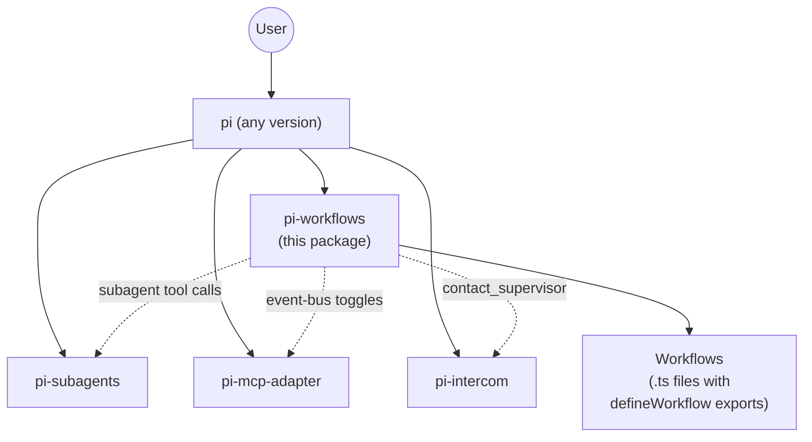

# `pi-workflows` — Pi Extension Technical Design Document

| Document Metadata      | Details                                                                                                                                                                                                                                              |
| ---------------------- | ---------------------------------------------------------------------------------------------------------------------------------------------------------------------------------------------------------------------------------------------------- |
| Author(s)              | Norin Lavaee                                                                                                                                                                                                                                         |
| Status                 | Draft (WIP)                                                                                                                                                                                                                                          |
| Team / Owner           | Atomic                                                                                                                                                                                                                                               |
| Created / Last Updated | 2026-05-11                                                                                                                                                                                                                                           |
| Sibling Spec           | `specs/2026-05-11-atomic-pi-coding-agent-rewrite.md` (the Atomic rebrand; depends on this spec landing first)                                                                                                                                       |
| Research Inputs        | `research/docs/2026-05-11-pi-coding-agent-reference.md`, `research/docs/2026-05-11-pi-mcp-adapter-and-subagents.md`, `research/docs/2026-05-11-atomic-codebase-inventory.md`, `research/docs/2026-05-11-map-the-entire-atomic-cli-codebase.md` |

---

## 1. Executive Summary

`pi-workflows` is a **pi-coding-agent extension that adds multi-stage workflow runs**. It is the direct architectural sibling of `pi-subagents`, `pi-mcp-adapter`, and `pi-intercom`: a self-contained pi extension, distributed as an npm package, installable via `pi install npm:pi-workflows`. Anyone running plain `pi` can adopt it.

A workflow is a TypeScript file that `export default`s a compiled `WorkflowDefinition` produced by `defineWorkflow(name).run(fn).compile()`. The extension registers one `workflow` tool the LLM can call, a `/workflow` slash command surface the user can drive directly, an above-editor progress widget, an on-demand overlay for the full DAG, and per-event inline rendering in the chat scroll via `pi.registerMessageRenderer`.

The package depends at runtime on **`pi-subagents`** (workflow stages can dispatch sub-agents for isolated context) and **`pi-mcp-adapter`** (workflow stages have access to whatever MCP servers the user has configured). It optionally integrates with **`pi-intercom`** so workflow stages can ask the user blocking questions while a run is detached. None of these dependencies are forked or modified; `pi-workflows` consumes their public extension surfaces via `pi.events` and tool calls.

This spec stands on its own: `pi-workflows` is developed, tested, and shipped to npm **independently of Atomic**, against any installed pi binary. The sibling Atomic spec then declares `pi-workflows` (alongside the other three) in Atomic's default `packages: [...]` and adds Atomic-curated content (skills, MCP server configs, sub-agent definitions, prompts, themes).

This is a **clean-slate authorship from an empty repo**. Before any code in this spec lands, the repository tree is wiped to documentation only. The previous Atomic codebase's `packages/atomic-sdk/` is cross-referenced for design intent only via **git history** — those files do not exist as files in the working tree by the time Phase A starts. Nothing is migrated, nothing is read, nothing is partially refactored. See §2.4 below for the exact starting tree.

---

## 2. Context and Motivation

### 2.1 Why pi-workflows

Pi (`@earendil-works/pi-coding-agent`) is a minimal coding TUI that explicitly **does not ship workflow orchestration** (see pi `docs/usage.md` philosophy section). Users who want plan/build/review loops, fan-out research scouts, or multi-stage agent pipelines either build their own glue or install third-party extensions. `pi-workflows` is one such extension — Atomic's primary contribution to the pi ecosystem.

The workflow design pattern is mature: a definition declares input schemas and a function that issues `ctx.stage()` calls (sequential, parallel, or fan-in topology); the runtime infers the DAG from JavaScript execution order; each stage spawns a focused pi sub-session driven by `session.prompt()`; live progress streams to a widget; the user can interrupt, branch via `/tree`, or detach. The previous Atomic implementation proved the design works; this extension is its clean reauthorship as a pi-native artifact.

### 2.2 Relationship to siblings

| Sibling          | What it adds                                            | How pi-workflows uses it                                                                                                  |
| ---------------- | ------------------------------------------------------- | ------------------------------------------------------------------------------------------------------------------------- |
| `pi-subagents`   | Delegated child agents via the `subagent` tool          | Stages call `subagent({agent, task})` for context-isolated work — same flow a chat user gets when they type `/run`.       |
| `pi-mcp-adapter` | MCP server proxy / direct-tool registration             | Stages inherit pi's tool list including MCP tools; the integration glue may toggle per-stage server availability.        |
| `pi-intercom`    | Child↔parent coordination (optional companion)          | When present, workflow stages running detached can `contact_supervisor` to ask the user blocking questions.              |

The dependency direction is one-way: `pi-workflows` declares them as runtime peer-deps and degrades gracefully if absent. None of the siblings depend on `pi-workflows`.

### 2.3 Design reference: previous Atomic SDK (git history only)

The v0.x `packages/atomic-sdk/` codebase encoded most of the workflow design that this extension reauthors. Specific files are cross-referenced throughout this spec **only via git history** — they do not exist as files in the working tree once Phase A starts. The previous implementation is preserved at the `atomic-pi-rewrite` repo at refs/tags prior to the clean-slate wipe described in §2.4.

The most load-bearing v0.x cross-references (read via `git show <commit>:packages/atomic-sdk/src/...`):

- `packages/atomic-sdk/src/define-workflow.ts` — the fluent authoring DSL shape.
- `packages/atomic-sdk/src/registry.ts` — immutable chainable registry semantics.
- `packages/atomic-sdk/src/runtime/graph-inference.ts` — `GraphFrontierTracker` topology inference algorithm (the only non-trivial algorithm worth preserving in spirit).
- `packages/atomic-sdk/src/types.ts` — the public type surface.
- `packages/atomic-sdk/src/runtime/status-writer.ts` — `WorkflowStatusSnapshot` schema.
- `packages/atomic-sdk/src/components/{session-graph-panel,node-card,edge,header,compact-switcher,toast,layout,connectors,graph-theme,status-helpers,color-utils}.tsx` — the TUI graph engine (see §5.4).

Every line of new code in this extension is written fresh against these references — none is copied.

### 2.4 Repository starting state — wiped to docs only

**Before Phase A of this spec begins, the working tree is wiped.** The first commit on the new branch (call it `rewrite/clean-slate`) deletes everything except documentation. The expected resulting tree:

```
atomic-pi-rewrite/
├── docs/                      # KEEP — any prior product/architecture docs
├── specs/                     # KEEP — this spec and Spec 2
├── research/                  # KEEP — research notes for both specs
├── README.md                  # KEEP — to be rewritten in Spec 2
├── LICENSE                    # KEEP
├── CHANGELOG.md               # KEEP — empty v1 entry seeded
├── AGENTS.md / CLAUDE.md      # KEEP if useful; rewritten in Spec 2
├── .gitignore                 # KEEP
├── .editorconfig              # KEEP
└── (everything else: DELETED)
```

What's **deleted** at the wipe commit:

- `packages/` entire directory (atomic, atomic-sdk, anything else).
- `tests/`, `scripts/`, `examples/`, `rest-api/`, `assets/`.
- Build artifacts: `dist/`, `node_modules/`, `bun.lock`, `package-lock.json`.
- Root manifest: `package.json` (will be re-created fresh).
- Lint/build config: `bunfig.toml`, `tsconfig.json`, `tsconfig.build.json`, `oxlint.json` (will be re-created fresh per Spec 1's needs).
- Installer scripts: `install.sh`, `install.cmd`, `install.ps1`.
- CI: `.github/workflows/` (rebuilt in Spec 2 for Atomic).
- Devcontainer: `.devcontainer/` (rebuilt minimal in Spec 2).
- Vendor config dirs: `.atomic/`, `.claude/`, `.opencode/`, `.github/agents/`, `.agents/`.
- Anything else under the repo root that is not in the KEEP list.

After the wipe, **Phase A of this spec creates `packages/pi-workflows/` and a minimal root `package.json` + `bunfig.toml`/`tsconfig.json` scoped to that single package.** The Atomic packages do not yet exist; they're created in Spec 2.

The git wipe commit message: `chore: clean-slate wipe before v1 rewrite (Spec 1 + Spec 2)`. The commit before it is tagged `v0.x-archive` for git-history cross-references.

---

## 3. Goals and Non-Goals

### 3.1 Functional Goals

- [ ] **Publishable as npm package `pi-workflows`** (not scoped, following sibling naming).
- [ ] **Single default export** — `function (pi: ExtensionAPI)` — that registers the `workflow` tool, the slash command surface, message renderers, and lifecycle handlers.
- [ ] **Named exports** for the authoring API — `defineWorkflow`, `createRegistry`, types — usable from any TypeScript file that `import`s the package.
- [ ] **`workflow` tool** with `{name, inputs}` parameters and live `renderCall`/`renderResult` slots that show in-flight DAG state.
- [ ] **Slash commands**: `/workflow [name] [args]`, `/workflow:<name>`, `/workflow list/status/kill/resume/inputs`, `/workflows-doctor`.
- [ ] **Above-editor progress widget** via `ctx.ui.setWidget` while runs are in-flight.
- [ ] **On-demand overlay** via `ctx.ui.custom({overlay: true})` showing the full DAG with keyboard navigation.
- [ ] **Per-event inline rendering** in the chat scroll via `pi.registerMessageRenderer` (run banner, stage chips, stage progress, stage results, run summary).
- [ ] **Session-entry persistence** via `pi.appendEntry` so runs survive `/reload`, integrate with `/tree`, `/fork`, and compaction.
- [ ] **DAG execution** with sequential, parallel (`Promise.all`), and fan-in topology inference via the `GraphFrontierTracker` algorithm.
- [ ] **HIL** via pi's `ctx.ui.input/confirm/select/editor` — every workflow stage gets uniform HIL primitives.
- [ ] **Builtin workflows** shipped inside the package's `workflows/` directory: `deep-research-codebase`, `ralph`, `open-claude-design`.
- [ ] **Custom workflow discovery** by direct module import from `.pi/workflows/*.ts`, `~/.pi/agent/workflows/*.ts`, and explicit `workflows: { name: { path } }` settings entries.
- [ ] **`pi-subagents` integration**: stages can spawn sub-agents via the existing `subagent` tool; the integration may inject workflow context (run-id, stage-id) as env vars.
- [ ] **`pi-mcp-adapter` integration**: stages inherit MCP tools transparently; an optional `mcp:<server>:<allow|deny>` directive on a stage toggles a specific server's availability for that stage via `pi.events`.
- [ ] **`pi-intercom` integration**: when present, the workflow run's parent session is registered as the intercom target so detached stages can `contact_supervisor`.
- [ ] **Configuration**: optional `~/.pi/agent/extensions/workflow/config.json` for tunables (recursion depth, default concurrency, persistence on/off).
- [ ] **CLI flag registration** via `pi.registerFlag`: `--workflow=<name>` and `--workflow-input-<key>=<value>` so a `pi -p --workflow=<name>` invocation runs a workflow headlessly. This is the seam Atomic's `atomic workflow` CLI command uses.

### 3.2 Non-Goals (Out of Scope)

- [ ] **No tmux integration.** Pi is single-process; nothing in this extension spawns tmux.
- [ ] **No multi-agent CLI dispatch** (claude/copilot/opencode CLIs). Pi's provider abstraction handles all model selection.
- [ ] **No backwards compatibility with `@bastani/atomic-sdk`.** External workflow authors who depended on that import path must update to `import { defineWorkflow } from "pi-workflows"`. No re-export shim.
- [ ] **No `runWorkflow()` programmatic entry point.** Workflows are invoked via (a) the LLM calling the `workflow` tool, (b) a user typing `/workflow ...`, (c) the registered `--workflow=` CLI flag in `pi -p` mode. External Node consumers shell out to pi.
- [ ] **No hidden subcommands** (`_emit-workflow-meta`, `_atomic-run`, etc.). Custom workflows are loaded by direct module import.
- [ ] **No dispatch token** or argv envelope. Module path in settings = user trusts the path.
- [ ] **No bundled MCP servers / skills / agent definitions / prompts / themes / branding.** Those ship with Atomic (the consuming binary), not with this extension. `pi-workflows` is content-neutral.
- [ ] **No Atomic-specific assumptions.** The extension runs against any pi binary including upstream `pi`. Any Atomic-specific behavior (e.g., `ATOMIC_*` env var prefix) is the responsibility of Atomic's piConfig rebrand, which `pi-workflows` benefits from automatically without coding for it.

---

## 4. Proposed Solution (High-Level Design)

### 4.1 Package architecture



`pi-workflows` runs inside pi. Workflows are TypeScript files imported via `jiti`. Sibling extensions are coordinated through `pi.events`, never patched.

### 4.2 Structural parallel to pi-subagents

The two extensions are deliberately isomorphic. This is the design principle.

| Concern                           | `pi-subagents`                                                                       | `pi-workflows`                                                                                                              |
| --------------------------------- | ------------------------------------------------------------------------------------ | --------------------------------------------------------------------------------------------------------------------------- |
| Single tool registered            | `subagent` (multi-action via discriminator)                                          | `workflow` (`name` + `inputs` params)                                                                                       |
| Authoring artifact                | Agent markdown + YAML frontmatter (e.g. `scout.md`)                                  | TypeScript file with `export default defineWorkflow(...).compile()`                                                          |
| Discovery roots                   | `~/.pi/agent/agents/`, `.pi/agents/`, package's own bundled `agents/`                | `~/.pi/agent/workflows/`, `.pi/workflows/`, package's own bundled `workflows/`                                              |
| Slash commands                    | `/run`, `/chain`, `/parallel`, `/run-chain`, `/subagents-doctor`                     | `/workflow`, `/workflow:<name>`, `/workflow list/kill/status/resume/inputs`, `/workflows-doctor`                            |
| Clarify UI                        | Built-in chain clarify UI                                                            | `ctx.ui.custom({overlay:true})` preview before run                                                                          |
| Background / detached execution   | `async: true` / `--bg`                                                               | `detach: true` / `--detach`                                                                                                  |
| Recursion guard                   | `PI_SUBAGENT_MAX_DEPTH` env (default 2)                                              | `PI_WORKFLOW_MAX_DEPTH` env (default 4)                                                                                      |
| Session persistence               | `pi.appendEntry` + `pi.appendCustomMessageEntry`                                     | Same primitives (§5.6)                                                                                                       |
| Custom message renderers          | Slash result cards, async-job widgets, control notices                               | Run banner, stage chips, stage progress, stage results, run summary                                                          |
| Live progress widget              | `ctx.ui.setWidget("subagent.async", ...)`                                            | `ctx.ui.setWidget("workflow.run", ...)`                                                                                      |
| Diagnostics                       | `/subagents-doctor`                                                                  | `/workflows-doctor`                                                                                                          |
| Config file                       | `~/.pi/agent/extensions/subagent/config.json`                                        | `~/.pi/agent/extensions/workflow/config.json`                                                                                |
| Intercom integration              | Detects `pi-intercom`; injects `contact_supervisor`                                  | Detects `pi-intercom`; routes stage-level `contact_supervisor` to the parent session                                        |
| Publishability                    | npm: `pi-subagents`                                                                  | npm: `pi-workflows`                                                                                                          |

When tempted to design something on the right that doesn't have an obvious analog on the left, audit first whether we're solving a real new problem or reinventing one pi-subagents already solved.

### 4.3 Package structure — heavy inspiration from `pi-subagents`

The repo layout below mirrors **pi-subagents'** file organization (`nicobailon/pi-subagents`, commit `635112d`) directory-by-directory wherever the concern is shared. Where pi-subagents has `src/agents/` we have `src/workflows/`; where pi-subagents has `src/runs/{foreground,background,shared}/` we have `src/runs/{sync,detach,shared}/`; where pi-subagents has `src/intercom/` we have `src/integrations/intercom/`. Pi-subagents' `tui/render.ts` (55 KB monolith) is our `src/tui/` (split because we port a richer graph engine — see §5.4).

```
packages/pi-workflows/
├── src/
│   ├── extension/
│   │   ├── index.ts                 # Default export: factory(pi: ExtensionAPI) → registers everything.
│   │   │                            #   cross-ref: pi-subagents src/extension/index.ts (22 KB entry)
│   │   ├── schemas.ts               # TypeBox schemas for the `workflow` tool params + slash-command args.
│   │   │                            #   cross-ref: pi-subagents src/extension/schemas.ts
│   │   ├── doctor.ts                # `/workflows-doctor` diagnostics.
│   │   │                            #   cross-ref: pi-subagents src/extension/doctor.ts
│   │   └── control-notices.ts       # Surfaces "stage idle", "tool failure", "near compaction" notices.
│   │                                #   cross-ref: pi-subagents src/extension/control-notices.ts
│   │
│   ├── workflows/                   # Authoring + registry. (Mirrors pi-subagents src/agents/.)
│   │   ├── define-workflow.ts       # defineWorkflow(name).input(...).run(fn).compile() builder.
│   │   │                            #   cross-ref: v0.x packages/atomic-sdk/src/define-workflow.ts
│   │   ├── registry.ts              # createRegistry() — immutable, chainable, keyed by name.
│   │   │                            #   cross-ref: v0.x packages/atomic-sdk/src/registry.ts
│   │   ├── registry-loader.ts       # Loads builtin / user / project / settings paths via jiti.
│   │   │                            #   cross-ref: pi-subagents src/agents/agents.ts (discover/parse)
│   │   ├── workflow-scope.ts        # "user" | "project" | "both" scope semantics.
│   │   │                            #   cross-ref: pi-subagents src/agents/agent-scope.ts
│   │   ├── workflow-selection.ts    # Picks workflow for /workflow without a name (fuzzy selector).
│   │   │                            #   cross-ref: pi-subagents src/agents/agent-selection.ts
│   │   ├── workflow-management.ts   # action:"create"/"update"/"delete"/"list"/"get" for the tool.
│   │   │                            #   cross-ref: pi-subagents src/agents/agent-management.ts
│   │   └── identity.ts              # Workflow name normalization, package-prefix handling.
│   │                                #   cross-ref: pi-subagents src/agents/identity.ts
│   │
│   ├── slash/                       # All `/workflow*` slash commands. (Mirrors pi-subagents src/slash/.)
│   │   ├── slash-commands.ts        # /workflow, /workflow:<name>, /workflow list/kill/status/resume/inputs, /workflows-doctor
│   │   │                            #   cross-ref: pi-subagents src/slash/slash-commands.ts
│   │   ├── slash-bridge.ts          # Bridges slash params → tool execute() path.
│   │   │                            #   cross-ref: pi-subagents src/slash/slash-bridge.ts
│   │   ├── slash-live-state.ts      # Inline slash-widget live state (e.g., "scanning workflows...").
│   │   │                            #   cross-ref: pi-subagents src/slash/slash-live-state.ts
│   │   └── prompt-template-bridge.ts# Integration with pi-prompt-template-model when present.
│   │                                #   cross-ref: pi-subagents src/slash/prompt-template-bridge.ts
│   │
│   ├── tool/
│   │   ├── tool.ts                  # pi.registerTool({name: "workflow", ...}). Multi-action via discriminator.
│   │   │                            #   cross-ref: pi-subagents src/extension/index.ts:pi.registerTool({name:"subagent"})
│   │   ├── render-call.ts           # renderCall slot.
│   │   └── render-result.ts         # renderResult slot with isPartial streaming.
│   │
│   ├── cli-flags.ts                 # pi.registerFlag("workflow", ...) + auto-invoke on session_start.
│   │                                #   cross-ref: (none in pi-subagents; this is workflow-specific)
│   │
│   ├── runs/                        # DAG execution. (Mirrors pi-subagents src/runs/{foreground,background,shared}/.)
│   │   ├── sync/
│   │   │   ├── executor.ts          # The main per-run executor.
│   │   │   │                        #   cross-ref: pi-subagents src/runs/foreground/subagent-executor.ts (86 KB)
│   │   │   └── stage-runner.ts      # Per-stage execution (ctx.newSession, prompt, complete()).
│   │   │                            #   cross-ref: pi-subagents src/runs/foreground/execution.ts
│   │   ├── detach/                  # Detached/background runs.
│   │   │   ├── detach-runner.ts     #   cross-ref: pi-subagents src/runs/background/subagent-runner.ts (61 KB)
│   │   │   ├── async-execution.ts   #   cross-ref: pi-subagents src/runs/background/async-execution.ts
│   │   │   ├── job-tracker.ts       #   cross-ref: pi-subagents src/runs/background/async-job-tracker.ts
│   │   │   ├── resume.ts            #   cross-ref: pi-subagents src/runs/background/async-resume.ts
│   │   │   ├── status.ts            #   cross-ref: pi-subagents src/runs/background/async-status.ts
│   │   │   ├── result-watcher.ts    #   cross-ref: pi-subagents src/runs/background/result-watcher.ts
│   │   │   └── notify.ts            #   cross-ref: pi-subagents src/runs/background/notify.ts
│   │   └── shared/
│   │       ├── graph-inference.ts   # GraphFrontierTracker re-derivation.
│   │       │                        #   cross-ref: v0.x packages/atomic-sdk/src/runtime/graph-inference.ts
│   │       ├── stage-prompt-runtime.ts # Per-stage prompt assembly.
│   │       │                        #   cross-ref: pi-subagents src/runs/shared/subagent-prompt-runtime.ts
│   │       ├── completion-guard.ts  #   cross-ref: pi-subagents src/runs/shared/completion-guard.ts
│   │       ├── long-running-guard.ts#   cross-ref: pi-subagents src/runs/shared/long-running-guard.ts
│   │       ├── model-fallback.ts    #   cross-ref: pi-subagents src/runs/shared/model-fallback.ts
│   │       ├── parallel-utils.ts    # mapConcurrent + MAX_CONCURRENCY constant.
│   │       │                        #   cross-ref: pi-subagents src/runs/shared/parallel-utils.ts
│   │       └── run-history.ts       #   cross-ref: pi-subagents src/runs/shared/run-history.ts
│   │
│   ├── persistence/
│   │   ├── session-entries.ts       # pi.appendEntry for run/stage events.
│   │   ├── restore.ts               # session_start scan + crash detection.
│   │   └── compaction-policy.ts     # session_before_compact hook.
│   │
│   ├── tui/                         # Graph visualization engine. See §5.4. (Mirrors pi-subagents src/tui/render.ts.)
│   │   ├── graph-view.ts            # Main pi-tui component, two modes ("overlay" | "widget").
│   │   ├── node-card.ts             # Single node renderer with pulse animation.
│   │   ├── edge.ts                  # Connector edge drawing.
│   │   ├── header.ts                # Header band.
│   │   ├── switcher.ts              # "/" popup keyboard switcher.
│   │   ├── toast.ts                 # Top-right notification card stack.
│   │   ├── layout.ts                # computeLayout — DAG → 2D grid.
│   │   ├── connectors.ts            # buildConnector / buildMergeConnector.
│   │   ├── graph-theme.ts           # deriveGraphTheme(pi-theme) → graph-specific tokens.
│   │   ├── status-helpers.ts        # statusColor / statusIcon / fmtDuration.
│   │   ├── color-utils.ts           # lerpColor for pulse animation.
│   │   ├── render-helpers.ts        # Shared formatting helpers.
│   │   │                            #   cross-ref: pi-subagents src/tui/render-helpers.ts
│   │   └── renderers.ts             # pi.registerMessageRenderer for inline chat-scroll cards.
│   │
│   ├── store.ts                     # Plain mutable in-extension store. Subscribe pattern, version counter.
│   │                                #   cross-ref: v0.x packages/atomic-sdk/src/components/orchestrator-panel-store.ts
│   ├── store-types.ts               # RunSnapshot, StageSnapshot, StoreSnapshot, etc.
│   │                                #   cross-ref: v0.x packages/atomic-sdk/src/components/orchestrator-panel-types.ts
│   │
│   ├── integrations/
│   │   ├── subagents.ts             # pi-subagents cooperation: stage spawn env injection, /tool delegation.
│   │   ├── mcp.ts                   # pi-mcp-adapter cooperation: per-stage server toggle events.
│   │   └── intercom/
│   │       ├── intercom-bridge.ts   # pi-intercom detection + parent session naming.
│   │       │                        #   cross-ref: pi-subagents src/intercom/intercom-bridge.ts
│   │       └── result-intercom.ts   # Stage-level escalation → parent chat surface.
│   │                                #   cross-ref: pi-subagents src/intercom/result-intercom.ts
│   │
│   ├── shared/                      # Cross-cutting helpers. (Mirrors pi-subagents src/shared/.)
│   │   ├── types.ts                 # Public type exports.
│   │   │                            #   cross-ref: pi-subagents src/shared/types.ts (21 KB)
│   │   ├── settings.ts              # Config-shape helpers.
│   │   │                            #   cross-ref: pi-subagents src/shared/settings.ts
│   │   ├── artifacts.ts             # Per-run artifact paths (input.md, output.md, etc.).
│   │   │                            #   cross-ref: pi-subagents src/shared/artifacts.ts
│   │   ├── formatters.ts            #   cross-ref: pi-subagents src/shared/formatters.ts
│   │   ├── jsonl-writer.ts          # JSONL writer for run logs.
│   │   │                            #   cross-ref: pi-subagents src/shared/jsonl-writer.ts
│   │   ├── model-info.ts            #   cross-ref: pi-subagents src/shared/model-info.ts
│   │   └── utils.ts                 #   cross-ref: pi-subagents src/shared/utils.ts (14 KB)
│   │
│   ├── errors.ts                    # Typed error classes.
│   │                                #   cross-ref: v0.x packages/atomic-sdk/src/errors.ts
│   ├── types.ts                     # Top-level type re-exports.
│   └── lib/
│       └── telemetry.ts             # Optional telemetry sink interface (no built-in production sink).
│
├── workflows/                       # Bundled builtin workflows shipped with the package.
│   ├── deep-research-codebase.ts    #   cross-ref: v0.x packages/atomic/src/commands/builtin-*/deep-research-codebase/*.ts
│   ├── ralph.ts                     #   cross-ref: v0.x packages/atomic/src/commands/builtin-*/ralph/*.ts
│   └── open-claude-design.ts        #   cross-ref: v0.x packages/atomic/src/commands/builtin-*/open-claude-design/*.ts
│
├── test/
│   ├── unit/                        # Pure-function tests (define-workflow, registry, graph-inference, layout, ...).
│   ├── integration/                 # MockExtensionAPI tests.
│   └── e2e/                         # Against the user's installed pi binary via PI_BIN env.
│
└── package.json
```

**Pi-subagents structural inspiration is explicit**: every directory that has a clear analog points at the analogous pi-subagents file. The intent is that a reader who knows pi-subagents can immediately find the equivalent piece in `pi-workflows`.

`package.json`:

```jsonc
{
  "name": "pi-workflows",
  "version": "0.1.0",
  "keywords": ["pi-package"],
  "main": "dist/index.js",
  "types": "dist/index.d.ts",
  "pi": {
    "extensions": ["./dist/extension/index.js"],
    "workflows": ["./workflows"]
  },
  "peerDependencies": {
    "pi-subagents": "*",
    "pi-mcp-adapter": "*",
    "pi-intercom": "*"
  },
  "peerDependenciesMeta": {
    "pi-subagents":   { "optional": true },
    "pi-mcp-adapter": { "optional": true },
    "pi-intercom":    { "optional": true }
  },
  "dependencies": {
    "jiti": "^2.0.0",
    "typebox": "^0.34.0"
  }
}
```

---

## 5. Detailed Design

### 5.1 Public authoring API

External workflow files look like:

```ts
// my-workflow.ts
import { defineWorkflow } from "pi-workflows";

export default defineWorkflow("deep-research-codebase")
  .description("Scout → per-partition specialists → aggregator")
  .input("prompt", { type: "text", required: true, description: "research question" })
  .input("max_partitions", { type: "number", default: 4 })
  .run(async (ctx) => {
    const scout = await ctx.stage("scout").prompt(`Scout the codebase: ${ctx.inputs.prompt}`);
    const partitions = await ctx.stage("partition").prompt(`Partition based on: ${scout}`);
    const specialists = await Promise.all(
      partitions.split("\n").map((p, i) =>
        ctx.stage(`specialist-${i}`).prompt(`Investigate partition ${p}`)
      )
    );
    const aggregate = await ctx.stage("aggregator").prompt(
      `Aggregate findings:\n${specialists.join("\n---\n")}`
    );
    return { findings: aggregate };
  })
  .compile();
```

`.compile()` returns a frozen `WorkflowDefinition` carrying a sentinel `__piWorkflow: true` so the loader can validate.

**API cross-reference**: v0.x `packages/atomic-sdk/src/define-workflow.ts`. The signature shape is preserved; the implementation is rewritten with no `for(agent)` step (since pi handles model selection via `--model` or `pi.setModel`).

### 5.2 The `workflow` tool

```ts
pi.registerTool({
  name: "workflow",
  label: "workflow",
  description: "Run a defined multi-stage workflow by name.",
  parameters: Type.Object({
    name: Type.String({ description: "Workflow ID (use {action:'list'} to enumerate)" }),
    inputs: Type.Record(Type.String(), Type.Any(), { default: {} }),
    action: Type.Optional(Type.Union([
      Type.Literal("run"), Type.Literal("list"), Type.Literal("status"),
      Type.Literal("kill"), Type.Literal("resume"), Type.Literal("inputs"),
    ])),
  }),
  execute: async (args, ctx) => { /* dispatch by action */ },
  renderCall: ({args}, theme, context) => renderToolCall(args, theme, context),
  renderResult: ({result}, opts, theme, context) => renderToolResult(result, opts, theme, context),
});
```

The tool uses pi-subagents' multi-action-via-discriminator pattern: one tool registration covers run/list/status/kill/resume/inputs. `renderResult` honors `opts.isPartial` to stream live progress (`context.state.runId`, `context.state.stages`, `context.invalidate()`).

### 5.3 Slash commands

| Slash invocation              | Behavior                                                                                                |
| ----------------------------- | ------------------------------------------------------------------------------------------------------- |
| `/workflow`                   | Opens a `SelectList` overlay with all registered workflows; fuzzy filter.                              |
| `/workflow <name> [args]`     | Starts a run of `<name>` with parsed args (TypeBox-validated inputs).                                  |
| `/workflow:<name>`            | Shorthand for `/workflow <name>`.                                                                       |
| `/workflow list`              | Lists workflows in an overlay (registry inspection).                                                    |
| `/workflow status`            | Lists in-flight runs in an overlay.                                                                     |
| `/workflow kill <runId>`      | Aborts a run (`AbortController.abort()`).                                                               |
| `/workflow kill --all`        | Aborts every in-flight run.                                                                              |
| `/workflow resume <runId>`    | Re-opens the overlay for a specific run.                                                                |
| `/workflow inputs <name>`     | Shows a workflow's input schema in an overlay.                                                          |
| `/workflows-doctor`           | Read-only diagnostics: loaded workflows, available siblings (pi-subagents/pi-mcp-adapter/pi-intercom), config validation. |

Tab-completion via `getArgumentCompletions`.

### 5.4 The TUI graph visualization engine — extends the v0.x Atomic SDK

This is the single largest piece of work in `pi-workflows`. The v0.x Atomic SDK invested heavily in a DAG graph visualization (graph layout, animated edges, status colors, keyboard navigation, switcher popup). **That visualization engine is `pi-workflows`' starting point and the source-of-design.** It is **reauthored against pi-tui** so it can serve double duty as:

1. **An overlay pane** (`ctx.ui.custom({overlay: true})`) — full-screen DAG with keyboard nav, the way Atomic users invoke `atomic workflow` today.
2. **An above-editor widget** (`ctx.ui.setWidget(key, factory, {placement: "aboveEditor"})`) — compact summary version of the same engine sharing the same store, layout math, and theme, so a workflow's progress is visible in-chat without opening the overlay.

The point: **one rendering engine, two presentation modes** — overlay and widget — driven by the same in-extension store. Pi-subagents' `tui/render.ts` (55 KB) is the architectural reference for "one big rendering module shared across presentation contexts."

#### 5.4.1 What we port from the v0.x Atomic SDK

Each file below is **design reference only** — the v0.x packages are deleted (Spec 2 §5.12 "Clean-slate posture"). Pi-workflows re-derives each piece against pi-tui's primitives (`Container`, `Box`, `Text`, `Spacer`, `Markdown`, plus the focusable/overlay machinery in `docs/tui.md`):

| v0.x file (cross-reference)                                                  | What's preserved                                                                                                                                                                          | New home in `pi-workflows`                                          |
| ---------------------------------------------------------------------------- | ----------------------------------------------------------------------------------------------------------------------------------------------------------------------------------------- | ------------------------------------------------------------------ |
| `packages/atomic-sdk/src/components/session-graph-panel.tsx`                 | Top-level graph component: pulse animation at 60 ms tick; keyboard nav (↑↓/j/k/Enter/gg/"/" switcher/q); `decideAttachAction` (resume vs. switch-client logic).                          | `src/tui/graph-view.ts`                                            |
| `packages/atomic-sdk/src/components/node-card.tsx`                           | Single node renderer: animated border pulse, status-color application, duration formatting, content slot.                                                                                | `src/tui/node-card.ts`                                             |
| `packages/atomic-sdk/src/components/edge.tsx`                                | Connector edge between graph nodes (SVG-style box-drawing characters).                                                                                                                    | `src/tui/edge.ts`                                                  |
| `packages/atomic-sdk/src/components/header.tsx`                              | Header band showing workflow name, status count badges, elapsed duration, fatal-error band.                                                                                              | `src/tui/header.ts`                                                |
| `packages/atomic-sdk/src/components/compact-switcher.tsx`                    | "/" popup list of all stages for direct keyboard jump.                                                                                                                                    | `src/tui/switcher.ts`                                              |
| `packages/atomic-sdk/src/components/toast.tsx`                               | Top-right nvim-style notification card stack with auto-dismiss timers.                                                                                                                    | `src/tui/toast.ts`                                                 |
| `packages/atomic-sdk/src/components/layout.ts`                               | `computeLayout(SessionData[]) → LayoutNode[]`: flat node list → 2D grid DAG layout with constants `NODE_W`/`NODE_H`. Pure TS, ports directly.                                            | `src/tui/layout.ts` (near-verbatim re-derivation)                  |
| `packages/atomic-sdk/src/components/connectors.ts`                          | `buildConnector()`, `buildMergeConnector()` → `ConnectorResult` with box-drawing character paths for edges. Pure TS.                                                                     | `src/tui/connectors.ts`                                            |
| `packages/atomic-sdk/src/components/graph-theme.ts`                         | `deriveGraphTheme(TerminalTheme) → GraphTheme`: maps pi's theme tokens to graph-specific color slots.                                                                                    | `src/tui/graph-theme.ts`                                           |
| `packages/atomic-sdk/src/components/status-helpers.ts`                      | `statusColor()`, `statusIcon()`, `fmtDuration()`. Pure helpers.                                                                                                                            | `src/tui/status-helpers.ts`                                        |
| `packages/atomic-sdk/src/components/color-utils.ts`                         | `lerpColor()` for hex interpolation (used in pulse animation).                                                                                                                            | `src/tui/color-utils.ts`                                           |
| `packages/atomic-sdk/src/components/orchestrator-panel-store.ts`            | `PanelStore` mutable store with `subscribe(fn)` → version-counter increment. Now degenerates to plain in-extension state (no cross-process IPC needed — see §5.7 below).                  | `src/store.ts` (simplified, no IPC)                                |
| `packages/atomic-sdk/src/components/orchestrator-panel-types.ts`            | `SessionData`, `SessionStatus`, `ViewMode`, `PanelSession`, `SYNTHETIC_ORCHESTRATOR_NAME` (renamed to `WORKFLOW_ROOT_NAME`).                                                              | `src/store-types.ts`                                               |
| `packages/atomic-sdk/src/components/orchestrator-panel.tsx`                 | Imperative `OrchestratorPanel` class that bridges executor → React tree. In pi-tui we don't need the imperative bridge — `ctx.ui.custom`/`setWidget` give us the entry points directly.   | merged into `src/tui/graph-view.ts` and `src/tui/widget.ts`        |
| `packages/atomic-sdk/src/components/hooks.ts`                               | `useLatest()` stable-ref-to-latest-value pattern. Pi-tui's reconciler may or may not need this; port if equivalent issue surfaces.                                                       | `src/tui/hooks.ts` if needed                                       |

The `_panel-contexts.ts` React contexts from v0.x (`StoreContext`, `ThemeContext`, `TmuxSessionContext`, `OffloadManagerContext`) **do not port** — there's no tmux, no offload, no cross-process IPC. The store and theme reach components through pi-tui's natural prop passing.

#### 5.4.2 One engine, two presentation modes

```
                        Workflow run state
                                │
                       (in-extension store, plain mutable;
                         subscribes via store.onChange)
                                │
            ┌───────────────────┴───────────────────┐
            ▼                                       ▼
  ┌──────────────────┐                  ┌──────────────────────┐
  │  Overlay pane    │                  │  Above-editor widget │
  │  (ctx.ui.custom) │                  │  (ctx.ui.setWidget)  │
  │                  │                  │                      │
  │  - Full graph    │                  │  - Compact summary   │
  │  - Keyboard nav  │                  │  - 1-line status     │
  │  - /switcher     │                  │  - Auto-hides idle   │
  │  - Toasts        │                  │                      │
  │  - Header band   │                  │                      │
  └────────┬─────────┘                  └──────────┬───────────┘
           │                                       │
           └───────────────┬───────────────────────┘
                           ▼
              `src/tui/graph-view.ts`
              `src/tui/node-card.ts`
              `src/tui/edge.ts`
              `src/tui/layout.ts`
              `src/tui/connectors.ts`
              `src/tui/graph-theme.ts`
                  (shared engine)
```

The same `layout.ts` `computeLayout(nodes, opts) → LayoutNode[]` is called by both modes — `opts.viewport` sets the available dimensions, and the engine clips/scales. The same `graph-theme.ts` derivation runs once per theme change. Toggling between overlay and widget does not rebuild the store or recompute layout from scratch.

#### 5.4.3 Overlay invocation

```ts
ctx.ui.custom(
  (tui, theme, keybindings, done) =>
    new GraphView({
      mode: "overlay",
      runId,
      store,
      graphTheme: deriveGraphTheme(theme),
      keybindings,
      onClose: () => done(undefined),
    }),
  {
    overlay: true,
    overlayOptions: { width: "90%", maxHeight: "85%", anchor: "center" },
  }
);
```

`GraphView` is a pi-tui `Component` (`render(width): string[]`, `handleInput(data)`, `invalidate()`). It hosts `header.ts`, the laid-out grid of `node-card.ts` + `edge.ts`, and the `switcher.ts` popup. Dismissable (Escape) without aborting the run. Re-opening: `/workflow status` re-summons.

#### 5.4.4 Widget invocation

```ts
ctx.ui.setWidget("workflow.run", (tui, theme) =>
  new GraphView({
    mode: "widget",
    runId: store.activeRunId(),
    store,
    graphTheme: deriveGraphTheme(theme),
  }), {
    placement: "aboveEditor",
});
```

In `mode: "widget"`, `GraphView.render(width)` returns 1–3 compact lines:

- Line 1: `▶ deep-research-codebase · stage 2/5 (specialist-2) · ⏱ 1m24s`
- Line 2 (optional, when multiple runs): summary count `2 runs in flight — press F2 for overlay`
- Line 3 (optional): a thin per-stage progress sparkline derived from the same `layout.ts` output but compressed to single-row glyphs.

When `store.activeRunId()` returns null (no runs), `setWidget("workflow.run", undefined)` clears it. The store's subscribe callback triggers `setWidget` re-registration on every snapshot change.

#### 5.4.5 Keyboard handoff overlay ↔ widget

Pressing F2 (or `Ctrl+Shift+W`, settings-configurable per `docs/keybindings.md`) from the chat opens the overlay if any runs are in flight. Pressing Escape inside the overlay returns to the chat with the widget visible. The keystrokes are registered via `pi.registerShortcut`.

#### 5.4.6 Pulse animation and live updates

The v0.x panel runs a 60 ms tick that pulses node-card borders for running stages. The same tick runs in `pi-workflows`, scheduled via `setInterval` inside the `GraphView` component's lifecycle (started in the component constructor, cleared on `dispose`). Pi-tui's `invalidate()` is called per tick to redraw only the pulsing nodes (efficient because the layout doesn't recompute).

Tool-execution events (`tool_execution_start/_update/_end`) feed `store.recordToolStart/Update/End(stageId, ...)` which sets the affected node's status; the next tick redraws.

#### 5.4.7 Toasts (overlay-only)

`Toast.tsx` from v0.x renders nvim-style notification cards in the top-right corner with auto-dismiss timers (managed by the store). These appear in the overlay only — in widget mode there's no room. Toast triggers:

- Stage failure (red, 5 s).
- Run completion (green, 3 s).
- Compaction near (yellow, persistent until run ends).
- `contact_supervisor` (blue, persistent until acknowledged) — see §5.10 intercom integration.

### 5.5 Store and in-extension state

`src/store.ts` is a plain mutable object with a `subscribe(fn): unsubscribe` API and an internal version counter. This is the same pattern as v0.x `packages/atomic-sdk/src/components/orchestrator-panel-store.ts` (`PanelStore`) — minus the cross-process IPC layer that pi-subagents and v0.x Atomic both used. Because pi-workflows runs in-process with the chat TUI, the store is just a singleton in the extension module:

```ts
// src/store.ts (sketch)
export interface Store {
  runs(): readonly RunSnapshot[];
  activeRunId(): string | null;
  recordRunStart(run: RunSnapshot): void;
  recordStageStart(runId: string, stage: StageSnapshot): void;
  recordToolStart(runId: string, stageId: string, evt: ToolEvent): void;
  recordToolEnd(runId: string, stageId: string, evt: ToolEvent): void;
  recordStageEnd(runId: string, stage: StageSnapshot): void;
  recordRunEnd(runId: string, status: RunStatus, result?: unknown): void;
  snapshot(): StoreSnapshot;
  subscribe(fn: (snap: StoreSnapshot) => void): () => void;
}
```

**Pi-subagents structural inspiration**: pi-subagents keeps its own per-run state in `src/runs/foreground/subagent-executor.ts` + `src/runs/background/async-job-tracker.ts`. The pi-workflows store is the equivalent — one module owning all live run state.

The store also drives `setWidget` re-registration: every snapshot change calls `setWidget("workflow.run", ...)` to keep the widget current.

### 5.6 Persistence via session entries

```ts
pi.appendEntry("workflow.run.start",     { runId, name, inputs, ts });
pi.appendEntry("workflow.stage.start",   { runId, stageId, name, parentIds, model, ts });
pi.appendEntry("workflow.stage.progress",{ runId, stageId, kind, payload });  // tool calls, message deltas, etc.
pi.appendEntry("workflow.stage.end",     { runId, stageId, status, durationMs, summary });
pi.appendEntry("workflow.run.end",       { runId, status, result, ts });
// optional narrative for the LLM:
pi.appendCustomMessageEntry({ role: "system", content: `Workflow ${name} stage ${stageName} completed: ${summary}` });
```

Each `workflow.run.start` entry is labeled via `pi.setLabel(entryId, "wf:<name>:<short-id>")` for `/tree` bookmark filtering.

Renderers:

```ts
pi.registerMessageRenderer("workflow.run.start",      renderRunBanner);
pi.registerMessageRenderer("workflow.stage.start",    renderStageChip);
pi.registerMessageRenderer("workflow.stage.progress", renderStageProgress);
pi.registerMessageRenderer("workflow.stage.end",      renderStageResult);
pi.registerMessageRenderer("workflow.run.end",        renderRunSummary);
```

On `session_start`, the extension scans `ctx.sessionManager.getEntries()` for in-flight runs (have `workflow.run.start` without matching `workflow.run.end` on the active branch) and either marks them crashed or attempts resume (depending on config).

**No separate `status.json` file** for primary state. An optional opt-in `status.json` derived artifact for CI polling is supported via `config.statusFile: true`.

### 5.7 DAG execution

The executor in `src/executor.ts`:

```ts
interface Executor {
  run(def: WorkflowDefinition, inputs: ResolvedInputs, opts: RunOpts): Promise<RunResult>;
}
```

Per-stage execution paths (each isolated to its own pi sub-session unless the workflow body explicitly uses the same context):

| Stage shape                                                        | Implementation                                                                                                                                       |
| ------------------------------------------------------------------ | ---------------------------------------------------------------------------------------------------------------------------------------------------- |
| `ctx.stage("name").prompt(text)` (default)                         | `ctx.newSession({ withSession: async (newCtx) => { const result = await newCtx.session.prompt(text); return result; } })`.                            |
| `ctx.stage("name").subagent({agent, task})` (if pi-subagents present) | Invokes the `subagent` tool through the parent session so it shows up in chat scroll naturally.                                                       |
| `ctx.stage("name").complete(text, {model})` (one-shot, no session) | Uses `complete()` from `@earendil-works/pi-ai` directly — for cheap stages that don't need session tree (cross-reference: pi's `handoff.ts` example). |
| HIL — `ctx.ui.input/confirm/select/editor`                         | Pi's documented dialog methods. **Every workflow stage gets uniform HIL primitives** regardless of provider.                                          |

The `GraphFrontierTracker` (re-derived from v0.x `runtime/graph-inference.ts`) wraps `ctx.stage()` to record spawn/settle events; parent inference happens automatically from `Promise.all` (parallel) and `await` (sequential) patterns. No `dependsOn` declarations.

The executor subscribes to pi's tool-execution lifecycle to drive the widget/overlay:

```ts
pi.on("tool_execution_start",  (e, ctx) => store.recordToolStart(currentStageId, e));
pi.on("tool_execution_update", (e)      => store.recordToolUpdate(currentStageId, e));
pi.on("tool_execution_end",    (e)      => store.recordToolEnd(currentStageId, e));
```

File-mutation safety inside stages uses pi's `withFileMutationQueue(absolutePath, fn)`. Output truncation uses pi's `truncateHead`/`truncateTail`/`formatSize` exports.

### 5.8 Integration with `pi-subagents`

`pi-workflows` requires `pi-subagents` as a peer dep. At runtime, if absent, `ctx.stage(...).subagent(...)` throws a clear error pointing the user to `pi install npm:pi-subagents`.

Cooperation mechanism:
- Workflow stages that opt into sub-agent delegation call the existing `subagent` tool (registered by pi-subagents) via the chat agent driving the stage. No special API surface.
- The integration extension (`src/integrations/subagents.ts`) injects `PI_WORKFLOW_RUN_ID` and `PI_WORKFLOW_STAGE_ID` env vars when pi-subagents spawns a child process, so the child knows which workflow context it's in.
- Workflow `pi.events` (`workflow.stage.start`, `workflow.stage.end`) are emitted so pi-subagents (or other extensions) can react.

### 5.9 Integration with `pi-mcp-adapter`

`pi-workflows` requires `pi-mcp-adapter` as a peer dep. If absent, workflows still run; they just don't have MCP tools available (which the workflow's prompt or agent will discover at LLM call time).

Cooperation mechanism:
- Workflow stages inherit pi's tool list including any MCP tools `pi-mcp-adapter` has registered (direct tools) or the `mcp` proxy. Default behavior — no integration code needed.
- Optional per-stage server gating: a stage can declare `mcpServers: { allow: ["github", "fetch"], deny: ["filesystem"] }` and `src/integrations/mcp.ts` emits a `pi.events.emit("mcp.scope.set", {...})` event the adapter listens for. (This requires the adapter to expose such an event — if it doesn't yet, the integration documents the gap and we open an upstream PR to pi-mcp-adapter; we do NOT patch the adapter locally.)

### 5.10 Integration with `pi-intercom`

`pi-intercom` is optional. When absent, workflow stages cannot escalate to the user mid-run — they must complete with whatever context they have.

When present:
- `src/integrations/intercom.ts` calls `pi.setSessionName("pi-workflows-parent-<short-hash>")` on `session_start` so children have a target.
- The workflow extension subscribes to `pi.events.on("subagent:control-intercom", ...)` (pi-subagents' channel) — when a child sub-agent of a workflow stage calls `contact_supervisor`, the workflow extension surfaces it in the workflow overlay (if open) AND in the chat (`ctx.ui.confirm` for `need_decision`).
- Cross-reference: see pi-subagents' [Optional pi-intercom companion](https://github.com/nicobailon/pi-subagents/tree/main#optional-pi-intercom-companion) section.

### 5.11 Builtin workflows

Three workflows ship inside the package's `workflows/` directory (bundled via `pi: {workflows: ["./workflows"]}` in `package.json`):

| Workflow                  | Shape                                                                                                                                                                |
| ------------------------- | -------------------------------------------------------------------------------------------------------------------------------------------------------------------- |
| `deep-research-codebase`  | Scout → per-partition specialist sub-agents (via pi-subagents) → aggregator. Each sub-agent gets a `defaultContext: "fork"` so it inherits scout's findings.        |
| `ralph`                   | Plan → orchestrate → review loop with bounded iteration. HIL via `ctx.ui.editor()` / `ctx.ui.confirm()` between iterations. Bounded iteration is a JS `for` loop.   |
| `open-claude-design`      | Design system onboarding → import → generate → refine → export/handoff. Input flags: `--reference`, `--output-type`, `--design-system`.                              |

Each builtin file imports from `pi-workflows` itself (a workspace self-reference during dev; the normal published import in user code).

**Cross-references for builtins**: the v0.x per-agent variants under `packages/atomic/src/commands/builtin-*/` (e.g., `deep-research-codebase/claude.ts`, `.../copilot.ts`, etc.) are design reference. The new versions are single workflows parameterized by model, not per-agent variants.

### 5.12 Custom workflow discovery

The registry loader scans these paths at `session_start` and on `/reload`:

1. **Built-in** — `workflows/` inside the installed `pi-workflows` package (discovered via the `pi` manifest).
2. **User-global** — `~/.pi/agent/workflows/*.ts` (or `.js`).
3. **Project-local** — `.pi/workflows/*.ts` walking up from cwd.
4. **Explicit settings entries** — `settings.json` `pi-workflows.workflows: { "<name>": { "path": "..." } }`. Project-relative paths resolve against `.pi/`, global paths against `~/.pi/agent/`.

For each file:

```ts
const mod = await import(absolutePath);   // jiti for TS, native for JS
const def = mod.default;
if (!def || def.__piWorkflow !== true) continue;  // silently skip non-workflow files
registry.upsert(def);
```

No subprocess. No metadata-emission protocol. No dispatch token.

### 5.13 Configuration

`~/.pi/agent/extensions/workflow/config.json` (Atomic's piConfig rebrand maps this to `~/.atomic/agent/...`):

```jsonc
{
  "maxDepth": 4,                              // recursion guard (env var override: PI_WORKFLOW_MAX_DEPTH)
  "defaultConcurrency": 4,                    // parallel-stage default
  "persistRuns": true,                        // pi.appendEntry on/off
  "statusFile": false,                        // opt-in derived status.json for CI
  "resumeInFlight": "ask",                    // "ask" | "auto" | "never" on session_start
  "overlay": {
    "autoOpenOnStart": false,                 // open overlay automatically when a run begins
    "anchor": "center"
  },
  "integrations": {
    "subagents": "auto",                      // "auto" | "off"
    "mcp": "auto",
    "intercom": "auto"
  }
}
```

All keys optional with sane defaults.

### 5.14 Testing strategy

`pi-workflows` is testable **against the user's installed pi binary directly** — no Atomic rebuild needed. The package's `package.json` includes:

```jsonc
{
  "scripts": {
    "build": "bun build src/index.ts --outdir dist --target node",
    "test": "bun test",
    "test:e2e": "PI_BIN=$(which pi) bun test test/e2e",
    "dev:link": "bun link && cd ~/some-test-project && bun link pi-workflows && pi install ./dist"
  }
}
```

Test tiers:

1. **Unit** (`test/unit/`): `defineWorkflow` builder shape, registry semantics, input validation, graph-inference algorithm against synthetic stage call sequences, persistence-entry shape.
2. **Integration** (`test/integration/`): the package's `default` function registers tools/commands/renderers correctly against a `MockExtensionAPI`. Workflow execution against a mock pi-ai `complete()` for deterministic stage outputs.
3. **E2E against installed pi** (`test/e2e/`): for each builtin workflow, run `pi -p --no-session --workflow=<name> --workflow-input-prompt='...'` in a fixture directory; assert the JSONL output stream contains expected `workflow.*` events. Requires `pi` on PATH.

Pi's existing test conventions apply: `CLAUDECODE=1` / `AGENT=1` / `REPL_ID=1` env vars enable quiet output.

---

## 6. Alternatives Considered

| Option                                                            | Why considered                                                                                                              | Why rejected                                                                                                          |
| ----------------------------------------------------------------- | --------------------------------------------------------------------------------------------------------------------------- | -------------------------------------------------------------------------------------------------------------------- |
| Bundle workflow runtime into Atomic, not as an npm package       | Less surface to publish/maintain.                                                                                            | Misses the user's stated framing (pi-workflows is structurally a sibling of pi-subagents — publishable to pi ecosystem). |
| Build on top of pi-subagents' chain abstraction instead of new tool | pi-subagents already does chains and parallel.                                                                                | Chains are linear/parallel; workflows need fan-in topology, programmatic input schemas, and per-stage HIL beyond pi-subagents' frontmatter. |
| Use pi's RPC mode for cross-process workflow execution            | Decouples workflow runner from chat TUI.                                                                                     | Adds an IPC layer for no benefit — both run in the same process. RPC mode is for OTHER consumers of pi.              |
| Programmatic `runWorkflow()` Node API                              | Lets external Node scripts trigger workflows.                                                                                | External scripts shell out to `pi -p --workflow=<name>`. One less API surface to maintain.                            |
| Inherit type-system from typebox vs. zod                           | Pi's tool params already use typebox; consistency.                                                                            | Selected typebox to match pi (no decision; aligns with sibling packages).                                            |

---

## 7. Cross-Cutting Concerns

### 7.1 Security

- Workflow files run with full Node access (they're imported as modules). Same security model as pi extensions and pi-subagents agent definitions. Pi's "review packages before installing" warning applies.
- Custom workflow paths in user settings = user trust signal. No dispatch token.
- Sub-agents launched by workflow stages inherit pi-subagents' security model (recursion guard, tool allow-listing, etc.).

### 7.2 Observability

- Every run/stage entry in the session JSONL is timestamped and labeled.
- Optional telemetry sink (`src/lib/telemetry.ts`) emits anonymous run-count / stage-duration / failure-rate stats. The package ships **no production sink**; the consuming binary (e.g., Atomic) wires one if it wants.
- `/workflows-doctor` slash command reports config validity, registry contents, sibling availability.

### 7.3 Performance

- Single-process; no IPC overhead per stage.
- DAG inference is O(stages); graph layout for overlay is O(stages × levels) — well under any human-relevant size.
- Compaction: long-running workflows that exhaust the context window trigger pi's auto-compaction. The extension installs `session_before_compact` to preserve workflow state across compactions (cross-reference: the same pattern pi-subagents uses for fork-context children — upstream issue #147).

---

## 8. Migration, Rollout, and Testing

### 8.1 Development phasing

Each phase is a working commit; `pi install <local-path>` against the user's pi binary should work at every phase boundary.

- **Phase 0 — Wipe**: Single commit on a new branch `rewrite/clean-slate` deletes everything except the kept docs (§2.4). Tag the previous HEAD as `v0.x-archive` first so cross-references survive. After this commit the working tree contains only `docs/`, `specs/`, `research/`, `README.md`, `LICENSE`, `CHANGELOG.md`, `AGENTS.md`/`CLAUDE.md`, `.gitignore`, `.editorconfig`.
- **Phase A — Skeleton**: Create `packages/pi-workflows/` with `package.json`, `tsconfig.json`, `bunfig.toml`. Add minimal root `package.json` + `bunfig.toml` + `tsconfig.json` declaring the workspace. `src/extension/index.ts` empty default export, `src/workflows/define-workflow.ts` + `src/workflows/registry.ts` (authoring API only, no extension behavior yet). Publishable as a no-op package that exports types. Tests: unit only.
- **Phase B — Tool + commands**: Register `workflow` tool with stub `execute`, register `/workflow` slash command, register CLI flag. Inline renderers via `pi.registerMessageRenderer`. Tests: integration via `MockExtensionAPI`.
- **Phase C — Executor**: `src/executor.ts` + `GraphFrontierTracker` re-derivation. Single-stage workflows work end-to-end against installed pi. Tests: e2e for a trivial workflow that runs one `ctx.stage().prompt()`.
- **Phase D — Persistence + restore**: `pi.appendEntry` for run/stage events; restore on `session_start`. `/workflow status`, `/workflow kill`, `/workflow resume` slash commands.
- **Phase E — Live UI**: Above-editor widget, `tool_execution_*` event subscriptions, working spinner/title messages.
- **Phase F — Overlay**: `ctx.ui.custom({overlay: true})` DAG visualization. Keyboard nav. Status filter modes.
- **Phase G — Sibling integrations**: `src/integrations/{subagents,mcp,intercom}.ts`. Verify each peer dep against the user's installed pi.
- **Phase H — Builtins**: Reauthor `deep-research-codebase`, `ralph`, `open-claude-design` as single-model definitions. Each builtin's previous per-agent variants under v0.x `packages/atomic/src/commands/builtin-*/` are cross-referenced for intent.
- **Phase I — Documentation + release**: README, examples in `examples/`, CHANGELOG, first npm publish (`pi-workflows@0.1.0`).
- **Phase J — Polish based on dogfooding**: Iterate against real use against the user's pi binary.

### 8.2 Distribution

- npm: `pi-workflows` (unscoped; matches sibling naming conventions).
- License: MIT.
- The package follows the pi-package manifest convention (`keywords: ["pi-package"]`, `pi: { extensions, workflows }` in `package.json`).
- Atomic consumes via `packages: [{ source: "npm:pi-workflows", lifecycle: "auto" }]` declared in its bundled default settings (sibling spec).

### 8.3 Test plan summary

- Phase A: unit tests for `defineWorkflow` builder + registry.
- Phase B: integration test that registering against `MockExtensionAPI` produces the expected tool/command/renderer registrations.
- Phase C–F: e2e tests against installed pi for each new capability.
- Phase G: integration tests with each sibling installed (matrix: pi-subagents only, pi-mcp-adapter only, all three).
- Phase H: per-builtin smoke test that the workflow runs to completion against a mock provider.

---

## 9. Open Questions

1. **Package naming**: `pi-workflows` (unscoped, matches siblings) vs `@atomic/pi-workflows` (scoped). Default: `pi-workflows` unscoped.
2. **`peerDependencies` strictness**: declare `pi-subagents`/`pi-mcp-adapter`/`pi-intercom` as `peerDependenciesMeta.optional: true` (recommended — workflows still work without them, just with degraded features) vs. hard requires.
3. **`PI_WORKFLOW_MAX_DEPTH` default**: pi-subagents defaults to 2; workflows tend to be flatter (one workflow rarely spawns another). Default 4 keeps headroom; revisit after dogfooding.
4. **Per-stage MCP server gating**: requires an upstream PR to pi-mcp-adapter for a `pi.events`-based scope-set API. If upstream rejects, do we live without it (acceptable) or fall back to a settings-level static config that toggles before-run?
5. **Builtin `ralph` rename**: keep `ralph` as the workflow ID (per Atomic-spec Q11) or rename to something neutral. Default: keep.
6. **Workflow definition file extension**: `.ts` (default, with jiti) vs. supporting `.js`/`.mjs`/`.cjs` too. Default: TS + JS.
7. **Session-name strategy for pi-intercom**: hardcoded `pi-workflows-parent-<hash>` vs. configurable. Default: derive from cwd hash.

---

## 10. Appendix: Workflow lifecycle event flow

```
User invokes /workflow deep-research-codebase --prompt "..."
  │
  ├─► pi.registerCommand("workflow") handler fires
  │      │
  │      └─► executor.run(def, inputs, opts) starts
  │             │
  │             ├─► pi.appendEntry("workflow.run.start", {...})
  │             ├─► ctx.ui.setWidget("workflow.run", ...)        // live progress
  │             ├─► pi.events.emit("workflow.run.start", {...})  // sibling integrations
  │             │
  │             ├─► stage 1: ctx.stage("scout").prompt("...")
  │             │     ├─► pi.appendEntry("workflow.stage.start", {...})
  │             │     ├─► ctx.newSession({ withSession: ... })
  │             │     │     ├─► session.prompt(...) — drives LLM via pi providers
  │             │     │     ├─► pi.on("tool_execution_*") taps update widget
  │             │     │     └─► returns final assistant text
  │             │     ├─► pi.appendEntry("workflow.stage.end", {...})
  │             │     └─► store.recordStageEnd(...)
  │             │
  │             ├─► stage 2: Promise.all([ctx.stage("s1")..., ctx.stage("s2")...])
  │             │     ├─► GraphFrontierTracker records parallel topology
  │             │     └─► each branch follows the same persistence + UI pattern
  │             │
  │             ├─► stage 3: ctx.stage("aggregate").subagent({agent: "aggregator", task: "..."})
  │             │     ├─► invokes pi-subagents' `subagent` tool through parent session
  │             │     ├─► child process spawned with PI_WORKFLOW_RUN_ID env
  │             │     └─► child can `contact_supervisor` via pi-intercom (if installed)
  │             │
  │             └─► pi.appendEntry("workflow.run.end", {...})
  │                  ├─► ctx.ui.setWidget("workflow.run", undefined)
  │                  └─► pi.events.emit("workflow.run.end", {...})
  │
  └─► renderRunSummary entry rendered in chat scroll
```

Every box is a pi primitive. No bespoke IPC. No sidecar state files.
