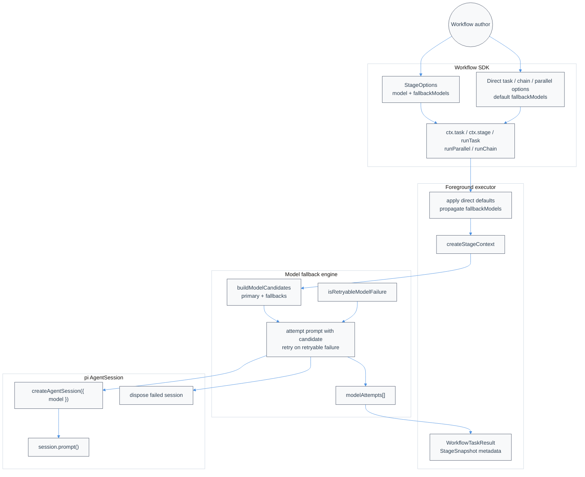

# @bastani/atomic-workflows Technical Design Document / RFC

| Document Metadata      | Details                         |
| ---------------------- | ------------------------------- |
| Author(s)              | Alex Lavaee                     |
| Status                 | Draft (WIP)                     |
| Team / Owner           | Atomic Workflows / pi Extension |
| Created / Last Updated | 2026-05-14                      |

## 1. Executive Summary

This RFC proposes adding a workflow-native `fallbackModels` option to `@bastani/atomic-workflows` so SDK-authored stages, direct tasks, parallel tasks, and chain steps can retry model/provider failures with an ordered list of alternate models. The feature is modeled after `nicobailon/pi-subagents`, where agent configs include `fallbackModels`, candidate lists are deduplicated and resolved against available models, retryable provider/model failures trigger the next candidate, and results record attempted models plus per-attempt usage/error metadata. The workflow version should be programmatic: workflow authors can write `ctx.task("review", { prompt, model, fallbackModels: [...] })` or `runTask({ name, prompt, model, fallbackModels })` without creating `.pi/agents` files. If the explicit primary and fallback list is exhausted at runtime, the workflow should make one final attempt with the user's currently selected model. The change improves reliability during rate limits, quota exhaustion, provider outages, authentication/config drift, and unavailable model IDs while defining the canonical single-model behavior when no fallbacks are configured, without preserving legacy API shapes or aliases.

Primary sources: local workflow SDK/runtime research (`research/docs/2026-05-14-local-atomic-workflows-api-analysis.md`, `research/docs/2026-05-14-local-atomic-workflows-locator.md`) and GitHub MCP inspection of `nicobailon/pi-subagents` fallback implementation (`src/runs/shared/model-fallback.ts`, `src/runs/foreground/execution.ts`, `src/runs/background/subagent-runner.ts`, `src/agents/agents.ts` at commit `635112deea068528d89694e58ca068ddc1fe4b2d`).

## 2. Context and Motivation

### 2.1 Current State

`@bastani/atomic-workflows` exposes a raw TypeScript workflow SDK from `src/index.ts` and shares its public types through `src/shared/types.ts`. Workflow authors can create stages with `ctx.stage(name, options?)`, invoke agent-backed prompts with `ctx.task`, run `ctx.chain` / `ctx.parallel`, and use direct SDK helpers `runTask`, `runParallel`, and `runChain` (`research/docs/2026-05-14-local-atomic-workflows-api-analysis.md`; `research/docs/2026-05-14-local-atomic-workflows-locator.md`).

Model selection already flows through the existing pi SDK option surface because `StageOptions` extends `CreateAgentSessionOptions`, and direct task options ultimately become `StageOptions` via `taskStageOptions`, `taskOptionsFromStep`, and `directTaskToStep` in `src/runs/foreground/executor.ts`. The stage runner then creates one `AgentSession` per stage and calls `session.prompt()` through `createStageContext` in `src/runs/foreground/stage-runner.ts`.

The current gap is that model configuration is single-shot:

- `StageOptions` can carry one `model`, but not a fallback sequence.
- `WorkflowTaskOptions`, `WorkflowDirectTaskItem`, `WorkflowDirectOptions`, and chain/parallel steps do not declare `fallbackModels`.
- `createStageContext` memoizes one `AgentSession` through `ensureSession()` and does not retry another model when session creation or prompt execution fails.
- `WorkflowTaskResult`, `WorkflowDetails`, and stage snapshots do not expose attempted model metadata.
- `src/extension/wiring.ts` forwards stage options to `createAgentSession` after stripping workflow-only fields, so any workflow-owned fallback field must be stripped before reaching the pi SDK.

`pi-subagents` already solves the equivalent reliability problem for file-based subagents. Its `AgentConfig` includes `fallbackModels?: string[]`, markdown frontmatter parses `fallbackModels`, builtin overrides can set or clear it, and both foreground and async execution paths build a candidate list and retry retryable model/provider failures (`nicobailon/pi-subagents` GitHub MCP: `src/agents/agents.ts`, `src/runs/shared/model-fallback.ts`, `src/runs/foreground/execution.ts`, `src/runs/background/subagent-runner.ts`).

### 2.2 The Problem

- **User Impact:** Workflow SDK users cannot express the same fallback behavior they already rely on in `.pi/agents` / pi-subagents. A transient rate limit or disabled primary model can fail an entire workflow stage even when a known alternate model is available.
- **Developer Impact:** Workflow authors must hand-roll retries around `ctx.task` or duplicate stages, which loses consistent metadata, risks repeated side effects, and scatters provider-error classification logic.
- **API Parity Gap:** Existing parity research explicitly maps pi-subagents direct execution and model-option surfaces into atomic workflows, but `fallbackModels` is not yet present in workflow-native types (`research/docs/2026-05-14-pi-subagents-api-parity-for-atomic-workflows.md`; `specs/2026-05-14-workflow-sdk-pi-subagents-api-parity.md`).
- **Observability Gap:** Without attempted-model metadata, users cannot tell whether a result came from the primary model or a fallback, nor why fallback occurred.

## 3. Goals and Non-Goals

### 3.1 Functional Goals

- [ ] Add a public `fallbackModels?: readonly string[]` option to workflow SDK model-bearing surfaces:
  - [ ] `StageOptions` / `ctx.stage(name, options)`;
  - [ ] `WorkflowTaskOptions` / `ctx.task(name, options)`;
  - [ ] `WorkflowTaskStep` / `ctx.chain` / `ctx.parallel`;
  - [ ] `WorkflowDirectTaskItem` / `runTask` / `runParallel` / `runChain`;
  - [ ] `WorkflowDirectOptions` as an optional default applied to direct tasks that do not set their own fallback list.
- [ ] Build ordered, deduplicated model candidate lists from `[model, ...fallbackModels]`, matching pi-subagents behavior where practical.
- [ ] Add a preflight model-availability validation step before starting any workflow run that uses user-specified `model` or `fallbackModels`; fail fast before store/session/workflow side effects if any requested model cannot be resolved to an available model.
- [ ] Retry only failures classified as retryable provider/model failures by default, borrowing and adapting pi-subagents' classification patterns.
- [ ] Append the user's currently selected model as an implicit final fallback candidate after explicit `model` and `fallbackModels` are exhausted, skipping it if already attempted.
- [ ] Define the canonical fallback behavior without adding backward-compatibility shims or legacy aliases; when `fallbackModels` is omitted, use the normal current/default model path as the canonical no-fallback behavior.
- [ ] Record model fallback metadata in workflow results and status surfaces:
  - [ ] selected/effective `model`;
  - [ ] `attemptedModels`;
  - [ ] `modelAttempts` with model, success, exit/error, and token/usage data when available.
- [ ] Ensure fallback attempts work for direct foreground SDK execution and background/named workflow execution because both share `createStageContext` and the foreground executor.
- [ ] Strip `fallbackModels` before passing options into `createAgentSession()` so the workflow SDK remains compatible with current pi SDK types.
- [ ] Add `fallbackModels` to the workflow tool schema for direct task, parallel task, and chain step payloads so tool calls can use the same fallback behavior as the SDK.
- [ ] Add Bun test coverage for type/API propagation, candidate resolution, retryability classification, retry success/failure behavior, result metadata, tool schema validation, and canonical single-model behavior.
- [ ] Keep the package raw TypeScript with no build step.

### 3.2 Non-Goals (Out of Scope)

- [ ] Do not implement a global `.pi/settings.json` workflow fallback policy in the MVP unless an open question resolves otherwise.
- [ ] Do not change pi-subagents itself or require pi-subagents to accept a top-level `fallbackModels` tool option.
- [ ] Do not retry ordinary task/tool/code failures such as failing tests, failed shell commands, missing files, or completion-guard failures.
- [ ] Do not guarantee side-effect-free retries for prompts that already executed mutating tools before a model/provider failure. The default retry policy should avoid non-model failures; implementation must document remaining risk.
- [ ] Do not add new provider-specific SDK dependencies or hardcode provider model catalogs.
- [ ] Do not add `dist/`, bundling, Node test runners, npm/yarn/pnpm workflows, or a compile step.

## 4. Proposed Solution (High-Level Design)

### 4.1 System Architecture Diagram



### 4.2 Architectural Pattern

Adopt a **workflow-owned fallback orchestration layer** around pi SDK `AgentSession` creation and prompting. The workflow SDK remains responsible for interpreting `fallbackModels`; each individual pi SDK session receives only one candidate `model`. On retryable model/provider failures, the stage runner disposes or abandons the failed candidate session, creates a new session for the next candidate, and replays the same prompt once.

This follows pi-subagents' pattern of wrapping execution attempts externally rather than expecting the child process or SDK provider to implement fallback internally. In pi-subagents, `buildModelCandidates()` combines primary and fallback models; `isRetryableModelFailure()` decides whether to continue; the foreground and async runners aggregate usage and attempts before returning (`nicobailon/pi-subagents` GitHub MCP: `src/runs/shared/model-fallback.ts`, `src/runs/foreground/execution.ts`, `src/runs/background/subagent-runner.ts`).

### 4.3 Key Components

| Component                     | Responsibility                                                                                            | Technology Stack                                             | Justification                                                                                  |
| ----------------------------- | --------------------------------------------------------------------------------------------------------- | ------------------------------------------------------------ | ---------------------------------------------------------------------------------------------- |
| `fallbackModels` public types | Add API surface to stage/task/direct options                                                              | TypeScript interfaces in `src/shared/types.ts`               | The SDK exports shared types from `src/index.ts`, so this is the canonical authoring contract. |
| Model fallback helper module  | Candidate building, suffix handling, retryable error classification, attempt-note formatting              | New `src/runs/shared/model-fallback.ts`                      | Mirrors pi-subagents helper module and keeps retry logic out of executor boilerplate.          |
| Model availability preflight  | Validate every user-specified primary and fallback model before execution begins                          | New runtime model catalog port + executor preflight          | Satisfies fail-fast requirement and prevents partial workflow starts for invalid model config. |
| Stage attempt loop            | Execute `createAgentSession` + `prompt` with candidate models                                             | `src/runs/foreground/stage-runner.ts`                        | All named/background/direct workflow execution eventually uses stage contexts.                 |
| Direct option propagation     | Apply default `fallbackModels` from direct options to items/steps                                         | `src/runs/foreground/executor.ts`                            | Direct helpers already centralize defaults in `directTaskWithDefaults`.                        |
| Metadata propagation          | Attach selected model and attempts to task results, details, store snapshots, persistence metadata        | `src/shared/types.ts`, `src/shared/store-types.ts`, executor | Users need to know when fallback happened and which model produced the output.                 |
| Tool/schema support           | Expose `fallbackModels` through workflow direct tool schemas for single, parallel, and chain execution | `src/extension/index.ts` / schema files                      | Tool calls should have the same fallback semantics as programmatic SDK/direct helper calls.     |

## 5. Detailed Design

### 5.1 API Interfaces

#### 5.1.1 Type additions

Add a reusable type:

```ts
export interface WorkflowModelAttempt {
  readonly model: string;
  readonly success: boolean;
  readonly error?: string;
  readonly usage?: {
    readonly input?: number;
    readonly output?: number;
    readonly cacheRead?: number;
    readonly cacheWrite?: number;
    readonly cost?: number;
    readonly turns?: number;
  };
}

export interface WorkflowModelFallbackFields {
  /** Ordered model IDs to try after `model` fails for a retryable provider/model reason. */
  readonly fallbackModels?: readonly string[];
}
```

Extend public option/result surfaces:

```ts
export interface StageOptions extends CreateAgentSessionOptions, WorkflowModelFallbackFields {
  // existing workflow-owned fields...
}

export interface CompleteStageOpts extends WorkflowModelFallbackFields {
  model?: string;
  maxTokens?: number;
}

export interface WorkflowTaskResult extends WorkflowTaskContext {
  readonly stageName: string;
  readonly sessionId?: string;
  readonly sessionFile?: string;
  readonly artifacts?: WorkflowArtifact[];
  readonly model?: string;
  readonly attemptedModels?: readonly string[];
  readonly modelAttempts?: readonly WorkflowModelAttempt[];
}

export interface WorkflowDirectOptions extends WorkflowModelFallbackFields {
  // existing direct defaults...
}
```

Because `WorkflowTaskOptions` and `WorkflowDirectTaskItem` already inherit from `StageOptions` through `WorkflowTaskSessionOptions`, adding `fallbackModels` at `StageOptions` gives workflow authors the desired programmatic surface:

```ts
await ctx.task("implementer", {
  prompt: "Implement the parser fix.",
  model: "anthropic/claude-sonnet-4",
  fallbackModels: ["openai/gpt-5-mini", "github-copilot/gpt-5-mini"],
});
```

Direct helper usage:

```ts
await runParallel([
  {
    name: "reviewer-a",
    prompt: "Review runtime code.",
    model: "claude-sonnet-4",
    fallbackModels: ["gpt-5-mini", "claude-haiku-4"],
  },
  {
    name: "reviewer-b",
    prompt: "Review tests.",
  },
], {
  fallbackModels: ["gpt-5-mini"],
});
```

Precedence:

1. Task/stage-local `fallbackModels` if present.
2. Direct-run-level `WorkflowDirectOptions.fallbackModels` for direct helpers and direct tool modes.
3. No fallback if neither is present.

The primary model remains `model`; `fallbackModels` never replaces `model` when the primary succeeds.

#### 5.1.2 Preflight validation interface

Add a runtime model-catalog validation seam so the executor can validate model inputs before starting a run:

```ts
export interface WorkflowModelInfo {
  readonly provider: string;
  readonly id: string;
  readonly fullId: string;
}

export interface WorkflowModelCatalogPort {
  listModels(): Promise<readonly WorkflowModelInfo[]>;
  /** Current user-selected model used as the implicit final fallback and as the safe fallback when catalog validation is unavailable. */
  currentModel?: string;
  readonly preferredProvider?: string;
}

export interface RunOpts {
  // existing fields...
  readonly models?: WorkflowModelCatalogPort;
}
```

Validation rules:

- Collect every user-specified `model` and `fallbackModels[]` from the workflow run surface before execution begins.
- Resolve each candidate through the same normalization rules used for fallback candidate building.
- Fail fast if any requested model is empty, ambiguous, or definitively unavailable in the runtime model catalog.
- If the runtime cannot list available models, fall back to the user's currently selected model instead of failing solely because validation metadata is unavailable.
- Return a structured workflow failure before creating stage snapshots, sessions, worktrees, output files, or background jobs.
- Include all invalid models in the error message so users can fix the full list at once.

For named workflows, static preflight can only validate model values visible in the workflow definition inputs/direct options before the workflow body starts. Dynamic model strings computed inside the run body should be validated at the point the stage/task is constructed, before that specific stage starts; this still prevents an invalid model from creating a session or partially executing the stage. If catalog lookup fails at either layer, resolve the task to the user's currently selected model when available and emit a warning rather than starting with an unvalidated user-specified model.

#### 5.1.3 Workflow tool schema addition

Updated scope: implement `fallbackModels` in the workflow tool schema in the same feature branch as the SDK/direct helpers. Direct tool payloads should accept the same field anywhere a programmatic task/stage option can specify `model`:

```ts
workflow({
  task: {
    name: "planner",
    prompt: "Plan the fallbackModels implementation.",
    model: "anthropic/claude-sonnet-4",
    fallbackModels: ["openai/gpt-5-mini"]
  }
})

workflow({
  tasks: [
    { name: "reviewer", task: "Review design", fallbackModels: ["gpt-5-mini"] }
  ],
  fallbackModels: ["claude-haiku-4"]
})
```

Schema requirements:

- Add `fallbackModels?: string[]` to the direct single-task payload, direct parallel task items, sequential chain items, and chain-parallel task items.
- Add top-level `fallbackModels?: string[]` to direct execution options so `workflow({ tasks: [...], fallbackModels: [...] })` and `workflow({ chain: [...], fallbackModels: [...] })` can provide defaults for child tasks that omit task-local fallbacks.
- Reject non-array and non-string values at schema validation time. Empty strings should be normalized away; an empty resulting list is equivalent to no explicit fallback list.
- Tool schema validation should share the same preflight model availability behavior as SDK helpers before starting the workflow.
- Named workflow calls should not use top-level `fallbackModels` as a hidden override for code-authored workflow stages unless the named workflow/direct mode explicitly maps it through its inputs or direct task payloads.

This is not required to satisfy the SDK-only use case, but it keeps the tool and SDK aligned with the pi-subagents parity direction documented in `specs/2026-05-14-workflow-sdk-pi-subagents-api-parity.md`.

### 5.2 Data Model / Schema

#### 5.2.1 Candidate and attempt internals

Create a helper module similar to pi-subagents:

```ts
export interface AvailableWorkflowModelInfo {
  readonly provider: string;
  readonly id: string;
  readonly fullId: string;
}

export interface WorkflowModelAttemptSummary {
  readonly model: string;
  readonly success: boolean;
  readonly error?: string;
  readonly usage?: WorkflowModelAttempt["usage"];
}

export function buildModelCandidates(input: {
  readonly primaryModel?: string;
  readonly fallbackModels?: readonly string[];
  readonly availableModels?: readonly AvailableWorkflowModelInfo[];
  readonly preferredProvider?: string;
}): string[];

export function isRetryableModelFailure(error: string | undefined): boolean;
```

Candidate rules adapted from pi-subagents `model-fallback.ts`:

- Iterate `[primaryModel, ...fallbackModels, currentModel]`, where `currentModel` is appended implicitly as the final safety-net candidate when available.
- Trim strings and skip empty values.
- Resolve bare IDs to provider-qualified IDs only when the model catalog has exactly one match or a preferred-provider match.
- Preserve explicit `provider/model` strings.
- Preserve suffix-like model modifiers if the implementation supports suffix splitting; otherwise pass them through unchanged.
- Deduplicate after normalization while preserving order, so the current model is not retried if it is already the primary or an explicit fallback.
- If no explicit model/fallback exists but `currentModel` is available, preserve current default behavior by using the selected model through the normal session defaults rather than recording it as an attempted fallback.

#### 5.2.2 Retryability classifier

Default retryable patterns should be copied or adapted from pi-subagents' `RETRYABLE_MODEL_FAILURE_PATTERNS`:

- rate limit / too many requests / `429`;
- quota, billing, credit;
- authentication, authorization, API key, token expired, forbidden;
- provider/model unavailable, disabled, not found, unknown model;
- overloaded, service temporarily unavailable;
- network/fetch/socket/upstream/timeouts;
- HTTP `502`, `503`, `504`.

Non-retryable by default:

- shell/tool/test failures;
- user code errors;
- validation errors unrelated to model/provider selection;
- completion guard / no-edit failures;
- HIL cancellation or user interrupts;
- abort/cancellation from workflow control.

### 5.3 Algorithms and State Management

#### 5.3.1 Model availability preflight

The implementation must validate user-provided model IDs before running model-backed work. This should happen in two layers:

1. **Run-level preflight for direct helpers/tool calls.** `runTask`, `runParallel`, and `runChain` have concrete task arrays before calling `run(...)`. They should collect all `model` and `fallbackModels` values after defaults/expansions and validate them once before creating worktrees, writing output files, or invoking the synthesized workflow.
2. **Stage-level preflight for named/dynamic workflows.** `ctx.stage` / `ctx.task` can receive model strings computed inside workflow code. Validate the stage's `model` and `fallbackModels` before `createAgentSession()` is called. If validation fails, fail the stage before any agent session starts.

Validation should reuse the fallback candidate resolver so the model that is validated is the model that would be attempted. Bare IDs follow pi-subagents behavior: if exactly one available model has that ID, resolve to its `fullId`; if multiple providers expose the same bare ID, prefer the current provider when supplied; otherwise mark the input ambiguous and fail fast.

Recommended error format:

```text
atomic-workflows: model validation failed before starting workflow.
Unavailable or ambiguous models:
- claude-sonnet-4 (ambiguous: anthropic/claude-sonnet-4, github-copilot/claude-sonnet-4; specify provider/model)
- openai/missing-model (not available)
```

If model validation fails because the catalog definitively rejects a model, the workflow result/status should be `failed`, with no model attempts recorded because no attempt was made. If the catalog itself is unavailable, the result should continue with `currentModel` and include a warning that requested model validation was skipped due to runtime catalog unavailability.

#### 5.3.1 Stage prompt fallback loop

Today `createStageContext` has one `ensureSession()` memoized promise and `prompt()` calls `session.prompt()`. The fallback design changes session creation from "one stage = one immutable session" to "one stage = one successful candidate session".

Algorithm:

1. Build model candidates from `stageOptions.model`, `stageOptions.fallbackModels`, and the runtime `currentModel` as an implicit final fallback.
2. If no explicit model/fallback was provided, keep the existing no-explicit-model path instead of forcing a redundant current-model attempt.
3. For `prompt(text, options)`:
   1. For each candidate:
      - create a session using `CreateAgentSessionOptions` with `model: candidate` and without `fallbackModels`;
      - apply pending thinking level and pending listeners;
      - call `session.prompt(text, sdkOptions)`;
      - on success, set `session` to the successful candidate session and expose its session metadata;
      - store `model`, `attemptedModels`, and `modelAttempts` for result/snapshot metadata;
      - stop.
   2. On failure:
      - format the thrown error or assistant/provider error as a string;
      - record a failed `WorkflowModelAttempt`;
      - if the error is not retryable or this is the final candidate, rethrow;
      - if explicit candidates are exhausted and `currentModel` has not been attempted, try `currentModel` once as the final candidate;
      - dispose the failed session best-effort;
      - retry with the next candidate.
4. Once a prompt succeeds, later calls on the same `StageContext` should use the successful session/model by default rather than re-running the fallback loop from the primary. This preserves stage continuity.

Recommended default: fallback applies to the first `prompt()` / `complete()` operation that creates work for the stage. After success, the stage is bound to that model/session.

#### 5.3.2 Session lifecycle and listeners

Implementation constraints:

- `fallbackModels` must be removed in `stripWorkflowOnlyOptions()` in `src/runs/foreground/stage-runner.ts` and in the equivalent `stripWorkflowOnlyOptions()` in `src/extension/wiring.ts` before calling `createAgentSession`.
- Failed candidate sessions must be disposed with `await session.dispose()` when available, but disposal failure should not mask the original model failure unless no retry remains.
- Pending subscribers registered before prompt execution should be attached to every candidate session so streaming/events continue to work for the successful attempt.
- If a failed candidate emitted partial assistant content before failure, implementation should not append that content to `lastAssistantText`. Attempt notes may be exposed separately in metadata or logs.
- Abort signals must stop the fallback loop. If the workflow is killed/paused, do not try the next model.

#### 5.3.3 Direct helpers and chains

Update direct helper propagation in `src/runs/foreground/executor.ts`:

- `directTaskWithDefaults()` should copy `options.fallbackModels` to a task only when the task does not set `fallbackModels`.
- `directTaskToStep()` should not strip `fallbackModels`; it is a stage option.
- Repeated tasks should preserve fallback lists.
- Chain parallel groups should preserve task-local fallbacks and inherited direct defaults.
- `ctx.chain` and `ctx.parallel` already delegate to `ctx.task`, so fallback behavior should be centralized in stage/task execution rather than duplicated in chain code.

#### 5.3.4 Usage and metadata aggregation

Where the pi SDK exposes token usage through session messages/events, aggregate per attempt if possible. If usage is unavailable, record attempts without usage rather than blocking the feature.

Recommended metadata shape:

```json
{
  "model": "openai/gpt-5-mini",
  "attemptedModels": ["anthropic/claude-sonnet-4", "openai/gpt-5-mini"],
  "modelAttempts": [
    {
      "model": "anthropic/claude-sonnet-4",
      "success": false,
      "error": "rate limit exceeded"
    },
    {
      "model": "openai/gpt-5-mini",
      "success": true,
      "usage": { "input": 1200, "output": 450, "turns": 1 }
    }
  ]
}
```

Expose this metadata in:

- `WorkflowTaskResult` returned by `ctx.task`, `ctx.chain`, `ctx.parallel`, and direct helpers.
- `WorkflowDetails.results[]` for direct helper/tool calls.
- `StageSnapshot` / status writer fields, if store types already carry model-like fields or can accept additive optional fields.
- Persistence entries if stage metadata is already persisted through `appendStageEnd` or equivalent.

### 5.4 Interaction with `complete()` and `subagent()`

`complete(text, { model, fallbackModels })` can use the same candidate helper if the complete adapter supports per-call `model`. Since `CompleteStageOpts` already carries `model`, extending it with `fallbackModels` is consistent.

For `stage.subagent(...)`:

- pi-subagents already supports `fallbackModels` in `AgentConfig` / agent files, not as a documented top-level execution option.
- The workflow adapter in `src/extension/wiring.ts` should not blindly forward workflow-owned `fallbackModels` to `subagent` unless pi-subagents adds that schema field.
- MVP recommendation: do not implement workflow-level fallback wrapping around subagent tool calls. Let the target subagent's `.pi/agents` / builtin config handle fallback. Revisit only if users need programmatic fallback for ad hoc subagent tool calls.

## 6. Alternatives Considered

| Option                                                                            | Pros                                                                                                                       | Cons                                                                                                       | Decision                                                            |
| --------------------------------------------------------------------------------- | -------------------------------------------------------------------------------------------------------------------------- | ---------------------------------------------------------------------------------------------------------- | ------------------------------------------------------------------- |
| A. SDK-stage fallback loop (selected)                                             | Programmatic, works for named and direct workflows, shares one implementation path, mirrors pi-subagents wrapping strategy | Requires careful session disposal/retry semantics                                                          | **Selected.** Best fit for workflow-sdk request.                    |
| B. Native pi SDK fallback option only                                             | Simpler workflow code if pi SDK adds support                                                                               | Not available today; would not match current pi-subagents implementation                                   | Rejected for MVP; keep adapter open to future native support.       |
| C. Ask users to define `.pi/agents` with fallbackModels and call `stage.subagent` | Already works for subagents; no workflow changes                                                                           | Not programmatic, does not help normal workflow `ctx.task`, requires separate agent files                  | Rejected because user explicitly wants workflow-sdk fallbackModels. |
| D. Retry every failed prompt with fallbacks                                       | Maximizes chance of success                                                                                                | Can repeat tool/code failures and side effects; hides real workflow bugs                                   | Rejected; use retryable model/provider classifier.                  |
| E. Global-only fallback policy                                                    | Easy to configure once                                                                                                     | Hard to reason about per-stage quality/cost tradeoffs; less parity with pi-subagents agent-specific config | Defer; per-stage/per-task first.                                    |

## 7. Cross-Cutting Concerns

### 7.1 Security and Privacy

- Do not log API keys, provider auth details, raw headers, or full SDK error objects; record sanitized error messages.
- Retrying authentication failures may be useful when fallback providers have different credentials, but the recorded error should remain concise.
- Fallback attempts may send the same prompt/context to a different provider. Documentation should warn users to choose fallback providers that satisfy their privacy and data-handling requirements.
- If future config supports global fallback providers, project/local config precedence should be explicit to prevent accidentally routing sensitive workflows to undesired providers.

### 7.2 Observability Strategy

- Add visible attempt metadata to direct helper results and status surfaces.
- Emit a concise notice when fallback occurs, similar to pi-subagents' `formatModelAttemptNote()`:
  - `[fallback] anthropic/claude-sonnet-4 failed: rate limit exceeded. Retrying with openai/gpt-5-mini.`
- Preserve final stage result text as the successful model's output, not a concatenation of failed attempts.
- When the implicit current-model fallback succeeds, metadata should make it clear that the selected model was used after explicit fallback exhaustion.
- Add structured metadata to status writers so CI or parent orchestrators can detect fallback use.
- Tests should assert metadata without relying on provider-specific real errors.

### 7.3 Scalability and Capacity Planning

- Fallback retries increase potential provider calls per stage by `1 + fallbackModels.length` only on retryable failures.
- Candidate deduplication prevents duplicate attempts when primary and fallback aliases resolve to the same model.
- The default policy should retry sequentially, not in parallel, to avoid unnecessary spend and provider load.
- Direct parallel workflows may multiply fallback attempts across many tasks. Existing concurrency limits still bound active stage prompts; fallback attempts should occur within the same stage slot.

### 7.4 Compatibility Policy — No Backward Compatibility Shims

- This feature should implement the new canonical `fallbackModels` contract directly; do not add compatibility shims for older or alternative API spellings.
- Do not accept legacy/alias fields such as `fallback_models`, `fallbackModel`, `models`, `modelFallbacks`, or subagent-style `agent` aliases in workflow-native task payloads unless they are already part of the canonical workflow API.
- Existing tests, docs, examples, and workflow definitions should be updated to the canonical contract rather than preserving old call shapes.
- Existing user workflows that rely on replaced or non-canonical workflow tool/direct execution fields may need source updates; that is acceptable for this change.
- Stripping workflow-owned fields such as `fallbackModels` before calling `createAgentSession()` is a runtime SDK-compatibility requirement, not a user-facing backward-compatibility promise.

## 8. Migration, Rollout, and Testing

### 8.1 Implementation Phases

- [ ] **Phase 1: Types, helper module, and validation seam**
  - Add `fallbackModels` to shared option types.
  - Add model candidate, availability-validation, and retryability helper tests based on pi-subagents behavior.
  - Add a `WorkflowModelCatalogPort` / `RunOpts.models` validation seam.
  - Add result metadata types.

- [ ] **Phase 2: Stage runner fallback loop**
  - Strip fallback fields from pi SDK session options.
  - Implement candidate session creation/retry/disposal.
  - Preserve abort/pause behavior.
  - Record successful model and attempts.

- [ ] **Phase 3: Executor/direct helper propagation and fail-fast preflight**
  - Apply direct default fallback models.
  - Validate all direct helper/tool model inputs before creating worktrees, sessions, output files, or background jobs.
  - Preserve fallback models through direct single, parallel, and chain helpers.
  - Attach metadata to `WorkflowTaskResult` and `WorkflowDetails`.

- [ ] **Phase 4: Extension/tool/schema support**
  - Add `fallbackModels` to direct workflow tool schemas and renderers.
  - Ensure `workflow` tool calls can pass task-local and top-level default fallback options.
  - Run the same model availability preflight for tool-supplied models before dispatch starts.
  - Update slash/docs only where direct tool syntax is exposed.

- [ ] **Phase 5: Documentation and examples**
  - Document SDK usage in README/docs.
  - Add a small example workflow stage using `fallbackModels`.
  - Mention privacy/cost considerations.

### 8.2 Data Migration Plan

No persistent data migration is required. Existing run snapshots and session entries remain valid because new model metadata fields are optional. Source-level migrations may be required for workflows or tool calls that use non-canonical/legacy field names; do not add compatibility shims for those shapes.

### 8.3 Test Plan

Use Bun commands only.

- **Unit tests**
  - `test/unit/model-fallback.test.ts` for helper and validation behavior:
    - explicit provider IDs unchanged;
    - bare model resolution when unique/preferred;
    - suffix/modifier preservation if implemented;
    - deduplication/order preservation;
    - retryable vs non-retryable error classification;
    - unavailable, ambiguous, empty, and duplicate model validation failures.
  - `test/unit/stage-runner.test.ts` for fallback loop:
    - primary success does not try fallback;
    - primary retryable failure tries fallback;
    - non-retryable failure does not try fallback;
    - failed candidate session is disposed;
    - abort does not continue to fallback;
    - metadata records attempts.
  - `test/unit/executor.test.ts` for propagation and fail-fast behavior:
    - `ctx.task` returns `modelAttempts`;
    - `ctx.chain` and `ctx.parallel` preserve task-local fallback lists;
    - direct options default fallback applies when task-local fallback is absent;
    - invalid direct models fail before worktree/session/output side effects;
    - invalid dynamic stage models fail before session creation.
  - Workflow tool schema/dispatcher tests:
    - accepts `fallbackModels` on direct single/parallel/chain payloads;
    - applies top-level direct fallback defaults to child tasks;
    - rejects invalid `fallbackModels` shapes before dispatch;
    - fails fast before background run acceptance when tool-supplied models are invalid.
  - `test/unit/wiring-adapters.test.ts` for option stripping:
    - `fallbackModels` is not passed to `createAgentSession`;
    - `model` candidate is passed per attempt.

- **Integration tests**
  - Direct `runTask` with a stub `AgentSessionAdapter` that fails first candidate and succeeds second.
  - `runParallel` with one task falling back and another using primary.
  - Named workflow background run preserving fallback metadata in status/store snapshots.
  - Background/direct run with unavailable model returns failed status before workflow execution starts.

- **Type/API tests**
  - Public entrypoint fixture compiles with `fallbackModels` on `ctx.task` and direct helper items.
  - No `any`/`unknown` regressions; satisfy strict TypeScript and `noUnusedLocals` / `noUnusedParameters`.

- **Validation commands**
  - `bun test test/unit/model-fallback.test.ts`
  - `bun test test/unit/stage-runner.test.ts`
  - `bun test test/unit/executor.test.ts`
  - `bun run typecheck`
  - Broader `bun run test:unit` after focused tests pass.

## 9. Open Questions / Unresolved Issues

- [x] **Q1: Scope of the first implementation.** Should `fallbackModels` be SDK-only first, or should the same spec require `workflow` tool schema/direct-call support in the same implementation branch?
  - Updated resolution: include both SDK/direct helper support and workflow tool schema/direct-call support in the same implementation branch.

- [x] **Q2: Session retry semantics.** Should fallback recreate a fresh `AgentSession` per candidate, or attempt `session.setModel(next)` on the same session and retry the prompt?
  - Resolved: recreate a fresh `AgentSession` per candidate, dispose failed sessions best-effort, and bind the stage to the first successful session.

- [x] **Q3: Retry trigger strictness.** Should fallback use pi-subagents' broad retryable pattern list, a narrower provider-only list, or a caller-configurable policy?
  - Resolved: retry model/provider failures only, using the pi-subagents-style broad provider failure list for rate limits, quota/auth/provider outages, unavailable models, network/timeout, and 5xx errors. Do not retry ordinary tool/task/code failures.

- [x] **Q4: Global defaults.** Should `fallbackModels` be configurable globally in workflow runtime config, or only programmatically per stage/task/direct run?
  - Resolved: programmatic only in MVP. Do not add global runtime defaults in the first implementation.

- [x] **Q5: Subagent bridge behavior.** Should `ctx.stage(...).subagent({ model, fallbackModels })` wrap repeated `subagent` tool calls, or should fallback remain owned by target `.pi/agents` configs?
  - Resolved: do not wrap subagent tool calls in MVP. Fallback for subagents remains owned by pi-subagents agent configuration.

- [x] **Q6: Attempt metadata placement.** Should `modelAttempts` be exposed only in `WorkflowTaskResult`/`WorkflowDetails`, or also in `StageSnapshot` and persistence entries?
  - Resolved: expose fallback metadata in SDK/direct helper results and workflow status snapshots. Do not require persistence/session-entry writes in the first implementation.

- [x] **Q7: Model catalog availability failure.** If the runtime cannot list available models, should workflows with user-specified `model`/`fallbackModels` fail closed or skip validation?
  - Resolved: do not fail solely because the catalog is unavailable. Fall back to the user's currently selected model, emit a warning, and only fail fast when the runtime can definitively identify invalid/ambiguous model inputs or when no current model is available.

- [x] **Q8: Final fallback after explicit list exhaustion.** If the primary `model` and explicit `fallbackModels` all fail at runtime, should the workflow fail immediately or try the user's currently selected model?
  - Resolved: append the user's currently selected model as an implicit final fallback candidate. Skip it if already attempted; if it is unavailable or absent, fail with the last explicit candidate error.

- [x] **Q9: Backward compatibility.** Should implementation preserve older workflow tool/direct execution spellings or add aliases for compatibility?
  - Resolved: no backward compatibility shims. Implement the canonical `fallbackModels` contract only and update tests/docs/examples to the new shape.

## 10. References

- `research/docs/2026-05-14-pi-subagents-api-parity-for-atomic-workflows.md` — maps pi-subagents API/tool/execution semantics to atomic workflows and identifies local parity surfaces.
- `research/docs/2026-05-14-local-atomic-workflows-api-analysis.md` — documents current workflow SDK exports, stage/task helpers, direct execution, and extension tool behavior.
- `research/docs/2026-05-14-local-atomic-workflows-locator.md` — locates SDK, shared types, foreground/background runners, wiring, schemas, and tests.
- `research/docs/2026-02-03-model-params-workflow-nodes-message-queuing.md` — historical model-parameter research supporting SDK-first model handling.
- `specs/2026-05-14-workflow-sdk-pi-subagents-api-parity.md` — broader workflow SDK/tool parity RFC.
- GitHub MCP: `nicobailon/pi-subagents@635112deea068528d89694e58ca068ddc1fe4b2d/src/runs/shared/model-fallback.ts` — fallback candidate resolution and retryability helper.
- GitHub MCP: `nicobailon/pi-subagents@635112deea068528d89694e58ca068ddc1fe4b2d/src/runs/foreground/execution.ts` — foreground execution attempt loop and metadata aggregation.
- GitHub MCP: `nicobailon/pi-subagents@635112deea068528d89694e58ca068ddc1fe4b2d/src/runs/background/subagent-runner.ts` — async/background fallback attempt loop and status metadata.
- GitHub MCP: `nicobailon/pi-subagents@635112deea068528d89694e58ca068ddc1fe4b2d/src/agents/agents.ts` — `AgentConfig.fallbackModels`, frontmatter parsing, and overrides.
