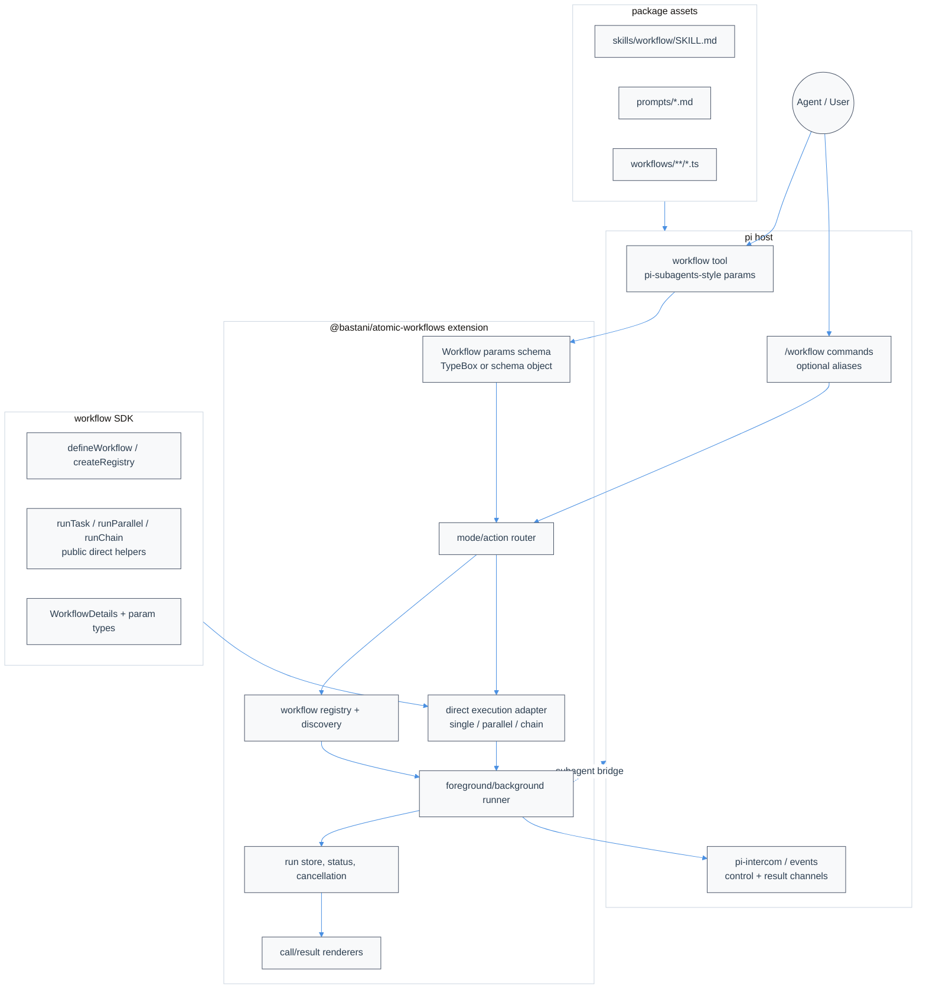

# @bastani/atomic-workflows Technical Design Document / RFC

| Document Metadata      | Details |
| ---------------------- | ------- |
| Author(s)              | Norin Lavaee |
| Status                 | Draft (WIP) |
| Team / Owner           | Atomic Workflows / pi Extension |
| Created / Last Updated | 2026-05-14 |

## 1. Executive Summary

This RFC proposes a clean rewrite of `@bastani/atomic-workflows` so the workflow SDK and `workflow` tool follow the API design proven by `nicobailon/pi-subagents` without backward-compatibility shims. Today, `workflow` is registry-oriented (`list`, `inputs`, `run`, `status`, `kill`, `resume`) and SDK-authored workflows can use internal `ctx.task`, `ctx.chain`, and `ctx.parallel` helpers, but ad hoc tool calls cannot directly express single-task, parallel, or chain execution. The proposed solution replaces the current workflow SDK/tool surface with a pi-subagents-style direct execution layer, unified result envelope, packaged workflow skill/prompt assets, read-only inspection/diagnostics, and first-class intercom routing. The impact is a simpler, cleaner orchestration API that lets agents use `workflow` with the same orchestration patterns as `subagent`: inspect available definitions, run direct chains, fan out parallel tasks, track/interrupt/resume background work, and coordinate decisions/results over pi-intercom.

Primary research source: `research/docs/2026-05-14-pi-subagents-api-parity-for-atomic-workflows.md`.

Design-direction rule: if implementation encounters ambiguity not resolved by this spec, use GitHub MCP to inspect `nicobailon/pi-subagents` as the authoritative reference implementation for API shape, routing semantics, result envelopes, worktree isolation, intercom behavior, package assets, and skill/prompt guidance. Prefer adapting the observed pi-subagents design into workflow-native terms over inventing a new pattern.

## 2. Context and Motivation

### 2.1 Current State

`@bastani/atomic-workflows` ships as raw TypeScript and registers a pi extension plus bundled workflow directory through `package.json` (`package.json`, `research/docs/2026-05-14-local-atomic-workflows-api-analysis.md`). The public SDK currently exports:

- `defineWorkflow`, `createRegistry`, workflow identity helpers, shared types, foreground `run`, graph/store helpers, and cancellation helpers (`src/index.ts`, summarized in `research/docs/2026-05-14-local-atomic-workflows-api-analysis.md`).
- A workflow authoring DSL that compiles frozen sentinel-bearing `WorkflowDefinition` objects (`research/docs/2026-05-12-workflow-authoring-registry-core.md`).
- Runtime helpers inside workflow bodies: `ctx.task`, `ctx.chain`, `ctx.parallel`, and `ctx.stage(...).subagent(...)` (`src/shared/types.ts`, `research/docs/2026-05-14-local-workflow-patterns.md`).

The pi extension currently registers:

- Tool `workflow` with fields `name`, `inputs`, `action`, and `id`.
- Actions `list`, `inputs`, `run`, `status`, `kill`, and `resume`.
- Slash commands `/workflow` and `/workflows-doctor`.
- Background/detached run execution, store-backed status, cancellation, read-only resume snapshots, lifecycle hooks, widgets, and intercom control subscription (`research/docs/2026-05-12-extension-intercom-pi-integration-surfaces.md`).

By contrast, `pi-subagents` centers on a single high-surface-area tool named `subagent` with mutually exclusive direct execution modes (`agent`, `tasks`, `chain`), management/control actions, async controls, output/session controls, slash commands, package-level skills/prompts, and intercom-oriented parent orchestration guidance (`research/docs/2026-05-14-pi-subagents-api-parity-for-atomic-workflows.md`).

### 2.2 The Problem

- **User Impact:** Agents must know two different orchestration models: `subagent` for ad hoc direct orchestration and `workflow` for named definitions only.
- **Developer Impact:** Workflow authors already have chain/parallel primitives in SDK code, but the tool API cannot expose those primitives without first writing a named workflow.
- **Integration Gap:** Current intercom wiring handles subagent control messages, but workflows do not provide a pi-subagents-style result/control envelope for parent orchestrators.
- **Packaging Gap:** The package does not yet ship workflow-specific skill and prompt assets analogous to `pi-subagents` package-level `skills/` and `prompts/` entries.
- **Parity Gap:** Current result types are action-specific; they do not provide one `Details`-style envelope for execution mode, run id, artifacts, progress, control events, and chain metadata.

## 3. Goals and Non-Goals

### 3.1 Functional Goals

- [ ] Replace the current workflow SDK/tool API with a clean pi-subagents-inspired workflow API; do not add legacy compatibility shims.
- [ ] Add pi-subagents-style direct execution modes to the `workflow` tool:
  - [ ] single task execution;
  - [ ] top-level parallel task execution;
  - [ ] sequential/parallel chain execution.
- [ ] Add SDK-level public types and helper functions for direct task/parallel/chain execution so tool behavior is not extension-only.
- [ ] Ensure `ctx.task` and direct task items accept the full `createAgentSession()` option surface, including `model`, `tools`, reasoning/thinking effort, MCP/tool controls, and future session options without requiring separate task-specific shims.
- [ ] Define a unified `WorkflowDetails` result envelope modeled after pi-subagents `Details` while using workflow-native terminology.
- [ ] Add read-only workflow inspection and diagnostics actions; do not add `create/update/delete` CRUD in MVP.
- [ ] Extend workflow intercom support for parent-session naming, control requests, notifications, and result delivery.
- [ ] Add worktree isolation for direct parallel and chain-parallel execution, modeled after pi-subagents' `worktree` flag.
- [ ] Package a `workflow` skill and prompt shortcuts so agents learn orchestration patterns without reading code.
- [ ] Keep raw TypeScript distribution: no build step, no `dist/`, no bundling.
- [ ] Add TypeScript and Bun test coverage for schema validation, dispatch routing, direct execution, intercom routing, result rendering, slash behavior, and package metadata.

### 3.2 Non-Goals (Out of Scope)

- [ ] Do not introduce a second tool solely for legacy compatibility; `workflow` is the canonical rewritten surface.
- [ ] Do not preserve old SDK names/signatures unless they are also the desired clean API.
- [ ] Do not generate executable TypeScript workflow files from management actions in the MVP; executable workflow authoring remains a code-level SDK task.
- [ ] Do not add recipe CRUD in MVP; saved direct-execution recipes may be revisited later.
- [ ] Do not add direct-execution slash commands; slash remains limited to the rewritten named-workflow and diagnostics surface.
- [ ] Do not implement pi-subagents agent discovery; workflows should remain workflow-native and may bridge to subagents where appropriate.
- [ ] Do not add Node/npm/yarn/pnpm development commands or a build pipeline.
- [ ] Do not implement a new frontend UI surface beyond existing workflow widgets/overlay unless explicitly required by an open question.

## 4. Proposed Solution (High-Level Design)

### 4.1 System Architecture Diagram



### 4.2 Architectural Pattern

The design uses an **action-discriminated orchestration facade**: one rewritten `workflow` tool accepts mutually exclusive execution modes and read-only control/inspection actions, validates them at the boundary, then routes to workflow-native runtime primitives. This mirrors `pi-subagents` while keeping workflow definitions as a first-class concept without retaining legacy argument shims.

### 4.3 Key Components

| Component | Responsibility | Technology Stack | Justification |
| --------- | -------------- | ---------------- | ------------- |
| Workflow params schema | Describe direct execution, named workflow, read-only inspection, control, output, and intercom fields | TypeScript + TypeBox or existing schema style | `pi-subagents` uses TypeBox; local `ask_user_question` already uses TypeBox (`research/docs/2026-05-14-local-atomic-workflows-api-analysis.md`). |
| Mode/action router | Validate exactly one mode and dispatch actions before normal execution | `src/extension/index.ts`, `src/extension/dispatcher.ts` | Mirrors `subagent` routing semantics (`research/docs/2026-05-14-pi-subagents-api-parity-for-atomic-workflows.md`). |
| Direct execution adapter | Convert ad hoc single/parallel/chain payloads into ephemeral workflow execution plans or direct foreground calls | `src/runs/foreground/executor.ts`, new SDK module | Uses the rewritten `ctx.task`, `ctx.chain`, `ctx.parallel` as the semantic source. |
| Unified result envelope | Represent mode, run id, status, outputs, progress, artifacts, control events, and chain metadata | `src/shared/types.ts`, renderers | Avoids divergent action-specific states and enables intercom delivery. |
| Intercom bridge | Parent session registration, control prompt routing, notifications, and result events | `src/intercom/*`, `pi.events`, optional `pi.ui.confirm` | Local research identifies existing intercom integration points; parity requires workflow-native events (`research/docs/2026-05-12-extension-intercom-pi-integration-surfaces.md`). |
| Skill/prompt assets | Teach agents how and when to use workflows | `skills/workflow/SKILL.md`, `prompts/*.md`, package `pi.skills`/`pi.prompts` | `pi-subagents` packages skill/prompt guidance as part of API ergonomics. |

## 5. Detailed Design

### 5.1 Public Tool Interface

#### 5.1.1 Named-workflow mode (rewritten clean surface)

Named workflow execution remains an intentional feature, but the API is not constrained by the current implementation. Use one canonical shape and reject legacy alternatives instead of normalizing them.

```ts
workflow({ action: "list" })
workflow({ action: "inputs", workflow: "deep-research-codebase" })
workflow({ workflow: "deep-research-codebase", inputs: { prompt: "..." } })
workflow({ action: "status", runId: "run-prefix" })
workflow({ action: "interrupt", runId: "run-prefix" })
workflow({ action: "resume", runId: "run-prefix" })
```

Canonical field decisions:

- `workflow` identifies a named workflow definition.
- `runId` identifies an execution for status/interrupt/resume.
- `name` is reserved for direct task/stage labels and is not accepted as a run-control id shim.
- `kill` is replaced by `interrupt` unless a hard-cancel action is explicitly desired in the clean API.

#### 5.1.2 Direct single-task mode

Resolved decision: direct execution should be expressed in terms of the workflow task primitive, not a new agent-management concept. The SDK source of truth is `ctx.task(name, { prompt, ...createAgentSessionOptions })`, which keeps the unit clear for agent-backed work while leaving room for deterministic tool-call tasks outside agent blocks.

Recommended tool shape:

```ts
workflow({
  task: {
    name: "reviewer",
    prompt: "Review the authentication module and summarize risks.",
    context: "fresh",
    model: "anthropic/claude-sonnet-4",
    output: "reviews/auth.md"
  }
})
```

Clean-break rule:

- Do not accept `agent` or `stage` as aliases in the workflow tool schema. `name` is the canonical task label.

#### 5.1.3 Direct parallel mode

```ts
workflow({
  tasks: [
    { name: "api-reviewer", task: "Review API surfaces", output: "api.md" },
    { name: "runtime-reviewer", task: "Review runtime behavior", output: "runtime.md" }
  ],
  concurrency: 2,
  async: true,
  intercom: { delivery: "result" }
})
```

Canonical fields:

- `tasks[].name` maps directly to the first argument of `ctx.task(name, ...)`.
- `agent`/`stage` aliases are intentionally not supported.
- `count` repeats a task item as in `pi-subagents`.
- `outputMode: "inline" | "file-only"` follows pi-subagents semantics where implemented.

#### 5.1.4 Direct chain mode

```ts
workflow({
  chain: [
    { name: "researcher", task: "Research {task}", output: "research.md" },
    { parallel: [
      { name: "reviewer-a", task: "Review {previous}" },
      { name: "reviewer-b", task: "Find gaps in {previous}" }
    ]},
    { name: "planner", task: "Create a plan from {previous}" }
  ],
  task: "workflow-sdk parity with pi-subagents",
  chainDir: ".pi/workflows/runs/parity",
  progress: true
})
```

Template defaults should match pi-subagents research:

- First sequential step with missing task defaults to `{task}`.
- Later sequential steps with missing task default to `{previous}`.
- Parallel tasks with missing task default to `{previous}`.
- Parallel output paths should be namespaced to avoid collisions (`research/docs/2026-05-14-pi-subagents-api-parity-for-atomic-workflows.md`).

#### 5.1.5 Management and diagnostics mode

Proposed actions:

```ts
type WorkflowAction =
  | "list" | "get" | "inputs" | "run"
  | "status" | "interrupt" | "resume" | "doctor";
```

Workflow-native meanings:

| Action | Meaning |
| ------ | ------- |
| `list` | List named workflows and their descriptions. |
| `get` | Return details for a named workflow. |
| `inputs` | Return input schema for a named workflow. |
| `run` | Run a named workflow when `name` is present and no direct execution mode is present. |
| `status` | Return list/detail status from the run store. |
| `interrupt` | Canonical control action for pausing/soft-interrupting or cancelling an active workflow according to the rewritten runtime semantics. |
| `resume` | Return/resume snapshot according to rewritten workflow overlay semantics. |
| `doctor` | Return workflow extension diagnostics equivalent to `/workflows-doctor`. |

Resolved decision: `create`, `update`, and `delete` are not MVP workflow-tool actions. Workflow definitions remain code-authored and direct-execution recipes are deferred.

### 5.2 Public SDK Interface

Add workflow-native public types to `src/shared/types.ts` or a new `src/workflows/direct-types.ts` and export them from `src/index.ts`:

```ts
export interface WorkflowTaskSessionOptions extends CreateAgentSessionOptions {
  /** Prompt text. Use exactly one prompt field in the final clean schema. */
  prompt: string;
  /** Optional task-local working directory. */
  cwd?: string;
  /** Optional output artifact path or disabled output. */
  output?: string | false;
  outputMode?: "inline" | "file-only";
  reads?: string[] | false;
  progress?: boolean;
  /** Workflow-owned worktree isolation; not forwarded directly to createAgentSession(). */
  worktree?: boolean;
}

export interface WorkflowDirectTaskItem extends WorkflowTaskSessionOptions {
  /** Task/stage label passed to ctx.task(name, ...). */
  name: string;
  /** Repeat count for direct parallel expansion. */
  count?: number;
}

export interface WorkflowChainStep extends WorkflowDirectTaskItem {
  parallel?: WorkflowDirectTaskItem[];
  concurrency?: number;
  failFast?: boolean;
}

export interface WorkflowDetails {
  mode: "named" | "single" | "parallel" | "chain" | "inspection" | "control" | "doctor";
  action?: WorkflowAction;
  runId?: string;
  status: "accepted" | "running" | "completed" | "failed" | "killed" | "noop";
  context?: "fresh" | "fork";
  results?: WorkflowTaskResult[];
  output?: Record<string, unknown>;
  progress?: WorkflowProgressSummary;
  artifacts?: WorkflowArtifact[];
  controlEvents?: WorkflowControlEvent[];
  intercom?: WorkflowIntercomSummary;
  warnings?: string[];
  error?: string;
}
```

Add direct SDK helpers as part of the rewritten SDK. These helpers may reuse useful executor internals, but their signatures should be designed cleanly rather than wrapped around the current public API:

```ts
runTask(options, runOptions?)
runParallel(tasks, options?, runOptions?)
runChain(chain, options?, runOptions?)
```

Implementation guidance for a future implementation phase:

- Synthesize an ephemeral workflow execution plan for direct execution so one runtime owns run ids, store snapshots, cancellation, persistence, and UI behavior.
- Do not duplicate foreground executor logic.
- Make `ctx.task`, `ctx.chain`, and `ctx.parallel` the clean source for direct mode semantics, even if their current implementation is rewritten.
- Define `ctx.task(name, options)` so `options` extends the complete `createAgentSession()` options type. Do not manually re-list only `model`, `tools`, or reasoning effort in the public task API; use the upstream session option type as the base and layer workflow-owned fields (`prompt`, `output`, `reads`, `progress`, `worktree`) on top.

### 5.3 Schema Strategy

Resolved decision: define the rewritten `workflow` parameters in TypeBox and derive/export TypeScript types from those schemas.

Rationale:

- `pi-subagents` uses TypeBox for its public tool schema (`research/docs/2026-05-14-pi-subagents-api-parity-for-atomic-workflows.md`).
- This repository already uses TypeBox successfully for `ask_user_question` (`research/docs/2026-05-14-local-atomic-workflows-api-analysis.md`).
- The expanded schema has nested task, chain, control, output, and intercom structures that are safer to maintain with reusable schema fragments.
- Task schema fragments should mirror the full `createAgentSession()` option surface as closely as pi's tool schema allows, including model selection, tools/tool allowlists, reasoning or thinking effort, and future session options.

Acceptance rule: the schema must reject ambiguous invocations where more than one primary execution mode is present, except for `task` as the root chain task when `chain` is present.

### 5.4 Runtime Routing

Routing order should mirror pi-subagents:

1. Validate canonical fields and reject legacy aliases rather than normalizing them.
2. Detect action mode. Handle `doctor`, `status`, `resume`, `interrupt`, and read-only inspection actions before normal execution.
3. Validate exactly one normal execution mode:
   - named workflow run;
   - direct single task;
   - direct parallel tasks;
   - direct chain.
4. Enforce recursion/depth and concurrency limits using the rewritten runtime config.
5. Expand repeated parallel items (`count`).
6. Resolve effective context (`fresh` / `fork`) and stage options.
7. Initialize run/session/artifact paths.
8. Route to foreground or detached/background execution.
9. Emit/render a `WorkflowDetails` envelope.
10. Publish intercom notifications/results when requested or configured.

### 5.5 Intercom Design

Local intercom research shows stable parent-session registration and `subagent:control-intercom` routing points (`research/docs/2026-05-12-extension-intercom-pi-integration-surfaces.md`). The rewrite should use those integration points as design input, but implement workflows as first-class intercom participants rather than only consumers of subagent events.

Proposed additions:

| Channel / API | Direction | Purpose |
| ------------- | --------- | ------- |
| `workflow:control-intercom` | child/direct workflow → parent | Workflow needs a decision, acknowledgement, or parent attention. |
| `workflow:control-intercom:response` | parent → child/direct workflow | Parent response to decision requests. |
| `workflow:result-intercom` | workflow → parent session | Deliver completed async, parallel, or chain results without relying only on tool return text. |
| `subagent:control-intercom` bridge | subagent child → workflow parent | Support child subagent control routing as a first-class integration, not as a legacy shim. |

Workflow tool options:

```ts
interface WorkflowIntercomOptions {
  enabled?: boolean;
  delivery?: "off" | "notify" | "result" | "control-and-result";
  parentSession?: string;
  notifyOn?: Array<"active_long_running" | "needs_attention" | "completed" | "failed">;
}
```

Default recommendation:

- Keep intercom disabled for simple foreground calls unless the host/session already uses intercom.
- Enable result delivery and control notifications for async direct parallel/chain runs by default when pi-intercom is available.
- Keep `subagent:control-intercom` handling because workflow stages may invoke subagents; treat it as an intentional cross-extension contract, not backward compatibility.

### 5.6 Package Assets: Skill and Prompts

Resolved decision: package workflow skill and prompts through npm/pi package assets only. Do not mirror these assets into project-local `.agents/skills` for MVP.

Update package metadata to include workflow skill and prompts:

```json
{
  "files": [
    "src/**/*.ts",
    "workflows/**/*.ts",
    "skills/**/*",
    "prompts/**/*",
    "README.md",
    "CHANGELOG.md",
    "LICENSE"
  ],
  "pi": {
    "extensions": ["./src/extension/index.ts"],
    "workflows": ["./workflows"],
    "skills": ["./skills"],
    "prompts": ["./prompts"]
  }
}
```

Add `skills/workflow/SKILL.md` covering:

- when to use `workflow` instead of `subagent`;
- named workflow discovery and execution;
- direct single/parallel/chain examples;
- async/status/interrupt/resume controls;
- intercom result/control semantics;
- parent-orchestrator safety rules;
- prompt shortcut examples;
- limitations and differences from `pi-subagents`.

Add prompt shortcuts analogous to pi-subagents, but workflow-native:

- `workflow-gather-context-and-clarify.md`
- `workflow-parallel-research.md`
- `workflow-parallel-review.md`
- `workflow-handoff-plan.md`
- `workflow-cleanup.md`

### 5.7 Slash Command Strategy

Resolved decision: MVP should not add new slash commands for direct execution. Slash remains focused on running named workflows and diagnostics:

```txt
/workflow [workflowName] [key=value...]
/workflow list
/workflow inputs <name>
/workflow status [id|--all]
/workflow interrupt <id|--all>
/workflow resume <id>
/workflows-doctor
```

Direct single/parallel/chain orchestration should be encoded in workflow code through `ctx.stage(...)`, `ctx.task(...)`, `ctx.chain(...)`, and `ctx.parallel(...)`. The expanded direct-execution API is primarily a tool/SDK surface, not an MVP slash surface.

### 5.8 Saved Recipe Data Model

Resolved decision: saved recipe CRUD is out of MVP scope. The implementation should not add `.pi/workflows/recipes` discovery or `create/update/delete` behavior in this phase.

Future consideration: if saved recipes are reintroduced, prefer a non-executable JSON format over generated TypeScript modules, and keep recipe discovery separate from compiled `WorkflowDefinition` discovery.

## 6. Alternatives Considered

| Option | Pros | Cons | Reason for Rejection / Selection |
| ------ | ---- | ---- | -------------------------------- |
| Replace `workflow` API with exact `subagent` schema | Maximum mechanical parity | Workflow concepts do not map perfectly to agents | Rejected. The rewrite should be inspired by pi-subagents, not a blind clone. |
| Add a second tool such as `workflow_direct` | Avoids overloading `workflow`; cleaner schema split | Agents must learn another tool; weakens parity with `pi-subagents` single-tool design | Rejected for MVP. |
| Clean rewrite of `workflow` | Produces one coherent API without shims; matches the user's rewrite intent | Requires migrating existing callers/tests | Selected. |
| Manage executable workflow files through `create/update/delete` | Closer to code-generation workflow authoring | Security, validation, and trust risks; hard to maintain raw TS safely | Rejected for MVP. |
| Manage saved JSON recipes | Safe, inspectable, workflow-native; supports pi-subagents-style management | Less powerful than authoring real workflows | Deferred; no CRUD in MVP. |
| Copy `/run`, `/chain`, `/parallel` exactly | Strong slash parity | Namespace conflicts with other extensions; direct orchestration should live in workflow code | Rejected for MVP. |

## 7. Cross-Cutting Concerns

### 7.1 Security and Privacy

- Management actions must not write executable TypeScript in MVP.
- No recipe writes occur in MVP because CRUD is out of scope.
- Output/read paths must be resolved relative to allowed working directories and documented clearly.
- Intercom payloads may contain task outputs; foreground result delivery should remain explicit, while async direct parallel/chain runs auto-deliver results when pi-intercom is available.
- Worktree isolation must create per-task isolated worktrees only from a clean git state, surface setup failures clearly, and clean up or report retained worktrees deterministically.
- The `workflow` tool schema should reject ambiguous modes to avoid unexpected execution.

### 7.2 Observability Strategy

- Extend `WorkflowDetails` with `runId`, `mode`, `status`, `progress`, `artifacts`, `warnings`, and `controlEvents`.
- Use rewritten store snapshots as the source of truth for status.
- Emit lifecycle events for direct single/parallel/chain runs through the same store/persistence path as named workflows.
- Add doctor diagnostics for:
  - direct execution support;
  - unsupported CRUD action handling;
  - skill/prompt package registration;
  - intercom capability and channel subscription status;
  - worktree isolation capability, active worktree paths, retained worktree diagnostics, and diff/artifact summaries;
  - subagent bridge availability.

### 7.3 Scalability and Capacity Planning

- Use the rewritten runtime concurrency config for direct parallel and chain parallel steps.
- Respect the rewritten depth guard for direct executions that call workflows/subagents recursively.
- Expand `count` before scheduling, then validate against a configured maximum if introduced.
- Use file output and `outputMode: "file-only"` for large fan-out results.
- Run isolated parallel tasks in separate git worktrees when `worktree: true`, collect per-worktree diffs as artifacts, and avoid filesystem conflicts between parallel children.
- Avoid holding full intercom result payloads in memory when output files are requested.

### 7.4 Migration Posture

This is a clean rewrite. Backward compatibility is explicitly not a goal.

- Legacy tool arguments such as `name` for run control, direct `agent`/`stage` aliases, and `kill` shims should be rejected rather than normalized.
- Existing callers and tests should be migrated to the new contract.
- Existing implementation internals may be reused where they fit the new design, but public compatibility wrappers should not be introduced.

## 8. Migration, Rollout, and Testing

### 8.1 Deployment Strategy

- [ ] Phase 1: Replace public types with clean TypeBox schema fragments and a result envelope; update tests to the new contract instead of preserving current behavior.
- [ ] Phase 2: Add direct execution helpers and route single-task direct tool calls through ephemeral workflow definitions.
- [ ] Phase 3: Add parallel and chain direct tool modes, including template defaults, `count`, output handling, artifact paths, progress output, concurrency behavior, and worktree isolation.
- [ ] Phase 4: Add workflow-native control events, intercom result/control channels, automatic async direct-run intercom delivery when available, worktree artifact/diff reporting, and doctor diagnostics.
- [ ] Phase 5: Add package-level skill and prompt assets, package metadata entries, slash docs, and prompt shortcut tests.
- [ ] Phase 6: Validate the new slash contract and docs: slash remains named-workflow oriented, while direct orchestration belongs in workflow code and tool/SDK calls.

### 8.2 Data Migration Plan

Existing workflow definitions and callers may require migration because this is a clean SDK rewrite. The implementation should provide documentation and examples for the new API, not runtime shims.

Saved recipe migration is not required for MVP because recipe CRUD is out of scope.

### 8.3 Test Plan

Use Bun only, per repository instructions.

- **Unit Tests:**
  - schema validation for mutually exclusive modes and rejection of legacy aliases;
  - direct helper type/runtime behavior;
  - `ctx.task` and direct task items accept/pass through full `createAgentSession()` options such as `model`, `tools`, and reasoning effort;
  - ephemeral workflow execution plan construction;
  - worktree isolation setup, clean-state enforcement, diff artifact collection, and cleanup/retention behavior;
  - result envelope rendering;
  - rejection of unsupported `create/update/delete` actions;
  - intercom payload validation/routing;
  - new slash parsing and named workflow execution contract.
- **Integration Tests:**
  - extension factory registers the rewritten `workflow` tool and approved commands;
  - direct single/parallel/chain runs create store snapshots and complete through mocked stage adapters;
  - direct parallel and chain-parallel runs can execute in isolated worktrees without path collisions;
  - async direct runs can be inspected, interrupted, and resumed via status paths;
  - doctor reports package/intercom/direct-mode capability;
  - package metadata includes skills/prompts/workflows.
- **Migration/Contract Tests:**
  - old legacy argument shims such as run-control `name` and direct `agent`/`stage` aliases are rejected;
  - rewritten `ctx.task`, `ctx.chain`, and `ctx.parallel` semantics are covered as the canonical contract;
  - rewritten subagent bridge behavior is covered as an intentional cross-extension integration.
- **Commands:**
  - `bun run typecheck`
  - `bun run test:unit`
  - `bun run test:integration`
  - `bun run test:all`

## 9. Open Questions / Unresolved Issues

These questions should be resolved before implementation is marked approved. If a design question reopens during implementation, consult `nicobailon/pi-subagents` through GitHub MCP first and cite the referenced source path/lines in the implementation notes or follow-up spec update.

- [x] **Tool surface strategy:** Direct parity should replace the existing workflow tool contract as a clean rewrite, using `workflow` as the canonical tool.
- [x] **Direct-mode vocabulary:** Direct execution should be grounded in `ctx.task` / `WorkflowTaskStep`; task items use canonical `name` plus one prompt field, with no `agent`/`stage` compatibility aliases.
- [x] **Management scope:** `create/update/delete` are out of MVP scope.
- [x] **Slash command parity:** MVP should not add slash commands beyond existing named workflow execution and diagnostics.
- [x] **Schema implementation:** Use TypeBox for the expanded workflow tool schema.
- [x] **Advanced runtime scope:** Include output/artifacts, control events, intercom delivery, and worktree isolation in MVP; defer clarify TUI.
- [x] **Intercom defaults:** Enable result/control delivery automatically for async direct parallel/chain runs when pi-intercom is present.
- [x] **Stage subagent bridge parity:** Because this is a clean SDK rewrite, redesign the subagent bridge deliberately for parity rather than preserving the current minimal `ctx.stage(...).subagent({ agent, task, context? })` shape.
- [x] **Saved recipe format:** Recipe persistence is deferred with CRUD out of MVP scope.
- [x] **Skill/prompt packaging:** Package-level `skills/` and `prompts/` should be added only to the npm/pi package metadata.

## Appendix A: Research References

- `research/docs/2026-05-14-pi-subagents-api-parity-for-atomic-workflows.md` — primary API parity research.
- `research/web/2026-05-14-nicobailon-pi-subagents-github.md` — remote `pi-subagents` GitHub source capture.
- Live GitHub MCP reference: `nicobailon/pi-subagents` — use this when spec details are ambiguous or stale.
- `research/docs/2026-05-14-local-atomic-workflows-api-analysis.md` — current local SDK/tool behavior.
- `research/docs/2026-05-14-local-workflow-patterns.md` — local workflow and pi-subagents-adjacent API patterns.
- `research/docs/2026-05-12-extension-intercom-pi-integration-surfaces.md` — extension and intercom integration surfaces.
- `research/docs/2026-05-12-workflow-authoring-registry-core.md` — workflow DSL, registry, discovery, and runtime dispatch.
- `research/docs/2026-05-12-extension-runs-workflows-test-surfaces.md` — runtime and test-facing surfaces.
