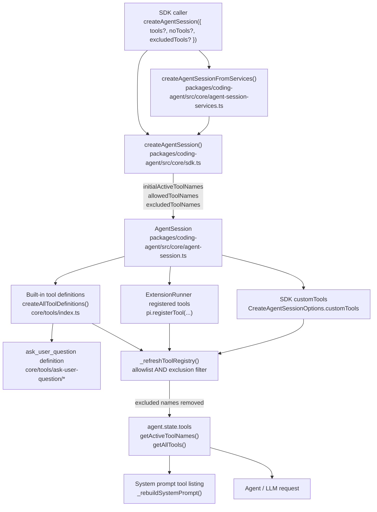

# Atomic SDK Tool Exclusion Technical Design Document / RFC

| Document Metadata      | Details                                      |
| ---------------------- | -------------------------------------------- |
| Author(s)              | Alex Lavaee                                  |
| Status                 | Draft (WIP)                                  |
| Team / Owner           | Atomic SDK / Coding Agent Core Maintainers   |
| Created / Last Updated | 2026-05-27 / 2026-05-27                      |

## 1. Executive Summary

GitHub issue [flora131/atomic#1070](https://github.com/flora131/atomic/issues/1070) requests a new SDK option, `excludedTools`, on `createAgentSession()`. SDK consumers can already provide a positive `tools` allowlist, but removing one or two default tools currently requires reconstructing the full desired tool list manually. The motivating example is disabling the built-in `ask_user_question` tool while preserving the rest of Atomic’s default tools.

This RFC proposes adding `excludedTools?: string[]` to the public `CreateAgentSessionOptions` API, matching the existing `tools?: string[]` tool-name identifier shape in `packages/coding-agent/src/core/sdk.ts`. The exclusion will be enforced inside `AgentSession`’s runtime tool registry refresh path so it applies consistently to built-in tools, SDK `customTools`, extension-registered tools, dynamic tool registration, and reloads. When `excludedTools` is omitted, existing behavior remains unchanged.

The implementation should primarily touch:

- `packages/coding-agent/src/core/sdk.ts` — public SDK option type and `createAgentSession()` wiring.
- `packages/coding-agent/src/core/agent-session.ts` — final tool registry construction and active tool filtering.
- `packages/coding-agent/src/core/agent-session-services.ts` — service-based session creation pass-through.
- `packages/coding-agent/docs/sdk.md`, `packages/coding-agent/examples/sdk/05-tools.ts`, and `packages/coding-agent/examples/sdk/README.md` — SDK docs/examples.
- `packages/coding-agent/test/suite/regressions/` and related SDK/session tests — regression coverage, especially excluding `ask_user_question`.

No prior review findings exist for this first iteration.

## 2. Context and Motivation

### 2.1 Current State

The public SDK factory is `createAgentSession(options)` in `packages/coding-agent/src/core/sdk.ts`. Its option type currently exposes:

- `noTools?: "all" | "builtin"` for coarse suppression.
- `tools?: string[]` as an allowlist of tool names.
- `customTools?: ToolDefinition[]` for SDK-provided tools.

Evidence:

- `CreateAgentSessionOptions` declares `noTools`, `tools`, and `customTools` in `packages/coding-agent/src/core/sdk.ts:49-85`.
- `createAgentSession()` derives `allowedToolNames` and `initialActiveToolNames` from `options.tools`, `options.noTools`, and `defaultToolNames` in `packages/coding-agent/src/core/sdk.ts:326-331`.
- The session constructor receives those derived values in `packages/coding-agent/src/core/sdk.ts:460-465`.

Built-in tool identity is centralized in `packages/coding-agent/src/core/tools/index.ts`:

- `ToolName` includes `read`, `bash`, `edit`, `write`, `grep`, `find`, `ls`, `ask_user_question`, and `todo` at `packages/coding-agent/src/core/tools/index.ts:88-98`.
- `defaultToolNames` includes `read`, `bash`, `edit`, `write`, `ask_user_question`, and `todo` at `packages/coding-agent/src/core/tools/index.ts:111-118`.
- `createAllToolDefinitions()` constructs the full built-in registry, including `ask_user_question`, at `packages/coding-agent/src/core/tools/index.ts:198-209`.
- `createAskUserQuestionToolDefinition()` returns a tool named `"ask_user_question"` in `packages/coding-agent/src/core/tools/ask-user-question/ask-user-question.ts:44`.

`AgentSession` is the final authority for exposed tools:

- `AgentSessionConfig` currently accepts `initialActiveToolNames?: string[]` and `allowedToolNames?: string[]` in `packages/coding-agent/src/core/agent-session.ts:197-200`.
- The constructor stores `allowedToolNames` as a `Set` in `packages/coding-agent/src/core/agent-session.ts:358-360`.
- `_buildRuntime()` creates the full base tool definition registry with `createAllToolDefinitions()` in `packages/coding-agent/src/core/agent-session.ts:2443-2453`.
- `_refreshToolRegistry()` filters built-in, extension, and SDK custom tools through `isAllowedTool` in `packages/coding-agent/src/core/agent-session.ts:2344-2400`.
- `setActiveToolsByName()` materializes the final executable tools into `agent.state.tools` and rebuilds the system prompt in `packages/coding-agent/src/core/agent-session.ts:853-868`.

Existing tests already cover adjacent behavior:

- Default sessions include `ask_user_question` and `todo` in `packages/coding-agent/test/sdk-session-manager.test.ts:96-108`.
- Allowlists filter built-in and extension tools in `packages/coding-agent/test/suite/regressions/2835-tools-allowlist-filters-extension-tools.test.ts:72-91`.
- `noTools: "builtin"` keeps extension tools active while disabling built-in defaults in `packages/coding-agent/test/suite/regressions/3592-no-builtin-tools-keeps-extension-tools.test.ts:73-86`.
- Service-based creation forwards `noTools` through `createAgentSessionFromServices()` in `packages/coding-agent/test/suite/regressions/3592-no-builtin-tools-keeps-extension-tools.test.ts:98-117`.

Documentation already presents tool selection as a name-based SDK API:

- SDK docs show `tools: ["read", "bash"]` examples in `packages/coding-agent/docs/sdk.md:61-76`.
- The tools section documents `tools`, `noTools`, and custom tools in `packages/coding-agent/docs/sdk.md:481-560`.
- SDK examples use name arrays in `packages/coding-agent/examples/sdk/05-tools.ts:1-48`.

There is also a higher-level workflow consumer:

- `StageOptions` extends `Omit<CreateAgentSessionOptions, "model">` in `packages/workflows/src/shared/types.ts:145`, so programmatic workflow stages inherit SDK option additions at the type level.
- The workflow direct tool schema hardcodes stage session option properties, including `tools` and `noTools`, in `packages/workflows/src/extension/workflow-schema.ts:36-58`. Whether to mirror `excludedTools` there is an open product/scope question for workflow direct tool calls.

### 2.2 The Problem

SDK callers that want “defaults minus one tool” currently have to manually enumerate a replacement allowlist. For the issue’s example, disabling `ask_user_question` while keeping default tools requires callers to know and maintain the default tool set themselves instead of writing:

```ts
await createAgentSession({
  excludedTools: ["ask_user_question"],
});
```

This creates several problems:

1. **Brittle defaults duplication**: callers must duplicate Atomic’s default built-in list from `defaultToolNames` (`packages/coding-agent/src/core/tools/index.ts:111-118`).
2. **Poor ergonomics for small removals**: `tools` is optimized for positive allowlists, not “default set minus X”.
3. **Risk of accidentally omitting future defaults**: if Atomic adds a new default tool later, callers with hand-built `tools` lists will not receive it.
4. **Specific HITL use case**: consumers may need to disable `ask_user_question` to avoid human-input interruptions while keeping file and shell tools.
5. **Need for final-set enforcement**: because tools can be registered dynamically by extensions during `session_start` (`packages/coding-agent/test/agent-session-dynamic-tools.test.ts:28-78`), exclusion should be enforced in `AgentSession`’s registry refresh path, not only by precomputing initial SDK lists.

## 3. Goals and Non-Goals

### 3.1 Functional Goals

1. Add `excludedTools?: string[]` to `CreateAgentSessionOptions` in `packages/coding-agent/src/core/sdk.ts`.
2. Use the same tool identifier type shape as the existing `tools?: string[]` field.
3. Remove excluded names from the final exposed session tool set:
   - `session.getAllTools()`
   - `session.getActiveToolNames()`
   - `session.agent.state.tools`
   - generated system prompt tool listings
4. Ensure `excludedTools: ["ask_user_question"]` omits the built-in `ask_user_question` tool while preserving the remaining normal defaults.
5. Apply exclusions consistently across:
   - built-in tools from `createAllToolDefinitions()`
   - SDK `customTools`
   - extension-registered tools
   - dynamically registered tools after `session.bindExtensions({})`
   - tool registry rebuilds and `/reload`-style refreshes
6. Preserve current behavior exactly when `excludedTools` is omitted.
7. Preserve current `tools` and `noTools` behavior, with exclusions applied as a final subtractive filter.
8. Add service-based pass-through support in `CreateAgentSessionFromServicesOptions` and `createAgentSessionFromServices()`.
9. Add tests covering:
   - excluding `ask_user_question`
   - `tools` allowlist combined with `excludedTools`
   - service-based forwarding
   - extension or SDK custom tool exclusion where practical
   - no-regression behavior when `excludedTools` is omitted
10. Update SDK docs, examples, and changelog entries where applicable.

### 3.2 Non-Goals (Out of Scope)

1. Do not add a CLI flag such as `--exclude-tools` in this iteration. The GitHub issue is specifically about the SDK `createAgentSession` API.
2. Do not rename or redesign existing `tools` or `noTools` semantics.
3. Do not change the built-in tool names, including `ask_user_question`.
4. Do not modify the implementation or UI behavior of `ask_user_question`; only make it excludable.
5. Do not introduce a generic callback/predicate tool filter API.
6. Do not migrate session files or alter persisted session schema.
7. Do not change MCP direct-tool selector behavior in `packages/subagents` or workflow MCP gating.
8. Do not require SDK callers to switch from string tool names to tool objects or `ToolName` unions.
9. Do not implement workflow direct tool schema support unless the workflow owner explicitly decides it belongs in this issue’s scope.

## 4. Proposed Solution (High-Level Design)

Add a new optional SDK field:

```ts
export interface CreateAgentSessionOptions {
  tools?: string[];
  excludedTools?: string[];
}
```

The SDK will pass `excludedTools` into `AgentSession` as `excludedToolNames`. `AgentSession` will store the names in a `Set<string>` and enforce them in `_refreshToolRegistry()` alongside the existing allowlist logic.

The key design decision is to enforce exclusion at registry construction time, not only in `createAgentSession()`’s initial option normalization. This ensures dynamic extension tools and SDK custom tools with excluded names never become exposed after `bindExtensions()`, `refreshTools()`, or reload.

### 4.1 System Architecture Diagram



### 4.2 Architectural Pattern

This change follows the existing **Facade + Registry Filtering** pattern:

- `createAgentSession()` is the public facade that accepts ergonomic SDK options and translates them into internal session configuration (`packages/coding-agent/src/core/sdk.ts:231-465`).
- `AgentSession` owns the runtime tool registry and active tool state (`packages/coding-agent/src/core/agent-session.ts:2344-2432`).
- Filtering by name is already the established pattern for `allowedToolNames`; `excludedTools` should extend that filtering seam rather than adding a parallel runtime path.

This preserves single responsibility:

- `sdk.ts` owns public API shape and backwards-compatible option normalization.
- `agent-session.ts` owns final runtime exposure of tools.
- `tools/index.ts` remains the canonical list/factory for built-ins and does not need semantic changes.

### 4.3 Key Components

| Component | Responsibility | Technology Stack | Justification |
| --------- | -------------- | ---------------- | ------------- |
| `CreateAgentSessionOptions` (`packages/coding-agent/src/core/sdk.ts`) | Public SDK option contract; add `excludedTools?: string[]` next to `tools?: string[]`. | TypeScript ESM | This is the exact public API requested by issue #1070. |
| `createAgentSession()` (`packages/coding-agent/src/core/sdk.ts`) | Preserve existing `tools` / `noTools` normalization and pass exclusions into `AgentSession`. | TypeScript, `@earendil-works/pi-agent-core` | Current option-to-session mapping already lives here at `sdk.ts:326-331` and `sdk.ts:460-465`. |
| `CreateAgentSessionFromServicesOptions` (`packages/coding-agent/src/core/agent-session-services.ts`) | Allow service-based session callers to pass `excludedTools`. | TypeScript | This mirrors existing `tools`, `noTools`, and `customTools` forwarding at `agent-session-services.ts:49-58` and `agent-session-services.ts:180-198`. |
| `AgentSessionConfig` (`packages/coding-agent/src/core/agent-session.ts`) | Carry `excludedToolNames` into the runtime session. | TypeScript class config | `AgentSession` already stores `allowedToolNames` and initial active tools at `agent-session.ts:354-360`. |
| `_refreshToolRegistry()` (`packages/coding-agent/src/core/agent-session.ts`) | Enforce `allowedToolNames` and `excludedToolNames` against built-ins, extension tools, and SDK custom tools. | TypeScript `Map` / `Set` | This is the central registry refresh path for all final exposed tools, including dynamic registrations. |
| Built-in tool registry (`packages/coding-agent/src/core/tools/index.ts`) | Continue defining canonical built-in names and definitions, including `ask_user_question`. | TypeScript factory functions | Exclusion should consume this registry, not change it. |
| SDK docs/examples (`packages/coding-agent/docs/sdk.md`, `packages/coding-agent/examples/sdk/05-tools.ts`) | Document omitted vs allowlist vs exclude semantics with concrete examples. | Markdown, TypeScript examples | Issue acceptance asks for relevant docs/types/examples updates. |
| Regression tests (`packages/coding-agent/test/suite/regressions/`) | Prove built-in and dynamic tool exclusion behavior. | Vitest via Bun command wrappers | Existing regression tests already cover adjacent tool allowlist and `noTools` behavior. |

## 5. Detailed Design

### 5.1 API Interfaces

#### Public SDK option

Add `excludedTools` next to `tools` in `packages/coding-agent/src/core/sdk.ts`:

```ts
export interface CreateAgentSessionOptions {
  /**
   * Optional allowlist of tool names.
   *
   * When provided, only the listed tool names are enabled, minus any names in
   * `excludedTools`.
   */
  tools?: string[];

  /**
   * Optional blocklist of tool names.
   *
   * When provided, matching built-in, extension, and SDK custom tools are omitted
   * from the final session tool registry and active tool set.
   */
  excludedTools?: string[];
}
```

The field intentionally uses `string[]`, matching the current `tools?: string[]` shape. This is necessary because tool names are not limited to the built-in `ToolName` union; extension and SDK custom tools can register arbitrary string names (`packages/coding-agent/test/agent-session-dynamic-tools.test.ts:28-78`).

#### Service-based session creation

Extend `packages/coding-agent/src/core/agent-session-services.ts`:

```ts
export interface CreateAgentSessionFromServicesOptions {
  tools?: string[];
  excludedTools?: CreateAgentSessionOptions["excludedTools"];
  noTools?: CreateAgentSessionOptions["noTools"];
  customTools?: ToolDefinition[];
}
```

Forward it in `createAgentSessionFromServices()`:

```ts
return createAgentSession({
  // existing fields...
  tools: options.tools,
  excludedTools: options.excludedTools,
  noTools: options.noTools,
  customTools: options.customTools,
});
```

This preserves parity with the existing service-based forwarding path.

#### Internal session config

Add an internal field to `AgentSessionConfig` in `packages/coding-agent/src/core/agent-session.ts`:

```ts
export interface AgentSessionConfig {
  initialActiveToolNames?: string[];
  allowedToolNames?: string[];
  excludedToolNames?: string[];
}
```

Store it as a private set:

```ts
private _excludedToolNames?: Set<string>;
```

Constructor behavior:

```ts
this._excludedToolNames = config.excludedToolNames
  ? new Set(config.excludedToolNames)
  : undefined;
```

#### Option combination semantics

| Input Combination | Resulting Semantics |
| ----------------- | ------------------- |
| No `tools`, no `noTools`, no `excludedTools` | Existing default behavior: default built-ins active plus extension/custom tools active. |
| `excludedTools: ["ask_user_question"]` | Normal default set minus `ask_user_question`; `read`, `bash`, `edit`, `write`, `todo`, and non-excluded extension/custom tools remain available according to existing defaults. |
| `tools: ["read", "bash", "ask_user_question"], excludedTools: ["ask_user_question"]` | Positive allowlist is resolved first, then exclusions subtract; final set is `read`, `bash`. |
| `tools: []` with any `excludedTools` | Empty allowlist remains empty. |
| `noTools: "all"` with any `excludedTools` | Existing all-tools suppression remains empty. |
| `noTools: "builtin", excludedTools: ["dynamic_tool"]` | Built-in defaults remain inactive per existing behavior; extension/custom tools remain active unless excluded. |
| Unknown names in `excludedTools` | Ignored, matching existing unknown-name behavior for `setActiveToolsByName()` at `packages/coding-agent/src/core/agent-session.ts:853-868`. |
| Duplicate names in `excludedTools` | Deduplicated by `Set`; no user-visible difference. |

### 5.2 Data Model / Schema

No persistent data migration is required.

New in-memory / TypeScript-only fields:

```ts
// Public SDK surface
excludedTools?: string[];

// Service wrapper surface
excludedTools?: CreateAgentSessionOptions["excludedTools"];

// Internal runtime config
excludedToolNames?: string[];

// Internal runtime state
private _excludedToolNames?: Set<string>;
```

No changes are required to:

- session JSONL format
- `ToolDefinition`
- `ToolInfo`
- `ToolName`
- `defaultToolNames`
- built-in tool factory signatures
- extension `pi.registerTool()` API

If workflow direct tool calls are later included in scope, `packages/workflows/src/extension/workflow-schema.ts` would need a TypeBox schema addition:

```ts
excludedTools: Type.Optional(Type.Array(Type.String())),
```

That schema currently hardcodes SDK-like options at `packages/workflows/src/extension/workflow-schema.ts:36-58`, so it will not automatically inherit new TypeScript fields at runtime.

### 5.3 Algorithms and State Management

#### Recommended filtering algorithm

In `AgentSession._refreshToolRegistry()` replace the single allowlist predicate:

```ts
const allowedToolNames = this._allowedToolNames;
const isAllowedTool = (name: string): boolean =>
  !allowedToolNames || allowedToolNames.has(name);
```

with a final exposure predicate:

```ts
const allowedToolNames = this._allowedToolNames;
const excludedToolNames = this._excludedToolNames;

const isExposedTool = (name: string): boolean => {
  if (allowedToolNames && !allowedToolNames.has(name)) {
    return false;
  }
  if (excludedToolNames?.has(name)) {
    return false;
  }
  return true;
};
```

Apply `isExposedTool` everywhere `_refreshToolRegistry()` currently uses `isAllowedTool`:

1. SDK custom and extension registered tools:
   - Current code combines `registeredTools` and `_customTools` at `packages/coding-agent/src/core/agent-session.ts:2350-2359`.
2. Built-in tool definitions:
   - Current code filters `_baseToolDefinitions` at `packages/coding-agent/src/core/agent-session.ts:2360-2368`.
3. Wrapped built-in executable tools:
   - Current code filters base definitions at `packages/coding-agent/src/core/agent-session.ts:2393-2400`.
4. Initial / previous active tool names:
   - Current code filters `nextActiveToolNames` at `packages/coding-agent/src/core/agent-session.ts:2410-2412`.
5. Allowlist activation branch:
   - Current code re-adds every allowed registry tool at `packages/coding-agent/src/core/agent-session.ts:2414-2419`; it must not re-add excluded tools.

Because the registry itself omits excluded names, existing `setActiveToolsByName()` continues to be safe: excluded tools cannot be enabled later because they are not present in `_toolRegistry`.

#### Why filtering belongs in `AgentSession`

Filtering only in `createAgentSession()` would cover initial built-ins but would not reliably cover:

- extension tools registered during `session.bindExtensions({})`
- SDK `customTools` that shadow built-ins by name
- runtime `refreshTools()` calls exposed through extension context at `packages/coding-agent/src/core/agent-session.ts:2295-2298`
- reloads that rebuild the runtime at `packages/coding-agent/src/core/agent-session.ts:2495-2499`

Central filtering in `_refreshToolRegistry()` covers all these paths.

#### State lifecycle

- `excludedTools` is read once during session construction.
- The exclusion set persists for the lifetime of the `AgentSession`.
- `reload()` rebuilds tools but retains `_excludedToolNames` on the same `AgentSession` object.
- New sessions created through `AgentSessionRuntime` receive the same fixed options only if the runtime factory closes over and passes them again, matching existing `tools` and `noTools` behavior in `packages/coding-agent/src/main.ts:541-608`.

## 6. Alternatives Considered

| Option | Pros | Cons | Reason for Rejection |
| ------ | ---- | ---- | -------------------- |
| A. Keep current API and require callers to pass a full `tools` allowlist | No code change; current behavior is already tested. | Callers must duplicate defaults from `defaultToolNames`; disabling one tool is verbose and brittle; future default tools are missed. | Rejected because it does not satisfy issue #1070’s ergonomic and backwards-compatible “defaults minus X” request. |
| B. Implement `excludedTools` only in `createAgentSession()` by subtracting from `initialActiveToolNames` and `allowedToolNames` | Smallest implementation; no new `AgentSessionConfig` field. | Does not reliably exclude dynamically registered extension tools or SDK custom tools after `bindExtensions()` / refresh; excluded allowlisted names could be reintroduced by registry refresh logic. | Rejected because the issue requires removal from the final resolved tool set, not only the initial default list. |
| C. Add `excludedToolNames` to `AgentSession` and enforce it in `_refreshToolRegistry()` | Covers built-ins, SDK custom tools, extension tools, dynamic registration, and reloads; reuses existing allowlist filtering seam. | Slightly more internal plumbing than SDK-only subtraction. | Selected because it is the most robust and aligns with current registry ownership. |
| D. Add a generic `toolFilter: (name, source) => boolean` callback | Maximum flexibility for advanced SDK consumers. | Non-serializable, harder to document, harder to test, potentially leaks internal source metadata, and is more abstraction than the issue needs. | Rejected under KISS/YAGNI; issue only asks for name-based exclusions matching `tools`. |
| E. Add a CLI `--exclude-tools` flag first | Useful for CLI users and subagent process spawning. | The request is for SDK `createAgentSession`; CLI surface increases parser/docs/test scope and creates product questions around short flags and precedence. | Rejected for iteration 1; can be revisited separately. |
| F. Remove `ask_user_question` from `defaultToolNames` globally | Solves the motivating example for everyone. | Breaking behavior change; existing tests assert `ask_user_question` is enabled by default; users may rely on HITL prompts. | Rejected because issue asks for opt-out, not global default removal. |

## 7. Cross-Cutting Concerns

### 7.1 Security and Privacy

`excludedTools` does not introduce new execution capability. It only removes named tools from the session’s exposed registry.

Security implications:

- Excluding mutating tools such as `bash`, `edit`, or `write` can reduce a session’s capability surface.
- Excluding `ask_user_question` can prevent model-initiated human-input prompts, useful for unattended SDK integrations.
- The option is not a sandbox or policy engine. If an extension registers another powerful tool under a different name, `excludedTools: ["bash"]` will not block that separate tool.
- If a custom or extension tool intentionally uses the same name as a built-in tool, exclusion by that name should remove the final tool with that name regardless of source. This matches name-based allowlist behavior in `packages/coding-agent/src/core/agent-session.ts:2344-2400`.

Privacy implications:

- No new data is persisted.
- No additional telemetry or logging is required.
- The selected tool names may appear in application code or tests, but not in session content unless callers log them.

### 7.2 Observability Strategy

Existing introspection APIs are sufficient:

- `session.getActiveToolNames()` should show the active set after exclusions (`packages/coding-agent/src/core/agent-session.ts:829-833`).
- `session.getAllTools()` should omit excluded tools from the final available registry (`packages/coding-agent/src/core/agent-session.ts:837-845`).
- `session.systemPrompt` should not list excluded tools because `setActiveToolsByName()` rebuilds the prompt from active valid tool names (`packages/coding-agent/src/core/agent-session.ts:858-868`).

Tests should assert all three surfaces for the `ask_user_question` case. No new runtime logging is necessary.

### 7.3 Scalability and Capacity Planning

Tool lists are small. The runtime overhead is negligible:

- Store exclusions in a `Set<string>` for O(1) lookup.
- Apply the predicate during existing registry rebuilds.
- No additional provider calls, file IO, or session persistence.
- No measurable impact on prompt generation beyond fewer tool definitions when exclusions are used.

The design scales to extension-heavy sessions because filtering is linear in the number of registered tools, which is already the cost of `_refreshToolRegistry()`.

## 8. Migration, Rollout, and Testing

### 8.1 Deployment Strategy

1. Implement `excludedTools` as an optional field with no behavior change when omitted.
2. Add tests before implementation, following the project’s TDD guidance.
3. Update SDK docs/examples and `packages/coding-agent/CHANGELOG.md` under `## [Unreleased]`.
4. Run focused package tests, then repo-level type checks.

Suggested rollout files:

- `packages/coding-agent/src/core/sdk.ts`
- `packages/coding-agent/src/core/agent-session.ts`
- `packages/coding-agent/src/core/agent-session-services.ts`
- `packages/coding-agent/docs/sdk.md`
- `packages/coding-agent/examples/sdk/05-tools.ts`
- `packages/coding-agent/examples/sdk/README.md`
- `packages/coding-agent/CHANGELOG.md`
- New or updated regression test under `packages/coding-agent/test/suite/regressions/`

No feature flag is needed because the field is purely additive.

### 8.2 Data Migration Plan

No data migration is required.

- Existing session JSONL files remain valid.
- Existing SDK callers compile and behave as before.
- Existing `tools` and `noTools` callers do not need source changes.
- Existing workflow code that extends `CreateAgentSessionOptions` may see the new optional type field automatically, but runtime workflow tool schema support is not automatic and is covered in Open Questions.

### 8.3 Test Plan

Use Bun to invoke existing repository/package test commands; do not use npm/yarn/pnpm.

Recommended focused tests:

1. **Default minus `ask_user_question`**
   - Create a session with `excludedTools: ["ask_user_question"]`.
   - Assert `getActiveToolNames()` does not contain `ask_user_question`.
   - Assert `getAllTools().map(t => t.name)` does not contain `ask_user_question`.
   - Assert `systemPrompt` does not contain `ask_user_question`.
   - Assert default non-excluded tools such as `read`, `bash`, `edit`, `write`, and `todo` remain active.

2. **Allowlist plus exclusion**
   - Create a session with `tools: ["read", "bash", "ask_user_question"]` and `excludedTools: ["ask_user_question"]`.
   - Assert only `read` and `bash` remain exposed/active.

3. **SDK custom tool exclusion**
   - Pass `customTools: [{ name: "sdk_tool", ... }]` and `excludedTools: ["sdk_tool"]`.
   - Assert `sdk_tool` is absent from `getAllTools()` and `getActiveToolNames()`.

4. **Extension dynamic tool exclusion**
   - Mirror the setup pattern from `packages/coding-agent/test/agent-session-dynamic-tools.test.ts:28-78`.
   - Register `dynamic_tool` during `session_start`.
   - Create the session with `excludedTools: ["dynamic_tool"]`.
   - Call `await session.bindExtensions({})`.
   - Assert `dynamic_tool` remains absent.

5. **Service pass-through**
   - Use `createAgentSessionFromServices()` with `excludedTools: ["ask_user_question"]`.
   - Assert the same final tool set behavior.
   - Existing service-forwarding patterns are in `packages/coding-agent/test/suite/regressions/3592-no-builtin-tools-keeps-extension-tools.test.ts:98-117`.

6. **Omitted option regression**
   - Existing tests such as `packages/coding-agent/test/sdk-session-manager.test.ts:96-108` should continue to pass and prove default inclusion remains unchanged.

7. **Type and docs validation**
   - Ensure `CreateAgentSessionOptions` accepts `excludedTools`.
   - Ensure `excludedTools` is documented in SDK docs and examples.
   - Run `bun run typecheck` from the repo root.
   - Run focused package tests, for example:
     - `bun --cwd packages/coding-agent run test -- test/suite/regressions/1070-exclude-tools.test.ts`
   - Run relevant existing regression tests:
     - `bun --cwd packages/coding-agent run test -- test/suite/regressions/2835-tools-allowlist-filters-extension-tools.test.ts`
     - `bun --cwd packages/coding-agent run test -- test/suite/regressions/3592-no-builtin-tools-keeps-extension-tools.test.ts`

## 9. Open Questions / Unresolved Issues

1. **Should workflow direct tool schemas accept `excludedTools` in the same iteration?**  
   `[OWNER: workflows team]` `StageOptions` inherits `CreateAgentSessionOptions` at the TypeScript level (`packages/workflows/src/shared/types.ts:145`), but `WorkflowParametersSchema` hardcodes SDK-like fields and currently includes `tools` / `noTools` but not `excludedTools` (`packages/workflows/src/extension/workflow-schema.ts:36-58`). This RFC treats workflow schema support as out of scope unless the workflow owner wants SDK parity for direct workflow tool calls now.

2. **Should a CLI `--exclude-tools` flag be added later?**  
   `[OWNER: product / CLI maintainers]` The current issue targets SDK consumers only. A CLI flag would require parser, help text, docs, and process-spawning considerations for subagents that currently use `--tools`.

3. **Should excluded tools be omitted from `getAllTools()` or only inactive?**  
   `[OWNER: SDK maintainers]` This RFC proposes omission from `getAllTools()` because the issue asks for excluded tools to be omitted from the final tools exposed to the session. If maintainers prefer “available but inactive,” `_refreshToolRegistry()` would need different semantics; however, that would allow later reactivation and would be less consistent with existing allowlist filtering.

4. **Should the SDK docs correct existing default-tool inconsistencies while adding `excludedTools`?**  
   `[OWNER: docs maintainers]` Code defaults include `ask_user_question` and `todo` (`packages/coding-agent/src/core/tools/index.ts:111-118`), while some user-facing docs/examples describe only `read`, `bash`, `edit`, and `write` as defaults. The `excludedTools` docs should avoid reinforcing stale default lists.

5. **Should `excludedTools` support future direct MCP selector syntax such as `mcp:server/tool`?**  
   `[OWNER: MCP/subagents maintainers]` Existing subagent tooling has separate handling for `mcp:` selectors in tool lists. This RFC defines `excludedTools` as plain final tool-name exclusion for `createAgentSession()` only and does not specify MCP selector semantics.
