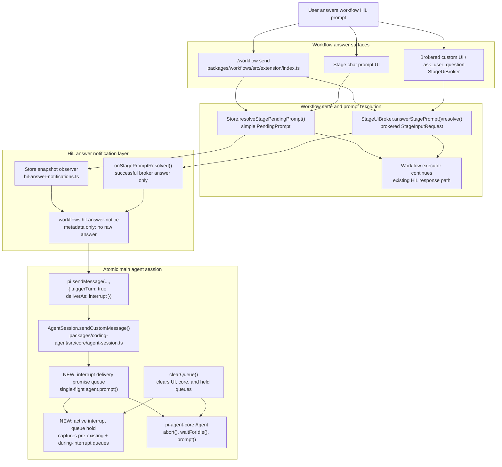

# Workflow HiL Answer Immediate Interrupt Technical Design Document / RFC

| Document Metadata      | Details                         |
| ---------------------- | ------------------------------- |
| Author(s)              | Alex Lavaee                     |
| Status                 | In Review (RFC)                 |
| Team / Owner           | Atomic CLI / Workflows          |
| Created / Last Updated | 2026-05-30                      |

## 1. Executive Summary

GitHub issue [flora131/atomic#1137](https://github.com/flora131/atomic/issues/1137) requests that when a workflow human-in-the-loop (HiL) prompt is answered, the main agent is notified immediately with an interrupt-style custom message instead of a queued steer message. The notice must tell the agent that the pending HiL request has already been answered, must prevent the agent from re-asking the same question, and must not wait until the next tool-call boundary.

Current branch `fix/1137-workflow-hil-answer-interrupt` already implements the core issue behavior:

- `CustomMessageDelivery` includes `"interrupt"` in `packages/coding-agent/src/core/extensions/types.ts:85`.
- `AgentSession.sendCustomMessage()` routes `{ triggerTurn: true, deliverAs: "interrupt" }` to `_sendInterruptCustomMessage()` in `packages/coding-agent/src/core/agent-session.ts:1403-1418`.
- Workflow answer notices are emitted from `packages/workflows/src/extension/hil-answer-notifications.ts:66-83` and delivered with `{ triggerTurn: true, deliverAs: "interrupt" }` at `packages/workflows/src/extension/hil-answer-notifications.ts:143-158`.
- Brokered prompt resolution listeners exist in `packages/workflows/src/shared/stage-ui-broker.ts:25-32`, `102-112`, and `209-226`.
- Current tests cover workflow HiL answer notices, brokered prompt listeners, lifecycle steer regressions, and the initial clear-while-held interrupt queue case.

Iteration 3 must preserve that behavior while addressing two P2 review findings:

1. Concurrent interrupt custom messages can race into `agent.prompt()` and one message can be dropped by `pi-agent-core`’s active-run guard.
2. Held queued messages are restored behind newer messages queued during the interrupt turn, reversing queue order.

This RFC updates the design so interrupt delivery is serialized through a single-flight promise queue and so all steer/follow-up messages queued while an interrupt sequence is active are deferred into session-owned interrupt queue state. That queue state remains visible to `clearQueue()`, preserves FIFO order, and is restored only after all pending interrupt notices have been delivered.

## 2. Context and Motivation

### 2.1 Current State

Issue #1137 describes the intended product behavior:

- Steer messages can wait until the next tool-call boundary.
- A workflow HiL answer is urgent because it resolves an active blocker.
- The main agent must learn immediately that the prompt was answered and should not ask again.
- Existing workflow-finished and HiL-requested notifications should remain intact.

Repository evidence:

- Simple stage HiL answers are resolved by `Store.resolveStagePendingPrompt()` in `packages/workflows/src/shared/store.ts`.
- Brokered structured prompt answers are resolved through `StageUiBroker.answerStagePrompt()` / `resolve()` in `packages/workflows/src/shared/stage-ui-broker.ts:93-99` and `209-226`.
- `installWorkflowHilAnswerNotifications()` observes successful simple and brokered answers in `packages/workflows/src/extension/hil-answer-notifications.ts:66-95`.
- The notice payload is metadata-only via `WorkflowHilAnswerNoticeDetails` in `packages/workflows/src/extension/hil-answer-notifications.ts:23-35`.
- Lifecycle notifications still use steer delivery and are separate from HiL answer notices.
- `AgentSession` currently tracks UI queue arrays in `_steeringMessages` / `_followUpMessages` at `packages/coding-agent/src/core/agent-session.ts:327-330`.
- `AgentSession.clearQueue()` clears those arrays and `pi-agent-core` queues at `packages/coding-agent/src/core/agent-session.ts:1543-1553`.
- `pi-agent-core` queues are FIFO append-only through `PendingMessageQueue.enqueue()` in `node_modules/@earendil-works/pi-agent-core/dist/agent.js:57-59`, and `Agent.prompt()` rejects concurrent prompts with “Agent is already processing...” at `node_modules/@earendil-works/pi-agent-core/dist/agent.js:217-220`.
- `runAgentLoop()` polls queued steering at loop start and after each turn in `node_modules/@earendil-works/pi-agent-core/dist/agent-loop.js:81-82` and `154`.

Prior design context:

- `specs/2026-04-14-hil-detection-ui-surfacing.md` defines `awaiting_input → running` on user response.
- `specs/2026-03-25-workflow-interrupt-stage-advancement-fix.md` and `specs/2026-03-25-workflow-interrupt-resume-session-preservation.md` cover workflow-stage pause/resume mechanics. This issue is different: it notifies the main chat agent after a workflow HiL answer.
- `AGENTS.md` requires Bun-only validation and explicitly excludes publishing or release creation.

### 2.2 The Problem

The original issue problem is stale agent context:

1. A workflow stage asks for HiL input.
2. The user answers through `/workflow send`, stage chat, or brokered UI.
3. The workflow receives the answer on its normal response path.
4. The main agent may still be streaming stale text or may re-ask the answered question unless notified immediately.

The current branch addresses this with interrupt-delivered `workflows:hil-answer-notice` messages, but the review found two correctness gaps in the interrupt transport.

**Finding 1 — concurrent interrupt custom messages race.**

At `packages/coding-agent/src/core/agent-session.ts:1440-1448`, each interrupt call independently aborts/waits and then calls `agent.prompt(message)`. If two HiL answer notices arrive during the same active stream, both can wait on the same aborted run. The first resumed call starts the interrupt turn; the second then calls `agent.prompt()` while `pi-agent-core` has an active run and hits the guard at `node_modules/@earendil-works/pi-agent-core/dist/agent.js:217-220`. The extension binding at `packages/coding-agent/src/core/agent-session.ts:2372-2379` is fire-and-forget, so the failed second notice is only emitted as an extension error and the agent never receives it.

**Finding 2 — held queue restoration can reverse order.**

Current interrupt queue handling drains existing core queues into `HeldInterruptQueues` at `packages/coding-agent/src/core/agent-session.ts:1460-1467`, then restores them by calling `agent.steer()` / `agent.followUp()` at `packages/coding-agent/src/core/agent-session.ts:1489-1495`.

If user message `A` is queued before the interrupt, it is held out of `pi-agent-core`. If user message `B` is queued while the interrupt turn is running, `_queueSteer()` / `_queueFollowUp()` currently push `B` directly into `pi-agent-core` at `packages/coding-agent/src/core/agent-session.ts:1344-1372`. When the interrupt finally restores `A`, `A` is appended behind `B`, even though the UI arrays still report `A, B`. Because `pi-agent-core` polls queues at loop boundaries, `B` can also be consumed by the interrupt turn before older `A` is restored.

Iteration 3 must make interrupt delivery single-flight and make interrupt queue holding cover both pre-existing queued messages and messages queued during the interrupt sequence.

## 3. Goals and Non-Goals

### 3.1 Functional Goals

- Emit an immediate interrupt-delivered custom message whenever a workflow stage HiL prompt is successfully answered.
- The interrupt message must tell the agent:
  - the pending HiL request has already been answered;
  - the same question should not be asked again;
  - workflow/run/stage/prompt metadata when available.
- Preserve existing steer-based behavior for workflow completed, failed, and awaiting-input lifecycle notices.
- Cover both HiL implementations:
  - simple `PendingPrompt` prompts resolved through `Store.resolveStagePendingPrompt()`;
  - brokered `StageInputRequest` prompts resolved through `StageUiBroker`.
- Keep raw HiL answers out of the interrupt payload.
- Serialize interrupt custom-message delivery so two interrupt notices cannot race into `agent.prompt()`.
- Preserve FIFO order for queued steering and follow-up messages across an interrupt sequence:
  - messages queued before an interrupt must remain before messages queued during the interrupt;
  - no non-interrupt queued message should be consumed by the interrupt turn ahead of older held messages;
  - `clearQueue()` during an interrupt must clear visible queues, core queues, and interrupt-deferred queues.
- Ensure messages queued after a `clearQueue()` during an active interrupt are still preserved and restored normally.
- Add/update tests for concurrent interrupt notices, queue ordering across interrupt restore, clear-during-interrupt behavior, workflow HiL answer notices, brokered HiL answer notices, and lifecycle steer regressions.
- Use Bun-only validation commands.

### 3.2 Non-Goals (Out of Scope)

- Do not publish, release, or create tags.
- Do not redesign workflow HiL UI or add new prompt kinds.
- Do not change durable workflow prompt-answer storage semantics.
- Do not include raw user answers in interrupt payloads.
- Do not replace existing workflow lifecycle steer notices with interrupts.
- Do not change workflow pause/resume run-control semantics.
- Do not require upstream changes to `@earendil-works/pi-agent-core`.
- Do not solve broader queued-message scheduling policy beyond interrupt delivery, queue order, and `clearQueue()` correctness.
- Do not change `ExtensionAPI.sendMessage()`’s public return type in `packages/coding-agent/src/core/extensions/types.ts`; it remains fire-and-forget for extension authors.

## 4. Proposed Solution (High-Level Design)

### 4.1 System Architecture Diagram



### 4.2 Architectural Pattern

Use an observer plus serialized priority-delivery pattern:

- Workflow prompt resolution remains the source of truth.
- A workflow notification layer observes successful prompt answers and emits one deduplicated `workflows:hil-answer-notice`.
- Atomic’s extension `sendMessage` API exposes `deliverAs: "interrupt"` for urgent custom messages.
- `AgentSession` owns interrupt mechanics:
  - serialize interrupt deliveries;
  - abort stale streams;
  - wait for idle;
  - start immediate custom-message turns;
  - defer non-interrupt queued messages while an interrupt sequence is active.
- Queue preservation uses session-owned in-memory state instead of hidden local variables so `clearQueue()` and queue UI state stay authoritative.

### 4.3 Key Components

| Component | Responsibility | Technology Stack | Justification |
| --------- | -------------- | ---------------- | ------------- |
| `AgentSession.sendCustomMessage()` | Route extension custom messages by delivery mode, including `"interrupt"` | TypeScript, pi-agent-core wrapper | Central session layer that can abort streams and prompt immediately. |
| Interrupt delivery promise queue | Serialize interrupt custom messages so only one `agent.prompt()` runs at a time | TypeScript `Promise<void>` chain | Fixes concurrent interrupt race against `pi-agent-core` active-run guard. |
| Active interrupt queue hold | Defer pre-existing and during-interrupt steer/follow-up messages until all pending interrupts finish | TypeScript private state | Preserves queue order and prevents interrupt turns from consuming newer queued messages first. |
| `AgentSession.clearQueue()` | Clear visible UI queues, `pi-agent-core` queues, and active interrupt-held queues | TypeScript | User intent to clear queues must remain authoritative during interrupts. |
| `CustomMessageDelivery` type | Public delivery union: `"steer" \| "followUp" \| "nextTurn" \| "interrupt"` | TypeScript interfaces | Keeps extension API explicit and type-safe. |
| `hil-answer-notifications.ts` | Detect successful HiL answers and emit interrupt notices | `packages/workflows` TypeScript | Avoids duplicating notification logic across UI surfaces. |
| `StageUiBroker.onStagePromptResolved()` | Notify only successful brokered prompt answers | TypeScript listener set | Store diffs alone cannot distinguish broker resolve from reject/abort cleanup. |
| `workflows:hil-answer-notice` renderer | Display metadata-only answer notice in chat transcript | Existing custom message renderer API | Makes interrupt events visible/debuggable without exposing raw answers. |
| Bun tests | Lock interrupt, queue ordering, workflow notification, and lifecycle regression behavior | Bun + Vitest where package-local tests already use Vitest | Required by repo guidance and issue acceptance criteria. |

## 5. Detailed Design

### 5.1 API Interfaces

The extension custom-message delivery API remains additive and source-compatible:

```ts
export type CustomMessageDelivery =
  | "steer"
  | "followUp"
  | "nextTurn"
  | "interrupt";
```

Concrete references:

- `packages/coding-agent/src/core/extensions/types.ts:85`
- `packages/coding-agent/src/core/extensions/types.ts:1224-1227`
- `packages/workflows/src/extension/index.ts:316-327`
- `packages/coding-agent/docs/extensions.md:1282-1301`

`deliverAs: "interrupt"` contract:

- With `triggerTurn: true`:
  1. enqueue the interrupt delivery behind any in-flight interrupt delivery;
  2. ensure non-interrupt queued messages are deferred into session-owned interrupt queue state;
  3. abort an active stale run, if any;
  4. wait for idle;
  5. call `agent.prompt(customMessage)` only while no other interrupt delivery is active;
  6. after the last pending interrupt delivery finishes, restore deferred non-interrupt queues in FIFO order.
- With `triggerTurn: true` while idle: start a custom-message turn immediately, still respecting serialized interrupt delivery and queue deferral.
- Without `triggerTurn: true`: do not interrupt; retain existing non-trigger custom-message behavior.

Workflow notice details remain metadata-only:

```ts
interface WorkflowHilAnswerNoticeDetails {
  readonly kind: "hil_answered";
  readonly scope: "stage";
  readonly runId: string;
  readonly workflowName: string;
  readonly stageId: string;
  readonly stageName?: string;
  readonly promptId?: string;
  readonly promptKind?: "input" | "confirm" | "select" | "editor" | "ask_user_question" | "readiness_gate";
  readonly answeredAt: number;
  readonly answerAvailable: true;
  readonly answerIncluded: false;
}
```

### 5.2 Data Model / Schema

No durable schema or migration is required.

Existing workflow state used by the design:

- `StageSnapshot.pendingPrompt?: PendingPrompt` for simple prompts.
- `StageSnapshot.inputRequest?: StageInputRequest` for brokered prompts.
- `StageSnapshot.promptAnswerState?: "available" | "unavailable" | "ambiguous"` for snapshot-safe answer metadata.
- Private prompt-answer ledger in `Store`, populated by `resolveStagePendingPrompt()`.

Replace the current local `HeldInterruptQueues` model with mutable, session-owned interrupt queue hold state:

```ts
interface InterruptQueueHold {
  readonly steering: AgentMessage[];
  readonly followUp: AgentMessage[];
  restored: boolean;
}
```

Add private `AgentSession` fields:

```ts
private _interruptDeliveryQueue: Promise<void> = Promise.resolve();
private _pendingInterruptDeliveries = 0;
private _activeInterruptQueueHold: InterruptQueueHold | undefined = undefined;
```

The hold is in-memory only and scoped to the current `AgentSession`.

### 5.3 Algorithms and State Management

#### 5.3.1 HiL answer notification algorithm

Implemented by `installWorkflowHilAnswerNotifications()` in `packages/workflows/src/extension/hil-answer-notifications.ts`.

Simple prompt observer:

1. Seed `previousSnapshot = store.snapshot()`.
2. Subscribe to `store.subscribe()`.
3. For each previous stage with `pendingPrompt`:
   - find the matching current stage;
   - require current `pendingPrompt === undefined`;
   - require current `promptAnswerState === "available"`;
   - emit one `hil_answered` notice.
4. Dedupe by `runId + stageId + promptKind + promptId`.
5. Send:

```ts
sendMessage(
  {
    customType: "workflows:hil-answer-notice",
    content,
    display: true,
    details,
  },
  { triggerTurn: true, deliverAs: "interrupt" },
);
```

Brokered prompt listener:

1. `StageUiBroker.resolve()` captures the current `StageInputRequest`.
2. It clears broker/store pending state.
3. It emits `StagePromptResolvedEvent` only for successful resolution.
4. `StageUiBroker.reject()` must not emit the resolved event.
5. The HiL answer notifier sends the same interrupt notice.

#### 5.3.2 Serialized interrupt delivery algorithm

Current problematic path:

```ts
await this._sendInterruptCustomMessage(appMessage);
```

New routing:

```ts
private _enqueueInterruptCustomMessage<T>(message: CustomMessage<T>): Promise<void> {
  this._pendingInterruptDeliveries += 1;

  const delivery = this._interruptDeliveryQueue.then(async () => {
    try {
      await this._sendInterruptCustomMessageNow(message);
    } finally {
      this._pendingInterruptDeliveries -= 1;
      if (this._pendingInterruptDeliveries === 0) {
        this._restoreAndClearActiveInterruptQueueHold();
      }
    }
  });

  this._interruptDeliveryQueue = delivery.catch(() => undefined);
  return delivery;
}
```

`sendCustomMessage()` should call `_enqueueInterruptCustomMessage(appMessage)` instead of calling `_sendInterruptCustomMessage()` directly.

Required invariants:

- At most one interrupt delivery may call `agent.prompt()` at a time.
- A failed interrupt delivery must not poison the chain; later notices still run.
- The returned promise for the failed delivery may still reject so existing error reporting in `runner.bindCore()` continues to work.
- Queue restoration happens only after the last pending interrupt delivery, not between back-to-back interrupt notices.

#### 5.3.3 Active interrupt queue hold algorithm

At the beginning of an interrupt sequence, drain existing `pi-agent-core` queues into an active hold:

```ts
private _ensureActiveInterruptQueueHold(): InterruptQueueHold {
  if (this._activeInterruptQueueHold !== undefined) {
    return this._activeInterruptQueueHold;
  }

  const drained = this._drainQueuedAgentMessages();
  this._activeInterruptQueueHold = {
    steering: [...drained.steering],
    followUp: [...drained.followUp],
    restored: false,
  };
  return this._activeInterruptQueueHold;
}
```

While `_activeInterruptQueueHold` exists, all non-interrupt queued messages must be appended to the hold instead of `pi-agent-core`:

```ts
private _queueAgentMessage(message: AgentMessage, delivery: "steer" | "followUp"): void {
  const hold = this._activeInterruptQueueHold;
  if (hold !== undefined) {
    if (delivery === "followUp") hold.followUp.push(message);
    else hold.steering.push(message);
    return;
  }

  if (delivery === "followUp") this.agent.followUp(message);
  else this.agent.steer(message);
}
```

Use this helper from:

- `_queueSteer()` after updating `_steeringMessages`;
- `_queueFollowUp()` after updating `_followUpMessages`;
- the streaming branch of `sendCustomMessage()` for non-interrupt custom messages.

On restoration, preserve order and guard against unexpected messages already in core queues:

```ts
private _restoreAndClearActiveInterruptQueueHold(): void {
  const hold = this._activeInterruptQueueHold;
  if (hold === undefined || hold.restored) return;

  const currentCoreQueues = this._drainQueuedAgentMessages();

  this._restoreQueuedAgentMessages({
    steering: [...hold.steering, ...currentCoreQueues.steering],
    followUp: [...hold.followUp, ...currentCoreQueues.followUp],
  });

  hold.restored = true;
  this._activeInterruptQueueHold = undefined;
}
```

This fixes the reviewer ordering scenario:

- `A` queued before interrupt → drained into hold.
- `B` queued during interrupt → appended to the same hold, not `pi-agent-core`.
- Last interrupt finishes → restore `[A, B]`.
- UI arrays already show `[A, B]`, so display and core delivery order match.

#### 5.3.4 `clearQueue()` during active interrupt holds

`clearQueue()` must clear held queues by emptying the active hold, not by permanently marking the whole hold un-restorable:

```ts
clearQueue(): { steering: string[]; followUp: string[] } {
  const steering = [...this._steeringMessages];
  const followUp = [...this._followUpMessages];

  this._steeringMessages = [];
  this._followUpMessages = [];

  this.agent.clearAllQueues();

  if (this._activeInterruptQueueHold !== undefined) {
    this._activeInterruptQueueHold.steering.length = 0;
    this._activeInterruptQueueHold.followUp.length = 0;
  }

  this._emitQueueUpdate();
  return { steering, followUp };
}
```

Important edge case:

- If `clearQueue()` runs during an interrupt and then the user queues a new message before the interrupt sequence finishes, the new message should be appended to the still-active hold and restored later.
- Therefore a permanent `cleared: true` flag is insufficient for iteration 3; clearing must remove currently held messages while allowing future messages in the same active interrupt sequence.

#### 5.3.5 Interrupt prompt execution

The actual interrupt delivery remains abort + wait + prompt:

```ts
private async _sendInterruptCustomMessageNow<T>(message: CustomMessage<T>): Promise<void> {
  this.abortRetry();
  this._ensureActiveInterruptQueueHold();

  if (this.isStreaming) {
    this.agent.abort();
    await this.agent.waitForIdle();
  }

  await this.agent.prompt(message);
}
```

Required invariants:

- The interrupt custom message itself is never placed into the deferred non-interrupt queue hold.
- Interrupt delivery must not call `agent.clearAllQueues()`; automatic clearing would drop user-authored queued messages without explicit user intent.
- Non-interrupt queued messages must not be visible to `pi-agent-core` while an interrupt sequence is active, because `runAgentLoop()` polls steering queues at loop start and after each turn.
- Restoring held queues should not mutate `_steeringMessages` / `_followUpMessages`; those arrays remain the UI source of truth and are cleared only by delivery events or `clearQueue()`.

#### 5.3.6 Prior review findings

- **Serialize interrupt custom-message delivery** — accepted. The design adds `_interruptDeliveryQueue` and `_pendingInterruptDeliveries` so two HiL answer notices cannot concurrently call `agent.prompt()`.
- **Preserve queue order when restoring held messages** — accepted. The design replaces local drain/restore with an active interrupt queue hold that captures messages queued both before and during the interrupt sequence, and restores them in FIFO order after all pending interrupts finish.

## 6. Alternatives Considered

| Option | Pros | Cons | Reason for Rejection |
| ------ | ---- | ---- | -------------------- |
| Reuse steer delivery for HiL answers | Minimal code; consistent with lifecycle notices | Waits for next tool-call/agent-loop boundary; stale stream can continue | Rejected because issue #1137 explicitly requires immediate interruption. |
| Emit answer notices only from `/workflow send` | Simple call-site implementation | Misses stage chat, custom UI answers, and future direct store/broker resolution paths | Rejected because the behavior should apply whenever a HiL prompt is answered. |
| Include raw HiL answer in interrupt payload | Agent immediately sees the answer content | Leaks potentially sensitive answers into main chat/model context | Rejected for this iteration; metadata-only notice is safer. |
| Keep current local `HeldInterruptQueues` drain/restore | Smallest change from current branch | Races concurrent interrupts and restores older held messages behind newer queued messages | Rejected due reviewer P2 findings. |
| Serialize interrupts but keep during-interrupt messages in `pi-agent-core` | Fixes active-run guard race | Still allows newer queued messages to be consumed before older held messages | Rejected because it does not solve queue ordering. |
| Clear all queues automatically on interrupt | Avoids restore complexity | Drops user-authored queued messages without explicit user intent | Rejected as data loss. |
| Add prepend support or native interrupt to `@earendil-works/pi-agent-core` | Cleaner primitive in the lower-level agent | External dependency coordination and larger scope | Deferred; wrapper-level `AgentSession` implementation is sufficient for issue #1137. |
| Restore held queues between serialized interrupt notices | Simpler lifecycle per notice | Restored user queues can be consumed before later interrupt notices, reducing interrupt priority | Rejected; restore only after the interrupt batch drains. |

## 7. Cross-Cutting Concerns

### 7.1 Security and Privacy

- `workflows:hil-answer-notice` must not include raw HiL answers.
- The notice may include run id, workflow name, stage id/name, prompt id, prompt kind, and `answerAvailable: true`.
- Existing tests in `test/unit/workflow-hil-answer-notifications.test.ts` assert sensitive answer strings such as `swordfish` and `Blue` are absent from notice content/details.
- No new network calls, credentials, or external services are introduced.
- Queue holding is process-local memory only and does not persist new data.

### 7.2 Observability Strategy

- The interrupt event is visible in chat history as custom type `workflows:hil-answer-notice`.
- The details payload supports correlation with workflow status by run/stage/prompt identifiers.
- `hil-answer-notifications.ts` logs send failures only when `ATOMIC_WORKFLOW_DEBUG=1`, matching existing lifecycle-notification style.
- Queue visibility remains through existing `queue_update` events from `AgentSession._emitQueueUpdate()`.
- New tests should observe:
  - both concurrent interrupt notices reach the model;
  - no “Agent is already processing...” failure is emitted for serialized interrupt notices;
  - queue UI arrays and `pi-agent-core` delivery order match after interrupt restoration.

### 7.3 Scalability and Capacity Planning

- Store diffing remains O(number of runs × stages) per store update, matching current notification patterns.
- HiL answer dedupe state is a session-local `Set` bounded by answered prompts in one chat session.
- The interrupt delivery chain is bounded by concurrently emitted interrupt notices, expected to be very small.
- Active interrupt queue holds are short-lived and bounded by messages queued while an interrupt sequence is active.
- Interrupting stale streams can reduce wasted provider output.
- Broker listener dispatch remains synchronous and best-effort; listener failure must not block prompt resolution.

## 8. Migration, Rollout, and Testing

### 8.1 Deployment Strategy

- Continue implementation in the requested reusable worktree/branch: `../atomic-issue-1137` on `fix/1137-workflow-hil-answer-interrupt`.
- Do not publish, release, or create a tag.
- Keep changelog entries under:
  - `packages/workflows/CHANGELOG.md`;
  - `packages/coding-agent/CHANGELOG.md` if coding-agent behavior is user-visible enough to warrant a note.
- Keep documentation updates in:
  - `packages/workflows/README.md`;
  - `packages/coding-agent/docs/extensions.md` if the interrupt delivery contract is clarified.
- Commit and push the branch; create or update a PR if appropriate after validation.

### 8.2 Data Migration Plan

No persistent data migration is needed.

All changes are additive or in-memory:

- existing `deliverAs: "interrupt"` type/API extension;
- metadata-only custom message type;
- store/broker observers;
- new session-local interrupt delivery queue;
- new session-local active interrupt queue hold;
- tests and docs.

Existing workflow snapshots, session entries, and prompt-answer ledgers remain compatible.

### 8.3 Test Plan

Required tests:

1. `test/unit/workflow-hil-answer-notifications.test.ts`
   - simple `PendingPrompt` answer emits one `workflows:hil-answer-notice`;
   - brokered `StageInputRequest` answer emits one notice;
   - delivery options are `{ triggerTurn: true, deliverAs: "interrupt" }`;
   - raw answer is absent from content/details;
   - duplicate store updates do not duplicate notices.

2. `test/unit/stage-ui-broker.test.ts`
   - `answerStagePrompt()` notifies resolved listeners once;
   - abort/reject does not notify resolved listeners;
   - listener unsubscribe works.

3. `test/unit/workflow-lifecycle-notifications.test.ts`
   - completed/failed/awaiting-input lifecycle notices remain steer-delivered.

4. `packages/coding-agent/test/agent-session-concurrent.test.ts`
   - interrupt custom messages abort a streaming turn and start a custom-message turn immediately;
   - interrupt delivery does not call `agent.clearAllQueues()` by itself;
   - pre-existing queued messages remain preserved when the user does not clear them;
   - `clearQueue()` while an interrupt is active clears held queues and prevents stale restoration;
   - **new:** two interrupt custom messages sent during the same active stream are delivered serially and both reach the model;
   - **new:** queued message `A` before interrupt and queued message `B` during interrupt are delivered as `A, B`, not `B, A`;
   - **new:** if `clearQueue()` runs during interrupt and then message `C` is queued before interrupt completion, only `C` is restored.

5. `packages/coding-agent/test/suite/agent-session-queue.test.ts`
   - existing steering/follow-up order tests remain green;
   - add a focused interrupt ordering regression here if the suite harness is better suited than `agent-session-concurrent.test.ts`.

Recommended validation commands, Bun-only:

```sh
bun test test/unit/workflow-hil-answer-notifications.test.ts
bun test test/unit/stage-ui-broker.test.ts test/unit/workflow-lifecycle-notifications.test.ts
bun run test:unit
bun --cwd packages/coding-agent run test -- agent-session-concurrent.test.ts
bun --cwd packages/coding-agent run test -- test/suite/agent-session-queue.test.ts
bun --cwd packages/coding-agent run docs:check
bun --cwd packages/coding-agent run build
bun run typecheck
```

## 9. Open Questions / Unresolved Issues

- [OWNER: Atomic CLI] Should `deliverAs: "interrupt"` be documented as a stable public extension API for third-party extensions, or marked experimental/internal for now?
- [OWNER: Atomic CLI] Should serialized interrupt deliveries be deduplicated by `customType`/prompt id when two identical HiL notices arrive, or should all interrupt custom messages always be delivered in order? Current design preserves all messages.
- [OWNER: Atomic CLI] After restoring preserved queues post-interrupt, should `AgentSession` automatically call `agent.continue()`, or leave restored queues pending until the next natural continuation? Current design avoids changing this policy.
- [OWNER: Workflows] Should HiL-answer interrupts be configurable independently from `workflowNotifications`, or always enabled when `pi.sendMessage` is available?
- [OWNER: Product] Should future iterations ever include raw HiL answers in interrupt payloads for low-sensitivity prompt kinds, or should metadata-only remain permanent?
- [OWNER: QA] What provider-specific aborted-stream artifacts are acceptable in chat history after interrupt delivery?
- [OWNER: Atomic CLI] If `@earendil-works/pi-agent-core` later adds a native interrupt primitive, should `AgentSession` replace abort+prompt composition with that primitive?
