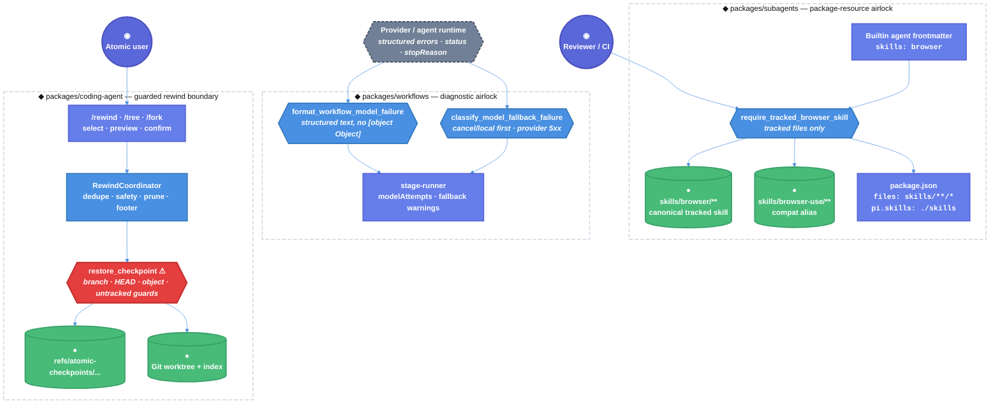

# Atomic Native Checkpoint/Rewind Iteration 20 Technical Design Document / RFC

| Document Metadata      | Details |
| ---------------------- | ------- |
| Author(s)              | Norin Lavaee |
| Status                 | Draft (RFC, iteration 20/20 continuation) |
| Team / Owner           | Atomic CLI maintainers; `packages/coding-agent`, `packages/subagents`, and `packages/workflows` owners |
| Created / Last Updated | 2026-06-07 / 2026-06-07 |
| Compatibility Posture  | Backwards compatibility required. `@bastani/atomic` is published, bundled raw-TypeScript packages have downstream users, and this work must preserve public behavior, event ordering, checkpoint metadata v1, and `refs/atomic-checkpoints/...`. |

## 1. Executive Summary

Iteration 20 finishes the native checkpoint/rewind continuation for [bastani-inc/atomic#1243](https://github.com/bastani-inc/atomic/issues/1243) from branch `flora131/feature/native-rewind`. The latest review artifact (`/tmp/atomic-ralph-run-5G5sBV/review-round-19.json`) leaves two blockers: the canonical `browser` subagent skill still passes tests as untracked local files, and workflow model-fallback diagnostics stringify structured provider objects as `[object Object]`.

The load-bearing doors for this iteration are `require_tracked_browser_skill` and `format_workflow_model_failure`. Fixing them makes clean checkouts/packages resolve builtin agents’ requested skills and preserves useful provider messages in fallback attempt metadata/warnings. After those blockers pass focused validation, the remaining issue #1243 scope should proceed only through existing native rewind chokepoints: `/rewind` preview/restore, before-restore safety checkpoints, and guarded `restore_checkpoint` file mutation.

Impact: the PR can move from “dirty local worktree works” to “reviewable clean-package behavior works,” without weakening rewind safety or changing published API shapes.

## 2. Context and Motivation

Issue #1243 asks Atomic to ship first-class checkpoint/rewind parity with `arpagon/pi-rewind`: Git-ref-backed snapshots, `/rewind`, smart checkpointing/dedupe, diff preview, branch safety, redo/undo, restore modes, footer status, startup pruning, `/tree`/`/fork` integration, conversation rewind, `/compact` summarization integration, `Esc Esc`, and reasonable latency. Evidence: `gh issue view 1243 --repo bastani-inc/atomic --json title,state,body,labels,url`.

Investigation performed for this RFC:

- Preflight command confirmed:
  - Branch: `flora131/feature/native-rewind`.
  - Author/date: `Norin Lavaee`, `2026-06-07`.
  - `git status --short` shows a dirty unstaged worktree across `packages/coding-agent`, `packages/subagents`, `packages/workflows`, package metadata/changelogs, tests, untracked `issues.md`, untracked `packages/subagents/skills/browser/`, and untracked spec/context files.
- Read:
  - Target spec: `specs/2026-06-06-continue-implementation-of-atomic-native-checkpoint-rewind-for-issue-https-githu.md`.
  - Latest review: `/tmp/atomic-ralph-run-5G5sBV/review-round-19.json`.
  - Prior notes: `/tmp/atomic-ralph-notes-HdG2k0/implementation-notes.md`.
  - Prior specs under `specs/2026-06-06-*issue*1243*.md`.
  - Original GitHub issue #1243 via `gh issue view`.
- Inspected current code/tests:
  - `test/unit/subagents-skills.test.ts:117-135`
  - `packages/subagents/agents/debugger.md:7`
  - `packages/subagents/agents/codebase-online-researcher.md:7`
  - `packages/subagents/package.json:20-34`
  - `packages/subagents/skills/browser*/`
  - `packages/workflows/src/runs/shared/model-fallback.ts:321-455`
  - `packages/workflows/src/runs/foreground/stage-runner.ts:858-873`
  - `packages/coding-agent/src/core/rewind/checkpoint-engine.ts`
  - `packages/coding-agent/src/core/rewind/rewind-coordinator.ts`
  - `packages/coding-agent/src/core/agent-session.ts`
  - `packages/coding-agent/src/modes/interactive/interactive-mode.ts`
  - `packages/coding-agent/src/core/keybindings.ts`
  - Relevant tests under `packages/coding-agent/test/rewind/*`, `packages/coding-agent/test/interactive-mode-status.test.ts`, and `test/unit/*`.

Latest review-round-19 findings and required responses:

| Finding | Evidence | Iteration-20 response |
| ------- | -------- | --------------------- |
| `[P1] Require the browser skill to be tracked` | `test/unit/subagents-skills.test.ts:126-134` accepts `tracked.has(file) || statusVisible.has(file)`. `git ls-files packages/subagents/skills/browser packages/subagents/skills/browser-use` currently lists only `browser-use`, while builtin agents request `skills: browser`. | Track `packages/subagents/skills/browser/**` in the PR and change validation to require `git ls-files` visibility, not `??` status visibility. |
| `[P3] Preserve structured provider error messages` | `packages/workflows/src/runs/shared/model-fallback.ts:376-379` returns `String(error)` for non-`Error` objects, while retryability already extracts structured fields at `:361-455`. `stage-runner.ts:864-873` records that display string in model attempts/warnings. | Reuse structured failure text for display formatting so `{ errorMessage: "rate limited", status: 429 }` records `rate limited` or equivalent useful diagnostic text, never `[object Object]`. |

Earlier native rewind blockers from review-round-10 are now regression boundaries, not current unresolved findings:

- Staged checkpoint-owned untracked restore safety is handled by `collectRestoreConflictCandidates()` and staged divergence proof at `checkpoint-engine.ts:637-685` and `:780-791`.
- First clean/read-only interactive bash is gated by `prepareInteractiveBashCheckpoint()` / `checkpointInteractiveBashResult()` at `rewind-coordinator.ts:181-254`, with tests at `rewind-coordinator.test.ts:328-374`.
- Lowering `rewind.maxCheckpoints` prunes immediately in `RewindCoordinator.updateSettings()` at `rewind-coordinator.ts:97-114`.

### 2.1 Current State

- **Native rewind core exists:** `CheckpointEngine` in `packages/coding-agent/src/core/rewind/checkpoint-engine.ts:88` creates, lists, previews, checks eligibility, restores, deletes, and prunes Git-ref-backed checkpoints under `refs/atomic-checkpoints` (`checkpoint-engine.ts:22`).
- **Checkpoint metadata is v1 and Git-ref-backed:** `CheckpointMetadata` stores `branch`, `headSha`, `indexTreeSha`, `worktreeTreeSha`, skipped paths, snapshot policy, and `trigger` in `packages/coding-agent/src/core/rewind/types.ts:1-70`.
- **Safe restore is implemented:** `restoreCheckpoint()` verifies branch/HEAD/object safety, skipped-path blockers, untracked conflicts, checkpoint-owned proof, pre-restore snapshot, guarded `git read-tree`, rollback, and cleanup at `checkpoint-engine.ts:266-305`.
- **Target-driven conflict discovery exists:** `collectRestoreConflictCandidates()` probes checkpoint target leaves and parents rather than scanning the whole ignored worktree at `checkpoint-engine.ts:637-685`.
- **Coordinator exists:** `RewindCoordinator` handles status/footer, settings reload, session-start checkpoints, one checkpoint per mutating turn, interactive bash baselines, before-restore safety checkpoints, restore orchestration, dedupe, and pruning at `rewind-coordinator.ts:66-465`.
- **Session APIs exist:** `AgentSession` exposes `listRewindCheckpoints`, `previewRewindCheckpoint`, `checkRewindRestoreEligibility`, and `restoreRewindFiles` at `agent-session.ts:475-530`.
- **Session lifecycle hooks exist:** `AgentSession._processAgentEvent()` emits extension/public events before rewind side effects at `agent-session.ts:688-719`; `_recordRewindEvent()` wires `agent_start`, `turn_start`, `tool_execution_end`, and `turn_end` at `agent-session.ts:923-940`.
- **Interactive bash checkpointing exists:** `executeBash()` prepares a baseline before command execution and `recordBashResult()` checkpoints the result after persistence at `agent-session.ts:3000-3070`.
- **`/rewind` files-only restore flow exists:** `InteractiveMode.handleRewindCommand()` lists, selects/resolves, previews, confirms, and restores files-only at `interactive-mode.ts:6350-6414`.
- **`/tree` and `/fork` restore prompts exist:** navigation prompts offer `Files + conversation`, `Conversation only`, `Files only`, and `Cancel` at `interactive-mode.ts:6186-6264`, then use the same preview/restore door at `:6296-6348`.
- **Footer status exists:** footer renders `◆ N checkpoint(s)` through `RewindCoordinator.getFooterStatusText()` (`rewind-coordinator.ts:92-95`) and `footer.ts:240-247`.
- **Branch labels already appear in checkpoint labels:** `formatRewindCheckpointLabel()` includes `[${checkpoint.branch}]` at `interactive-mode.ts:282-286`.
- **`Esc Esc` quick rewind is not implemented:** current double-escape only triggers `"tree"`, `"fork"`, or `"none"` at `interactive-mode.ts:3094-3109`; `Settings.doubleEscapeAction` is still `"fork" | "tree" | "none"` at `settings-manager.ts:136,1131-1136`; `app.interrupt` remains single `escape` at `keybindings.ts:63-66`.
- **Direct `/rewind` conversation modes are not implemented:** direct `/rewind` currently restores files only; conversation/file combined modes exist only through `/tree` and `/fork`.
- **`/compact` summarize-from-here integration is not implemented:** `handleCompactCommand()` calls `session.compact(customInstructions)` without native rewind targeting at `interactive-mode.ts:6832-6854`.
- **Subagent skill packaging is inconsistent:** `packages/subagents/skills/browser-use/**` is tracked; `packages/subagents/skills/browser/**` exists locally but is untracked, while builtin agents still request `browser`.
- **Workflow fallback display is lossy for plain objects:** `errorMessage()` uses `String(error)` for non-`Error` objects at `model-fallback.ts:376-379`, even though structured retryability already understands object fields.
- **Existing `issues.md`:** records an environment/dependency issue where `cd packages/coding-agent && bun run build` fails while spawning `bunx tsgo`; this should not block iteration-20 logic unless validation proves it is source-related.

Leaking doors today:

- `require_browser_skill` leaks through untracked local files: the test accepts `?? packages/subagents/skills/browser/**`.
- `format_workflow_model_failure` leaks JavaScript object mechanics (`[object Object]`) into user-facing fallback warnings.
- `double_escape_action` cannot express rewind without changing the current `"fork" | "tree" | "none"` setting contract.
- Direct `/rewind` has a narrower mode set than `/tree`/`/fork`.
- Startup pruning is per-session, not previous-session/global.

### 2.2 The Problem

- **User Impact:** Clean installs/PR checkouts can lose the `browser` skill requested by builtin subagents even though local tests pass in the dirty checkout. Workflow fallback warnings can show `[object Object]`, hiding actionable provider messages like “rate limited.”
- **Product Impact:** Issue #1243 cannot be approved while the same branch still has review-round-19 blockers, regardless of native rewind progress.
- **Reliability Impact:** Tests that accept untracked files give false confidence. Diagnostic regressions make fallback behavior harder to debug and review.
- **Technical Debt:** Skill packaging validation conflates local Git status visibility with package inclusion. Workflow fallback display and retry classification parse the same structured signal through separate paths with different fidelity.

## 3. Goals and Non-Goals

### 3.1 Functional Goals

- [ ] Resolve every unresolved finding in `/tmp/atomic-ralph-run-5G5sBV/review-round-19.json`.
- [ ] Track `packages/subagents/skills/browser/SKILL.md` and its reference files in the PR patch, not merely leave them untracked in the worktree.
- [ ] Preserve `packages/subagents/skills/browser-use/**` as a compatibility alias.
- [ ] Change browser skill package-visibility validation so `??` untracked files do not satisfy the test.
- [ ] Keep builtin agent frontmatter `skills: browser` working for `packages/subagents/agents/debugger.md` and `packages/subagents/agents/codebase-online-researcher.md`.
- [ ] Preserve `packages/subagents/package.json` `files: ["skills/**/*"]` and `pi.skills: ["./skills"]`.
- [ ] Update workflow fallback display formatting so structured provider objects produce useful messages, not `[object Object]`.
- [ ] Keep `isRetryableModelFailure(...)` behavior from iteration 19: 401/403/429 and all 5xx provider statuses retry, while cancellation/local failures refuse retry.
- [ ] Preserve public workflow/subagent result shapes; do not expose raw provider objects.
- [ ] Preserve native rewind implementation and regression boundaries: metadata v1, `refs/atomic-checkpoints/...`, guarded restore, before-restore safety checkpoints, `/rewind` files-only restore, `/tree`/`/fork` prompts, settings, footer, and event ordering.
- [ ] Run focused Bun validation for the two latest blockers plus native rewind regression tests.
- [ ] If and only if review blockers pass with time remaining, implement the next issue #1243 slice in this priority order:
  1. explicit “↩ Undo last rewind” UI using existing before-restore safety checkpoints;
  2. `Esc Esc` quick files-only rewind if product confirms the compatibility posture;
  3. direct `/rewind` restore modes;
  4. previous-session startup prune;
  5. `/compact` summarize-from-here integration;
  6. performance guard/benchmark.

### 3.2 Non-Goals (Out of Scope)

- [ ] This RFC authoring stage does not implement, stage, commit, reset, stash, or discard code.
- [ ] Do not restart from scratch or recreate existing uncommitted work.
- [ ] Do not change `CheckpointMetadata.version`.
- [ ] Do not change `refs/atomic-checkpoints/<sessionId>/<checkpointId>`.
- [ ] Do not rename the canonical `browser` skill in builtin agent frontmatter during this iteration.
- [ ] Do not delete `browser-use` compatibility.
- [ ] Do not add a new public provider-error object to workflow/subagent result payloads.
- [ ] Do not change workflow persistence event names, `RunStatus`, `StageStatus`, or workflow failure unions.
- [ ] Do not weaken rewind restore guards or add force restore.
- [ ] Do not implement cross-branch restore.
- [ ] Do not add a non-Git checkpoint backend.
- [ ] Do not change current single-`Esc` interrupt semantics.
- [ ] Do not change the default double-escape action without product approval.
- [ ] Do not add build outputs, `dist/`, `tsconfig.build.json`, or generated artifacts.
- [ ] Do not use npm/yarn/pnpm/node for development commands; use Bun-only development/test commands.

## 4. Proposed Solution (High-Level Design)

Iteration 20 uses a two-gate design:

1. **Review-blocker gate**
   - Make `browser` skill packaging deterministic by tracking canonical files and making tests reject untracked-only visibility.
   - Make workflow fallback diagnostics structured by reusing the existing structured extraction path for display text.

2. **Native-rewind completion gate**
   - Once latest blockers pass, continue issue #1243 only through existing native rewind doors.
   - Prefer UI/flow improvements over engine rewrites: expose undo affordance, consider quick rewind, add direct restore modes, and add prune/performance coverage.

The key design constraint is that dangerous mutations remain few and honest. `restore_checkpoint` is still the only file-restore chokepoint. Packaging and diagnostics fixes must not expand public APIs or alter session event ordering.

### 4.1 System Architecture Diagram



### 4.2 Architectural Pattern

The design uses **deterministic package-resource validation** plus **structured failure formatting**.

- Package skill discovery remains filesystem-based, but required builtin resources must be tracked/package-visible, not merely present in a dirty local checkout.
- Workflow fallback classification and formatting both consume bounded structured evidence.
- Native rewind remains a guarded Git snapshot/restore system with UI doors layered above a single destructive restore chokepoint.
- Issue #1243 continuation should be incremental UI/flow work after blockers, not a broad rewrite of the engine.

### 4.3 Key Components

| Component | Responsibility | Technology Stack | Justification |
| --------- | -------------- | ---------------- | ------------- |
| `packages/subagents/skills/browser/**` | Canonical browser skill requested by builtin agents | Markdown skill files | Required because `debugger.md` and `codebase-online-researcher.md` declare `skills: browser`. |
| `packages/subagents/skills/browser-use/**` | Compatibility alias | Markdown skill files | Existing tracked alias must remain available to users/configs. |
| `packages/subagents/package.json` | Package inclusion surface | JSON | `files: ["skills/**/*"]` and `pi.skills` are the clean-package resource boundary. |
| `test/unit/subagents-skills.test.ts` | Resolver/package tracking validation | `bun:test` + Git commands | Current test incorrectly accepts `??` files; it is the latest P1 blocker. |
| `packages/workflows/src/runs/shared/model-fallback.ts` | Workflow model candidate, retry, and display helpers | Raw TypeScript | `errorMessage()` is the latest P3 blocker and should reuse structured extraction. |
| `packages/workflows/src/runs/foreground/stage-runner.ts` | Records model attempts and fallback warnings | Raw TypeScript | Uses `errorMessage()` at `stage-runner.ts:864-873`; diagnostic quality surfaces here. |
| `test/unit/model-fallback.test.ts` | Workflow fallback unit coverage | `bun:test` | Add structured object display regression tests. |
| `test/unit/stage-runner.test.ts` | Workflow stage fallback integration coverage | `bun:test` | Validate attempt/warning text does not regress to `[object Object]`. |
| `packages/coding-agent/src/core/rewind/checkpoint-engine.ts` | Pure Git checkpoint engine | TypeScript + Git CLI | Regression boundary for safe native rewind. |
| `packages/coding-agent/src/core/rewind/rewind-coordinator.ts` | Settings/dedupe/prune/restore orchestration | TypeScript | Regression boundary for before-restore undo stack and status. |
| `packages/coding-agent/src/modes/interactive/interactive-mode.ts` | `/rewind`, `/tree`, `/fork`, `Esc Esc` UI flows | TypeScript + TUI | Future issue #1243 UI completion lives here. |
| `packages/coding-agent/src/core/keybindings.ts` / `settings-manager.ts` | Keybinding and double-escape settings | TypeScript | Quick rewind must not break single-escape interrupt. |

### 4.4 The Door Set at a Glance (Stranger-Across-Time View)

`require_tracked_browser_skill`, `resolve_builtin_skill`, `build_skill_injection`, `format_workflow_model_failure`, `classify_model_fallback_failure`, `record_model_fallback_attempt`, `list_rewind_checkpoints`, `preview_rewind_diff`, `select_rewind_restore_mode`, `restore_rewind_files` ⚠, `restore_checkpoint` ⚠, `create_before_restore_checkpoint`, `offer_last_rewind_undo`, `quick_rewind_files_only` ⚠, `navigate_tree_with_rewind_prompt`, `fork_with_rewind_prompt`, `prune_checkpoints` ⚠

## 5. Detailed Design

### 5.1 The Doors (Entrypoint Contracts)

```ts
require_tracked_browser_skill(
  repo: GitRepository,
): Result<TrackedBrowserSkillSet, BrowserSkillPackageError>
```

Guarantee: verifies every required `browser` and `browser-use` skill file is tracked by Git.

Failure set: `MissingSkillFile | UntrackedRequiredSkillFile | FrontmatterMismatch | PackageFilesMismatch`.

Refusals:

- `?? packages/subagents/skills/browser/**` cannot satisfy this door.
- `browser-use` cannot replace `browser`.
- `browser` cannot replace `browser-use`.
- `package.json` must continue to include `skills/**/*`.

```ts
resolve_builtin_skill(
  name: SkillName,
  cwd: Directory,
): Result<ResolvedSkill, MissingSkill>
```

Guarantee: resolves a requested skill to the highest-priority readable `SKILL.md`.

Failure set: `MissingSkill`.

Refusals:

- Builtin agents requesting `browser` must not depend on local untracked files.
- The reserved orchestration skill `subagent` remains unavailable to child-agent injection.
- Project/user overrides keep existing precedence.

```ts
format_workflow_model_failure(
  error: unknown,
): string
```

Guarantee: returns useful diagnostic text for one workflow model-attempt failure.

Failure set: none; unrecognized values fall back to bounded primitive-safe text.

Refusals:

- Plain objects with `errorMessage`, `message`, `statusText`, `status`, `statusCode`, `httpStatus`, `code`, `diagnostics`, `cause`, `error`, `response`, or `body` cannot display as `[object Object]` while structured text is available.
- Raw provider objects are not serialized wholesale into public output.
- Retry classification is not changed by formatting.

```ts
classify_model_fallback_failure(
  error: unknown,
): boolean
```

Guarantee: returns whether a workflow model-attempt failure should try the next configured model.

Failure set: none; unknown failures return `false`.

Refusals:

- Cancellation, abort, interruption, missing-file, no-such-file, command/tool/shell/task/test, and completion-guard failures always beat provider-looking codes.
- Structured/textual 500–599 statuses remain retryable.
- Existing 401/403/429 fallback behavior remains unchanged in this iteration.

```ts
record_model_fallback_attempt(
  candidate: WorkflowResolvedModelCandidate,
  failureText: string,
): WorkflowModelAttempt
```

Guarantee: records one failed attempt with the same human-readable diagnostic used by fallback warnings.

Failure set: none.

Refusals:

- Attempt metadata cannot diverge from warning text.
- Attempt metadata cannot store raw provider objects.
- A retryable structured object cannot be recorded as `[object Object]`.

```ts
restore_rewind_files(
  checkpointId: CheckpointId,
): Result<RestoredFiles>
```

Guarantee: restores files to a checkpoint only when the current session is idle.

Failure set: `RestoreWhileStreaming | CheckpointNotFound | InvalidCheckpointRef | NotGitRepository | GitUnavailable | BranchMismatch | HeadMoved | CheckpointObjectMissing | UnsafeUntrackedOverwrite | PathListTooLarge | UnsafePath | RestoreFailed`.

Refusals:

- Streaming agent turns and running bash commands refuse restore before reaching the coordinator.
- Conversation history is not changed by this files-only door.
- All file mutation still funnels through `restore_checkpoint`.

```ts
restore_checkpoint(
  checkpointId: CheckpointId,
  policy?: SafeSnapshotPolicy,
): Result<RestoredFiles>
```

Guarantee: applies a checkpoint only after restore preflight passes and rollback state is available.

Failure set: `CheckpointNotFound | InvalidCheckpointRef | NotGitRepository | GitUnavailable | BranchMismatch | HeadMoved | CheckpointObjectMissing | UnsafeUntrackedOverwrite | PathListTooLarge | UnsafePath | RestoreFailed`.

Refusals:

- Cross-branch restore, moved HEAD, missing objects, unsafe paths, skipped-path blockers, and untracked hazards fail before mutation.
- Skipped dependency/cache/venv dirs are not deleted by restore cleanup.
- This door is regression-validated in iteration 20, not redesigned.

**Per-door audit:**

| Door | (1) Joint | (2) One sentence, no “and” | (3) Honest name | (5) Every exit | (6) Refusals real | (7) Trust transition | (8) One chokepoint |
| ---- | --------- | -------------------------- | --------------- | -------------- | ----------------- | -------------------- | ------------------ |
| `require_tracked_browser_skill` | ✅ package boundary | ✅ “verifies required skill files are tracked” | ✅ | tracked / missing / untracked / mismatch | `??` no longer passes | dirty checkout → package truth | ✅ skill packaging gate |
| `resolve_builtin_skill` | ✅ runtime skill lookup | ✅ “loads requested skill” | ✅ | resolved / missing | reserved skill and precedence rules enforced | filesystem → prompt injection | resolver door |
| `format_workflow_model_failure` | ✅ diagnostic boundary | ✅ “formats failure text” | ✅ | useful text / primitive fallback | object mechanics refused | provider object → public text | ✅ display formatter |
| `classify_model_fallback_failure` | ✅ retry policy | ✅ “returns retry decision” | ✅ | retry / stop | cancel/local failures win | untrusted failure → retry policy | ✅ retry classifier |
| `record_model_fallback_attempt` | ✅ metadata boundary | ✅ “records failed attempt” | ✅ | recorded attempt | no raw provider object | runtime failure → run metadata | attempt metadata door |
| `restore_rewind_files` ⚠ | ✅ session restore door | ✅ “restores files when idle” | ✅ | restored / named error | streaming/bash refuse early | UI/session intent → coordinator | files-only restore door |
| `restore_checkpoint` ⚠ | ✅ destructive Git restore | ✅ “applies safe checkpoint” | ✅ | restored / named rewind error | all preflight guards are real | checkpoint intent → worktree/index mutation | ✅ sole file restore chokepoint |

### 5.2 API Interfaces — The Same Doors on the Wire

Atomic has no HTTP/gRPC API for this work. The “wire” surfaces are local TypeScript APIs, package files, Git tracked state, TUI commands, workflow run metadata, and Git refs.

**Skill package surface:**

```yaml
# packages/subagents/agents/debugger.md
skills: tdd, browser, tmux

# packages/subagents/agents/codebase-online-researcher.md
skills: browser
```

Required tracked files:

```text
packages/subagents/skills/browser/SKILL.md
packages/subagents/skills/browser/references/cdp-python.md
packages/subagents/skills/browser/references/multi-session.md
packages/subagents/skills/browser-use/SKILL.md
packages/subagents/skills/browser-use/references/cdp-python.md
packages/subagents/skills/browser-use/references/multi-session.md
```

Validation must reject the current pattern:

```ts
// Do not keep this behavior:
tracked.has(file) || statusVisible.has(file)
```

Expected behavior:

```ts
assert.equal(tracked.has(file), true, `${file} must be tracked`);
```

**Workflow fallback local API:**

```ts
export function errorMessage(error: unknown): string;
export function isRetryableModelFailure(error: unknown): boolean;
```

Expected behavior:

```ts
errorMessage({ errorMessage: "rate limited", status: 429 });
// "rate limited" or another useful structured text containing "rate limited"
// never "[object Object]"

isRetryableModelFailure({ errorMessage: "rate limited", status: 429 });
// true

isRetryableModelFailure({ message: "missing file after provider returned 599", status: 599 });
// false
```

**Stage runner usage remains compatible:**

```ts
const message = errorMessage(err);
modelAttempts.push({ model: candidate.id, success: false, error: message });
pendingFallbackWarnings.push(
  `[fallback] ${candidateLabel(candidate)} failed: ${message}. Retrying with ${candidateLabel(nextCandidate)}.`,
);
```

**Native rewind command surface remains compatible:**

```text
/rewind
  -> list/select checkpoint
  -> preview diff and unsafe restore paths
  -> confirm files-only restore
  -> session.restoreRewindFiles(id)

/tree or /fork
  -> prompt: Files + conversation / Conversation only / Files only / Cancel
  -> file restore uses the same preview/confirm/restore door
```

**Future direct `/rewind` restore modes, if implemented after blockers:**

```text
/rewind
  -> select checkpoint
  -> select mode:
       Files only
       Files + conversation
       Conversation only
       ↩ Undo last rewind (when available)
       Cancel
  -> preview before file restore
  -> conversation movement through navigateTree(checkpoint.leafEntryId, { summarize: true }) only when leafEntryId is available
```

**Git ref surface remains unchanged:**

```text
refs/atomic-checkpoints/<sessionId>/<checkpointId>
```

### 5.3 Data Model / Schema

No persistent schema migration is proposed.

**Required browser skill package data:**

| Skill name | Required tracked path | Role |
| ---------- | --------------------- | ---- |
| `browser` | `packages/subagents/skills/browser/SKILL.md` | Canonical skill requested by builtin agents. |
| `browser` references | `packages/subagents/skills/browser/references/*.md` | Referenced docs required by the skill body. |
| `browser-use` | `packages/subagents/skills/browser-use/SKILL.md` | Compatibility alias. |
| `browser-use` references | `packages/subagents/skills/browser-use/references/*.md` | Referenced docs required by alias body. |

**Workflow display text extraction priority:**

| Source | Rule |
| ------ | ---- |
| `Error.message` | Preserve existing behavior when non-empty. |
| `error.errorMessage` | Prefer direct provider error text for plain objects. |
| `error.message` | Use direct message text for plain objects. |
| `error.statusText` | Use provider status text when message fields are absent. |
| Structured numeric fields | Include `status`, `statusCode`, `httpStatus`, or `code` only when text fields are absent or when needed for useful fallback context. |
| Nested fields | Traverse `diagnostics`, `cause`, `error`, `response`, and `body` within existing depth/cycle bounds. |
| Primitive strings/numbers | Return as before. |
| Unrecognized objects | Use a bounded safe fallback, but never default to `[object Object]` when structured fields exist. |

**Workflow retry schema remains unchanged:**

| Evidence | Retryable? |
| -------- | ---------- |
| `{ status: 429, errorMessage: "rate limited" }` | yes |
| `{ status: 520 }` / `{ httpStatus: 599 }` | yes |
| `"provider returned 529"` | yes |
| `"command failed: provider returned 503"` | no |
| `{ message: "missing file after 599", status: 599 }` | no |
| `{ stopReason: "aborted", status: 503 }` | no |

**Checkpoint metadata remains v1:**

| Field | Rule |
| ----- | ---- |
| `version` | Always `1`. |
| `id`, `sessionId` | Continue to determine `refs/atomic-checkpoints/<sessionId>/<id>`. |
| `trigger` | Existing `"resume"`, `"turn"`, `"before-restore"` only. |
| `branch`, `headSha`, `indexTreeSha`, `worktreeTreeSha` | Continue to define restore identity and safety guards. |
| skipped/untracked policy fields | Preserve current safe snapshot/restore behavior. |

### 5.4 Algorithms and State Management

**A. Fix browser skill tracking**

1. Keep builtin agent frontmatter as `skills: browser`.
2. Ensure these files are included in the patch/PR:
   - `packages/subagents/skills/browser/SKILL.md`
   - `packages/subagents/skills/browser/references/cdp-python.md`
   - `packages/subagents/skills/browser/references/multi-session.md`
3. Keep `packages/subagents/skills/browser-use/**` tracked.
4. Keep `packages/subagents/package.json` `files` and `pi.skills` unchanged.
5. Change `test/unit/subagents-skills.test.ts` so expected files must be present in `git ls-files`.
6. Remove `statusVisible` as a passing condition.
7. Add or keep a clean-package probe that resolves `browser` from tracked/package files only.
8. Validate that a clean checkout/package would include the same skill files.

**B. Fix workflow fallback display**

1. Add a small structured display helper near existing workflow fallback helpers:
   - bounded depth;
   - cycle-safe;
   - uses the same text/nested keys already used by retry classification.
2. Update `errorMessage(error: unknown)`:
   - preserve `Error.message` for `Error` instances;
   - for non-`Error` objects, return structured display text before `String(error)`;
   - for primitives, preserve existing string/number behavior.
3. Ensure object display formatting does not mutate retry classification.
4. Ensure `stage-runner.ts` attempt metadata and pending fallback warnings use the improved `errorMessage()` output automatically.
5. Add tests proving:
   - `{ errorMessage: "rate limited", status: 429 }` records useful text;
   - nested provider objects produce useful text;
   - local/cancel failures still do not retry;
   - no fallback warning contains `[object Object]`.

**C. Preserve native rewind regression boundaries**

1. Do not change `CheckpointEngine` or `RewindCoordinator` unless focused validation reveals a regression.
2. Continue using `restoreCheckpoint()` as the only destructive file restore door.
3. Keep direct `/rewind` files-only behavior and `/tree`/`/fork` mode prompts intact.
4. Re-run focused rewind tests after cross-package fixes because the dirty branch contains native rewind changes.

**D. Optional post-blocker issue #1243 slice**

If latest review blockers are fixed and validated:

1. **Undo last rewind UI**
   - Use existing before-restore checkpoint creation in `RewindCoordinator.restoreFilesToCheckpoint()`.
   - Add UI affordance to select latest eligible `trigger: "before-restore"` checkpoint as “↩ Undo last rewind.”
   - Do not create a new metadata field unless needed.
2. **Quick files-only rewind**
   - Add a `rewind` double-escape action only if product approves compatibility impact.
   - Single `Esc` remains interrupt/abort.
   - Quick rewind must show preview/confirm or otherwise be explicitly conservative.
3. **Direct restore modes**
   - Reuse navigation mode selector.
   - Files-only remains current behavior.
   - Conversation-only/files+conversation require a valid `leafEntryId`.
4. **Previous-session prune**
   - Add a new explicit pruning door separate from per-session `pruneToLimit()`.
   - Never delete current-session checkpoints or before-restore safety checkpoints needed for undo.
5. **Performance guard**
   - Add a focused benchmark/regression test for checkpoint creation on a representative repo fixture.

## 6. Alternatives Considered

| Option | Pros | Cons | Reason for Rejection |
| ------ | ---- | ---- | -------------------- |
| Keep accepting `statusVisible` untracked skill files | Local dirty worktree tests pass before staging | Clean checkout/package omits `browser`; review-round-19 P1 remains | Rejected; package behavior must be deterministic. |
| Rename builtin agents to `skills: browser-use` only | Avoids tracking another skill dir | Breaks current canonical `browser` references and does not satisfy issue that agents request `browser` | Rejected for compatibility. |
| Track both `browser` and `browser-use` (selected) | Clean package resolves current and alias names | Duplicate skill docs to maintain | Selected as smallest compatible fix. |
| Let `errorMessage()` keep `String(error)` | Zero code change | Records `[object Object]` for structured provider failures | Rejected by review-round-19 P3. |
| JSON.stringify provider objects in warnings | More data than `[object Object]` | Can leak raw provider payloads and noisy diagnostics | Rejected; use structured selected text. |
| Reuse structured extraction for display (selected) | Preserves useful messages and avoids raw object leakage | Requires small helper/test updates | Selected. |
| Implement all remaining #1243 features before latest blockers | More visible rewind progress | Review stays blocked; risk of expanding a dirty branch | Rejected. |
| Change default `Esc Esc` from tree to rewind immediately | Satisfies ticket wording | Potential behavior break for existing users | Defer until product confirms compatibility posture. |
| Add metadata v2 for undo stack | Cleaner explicit redo model | Migration and ref compatibility work | Rejected for iteration 20; existing `before-restore` checkpoints are sufficient for UI. |

## 7. Cross-Cutting Concerns

### 7.1 Security and Privacy

- **Package determinism:** Builtin agents must not depend on untracked local files. Clean checkout/package contents are the authority.
- **No raw provider-object leakage:** Workflow fallback warnings and metadata should contain selected diagnostic text, not raw provider payloads.
- **Cancellation remains a safety boundary:** Existing non-retryable cancellation/local-failure precedence must remain.
- **Destructive rewind stays guarded:** `restore_checkpoint` remains the sole worktree/index mutation door for restore.
- **Ignored/cache dirs remain protected:** Restore must not delete `node_modules`, `.venv`, ignored/cache dirs, skipped large files, or skipped large dirs.
- **Event ordering remains stable:** Rewind side effects continue after extension/public event emission.
- **Bun-only validation:** Use `bun`, `bun run`, and `bunx` only for development/test commands.

## Backwards Compatibility

Backwards compatibility is required.

Compatibility-sensitive surfaces to preserve:

- Published `@bastani/atomic` CLI behavior.
- Bundled raw-TypeScript packages `@bastani/subagents` and `@bastani/workflows`.
- Existing builtin agent skill name `browser`.
- Existing public/user skill name `browser-use`.
- Skill resolver precedence and reserved `subagent` behavior.
- Public workflow/subagent result shapes; no raw provider objects added.
- Existing exported helper names such as `isRetryableModelFailure(...)` and `errorMessage(...)`.
- Existing workflow persistence event names and status unions.
- Existing `CheckpointMetadata.version === 1`.
- Existing checkpoint refs under `refs/atomic-checkpoints/<sessionId>/<checkpointId>`.
- Existing `AgentSession` rewind API names and return types.
- Existing `/rewind`, `/tree`, `/fork`, settings, footer, and bash persistence behavior.
- Existing single-`Esc` interrupt behavior.
- Existing `doubleEscapeAction` default unless explicitly approved by product.

Iteration-20 blocker fixes are compatibility-preserving bug fixes:

- Clean packages resolve the same `browser` skill that the dirty local checkout currently masks.
- Workflow fallback attempts/warnings show useful provider messages instead of `[object Object]`.
- Native rewind safety and public surfaces remain unchanged unless an optional post-blocker slice is explicitly approved.

## 8. Test Plan

- **Tracked browser skill validation**
  - File: `test/unit/subagents-skills.test.ts`
  - Required cases:
    - `browser` and `browser-use` resolve from distinct builtin paths.
    - `browser` frontmatter contains `name: browser`.
    - `browser-use` frontmatter contains `name: browser-use`.
    - every expected browser/browser-use file is present in `git ls-files`.
    - `??` status visibility is not accepted.
  - Command:
    ```sh
    bun test test/unit/subagents-skills.test.ts
    ```
  - Git validation:
    ```sh
    git ls-files packages/subagents/skills/browser/SKILL.md \
      packages/subagents/skills/browser/references/cdp-python.md \
      packages/subagents/skills/browser/references/multi-session.md \
      packages/subagents/skills/browser-use/SKILL.md \
      packages/subagents/skills/browser-use/references/cdp-python.md \
      packages/subagents/skills/browser-use/references/multi-session.md
    ```
  - Pass: all six files print.

- **Clean package visibility probe**
  - File: existing or new focused test near `test/unit/subagents-skills-npm-probe.test.ts`.
  - Scenario: construct a tracked-file-only view or package-file view and resolve `browser`.
  - Pass: `browser` resolves without relying on untracked `packages/subagents/skills/browser/**`.

- **Workflow structured display unit tests**
  - File: `test/unit/model-fallback.test.ts`
  - Cases:
    - `errorMessage({ errorMessage: "rate limited", status: 429 })` contains `rate limited`.
    - `errorMessage({ response: { body: { error: { message: "quota exceeded", status: 429 } } } })` contains `quota exceeded`.
    - no object-with-structured-fields case returns `[object Object]`.
    - `isRetryableModelFailure({ errorMessage: "rate limited", status: 429 }) === true`.
    - local failure with provider status remains non-retryable.

- **Workflow stage fallback integration**
  - File: `test/unit/stage-runner.test.ts`
  - Scenario:
    - primary model throws `{ errorMessage: "rate limited", status: 429 }`;
    - fallback model succeeds.
  - Pass:
    - fallback is attempted;
    - model attempt error contains `rate limited`;
    - fallback warning contains `rate limited`;
    - neither contains `[object Object]`.

- **Native rewind regression validation**
  - Commands:
    ```sh
    cd packages/coding-agent && bun run test -- test/rewind/checkpoint-engine.test.ts test/rewind/rewind-coordinator.test.ts
    cd packages/coding-agent && bun run test -- test/rewind/agent-session-rewind.test.ts
    cd packages/coding-agent && bun run test -- test/suite/agent-session-bash-persistence.test.ts
    cd packages/coding-agent && bun run test -- test/interactive-mode-status.test.ts test/slash-commands.test.ts test/footer-width.test.ts
    ```
  - Pass: all focused rewind/session/UI tests pass.

- **Typecheck**
  - Command:
    ```sh
    bun run typecheck
    ```
  - Pass: `tsc --noEmit` exits successfully.

- **Optional post-blocker tests**
  - Undo UI:
    - restore creates/selects latest `before-restore` checkpoint as “↩ Undo last rewind”;
    - undo restore creates its own safety checkpoint.
  - `Esc Esc`:
    - first `Esc` still interrupts/aborts;
    - empty-editor double-escape triggers quick rewind only when configured;
    - streaming/bash states refuse quick restore.
  - Direct restore modes:
    - files-only leaves conversation unchanged;
    - conversation-only does not call `restoreRewindFiles`;
    - files+conversation calls restore then `navigateTree`.
  - Startup prune:
    - previous-session checkpoint refs are pruned according to policy;
    - current-session and protected safety refs are retained.
  - Performance:
    - checkpoint latency guard runs on a controlled fixture and reports timing without flakiness.

- **Interactive Verification**
  1. In a clean checkout/package view, resolve builtin subagent skills.
     - Pass: `browser` and `browser-use` both resolve from tracked package paths.
  2. Run workflow fallback with a structured provider object.
     - Pass: fallback warning shows the provider message, not `[object Object]`.
  3. Run focused native rewind tests.
     - Pass: existing `/rewind` preview/restore, safety guards, footer, and bash checkpoint behavior remain unchanged.
  4. If optional quick rewind is implemented, press single `Esc` during streaming.
     - Pass: interrupt behavior is unchanged.
  5. If optional quick rewind is implemented, press `Esc Esc` while idle with checkpoints.
     - Pass: quick files-only rewind uses preview/safety and refuses unsafe paths.

## 9. Open Questions / Unresolved Issues

- [ ] [OWNER: Subagents maintainers] Should `browser` remain the canonical public skill name long-term, with `browser-use` as an alias, or should future agent frontmatter move to `browser-use` while keeping `browser` compatibility?
- [ ] [OWNER: Release/infra] How should local pre-PR validation handle newly added required skill files when tests require `git ls-files` but the workflow says not to stage until PR creation?
- [ ] [OWNER: Workflow maintainers] Should `errorMessage(Error)` ever prefer structured fields attached to an `Error` over `Error.message`, or should this iteration preserve `Error.message` priority exactly?
- [ ] [OWNER: Product/AI runtime] Should 401/403 remain retryable for workflow/subagent model fallback, or should invalid credentials be terminal in a future change?
- [ ] [OWNER: Atomic CLI/product] Should `Esc Esc` default change from `tree` to `rewind`, or should `rewind` be an opt-in `doubleEscapeAction` value to preserve existing behavior?
- [ ] [OWNER: Session-tree maintainers] For direct `/rewind` conversation-only/files+conversation modes, should conversation restore target `checkpoint.leafEntryId`, `turnIndex`, or a derived nearest session-tree entry when `leafEntryId` is null?
- [ ] [OWNER: Product/UX] Should “↩ Undo last rewind” be shown as a synthetic first picker row, a separate status action after restore, or both?
- [ ] [OWNER: Coding-agent maintainers] Should previous-session pruning delete only refs outside the active `sessionId`, or also stale refs for the same session from abandoned leaf branches?
- [ ] [OWNER: QA/release] Is focused validation plus `bun run typecheck` sufficient for approval, or must the full root test suite run before PR creation?
- [ ] [OWNER: Build/release] Should the existing `issues.md` Bun postinstall / `bunx tsgo` build problem block the PR, or is it an environment issue outside iteration 20?
