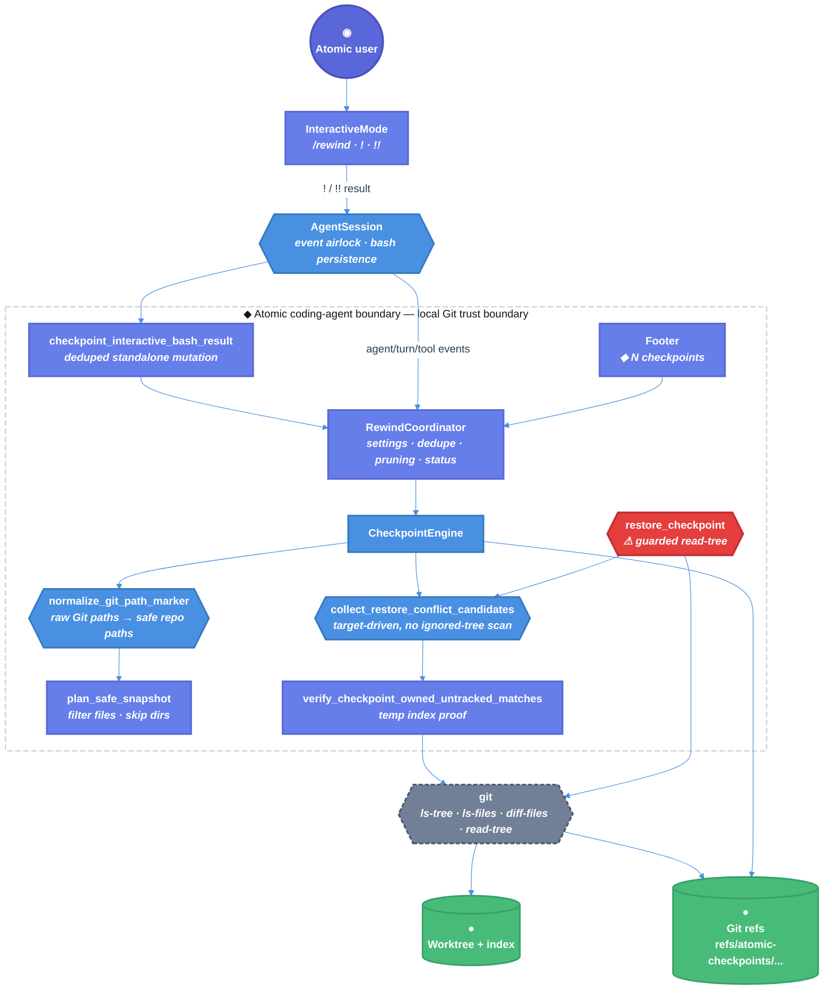

# Atomic Native Rewind Iteration 10 Technical Design Document / RFC

| Document Metadata       | Details                                                                                                                                                                                                 |
| ----------------------- | ------------------------------------------------------------------------------------------------------------------------------------------------------------------------------------------------------- |
| Author(s)               | Norin Lavaee                                                                                                                                                                                            |
| Status                  | In Review (RFC, iteration 10/10 continuation)                                                                                                                                                           |
| Team / Owner            | Atomic CLI / `packages/coding-agent` maintainers                                                                                                                                                        |
| Created / Last Updated  | 2026-06-06 / 2026-06-06                                                                                                                                                                                 |
| Backwards Compatibility | Required: preserve published `@bastani/atomic` CLI behavior, settings names/defaults, session event ordering, `/rewind` list behavior, checkpoint metadata v1, and `refs/atomic-checkpoints/...` refs. |

## 1. Executive Summary

This RFC scopes iteration 10 for native checkpoint/rewind in [bastani-inc/atomic#1243](https://github.com/bastani-inc/atomic/issues/1243). The branch already contains a Git-ref checkpoint engine, coordinator, settings, `/rewind` list command, footer counts, and session lifecycle hooks. The latest actionable review artifact, `/tmp/atomic-ralph-run-2Ocvcf/review-round-9.json`, leaves three P2 blockers: restore scans ignored dependency trees, Git untracked directory markers like `nested/` are rejected as unsafe paths, and interactive `!` / `!!` bash mutations do not create checkpoints.

The iteration-10 doors are `collect_restore_conflict_candidates`, `normalize_git_path_marker`, and `checkpoint_interactive_bash_result`. The proposal replaces broad restore-side untracked scans with target-driven conflict checks, accepts and skips Git directory markers safely, and checkpoints recorded interactive bash results through `RewindCoordinator` without changing public `AgentSession` events.

Impact: native rewind remains conservative against data loss while becoming usable in normal repos with ignored caches, nested checkouts, and user-run shell mutations.

## 2. Context and Motivation

Issue #1243 requests native checkpoint/rewind parity with `arpagon/pi-rewind`: automatic Git tree snapshots, `/rewind`, branch/HEAD safety, filtered untracked capture, restore safety, footer status, settings, and integration with session tree/fork behavior. The GitHub issue is open and describes Atomic’s desired ref namespace as `refs/atomic-checkpoints/...`.

Evidence inspected for this RFC:

- Current branch: `flora131/feature/native-rewind`.
- Current worktree has existing uncommitted source/test changes in:
  - `packages/coding-agent/src/core/agent-session.ts`
  - `packages/coding-agent/src/core/settings-manager.ts`
  - `packages/coding-agent/src/core/slash-commands.ts`
  - `packages/coding-agent/src/modes/interactive/components/footer.ts`
  - `packages/coding-agent/src/modes/interactive/interactive-mode.ts`
  - `packages/coding-agent/src/core/rewind/`
  - `packages/coding-agent/test/rewind/`
- Current continuation spec: `specs/2026-06-06-continue-implementation-of-issue-https-github-com-bastani-inc-atomic-issues-1243.md`.
- Original implementation spec placeholder: `specs/2026-06-06-implement-issue-https-github-com-bastani-inc-atomic-issues-1243.md` is effectively empty.
- Implementation notes: `/tmp/atomic-ralph-notes-EOKbrw/implementation-notes.md`.
- Latest actionable review: `/tmp/atomic-ralph-run-2Ocvcf/review-round-9.json`.
- Prior review infrastructure artifact: `/tmp/atomic-ralph-run-v8RPvj/review-round-10.json` contains invalid structured JSON reviewer failures and no concrete code findings.

### 2.1 Current State

- **Checkpoint engine exists:** `CheckpointEngine` in `packages/coding-agent/src/core/rewind/checkpoint-engine.ts:51` implements `createCheckpoint`, `listCheckpoints`, `previewDiff`, `restoreCheckpoint`, `loadCheckpoint`, and `deleteCheckpoint`.
- **Git refs exist:** `REF_PREFIX` is `refs/atomic-checkpoints` at `checkpoint-engine.ts:21`.
- **Checkpoint metadata exists:** `CheckpointMetadata` version `1` records session id, leaf entry id, trigger, branch, `headSha`, `indexTreeSha`, `worktreeTreeSha`, untracked/skipped path arrays, and snapshot policy in `packages/coding-agent/src/core/rewind/types.ts:24`.
- **Safe snapshot planning exists:** `planSafeSnapshot()` uses `git ls-files --others --exclude-standard -z` at `checkpoint-engine.ts:260` and filters ignored dir names, large files, and large untracked directory groups.
- **Restore guards exist:** `restoreCheckpoint()` checks branch, HEAD, checkpoint tree objects, target paths, untracked hazards, then runs `git read-tree --reset -u` and resets the index at `checkpoint-engine.ts:152-180`.
- **Known restore leak:** restore currently calls `git ls-files --others -z` without `--exclude-standard` at `checkpoint-engine.ts:169`, so ignored non-overlapping dependency/cache trees are scanned before conflict classification.
- **Known path leak:** `toSafeRepoPath()` rejects any empty path segment at `checkpoint-engine.ts:550-553`, so Git’s untracked embedded-repo marker `nested/` becomes `UnsafePath`.
- **Coordinator exists:** `RewindCoordinator` in `packages/coding-agent/src/core/rewind/rewind-coordinator.ts:31` handles initialization, mutating-tool aggregation, dedupe handoff, pruning, status, and footer text.
- **Session lifecycle hooks exist:** `AgentSession` calls rewind after public agent events at `packages/coding-agent/src/core/agent-session.ts:674` and routes `agent_start`, `turn_start`, `tool_execution_end`, and `turn_end` to the coordinator at `agent-session.ts:878-893`.
- **Interactive bash gap remains:** `executeBash()` calls `recordBashResult()` at `agent-session.ts:2978`, and `recordBashResult()` persists/queues `bashExecution` messages at `agent-session.ts:2989-3008`, but neither path calls rewind.
- **Settings exist:** `DEFAULT_REWIND_SETTINGS` and merge/clamp logic live at `packages/coding-agent/src/core/settings-manager.ts:77` and `:190`.
- **Slash/footer integration exists:** `/rewind` is registered at `packages/coding-agent/src/core/slash-commands.ts:48`, handled as list-only at `packages/coding-agent/src/modes/interactive/interactive-mode.ts:6101`, and rendered in the footer via `getRewindFooterStatus()` at `packages/coding-agent/src/modes/interactive/components/footer.ts:234`.

Latest review responses:

| Review finding | Current evidence | Iteration-10 response |
| -------------- | ---------------- | --------------------- |
| `[P2] Don't scan ignored dependency trees during restore` | `restoreCheckpoint()` uses `git ls-files --others -z` at `checkpoint-engine.ts:169`. | Replace broad current-untracked enumeration with target-driven restore conflict candidates. Keep ignored exact-overlap protection. |
| `[P2] Handle Git’s untracked directory markers` | `toSafeRepoPath()` rejects trailing slash markers at `checkpoint-engine.ts:550-553`. | Normalize a single trailing slash directory marker to a safe repo path and skip directory markers during snapshot capture. |
| `[P2] Checkpoint interactive bash mutations too` | `recordBashResult()` has no rewind call at `agent-session.ts:2989-3008`; interactive `!` / `!!` routes through `interactive-mode.ts:3249-3264` and `:6426-6504`. | Add a coordinator door for standalone interactive bash checkpoints, invoked after every recorded bash result. |

### 2.2 The Problem

- **User Impact:** Users can lose the expected rewind point after `!echo ok > file`, and restore can fail in ordinary repositories containing ignored `node_modules/`, `.venv/`, or nested checkouts.
- **Product Impact:** Atomic cannot claim native rewind parity while user-approved shell mutations and common repo layouts remain outside the checkpoint safety model.
- **Technical Debt:** Restore safety currently conflates “all untracked files in the repository” with “paths the checkpoint restore would overwrite.” Bash checkpointing is also scattered: agent tool `bash` is observed via `tool_execution_end`, while user bash only persists a session message.
- **Leaking doors today:** `restoreCheckpoint()` is the destructive door but delegates safety to a broad Git listing that can fail on irrelevant ignored paths. `toSafeRepoPath()` treats Git’s directory marker syntax as hostile rather than typed. `recordBashResult()` records a potentially mutating operation without entering the rewind coordinator.

## 3. Goals and Non-Goals

### 3.1 Functional Goals

- [ ] `restoreCheckpoint()` must not enumerate ignored dependency/cache/venv trees that do not overlap the checkpoint target tree.
- [ ] `restoreCheckpoint()` must still refuse ignored untracked paths when an exact target path or path-shape conflict would be overwritten.
- [ ] Git untracked embedded-repo directory markers such as `nested/` must not fail checkpoint creation with `UnsafePath`.
- [ ] Snapshot planning must preserve/skip untracked directory markers rather than adding nested repositories to checkpoint trees.
- [ ] Existing restore protections must remain: branch mismatch, moved `HEAD`, missing checkpoint objects, unsafe target paths, path-list limits, modified checkpoint-owned untracked files, tracked-target-now-untracked files, and parent/child conflicts.
- [ ] Interactive `!` and `!!` bash results must create a deduped checkpoint after the command finishes when rewind is enabled and the worktree changed.
- [ ] Interactive bash checkpointing must work for both normal `executeBash()` results and extension-provided bash results that call `recordBashResult()`.
- [ ] Interactive bash checkpointing must preserve `recordBashResult()`’s public return type and message-order behavior.
- [ ] No new checkpoint metadata version or ref namespace is introduced.
- [ ] `/rewind` remains list-only in this iteration.
- [ ] Add focused tests for all three review-round-9 findings.
- [ ] Validate with Bun-only commands.

### 3.2 Non-Goals (Out of Scope)

- [ ] No `/rewind` picker, diff browser, restore confirmation UI, or restore modes in iteration 10.
- [ ] No Double-Escape `app.rewind` keybinding change.
- [ ] No `/tree` or `/fork` restore prompt implementation.
- [ ] No conversation rewind or “summarize from here” implementation beyond existing `leafEntryId` metadata.
- [ ] No force-restore mode that overwrites modified untracked files.
- [ ] No metadata v2 migration.
- [ ] No non-Git snapshot backend.
- [ ] No broad rewrite from Git `read-tree` restore to custom file copying.
- [ ] No changes to settings names/defaults except additive internal behavior behind existing rewind settings.
- [ ] No Node/npm/yarn/pnpm development commands.

## 4. Proposed Solution (High-Level Design)

Iteration 10 keeps the current architecture and makes three targeted fixes:

1. **Restore conflict discovery becomes target-driven.** Instead of scanning every current untracked path, the engine enumerates checkpoint target leaf paths and derived parent paths, then checks only those filesystem/Git paths for untracked conflicts.
2. **Git directory markers become typed input.** A raw NUL path ending in one trailing `/` is accepted as a directory marker after normal path safety checks on the trimmed path. Snapshot planning skips these directories; restore can treat them as conflict candidates only if they overlap target paths.
3. **Interactive bash gets a coordinator door.** `AgentSession.recordBashResult()` keeps persisting/queuing bash messages as today, then asks `RewindCoordinator` to create a deduped bash checkpoint using the current leaf id and turn index.

### 4.1 System Architecture Diagram



### 4.2 Architectural Pattern

The design uses **guarded Git snapshot/restore with target-driven preflight**.

- `restore_checkpoint` remains the only destructive file-restore door.
- Raw Git path output crosses a single parsing airlock before it becomes a repo-relative path.
- Restore hazards are derived from checkpoint target paths, not from a repository-wide untracked scan.
- User bash mutations use the same coordinator and dedupe path as agent mutating turns, but do not synthesize public agent events.

### 4.3 Key Components

| Component | Responsibility | Technology Stack | Justification |
| --------- | -------------- | ---------------- | ------------- |
| `CheckpointEngine.restoreCheckpoint()` (`checkpoint-engine.ts:152`) | Destructive restore chokepoint | TypeScript + Git CLI | The restore availability/safety review finding is here. |
| `collectRestoreConflictCandidates()` (new helper) | List only target-overlapping untracked conflicts | TypeScript + `lstat` + targeted `git ls-files` | Avoids scanning ignored non-overlapping dependency trees. |
| `normalizeGitPathMarker()` / path parser | Accept safe trailing-slash Git directory markers | TypeScript | Fixes embedded-repo `nested/` without weakening absolute/path-traversal checks. |
| `planSafeSnapshot()` (`checkpoint-engine.ts:259`) | Filter untracked capture and skip directory markers | TypeScript + Git CLI | Prevents nested repos from being added to checkpoint trees. |
| `verifyCheckpointOwnedUntrackedMatches()` (`checkpoint-engine.ts:342`) | Prove exact checkpoint-owned untracked files are unchanged | TypeScript + temp Git index | Preserves prior iteration’s no-overwrite guarantee. |
| `RewindCoordinator` (`rewind-coordinator.ts:31`) | Settings, dedupe, pruning, footer state | TypeScript | Interactive bash should use the same checkpoint policy and count cache. |
| `AgentSession.recordBashResult()` (`agent-session.ts:2989`) | Existing public bash persistence door | TypeScript | The narrowest place covering `executeBash()` and extension-provided bash results. |
| Existing tests under `packages/coding-agent/test/rewind/` and `test/suite/` | Regression coverage | Bun + package `vitest` script | Current harness already covers engine/coordinator/session behavior. |

### 4.4 The Door Set at a Glance (Stranger-Across-Time View)

`start_rewind_session`, `observe_agent_mutating_tool`, `checkpoint_mutating_turn`, `checkpoint_interactive_bash_result`, `plan_safe_snapshot`, `normalize_git_path_marker`, `capture_worktree_tree`, `list_rewind_checkpoints`, `preview_checkpoint_diff`, `collect_restore_conflict_candidates`, `verify_checkpoint_owned_untracked_matches`, `restore_checkpoint` ⚠, `delete_checkpoint_ref` ⚠, `prune_checkpoints` ⚠, `render_rewind_footer_status`

## 5. Detailed Design

### 5.1 The Doors (Entrypoint Contracts)

```ts
normalize_git_path_marker(
  rawPath: string,
  repoRoot: RepoRoot,
): Result<
  | { kind: "path"; path: RepoPath }
  | { kind: "directory-marker"; path: RepoPath }
>
// Guarantee: converts one raw Git path record into a safe repo-relative path.
// Failure set: UnsafePath.
// Refusals: absolute paths, backslashes, empty interior segments, ".", "..", and paths escaping repoRoot.

collect_restore_conflict_candidates(
  metadata: CheckpointMetadataV1,
  targetTreePaths: readonly RepoPath[],
  repoRoot: RepoRoot,
): Result<{
  exactTargetConflicts: RepoPath[];
  parentConflicts: RepoPath[];
  targetDirectoryConflicts: RepoPath[];
  all: RepoPath[];
}>
// Guarantee: returns only current untracked paths whose shape overlaps the checkpoint target tree.
// Failure set: GitUnavailable | RestoreFailed | UnsafePath | PathListTooLarge.
// Refusals: ignored non-overlapping trees are never enumerated.

verify_checkpoint_owned_untracked_matches(
  worktreeTreeSha: GitTreeSha,
  candidatePaths: readonly RepoPath[],
): Result<ReadonlySet<RepoPath>>
// Guarantee: returns candidate paths whose current worktree content matches the checkpoint tree.
// Failure set: GitUnavailable | RestoreFailed | UnsafePath | PathListTooLarge.
// Refusals: metadata alone cannot exempt a path from restore hazards.

restore_checkpoint(
  checkpointId: CheckpointId,
): Result<RestoredFiles>
// Guarantee: applies the checkpoint only after branch, HEAD, object, path, and conflict guards pass.
// Failure set: CheckpointNotFound | InvalidCheckpointRef | NotGitRepository | GitUnavailable | BranchMismatch | HeadMoved | CheckpointObjectMissing | UnsafeUntrackedOverwrite | PathListTooLarge | UnsafePath | RestoreFailed.
// Refusals: no mutation occurs if any restore preflight fails.

checkpoint_interactive_bash_result(
  input: {
    command: string;
    result: BashResult;
    turnIndex: number;
    leafEntryId: string | null;
  },
): Result<CheckpointMetadata | null>
// Guarantee: creates at most one deduped checkpoint after a recorded interactive bash result.
// Failure set: NotGitRepository | GitUnavailable | SnapshotUnchanged | SnapshotPlanFailed | RefCollisionExhausted | RestoreFailed | PathListTooLarge | UnsafePath | PruneFailed.
// Refusals: disabled rewind, disabled mutating-turn checkpointing, non-Git repos, and unchanged worktrees do not produce checkpoints.
```

**Per-door audit:**

| Door | (1) Joint | (2) One sentence, no “and” | (3) Honest name | (5) Every exit | (6) Refusals real | (7) Trust transition | (8) One chokepoint |
| ---- | --------- | -------------------------- | --------------- | -------------- | ----------------- | -------------------- | ------------------ |
| `normalize_git_path_marker` | ✅ Git path boundary | ✅ “converts raw Git path to safe repo path” | ✅ | safe path / directory marker / unsafe | traversal and malformed path fail before use | raw Git bytes → typed repo path | path airlock |
| `collect_restore_conflict_candidates` | ✅ restore preflight | ✅ “returns target-overlapping untracked conflicts” | ✅ | conflicts / none / Git/path failure | ignored non-overlap cannot fail restore | filesystem/Git state → restore candidates | ✅ conflict classifier |
| `verify_checkpoint_owned_untracked_matches` | ✅ ownership proof | ✅ “proves unchanged checkpoint-owned paths” | ✅ | matching set / proof failure | modified untracked path remains hazardous | metadata candidate → Git proof | proof helper |
| `restore_checkpoint` ⚠ | ✅ destructive restore | ✅ “applies only a safe checkpoint” | ✅ | all named restore errors / success | branch, HEAD, object, path, conflict guards run before mutation | user restore intent → worktree mutation | ✅ sole restore door |
| `checkpoint_interactive_bash_result` | ✅ user shell mutation | ✅ “checkpoints a recorded bash mutation” | ✅ | checkpoint / null / status error | settings and dedupe can refuse checkpoint | user bash result → checkpoint request | standalone bash checkpoint |

### 5.2 API Interfaces — The Same Doors on the Wire

Atomic has no HTTP surface for this feature. The interfaces are local TypeScript APIs, TUI commands, settings JSON, and Git refs.

**Engine API remains compatible:**

```ts
const engine = new CheckpointEngine({ cwd, sessionId });

engine.createCheckpoint(request, policy): Result<CheckpointMetadata>;
engine.listCheckpoints(): Result<CheckpointMetadata[]>;
engine.previewDiff(id): Result<DiffPreview>;
engine.restoreCheckpoint(id): Result<RestoredFiles>;
engine.deleteCheckpoint(id): Result<DeletedCheckpoint>;
```

**Coordinator API gains one internal door:**

```ts
coordinator.checkpointInteractiveBashResult({
  command,
  result,
  turnIndex,
  leafEntryId,
}): Result<CheckpointMetadata | null>;
```

The method should reuse existing settings and snapshot policy:

- `settings.enabled`
- `settings.checkpointOnMutatingTurn`
- `settings.maxCheckpoints`
- `settings.maxUntrackedFileBytes`
- `settings.maxUntrackedDirFiles`
- `settings.ignoredDirNames`

It should create a `CheckpointRequest` without changing metadata v1:

```ts
{
  trigger: "turn",
  turnIndex,
  leafEntryId,
  description: `Interactive bash: ${truncatedCommand}`,
  toolNames: ["bash"],
}
```

**AgentSession public API stays source-compatible:**

```ts
session.recordBashResult(command, result, options): void;
session.executeBash(command, onChunk, options): Promise<BashResult>;
```

`recordBashResult()` remains `void`; rewind failures update coordinator status but do not throw through the existing bash persistence API.

**Slash/TUI behavior stays compatible:**

```text
/rewind
  -> lists recent checkpoints
  -> still says restore UI is deferred
```

**Settings JSON stays compatible:**

```json
{
  "rewind": {
    "enabled": true,
    "maxCheckpoints": 50,
    "checkpointOnSessionStart": true,
    "checkpointOnMutatingTurn": true,
    "promptOnTree": true,
    "promptOnFork": true,
    "maxUntrackedFileBytes": 10485760,
    "maxUntrackedDirFiles": 200,
    "ignoredDirNames": ["node_modules", ".venv", "venv", "dist", "build", ".cache", "target"]
  }
}
```

### 5.3 Data Model / Schema

No persistent schema change is proposed.

`CheckpointMetadata` remains version `1` in `packages/coding-agent/src/core/rewind/types.ts:24`:

| Field | Iteration-10 use |
| ----- | ---------------- |
| `version` | Remains `1`. |
| `id`, `sessionId` | Continue to define `refs/atomic-checkpoints/<sessionId>/<id>`. |
| `leafEntryId` | Used for both agent-turn and interactive-bash checkpoints. |
| `trigger` | Remains `"resume" \| "turn" \| "before-restore"`; interactive bash uses `"turn"` for compatibility. |
| `turnIndex` | Current `AgentSession` turn index at bash result recording time. |
| `description` | For interactive bash, stores a truncated command label. |
| `toolNames` | Interactive bash stores `["bash"]`. |
| `branch`, `headSha` | Continue to guard restore. |
| `indexTreeSha`, `worktreeTreeSha` | Continue to store index and worktree snapshot trees. |
| `preexistingUntrackedFiles` | Still provides exact checkpoint-owned untracked candidates. |
| `skippedLargeFiles`, `skippedLargeDirs`, `skippedIgnoredDirs` | Still record skipped snapshot material. Directory markers may be represented in `skippedLargeDirs` without a schema change. |
| `snapshotPolicy` | Remains optional for old checkpoint compatibility. |

New internal derived types:

```ts
type GitPathEntry =
  | { kind: "path"; path: string }
  | { kind: "directory-marker"; path: string };

type RestoreConflictCandidates = {
  exactTargetConflicts: string[];
  parentConflicts: string[];
  targetDirectoryConflicts: string[];
  all: string[];
};
```

No database, session JSONL, or Git commit body migration is required.

### 5.4 Algorithms and State Management

**A. Restore conflict discovery**

1. Load checkpoint and preserve existing branch/HEAD/object preflight.
2. List checkpoint target leaf paths with:

   ```sh
   git ls-tree -r -z --name-only <worktreeTreeSha>
   ```

3. Parse target paths through the existing safe path parser.
4. Build:
   - `targetLeafPaths`: every checkpoint file/symlink path.
   - `targetParentPaths`: every directory prefix of every target leaf.
5. Build a bounded candidate set from only those paths:
   - If a target leaf path exists in the working tree and is not an exact tracked index path, it is an exact target conflict candidate.
   - If a target leaf path currently exists as an untracked directory, it is a target-directory conflict candidate.
   - If a target parent path exists as an untracked file/symlink, it is a parent conflict candidate.
6. Determine “exact tracked index path” using targeted `git ls-files -z --stage -- <pathspecs>` and exact path equality, not broad `git ls-files --others`.
7. Compute checkpoint-owned exact exemptions:
   - path is an exact target conflict;
   - path exists in `metadata.preexistingUntrackedFiles`;
   - path is not in `metadata.skippedLargeFiles`;
   - `verifyCheckpointOwnedUntrackedMatches()` proves content/mode match.
8. Any remaining candidate path is an `UnsafeUntrackedOverwrite`.
9. Only after zero hazards, run the existing two-step restore:
   - `git read-tree --reset -u <worktreeTreeSha>`
   - `git read-tree --reset <indexTreeSha>`

This preserves ignored exact-overlap safety while avoiding ignored non-overlap scans.

**B. Git directory marker normalization**

1. When reading NUL-delimited Git paths, treat a raw path ending in exactly one `/` as a directory marker.
2. Trim the trailing slash for safety validation.
3. Continue rejecting:
   - empty path after trimming;
   - absolute paths;
   - backslashes;
   - empty interior segments;
   - `.` or `..`;
   - paths escaping `repoRoot`;
   - paths exceeding size/list limits.
4. Snapshot planning handles `directory-marker` entries by adding the directory to a skipped directory set and never passing it to `git add`.
5. Restore conflict discovery only considers directory markers if their normalized path overlaps target paths.

**C. Interactive bash checkpointing**

1. `InteractiveMode` continues parsing `!` and `!!` at `interactive-mode.ts:3249-3264`.
2. Normal `executeBash()` continues to call `recordBashResult()` at `agent-session.ts:2978`.
3. Extension-provided user bash results continue to call `recordBashResult()` at `interactive-mode.ts:6471`.
4. After `recordBashResult()` appends or queues the `bashExecution` message, it calls:

   ```ts
   this._rewindCoordinator.checkpointInteractiveBashResult({
     command,
     result,
     turnIndex: this._turnIndex,
     leafEntryId: this.sessionManager.getLeafId(),
   });
   ```

5. The coordinator lazily initializes if needed, creates a checkpoint with `toolNames: ["bash"]`, dedupes unchanged snapshots, prunes to limit, and updates footer status.
6. `recordBashResult()` still returns `void`; checkpoint errors do not throw into existing bash callers.

## 6. Alternatives Considered

| Option | Pros | Cons | Reason for Rejection |
| ------ | ---- | ---- | -------------------- |
| Keep broad `git ls-files --others -z` restore scan | Minimal code change; catches ignored overlaps | Scans irrelevant ignored caches, can hit path-list limits, fails on unsafe ignored non-target paths | Rejected by review-round-9 finding. |
| Add `--exclude-standard` to restore scan | Very small fix for ignored trees | Misses ignored exact-overlap hazards, allowing restore to overwrite ignored untracked files | Rejected because safety would regress. |
| Raise `MAX_PATH_LIST_BYTES` / `MAX_PATH_LIST_ENTRIES` | Avoids some failures | Still scans huge irrelevant trees and remains slow/unbounded | Rejected because it treats symptoms, not the leaking door. |
| Target-driven restore conflict discovery (selected) | Avoids ignored non-overlap scans while preserving overlap safety | More preflight logic and exact tracked-path checks | Selected as the safest targeted fix. |
| Reject all trailing-slash Git markers | Conservative | Breaks normal repos with nested untracked checkouts | Rejected by review-round-9 finding. |
| Accept trailing slash as a normal file path and add it | Very small parser change | Risks adding embedded repos/gitlinks to checkpoint trees | Rejected; directory markers must be skipped/preserved. |
| Synthesize fake `tool_execution_end` and `turn_end` events for interactive bash | Reuses existing observer path | Would alter public event ordering and confuse extension semantics | Rejected for backwards compatibility. |
| Direct coordinator door for interactive bash (selected) | Covers `executeBash()` and extension-provided results without public event changes | Adds one coordinator method | Selected as the narrowest compatible fix. |
| Block `!` / `!!` while streaming | Avoids concurrent mutation complexity | Does not checkpoint idle interactive bash; changes UX | Rejected for this issue. |

## 7. Cross-Cutting Concerns

### 7.1 Security and Privacy

- **No network surface:** Native rewind remains local Git/filesystem behavior.
- **Destructive door stays singular:** `restore_checkpoint` remains the only checkpoint restore mutation path.
- **Restore remains guard-first:** branch, HEAD, object, path, and conflict checks all run before `git read-tree`.
- **Ignored trees are preserved:** ignored non-overlap directories are not scanned or deleted; ignored overlaps are still refused.
- **No shell interpolation:** existing Git calls use `spawnSync("git", args, ...)`, preserving argument boundaries.
- **Path traversal stays refused:** absolute paths, `..`, `.`, backslashes, and repo escapes remain invalid.
- **Nested repos are preserved:** Git directory markers are skipped, not added to checkpoint trees.
- **Interactive bash errors do not break UX:** checkpoint failures update internal rewind status but do not throw through `recordBashResult()`.
- **Public event order stays stable:** no synthetic agent events are emitted for bash checkpointing.

## Backwards Compatibility

Backwards compatibility is required because `packages/coding-agent` publishes `@bastani/atomic`, and users/extensions can depend on CLI behavior, settings, keybindings, session events, session files, and slash command behavior.

Iteration 10 must preserve:

- `AgentSession.subscribe()` event ordering.
- Extension-before-public event ordering in `AgentSession._processAgentEvent()`.
- `recordBashResult()` return type and message persistence semantics.
- Existing `!` and `!!` command behavior, including `excludeFromContext`.
- Existing `Settings.rewind` keys and defaults.
- Existing `/rewind` command name and list-only behavior.
- Existing footer rendering behavior.
- Existing `CheckpointMetadata.version === 1`.
- Existing ref namespace `refs/atomic-checkpoints/<sessionId>/<checkpointId>`.
- Existing restore error names, especially `UnsafeUntrackedOverwrite`.
- Existing no-op/unavailable behavior outside Git repos.

The behavior changes are compatible bug fixes: irrelevant ignored trees no longer block restore, nested untracked repos no longer block checkpointing, and interactive bash mutations now produce deduped rewind checkpoints.

## 8. Test Plan

- **Restore ignores non-overlapping ignored trees**
  - Add a test in `packages/coding-agent/test/rewind/checkpoint-engine.test.ts`.
  - Scenario: checkpoint a tracked edit, then create ignored `node_modules/` content that does not overlap target paths.
  - Include an ignored filename that would be unsafe if globally parsed, such as a backslash path on POSIX.
  - Pass: `restoreCheckpoint()` succeeds and ignored content remains untouched.

- **Restore still refuses ignored overlap**
  - Preserve the existing ignored overlap test around `checkpoint-engine.test.ts`.
  - Pass: target path that is currently ignored/untracked returns `UnsafeUntrackedOverwrite`.

- **Git directory marker checkpointing**
  - Add a test that creates an untracked nested Git repository under the temp repo.
  - Pass: `createCheckpoint()` succeeds, does not return `UnsafePath`, and does not add nested repo contents to the checkpoint tree.

- **Directory marker restore non-overlap**
  - Add a test where a nested untracked repo exists away from checkpoint targets.
  - Pass: restore succeeds and the nested repo remains.

- **Existing restore safety regressions**
  - Keep coverage for:
    - unchanged checkpoint-owned untracked exact path succeeds;
    - modified checkpoint-owned untracked exact path refuses;
    - current untracked child vs target file refuses;
    - current untracked parent vs target child refuses;
    - tracked target path after `git rm --cached` refuses;
    - branch mismatch and moved `HEAD` refuse;
    - missing checkpoint tree objects refuse before mutation.

- **Interactive bash checkpointing**
  - Add tests in `packages/coding-agent/test/suite/agent-session-bash-persistence.test.ts` or a focused rewind session test.
  - Initialize `harness.tempDir` as a Git repo after harness creation.
  - Call `session.executeBash("printf changed > file.txt")`.
  - Pass: `session.listRewindCheckpoints()` contains a checkpoint with `toolNames: ["bash"]`.
  - Repeat with a read-only bash command after an identical checkpoint.
  - Pass: dedupe prevents a new checkpoint.
  - Repeat with `recordBashResult(..., { excludeFromContext: true })`.
  - Pass: `!!`-style excluded bash can still checkpoint filesystem changes.

- **Disabled settings**
  - With `rewind.enabled: false` or `checkpointOnMutatingTurn: false`, record a mutating bash result.
  - Pass: no checkpoint is created and no exception is thrown.

- **Regression commands**
  - `cd packages/coding-agent && bun run test -- test/rewind/checkpoint-engine.test.ts test/rewind/rewind-coordinator.test.ts`
  - `cd packages/coding-agent && bun run test -- test/suite/agent-session-bash-persistence.test.ts test/suite/agent-session-retry-events.test.ts`
  - `cd packages/coding-agent && bun run test -- test/settings-manager.test.ts test/slash-commands.test.ts test/footer-width.test.ts test/footer-codex-fast-mode.test.ts`
  - `bun run typecheck`

- **Interactive verification**
  1. In a Git repo, start Atomic with rewind enabled.
  2. Run `!printf 'changed\n' > file.txt`.
  3. Run `/rewind`.
  4. Pass: checkpoint count/list includes the interactive bash checkpoint.
  5. Create ignored `node_modules/cache.txt`, restore a checkpoint that does not target it through an internal harness.
  6. Pass: restore succeeds and `node_modules/cache.txt` remains.
  7. Create an untracked nested Git repo `nested/`.
  8. Pass: checkpoint creation succeeds and `/rewind` still lists checkpoints.

## 9. Open Questions / Unresolved Issues

- [ ] Should directory markers be recorded in `skippedLargeDirs`, or should metadata v2 add an explicit `skippedDirectoryMarkers` field? `[OWNER: coding-agent maintainers]`
- [ ] Should interactive bash checkpoints created while an agent turn is streaming be immediate, or delayed until the active turn ends to reduce concurrent mutation ambiguity? `[OWNER: coding-agent maintainers]`
- [ ] Should future `/rewind` UI offer a force mode for modified checkpoint-owned untracked files, or should manual cleanup always be required? `[OWNER: product/UX]`
- [ ] Should `/rewind` restore UI, diff picker, and redo stack be implemented immediately after iteration 10, or split into a separate milestone? `[OWNER: product/UX]`
- [ ] Should `/tree` and `/fork` prompts use native call-site hooks or extension-style pre-hooks for restore prompts? `[OWNER: coding-agent maintainers]`
- [ ] Should Double Escape gain a new `app.rewind` action, or should current `tree` / `fork` / `none` behavior remain unchanged until product intent is explicit? `[OWNER: product]`
- [ ] Should third-party extension tools be able to declare mutating behavior for rewind checkpointing beyond built-in `bash`, `edit`, and `write`? `[OWNER: extensions maintainers]`
- [ ] Should invalid structured JSON reviewer failures, as in `/tmp/atomic-ralph-run-v8RPvj/review-round-10.json`, block PR approval when focused Bun validation and actionable review findings are clean? `[OWNER: Ralph/review infrastructure]`
