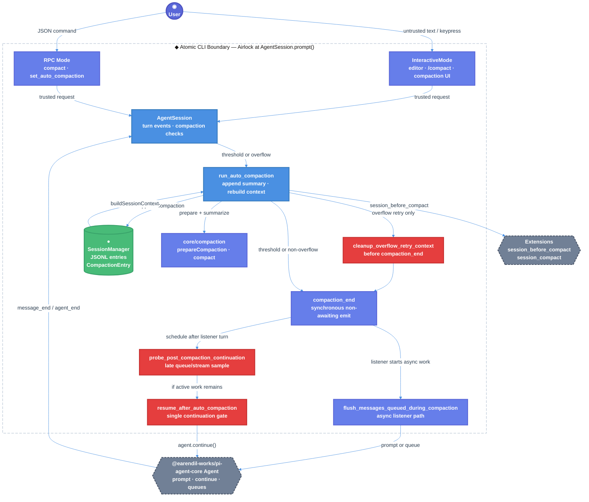
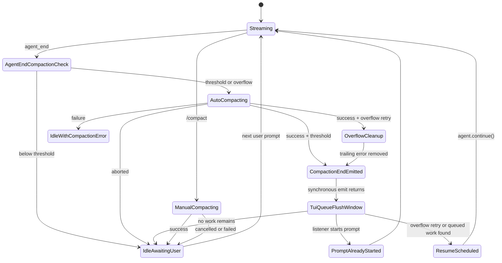

# Atomic CLI Auto-Compaction Resume Technical Design Document / RFC

| Document Metadata      | Details                                                                 |
| ---------------------- | ----------------------------------------------------------------------- |
| Author(s)              | Alex Lavaee                                                             |
| Status                 | Draft (WIP)                                                             |
| Team / Owner           | Atomic CLI / `packages/coding-agent`                                    |
| Created / Last Updated | 2026-06-06                                                              |
| Compatibility Posture  | Backward compatible; no public API, CLI, session-format, or hook breaks |

## 1. Executive Summary

GitHub issue [#1280](https://github.com/bastani-inc/atomic/issues/1280) reports that Atomic can stop responding after automatic session compaction, leaving long-running work idle until the user sends another prompt. The relevant path is `AgentSession._runAutoCompaction()` in `packages/coding-agent/src/core/agent-session.ts`, which persists a `CompactionEntry`, rebuilds `agent.state.messages`, emits `compaction_end`, and decides whether to re-enter the generation loop.

This RFC proposes a minimal, explicit auto-compaction resume design with two load-bearing doors: `cleanup_overflow_retry_context` and `probe_post_compaction_continuation`. Successful overflow compaction must remove the saved trailing context-overflow assistant error from in-memory retry context before any `compaction_end` listener can start another run. Successful auto-compaction then schedules a deferred probe that samples live streaming and queue state after `compaction_end` listeners can flush messages typed during compaction. It calls `agent.continue()` only when active work remains.

Impact: unattended work continues after auto-compaction without changing manual `/compact`, explicit user waits, or session persistence.

## 2. Context and Motivation

### 2.1 Current State

- **Architecture:** `AgentSession` owns the core turn loop around `@earendil-works/pi-agent-core.Agent`. It receives `AgentEvent`s, persists messages through `SessionManager`, checks auto-compaction after `agent_end`, and emits `AgentSessionEvent`s for TUI/RPC layers.
  - Event emission is synchronous and non-awaiting: `packages/coding-agent/src/core/agent-session.ts:558-562`.
  - Event processing and compaction trigger: `packages/coding-agent/src/core/agent-session.ts:572-710`.
  - User prompt entrypoint: `packages/coding-agent/src/core/agent-session.ts:1125-1273`.
  - Manual compaction: `packages/coding-agent/src/core/agent-session.ts:1953-2078`.
  - Auto-compaction: `packages/coding-agent/src/core/agent-session.ts:2109-2362`.
  - Current deferred-probe draft: `packages/coding-agent/src/core/agent-session.ts:2198-2222`.
  - Session context rebuild: `packages/coding-agent/src/core/session-manager.ts:333-440`.
  - Interactive compaction event handling: `packages/coding-agent/src/modes/interactive/interactive-mode.ts:3539-3607`.
  - Interactive compaction queue flushing: `packages/coding-agent/src/modes/interactive/interactive-mode.ts:4431-4509`.
- **Compaction behavior:** `prepareCompaction()` chooses a cut point and `compact()` generates the summary in `packages/coding-agent/src/core/compaction/compaction.ts:624-812`. `SessionManager.appendCompaction()` persists the summary as a `CompactionEntry` at `packages/coding-agent/src/core/session-manager.ts:903-919`.
- **Prior art:** `packages/coding-agent/docs/compaction.md` documents threshold compaction, manual `/compact`, split-turn compaction, extension hooks, and the `CompactionEntry` format. `specs/2026-03-02-opencode-auto-compaction.md` previously resolved that auto-compaction recovery should continue without user intervention. `specs/2026-03-25-workflow-interrupt-resume-session-preservation.md` establishes the related principle that interrupted live work must preserve and resume the same session context.
- **Leaking doors today:** `_runAutoCompaction(reason, willRetry)` mixes compaction persistence, extension event emission, UI lifecycle events, retry-context cleanup, and generation-loop re-entry. The retry-context cleanup and re-entry rules must be named and sequenced correctly.

### 2.2 The Problem

- **User Impact:** Long-running agent tasks can hang after auto-compaction. Users may think Atomic is still working when the core loop is idle.
- **Business Impact:** Atomic’s value for unattended coding tasks is reduced because automatic context management can introduce a hidden manual intervention point.
- **Technical Debt:** The boundary between “successful compaction,” “remove the overflow error from retry context,” and “resume the interrupted active turn” is currently implicit and timing-sensitive.
- **Compatibility Constraint:** `@bastani/atomic` is a published CLI/package. Existing CLI commands, session files, extension hooks, SDK methods, and manual waiting behavior must remain compatible.

### 2.3 Latest Review Findings Addressed

- **Round 1 Reviewer B P1 — “Resume after compaction queues are flushed”:** Sampling `agent.hasQueuedMessages()` immediately after `compaction_end` was too early because `InteractiveMode.flushCompactionQueue()` runs asynchronously from that event.  
  **Resolution:** use a deferred continuation probe that samples live state at callback time instead of using an immediately captured queue boolean.
- **Round 2 Reviewer A P2 — “Don’t skip overflow cleanup when another run starts”:** Moving overflow cleanup into the deferred probe made cleanup subject to the probe’s `isStreaming` early return. If a `compaction_end` listener starts another run before the probe fires, the trailing saved context-overflow assistant error can remain in `agent.state.messages` and leak into the next run.  
  **Resolution:** perform `cleanup_overflow_retry_context` synchronously after rebuilding compacted context and before emitting `compaction_end` for overflow retries. The deferred probe then owns only continuation, not retry-context cleanup.
- **Round 2 Reviewer B:** No findings; targeted tests, typecheck, and diff checks passed in that review.

## 3. Goals and Non-Goals

### 3.1 Functional Goals

- [ ] Locate and confirm the auto-compaction completion path in `AgentSession._runAutoCompaction()` and the related waiting/queue state in `AgentSession`, `SessionManager`, and `InteractiveMode`.
- [ ] Ensure successful overflow auto-compaction removes any trailing context-overflow assistant error from in-memory retry context before `compaction_end` listeners can start another prompt/continue.
- [ ] Ensure successful auto-compaction schedules a deferred continuation probe after `compaction_end` listeners can flush compaction queues.
- [ ] Ensure the probe calls `agent.continue()` for overflow retry or queued active-turn work without relying on an immediate pre-flush `hasQueuedMessages` snapshot.
- [ ] Preserve normal idle behavior after threshold auto-compaction when no active turn work remains.
- [ ] Preserve manual `/compact` behavior: manual compaction aborts active generation, summarizes context, and waits for explicit user input.
- [ ] Add regression tests that fail with the immediate-snapshot implementation and with the “cleanup inside streaming-guarded deferred probe” implementation.
- [ ] Keep session persistence unchanged: compaction still writes a `CompactionEntry` and reloads context through `SessionManager.buildSessionContext()`.
- [ ] Update `packages/coding-agent/CHANGELOG.md` under `## [Unreleased]` → `### Fixed` with a link to issue #1280.
- [ ] Validate with targeted coding-agent tests and `bun run typecheck`.

### 3.2 Non-Goals (Out of Scope)

- [ ] We will NOT redesign compaction summarization, prompts, cut-point selection, split-turn handling, or file-operation tracking.
- [ ] We will NOT change the `CompactionEntry` session schema or migrate existing session files.
- [ ] We will NOT remove the persisted overflow error from session history; cleanup applies to in-memory retry context only.
- [ ] We will NOT make manual `/compact` automatically resume generation.
- [ ] We will NOT synthesize a new visible user prompt such as “Continue” for threshold compaction.
- [ ] We will NOT make `AgentSession._emit()` await all listeners; that is a broader event-system semantic change.
- [ ] We will NOT rewrite `@earendil-works/pi-agent-core` or depend on new undocumented queue internals.
- [ ] We will NOT create the pull request in this RFC stage.

## 4. Proposed Solution (High-Level Design)

### 4.1 System Architecture Diagram



### 4.2 Architectural Pattern

Use an **event-driven session loop with pre-event retry cleanup and a deferred continuation probe**:

1. `AgentSession` observes `agent_end`.
2. `_checkCompaction()` decides whether compaction is required.
3. `_runAutoCompaction()` performs compaction and rebuilds `agent.state.messages`.
4. For overflow retry, `cleanup_overflow_retry_context` removes the trailing overflow assistant error before `compaction_end` is emitted.
5. Successful auto-compaction emits `compaction_end`.
6. Successful auto-compaction schedules `probe_post_compaction_continuation` after `compaction_end`.
7. The probe samples live state after listener-initiated queue flushing.
8. `resume_after_auto_compaction` is the only internal door allowed to call `agent.continue()` after compaction.
9. Manual compaction uses a separate door and never reaches retry cleanup or the continuation gate.

### 4.3 Key Components

| Component | Responsibility | Technology Stack | Justification |
| ----------------- | --------------------------- | ----------------- | -------------------------------------------- |
| `AgentSession` | Owns prompt submission, event persistence, auto-compaction checks, queue state, retry state, retry-context cleanup, and continuation scheduling | TypeScript, `@earendil-works/pi-agent-core` | The bug lives in the active turn/session state boundary. |
| `_checkCompaction()` | Classifies overflow vs. threshold compaction and skips stale pre-compaction messages | `packages/coding-agent/src/core/agent-session.ts` | Existing decision point after `agent_end` and before new prompts. |
| `_dropTrailingOverflowAssistantErrorIfPresent()` | Removes a saved overflow assistant error from rebuilt in-memory context | `packages/coding-agent/src/core/agent-session.ts` | Must run before listeners can start another run. |
| `_runAutoCompaction()` | Generates/persists compaction, rebuilds `agent.state.messages`, performs overflow cleanup, emits `compaction_end`, and schedules the continuation probe | `packages/coding-agent/src/core/agent-session.ts` | Existing completion path to harden. |
| `probe_post_compaction_continuation` | Samples `isStreaming` and `agent.hasQueuedMessages()` after event listeners can flush queues | Helper in `AgentSession` | Directly addresses review P1 timing race. |
| `resume_after_auto_compaction` | Calls `agent.continue()` exactly when active work remains | Helper in `AgentSession` | Makes automatic continuation auditable and testable. |
| `InteractiveMode.flushCompactionQueue()` | Moves user input typed during compaction into prompt/queue handling | `packages/coding-agent/src/modes/interactive/interactive-mode.ts` | Must keep current UI semantics but be accounted for by core timing. |
| `SessionManager` | Persists `CompactionEntry` and rebuilds compacted context | TypeScript JSONL session store | Must remain schema-compatible. |
| `packages/coding-agent/test/agent-session-auto-compaction-queue.test.ts` | Regression tests for auto-compaction continuation timing and overflow cleanup | Vitest via Bun | Best focused test location. |
| `packages/coding-agent/CHANGELOG.md` | User-visible fix entry | Markdown | Package convention requires `[Unreleased]` changelog updates. |

### 4.4 The Door Set at a Glance (Stranger-Across-Time View)

`submit_user_prompt`, `queue_steering_message`, `queue_follow_up_message`, `compact_context_manually`, `check_auto_compaction`, `run_auto_compaction`, `cleanup_overflow_retry_context`, `emit_compaction_completed`, `flush_messages_queued_during_compaction`, `probe_post_compaction_continuation`, `resume_after_auto_compaction` ⚠, `rebuild_context_from_compaction`.

## 5. Detailed Design

### 5.1 The Doors (Entrypoint Contracts)

```ts
compact_context_manually(
  customInstructions?: string,
): Promise<CompactionResult>
// Guarantee: aborts active generation and compacts the current branch context.
// CompactionError = NoModel | NoAuth | NothingToCompact | ExtensionCancelled | Aborted | SummaryFailed
// Refusal: cannot schedule post-compaction generation.

check_auto_compaction(
  assistantMessage: AssistantMessage,
  skipAbortedCheck?: boolean,
): Promise<void>
// Guarantee: detects one eligible overflow or threshold compaction for a fresh assistant message.
// CompactionCheckExit = Disabled | AbortedMessage | StalePreCompactionMessage | NoUsage | NotOverThreshold | OverflowRecoveryExhausted | AutoCompactionStarted
// Refusal: stale assistant usage before the latest compaction boundary cannot trigger another compaction.

run_auto_compaction(
  reason: "overflow" | "threshold",
  willRetry: boolean,
): Promise<void>
// Guarantee: persists one successful compaction and schedules a post-event continuation probe.
// AutoCompactionError = NoModel | NoAuth | NothingToCompact | ExtensionCancelled | Aborted | SummaryFailed
// Refusal: failed, cancelled, or no-op compaction cannot resume generation.

cleanup_overflow_retry_context(): void
// Guarantee: removes the trailing overflow assistant error from in-memory context before any retry can start.
// CleanupExit = Removed | NothingToRemove
// Refusal: does not delete persisted session history.

probe_post_compaction_continuation(
  reason: "overflow" | "threshold",
  willRetry: boolean,
): void
// Guarantee: samples live stream and queue state after compaction_end listeners can flush their queues.
// ProbeExit = AlreadyStreaming | QueuedWorkFound | OverflowRetry | NoWorkRemaining
// Refusal: cannot perform overflow cleanup; cleanup already happened before compaction_end.

resume_after_auto_compaction(
  reason: "overflow" | "threshold",
): void
// Guarantee: schedules exactly one continuation for confirmed active work.
// ContinueExit = Scheduled | ContinueFailed
// Refusal: manual compaction and idle threshold compaction cannot enter this door.

flush_messages_queued_during_compaction(
  queued: CompactionQueuedMessage[],
  willRetry: boolean,
): Promise<void>
// Guarantee: preserves user-entered messages typed during compaction.
// QueueFlushError = PromptRejected | ExtensionCommandFailed
// Refusal: queued messages are not silently dropped; on failure they are restored.
```

**Per-door audit (run the rubric):**

| Door | (1) Joint | (2) One sentence, no "and" | (3) Honest name | (5) Every exit | (6) Refusals real | (7) Trust transition | (8) One chokepoint |
| ------------------ | --------------- | ---------------------------- | ------------------------------- | ------------------------------------------------ | ----------------------------------------- | -------------------- | ------------------------------ |
| `compact_context_manually` | ✅ user-visible `/compact` joint | ✅ “aborts active generation” | ✅ manual intent explicit | ✅ abort/no model/no auth/no-op/failure | ✅ no continuation path | n/a | ✅ manual compaction only here |
| `check_auto_compaction` | ✅ post-assistant lifecycle joint | ✅ “detects eligible compaction” | ✅ names auto behavior | ✅ disabled/stale/no usage/not threshold/overflow exhausted | ✅ stale usage check at `agent-session.ts:2125-2134` | n/a | ✅ classification before compaction |
| `run_auto_compaction` | ✅ context pressure joint | ✅ “persists one compaction” | ✅ reason is explicit | ✅ no model/no auth/no prep/cancel/failure/success | ✅ no success means no cleanup/probe | n/a | ✅ only auto-compaction writer |
| `cleanup_overflow_retry_context` | ✅ retry-context joint | ✅ “removes overflow error” | ✅ names the exact cleanup | ✅ removed/nothing-to-remove | ✅ in-memory only, not persisted history | n/a | ✅ sole overflow cleanup door |
| `probe_post_compaction_continuation` | ✅ review-identified timing joint | ✅ “samples live state later” | ✅ names the delay | ✅ streaming/queued/retry/no-work | ✅ refuses stale queue snapshots and cleanup | n/a | ✅ only post-event probe |
| `resume_after_auto_compaction` ⚠ | ✅ turn-loop re-entry joint | ✅ “schedules one continuation” | ✅ says resume, not retry | ✅ scheduled/failed | ✅ unreachable from manual/idle paths | n/a | ✅ sole automatic re-entry door |
| `flush_messages_queued_during_compaction` | ✅ TUI queue joint | ✅ “preserves typed messages” | ✅ names compaction queue | ✅ sent/queued/restored/error | ✅ restores on prompt failure | TUI input already passed airlock | TUI-only queue handling |

### 5.2 API Interfaces — The Same Doors on the Wire

No new external HTTP/gRPC API is introduced.

```ts
// SDK/internal surface
AgentSession.prompt(text, options?)              // = submit_user_prompt
AgentSession.steer(text, images?)                // = queue_steering_message
AgentSession.followUp(text, images?)             // = queue_follow_up_message
AgentSession.compact(customInstructions?)        // = compact_context_manually
AgentSession.abortCompaction()                   // cancels manual or auto compaction

// AgentSessionEvent surface; existing fields remain compatible
{ type: "compaction_start", reason: "manual" | "threshold" | "overflow" }
{
  type: "compaction_end",
  reason: "manual" | "threshold" | "overflow",
  result: CompactionResult | undefined,
  aborted: boolean,
  willRetry: boolean,
  errorMessage?: string
}
```

CLI/RPC surfaces remain unchanged:

```text
/compact [instructions]                  # manual compaction; no auto-resume
interactive prompt while streaming        # queues steer/follow-up per current settings
interactive prompt while compacting       # InteractiveMode compaction queue
RPC { "type": "compact" }                 # manual compaction command
RPC { "type": "set_auto_compaction" }      # toggles settings
```

Implementation should avoid adding new event fields unless necessary. If later needed, only optional metadata such as `willContinue?: boolean` may be added; existing consumers must not be required to handle it.

### 5.3 Data Model / Schema

No data migration is required.

**Session JSONL entry:** `CompactionEntry` (`packages/coding-agent/src/core/session-manager.ts:67-77`)

| Field | Type | Constraints | Description |
| --------- | ---- | ------------------------------------ | ------------------------------ |
| `type` | `"compaction"` | Required | Identifies compaction entries. |
| `id` | `string` | Required, session entry id | Unique entry identifier. |
| `parentId` | `string \| null` | Required | Points to previous leaf entry. |
| `timestamp` | `string` | ISO timestamp | Creation time. |
| `summary` | `string` | Required | Generated or extension-provided context summary. |
| `firstKeptEntryId` | `string` | Required | First pre-compaction entry retained in context. |
| `tokensBefore` | `number` | Required | Estimated context tokens before compaction. |
| `details` | `unknown` | Optional JSON | Default includes read/modified file lists. |
| `fromHook` | `boolean` | Optional | True when extension provided the summary. |

**In-memory state:**

| State | Location | Purpose |
| ----- | -------- | ------- |
| `_autoCompactionAbortController` | `AgentSession` | Marks auto-compaction in progress and supports cancellation. |
| `_lastAssistantMessage` | `AgentSession` | Carries assistant completion from `message_end` to `agent_end` compaction check. |
| `_overflowRecoveryAttempted` | `AgentSession` | Prevents infinite overflow compact/retry loops. |
| Agent queues | `@earendil-works/pi-agent-core.Agent` | Hold steering/follow-up/custom messages that require `agent.continue()`. |
| `compactionQueuedMessages` | `InteractiveMode` | Holds user input typed while compaction is in progress until `compaction_end`. |
| Deferred continuation timer | `AgentSession` helper-local state | Gives `compaction_end` listeners a queue-flush window before live state is sampled. |

### 5.4 Algorithms and State Management

**Auto-compaction completion algorithm:**

1. On assistant `message_end`, persist the message and store it as `_lastAssistantMessage`.
2. On `agent_end`, call `_checkCompaction(_lastAssistantMessage)`.
3. `_checkCompaction()` returns unless auto-compaction is enabled, the message is fresh relative to the latest compaction, and either:
   - overflow recovery is needed, or
   - threshold usage exceeds `contextWindow - reserveTokens`.
4. `_runAutoCompaction(reason, willRetry)` emits `compaction_start`, prepares compaction, calls extension hooks, generates or accepts a summary, appends `CompactionEntry`, and rebuilds `agent.state.messages`.
5. If `reason === "overflow" && willRetry === true`, call `cleanup_overflow_retry_context()` immediately after rebuilding `agent.state.messages` and before emitting `compaction_end`.
6. `_runAutoCompaction()` emits `compaction_end`.
7. On successful auto-compaction, `_runAutoCompaction()` schedules a deferred continuation probe. It must not pass a captured `hasQueuedMessages` boolean.
8. The deferred probe runs after the current event-handler stack and the `compaction_end` listener turn:
   - If `this.isCompacting` is true, return; a new compaction is active.
   - If `this.isStreaming` is true, return; a listener already started a prompt/continue.
   - If `willRetry === true`, call `agent.continue()`.
   - Else if `this.agent.hasQueuedMessages()` is true, call `agent.continue()`.
   - Else return; threshold compaction completed while no active work remained.
9. Manual `compact()` never calls cleanup or schedules this probe.

**Pseudocode target:**

```ts
private _dropTrailingOverflowAssistantErrorIfPresent(): void {
  const messages = this.agent.state.messages;
  const lastMsg = messages[messages.length - 1];
  if (lastMsg?.role === "assistant" && lastMsg.stopReason === "error") {
    this.agent.state.messages = messages.slice(0, -1);
  }
}

private _scheduleResumeAfterAutoCompaction(
  reason: "overflow" | "threshold",
  willRetry: boolean,
): void {
  setTimeout(() => {
    if (this.isCompacting || this.isStreaming) return;

    if (willRetry) {
      this._resumeAfterAutoCompaction(reason);
      return;
    }

    if (!this.agent.hasQueuedMessages()) return;
    this._resumeAfterAutoCompaction(reason);
  }, AUTO_COMPACTION_RESUME_DELAY_MS);
}

// In _runAutoCompaction(), after rebuild and before compaction_end:
this.agent.state.messages = this.sessionManager.buildSessionContext().messages;
if (reason === "overflow" && willRetry) {
  this._dropTrailingOverflowAssistantErrorIfPresent();
}
this._emit({ type: "compaction_end", reason, result, aborted: false, willRetry });
this._scheduleResumeAfterAutoCompaction(reason, willRetry);
```

**State machine:**



## 6. Alternatives Considered

| Option | Pros | Cons | Reason for Rejection |
| ------------------------------------------- | ------------------------------------------- | ------------------------------------------------------ | ------------------------------------------------------------------------------ |
| Option A: Always call `agent.continue()` after any auto-compaction | Very simple and fixes stalls broadly | Starts new generation after normal threshold compaction even when the assistant was truly done | Violates the requirement to preserve normal waiting-for-user behavior. |
| Option B: Inject a synthetic visible “Continue” user prompt | Easy to reason about from transcript; mirrors some older recovery designs | Pollutes session history, changes user-visible semantics, and may trigger work without an actual active queue | Too invasive for issue #1280; current core already has `Agent.continue()`. |
| Option C: Resume from `InteractiveMode` only | Lets TUI flush its queue and then explicitly kick continuation | Misses RPC/SDK/headless sessions and duplicates core queue semantics in UI code | The bug is in session-loop re-entry, so the fix belongs in `AgentSession`. |
| Option D: Immediate `agent.hasQueuedMessages()` snapshot after `compaction_end` | Small refactor and early targeted tests pass | Misses async `InteractiveMode.flushCompactionQueue()` because `_emit()` does not await listeners | Rejected by round 1 review P1. |
| Option E: Make `_emit()` await async listeners | Provides a precise listener-completion barrier | Broad semantic change across all session events; risks deadlocks/reentrancy and slows event delivery | Too broad for this bug fix. |
| Option F: Deferred probe that also owns overflow cleanup | Centralizes post-compaction work in one timer | If another run starts before the probe, `isStreaming` can suppress cleanup and leak the overflow error into context | Rejected by round 2 review P2. |
| Option G: Pre-event overflow cleanup plus deferred continuation probe (Selected) | Removes retry-context poison before listeners can start, samples queues after listener flush, preserves idle/manual behavior | Uses two small helper doors instead of one | **Selected:** fixes both reviewed races without widening event-system scope. |

## 7. Cross-Cutting Concerns

### 7.1 Security and Privacy

- **The trust transition is singular:** untrusted user input enters through `InteractiveMode`/RPC and becomes trusted only through `AgentSession.prompt()` and extension input hooks. Auto-resume does not introduce a new user-input boundary.
- **Irreversible effects stay behind existing tool gates:** auto-resume may continue a turn that can execute tools, but only for work already queued or retrying from the same active turn. It must not create a new arbitrary prompt.
- **Manual control remains available:** `abortCompaction()` continues to cancel manual or auto compaction. Cancelled/failed compaction must not resume automatically.
- **Extension privacy remains unchanged:** `session_before_compact` and `session_compact` hooks receive the same compaction data as before.
- **Data protection:** No new persisted fields, telemetry payloads, or session-file migrations are introduced.
- **History integrity:** The overflow assistant error remains persisted in session history for auditability; only in-memory retry context is cleaned.

## Backwards Compatibility

This project must preserve backward compatibility because `@bastani/atomic` is a published CLI/package with downstream users and extension authors.

- **CLI compatibility:** `/compact`, `/resume`, `--continue`, normal prompt submission, and queue keybindings keep their current names and behavior.
- **SDK compatibility:** `AgentSession.prompt()`, `compact()`, `steer()`, `followUp()`, and `abortCompaction()` signatures remain unchanged.
- **Event compatibility:** Existing `compaction_start` and `compaction_end` fields remain unchanged. Any new field must be optional.
- **Session compatibility:** Existing JSONL `CompactionEntry` files remain valid; no migration is needed.
- **Behavior compatibility:** Manual compaction still waits for user input. Threshold auto-compaction with no queued active work still waits for user input. The only behavior changes are bug fixes: overflow retry context no longer includes the stale overflow error, and auto-compaction no longer drops an in-progress continuation path after listener-queued work is flushed.

## 8. Test Plan

- **Unit Tests:**
  - Add/update `packages/coding-agent/test/agent-session-auto-compaction-queue.test.ts` to assert threshold auto-compaction calls `agent.continue()` when agent-level queued messages already exist.
  - Add a review-regression test where a `compaction_end` subscriber asynchronously queues an agent message after a microtask/timer; `_runAutoCompaction("threshold", false)` must still call `agent.continue()` after the deferred probe. This test must fail against the immediate-snapshot implementation.
  - Add a round-2 review-regression test for overflow cleanup: after overflow compaction rebuilds state with a trailing context-overflow assistant error, a `compaction_end` listener simulates another run starting before the deferred probe; the test must assert the trailing overflow error was removed before listener-started work can use `agent.state.messages`.
  - Assert threshold auto-compaction with no queued messages does not call `agent.continue()`.
  - Assert the deferred probe does not call `agent.continue()` if a `compaction_end` listener already started a prompt and `session.isStreaming` is true.
  - Assert manual `AgentSession.compact()` does not call `agent.continue()`.
  - Assert overflow recovery schedules exactly one continuation when no listener has already started streaming.
  - Assert failed or aborted auto-compaction never schedules the deferred probe.
- **End-to-End Tests:**
  - Use a mocked `Agent` stream that queues follow-up/steering work, triggers threshold compaction, and verifies the next model call starts without a second user prompt.
  - Preserve existing manual compaction E2E coverage in `packages/coding-agent/test/agent-session-compaction.test.ts`.
- **Integration Tests:**
  - Verify `InteractiveMode` still rebuilds chat and appends a synthetic compaction summary on `compaction_end` (`packages/coding-agent/test/interactive-mode-compaction.test.ts`).
  - Verify messages typed during compaction are retained and flushed/restored according to existing queue behavior.
  - Verify `SessionManager.buildSessionContext()` still emits compaction summary first, then kept messages, then post-compaction messages.
- **Fuzz / Property Tests:**
  - For generated combinations of `{success, aborted, willRetry, listenerStartsPrompt, queueAfterListenerFlush}`, assert continuation is scheduled iff `success && !aborted && !listenerStartsPrompt && (willRetry || queueAfterListenerFlush)`.
  - For generated overflow retry cases, assert trailing overflow assistant errors are removed before any listener-observable post-compaction state.
  - For generated stale/fresh assistant timestamps around a `CompactionEntry`, assert stale pre-compaction usage cannot trigger another compaction.
- **Interactive Verification:**
  - Run focused tests:
    ```sh
    bun --cwd packages/coding-agent run test -- test/agent-session-auto-compaction-queue.test.ts test/interactive-mode-compaction.test.ts test/agent-session-compaction.test.ts
    ```
    Pass condition: deferred queue-flush regression test calls `agent.continue()` exactly once, overflow cleanup happens before listener-started streaming, no-queue threshold compaction does not continue, manual compaction does not continue, and TUI compaction tests still pass.
  - Run type checks:
    ```sh
    bun run typecheck
    ```
    Pass condition: exits 0.
  - Run whitespace/diff validation:
    ```sh
    git diff --check main
    ```
    Pass condition: exits 0.
  - If practical, run broader tests:
    ```sh
    bun --cwd packages/coding-agent run test
    bun run test:unit
    ```
    Pass condition: exits 0 or unrelated failures are documented in `issues.md` during implementation and resolved/deleted before PR.

## 9. Open Questions / Unresolved Issues

- [ ] Should `AUTO_COMPACTION_RESUME_DELAY_MS` remain the existing 100ms continuation delay for behavioral continuity? Current recommendation: yes, preserve the existing 100ms delay unless tests prove it is insufficient. `[OWNER: coding-agent maintainers]`
- [ ] Should `resume_after_auto_compaction` surface a visible warning if `agent.continue()` rejects, or keep the current swallowed-rejection behavior to avoid introducing new UI noise? `[OWNER: coding-agent maintainers]`
- [ ] Are there `@earendil-works/pi-agent-core` pending-work states besides `isStreaming` and `hasQueuedMessages()` that should suppress or trigger the deferred continuation probe? `[OWNER: coding-agent maintainers]`
- [ ] Should the overflow cleanup regression test assert listener-observed state directly or assert the next prompt’s input context excludes the stale overflow error? `[OWNER: QA / coding-agent maintainers]`
- [ ] Confirm changelog wording remains: “Fixed auto-compaction so queued in-progress work resumes without requiring a manual follow-up prompt ([#1280](https://github.com/bastani-inc/atomic/issues/1280)).” `[OWNER: release maintainer]`
