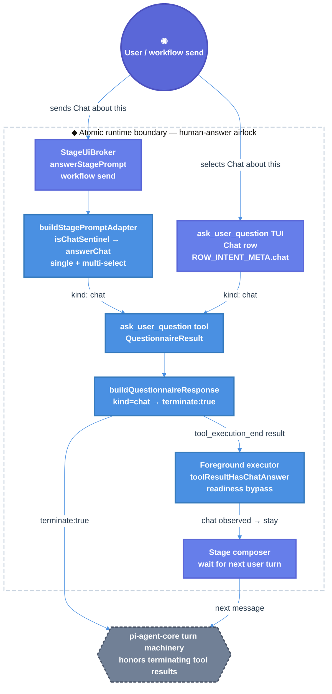

# Atomic Chat-about-this Termination Technical Design Document / RFC

| Document Metadata      | Details                                                                 |
| ---------------------- | ----------------------------------------------------------------------- |
| Author(s)              | Norin Lavaee                                                            |
| Status                 | In Review (RFC) — implementation committed in PR #1266, final verification pending |
| Team / Owner           | Atomic Coding Agent / Workflows                                         |
| Created / Last Updated | 2026-06-05 / 2026-06-05                                                 |
| Backwards Compatibility | Required; breaking changes are not allowed for published tool/workflow surfaces |

## 1. Executive Summary

GitHub issue [bastani-inc/atomic#1264](https://github.com/bastani-inc/atomic/issues/1264) reports that selecting **Chat about this** in `ask_user_question` could be treated as passive context, letting the current task/workflow continue instead of entering a free-form chat path.

The core design is now implemented on branch `flora131/bug/chat-about-this` and PR [#1266](https://github.com/bastani-inc/atomic/pull/1266): `buildStagePromptAdapter` converts both single- and multi-select `"Chat about this"` inputs into `kind: "chat"`, `buildQuestionnaireResponse` turns any chat answer into a `terminate: true` stop/wait envelope, and the foreground executor’s `toolResultHasChatAnswer` path bypasses readiness confirmation and returns control to the composer.

Iteration 3/4 should not restart implementation. It should preserve the current tree, address only real findings, rerun the required Bun validations, keep the PR updated, and treat the latest reviewer-b failure as a structured-output/process issue unless it produces concrete code findings.

## 2. Context and Motivation

GitHub issue #1264 expects selecting **Chat about this** to “reliably steer the agent into an explicit chat state/conversation path” instead of continuing the underlying task flow. This matters because `ask_user_question` is a human-in-the-loop control point: users need a reliable escape hatch from structured choices into conversation.

Investigation evidence for this iteration:

- Current branch: `flora131/bug/chat-about-this`.
- `git status --short --branch` shows the branch tracking `origin/flora131/bug/chat-about-this`; only this RFC/spec file is locally modified.
- Code changes are already committed in:
  - `93fd4af5 fix: stop workflow continuation for chat-about-this`
  - `eaa0cdf5 fix(workflows): preserve multi-select chat sentinel`
- PR [#1266](https://github.com/bastani-inc/atomic/pull/1266) is open against `main` and its body references/closes issue #1264.
- Latest review artifact `/tmp/atomic-ralph-run-53kgNG/review-round-2.json`:
  - reviewer-a: no findings, patch correct, required validations reported passing.
  - reviewer-b: invalid structured JSON / empty raw text; no actionable code finding.
- Prior notes `/tmp/atomic-ralph-notes-IsRJ3u/implementation-notes.md` confirm the intended scope: do not change mixed pi-agent-core batch termination semantics unless tests prove it is required.
- The older current spec text claimed a remaining multi-select leak; current repository evidence shows that leak has been fixed in `packages/workflows/src/shared/stage-prompt.ts:326-329`.

### 2.1 Current State

- **Tool surface:** `ask_user_question` is created in `packages/coding-agent/src/core/tools/ask-user-question/ask-user-question.ts`. Its description states that **Chat about this** lets users abandon the questionnaire and continue free-form conversation.
- **Typed result model:** `QuestionAnswer.kind` includes `"chat"` in `packages/coding-agent/src/core/tools/ask-user-question/tool/types.ts:104-120`.
- **Reserved sentinel guard:** `RESERVED_LABELS` includes `"Chat about this"` in `tool/types.ts:37-42`, and `validateQuestionnaire` rejects reserved authored labels in `validate-questionnaire.ts:19-43`.
- **TUI path:** `ROW_INTENT_META.chat.label` is `"Chat about this"` in `state/row-intent.ts:95-97`.
- **Headless workflow path:** `buildStagePromptAdapter` in `packages/workflows/src/shared/stage-prompt.ts` now defines `isChatSentinel`, `answerChat`, single-select sentinel handling, and multi-select sentinel short-circuiting before `answerMulti`.
- **Envelope door:** `buildQuestionnaireResponse` in `packages/coding-agent/src/core/tools/ask-user-question/tool/response-envelope.ts:25-47` detects any chat answer, omits `ENVELOPE_SUFFIX`, uses stop/wait wording, and returns `terminate: true`.
- **Foreground workflow readiness:** `toolResultHasChatAnswer` in `packages/workflows/src/runs/foreground/executor.ts:445-454` safely inspects tool result details, and the readiness loop bypasses `confirmReadiness` when chat was observed.
- **Tests:** Regressions exist in `test/unit/stage-prompt.test.ts`, `test/unit/readiness-gate-decision.test.ts`, `test/unit/executor.test.ts`, and `packages/coding-agent/test/ask-user-question-tool.test.ts`.

Focused reproduction during this RFC investigation:

```sh
bun -e 'import { buildStagePromptAdapter } from "./packages/workflows/src/shared/stage-prompt.ts"; import { buildQuestionnaireResponse, ENVELOPE_SUFFIX } from "./packages/coding-agent/src/core/tools/ask-user-question/tool/response-envelope.ts"; const params={questions:[{question:"Pick colors",header:"Colors",multiSelect:true,options:[{label:"Red",description:"r"},{label:"Blue",description:"b"}]}]}; const adapter=buildStagePromptAdapter("p","ask_user_question",params,1); const built=adapter.buildResult({text:"Red, Chat about this"}); const envelope=buildQuestionnaireResponse(built, params); console.log(JSON.stringify({answer: built.answers?.[0], terminate: envelope.terminate ?? null, hasSuffix: envelope.content?.[0]?.text?.includes(ENVELOPE_SUFFIX) ?? false}, null, 2));'
```

Observed:

```json
{
  "answer": {
    "questionIndex": 0,
    "question": "Pick colors",
    "kind": "chat",
    "answer": "Chat about this"
  },
  "terminate": true,
  "hasSuffix": false
}
```

### 2.2 The Problem

- **User Impact:** Before the fix, users selecting **Chat about this** could see the task continue, making the escape hatch unreliable.
- **Business Impact:** Atomic is a published CLI/package; unreliable HITL control weakens trust in workflows and structured prompts.
- **Technical Debt:** Chat intent previously leaked across multiple boundaries: TUI rows, workflow headless adapters, LLM-facing envelopes, and readiness gates each had to agree on the same semantic sentinel.
- **Iteration 3 Problem:** The code appears implemented and reviewed positively by reviewer-a, but the previous Ralph run did not finish cleanly because reviewer-b returned invalid structured JSON. Iteration 3 must finalize verification and PR hygiene without reimplementing or widening scope.

## 3. Goals and Non-Goals

### 3.1 Functional Goals

- [ ] Preserve the existing branch `flora131/bug/chat-about-this` and current PR #1266.
- [ ] Treat `QuestionAnswer.kind === "chat"` as the semantic source of truth for chat termination.
- [ ] Ensure TUI, headless single-select, and headless multi-select **Chat about this** paths all produce `kind: "chat"`.
- [ ] Ensure `buildQuestionnaireResponse` returns `terminate: true`, stop/wait wording, and no generic continuation suffix for chat answers.
- [ ] Ensure normal option/custom/multi/cancelled paths remain non-terminating.
- [ ] Ensure foreground workflow readiness bypasses confirmation for chat answers and waits for the user’s next composer turn.
- [ ] Re-run the required Bun validations:
  - `bun test test/unit/stage-prompt.test.ts test/unit/readiness-gate-decision.test.ts test/unit/ask-user-question-tui.test.ts`
  - `bun test test/unit/executor.test.ts -t "readiness gate"`
  - `cd packages/coding-agent && bun run test test/ask-user-question-tool.test.ts`
  - `bun run typecheck`
- [ ] If validation passes and no concrete review finding appears, keep code unchanged, commit only any necessary spec/PR updates, and leave PR #1266 ready for maintainer review.

### 3.2 Non-Goals (Out of Scope)

- [ ] Do not redesign the `ask_user_question` TUI.
- [ ] Do not rename `ask_user_question` or change `QuestionParamsSchema`.
- [ ] Do not change public `QuestionAnswer` / `QuestionnaireResult` shapes except for the already-added optional `terminate: true` tool-result field.
- [ ] Do not change mixed pi-agent-core batch termination semantics in this iteration unless a failing test proves #1264 requires it.
- [ ] Do not alter non-chat readiness-gate advance/stay behavior.
- [ ] Do not add new CLI flags, workflow APIs, persisted schemas, build steps, release bumps, or broad changelog work unless maintainers request them.
- [ ] Do not restart implementation from scratch.

## 4. Proposed Solution (High-Level Design)

### 4.1 System Architecture Diagram



### 4.2 Architectural Pattern

The selected pattern is a sentinel-discriminated result pipeline:

- The user-facing string **Chat about this** is normalized once at the answer airlock.
- The internal semantic marker is `QuestionAnswer.kind === "chat"`.
- `buildQuestionnaireResponse` is the single in-process envelope door for termination semantics.
- The foreground executor observes the typed result and updates readiness state without re-parsing display text.
- Iteration 3 is a verification/finalization pass: no further code changes should occur unless tests or concrete review findings show the existing implementation violates this design.

### 4.3 Key Components

| Component | Responsibility | Technology Stack | Justification |
| --------- | -------------- | ---------------- | ------------- |
| `ROW_INTENT_META.chat` | Defines the user-facing chat sentinel label | TypeScript | Existing TUI source for `"Chat about this"` (`row-intent.ts:95-97`). |
| `RESERVED_LABELS` / `validateQuestionnaire` | Prevent authored options from impersonating sentinel labels | TypeScript + TypeBox schemas | Keeps sentinel labels reserved at runtime (`types.ts:37-42`, `validate-questionnaire.ts:42`). |
| `QuestionAnswer` / `QuestionnaireResult` | Carry typed questionnaire results | TypeScript discriminated union | `kind: "chat"` is the semantic source of truth (`types.ts:104-120`). |
| `buildStagePromptAdapter` | Converts `workflow send` / brokered answers into questionnaire-shaped results | TypeScript | Required for headless workflow prompts; now handles chat before single/multi parsing. |
| `isChatSentinel` / `answerChat` | Normalize chat text and construct chat answers | TypeScript helpers | Prevents duplicated single-vs-multi behavior in `stage-prompt.ts`. |
| `buildQuestionnaireResponse` | Converts questionnaire results into LLM/tool envelopes | TypeScript pure function | Single chokepoint for `terminate: true`, stop/wait wording, and suffix omission. |
| `toolResultHasChatAnswer` | Safely inspects raw tool-result events for chat answers | TypeScript guard | Prevents malformed event payloads from throwing inside the executor. |
| Foreground readiness loop | Decides whether stages advance or return to the composer | TypeScript state machine | Chat answers must stay without a second readiness confirmation. |
| Regression tests | Pin expected behavior and non-chat compatibility | Bun test + package test runner | Required for PR acceptance and future regression protection. |

### 4.4 The Door Set at a Glance (Stranger-Across-Time View)

`select_chat_about_this`, `coerceStageInputAnswer`, `isChatSentinel`, `answerChat`, `answerSingle`, `answerMulti`, `buildStagePromptAdapter`, `hasChatAnswer`, `buildQuestionnaireResponse`, `buildToolResult`, `toolResultHasChatAnswer`, `askReadinessViaStageBroker`, `waitForNextComposerTurn`

No door performs an irreversible external effect. The important controlled effect is terminating the current tool/model continuation and returning control to the human.

## 5. Detailed Design

### 5.1 The Doors (Entrypoint Contracts)

```ts
isChatSentinel(value: string): boolean
// Guarantee: recognizes the reserved Chat about this label case- and whitespace-insensitively.
// Failure set: none.
// Refusals: authored options cannot override this label because validateQuestionnaire reserves it.

answerChat(question: StageInputQuestion): BuiltAnswer
// Guarantee: builds the typed chat escape-hatch answer.
// Failure set: none.
// Refusals: chat cannot also carry multi-select selected[].

answerSingle(question: StageInputQuestion, desired: string): BuiltAnswer
// Guarantee: resolves one non-chat desired value to option, index, or custom answer.
// Failure set: EmptyDesired -> buildResult returns cancelled.
// Refusals: chat is checked before option/index/custom fallback.

answerMulti(question: StageInputQuestion, candidates: readonly string[]): BuiltAnswer
// Guarantee: resolves non-chat multi-select labels and indices to selected option labels.
// Failure set: UnknownCandidateIgnored | EmptySelection.
// Refusals: candidates containing the chat sentinel are handled before answerMulti runs.

buildStagePromptAdapter(
  id: string,
  kind: StageInputKind,
  args: unknown,
  createdAt: number,
): StagePromptAdapter | undefined
// Guarantee: builds a descriptor plus result adapter for brokered ask_user_question/readiness prompts.
// Failure set: UnparseableQuestionArgs -> undefined.
// Refusals: no adapter is exposed when tool args do not contain a valid question.

hasChatAnswer(result: QuestionnaireResult): boolean
// Guarantee: detects whether any typed questionnaire answer is chat.
// Failure set: none for valid QuestionnaireResult.
// Refusals: termination is not inferred from answer text.

buildQuestionnaireResponse(
  result: QuestionnaireResult | null | undefined,
  params: QuestionParams,
): ToolResult
// Guarantee: maps questionnaire state into exactly one LLM-facing tool envelope.
// Failure set: MissingResult | CancelledResult | NoMatchingSegments.
// Refusals: chat answers do not receive the generic continuation suffix.

buildToolResult(
  text: string,
  details: QuestionnaireResult,
  options?: { terminate?: boolean },
): ToolResult
// Guarantee: emits terminate:true only when explicitly requested.
// Failure set: none.
// Refusals: non-chat callers cannot terminate unless they pass terminate:true.

toolResultHasChatAnswer(result: unknown): boolean
// Guarantee: returns true only when details.answers contains an object with kind === "chat".
// Failure set: MalformedResultShape -> false.
// Refusals: malformed tool events cannot throw inside readiness tracking.
```

**Per-door audit:**

| Door | (1) Joint | (2) One sentence, no "and" | (3) Honest name | (5) Every exit | (6) Refusals real | (7) Trust transition | (8) One chokepoint |
| ---- | --------- | -------------------------- | --------------- | -------------- | ----------------- | -------------------- | ------------------ |
| `isChatSentinel` | ✅ label → intent | ✅ recognizes reserved chat label | ✅ | true; false | ✅ reserved labels prevent collision | ✅ text becomes typed intent | ✅ adapter helper |
| `answerChat` | ✅ question → chat answer | ✅ builds typed chat escape hatch | ✅ | chat answer | ✅ no selected[] | n/a | ✅ chat constructor |
| `answerSingle` | ✅ single-select resolution | ✅ resolves non-chat desired value | ✅ | option; index; custom | ✅ chat checked first | ✅ headless input normalized | single-select only |
| `answerMulti` | ✅ multi-select resolution | ✅ resolves non-chat candidates | ✅ | selected labels; empty selection | ✅ chat refused before call | ✅ headless candidates normalized | multi-select only |
| `buildStagePromptAdapter` | ✅ broker input → questionnaire result | ✅ adapts brokered answers | ✅ | adapter; undefined | ✅ unparseable args produce no adapter | ✅ workflow-send airlock | ✅ headless prompt door |
| `hasChatAnswer` | ✅ result → chat predicate | ✅ detects typed chat answers | ✅ | true; false | ✅ no text inference | n/a | ✅ envelope predicate |
| `buildQuestionnaireResponse` | ✅ result → tool envelope | ✅ emits one LLM-facing envelope | ✅ | terminate; continue; decline | ✅ chat omits suffix | n/a | ✅ termination chokepoint |
| `toolResultHasChatAnswer` | ✅ raw event → readiness predicate | ✅ detects chat in tool result | ✅ | true; false | ✅ malformed payloads false | n/a | ✅ executor event guard |
| readiness loop | ✅ tool turn → stage progression | ✅ chat stays in composer | ✅ | advance; stay; wait | ✅ chat bypasses `confirmReadiness` | n/a | ✅ workflow progression door |

### 5.2 API Interfaces — The Same Doors on the Wire

This feature has no HTTP/gRPC API. The relevant transport surfaces are tool calls, tool results, and workflow broker answers.

```ts
// Tool name and params remain unchanged.
tool: "ask_user_question"
params: {
  questions: Array<{
    question: string;
    header: string;
    options: Array<{ label: string; description: string; preview?: string }>;
    multiSelect?: boolean;
  }>;
}
```

Chat result envelope:

```ts
{
  content: [{
    type: "text",
    text: "User wants to chat about this before choosing. Stop the current task flow and wait for the user's next message. ..."
  }],
  details: {
    answers: [{
      questionIndex: number,
      question: string,
      kind: "chat",
      answer: "Chat about this"
    }],
    cancelled: false
  },
  terminate: true
}
```

Non-chat result envelope remains non-terminating:

```ts
{
  content: [{
    type: "text",
    text: "User has answered your questions: ... You can now continue with the user's answers in mind."
  }],
  details: QuestionnaireResult
}
```

Workflow/headless answer examples:

```ts
{ text: "Chat about this" }
{ text: "  chat ABOUT this  " }
{ optionLabels: ["Chat about this"] }
{ text: "Red, Chat about this" }             // chat wins in multi-select candidates
{ optionLabels: ["Red", "Chat about this"] } // chat wins over selections
```

### 5.3 Data Model / Schema

No durable schema migration is required.

| Model | Fields | Compatibility Notes |
| ----- | ------ | ------------------- |
| `QuestionAnswer` | `questionIndex`, `question`, `kind`, `answer`, optional `selected`, `notes`, `preview` | Existing union already includes `kind: "chat"`. |
| `QuestionnaireResult` | `answers`, `cancelled`, optional `error` | Shape remains unchanged. |
| Tool result | `content`, `details`, optional `terminate` | `terminate: true` is additive and only present for chat answers. |
| `StageInputAnswer` | optional `text`, `optionLabels`, `raw` | Existing workflow send/broker input shape remains unchanged. |
| `StageInputRequest` | `id`, `kind`, `questions`, `createdAt` | Descriptor remains snapshot-safe and does not store raw answers. |
| Executor turn state | `askUserQuestionObservedThisTurn`, `chatAnswerObservedThisTurn` | In-memory only; reset per turn. |

### 5.4 Algorithms and State Management

1. **TUI path**
   - User selects the chat row.
   - The ask-user-question TUI returns a `QuestionAnswer` with `kind: "chat"`.
   - `buildQuestionnaireResponse` emits `terminate: true` and stop/wait wording.

2. **Headless single-select path**
   - `workflow send` / `StageUiBroker.answerStagePrompt` provides a `StageInputAnswer`.
   - `buildStagePromptAdapter` checks `isChatSentinel(desired)`.
   - If true, it returns `answerChat(question)`.
   - Otherwise, existing option/index/custom behavior continues.

3. **Headless multi-select path**
   - `buildResult` derives candidates from `optionLabels` or comma-split `text`.
   - It checks `candidates.some(isChatSentinel)` before `answerMulti`.
   - If any candidate is chat, it returns one `kind: "chat"` answer.
   - Otherwise, existing multi-select label/index resolution continues.

4. **Envelope path**
   - `hasChatAnswer(result)` checks typed answers.
   - Chat produces `terminate: true`, stop/wait text, and no `ENVELOPE_SUFFIX`.
   - Cancelled/missing/non-chat answers preserve current behavior.

5. **Foreground readiness path**
   - Executor marks `askUserQuestionObservedThisTurn` on `ask_user_question` tool start.
   - Executor marks `chatAnswerObservedThisTurn` when the matching tool end result has a chat answer.
   - Readiness loop maps chat to `"stay"` without calling `confirmReadiness`.
   - The stage composer waits for the user’s next turn.

6. **Iteration 3 finalization path**
   - Inspect the current diff and latest review artifact.
   - Make no code changes unless an actual correctness issue is found.
   - Rerun the required Bun validations.
   - Keep PR #1266 updated and reference issue #1264.
   - If reviewer-b continues to fail with invalid structured JSON but no findings, report it as a process blocker rather than reworking code.

## 6. Alternatives Considered

| Option | Pros | Cons | Reason for Rejection |
| ------ | ---- | ---- | -------------------- |
| A. Prompt wording only, no `terminate` | Smallest change | Still depends on model interpretation; issue reports this is unreliable | Rejected because #1264 needs deterministic flow control. |
| B. Terminate every `ask_user_question` result | Simple | Breaks normal option/custom/multi answers that should continue | Rejected as a breaking behavior change. |
| C. Detect chat by text in the executor only | Avoids adapter changes | Duplicates sentinel parsing and misses envelope/tool semantics | Rejected because `kind: "chat"` should be the source of truth. |
| D. Suppress chat for multi-select prompts | Avoids multi-select edge cases | Contradicts tool docs and TUI behavior | Rejected because **Chat about this** is a global escape hatch. |
| E. Import `ROW_INTENT_META.chat.label` from coding-agent into workflows | Avoids literal drift | Creates cross-package coupling from raw workflow sources to coding-agent internals | Deferred; duplicate literal is acceptable with regression tests. |
| F. Change pi-agent-core mixed tool-batch termination | Could address hypothetical batch edge cases | Larger upstream semantic change; no tests prove #1264 requires it | Out of scope for this iteration. |
| G. Selected: typed sentinel pipeline plus final verification | Deterministic, narrow, testable, backwards-compatible | Requires tests at several seams | Selected because it fixes the real leak without public API churn. |

## 7. Cross-Cutting Concerns

### 7.1 Security and Privacy

- **Trust transition:** The human-answer airlock remains `ask_user_question` / `StageUiBroker`. No new untrusted input surface is added.
- **Reserved sentinel protection:** Authored options cannot use `"Chat about this"` because `validateQuestionnaire` rejects reserved labels.
- **No new persistence:** The feature adds no durable storage. `StageInputRequest` remains a descriptor; raw answers resolve through existing broker promises/tool results.
- **Malformed event safety:** `toolResultHasChatAnswer(result: unknown)` returns false for malformed payloads rather than throwing in executor event handling.
- **No new external integrations:** PR finalization uses existing GitHub workflow only.
- **Least-scope change:** Non-chat readiness behavior, tool schema, workflow APIs, and pi-agent-core batch semantics remain unchanged.

## Backwards Compatibility

Backwards compatibility is required because `@bastani/atomic` is an independently published package (`packages/coding-agent/package.json` reports `0.8.26-alpha.4`) and workflows are bundled into it.

Compatibility-sensitive surfaces to preserve:

- Tool name `ask_user_question`.
- `QuestionParamsSchema` and option/question limits.
- `QuestionAnswer` and `QuestionnaireResult` shapes.
- Existing non-chat continuation envelope behavior.
- Workflow `StageInputAnswer`, `StageInputRequest`, `StageUiBroker`, and `workflow send` surfaces.
- Existing readiness-gate advance/stay behavior for non-chat answers.
- Existing multi-select label/index parsing when no chat sentinel is present.

The only intentional behavior change is for the documented sentinel: selecting or sending **Chat about this** now reliably stops the current task flow and waits for the next user message, including for multi-select prompts.

## 8. Test Plan

- **Unit Tests**
  - `packages/coding-agent/test/ask-user-question-tool.test.ts`
    - chat answer returns `terminate: true`;
    - chat answer omits `ENVELOPE_SUFFIX`;
    - chat answer includes stop/wait wording;
    - option/custom/cancelled answers do not terminate.
  - `test/unit/stage-prompt.test.ts`
    - exact, lowercase, and whitespace-padded `"Chat about this"` map to `kind: "chat"`;
    - `optionLabels: ["Chat about this"]` maps to chat;
    - multi-select `{ text: "Chat about this" }` maps to chat;
    - multi-select `{ optionLabels: ["Chat about this"] }` maps to chat;
    - multi-select comma candidates containing `"Chat about this"` map to chat;
    - non-sentinel multi-select answers remain `kind: "multi"`.
  - `test/unit/readiness-gate-decision.test.ts`
    - adapter → envelope seam terminates for multi-select chat;
    - malformed/null/non-chat tool results return false;
    - readiness-gate answer pipeline preserves normal advance/stay behavior.

- **Executor Tests**
  - `test/unit/executor.test.ts`
    - chat answer bypasses readiness confirmation;
    - stage waits for the user’s next composer turn;
    - normal readiness-gate tests continue to pass.

- **Required validation commands**
  ```sh
  bun test test/unit/stage-prompt.test.ts test/unit/readiness-gate-decision.test.ts test/unit/ask-user-question-tui.test.ts
  bun test test/unit/executor.test.ts -t "readiness gate"
  cd packages/coding-agent && bun run test test/ask-user-question-tool.test.ts
  bun run typecheck
  ```

- **Current review evidence**
  - `/tmp/atomic-ralph-run-53kgNG/review-2-reviewer-a.json` reports no findings and passing validations: 56 targeted unit tests, 5 executor readiness tests, 13 coding-agent ask-user-question tests, and `bun run typecheck`.
  - `/tmp/atomic-ralph-run-53kgNG/review-2-reviewer-b.json` contains no raw findings and failed only due to invalid structured JSON.

- **Interactive Verification**
  1. Start a workflow/stage that raises a single-select `ask_user_question`.
  2. Select **Chat about this**.
  3. Pass condition: the task does not continue, no extra readiness confirmation appears, and the next user message is accepted in the stage composer.
  4. Repeat with a multi-select `ask_user_question`.
  5. Pass condition: **Chat about this** terminates/stays exactly like the single-select path.
  6. Repeat with normal single- and multi-select answers.
  7. Pass condition: normal continuation and readiness behavior are unchanged.

## 9. Open Questions / Unresolved Issues

- [ ] [OWNER: reviewer] Should reviewer-b’s invalid structured JSON in `/tmp/atomic-ralph-run-53kgNG/review-round-2.json` block approval when reviewer-a found no issues and reviewer-b produced no raw findings?
- [ ] [OWNER: maintainer] Should PR #1266 be merged after final validation, or should a replacement PR be opened only if #1266 is retargeted/closed?
- [ ] [OWNER: workflows maintainer] Should `CHAT_ABOUT_THIS_LABEL` eventually be exported/shared from coding-agent to avoid literal drift, or is the duplicate literal plus tests acceptable?
- [ ] [OWNER: agent-core maintainer] Do mixed tool-call batches with one terminating `ask_user_question` require upstream pi-agent-core changes? Current iteration intentionally excludes this unless tests prove it is required.
- [ ] [OWNER: product/docs] Should docs explicitly state that in mixed multi-select headless payloads, `"Chat about this"` wins over selected options?
