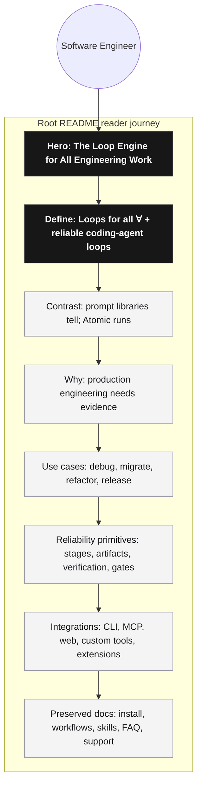

# Atomic README Loop Engine Positioning Technical Design Document / RFC

| Document Metadata      | Details |
| ---------------------- | ------- |
| Author(s)              | Norin Lavaee, Atomic GPT-5.5 |
| Status                 | Draft (WIP) |
| Team / Owner           | Atomic |
| Created / Last Updated | 2026-06-21 |
| Backwards Compatibility | Preserve existing install, docs, feature, FAQ, and package-navigation behavior; this is a docs/copy repositioning change only. |

## 1. Executive Summary

This RFC proposes updating the top-level Atomic README to position Atomic as **the loop engine for all engineering work**: core infrastructure for running coding-agent loops reliably, not a markdown prompt library. The README should lead with the brand line **“Loops for all (∀)”**, explain that Atomic runs executable loops with stages, artifacts, verification, subagents, tools, review gates, checkpoints, and human approvals, then connect that reliability to production software engineering workflows.

The heart of the change is the `introduce_loop_engine_positioning` reader-facing door: it must make a software engineer understand in seconds that Atomic is the runtime for reliable agent-driven engineering process. A second key door, `showcase_integrations`, must make it obvious that Atomic can connect to the systems engineers already use via CLI tools, MCP servers, web access, and custom extensions.

Impact: sharper category ownership, stronger differentiation from “loop library” prompt collections, clearer production value, and a README that speaks directly to day-to-day engineering work.

## 2. Context and Motivation

### 2.1 Current State

The current root README is accurate but leans on abstract phrases such as “dynamic workflows,” “workflow layer,” and “programmable control plane.” It already contains valuable sections that should largely be preserved:

- installation and authentication
- spec-driven development
- built-in workflows, skills, and subagents
- documentation links
- “what Atomic is / is not”
- execution model
- Pi foundation
- FAQ and workflow playbook

Current hero:

```md
Atomic - Dynamic Workflows for Software Engineering

Atomic is the workflow layer for coding agents, giving developers a programmable control plane for complex engineering work.
```

Current limitations:

- The phrase “dynamic workflows” is less crisp than the product concept we want to own.
- “Control plane” sounds infrastructure-heavy but does not immediately name the engineer’s day-to-day pain.
- The README does not clearly distinguish Atomic from prompt/markdown “loop libraries.”
- The integration story is present technically through MCP/extensions/tools, but not visible enough as a product promise.
- The first impression undersells production reliability: verification, artifacts, review gates, resumability, subagents, and approvals.

### 2.2 The Problem

Software engineers evaluating Atomic need to understand three things immediately:

1. **What category Atomic owns:** not a generic agent framework, not just a coding agent, not a markdown loop library — the loop engine for engineering work.
2. **Why it matters:** production engineering work fails when agents improvise process, skip verification, lose context, or claim completion without evidence.
3. **How far it can connect:** because Atomic is a coding-agent runtime with shell, MCP, extensions, web access, and custom tools, it can operate across the engineering stack: GitHub, GitLab, Jira, Linear, Notion, Slack, Sentry, Datadog, CI, cloud CLIs, databases, browsers, and internal systems.

The README should convert the existing accurate but broad copy into a sharper market position guided by the relevant principles from *The 22 Immutable Laws of Marketing*:

- **Law of Category:** create/own “loop engine for engineering work,” rather than competing as another coding agent or generic framework.
- **Law of Focus:** own “loops” while qualifying it as an engine/runtime, not a prompt list.
- **Law of Perception:** explain the problem in the engineer’s lived language: stop babysitting agents; make them produce evidence.
- **Law of Sacrifice:** remove broad intro abstractions and save detailed feature breadth for later sections.
- **Law of Candor:** acknowledge that coding agents are powerful, but production workflows need explicit process and verification.

## 3. Goals and Non-Goals

### 3.1 Functional Goals

- [ ] Update the root README title/hero to use: **“Atomic — The Loop Engine for All Engineering Work.”**
- [ ] Include the brand/philosophy line: **“Loops for all (∀).”**
- [ ] Define Atomic as infrastructure/runtime for reliable coding-agent loops, not a markdown loop library.
- [ ] Replace abstract “dynamic workflows” positioning in the intro and “Why Atomic” with direct language about engineering loops.
- [ ] Define reliability in concrete product terms: stages, isolated context, tools, artifacts, verification, subagents, checkpoints, retries, review gates, and human approvals.
- [ ] Tie Atomic to production engineering use cases: debugging, refactors, migrations, specs, tests, reviews, docs, releases, incidents, QA, and compliance-style checks.
- [ ] Add an integrations section with a logo/badge strip and a clear explanation that Atomic can integrate through CLI, MCP, web access, custom tools, and extensions.
- [ ] Preserve the useful existing README sections and navigation: get started, docs, features, workflow tables, FAQ, support, contributing, license, credits.
- [ ] Update FAQ language so comparisons to markdown checklists, Claude Code Dynamic Workflows, LangGraph, and generic agent frameworks align with the loop-engine category.
- [ ] Keep claims truthful and verifiable from current product capabilities.

### 3.2 Non-Goals

- [ ] Do not remove installation/authentication instructions.
- [ ] Do not remove existing docs links or feature tables unless replaced with equivalent or clearer coverage.
- [ ] Do not claim official partnerships or native built-in integrations unless the integration actually ships as a first-party feature.
- [ ] Do not position Atomic as “just loops” or a prompt library.
- [ ] Do not position Atomic as a replacement for all interactive coding agents in every use case.
- [ ] Do not implement code changes as part of this spec.
- [ ] Do not add unlicensed third-party logo assets to the repository without review.

## 4. Proposed Solution (High-Level Design)

### 4.1 README Narrative Architecture Diagram



### 4.2 Architectural Pattern

Use a **category-led README narrative**:

1. **Category first:** “The Loop Engine for All Engineering Work.”
2. **Brand seal:** “Loops for all (∀).”
3. **Definition:** Atomic runs reliable coding-agent loops.
4. **Differentiation:** prompt libraries tell agents what to do; Atomic runs the loop.
5. **Production proof:** reliability means evidence, verification, and gates.
6. **Breadth:** integrations via CLI, MCP, web access, custom tools, and extensions.
7. **Details:** existing features and docs remain available below the fold.

### 4.3 Key Components

| Component | Responsibility | Proposed Treatment | Justification |
| --------- | -------------- | ------------------ | ------------- |
| Hero | Set category and first impression | Replace “Dynamic Workflows” with “The Loop Engine for All Engineering Work” | Own a sharper category and avoid generic workflow phrasing. |
| Tagline | Land brand symbol | Add “Loops for all (∀).” | Ties brand concept to logo/philosophy. |
| Product definition | Explain what Atomic does | “Atomic runs reliable coding-agent loops…” | Clearer than “control plane.” |
| Reliability definition | Explain “reliable” | Bullets for stages, artifacts, verification, subagents, gates, approvals | Converts abstract claim into concrete engineering capabilities. |
| Prompt-library contrast | Avoid market confusion | “Prompt libraries tell an agent what loop to follow. Atomic runs the loop.” | Distinguishes Atomic from markdown loop collections. |
| Production workflow section | Explain why it matters | Process failures: skipped tests, lost context, no evidence, drift | Directly reflects day-to-day engineering pain. |
| Integration showcase | Show extensibility | Logo/badge strip + CLI/MCP/custom tools explanation | Makes ecosystem breadth obvious. |
| Existing README body | Preserve detail | Retain and retitle where needed | Avoid losing docs, setup, and feature depth. |

### 4.4 The Door Set at a Glance (Stranger-Across-Time View)

- `introduce_loop_engine_positioning`
- `define_reliable_agent_loops`
- `distinguish_from_prompt_libraries`
- `ground_in_production_engineering`
- `showcase_integrations`
- `preserve_get_started_path`
- `preserve_feature_reference`
- `align_faq_with_loop_engine_category`

A competent reader should infer from this list that the README introduces Atomic’s category, explains the reliability promise, differentiates from weaker loop concepts, shows production relevance, surfaces integration breadth, and keeps existing user documentation intact.

## 5. Detailed Design

### 5.1 The Doors (Reader-Facing Content Contracts)

Because this is a documentation/spec change, the “doors” are the reader-facing sections and claims through which Atomic’s product intent enters the prospect’s mind. They must be honestly named, narrowly promised, and preserve existing navigation.

#### `introduce_loop_engine_positioning`

```ts
type ReadmeHero = {
  heading: "Atomic — The Loop Engine for All Engineering Work";
  brandLine: "Loops for all (∀).";
  primaryPromise: string;
};
```

Guarantee: the first screen tells a software engineer that Atomic is infrastructure for running engineering loops with coding agents.

Named failure set:

- `TooAbstract`: copy says “workflow layer” or “control plane” before explaining the concrete use case.
- `TooNarrow`: copy implies Atomic is only a loop prompt library.
- `TooBroad`: copy implies Atomic is a generic agent framework for any domain before grounding in software engineering.

Refusals:

- Refuse hero language that leads with “dynamic workflows.”
- Refuse unqualified “loops” language that can be confused with markdown prompt collections.

Recommended hero draft:

```md
# Atomic — The Loop Engine for All Engineering Work

**Loops for all (∀).**

Atomic runs reliable coding-agent loops for the work software engineers do every day: debugging, refactors, migrations, specs, tests, reviews, docs, incidents, and releases.

Describe the loop in natural language. Program it when reliability matters. Run it with stages, tools, artifacts, subagents, verification, review gates, and human approvals.

Prompt libraries tell an agent what loop to follow. Atomic runs the loop.
```

#### `define_reliable_agent_loops`

```ts
type ReliabilityDefinition = {
  reliableMeans: Array<
    | "staged execution"
    | "isolated context"
    | "tool and MCP access"
    | "durable artifacts"
    | "verification checks"
    | "subagent delegation"
    | "checkpoints and resumability"
    | "review gates"
    | "human approval"
  >;
};
```

Guarantee: the README defines “reliable” in concrete engineering terms.

Named failure set:

- `VagueReliability`: says “reliable” without naming the mechanisms.
- `UnsupportedReliability`: promises deterministic model output rather than deterministic process structure.
- `NoEvidence`: fails to mention artifacts/checks/proof.

Refusals:

- Refuse claims that Atomic guarantees correct model output.
- Refuse claims that reliability comes from one large autonomous prompt.

Recommended section language:

```md
Reliable means the agent does not just say it finished. It leaves evidence.

Atomic reliability comes from explicit stages, isolated context, saved artifacts, shell and MCP tools, verification checks, subagent reviewers, resumable state, and human approval gates.
```

#### `distinguish_from_prompt_libraries`

```ts
type PromptLibraryContrast = {
  claim: "Prompt libraries tell an agent what loop to follow. Atomic runs the loop.";
  explanation: string;
};
```

Guarantee: a reader understands Atomic is an execution engine, not a markdown checklist collection.

Named failure set:

- `CompetitorConfusion`: copy makes Atomic sound like a list of reusable prompts.
- `OverAttack`: copy sounds dismissive or hostile toward prompt libraries.

Refusals:

- Refuse naming competitors in a hostile way.
- Refuse implying markdown instructions are useless; position them as insufficient when reliability matters.

Recommended language:

```md
Markdown loops are instructions. Atomic loops are executable systems.

A prompt can tell an agent to research, edit, test, and review. Atomic makes that process runnable: each stage can have its own context, model, tools, artifacts, checks, and approval gates.
```

#### `ground_in_production_engineering`

```ts
type ProductionEngineeringSection = {
  painPoints: string[];
  dailyLoops: string[];
  productionPromise: string;
};
```

Guarantee: the README connects Atomic’s loop engine to real production engineering workflows.

Named failure set:

- `NoDayToDayFit`: examples are too abstract for a software engineer.
- `NoProductionStakes`: copy fails to explain why checks, review, and artifacts matter.
- `AgentHypeOnly`: copy celebrates autonomy without explaining control and evidence.

Refusals:

- Refuse framing production work as “let the agent do everything.”
- Refuse “vibes-based” done claims.

Recommended section language:

```md
Most coding-agent failures are process failures.

The agent edits before it understands the codebase. It forgets the acceptance criteria. It skips the test you expected. It says “done” without evidence. It loses context halfway through a migration.

Production engineering cannot depend on vibes. Atomic gives your agent a loop: investigate, change, verify, review, and iterate until the result is safe to ship.
```

Recommended daily loops:

- `research -> spec -> implement -> test -> review -> iterate`
- `reproduce -> diagnose -> patch -> verify`
- `map callsites -> plan migration -> edit in waves -> run checks -> review`
- `inspect diff -> find risks -> request fixes -> re-check`
- `changelog -> validation -> release prep -> publish gate`

#### `showcase_integrations`

```ts
type IntegrationShowcase = {
  paths: ["CLI", "MCP", "web access", "custom tools", "extensions"];
  examples: IntegrationExample[];
  visualStyle: "logo badges" | "text grid" | "hybrid";
};

type IntegrationExample = {
  name: string;
  route: "cli" | "mcp" | "web" | "extension" | "custom_tool";
  claimLevel: "example" | "first_party" | "bring_your_own";
};
```

Guarantee: the README makes the ecosystem breadth obvious while preserving truthful claims.

Named failure set:

- `FalseNativeClaim`: implies Atomic ships first-party Jira/Notion/etc. integrations when it supports them through MCP/CLI/custom tools.
- `LogoLicenseRisk`: vendors raw logos into the repo without license review.
- `TooManyLogos`: visual strip becomes noisy and distracts from core positioning.

Refusals:

- Refuse “official integration” wording unless true.
- Refuse local logo assets unless licensing is confirmed.
- Refuse implying Atomic can access private systems without user-configured credentials/permissions.

Recommended section title:

```md
## Connect the loop to your engineering stack
```

Recommended copy:

```md
Atomic is a coding-agent runtime, so loops can use the same systems engineers already use.

Call CLIs, connect MCP servers, browse the web, invoke custom tools, or package your own extensions. Use Atomic with issue trackers, docs, observability, CI, cloud platforms, databases, browsers, and internal services — wherever your engineering loop needs evidence or action.
```

Recommended badge/logo examples, grouped by claim level:

| System | Route | Claim Wording |
| ------ | ----- | -------------- |
| GitHub | CLI / MCP / web | “via `gh`, MCP, or web” |
| GitLab | CLI / MCP / web | “via `glab`, MCP, or web” |
| Jira | MCP / API/custom tool | “via MCP or custom tool” |
| Linear | MCP / API/custom tool | “via MCP or custom tool” |
| Notion | MCP / API/custom tool | “via MCP or custom tool” |
| Slack | MCP / API/custom tool | “via MCP or custom tool” |
| Sentry | CLI / MCP / API/custom tool | “via CLI, MCP, or custom tool” |
| Datadog | CLI / API/custom tool | “via CLI or custom tool” |
| Docker | CLI | “via CLI” |
| Kubernetes | CLI | “via `kubectl`” |
| AWS | CLI / MCP | “via AWS CLI or MCP” |
| Google Cloud | CLI | “via `gcloud`” |
| Azure | CLI | “via `az`” |
| PostgreSQL | CLI / MCP/custom tool | “via `psql`, MCP, or custom tool” |
| Playwright | CLI/skill | “via browser automation” |
| Figma | MCP / API/custom tool | “via MCP or custom tool” |

Recommended visual approach:

- Prefer Shields.io/Simple Icons badges or a clean text grid to avoid storing logo files.
- Include a note: “Examples shown are connection paths, not all first-party bundled integrations.”
- Keep first-party bundled capabilities separate: workflows, subagents, MCP adapter, web access, intercom.

Example badge strip concept:

```md
<p align="center">
  
  
  
  
  
  
</p>
```

#### `preserve_get_started_path`

Guarantee: existing install/authentication path remains easy to find and unchanged except for minor copy polish.

Named failure set:

- `InstallRegression`: user cannot quickly install Atomic.
- `ProviderRegression`: provider setup information becomes harder to find.

Refusals:

- Refuse moving setup so far down that new users cannot start.
- Refuse removing warnings about autonomous workflow execution in safe environments.

#### `preserve_feature_reference`

Guarantee: existing workflows, skills, subagents, docs, and FAQ remain discoverable.

Named failure set:

- `FeatureLoss`: README no longer explains built-ins.
- `DocsLoss`: docs links disappear or become stale.

Refusals:

- Refuse deleting workflow/skill/subagent tables without equivalent replacement.

#### `align_faq_with_loop_engine_category`

Guarantee: FAQ answers reinforce the loop-engine positioning and compare honestly against alternatives.

Named failure set:

- `OldCategoryLeak`: FAQ keeps leading with “dynamic workflows” as the main category.
- `UnsupportedComparison`: comparisons overstate competitor limitations.

Refusals:

- Refuse hostile competitor copy.
- Refuse unsupported claims about competitors.

### 5.2 Proposed README Outline

```md
# Atomic — The Loop Engine for All Engineering Work

[Promo GIF]

Loops for all (∀).
Short definition.
Reliability mechanisms.
Prompt-library contrast.
Navigation and badges.

## Get started
[Preserve current install/auth flow]

## Why Atomic
[Production engineering cannot depend on vibes]
[Most coding-agent failures are process failures]
[Atomic gives the agent a loop]

## The loops engineers actually run
[Research/spec/implementation/test/review]
[Debug/reproduce/diagnose/patch/verify]
[Migration/map/edit/check/review]
[Release/changelog/validate/publish]

## What makes a loop reliable?
[Stages, context, tools, artifacts, checks, subagents, checkpoints, gates, approvals]

## Connect the loop to your engineering stack
[Logo/badge strip]
[CLI, MCP, web access, custom tools, extensions]
[Truthful route table]

## Spec-driven development
[Keep, but update framing to “built-in loop”]

## What you get
[Workflows, skills, subagents]

## Documentation
[Keep]

## What Atomic is / what Atomic is not
[Update to loop engine]

## What happens during a run?
[Update “workflow graph” language to “loop execution graph” where helpful]

## Built on Pi, extended for loops
[Keep Pi foundation, update wording]

## FAQ
[Update comparisons]

## Workflow playbook / Support / Contributing / License / Credits
[Keep]
```

### 5.3 Data Model / Content Inventory

No application data model changes are required.

README content inventory to preserve:

| Existing Content | Preserve? | Change Needed |
| ---------------- | --------- | ------------- |
| Promo GIF | Yes | Keep near hero. |
| Badges | Yes | Possibly add integration badges later. |
| Get Started | Yes | Keep install/auth details intact. |
| Migration from another coding agent | Yes | Keep `llms.txt`; maybe move after Get Started. |
| Spec-driven development | Yes | Reframe as an example engineering loop. |
| Why Atomic | Yes | Rewrite around loop engine / production reliability. |
| What you get | Yes | Keep tables; adjust intro language. |
| Documentation | Yes | Keep. |
| What Atomic is/is not | Yes | Rewrite first bullets. |
| What happens during a run | Yes | Reword as loop execution graph. |
| Built on Pi | Yes | Reword as Pi harness + Atomic loop engine. |
| FAQ | Yes | Align category language. |

### 5.4 Copy Rules

- Prefer short sentences.
- Prefer engineer verbs: research, reproduce, diagnose, patch, verify, review, migrate, release.
- Avoid unexplained abstractions in the first screen: “control plane,” “dynamic workflows,” “orchestration.”
- Use “runtime” and “engine” to signal infrastructure.
- Always qualify “loops” with execution/reliability language near first use.
- Do not claim deterministic model output; claim deterministic, inspectable process structure.
- Use “evidence” as the reliability anchor.
- Keep competitor references factual and calm.

## 6. Alternatives Considered

| Option | Pros | Cons | Decision |
| ------ | ---- | ---- | -------- |
| Keep “Dynamic Workflows for Software Engineering” | Accurate and already implemented | Less memorable; overlaps with other workflow/orchestration language; weaker first impression | Reject |
| “Loops for Coding Agents” | Very crisp | Too easy to confuse with markdown loop libraries | Reject as primary headline |
| “Programmable Loops for Coding Agents” | Better differentiation | Still sounds like prompt/programming pattern more than core runtime | Considered but not primary |
| “The Agent Loop Runtime” | Strong infrastructure signal | Less emotionally broad than “all engineering work” | Use as supporting phrase |
| “The Loop Engine for All Engineering Work” | Broad, memorable, category-setting, ties to “Loops for all (∀)” | Needs immediate explanation to avoid prompt-library confusion | Select |

## 7. Cross-Cutting Concerns

### 7.1 Truthfulness and Legal/Brand Safety

- Integration examples must be framed as connection routes, not official partnerships.
- Logo usage should prefer generated badges/Simple Icons or a text grid unless legal review approves local assets.
- Claims about competitors should be comparative by category, not disparaging.

### 7.2 Accessibility

- Badge/logo strip must include alt text.
- Do not rely on logos alone; include a text explanation/table.
- Keep heading hierarchy valid.

### 7.3 SEO and Discovery

Target phrases to include naturally:

- coding agent runtime
- agent loop engine
- software engineering workflows
- MCP tools
- coding-agent loops
- workflow automation for developers
- subagents
- artifacts
- review gates
- verification

### 7.4 Backwards Compatibility

This change does not alter package behavior, CLI behavior, APIs, workflow definitions, or docs paths. It must preserve:

- install commands
- provider/model setup references
- docs links
- workflow and skill discoverability
- safety warnings
- package identity and license/credits

## 8. Test Plan

- **Markdown render check:** preview the README and verify headings, tables, badges, and Mermaid-free sections render correctly on GitHub.
- **Link check:** verify all existing internal links still resolve after heading changes.
- **Copy audit:** scan for stale first-screen phrases such as “Dynamic Workflows for Software Engineering” and decide whether each remaining use is intentional.
- **Truthfulness audit:** check every integration example for claim level: first-party, CLI-accessible, MCP-accessible, web-accessible, custom-tool example.
- **Accessibility audit:** verify image/badge alt text and ensure integration logos are not the only source of meaning.
- **Docs consistency check:** update any user-facing docs in `packages/coding-agent/docs` if they quote the old README positioning or hero language.
- **Repository validation:** run a quick markdown/link-oriented check if available; otherwise use `rg` to confirm heading anchors referenced by the README nav still exist.

## 9. Open Questions / Unresolved Issues

### Resolved Direction

- [x] Headline: use **“Atomic — The Loop Engine for All Engineering Work.”** This is broad, memorable, and pairs cleanly with “Loops for all (∀).”
- [x] Integration presentation: use **badges plus a text grid**. Badges provide quick recognition; the grid explains CLI, MCP, API, web, and custom-tool routes truthfully.
- [x] Initial implementation scope: update the **root README first**. Propagate to package docs only after the messaging is reviewed and stable, unless a package doc directly quotes the old positioning.

### Still Open

- [ ] Should “Loops for all (∀)” appear as a visible bold line, in the hero paragraph, or as a logo-style microtag?
- [ ] Which integration examples should be in the first visible badge row so the section feels broad but not noisy?
- [ ] Should “dynamic workflows” be removed entirely from the root README or retained in deeper/technical sections as a legacy/descriptive phrase?

## 10. Implementation Phases

### Phase 1 — Rewrite the root hero and intro

- Replace title and centered intro copy.
- Add “Loops for all (∀).”
- Add one crisp definition of Atomic as loop engine/runtime.
- Add prompt-library contrast.

### Phase 2 — Rewrite “Why Atomic” around production reliability

- Lead with process failures.
- Explain production engineering needs evidence.
- Define the loop as investigate/change/verify/review/iterate.

### Phase 3 — Add reliability and daily-loop sections

- Add “The loops engineers actually run.”
- Add “What makes a loop reliable?”
- Use concrete examples and mechanisms.

### Phase 4 — Add integrations section

- Add logo/badge strip or text grid.
- Explain CLI, MCP, web access, custom tools, and extensions.
- Include route/claim wording so examples are truthful.

### Phase 5 — Align existing sections

- Update “Spec-driven development,” “What you get,” “What Atomic is/is not,” “What happens during a run,” “Built on Pi,” and FAQ language.
- Preserve install/docs/details.

### Phase 6 — Validate and polish

- Check heading anchors and links.
- Review claims for truthfulness.
- Ensure copy is crisp and direct.
- Update related user-facing docs if they quote or depend on the old positioning.
